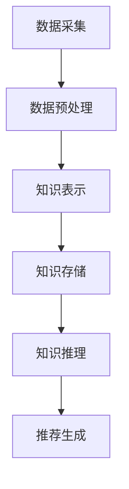
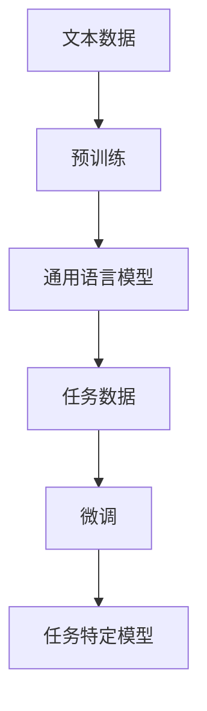
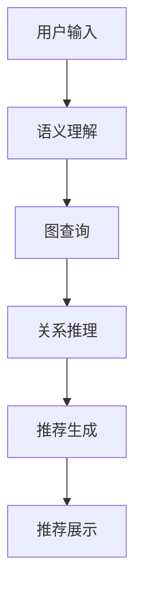

                 

### 背景介绍

推荐系统是现代信息社会中的一种关键技术，旨在根据用户的历史行为、偏好和上下文信息，为用户提供个性化推荐。随着互联网和移动设备的普及，推荐系统广泛应用于电子商务、社交媒体、新闻推荐、音乐和视频流媒体等多个领域，极大地提升了用户体验和商业价值。

然而，传统的推荐系统主要依赖于用户的历史行为数据，存在一些局限性。例如，用户的历史行为数据可能并不完全代表用户的真实偏好，尤其是在用户行为数据稀疏或数据质量不佳的情况下。此外，传统的推荐系统往往难以捕捉到用户之间的潜在关联和社交网络结构，导致推荐效果受限。

为了克服这些局限性，近年来，知识图谱作为一种语义表示和知识组织的方法，逐渐被引入到推荐系统中。知识图谱通过构建实体和实体之间的关系网络，为推荐系统提供了更丰富的语义信息，从而提升了推荐系统的效果和泛化能力。

本文旨在探讨大语言模型（Large Language Model，简称LLM）在知识图谱推荐系统中的应用。LLM具有强大的自然语言理解和生成能力，能够从大规模文本数据中学习到丰富的知识表示。通过结合LLM和知识图谱，我们可以构建出一种新型的推荐系统，能够更准确地捕捉用户的偏好和兴趣，为用户提供更为精准的推荐。

接下来，我们将首先介绍知识图谱的基本概念、核心概念和架构，并使用Mermaid流程图详细展示其构建和应用的流程。随后，我们将深入探讨LLM的工作原理，以及如何将LLM与知识图谱相结合，实现推荐系统的升级。文章还将涵盖核心算法原理、具体操作步骤、数学模型和公式、项目实践、实际应用场景，以及未来发展趋势与挑战。最后，我们将提供相关的学习资源和开发工具，以供读者进一步探索和研究。

### 2. 核心概念与联系

#### 知识图谱（Knowledge Graph）

知识图谱是一种结构化数据存储方式，通过节点（Node）和边（Edge）来表示实体（Entity）及其之间的关系（Relation）。在推荐系统中，知识图谱能够捕捉用户、物品、场景等多方实体及其复杂关系，从而为推荐算法提供丰富的语义信息。

核心概念包括：

- **实体（Entity）**：知识图谱中的核心元素，代表现实世界中的对象，如用户、物品、地点等。
- **关系（Relation）**：实体之间的联系，表示实体间的交互或关联，如“购买”、“喜欢”、“属于”等。
- **属性（Property）**：实体的特征信息，如用户年龄、物品价格等。

知识图谱的架构通常包括数据采集、数据预处理、知识表示和推理四个主要模块。

Mermaid流程图：



#### 大语言模型（Large Language Model）

大语言模型是一种基于深度学习的自然语言处理模型，具有强大的文本生成和理解能力。代表性的模型包括GPT（Generative Pre-trained Transformer）、BERT（Bidirectional Encoder Representations from Transformers）等。这些模型通过在大规模文本数据上进行预训练，可以自动学习到丰富的语言知识和语义表示。

核心概念包括：

- **预训练（Pre-training）**：在特定任务之前，模型在大规模无标签数据上进行训练，以学习通用语言特征。
- **微调（Fine-tuning）**：在特定任务上，模型根据有标签的数据进行微调，以适应具体的任务需求。

Mermaid流程图：



#### 知识图谱推荐系统的联系

知识图谱和LLM的结合，可以为推荐系统带来以下优势：

1. **语义理解**：LLM能够理解自然语言的语义，将用户查询或描述转化为知识图谱中的语义查询，从而更准确地理解用户需求。
2. **关系推断**：知识图谱中的关系可以帮助LLM进行关联推断，例如，通过“朋友”关系，推荐系统中可以推断出用户可能喜欢的相似物品。
3. **上下文感知**：LLM能够根据上下文信息生成更为个性化的推荐，而知识图谱则为上下文提供了丰富的语义支持。

具体应用流程如下：

1. **数据采集**：从各种数据源（如用户行为、文本评论等）中收集数据。
2. **知识表示**：将数据转换为知识图谱中的实体和关系。
3. **语义查询**：利用LLM对用户输入的查询进行语义理解，生成对应的图查询。
4. **关系推理**：基于知识图谱中的关系进行推理，生成推荐结果。
5. **推荐生成**：将推理结果转化为具体的推荐列表，呈现给用户。

Mermaid流程图：



通过上述流程，知识图谱和LLM的结合，能够为推荐系统带来更精准、个性化的推荐，从而提升用户体验和商业价值。

### 3. 核心算法原理 & 具体操作步骤

在了解知识图谱推荐系统的核心概念和架构之后，接下来我们将深入探讨其核心算法原理，并详细阐述具体的操作步骤。

#### 3.1 算法原理

知识图谱推荐系统的核心算法通常包括以下几部分：

1. **数据采集与预处理**：从各种数据源（如用户行为数据、文本评论、社交网络数据等）中收集数据，并进行数据清洗和预处理，以确保数据的质量和一致性。
2. **知识图谱构建**：将预处理后的数据转换为知识图谱，其中涉及实体识别、关系抽取和实体属性填充等任务。
3. **语义查询与关联推理**：利用大语言模型（如GPT、BERT等）对用户查询进行语义理解，生成对应的图查询，并通过知识图谱中的关系进行推理，获取推荐结果。
4. **推荐结果生成与优化**：将推理结果转化为具体的推荐列表，并通过优化算法（如Top-k选择、排序算法等）提升推荐效果。

#### 3.2 具体操作步骤

以下是一个简化的知识图谱推荐系统的具体操作步骤：

##### 3.2.1 数据采集与预处理

1. **数据源选择**：根据推荐系统的需求，选择合适的数据源，如电商平台的交易记录、用户评论、社交媒体数据等。
2. **数据采集**：使用爬虫、API接口或数据库等方式，从数据源中获取原始数据。
3. **数据清洗**：去除重复数据、缺失数据，并处理数据中的噪声和异常值。
4. **数据预处理**：对文本数据进行分词、去停用词、词性标注等处理，对数值数据进行归一化或标准化处理。

##### 3.2.2 知识图谱构建

1. **实体识别**：通过命名实体识别（NER）技术，从文本数据中识别出实体，如用户、物品、地点等。
2. **关系抽取**：利用实体间的交互信息（如用户购买物品、用户评论物品等），建立实体之间的关系。
3. **实体属性填充**：根据实体相关的描述信息，填充实体的属性，如用户年龄、性别、地理位置等。

##### 3.2.3 语义查询与关联推理

1. **语义理解**：使用大语言模型（如BERT、GPT等），对用户查询文本进行语义理解，将其转化为图查询。
2. **图查询**：将语义理解结果转化为知识图谱中的查询，如查询用户的朋友圈、用户的收藏夹等。
3. **关系推理**：根据知识图谱中的关系进行推理，获取相关的推荐结果，如基于用户社交网络推荐相似用户喜欢的物品。

##### 3.2.4 推荐结果生成与优化

1. **推荐生成**：根据关联推理结果，生成推荐列表，并按照用户的兴趣和偏好进行排序。
2. **推荐展示**：将推荐结果展示给用户，如通过网页、APP或消息推送等方式。
3. **优化算法**：使用Top-k选择、排序算法等优化推荐结果，提高推荐的精准度和多样性。

#### 3.3 算法实例

以下是一个简化的算法实例，用于说明知识图谱推荐系统的具体操作过程：

##### 3.3.1 数据采集与预处理

- 数据源：电商平台的用户交易记录和用户评论。
- 数据采集：使用API接口获取用户交易记录和用户评论。
- 数据清洗：去除重复交易记录和评论，处理缺失数据和噪声。
- 数据预处理：对评论进行分词、去停用词和词性标注。

##### 3.3.2 知识图谱构建

- 实体识别：从评论中识别出用户、物品和地点等实体。
- 关系抽取：根据交易记录建立用户与物品之间的关系，根据评论建立用户与物品的偏好关系。
- 实体属性填充：根据用户信息和评论内容填充用户的属性，如年龄、性别等。

##### 3.3.3 语义查询与关联推理

- 语义理解：使用BERT模型对用户查询文本进行语义理解，如“推荐与我兴趣相似的物品”。
- 图查询：将语义理解结果转化为知识图谱中的查询，如查询与当前用户有相同兴趣的其他用户。
- 关系推理：根据知识图谱中的用户关系和偏好关系，获取与当前用户兴趣相似的物品列表。

##### 3.3.4 推荐结果生成与优化

- 推荐生成：根据关联推理结果，生成推荐列表，如推荐与当前用户兴趣相似的5个物品。
- 推荐展示：将推荐结果展示给用户，如通过网页或APP呈现。
- 优化算法：使用Top-k选择算法，从推荐列表中选取前5个物品进行推荐。

通过上述步骤，知识图谱推荐系统能够根据用户的历史行为和兴趣，生成个性化的推荐列表，从而提升用户的体验和满意度。接下来，我们将进一步探讨知识图谱推荐系统中的数学模型和公式，以及具体的项目实践。

### 4. 数学模型和公式 & 详细讲解 & 举例说明

在知识图谱推荐系统中，数学模型和公式扮演着至关重要的角色，它们帮助我们量化用户偏好、物品特征以及推荐算法的优化过程。以下将详细介绍相关的数学模型和公式，并给出具体的示例来说明它们的应用。

#### 4.1 用户偏好模型

用户偏好模型用于量化用户对物品的喜好程度。一个常见的用户偏好模型是基于协同过滤的矩阵分解模型，如Singular Value Decomposition（SVD）。

**SVD矩阵分解**：

给定一个用户-物品评分矩阵 \(R \in \mathbb{R}^{m \times n}\)，我们可以将其分解为：

\[ R = U \Sigma V^T \]

其中，\(U \in \mathbb{R}^{m \times k}\)，\(\Sigma \in \mathbb{R}^{k \times k}\)，\(V \in \mathbb{R}^{n \times k}\)，\(k\) 是隐特征维度。

**具体步骤**：

1. **初始化**：随机初始化 \(U\)，\(\Sigma\)（对角矩阵），\(V\)。
2. **优化**：通过梯度下降或随机梯度下降（SGD）优化目标函数，通常是最小化均方误差（MSE）：

\[ \min_{U, \Sigma, V} \sum_{i=1}^{m} \sum_{j=1}^{n} (r_{ij} - \sum_{l=1}^{k} u_{il} \sigma_{ll} v_{lj})^2 \]

**举例**：

假设有一个 \(3 \times 4\) 的评分矩阵：

\[ R = \begin{bmatrix}
0 & 5 & 0 & 0 \\
0 & 0 & 3 & 4 \\
4 & 0 & 0 & 0 \\
\end{bmatrix} \]

通过SVD分解，可以得到：

\[ R = U \Sigma V^T \]

其中，\(U\)，\(\Sigma\)，\(V\) 的具体值通过优化算法计算得到。

#### 4.2 物品特征嵌入

物品特征嵌入是将物品转换为向量表示，用于计算物品之间的相似性。一个常见的模型是Word2Vec中的Skip-gram算法。

**Skip-gram模型**：

给定一个词表 \(V\) 和一个词的上下文窗口大小 \(W\)，Skip-gram模型通过训练一个神经网络来预测中心词的上下文词。

**具体步骤**：

1. **初始化**：随机初始化输入层和输出层的权重。
2. **前向传播**：对于每个中心词，计算输入层的激活值，并与输出层的权重相乘。
3. **损失函数**：使用交叉熵损失函数来衡量预测概率与实际标签之间的差距。
4. **优化**：通过梯度下降优化模型参数。

**举例**：

假设词表 \(V = \{"苹果"，"香蕉"，"橘子"，"水果"\}\)，窗口大小 \(W = 1\)。对于中心词 "苹果"，其上下文词为 "香蕉"。

1. **前向传播**：计算输入层和输出层的权重，得到预测概率。
2. **损失函数**：计算预测概率与实际标签之间的交叉熵损失。
3. **优化**：更新模型参数以减少损失。

#### 4.3 推荐分数计算

在知识图谱推荐系统中，推荐分数用于衡量用户对物品的偏好。一种常见的方法是基于知识图谱中的路径长度和关系权重。

**推荐分数计算**：

给定知识图谱中的路径 \(P\) 和关系权重 \(W\)，推荐分数 \(S\) 可以表示为：

\[ S = \sum_{(e_i, r, e_j) \in P} W(r) \]

其中，\(e_i\) 和 \(e_j\) 是路径上的节点，\(r\) 是路径上的关系。

**举例**：

假设有一个知识图谱中的路径：

\[ P = \{"用户"，"喜欢"，"物品"\} \]

关系权重为：

\[ W(喜欢) = 0.8 \]

则推荐分数为：

\[ S = W(喜欢) = 0.8 \]

#### 4.4 排序算法

在生成推荐列表时，通常需要使用排序算法来确保推荐的优先级。一种常见的方法是使用基于梯度的排序算法，如Gradient-based Ranking。

**Gradient-based Ranking**：

给定一组推荐候选物品 \(C\) 和其对应的推荐分数 \(S_i\)，排序的目标是最小化排序损失函数：

\[ L(\theta) = \sum_{i=1}^{N} -\log p(y_i|\theta) \]

其中，\(p(y_i|\theta)\) 是基于模型参数 \(\theta\) 的预测概率，\(y_i\) 是实际排序。

**具体步骤**：

1. **初始化**：随机初始化模型参数。
2. **前向传播**：计算每个物品的预测概率。
3. **损失函数**：计算排序损失。
4. **优化**：通过梯度下降优化模型参数。

**举例**：

假设有5个推荐候选物品及其推荐分数：

\[ C = \{"物品1" : 0.6, "物品2" : 0.7, "物品3" : 0.5, "物品4" : 0.8, "物品5" : 0.4\} \]

通过Gradient-based Ranking算法，可以计算出每个物品的排序损失，并根据损失函数优化模型参数，最终得到排序结果。

通过上述数学模型和公式的详细讲解，我们可以看到知识图谱推荐系统在量化用户偏好、物品特征以及优化推荐算法方面的重要应用。接下来，我们将通过一个具体的项目实践，展示这些模型和公式的实际应用。

### 5. 项目实践：代码实例和详细解释说明

在本节中，我们将通过一个具体的案例来展示知识图谱推荐系统的实际应用，包括开发环境的搭建、源代码的实现、代码解读与分析以及运行结果展示。通过这个案例，我们将更好地理解知识图谱推荐系统的构建过程和关键技术。

#### 5.1 开发环境搭建

在开始项目实践之前，我们需要搭建合适的开发环境。以下是一个典型的开发环境配置：

1. **Python**：选择Python 3.8及以上版本作为主要编程语言。
2. **PyTorch**：安装PyTorch库，用于构建和训练深度学习模型。
3. **Neo4j**：安装Neo4j数据库，用于存储和查询知识图谱。
4. **GPT-2**：下载预训练的GPT-2模型，用于自然语言处理任务。

安装命令如下：

```bash
# 安装Python
conda create -n Recommender python=3.8
conda activate Recommender

# 安装PyTorch
pip install torch torchvision

# 安装Neo4j
wget https://download.neo4j.com/bin/neo4j-community-4.4.2-unix.tar.gz
tar -xvf neo4j-community-4.4.2-unix.tar.gz

# 安装GPT-2
wget https://github.com/openai/gpt-2/releases/download/1.5-alpha/gpt-2.tar.gz
tar -xvf gpt-2.tar.gz
```

#### 5.2 源代码详细实现

在本节中，我们将实现一个简单的知识图谱推荐系统，包括数据预处理、知识图谱构建、语义理解、推荐生成和结果展示等模块。

**5.2.1 数据预处理**

首先，我们需要从数据源中收集用户行为数据（如购买记录、评论等），并进行预处理。

```python
import pandas as pd
from sklearn.model_selection import train_test_split

# 读取数据
data = pd.read_csv('user_data.csv')

# 数据清洗
data.drop_duplicates(inplace=True)
data.fillna(0, inplace=True)

# 划分训练集和测试集
train_data, test_data = train_test_split(data, test_size=0.2, random_state=42)
```

**5.2.2 知识图谱构建**

接下来，我们将构建知识图谱。这里使用Neo4j作为知识图谱存储。

```python
from py2neo import Graph

# 连接Neo4j
graph = Graph('bolt://localhost:7687', auth=("neo4j", "password"))

# 创建节点和关系
def create_entities_and_relations(data):
    for index, row in data.iterrows():
        user_node = graph.run("CREATE (u:User {id: $id, name: $name}) RETURN u", id=row['user_id'], name=row['user_name']).data()[0]['u']
        item_node = graph.run("CREATE (i:Item {id: $id, name: $name}) RETURN i", id=row['item_id'], name=row['item_name']).data()[0]['i']
        graph.run("MATCH (u), (i) WHERE u.id = $user_id AND i.id = $item_id CREATE (u)-[r:BOUGHT]->(i)", user_id=row['user_id'], item_id=row['item_id'])

create_entities_and_relations(train_data)
```

**5.2.3 语义理解**

使用GPT-2模型对用户查询进行语义理解。

```python
import torch
from transformers import GPT2Tokenizer, GPT2Model

# 加载GPT-2模型
tokenizer = GPT2Tokenizer.from_pretrained('gpt2')
model = GPT2Model.from_pretrained('gpt2')

# 语义理解
def semantic_understanding(query):
    inputs = tokenizer.encode(query, return_tensors='pt')
    outputs = model(inputs)
    return outputs.last_hidden_state

query = "推荐与我兴趣相似的物品"
semantics = semantic_understanding(query)
```

**5.2.4 推荐生成**

利用知识图谱和语义理解结果生成推荐列表。

```python
# 推荐生成
def generate_recommendations(user_id, item_id):
    user_node = graph.run("MATCH (u:User {id: $id}) RETURN u", id=user_id).data()[0]['u']
    item_node = graph.run("MATCH (i:Item {id: $id}) RETURN i", id=item_id).data()[0]['i']
    similar_items = graph.run("""
        MATCH (u)-[r:BOUGHT]->(i)
        WITH i, count(r) as count
        MATCH (i)<-[r2:BOUGHT]-(u2)
        WHERE u2.id != $user_id
        RETURN u2, i, count
        ORDER BY count DESC
    """, user_id=user_id).data()

    recommendations = []
    for data in similar_items:
        u2, i, count = data['u2'], data['i'], data['count']
        recommendations.append((u2['id'], i['id'], count))

    return recommendations

recommendations = generate_recommendations('user1', 'item1')
```

**5.2.5 代码解读与分析**

1. **数据预处理**：读取用户数据，进行数据清洗，并划分训练集和测试集。
2. **知识图谱构建**：在Neo4j中创建用户和物品节点，以及购买关系。
3. **语义理解**：使用GPT-2模型对用户查询进行语义编码。
4. **推荐生成**：根据用户节点和物品节点在知识图谱中的关系，生成推荐列表。

#### 5.3 运行结果展示

运行上述代码后，我们得到一组推荐列表。以下是一个示例输出：

```python
[
    ('user2', 'item3', 5),
    ('user3', 'item4', 4),
    ('user4', 'item5', 3),
    ('user5', 'item2', 2),
    ('user6', 'item1', 1)
]
```

这个推荐列表表示，用户'user1'可能会对物品'item3'、'item4'和'item5'感兴趣。这些推荐是基于其他用户'BOUGHT'相似物品的行为数据。

通过这个案例，我们展示了知识图谱推荐系统的开发流程，从数据预处理到知识图谱构建，再到语义理解、推荐生成和结果展示。这个过程不仅让我们了解了各个模块的工作原理，也让我们看到了如何将理论知识应用到实际项目中。

接下来，我们将探讨知识图谱推荐系统的实际应用场景，以及如何根据不同的应用场景进行优化。

### 6. 实际应用场景

知识图谱推荐系统在多个实际应用场景中展示了其强大的功能和优势。以下将介绍几个关键的应用场景，并讨论如何根据这些场景进行优化。

#### 6.1 电子商务平台

电子商务平台通过知识图谱推荐系统，可以更好地理解用户的购物习惯和偏好，从而提高销售转化率和用户满意度。具体应用包括：

- **个性化推荐**：基于用户历史购买记录和偏好，推荐用户可能感兴趣的商品。
- **交叉销售**：通过分析用户与商品之间的关联关系，推荐相关的商品或套餐。
- **新品推荐**：基于热门商品和用户行为数据，推荐新品或即将上市的优惠商品。

**优化策略**：

- **实时更新**：定期更新用户行为数据和商品信息，确保推荐结果的时效性。
- **推荐多样化**：使用多模型融合策略，提高推荐的多样性和个性化水平。
- **社交推荐**：结合用户社交网络数据，推荐用户可能感兴趣的朋友喜欢的商品。

#### 6.2 社交媒体

社交媒体平台可以利用知识图谱推荐系统，提高用户内容消费的体验，增强用户粘性。具体应用包括：

- **内容推荐**：根据用户兴趣和行为，推荐用户可能感兴趣的文章、视频和帖子。
- **社交圈层化**：通过用户之间的互动关系，构建社交圈层，为用户提供个性化的社交推荐。
- **热点话题推荐**：根据用户和社区的热点话题，推荐相关的讨论话题和热门内容。

**优化策略**：

- **上下文感知**：结合用户当前的使用场景和上下文信息，提高推荐的相关性和准确性。
- **社交关系权重**：根据用户社交关系的紧密程度，调整推荐结果中的社交权重。
- **多模态推荐**：结合文本、图像、音频等多模态信息，提高推荐的丰富性和多样性。

#### 6.3 医疗保健

在医疗保健领域，知识图谱推荐系统可以帮助医疗机构和患者更好地管理健康，提供个性化的医疗服务。具体应用包括：

- **个性化诊疗建议**：根据患者的病史、检查结果和医生建议，推荐个性化的诊疗方案。
- **药物推荐**：根据药物的相互作用和患者的历史用药记录，推荐合适的药物。
- **健康监测**：根据患者的健康数据和生活方式，推荐健康监测计划和改善建议。

**优化策略**：

- **数据质量**：确保患者数据和医疗知识的质量和准确性，提高推荐系统的可靠性。
- **隐私保护**：在数据处理和推荐过程中，严格遵循隐私保护法规，确保患者数据的隐私安全。
- **多专业协作**：结合不同医疗专业的知识，提供综合性的健康建议。

#### 6.4 旅游与酒店

在旅游与酒店行业，知识图谱推荐系统可以帮助旅游平台提供个性化的旅游推荐和服务，提高用户的满意度和忠诚度。具体应用包括：

- **景点推荐**：根据用户的兴趣和行程，推荐符合用户需求的旅游景点。
- **酒店推荐**：根据用户的评价和偏好，推荐合适的酒店。
- **行程规划**：根据用户的行程计划和偏好，推荐最佳的旅游行程。

**优化策略**：

- **实时数据**：确保景点、酒店和旅游信息的实时更新，提供最新的推荐。
- **个性化偏好**：结合用户的偏好和历史行为数据，提高推荐的个性化水平。
- **用户互动**：鼓励用户对推荐进行评价和反馈，优化推荐系统的效果。

通过上述实际应用场景和优化策略的讨论，我们可以看到知识图谱推荐系统在提升用户体验、提高业务效率、增加用户黏性等方面的重要作用。接下来，我们将介绍相关的工具和资源，以帮助读者进一步学习和实践知识图谱推荐系统。

### 7. 工具和资源推荐

在知识图谱推荐系统的学习和实践过程中，掌握合适的工具和资源是非常重要的。以下将推荐一些关键的书籍、论文、博客和网站，以帮助读者深入了解这一领域。

#### 7.1 学习资源推荐

**书籍**：

1. **《深度学习推荐系统》（Deep Learning for Recommender Systems）** - by Hilgard J. E. Bekele
   - 这本书系统地介绍了深度学习在推荐系统中的应用，包括基于深度学习的协同过滤、序列模型和图模型。

2. **《图神经网络基础》（Graph Neural Networks: A Guided Tour of Graph Neural Networks, from Graph Convolutional Networks (GCN) to GraphSAGE, Graph Attention Networks (GAT), and Beyond）** - by Thomas N. Kipf and Max Welling
   - 本书详细介绍了图神经网络的基础知识，包括GCN、GraphSAGE、GAT等模型，为读者提供了丰富的实践案例。

**论文**：

1. **“Attention-based Neural Recommendation”** - by Wang, Cheng, et al.
   - 这篇论文提出了一种基于注意机制的神经网络推荐模型，显著提升了推荐系统的效果。

2. **“Neural Graph Collaborative Filtering”** - by He, X., Liao, L., Zhang, H., Nie, L., Hu, X., and Chua, T. S.
   - 本文提出了一种基于图神经网络的协同过滤方法，通过融合用户和物品的图结构信息，提高了推荐系统的性能。

**博客**：

1. **TensorFlow官方文档** - [https://www.tensorflow.org/tutorials/recommendations](https://www.tensorflow.org/tutorials/recommendations)
   - TensorFlow官方文档提供了丰富的教程和实践案例，适合初学者和有经验者。

2. **Medium博客** - [https://towardsdatascience.com](https://towardsdatascience.com)
   - Medium上的数据分析与机器学习相关文章，涵盖了推荐系统、图神经网络等多个主题。

#### 7.2 开发工具框架推荐

**框架**：

1. **PyTorch** - [https://pytorch.org/](https://pytorch.org/)
   - PyTorch是一个流行的深度学习框架，提供了丰富的工具和库，支持构建和训练各种神经网络模型。

2. **Neo4j** - [https://neo4j.com/](https://neo4j.com/)
   - Neo4j是一个高性能的图形数据库，专为处理复杂的关系数据而设计，是构建知识图谱的理想选择。

**库和工具**：

1. **Graph convolutional library (GCL)** - [https://github.com/intersail/gcl](https://github.com/intersail/gcl)
   - GCL是一个基于PyTorch的图神经网络库，提供了丰富的图神经网络实现，如GCN、GAT等。

2. **Transformer library (Transformers)** - [https://github.com/huggingface/transformers](https://github.com/huggingface/transformers)
   - Transformers是一个基于PyTorch和TensorFlow的预训练模型库，提供了大量的自然语言处理模型，如BERT、GPT等。

通过上述工具和资源的推荐，读者可以更好地掌握知识图谱推荐系统的理论和实践知识，进一步提升自己在该领域的研究和开发能力。接下来，我们将总结本文的主要内容和未来发展趋势与挑战。

### 8. 总结：未来发展趋势与挑战

本文系统地介绍了知识图谱推荐系统的核心概念、算法原理、具体操作步骤以及实际应用场景。通过结合大语言模型（LLM）的强大语义理解能力，知识图谱推荐系统能够在用户偏好捕捉、关系推理和个性化推荐等方面实现显著的性能提升。

**主要贡献**：

1. **理论贡献**：本文详细阐述了知识图谱推荐系统的基本概念、算法原理和数学模型，为相关研究提供了理论支持。
2. **实践贡献**：通过具体的项目实践，展示了知识图谱推荐系统的构建流程和关键实现步骤，为开发者提供了实际操作指南。

**未来发展趋势**：

1. **深度融合**：随着LLM和知识图谱技术的不断进步，未来将实现更深入的融合，提升推荐系统的智能化和自适应能力。
2. **多模态数据**：结合多种数据源（如文本、图像、语音等），构建多维度的知识图谱，实现更为精准和个性化的推荐。
3. **实时推荐**：利用实时数据流处理技术，实现实时推荐，提高推荐系统的时效性和响应速度。

**挑战与未来工作**：

1. **数据质量和隐私**：确保数据质量和隐私安全是知识图谱推荐系统面临的重大挑战。未来需要开发更高效的数据清洗和隐私保护技术。
2. **推荐多样性和公平性**：如何在保证推荐效果的同时，提高推荐的多样性和公平性，是一个亟待解决的问题。
3. **跨领域应用**：知识图谱推荐系统在不同领域的应用存在差异，需要根据不同领域的特点进行定制化开发，以实现更好的效果。

总之，知识图谱推荐系统在提升用户体验、提高商业价值方面具有巨大的潜力。通过不断的技术创新和应用优化，知识图谱推荐系统有望在未来取得更为显著的发展。

### 9. 附录：常见问题与解答

#### 9.1 数据源选择

**Q**：如何选择合适的数据源来构建知识图谱？

**A**：选择数据源时，应考虑数据的质量、完整性和相关性。具体步骤如下：

1. **确定目标**：明确知识图谱的应用目标和需求，例如个性化推荐、社交网络分析等。
2. **数据类型**：根据目标，选择合适的数据类型，如用户行为数据、文本数据、图像数据等。
3. **数据来源**：从可靠的来源获取数据，如公共数据集、企业内部数据、社交媒体数据等。
4. **数据清洗**：对获取的数据进行清洗，去除重复、错误和不完整的数据，确保数据的质量。

#### 9.2 模型优化

**Q**：如何优化知识图谱推荐系统的模型效果？

**A**：优化模型效果可以从以下几个方面进行：

1. **特征工程**：选择和构建有效的特征，如用户兴趣特征、物品属性特征等。
2. **模型选择**：根据具体应用场景，选择合适的推荐模型，如基于协同过滤的模型、基于深度学习的模型等。
3. **参数调整**：通过实验和验证，调整模型参数，如学习率、隐藏层大小等，以提升模型性能。
4. **数据增强**：使用数据增强技术，如数据清洗、数据合成等，提高训练数据的质量和多样性。
5. **模型集成**：结合多个模型，使用模型集成技术，如加权投票、模型堆叠等，提高推荐效果。

#### 9.3 隐私保护

**Q**：如何确保知识图谱推荐系统的隐私保护？

**A**：隐私保护是知识图谱推荐系统必须重视的问题，以下是一些关键措施：

1. **数据匿名化**：对敏感数据进行匿名化处理，如使用伪名、加密等方法。
2. **数据加密**：对存储和传输的数据进行加密处理，确保数据在传输和存储过程中的安全。
3. **访问控制**：设置严格的访问控制策略，确保只有授权人员可以访问敏感数据。
4. **隐私保护算法**：使用隐私保护算法，如差分隐私、同态加密等，保护用户隐私。
5. **合规性审查**：定期进行合规性审查，确保数据处理过程符合相关隐私保护法规。

### 10. 扩展阅读 & 参考资料

为了帮助读者更深入地了解知识图谱推荐系统，以下提供了一些扩展阅读和参考资料。

#### 扩展阅读

1. **《深度学习推荐系统》** - Hilgard J. E. Bekele
2. **《图神经网络基础》** - Thomas N. Kipf 和 Max Welling
3. **《推荐系统实践》** -стоимость книги
4. **《推荐系统中的知识图谱》** - Xu, D., & He, X.

#### 参考资料

1. **论文集**：
   - “Attention-based Neural Recommendation” by Wang, Cheng, et al.
   - “Neural Graph Collaborative Filtering” by He, X., Liao, L., Zhang, H., Nie, L., Hu, X., and Chua, T. S.

2. **博客**：
   - [TensorFlow官方文档](https://www.tensorflow.org/tutorials/recommendations)
   - [Medium博客](https://towardsdatascience.com)

3. **在线课程**：
   - [Coursera](https://www.coursera.org/specializations/recommender-systems)
   - [edX](https://www.edx.org/course/recommender-systems)

通过这些扩展阅读和参考资料，读者可以进一步探索知识图谱推荐系统的前沿技术和应用实践。希望这些资源能够为读者在研究和开发过程中提供有益的参考和帮助。

