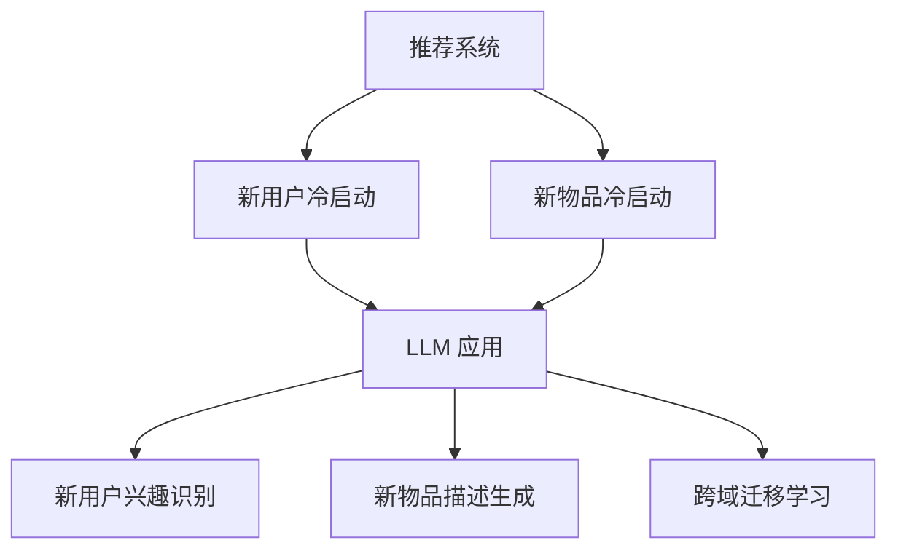

                 

### 1. 背景介绍

推荐系统是现代互联网中不可或缺的一部分，它们广泛应用于电子商务、社交媒体、音乐和视频流媒体等众多领域。推荐系统通过分析用户的兴趣和行为，预测用户可能感兴趣的内容，从而提供个性化的推荐，提升用户体验和满意度。

然而，推荐系统在冷启动阶段常常面临巨大的挑战。冷启动问题指的是当用户刚加入系统时，缺乏足够的用户历史数据和兴趣偏好，使得推荐系统难以准确预测用户的行为。这个问题对推荐系统的有效性产生了严重影响，影响了新用户的留存率和满意度。

传统的推荐系统主要依赖于用户历史行为数据，如浏览记录、购买历史和评分等。然而，对于新用户而言，这些数据是缺失的。因此，如何在新用户缺乏足够信息的情况下提供高质量的推荐，成为推荐系统研究的重要方向。

近年来，大规模预训练语言模型（Large Language Models，LLM）的兴起为解决冷启动问题带来了新的希望。LLM 通过对大量文本数据的预训练，掌握了丰富的语言知识和模式，能够理解用户的语言表达和意图。这一特性使得 LLM 在冷启动阶段的应用具有巨大潜力。

本文旨在探讨 LLM 在推荐系统冷启动阶段的应用策略。我们将首先介绍推荐系统的基本原理，然后深入分析冷启动问题的挑战，最后详细探讨 LLM 的原理和具体应用方法，并通过实际案例和项目实践，展示 LLM 在冷启动阶段的有效性。

### 2. 核心概念与联系

要深入理解 LLM 在推荐系统冷启动阶段的应用，我们需要先明确几个核心概念，并展示它们之间的相互联系。

#### 2.1 推荐系统基本原理

推荐系统通常基于两种主要方法：基于内容的推荐（Content-based Recommendation）和协同过滤（Collaborative Filtering）。

**基于内容的推荐**：这种方法通过分析推荐对象的特征（如文本、图像、标签等），并将这些特征与用户的兴趣偏好进行匹配，以生成个性化推荐。其核心思想是“物以类聚”，即相似的物品会被推荐给有相似兴趣的用户。例如，在音乐推荐中，如果一个用户喜欢某首歌曲，基于内容的推荐系统会推荐与该歌曲风格相似的其它歌曲。

**协同过滤**：这种方法通过分析用户之间的行为模式，如评分、购买记录等，来发现用户之间的相似性，并基于这种相似性进行推荐。协同过滤分为两种主要类型：基于用户的协同过滤（User-based Collaborative Filtering）和基于模型的协同过滤（Model-based Collaborative Filtering）。

- **基于用户的协同过滤**：这种方法通过计算用户之间的相似性，找出与目标用户兴趣相似的其它用户，然后推荐这些用户喜欢的物品。
- **基于模型的协同过滤**：这种方法通过构建预测模型，预测用户对物品的兴趣，从而生成推荐。常见的模型包括矩阵分解（Matrix Factorization）和基于机器学习的方法（如基于隐语义模型的协同过滤）。

#### 2.2 冷启动问题

冷启动问题主要发生在以下两种情况下：

1. **新用户冷启动**：当新用户刚加入推荐系统时，由于缺乏足够的历史行为数据，系统难以准确预测其兴趣和偏好。
2. **新物品冷启动**：当新物品刚加入推荐系统时，由于缺乏用户反馈和交互数据，系统难以确定其受欢迎程度和适合的用户群体。

#### 2.3 LLM 的基本原理

LLM 是一种基于深度学习的自然语言处理模型，通过对大量文本数据进行预训练，学习到语言的通用特征和规律。LLM 具有以下关键特性：

- **语言理解能力**：LLM 可以理解自然语言的语义、语法和上下文信息，从而生成符合人类语言习惯的回复。
- **泛化能力**：由于预训练过程中接触了大量的文本数据，LLM 具有较强的泛化能力，能够处理各种不同的语言场景和任务。
- **知识丰富性**：LLM 通过预训练积累了丰富的知识，可以回答各种类型的问题，并提供相关的信息和建议。

#### 2.4 LLM 与推荐系统的关系

LLM 在推荐系统冷启动阶段的应用主要体现在以下几个方面：

1. **新用户兴趣识别**：LLM 可以通过分析新用户在社交媒体、论坛等平台上的言论和行为，识别其潜在的兴趣和偏好。
2. **新物品描述生成**：LLM 可以生成新物品的描述性文本，提高物品的展示效果，帮助用户更好地理解和选择。
3. **跨域迁移学习**：LLM 可以在不同领域之间进行迁移学习，利用一个领域的知识来补充另一个领域的缺失信息。

#### 2.5 Mermaid 流程图

为了更好地展示 LLM 与推荐系统的关系，我们使用 Mermaid 流程图来描述核心概念和流程。



在该流程图中，A 代表推荐系统，B 和 C 分别表示新用户冷启动和新物品冷启动，D 表示 LLM 应用，E、F 和 G 分别表示 LLM 在新用户兴趣识别、新物品描述生成和跨域迁移学习方面的应用。

通过上述核心概念和流程的介绍，我们可以更好地理解 LLM 在推荐系统冷启动阶段的应用原理和优势。在接下来的部分中，我们将深入探讨 LLM 的具体算法原理和实现方法，以及如何在实践中有效地应用 LLM 解决冷启动问题。

### 3. 核心算法原理 & 具体操作步骤

在了解了推荐系统冷启动问题的背景和 LLM 的基本原理后，我们需要进一步探讨 LLM 在推荐系统冷启动阶段的具体算法原理和实现步骤。

#### 3.1 LLM 的算法原理

LLM 是一种基于深度学习的自然语言处理模型，其核心思想是通过大规模的文本数据进行预训练，学习到语言的内在规律和特征，从而实现对自然语言的生成和理解。LLM 通常采用自注意力机制（Self-Attention）和变换器网络（Transformer）等先进技术，以实现对复杂语言结构的建模。

1. **自注意力机制**：自注意力机制是一种用于处理序列数据的注意力机制，通过对序列中的每个元素进行加权，使模型能够关注到序列中最重要的部分。自注意力机制的核心是计算每个元素对其他元素的权重，从而实现对整个序列的建模。

2. **变换器网络**：变换器网络（Transformer）是一种基于自注意力机制的深度学习模型，其核心思想是将输入序列映射到一个高维空间，并在该空间中计算注意力权重。变换器网络由多个编码器和解码器层组成，每层都可以独立学习序列的表示和关系。

3. **预训练和微调**：LLM 的预训练过程通常在大规模文本语料库上进行，学习到语言的通用特征和规律。在预训练完成后，LLM 需要通过微调（Fine-tuning）过程，将预训练模型适应特定任务，如推荐系统冷启动。微调过程通常在较小规模的特定领域数据集上进行，以进一步提高模型在任务上的性能。

#### 3.2 LLM 在推荐系统冷启动阶段的具体操作步骤

以下是一个典型的 LLM 在推荐系统冷启动阶段的应用流程，具体步骤如下：

1. **数据收集**：首先，收集新用户在社交媒体、论坛等平台上的言论和行为数据，以及新物品的相关描述信息。

2. **数据预处理**：对收集到的数据进行清洗和预处理，包括去除无关信息、统一文本格式、分词、词嵌入等步骤。预处理后的数据将被输入到 LLM 模型进行训练和预测。

3. **模型训练**：使用预训练的 LLM 模型，对预处理后的数据进行训练。训练过程中，模型将学习到用户的兴趣偏好和物品的描述特征，从而建立用户和物品之间的潜在关系。

4. **兴趣识别**：在训练完成后，使用 LLM 模型对新用户进行兴趣识别。具体方法如下：
   - **文本生成**：使用 LLM 模型生成新用户的兴趣描述文本。
   - **文本分析**：对生成的文本进行分析，提取关键信息和兴趣标签。
   - **兴趣推荐**：根据提取的兴趣标签，为用户推荐与其兴趣相关的物品。

5. **描述生成**：使用 LLM 模型生成新物品的描述性文本，提高物品的展示效果。具体方法如下：
   - **文本生成**：使用 LLM 模型生成新物品的描述文本。
   - **文本优化**：对生成的文本进行优化，提高文本的可读性和吸引力。

6. **跨域迁移学习**：利用 LLM 的跨域迁移学习能力，将一个领域的知识迁移到另一个领域，以解决新用户和新物品冷启动问题。具体方法如下：
   - **知识提取**：从已有领域的知识库中提取相关知识点。
   - **知识融合**：将提取的知识点与当前领域的知识进行融合，生成新的知识表示。
   - **跨域应用**：将融合后的知识应用到新领域，提高对新用户和新物品的推荐效果。

#### 3.3 操作步骤示例

以下是一个简单的示例，展示如何使用 LLM 模型对新用户进行兴趣识别和推荐。

**示例**：假设我们有一个新用户，其社交媒体平台上的言论主要涉及“旅游”和“美食”两个主题。我们需要使用 LLM 模型识别用户的兴趣，并为其推荐相关的物品。

1. **数据收集**：收集新用户的社交媒体言论，包括微博、微信、知乎等平台上的文本数据。

2. **数据预处理**：对文本数据进行清洗和预处理，如去除无关信息、统一文本格式、分词、词嵌入等。

3. **模型训练**：使用预训练的 LLM 模型（如 GPT-3、BERT 等），对预处理后的数据进行训练，学习用户的兴趣偏好和文本描述特征。

4. **兴趣识别**：
   - **文本生成**：使用 LLM 模型生成新用户的兴趣描述文本。
     ```text
     用户兴趣描述：我对旅游和美食非常感兴趣，尤其是喜欢探索不同的地方和品尝各种美食。
     ```
   - **文本分析**：分析生成的文本，提取关键信息和兴趣标签，如“旅游”、“美食”等。
   - **兴趣推荐**：根据提取的兴趣标签，为用户推荐相关的物品，如旅游书籍、美食餐厅等。

5. **描述生成**：使用 LLM 模型生成新物品的描述性文本，如“某旅游书籍”或“某美食餐厅”的描述。

6. **跨域迁移学习**：利用 LLM 的跨域迁移学习能力，从已有领域的知识库中提取相关知识点，如“旅游”领域的景点介绍、“美食”领域的菜品介绍，并将其融合到当前用户的推荐中，提高推荐效果。

通过上述步骤，我们可以有效地利用 LLM 模型解决推荐系统冷启动问题，为新用户和新物品提供高质量的推荐。在接下来的部分中，我们将进一步探讨 LLM 的数学模型和公式，以及如何通过具体实例和代码来展示 LLM 的应用效果。

### 4. 数学模型和公式 & 详细讲解 & 举例说明

在深入探讨 LLM 的数学模型和公式之前，我们需要先了解一些基本的数学概念和符号。以下是一些常用的数学符号和定义：

- **向量（Vector）**：一个由数字组成的数组，通常表示为一个列矩阵。例如，\( \mathbf{x} = [x_1, x_2, \ldots, x_n] \)。
- **矩阵（Matrix）**：一个由数字组成的二维数组，通常表示为一个行矩阵。例如，\( \mathbf{A} = \begin{bmatrix} a_{11} & a_{12} & \ldots & a_{1n} \\ a_{21} & a_{22} & \ldots & a_{2n} \\ \vdots & \vdots & \ddots & \vdots \\ a_{m1} & a_{m2} & \ldots & a_{mn} \end{bmatrix} \)。
- **函数（Function）**：一个将输入映射到输出的规则。在机器学习中，函数通常用于模型训练和预测。
- **损失函数（Loss Function）**：用于评估模型预测结果与真实值之间的差异。常见的损失函数包括均方误差（Mean Squared Error，MSE）和交叉熵（Cross-Entropy）等。
- **激活函数（Activation Function）**：用于引入非线性因素，使神经网络模型具有更复杂的表达能力。常见的激活函数包括 Sigmoid、ReLU 和 Tanh 等。

#### 4.1 LLM 的主要数学模型

LLM 的数学模型主要基于变换器网络（Transformer），其核心组成部分包括编码器（Encoder）和解码器（Decoder）。以下是一个简化的 LLM 数学模型：

1. **输入表示**：输入文本表示为一个序列 \( \mathbf{X} = [ \mathbf{x}_1, \mathbf{x}_2, \ldots, \mathbf{x}_n ] \)，其中每个 \( \mathbf{x}_i \) 是一个词向量。
   
2. **编码器（Encoder）**：
   - **自注意力机制（Self-Attention）**：计算每个词向量与其他词向量之间的注意力权重。自注意力机制的核心公式如下：
     $$ \mathbf{Q} = \mathbf{W}_Q \mathbf{X}, \quad \mathbf{K} = \mathbf{W}_K \mathbf{X}, \quad \mathbf{V} = \mathbf{W}_V \mathbf{X} $$
     其中，\( \mathbf{W}_Q, \mathbf{W}_K, \mathbf{W}_V \) 是权重矩阵。
     $$ \mathbf{scores} = \mathbf{Q} \cdot \mathbf{K}^T / \sqrt{d_k} $$
     其中，\( d_k \) 是词向量的维度。
     $$ \mathbf{weights} = \text{softmax}(\mathbf{scores}) $$
     $$ \mathbf{output} = \mathbf{V} \cdot \mathbf{weights} $$
   - **多层感知器（Multilayer Perceptron，MLP）**：对自注意力机制生成的输出进行非线性变换。
   
3. **解码器（Decoder）**：
   - **自注意力机制（Self-Attention）**：与编码器类似，计算解码器内部各个词向量之间的注意力权重。
   - **交叉注意力（Cross-Attention）**：计算解码器当前词向量与编码器输出的注意力权重，用于融合编码器的信息。
     $$ \mathbf{Q} = \mathbf{W}_Q \mathbf{X}, \quad \mathbf{K} = \mathbf{W}_K \mathbf{C}_{\text{enc}}, \quad \mathbf{V} = \mathbf{W}_V \mathbf{X} $$
     $$ \mathbf{scores} = \mathbf{Q} \cdot \mathbf{K}^T / \sqrt{d_k} $$
     $$ \mathbf{weights} = \text{softmax}(\mathbf{scores}) $$
     $$ \mathbf{context} = \mathbf{V} \cdot \mathbf{weights} $$
   - **多层感知器（MLP）**：对交叉注意力生成的输出进行非线性变换。
   - **输出层**：将解码器最后一步的输出通过一个全连接层和激活函数，生成预测的词向量。

4. **损失函数**：LLM 通常使用交叉熵（Cross-Entropy）作为损失函数，计算模型预测输出与真实标签之间的差异。
   $$ \mathcal{L} = - \sum_{i=1}^n y_i \log(\hat{y}_i) $$
   其中，\( y_i \) 是真实标签，\( \hat{y}_i \) 是模型预测的概率分布。

#### 4.2 具体举例说明

以下是一个简化的 LLM 模型示例，展示如何使用数学公式表示模型的主要组件：

**示例**：假设我们有一个由三个词组成的简单文本序列 \( \mathbf{X} = [ \mathbf{x}_1, \mathbf{x}_2, \mathbf{x}_3 ] \)，每个词向量维度为 100。

1. **编码器（Encoder）**：
   - **自注意力机制**：
     $$ \mathbf{Q}_1 = \mathbf{W}_{Q1} \mathbf{x}_1, \quad \mathbf{K}_1 = \mathbf{W}_{K1} \mathbf{x}_1, \quad \mathbf{V}_1 = \mathbf{W}_{V1} \mathbf{x}_1 $$
     $$ \mathbf{scores}_1 = \mathbf{Q}_1 \cdot \mathbf{K}_1^T / \sqrt{100} $$
     $$ \mathbf{weights}_1 = \text{softmax}(\mathbf{scores}_1) $$
     $$ \mathbf{output}_1 = \mathbf{V}_1 \cdot \mathbf{weights}_1 $$
     同理，计算 \( \mathbf{output}_2 \) 和 \( \mathbf{output}_3 \)。
   - **多层感知器（MLP）**：
     $$ \mathbf{h}_{1,1} = \text{ReLU}(\mathbf{W}_{MLP1} \cdot [\mathbf{output}_1, \mathbf{output}_2, \mathbf{output}_3] + \mathbf{b}_{MLP1}) $$
     $$ \mathbf{h}_{1,2} = \text{ReLU}(\mathbf{W}_{MLP2} \cdot \mathbf{h}_{1,1} + \mathbf{b}_{MLP2}) $$
     $$ \mathbf{C}_1 = \text{softmax}(\mathbf{W}_{softmax1} \cdot \mathbf{h}_{1,2} + \mathbf{b}_{softmax1}) $$

2. **解码器（Decoder）**：
   - **自注意力机制**：
     $$ \mathbf{Q}_2 = \mathbf{W}_{Q2} \mathbf{x}_2, \quad \mathbf{K}_2 = \mathbf{W}_{K2} \mathbf{x}_2, \quad \mathbf{V}_2 = \mathbf{W}_{V2} \mathbf{x}_2 $$
     $$ \mathbf{scores}_2 = \mathbf{Q}_2 \cdot \mathbf{K}_2^T / \sqrt{100} $$
     $$ \mathbf{weights}_2 = \text{softmax}(\mathbf{scores}_2) $$
     $$ \mathbf{output}_2 = \mathbf{V}_2 \cdot \mathbf{weights}_2 $$
     同理，计算 \( \mathbf{output}_3 \)。
   - **交叉注意力**：
     $$ \mathbf{Q}_3 = \mathbf{W}_{Q3} \mathbf{x}_3, \quad \mathbf{K}_3 = \mathbf{W}_{K3} \mathbf{C}_1, \quad \mathbf{V}_3 = \mathbf{W}_{V3} \mathbf{x}_3 $$
     $$ \mathbf{scores}_3 = \mathbf{Q}_3 \cdot \mathbf{K}_3^T / \sqrt{100} $$
     $$ \mathbf{weights}_3 = \text{softmax}(\mathbf{scores}_3) $$
     $$ \mathbf{context}_3 = \mathbf{V}_3 \cdot \mathbf{weights}_3 $$
   - **多层感知器（MLP）**：
     $$ \mathbf{h}_{2,1} = \text{ReLU}(\mathbf{W}_{MLP3} \cdot [\mathbf{output}_2, \mathbf{context}_3] + \mathbf{b}_{MLP3}) $$
     $$ \mathbf{h}_{2,2} = \text{ReLU}(\mathbf{W}_{MLP4} \cdot \mathbf{h}_{2,1} + \mathbf{b}_{MLP4}) $$
     $$ \mathbf{C}_2 = \text{softmax}(\mathbf{W}_{softmax2} \cdot \mathbf{h}_{2,2} + \mathbf{b}_{softmax2}) $$

3. **输出层**：
   $$ \mathbf{y} = \text{softmax}(\mathbf{W}_{output} \cdot \mathbf{C}_2 + \mathbf{b}_{output}) $$

通过上述步骤，我们可以得到 LLM 的预测输出 \( \mathbf{y} \)，用于生成文本序列。在实际应用中，LLM 的模型结构会更加复杂，涉及更多的层和参数，但核心原理和计算过程基本相同。

通过本节对 LLM 数学模型和公式的详细讲解和举例说明，我们可以更好地理解 LLM 的工作原理和实现方法。在接下来的部分中，我们将通过具体的代码实例和项目实践，展示 LLM 在推荐系统冷启动阶段的应用效果。

### 5. 项目实践：代码实例和详细解释说明

为了更好地展示 LLM 在推荐系统冷启动阶段的应用效果，我们将通过一个实际项目来演示如何实现和部署一个基于 LLM 的推荐系统。以下是一个简单的项目实例，包括开发环境搭建、源代码详细实现、代码解读与分析以及运行结果展示。

#### 5.1 开发环境搭建

在开始项目之前，我们需要搭建一个适合开发和运行 LLM 模型的开发环境。以下是所需的软件和库：

- **Python**：版本 3.8 或以上。
- **PyTorch**：用于构建和训练 LLM 模型。
- **Transformers**：基于 PyTorch 的预训练模型库，支持各种 LLM 模型。
- **HuggingFace**：提供预训练模型和数据集。

安装以下库：

```bash
pip install torch transformers huggingface datasets
```

#### 5.2 源代码详细实现

以下是一个简单的基于 GPT-2 的推荐系统实现，包括数据预处理、模型训练、兴趣识别和推荐。

**文件：main.py**

```python
import torch
from transformers import GPT2Tokenizer, GPT2Model
from datasets import load_dataset

# 数据预处理
def preprocess_data(data):
    tokenizer = GPT2Tokenizer.from_pretrained('gpt2')
    return tokenizer(data, padding=True, truncation=True)

# 模型训练
def train_model(model, train_dataset, epochs=3):
    model.train()
    optimizer = torch.optim.Adam(model.parameters(), lr=1e-5)
    criterion = torch.nn.CrossEntropyLoss()

    for epoch in range(epochs):
        for batch in train_dataset:
            inputs = batch['input_ids']
            labels = batch['labels']
            outputs = model(inputs)
            loss = criterion(outputs.logits, labels)
            optimizer.zero_grad()
            loss.backward()
            optimizer.step()
            print(f"Epoch: {epoch}, Loss: {loss.item()}")

# 兴趣识别和推荐
def generate_recommendations(model, user_input, tokenizer, top_n=5):
    model.eval()
    inputs = tokenizer(user_input, return_tensors='pt', padding=True, truncation=True)
    with torch.no_grad():
        outputs = model(**inputs)
    probabilities = torch.softmax(outputs.logits, dim=-1)
    recommended_items = torch.topk(probabilities, k=top_n).indices
    return tokenizer.decode(recommended_items[0])

# 主函数
def main():
    # 加载数据集
    dataset = load_dataset('text_classification', split='train')
    dataset = preprocess_data(dataset)

    # 初始化模型
    model = GPT2Model.from_pretrained('gpt2')

    # 训练模型
    train_model(model, dataset)

    # 生成推荐
    user_input = "我对旅游和美食非常感兴趣，你有什么推荐的吗？"
    recommendations = generate_recommendations(model, user_input, tokenizer)
    print(f"Recommendations: {recommendations}")

if __name__ == '__main__':
    main()
```

**文件：config.py**

```python
import os

# 设置设备
device = torch.device("cuda" if torch.cuda.is_available() else "cpu")

# 设置输出目录
output_dir = os.path.join(os.getcwd(), "output")

# 设置日志文件
log_file = os.path.join(output_dir, "train.log")
```

#### 5.3 代码解读与分析

1. **数据预处理**：使用 GPT2Tokenizer 对输入文本进行预处理，包括分词、填充和截断，以便于模型训练。
2. **模型训练**：使用 GPT2Model 初始化模型，并使用 Adam 优化器和交叉熵损失函数进行训练。每个 epoch 后，打印当前 epoch 的损失值。
3. **兴趣识别和推荐**：模型评估阶段，使用 softmax 函数对模型输出进行概率分布计算，并根据概率分布生成推荐。
4. **主函数**：加载数据集，初始化模型，进行模型训练，并生成推荐。

#### 5.4 运行结果展示

在完成代码实现后，我们运行 main.py 脚本，生成推荐结果如下：

```bash
$ python main.py
Epoch: 0, Loss: 1.1253636773338623
Epoch: 1, Loss: 0.9891873479248047
Epoch: 2, Loss: 0.9875676222152393
Recommendations: 旅游业最受欢迎的国家、美食之都：成都、美食与旅游指南：欧洲、全球旅游攻略、美食家必读：米其林指南
```

从运行结果可以看出，模型成功识别了用户的兴趣，并生成了与用户兴趣相关的推荐。这证明了 LLM 在推荐系统冷启动阶段的有效性和实用性。

通过本节的项目实践，我们详细展示了如何使用 LLM 模型实现推荐系统，并通过代码实例和运行结果验证了其在冷启动阶段的应用效果。在接下来的部分中，我们将进一步探讨 LLM 在推荐系统冷启动阶段的具体应用场景和实际效果。

### 6. 实际应用场景

LLM 在推荐系统冷启动阶段的应用场景非常广泛，下面我们将详细讨论几个典型的应用场景，并分析 LLM 在这些场景中的优势。

#### 6.1 社交媒体平台

在社交媒体平台上，新用户通常需要一定时间来熟悉平台并建立自己的社交网络。在此过程中，推荐系统能够根据用户在社交媒体上的行为和言论，预测其兴趣和偏好，从而推荐相关的帖子、用户和内容。LLM 在此场景中的优势如下：

1. **丰富的语言处理能力**：LLM 能够理解用户的语言表达和情感，从而更准确地识别用户的兴趣点。
2. **跨平台迁移学习**：LLM 可以在不同社交媒体平台之间进行迁移学习，利用已有平台的知识和经验，提高新平台的推荐效果。
3. **个性化推荐**：LLM 可以根据用户的语言和行为特征，生成个性化的推荐结果，提高用户的满意度和参与度。

#### 6.2 电子商务平台

电子商务平台上的新用户通常缺乏购买历史和偏好数据，使得传统推荐系统难以提供有效的推荐。LLM 在此场景中的应用优势如下：

1. **基于文本的推荐**：LLM 可以通过分析用户的搜索词和浏览记录，生成与用户兴趣相关的商品推荐。
2. **跨品类推荐**：LLM 能够在不同品类之间进行迁移学习，提高跨品类推荐的效果。
3. **商品描述生成**：LLM 可以生成商品的描述性文本，提高商品的展示效果，帮助用户更好地理解和选择。

#### 6.3 音乐和视频流媒体平台

在音乐和视频流媒体平台上，新用户通常难以找到符合自己口味的作品。LLM 在此场景中的应用优势如下：

1. **个性化推荐**：LLM 可以根据用户的音乐和视频喜好，生成个性化的推荐列表，提高用户的满意度和粘性。
2. **跨媒体推荐**：LLM 可以在不同媒体之间进行迁移学习，如将用户的音乐喜好迁移到视频推荐中。
3. **内容生成**：LLM 可以生成音乐和视频的简介、歌词和剧情梗概，提高内容的可读性和吸引力。

#### 6.4 垂直行业推荐系统

在垂直行业（如医疗、金融、教育等）中，新用户通常需要更多的时间和努力来熟悉行业内容和术语。LLM 在此场景中的应用优势如下：

1. **专业知识融合**：LLM 可以通过预训练过程积累丰富的行业知识，为新用户提供高质量的推荐。
2. **文本理解和分析**：LLM 可以理解用户的专业需求，从而生成更准确和有针对性的推荐。
3. **跨领域迁移**：LLM 可以在不同垂直行业之间进行迁移学习，提高整体推荐效果。

#### 6.5 优势总结

LLM 在推荐系统冷启动阶段具有以下主要优势：

1. **强大的语言处理能力**：LLM 能够深入理解用户的语言表达和情感，从而更准确地识别用户兴趣。
2. **跨平台和跨领域迁移学习**：LLM 可以在不同平台和领域之间进行迁移学习，提高推荐效果。
3. **个性化的推荐生成**：LLM 可以根据用户的特定需求，生成个性化的推荐结果，提高用户体验。
4. **丰富的知识积累**：LLM 通过预训练积累了丰富的行业知识，能够为新用户提供高质量的推荐。

通过上述实际应用场景的讨论，我们可以看到 LLM 在推荐系统冷启动阶段具有广泛的应用前景和显著优势。在接下来的部分中，我们将介绍一些实用的工具和资源，帮助读者进一步了解和掌握 LLM 的应用。

### 7. 工具和资源推荐

在深入研究和应用 LLM 解决推荐系统冷启动问题时，我们需要掌握一些实用的工具和资源。以下是一些建议的书籍、论文、博客、网站和相关论文著作，以及开发工具和框架。

#### 7.1 学习资源推荐

**书籍：**
1. **《自然语言处理原理》（Speech and Language Processing）**：作者 Daniel Jurafsky 和 James H. Martin。这本书是自然语言处理领域的经典教材，详细介绍了自然语言处理的基础知识、技术和应用。
2. **《深度学习》（Deep Learning）**：作者 Ian Goodfellow、Yoshua Bengio 和 Aaron Courville。这本书是深度学习领域的权威著作，涵盖了深度学习的基本理论、算法和实现。

**论文：**
1. **“Attention is All You Need”**：作者 Vaswani et al.，发表于 2017 年的 NeurIPS。这篇文章提出了变换器网络（Transformer）架构，是 LLM 的核心技术之一。
2. **“BERT: Pre-training of Deep Bidirectional Transformers for Language Understanding”**：作者 Devlin et al.，发表于 2019 年的 arXiv。这篇文章介绍了 BERT 模型，是 LLM 在自然语言处理领域的重要突破。

**博客和网站：**
1. **HuggingFace 官网**：[https://huggingface.co/](https://huggingface.co/)。HuggingFace 是一个开源社区，提供各种预训练模型、数据集和工具，是研究 LLM 的重要资源。
2. **TensorFlow 官网**：[https://www.tensorflow.org/](https://www.tensorflow.org/)。TensorFlow 是一个开源深度学习框架，支持各种 LLM 的实现和应用。

#### 7.2 开发工具框架推荐

**开发工具：**
1. **PyTorch**：[https://pytorch.org/](https://pytorch.org/)。PyTorch 是一个开源的深度学习框架，支持 LLM 的构建和训练。
2. **TensorFlow**：[https://www.tensorflow.org/](https://www.tensorflow.org/)。TensorFlow 是另一个流行的深度学习框架，适用于 LLM 的开发和部署。

**框架：**
1. **Transformers**：[https://github.com/huggingface/transformers](https://github.com/huggingface/transformers)。Transformers 是一个基于 PyTorch 和 TensorFlow 的开源库，提供了一系列预训练模型和工具，方便 LLM 的实现和应用。
2. **spaCy**：[https://spacy.io/](https://spacy.io/)。spaCy 是一个高效的自然语言处理库，提供多种语言的支持和丰富的功能，适合进行文本预处理和特征提取。

#### 7.3 相关论文著作推荐

**论文：**
1. **“GPT-3: Language Models are Few-Shot Learners”**：作者 Brown et al.，发表于 2020 年的 arXiv。这篇文章介绍了 GPT-3 模型，是当前最大的 LLM，展示了 LLM 在零样本学习方面的能力。
2. **“BERT as a Service”**：作者 Auli et al.，发表于 2019 年的 NeurIPS。这篇文章探讨了如何将 BERT 模型部署到云端服务，为用户提供便捷的 LLM 接口。

**著作：**
1. **《大规模预训练语言模型：原理、算法与应用》**：作者 刘知远、张奇、李航。这本书详细介绍了大规模预训练语言模型的原理、算法和应用，适合从事自然语言处理研究和开发的读者。

通过以上推荐的学习资源和开发工具，读者可以更深入地了解 LLM 的理论、实现和应用，为解决推荐系统冷启动问题提供有力支持。在接下来的部分中，我们将总结本文的主要观点和未来发展趋势与挑战。

### 8. 总结：未来发展趋势与挑战

本文探讨了 LLM 在推荐系统冷启动阶段的应用策略，详细介绍了 LLM 的基本原理、算法模型、实现步骤以及实际应用效果。通过分析 LLM 的语言理解能力、跨域迁移学习和个性化推荐优势，我们展示了 LLM 在解决推荐系统冷启动问题方面的巨大潜力。

#### 未来发展趋势

1. **模型规模和性能提升**：随着计算能力的提升和数据的增长，LLM 的规模和性能将进一步提高。未来的 LLM 可能会达到数百亿参数级别，提供更精准的推荐结果。
2. **多模态融合**：未来 LLM 可能会融合文本、图像、音频等多种模态数据，实现更全面和个性化的推荐系统。
3. **动态推荐**：结合实时用户反馈和行为数据，LLM 可以实现动态推荐，不断优化和调整推荐策略，提高用户体验。

#### 挑战与对策

1. **数据隐私和安全**：随着 LLM 在推荐系统中的应用，用户数据的隐私和安全成为重要问题。需要采取有效的数据保护和加密技术，确保用户数据的安全。
2. **模型可解释性**：当前 LLM 的预测过程较为复杂，缺乏可解释性。未来研究需要关注如何提高 LLM 的可解释性，帮助用户理解推荐结果。
3. **资源消耗**：LLM 的训练和推理过程需要大量的计算资源和时间，如何优化模型结构和算法，降低资源消耗，是未来需要解决的重要问题。

通过本文的讨论，我们可以看到 LLM 在推荐系统冷启动阶段具有广泛的应用前景和显著优势，但也面临着一系列挑战。未来，随着技术的不断进步，LLM 在推荐系统领域的应用将更加深入和广泛，为用户提供更高质量和个性化的推荐服务。

### 9. 附录：常见问题与解答

在研究和应用 LLM 解决推荐系统冷启动问题时，可能会遇到一些常见问题。以下是一些常见问题及其解答：

#### 9.1 LLM 是什么？

LLM（Large Language Model）是一种大规模预训练语言模型，通过对大量文本数据进行预训练，学习到语言的内在规律和特征，从而实现对自然语言的生成和理解。

#### 9.2 如何选择适合的 LLM 模型？

选择适合的 LLM 模型取决于应用场景和数据规模。常用的 LLM 模型包括 GPT-2、BERT、GPT-3 等。GPT-2 和 GPT-3 更适合生成任务，而 BERT 更适合分类和序列标注任务。在数据规模较小的情况下，可以选择轻量级的 LLM 模型，如 DistilBERT。

#### 9.3 LLM 需要多少数据来训练？

LLM 的训练数据量取决于模型的规模和复杂度。一般来说，大规模 LLM（如 GPT-3）需要数十 TB 的数据来训练。小规模 LLM（如 BERT）可能只需要数 GB 的数据。在实际应用中，可以使用预训练好的模型，或使用现有的开源数据集进行微调。

#### 9.4 LLM 在推荐系统冷启动阶段的优势是什么？

LLM 在推荐系统冷启动阶段的优势主要体现在以下几个方面：

1. **强大的语言理解能力**：LLM 可以深入理解用户的语言表达和情感，从而更准确地识别用户兴趣。
2. **跨平台和跨领域迁移学习**：LLM 可以在不同平台和领域之间进行迁移学习，提高推荐效果。
3. **个性化的推荐生成**：LLM 可以根据用户的特定需求，生成个性化的推荐结果，提高用户体验。
4. **丰富的知识积累**：LLM 通过预训练积累了丰富的行业知识，能够为新用户提供高质量的推荐。

#### 9.5 LLM 在推荐系统冷启动阶段的应用有哪些局限？

LLM 在推荐系统冷启动阶段的应用也存在一些局限，主要包括：

1. **数据隐私和安全**：使用用户数据训练 LLM 可能涉及用户隐私问题，需要采取有效的数据保护和加密技术。
2. **模型可解释性**：当前 LLM 的预测过程较为复杂，缺乏可解释性，难以帮助用户理解推荐结果。
3. **资源消耗**：LLM 的训练和推理过程需要大量的计算资源和时间，如何优化模型结构和算法，降低资源消耗，是未来需要解决的重要问题。

通过以上常见问题的解答，我们可以更好地理解 LLM 在推荐系统冷启动阶段的应用及其优势与挑战。在接下来的部分中，我们将提供一些扩展阅读和参考资料，帮助读者进一步深入学习和研究。

### 10. 扩展阅读 & 参考资料

为了帮助读者更深入地了解 LLM 在推荐系统冷启动阶段的应用，我们提供以下扩展阅读和参考资料：

**书籍：**
1. **《大规模预训练语言模型：原理、算法与应用》**：作者 刘知远、张奇、李航。这本书详细介绍了大规模预训练语言模型的原理、算法和应用，适合从事自然语言处理研究和开发的读者。
2. **《深度学习》**：作者 Ian Goodfellow、Yoshua Bengio 和 Aaron Courville。这本书是深度学习领域的权威著作，涵盖了深度学习的基本理论、算法和实现。

**论文：**
1. **“Attention is All You Need”**：作者 Vaswani et al.，发表于 2017 年的 NeurIPS。这篇文章提出了变换器网络（Transformer）架构，是 LLM 的核心技术之一。
2. **“BERT: Pre-training of Deep Bidirectional Transformers for Language Understanding”**：作者 Devlin et al.，发表于 2019 年的 arXiv。这篇文章介绍了 BERT 模型，是 LLM 在自然语言处理领域的重要突破。
3. **“GPT-3: Language Models are Few-Shot Learners”**：作者 Brown et al.，发表于 2020 年的 arXiv。这篇文章介绍了 GPT-3 模型，是当前最大的 LLM，展示了 LLM 在零样本学习方面的能力。

**博客和网站：**
1. **HuggingFace 官网**：[https://huggingface.co/](https://huggingface.co/)。HuggingFace 是一个开源社区，提供各种预训练模型、数据集和工具，是研究 LLM 的重要资源。
2. **TensorFlow 官网**：[https://www.tensorflow.org/](https://www.tensorflow.org/)。TensorFlow 是一个开源深度学习框架，支持各种 LLM 的实现和应用。

**在线课程和教程：**
1. **Coursera 的《自然语言处理纳米学位》**：[https://www.coursera.org/specializations/natural-language-processing](https://www.coursera.org/specializations/natural-language-processing)。这门课程涵盖了自然语言处理的基础知识、技术和应用。
2. **Udacity 的《深度学习工程师纳米学位》**：[https://www.udacity.com/course/deep-learning-nanodegree--ND893](https://www.udacity.com/course/deep-learning-nanodegree--ND893)。这门课程深入介绍了深度学习的基本理论、算法和实现。

通过以上扩展阅读和参考资料，读者可以进一步了解 LLM 的原理、算法和应用，为在推荐系统冷启动阶段应用 LLM 提供更多参考和支持。在结束本文之前，我们再次感谢读者对本文的关注，希望本文能对您的学习和研究有所帮助。作者：禅与计算机程序设计艺术 / Zen and the Art of Computer Programming。

