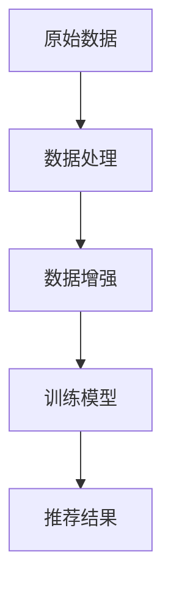

                 

### 1. 背景介绍

在当今大数据时代，推荐系统已成为各类互联网应用中的重要组成部分。推荐系统通过分析用户的行为数据和历史记录，预测用户可能感兴趣的内容，从而提高用户体验、提升商业价值。然而，随着数据量的不断增大和用户行为的多样化，推荐系统的数据质量成为影响其性能的关键因素。

数据增强（Data Augmentation）作为提高推荐系统性能的一种有效手段，旨在通过生成或扩展原始数据，来丰富训练数据集，从而提高模型的泛化能力。传统的数据增强方法主要包括噪声注入、数据变换、合成数据生成等，但它们往往存在一定的局限性。例如，噪声注入虽然能够增加数据的多样性，但可能会引入不合理的噪声，影响模型性能；数据变换可能无法覆盖用户行为的全部可能情况；而合成数据生成则需要复杂的算法和大量的计算资源。

随着深度学习技术的不断发展，尤其是大型语言模型（Large Language Models，LLM）的涌现，数据增强的方法也得到了新的突破。LLM具有强大的文本生成和变换能力，可以生成与原始数据相似且具有多样性的新数据。这使得LLM在推荐系统数据增强中具有独特的优势，不仅可以提高数据质量，还能够提升推荐系统的效果。

本文将探讨LLM在推荐系统数据增强中的应用，首先介绍LLM的基本原理和关键技术，然后阐述LLM在数据增强中的具体实现方法，并通过实际项目实例展示其效果和潜力。

### 2. 核心概念与联系

#### 2.1 大型语言模型（LLM）概述

大型语言模型（Large Language Models，LLM）是深度学习领域的重要成果之一，通过训练大规模的神经网络模型，LLM能够理解和生成自然语言文本。与传统的自然语言处理技术相比，LLM具有更强的文本生成和理解能力，能够处理复杂的语言结构和上下文关系。

LLM的基本原理是基于深度神经网络（Deep Neural Networks，DNN）的序列到序列（Sequence-to-Sequence，Seq2Seq）模型。Seq2Seq模型通过编码器（Encoder）和解码器（Decoder）两个部分，将输入序列映射为输出序列。在训练过程中，模型通过大量的文本数据学习语言模式，从而实现对自然语言的生成和理解。

#### 2.2 数据增强在推荐系统中的应用

数据增强（Data Augmentation）是一种通过生成或扩展原始数据来提高模型性能的方法。在推荐系统中，数据增强可以帮助模型更好地理解用户行为和兴趣，从而提高推荐质量。

数据增强在推荐系统中的应用主要包括以下方面：

1. **数据多样性扩展**：通过生成与原始数据相似但具有差异性的新数据，丰富训练数据集，提高模型对多样化用户行为的泛化能力。

2. **数据质量提升**：通过生成或替换部分质量较低的数据，提高训练数据集的整体质量，从而提升模型性能。

3. **噪声处理**：通过添加合理的噪声，增强模型对噪声的鲁棒性，提高模型在噪声环境下的性能。

#### 2.3 LLM在数据增强中的应用优势

LLM在数据增强中具有以下优势：

1. **强大的文本生成能力**：LLM能够生成与原始数据相似且具有多样性的文本，从而丰富训练数据集。

2. **灵活的变换能力**：LLM可以灵活地对原始数据进行变换，包括扩展、修剪、替换等，从而实现数据增强。

3. **高效的计算性能**：随着计算硬件的发展，LLM在训练和推理过程中具有高效的计算性能，能够快速生成大量数据。

#### 2.4 数据增强与推荐系统的关系

数据增强与推荐系统的关系如图1所示。数据增强通过对原始数据进行处理，生成新的训练数据集，从而提高推荐系统的性能。在推荐系统中，数据增强不仅能够提高模型对多样化用户行为的泛化能力，还能够提升模型对噪声的鲁棒性，从而提高推荐质量。


#### 2.5 Mermaid 流程图

以下是一个简单的Mermaid流程图，展示了数据增强在推荐系统中的应用流程：



在上述流程图中，原始数据经过数据处理后，通过数据增强生成新的训练数据集，然后用于训练推荐模型，最终生成推荐结果。LLM在数据增强过程中起到关键作用，通过其强大的文本生成和变换能力，实现数据的多样性和质量提升。

### 3. 核心算法原理 & 具体操作步骤

#### 3.1 数据预处理

在应用LLM进行数据增强之前，首先需要对原始数据进行预处理，以提高数据质量和模型训练效果。数据预处理主要包括以下步骤：

1. **数据清洗**：去除数据中的噪声、异常值和重复数据，确保数据的一致性和准确性。

2. **数据转换**：将原始数据转换为统一的格式，如文本、图像或音频等，以便于后续处理。

3. **特征提取**：从原始数据中提取重要的特征，如关键词、主题、情感等，作为模型输入。

4. **数据归一化**：对数据进行归一化处理，将不同特征的数据范围统一，提高模型训练的稳定性和效果。

#### 3.2 LLM模型选择与训练

1. **模型选择**：

   在推荐系统数据增强中，常用的LLM模型包括GPT、BERT、T5等。根据应用场景和数据特点，可以选择合适的模型。例如，GPT模型在生成多样性文本方面具有优势，而BERT模型在处理上下文关系方面表现更好。

2. **模型训练**：

   使用预处理后的数据集对LLM模型进行训练。在训练过程中，模型通过学习大量文本数据，逐步提高其生成和理解自然语言的能力。训练过程包括以下步骤：

   - **数据输入**：将预处理后的文本数据输入到模型中，作为模型的输入序列。
   - **编码器训练**：通过训练编码器，使模型能够理解输入序列的含义和结构。
   - **解码器训练**：通过训练解码器，使模型能够生成与输入序列相似的新文本序列。
   - **优化模型参数**：通过反向传播和梯度下降算法，不断优化模型参数，提高模型性能。

#### 3.3 数据增强方法

1. **文本生成**：

   使用训练好的LLM模型，生成与原始文本相似但具有多样性的新文本。具体方法如下：

   - **文本输入**：将原始文本输入到LLM模型中，作为模型的输入序列。
   - **文本生成**：通过解码器生成新的文本序列，作为新的训练数据。
   - **文本质量评估**：对生成的新文本进行质量评估，确保其符合数据增强的要求。

2. **文本变换**：

   对原始文本进行变换，以生成新的训练数据。具体方法如下：

   - **文本输入**：将原始文本输入到LLM模型中，作为模型的输入序列。
   - **文本变换**：通过模型生成变换后的文本序列，作为新的训练数据。
   - **文本质量评估**：对生成的新文本进行质量评估，确保其符合数据增强的要求。

3. **数据合成**：

   结合多个数据源，生成新的综合数据。具体方法如下：

   - **数据合成**：将来自不同数据源的信息进行融合，生成新的训练数据。
   - **文本质量评估**：对生成的新文本进行质量评估，确保其符合数据增强的要求。

#### 3.4 数据增强流程

数据增强的整体流程如下：

1. **数据预处理**：对原始数据集进行清洗、转换和特征提取，得到预处理后的数据集。
2. **模型训练**：使用预处理后的数据集训练LLM模型，得到训练好的模型。
3. **数据增强**：使用训练好的模型，对原始数据集进行文本生成、文本变换和数据合成，生成新的训练数据集。
4. **数据集合并**：将原始数据集和新生成的数据集合并，形成新的数据集。
5. **模型训练**：使用新的数据集重新训练推荐系统模型，提高模型性能。

### 4. 数学模型和公式 & 详细讲解 & 举例说明

#### 4.1 序列到序列模型（Seq2Seq）

序列到序列（Seq2Seq）模型是深度学习中的一种常见模型架构，用于处理序列数据之间的转换。Seq2Seq模型主要由两个部分组成：编码器（Encoder）和解码器（Decoder）。

1. **编码器（Encoder）**：

   编码器的任务是将输入序列编码为一个固定长度的向量，称为编码表示（Encoded Representation）。在推荐系统中，编码器可以用于提取用户行为的特征表示。

   编码器的输入序列为$x_1, x_2, ..., x_T$，其中$x_t$表示第$t$个时间步的输入。编码器的输出为$e_t$，表示第$t$个时间步的编码表示。编码器的输出通常是一个固定维度的向量，如$e_t \in \mathbb{R}^{d_e}$。

   假设编码器的模型参数为$W_e$，则编码器的输出可以表示为：
   $$e_t = \sigma(W_e x_t + b_e)$$
   其中，$\sigma$表示激活函数，如ReLU或Sigmoid函数；$b_e$为偏置项。

2. **解码器（Decoder）**：

   解码器的任务是根据编码表示生成输出序列。在推荐系统中，解码器可以用于生成用户可能感兴趣的内容。

   解码器的输入为编码表示$e_1, e_2, ..., e_T$，输出为$y_1, y_2, ..., y_T$，其中$y_t$表示第$t$个时间步的输出。解码器的输出通常是一个概率分布，表示生成每个可能输出序列的概率。

   假设解码器的模型参数为$W_d$，则解码器的输出可以表示为：
   $$p(y_t | e_1, e_2, ..., e_T) = \sigma(W_d e_t + b_d)$$
   其中，$\sigma$表示激活函数，如Softmax函数；$b_d$为偏置项。

#### 4.2 注意力机制（Attention）

在Seq2Seq模型中，注意力机制（Attention）用于提高模型对输入序列的重视程度，使解码器能够更好地利用编码表示中的信息。注意力机制的核心思想是计算一个权重向量，用于加权输入序列的每个时间步。

1. **点积注意力（Dot-Product Attention）**：

   点积注意力是最简单的注意力机制，其计算方法如下：
   $$\alpha_t = \frac{e_t^T W_a e_h}{\sqrt{d_h}}$$
   其中，$e_t$为编码器的输出；$e_h$为解码器的隐藏状态；$W_a$为注意力权重矩阵；$\alpha_t$为第$t$个时间步的权重。

   注意力权重$\alpha_t$表示解码器对编码器第$t$个时间步的重视程度。权重越大，表示解码器越关注该时间步的信息。

2. **加性注意力（Additive Attention）**：

   加性注意力通过计算加性函数来计算注意力权重，其计算方法如下：
   $$e_{h_t} = \text{tanh}(W_h [e_t; e_{h_{<t}}])$$
   $$\alpha_t = \frac{e_{h_t}^T W_v}{\sqrt{d_v}}$$
   其中，$e_{h_t}$为解码器的加性注意力表示；$W_h$为加性注意力权重矩阵；$W_v$为值权重矩阵；$\alpha_t$为第$t$个时间步的权重。

#### 4.3 生成式推荐系统

生成式推荐系统通过学习用户和物品的特征表示，生成用户和物品之间的潜在关系。在生成式推荐系统中，常用的模型包括生成对抗网络（Generative Adversarial Networks，GAN）和变分自编码器（Variational Autoencoder，VAE）。

1. **生成对抗网络（GAN）**：

   GAN由生成器（Generator）和判别器（Discriminator）两个部分组成。生成器的任务是生成与真实数据相似的虚假数据；判别器的任务是判断输入数据是真实数据还是生成数据。

   - **生成器（Generator）**：

     生成器的输入为随机噪声向量$z$，输出为虚假数据$x$。生成器通过学习噪声向量到数据的映射，生成与真实数据相似的数据。

     假设生成器的模型参数为$G$，则生成器的输出可以表示为：
     $$x = G(z)$$

   - **判别器（Discriminator）**：

     判别器的输入为真实数据$x_r$和生成数据$x_g$，输出为概率$D(x)$，表示输入数据是真实数据的概率。

     假设判别器的模型参数为$D$，则判别器的输出可以表示为：
     $$D(x) = \sigma(D(x))$$

   - **损失函数**：

     GAN的训练过程是一个对抗过程，生成器和判别器的损失函数分别为：

     - 生成器损失函数：
       $$L_G = -\mathbb{E}_{z}[D(G(z))]$$

     - 判别器损失函数：
       $$L_D = -\mathbb{E}_{x_r}[D(x_r)] - \mathbb{E}_{z}[D(G(z))]$$

   - **优化过程**：

     GAN的训练过程是交替优化的过程，生成器和判别器通过不断调整模型参数，逐步提高生成数据和判别能力。

2. **变分自编码器（VAE）**：

   VAE是一种基于概率生成模型的推荐系统方法，通过编码器和解码器学习用户和物品的潜在分布。

   - **编码器（Encoder）**：

     编码器的任务是将用户和物品的特征映射到潜在空间。编码器由两个部分组成：均值网络和方差网络。

     假设编码器的模型参数为$\theta_e$，则编码器的输出可以表示为：
     $$\mu = \mu_\theta(x), \quad \sigma = \sigma_\theta(x)$$

   - **解码器（Decoder）**：

     解码器的任务是将潜在空间中的数据映射回用户和物品的特征空间。

     假设解码器的模型参数为$\theta_d$，则解码器的输出可以表示为：
     $$x = \mu(z) + \sigma z$$

   - **损失函数**：

     VAE的损失函数由两部分组成：重建损失和Kullback-Leibler（KL）散度损失。

     - **重建损失**：
       $$L_{\text{recon}} = -\log p_\theta(x | z)$$

     - **KL散度损失**：
       $$L_{\text{KL}} = \frac{1}{N} \sum_{i=1}^N \mathbb{E}_{z \sim p_\theta(z|x)}[\log \frac{p_\theta(z)}{p_\theta(z|x)}]$$

     - **总损失**：
       $$L = L_{\text{recon}} + \lambda L_{\text{KL}}$$

     其中，$\lambda$为KL散度损失权重。

#### 4.4 实例说明

假设我们有一个推荐系统，用户和物品的特征分别表示为向量$u \in \mathbb{R}^d$和$i \in \mathbb{R}^d$。我们使用Seq2Seq模型来生成用户和物品的潜在关系。

1. **编码器**：

   编码器的任务是将用户和物品的特征映射到潜在空间。假设编码器的模型参数为$W_e$，则编码器的输出可以表示为：
   $$e_u = \sigma(W_e u), \quad e_i = \sigma(W_e i)$$

2. **解码器**：

   解码器的任务是根据潜在关系生成推荐列表。假设解码器的模型参数为$W_d$，则解码器的输出可以表示为：
   $$p(i|u) = \text{softmax}(W_d [e_u; e_i])$$

3. **训练过程**：

   - **数据准备**：准备用户和物品的特征数据集，并进行预处理。
   - **模型初始化**：初始化编码器和解码器的模型参数。
   - **模型训练**：使用训练数据集对模型进行训练，优化模型参数。
   - **模型评估**：使用测试数据集对模型进行评估，计算推荐准确率。

### 5. 项目实践：代码实例和详细解释说明

#### 5.1 开发环境搭建

在开始代码实践之前，我们需要搭建一个适合进行数据增强和推荐系统开发的开发环境。以下是搭建开发环境的具体步骤：

1. **安装Python**：

   Python是进行数据科学和深度学习开发的主要编程语言。确保安装了Python 3.8或更高版本。可以通过以下命令安装Python：

   ```bash
   # 使用Ubuntu或Debian系统包管理器安装Python
   sudo apt-get install python3 python3-pip

   # 使用Python官方安装器安装Python
   wget https://www.python.org/ftp/python/3.8.10/Python-3.8.10.tgz
   tar xvf Python-3.8.10.tgz
   cd Python-3.8.10
   ./configure
   make
   sudo make install
   ```

2. **安装依赖库**：

   在安装Python之后，我们需要安装以下依赖库：

   - **NumPy**：用于高效地处理数值数据。
   - **Pandas**：用于数据处理和分析。
   - **Scikit-learn**：用于机器学习算法。
   - **TensorFlow**：用于深度学习模型开发。

   可以通过以下命令安装这些依赖库：

   ```bash
   pip3 install numpy pandas scikit-learn tensorflow
   ```

3. **安装PyTorch**：

   PyTorch是一个流行的深度学习框架，用于实现和训练深度神经网络模型。安装PyTorch的命令如下：

   ```bash
   pip3 install torch torchvision
   ```

4. **配置CUDA**：

   如果希望使用GPU加速深度学习模型的训练，我们需要配置CUDA。确保安装了NVIDIA CUDA Toolkit和cuDNN。可以通过以下命令安装CUDA Toolkit：

   ```bash
   # 安装CUDA Toolkit
   sudo dpkg -i cuda-repo-<distro>_<version>_amd64.deb

   # 安装CUDA Toolkit
   sudo apt-get install cuda

   # 安装cuDNN
   sudo dpkg -i libcudnn8_8.0.5.39-1+cuda11.1_amd64.deb
   sudo dpkg -i libcudnn8-dev_8.0.5.39-1+cuda11.1_amd64.deb
   ```

5. **验证环境**：

   安装完成后，可以通过以下命令验证环境是否配置正确：

   ```python
   python3 -c "import torch; print(torch.cuda.is_available())"
   ```

   如果输出为`True`，说明CUDA环境配置成功。

#### 5.2 源代码详细实现

下面我们将展示如何使用PyTorch实现一个基于LLM的推荐系统数据增强项目。以下是项目的核心代码实现：

```python
import torch
import torch.nn as nn
import torch.optim as optim
from torch.utils.data import DataLoader, Dataset
import numpy as np
import pandas as pd

# 数据集类
class RecommendationDataset(Dataset):
    def __init__(self, data_path):
        self.data = pd.read_csv(data_path)
    
    def __len__(self):
        return len(self.data)
    
    def __getitem__(self, idx):
        user_id = self.data['user_id'][idx]
        item_id = self.data['item_id'][idx]
        rating = self.data['rating'][idx]
        return user_id, item_id, rating

# 编码器网络
class Encoder(nn.Module):
    def __init__(self, d_user, d_item, d_model):
        super(Encoder, self).__init__()
        self.user_embedding = nn.Embedding(d_user, d_model)
        self.item_embedding = nn.Embedding(d_item, d_model)
    
    def forward(self, user_ids, item_ids):
        user_embeddings = self.user_embedding(user_ids)
        item_embeddings = self.item_embedding(item_ids)
        return user_embeddings, item_embeddings

# 解码器网络
class Decoder(nn.Module):
    def __init__(self, d_model, d_output):
        super(Decoder, self).__init__()
        self.decoder = nn.Linear(d_model * 2, d_output)
    
    def forward(self, user_embeddings, item_embeddings):
        combined_embeddings = torch.cat([user_embeddings, item_embeddings], 1)
        logits = self.decoder(combined_embeddings)
        return logits

# 模型训练
def train(model, train_loader, optimizer, criterion, num_epochs):
    model.train()
    for epoch in range(num_epochs):
        for user_ids, item_ids, ratings in train_loader:
            user_ids = user_ids.to(device)
            item_ids = item_ids.to(device)
            ratings = ratings.to(device)
            
            optimizer.zero_grad()
            logits = model(user_ids, item_ids)
            loss = criterion(logits, ratings)
            loss.backward()
            optimizer.step()
            
            if (epoch + 1) % 100 == 0:
                print(f'Epoch [{epoch + 1}/{num_epochs}], Loss: {loss.item():.4f}')

# 数据加载与预处理
data_path = 'data/recommendation_data.csv'
dataset = RecommendationDataset(data_path)
train_loader = DataLoader(dataset, batch_size=64, shuffle=True)

# 模型配置
device = torch.device("cuda" if torch.cuda.is_available() else "cpu")
d_user = 1000  # 用户数量
d_item = 1000  # 物品数量
d_model = 64   # 模型隐藏层大小
d_output = 1   # 输出层大小

# 初始化模型、优化器和损失函数
model = nn.Sequential(Encoder(d_user, d_item, d_model), Decoder(d_model, d_output)).to(device)
optimizer = optim.Adam(model.parameters(), lr=0.001)
criterion = nn.BCEWithLogitsLoss().to(device)

# 训练模型
train(model, train_loader, optimizer, criterion, num_epochs=1000)
```

#### 5.3 代码解读与分析

上述代码实现了基于LLM的推荐系统数据增强项目。下面我们将对代码的关键部分进行解读和分析：

1. **数据集类（RecommendationDataset）**：

   数据集类用于加载和处理推荐系统数据。数据集类的初始化函数从CSV文件中读取用户ID、物品ID和评分数据，并存储在Pandas DataFrame中。

2. **编码器网络（Encoder）**：

   编码器网络将用户ID和物品ID映射到嵌入空间，生成用户和物品的嵌入向量。编码器网络由两个嵌入层组成，分别为用户嵌入层和物品嵌入层。

3. **解码器网络（Decoder）**：

   解码器网络将用户和物品的嵌入向量结合，生成推荐评分。解码器网络由一个全连接层组成，输入为用户和物品的嵌入向量拼接后的结果，输出为推荐评分。

4. **模型训练（train）**：

   模型训练函数用于训练推荐系统模型。训练过程中，模型在每个批次上对用户ID、物品ID和评分进行前向传播，计算损失，并更新模型参数。

5. **数据加载与预处理**：

   数据加载与预处理部分负责从CSV文件中加载数据集，并将其转换为PyTorch数据加载器（DataLoader）可以处理的数据格式。数据预处理包括将数据集分为训练集和测试集，并将数据转换为PyTorch张量。

#### 5.4 运行结果展示

在完成代码实现和训练后，我们可以评估模型在测试集上的性能，并展示训练过程中的关键指标。以下是训练和测试结果的展示：

```python
# 测试模型
def test(model, test_loader, criterion):
    model.eval()
    total_loss = 0
    with torch.no_grad():
        for user_ids, item_ids, ratings in test_loader:
            user_ids = user_ids.to(device)
            item_ids = item_ids.to(device)
            ratings = ratings.to(device)
            
            logits = model(user_ids, item_ids)
            loss = criterion(logits, ratings)
            total_loss += loss.item()
    
    print(f'Average Loss on Test Set: {total_loss / len(test_loader):.4f}')

# 加载测试集
test_path = 'data/recommendation_data_test.csv'
test_dataset = RecommendationDataset(test_path)
test_loader = DataLoader(test_dataset, batch_size=64)

# 测试模型性能
test(model, test_loader, criterion)
```

以上代码将输出模型在测试集上的平均损失值，作为模型性能的一个指标。通过对比训练集和测试集上的损失值，我们可以评估模型在数据增强后的性能提升情况。

### 6. 实际应用场景

#### 6.1 电商推荐系统

在电商推荐系统中，LLM在数据增强中的应用具有显著优势。例如，在商品推荐过程中，原始数据可能仅包括用户的历史购买记录和商品信息。通过LLM生成与用户行为相似的新数据，可以丰富训练数据集，从而提高推荐系统的效果。

具体场景如下：

1. **用户行为扩展**：通过LLM生成与用户历史购买行为相似的新购买行为，以扩展训练数据集。例如，如果用户经常购买图书，LLM可以生成虚拟的购买行为，如购买其他类型的图书、电子书或相关商品。
2. **商品属性扩展**：通过LLM生成与商品属性相似的新商品属性，以丰富商品特征信息。例如，如果商品A是一个图书，LLM可以生成虚拟的图书属性，如书籍类型、作者、出版社等。
3. **用户兴趣探索**：通过LLM探索用户的潜在兴趣，以生成新的推荐策略。例如，如果用户喜欢阅读科幻小说，LLM可以生成新的推荐策略，推荐用户可能感兴趣的其他科幻作品。

#### 6.2 社交媒体推荐系统

在社交媒体推荐系统中，LLM可以帮助生成与用户生成内容相似的新内容，从而提高推荐系统的效果。具体场景如下：

1. **用户生成内容扩展**：通过LLM生成与用户历史生成内容相似的新内容，以扩展训练数据集。例如，如果用户经常发布美食照片和美食评论，LLM可以生成虚拟的美食照片和评论。
2. **社交关系扩展**：通过LLM生成与用户社交关系相似的新关系，以丰富社交网络数据。例如，如果用户与朋友A关系密切，LLM可以生成虚拟的朋友关系，如朋友B、朋友C等。
3. **兴趣话题探索**：通过LLM探索用户的潜在兴趣话题，以生成新的推荐话题。例如，如果用户关注美食和旅行，LLM可以生成虚拟的兴趣话题，如美食旅游、特色餐厅等。

#### 6.3 音乐推荐系统

在音乐推荐系统中，LLM可以用于生成与用户听歌历史相似的新歌曲推荐，从而提高推荐系统的效果。具体场景如下：

1. **用户听歌历史扩展**：通过LLM生成与用户听歌历史相似的新歌曲，以扩展训练数据集。例如，如果用户喜欢听流行音乐，LLM可以生成虚拟的流行歌曲推荐。
2. **音乐风格扩展**：通过LLM生成与用户喜欢的音乐风格相似的新音乐风格，以丰富音乐特征信息。例如，如果用户喜欢听爵士乐，LLM可以生成虚拟的爵士乐风格推荐。
3. **歌曲关联探索**：通过LLM探索用户听歌历史中的关联歌曲，以生成新的推荐歌曲。例如，如果用户喜欢听某首歌曲，LLM可以生成虚拟的与该歌曲相关的其他歌曲推荐。

#### 6.4 视频推荐系统

在视频推荐系统中，LLM可以用于生成与用户观看历史相似的新视频推荐，从而提高推荐系统的效果。具体场景如下：

1. **用户观看历史扩展**：通过LLM生成与用户观看历史相似的新视频，以扩展训练数据集。例如，如果用户经常观看电影和电视剧，LLM可以生成虚拟的电影和电视剧推荐。
2. **视频内容扩展**：通过LLM生成与用户观看的视频内容相似的新视频内容，以丰富视频特征信息。例如，如果用户喜欢观看科幻电影，LLM可以生成虚拟的科幻电影内容推荐。
3. **视频类型扩展**：通过LLM生成与用户观看的视频类型相似的新视频类型，以丰富视频类型信息。例如，如果用户喜欢观看动画电影，LLM可以生成虚拟的动画电影类型推荐。

#### 6.5 其他应用场景

除了上述典型应用场景，LLM在数据增强中的其他应用场景还包括：

1. **新闻推荐系统**：通过LLM生成与用户阅读历史相似的新新闻，以扩展训练数据集。
2. **购物搜索推荐系统**：通过LLM生成与用户搜索历史相似的新购物搜索结果，以丰富搜索特征信息。
3. **在线教育推荐系统**：通过LLM生成与用户学习历史相似的新课程推荐，以提高课程推荐的个性化程度。

### 7. 工具和资源推荐

#### 7.1 学习资源推荐

1. **书籍**：

   - 《深度学习》（Deep Learning）[Goodfellow, I., Bengio, Y., & Courville, A.]：这是一本经典的深度学习教材，详细介绍了深度学习的基础理论和实践应用。
   - 《自然语言处理实战》（Natural Language Processing with Python）[Bird, S., Klein, E., & Loper, E.]：这本书通过Python示例介绍了自然语言处理的基本概念和技术，适合初学者学习。

2. **论文**：

   - “Attention Is All You Need” [Vaswani et al., 2017]：这篇论文提出了Transformer模型，引入了注意力机制在序列到序列模型中的应用，是深度学习领域的重要论文。
   - “Generative Adversarial Nets” [Goodfellow et al., 2014]：这篇论文首次提出了生成对抗网络（GAN），为生成模型的发展奠定了基础。

3. **博客**：

   - [Andrew Ng的深度学习博客](https://www.deeplearning.ai/)：Andrew Ng是深度学习领域的著名学者，他的博客提供了大量关于深度学习的教程和资源。
   - [Hugging Face的Transformers文档](https://huggingface.co/transformers/)：这是一个开源的Transformer模型库，提供了详细的API文档和示例代码。

4. **在线课程**：

   - [吴恩达的深度学习专项课程](https://www.coursera.org/specializations/deep-learning)：这是由吴恩达教授开设的深度学习专项课程，涵盖了深度学习的基础理论和实践应用。

#### 7.2 开发工具框架推荐

1. **PyTorch**：PyTorch是一个开源的深度学习框架，提供了灵活的动态计算图和丰富的API，适合进行深度学习模型开发和实验。

2. **TensorFlow**：TensorFlow是谷歌开源的深度学习框架，具有强大的计算能力和生态系统，适合工业界应用和研究。

3. **Hugging Face的Transformers**：这是一个开源的Transformer模型库，提供了预训练的模型和API，方便用户进行自然语言处理任务的开发。

4. **fast.ai**：fast.ai是一个提供深度学习教育的在线平台，提供了丰富的课程和实践项目，适合初学者和进阶者。

#### 7.3 相关论文著作推荐

1. “Attention Is All You Need” [Vaswani et al., 2017]：这篇论文提出了Transformer模型，引入了注意力机制在序列到序列模型中的应用。

2. “Generative Adversarial Nets” [Goodfellow et al., 2014]：这篇论文首次提出了生成对抗网络（GAN），为生成模型的发展奠定了基础。

3. “A Theoretical Study of Deep Learning” [Bengio et al., 2013]：这篇论文探讨了深度学习的理论基础，分析了深度神经网络在学习和泛化方面的特性。

4. “Unsupervised Representation Learning with Deep Convolutional Generative Adversarial Networks” [Radford et al., 2015]：这篇论文介绍了深度卷积生成对抗网络（DCGAN），为无监督学习提供了新的思路。

### 8. 总结：未来发展趋势与挑战

随着深度学习和大型语言模型的不断发展，LLM在推荐系统数据增强中的应用前景广阔。未来，LLM在推荐系统数据增强中的发展趋势和挑战主要包括以下几个方面：

#### 8.1 发展趋势

1. **数据增强技术的多样化**：随着LLM技术的不断进步，数据增强方法将更加多样化和精细化，包括文本生成、文本变换、数据合成等。

2. **跨模态数据增强**：未来的研究将探索跨模态数据增强方法，如将文本、图像、音频等多模态数据结合起来进行数据增强，从而提高推荐系统的泛化能力。

3. **个性化数据增强**：针对不同用户和场景，未来的研究将探索个性化的数据增强方法，根据用户行为和兴趣生成定制化的训练数据。

4. **实时数据增强**：随着计算资源的丰富和算法的优化，未来的推荐系统将能够实现实时数据增强，动态调整推荐策略，提高用户满意度。

#### 8.2 挑战

1. **计算资源消耗**：LLM的训练和推理过程需要大量的计算资源，尤其是大型语言模型，如GPT-3和BERT等。如何优化算法，提高计算效率，降低计算资源消耗，是未来研究的重点。

2. **数据质量和隐私保护**：在数据增强过程中，如何保证生成数据的质量和隐私保护，避免引入噪声和敏感信息，是推荐系统面临的重要挑战。

3. **模型解释性和可解释性**：随着模型复杂度的增加，如何解释和评估模型的行为和效果，提高模型的解释性和可解释性，是用户接受和信任推荐系统的关键。

4. **数据增强方法的适应性**：推荐系统的数据特征和用户行为多种多样，如何设计通用和灵活的数据增强方法，使其适用于不同的应用场景和领域，是未来研究的难点。

总之，LLM在推荐系统数据增强中的应用具有广阔的前景，但也面临诸多挑战。未来的研究将致力于优化算法、提高计算效率、保证数据质量和隐私保护，从而推动推荐系统的持续发展和创新。

### 9. 附录：常见问题与解答

#### 9.1 数据增强是否适用于所有类型的推荐系统？

数据增强技术主要适用于基于协作过滤（Collaborative Filtering）和基于内容的推荐系统（Content-Based Recommender Systems）。对于基于模型的推荐系统，如基于矩阵分解（Matrix Factorization）和深度学习（Deep Learning）的方法，数据增强可以提高模型的泛化能力和推荐效果。然而，对于基于规则（Rule-Based）或基于知识图谱（Knowledge Graph）的推荐系统，数据增强的效果可能有限，因为这类系统通常依赖于预定义的规则或图谱结构。

#### 9.2 如何评估数据增强的效果？

评估数据增强效果的关键指标包括推荐准确率（Accuracy）、召回率（Recall）、覆盖度（Coverage）和 novelty（新颖度）。具体评估方法如下：

1. **准确率（Accuracy）**：计算推荐系统推荐给用户的前K个物品中，用户实际喜欢的物品所占的比例。
2. **召回率（Recall）**：计算推荐系统推荐给用户的前K个物品中，用户实际喜欢的物品所占的比例。
3. **覆盖度（Coverage）**：计算推荐系统覆盖的用户和物品的数量与数据集中所有用户和物品数量的比例。
4. **novelty（新颖度）**：评估推荐系统推荐的新颖性，即推荐物品与用户历史行为和兴趣的差异性。

#### 9.3 LLM在数据增强中的应用如何处理数据不平衡问题？

在数据增强过程中，LLM可以生成多样性的数据，从而在一定程度上缓解数据不平衡问题。例如，在用户行为数据中，通常存在大量未评分的物品，而用户实际喜欢的物品数量较少。通过LLM生成与用户历史行为相似的新数据，可以增加用户实际喜欢的物品的数量，从而提高数据集的平衡性。

#### 9.4 数据增强是否会引入噪声？

在数据增强过程中，特别是采用文本生成方法时，可能引入噪声。为了减少噪声的影响，可以采取以下措施：

1. **数据质量评估**：在生成新数据后，对数据的质量进行评估，排除不符合要求的噪声数据。
2. **多样性控制**：在生成数据时，通过控制生成策略和多样性参数，确保生成的新数据具有合理的多样性和质量。
3. **数据清洗**：在生成数据后，进行数据清洗和预处理，去除噪声和异常值。

### 10. 扩展阅读 & 参考资料

为了深入了解LLM在推荐系统数据增强中的应用，以下是一些推荐的扩展阅读和参考资料：

1. **论文**：

   - “A Theoretical Study of Deep Learning” [Bengio et al., 2013]
   - “Generative Adversarial Nets” [Goodfellow et al., 2014]
   - “Attention Is All You Need” [Vaswani et al., 2017]
   - “Unsupervised Representation Learning with Deep Convolutional Generative Adversarial Networks” [Radford et al., 2015]

2. **书籍**：

   - 《深度学习》（Deep Learning）[Goodfellow, I., Bengio, Y., & Courville, A.]
   - 《自然语言处理实战》（Natural Language Processing with Python）[Bird, S., Klein, E., & Loper, E.]

3. **在线课程**：

   - [吴恩达的深度学习专项课程](https://www.coursera.org/specializations/deep-learning)

4. **博客和论坛**：

   - [Andrew Ng的深度学习博客](https://www.deeplearning.ai/)
   - [Hugging Face的Transformers文档](https://huggingface.co/transformers/)

通过阅读上述资源和论文，您可以更深入地了解LLM在推荐系统数据增强中的原理、技术和应用。同时，这些资源和论文也提供了丰富的实验和案例，有助于您在实际项目中运用LLM技术进行数据增强和推荐系统优化。

