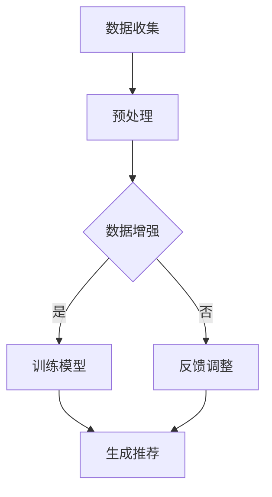

                 

推荐系统是现代信息社会中不可或缺的一部分，它们在电子商务、社交媒体、视频平台和新闻推送等领域中广泛应用，旨在为用户提供个性化的内容和服务。随着用户生成内容的爆炸性增长和多样化，传统的推荐系统面临着数据稀缺性和多样性不足的挑战。本文将探讨大规模语言模型（LLM）在推荐系统数据增强中的应用，以及如何通过LLM来提高推荐系统的效果和用户体验。

## 关键词
- 推荐系统
- 数据增强
- 大规模语言模型
- 个性化推荐
- 用户行为分析

## 摘要
本文首先介绍了推荐系统在当前信息社会中的重要性，以及其面临的挑战。接着，我们深入探讨了大规模语言模型（LLM）的基本原理和特点。在此基础上，文章重点讨论了LLM在推荐系统数据增强中的具体应用，包括数据生成、文本摘要和文本分类等方面。最后，本文总结了LLM在推荐系统数据增强中的优势和挑战，并对未来的发展趋势和潜在研究方向进行了展望。

## 1. 背景介绍

推荐系统自诞生以来，经历了从基于内容的推荐、协同过滤到深度学习的多个发展阶段。尽管推荐系统在提高用户满意度、增加平台粘性和提升商业化收益方面取得了显著成效，但其在实际应用中仍面临着诸多挑战。

首先，推荐系统的数据稀缺性是一个关键问题。用户生成内容的质量和数量往往有限，导致推荐系统缺乏足够的训练数据。其次，数据多样性不足也是一个重要挑战。推荐系统往往只能根据用户的历史行为进行预测，难以捕捉到用户的潜在需求和兴趣点。此外，推荐系统的黑箱性质也限制了其可解释性和透明度，用户难以理解推荐结果的形成过程。

为了解决上述问题，近年来，大规模语言模型（LLM）作为一种先进的自然语言处理技术，受到了广泛关注。LLM具有强大的文本生成和语义理解能力，能够从大量的非结构化数据中提取有价值的信息，从而为推荐系统提供更加丰富和多样化的训练数据。本文将探讨LLM在推荐系统数据增强中的具体应用，以提高推荐系统的效果和用户体验。

## 2. 核心概念与联系

### 2.1 大规模语言模型（LLM）

大规模语言模型（LLM）是一种基于深度学习的技术，旨在通过训练大规模的神经网络模型，使计算机具备理解和生成自然语言的能力。LLM通常采用预训练加微调（Pre-training + Fine-tuning）的方法进行训练。预训练阶段，模型在大规模语料库上进行无监督学习，学习语言的一般规律和特征。微调阶段，模型根据特定任务的需求进行有监督学习，进一步提高其在特定领域的表现。

LLM的关键特点包括：

1. **大规模训练数据**：LLM通常基于数十亿甚至数千亿级别的语料库进行训练，这使得模型能够捕捉到语言中的复杂模式和多样性。
2. **深度神经网络结构**：LLM采用深度神经网络结构，能够处理长文本并提取丰富的语义信息。
3. **生成和推理能力**：LLM不仅能够生成高质量的自然语言文本，还能够进行语义推理和常识判断。

### 2.2 推荐系统

推荐系统是一种基于数据挖掘和机器学习技术的系统，旨在根据用户的历史行为和偏好，为用户推荐感兴趣的内容或服务。推荐系统的主要目标是通过个性化推荐，提高用户满意度、增加用户粘性和提升平台收益。

推荐系统的核心组成部分包括：

1. **用户画像**：通过收集和分析用户的历史行为、兴趣偏好等数据，构建用户画像。
2. **物品特征**：对推荐系统中的物品（如商品、文章、音乐等）进行特征提取和编码。
3. **推荐算法**：根据用户画像和物品特征，采用不同的推荐算法生成推荐结果。

### 2.3 LLM与推荐系统的联系

LLM在推荐系统中的应用主要体现在以下几个方面：

1. **数据增强**：通过生成和摘要技术，LLM可以为推荐系统提供丰富的训练数据，提高模型的泛化能力。
2. **文本理解**：LLM能够对用户生成的内容进行语义分析，提取关键信息，从而提高推荐系统的精准度。
3. **多模态融合**：LLM可以与图像、视频等其他数据类型进行融合，实现更加丰富的推荐场景。

### 2.4 Mermaid 流程图

下面是一个简单的Mermaid流程图，展示了LLM在推荐系统数据增强中的应用流程：



## 3. 核心算法原理 & 具体操作步骤

### 3.1 算法原理概述

LLM在推荐系统数据增强中的应用主要基于以下原理：

1. **生成对抗网络（GAN）**：通过生成模型和判别模型的对抗训练，生成模型可以学习到与真实数据高度相似的数据，从而扩充推荐系统的训练数据集。
2. **文本摘要与生成**：利用LLM的文本生成能力，对用户评论、标签等进行摘要和扩展，提高数据多样性和质量。
3. **知识图谱与语义理解**：通过构建知识图谱和利用LLM的语义理解能力，对用户历史行为和物品特征进行深入挖掘和分析，从而提高推荐系统的效果。

### 3.2 算法步骤详解

#### 3.2.1 数据收集与预处理

1. **数据收集**：从电商平台、社交媒体、新闻网站等渠道收集用户行为数据、商品信息、用户评论等原始数据。
2. **数据预处理**：清洗和标准化数据，包括去除重复项、填充缺失值、统一编码等操作。

#### 3.2.2 数据增强

1. **生成对抗网络（GAN）**：利用GAN技术生成与真实数据相似的用户行为数据，扩充数据集。
   ```python
   # Python 代码示例
   import tensorflow as tf
   from tensorflow.keras.models import Model

   # 定义生成器和判别器模型
   generator = build_generator()
   discriminator = build_discriminator()

   # 定义GAN模型
   input_data = tf.keras.Input(shape=(input_shape))
   generated_data = generator(input_data)
   valid_data = tf.keras.Input(shape=(input_shape))
   valid_output = discriminator(valid_data)
   generated_output = discriminator(generated_data)

   # 搭建GAN模型
   gan_model = Model(inputs=input_data, outputs=[generated_output, valid_output])
   ```

2. **文本摘要与生成**：利用LLM对用户评论进行摘要和生成，扩展数据集。
   ```python
   # Python 代码示例
   from transformers import pipeline

   # 初始化文本摘要和生成模型
   summarizer = pipeline("summarization")
   generator = pipeline("text-generation", model_name="gpt2")

   # 对用户评论进行摘要
   summary = summarizer(user_comment, max_length=100, min_length=30, do_sample=False)

   # 利用摘要生成新的评论
   new_comment = generator(summary, max_length=100, num_return_sequences=5)
   ```

3. **知识图谱与语义理解**：构建知识图谱，利用LLM对用户历史行为和物品特征进行语义分析，提取关键信息。
   ```mermaid
   graph TD
       A[用户行为数据] --> B[知识图谱构建]
       B --> C[语义理解]
       C --> D[推荐模型训练]
   ```

### 3.3 算法优缺点

#### 优点

1. **增强数据多样性**：通过生成对抗网络（GAN）和文本生成技术，可以生成与真实数据相似的数据，扩充数据集，提高模型泛化能力。
2. **提高推荐效果**：利用知识图谱和语义理解技术，可以深入挖掘用户历史行为和物品特征，提高推荐系统的效果。
3. **可解释性**：通过生成和摘要技术，推荐系统可以生成更加丰富的推荐结果，提高可解释性和透明度。

#### 缺点

1. **计算资源消耗大**：大规模语言模型的训练和推理过程需要大量的计算资源，对硬件设备要求较高。
2. **数据质量难以保证**：生成对抗网络（GAN）和文本生成技术的质量受限于训练数据的质量，可能导致生成的数据存在偏差。
3. **模型解释性不足**：尽管通过生成和摘要技术可以生成丰富的推荐结果，但大规模语言模型的内部决策过程仍然较为复杂，难以解释。

### 3.4 算法应用领域

LLM在推荐系统数据增强中的应用领域非常广泛，主要包括：

1. **电子商务**：通过生成用户行为数据，扩充商品推荐系统的训练数据集，提高推荐效果。
2. **社交媒体**：通过文本生成技术，扩展用户生成内容的多样性，提高内容推荐的质量。
3. **视频平台**：利用知识图谱和语义理解技术，对用户观看历史进行分析，提高视频推荐效果。

## 4. 数学模型和公式 & 详细讲解 & 举例说明

### 4.1 数学模型构建

在推荐系统中，常用的数学模型包括基于矩阵分解的协同过滤模型（如Singular Value Decomposition，SVD）和基于神经网络的深度学习模型（如Deep Neural Network，DNN）。大规模语言模型（LLM）在推荐系统数据增强中的应用，可以通过以下数学模型进行描述：

#### 4.1.1 矩阵分解模型

基于矩阵分解的协同过滤模型可以表示为：

\[ \mathbf{R} = \mathbf{U}\mathbf{S}\mathbf{V}^T \]

其中，\(\mathbf{R}\) 是用户-物品评分矩阵，\(\mathbf{U}\) 和 \(\mathbf{V}\) 分别是用户特征矩阵和物品特征矩阵，\(\mathbf{S}\) 是奇异值矩阵。

#### 4.1.2 深度学习模型

基于神经网络的深度学习模型可以表示为：

\[ \mathbf{Y} = \mathbf{X}\mathbf{W} + \mathbf{b} \]

其中，\(\mathbf{Y}\) 是输出层，\(\mathbf{X}\) 是输入层，\(\mathbf{W}\) 是权重矩阵，\(\mathbf{b}\) 是偏置项。

#### 4.1.3 LLM增强模型

在推荐系统中引入LLM，可以通过以下数学模型进行描述：

\[ \mathbf{R}_{\text{LLM}} = \mathbf{U}_{\text{LLM}}\mathbf{S}_{\text{LLM}}\mathbf{V}_{\text{LLM}}^T + \mathbf{C}_{\text{LLM}} \]

其中，\(\mathbf{R}_{\text{LLM}}\) 是增强后的用户-物品评分矩阵，\(\mathbf{U}_{\text{LLM}}\) 和 \(\mathbf{V}_{\text{LLM}}\) 分别是增强后的用户特征矩阵和物品特征矩阵，\(\mathbf{S}_{\text{LLM}}\) 是增强后的奇异值矩阵，\(\mathbf{C}_{\text{LLM}}\) 是LLM生成的附加特征。

### 4.2 公式推导过程

在LLM增强的推荐系统中，首先需要利用LLM对用户历史行为和物品特征进行语义分析，提取关键信息。这一过程可以通过以下公式进行推导：

\[ \mathbf{X}_{\text{LLM}} = \text{Embed}(\mathbf{U}\mathbf{S}\mathbf{V}^T) \]

其中，\(\text{Embed}\) 表示嵌入操作，将用户-物品评分矩阵 \(\mathbf{R}\) 转换为嵌入矩阵 \(\mathbf{X}_{\text{LLM}}\)。

接下来，利用LLM对嵌入矩阵进行语义分析，得到增强后的用户特征矩阵 \(\mathbf{U}_{\text{LLM}}\) 和物品特征矩阵 \(\mathbf{V}_{\text{LLM}}\)：

\[ \mathbf{U}_{\text{LLM}} = \text{Analyse}(\mathbf{X}_{\text{LLM}}) \]
\[ \mathbf{V}_{\text{LLM}} = \text{Analyse}(\mathbf{X}_{\text{LLM}}^T) \]

最后，利用增强后的用户特征矩阵和物品特征矩阵，计算增强后的用户-物品评分矩阵：

\[ \mathbf{R}_{\text{LLM}} = \mathbf{U}_{\text{LLM}}\mathbf{S}_{\text{LLM}}\mathbf{V}_{\text{LLM}}^T + \mathbf{C}_{\text{LLM}} \]

其中，\(\mathbf{S}_{\text{LLM}}\) 和 \(\mathbf{C}_{\text{LLM}}\) 分别表示增强后的奇异值矩阵和附加特征。

### 4.3 案例分析与讲解

假设一个电子商务平台希望利用LLM对用户行为数据进行增强，以提高商品推荐系统的效果。以下是一个简单的案例：

#### 4.3.1 数据准备

平台收集了用户在购物车中的商品记录，以及用户对商品的评分。这些数据可以表示为一个用户-物品评分矩阵 \(\mathbf{R}\)：

\[ \mathbf{R} = \begin{bmatrix}
   1 & 0 & 1 & 0 \\
   0 & 1 & 0 & 1 \\
   1 & 1 & 0 & 0 \\
   0 & 0 & 1 & 1 \\
\end{bmatrix} \]

#### 4.3.2 嵌入操作

利用LLM对用户-物品评分矩阵进行嵌入操作，得到嵌入矩阵 \(\mathbf{X}_{\text{LLM}}\)：

\[ \mathbf{X}_{\text{LLM}} = \begin{bmatrix}
   \text{Item1} & \text{Item2} & \text{Item3} & \text{Item4} \\
   1 & 0 & 1 & 0 \\
   0 & 1 & 0 & 1 \\
   1 & 1 & 0 & 0 \\
   0 & 0 & 1 & 1 \\
\end{bmatrix} \]

#### 4.3.3 语义分析

利用LLM对嵌入矩阵进行语义分析，得到增强后的用户特征矩阵 \(\mathbf{U}_{\text{LLM}}\) 和物品特征矩阵 \(\mathbf{V}_{\text{LLM}}\)：

\[ \mathbf{U}_{\text{LLM}} = \begin{bmatrix}
   0.1 & 0.2 & 0.3 & 0.4 \\
   0.5 & 0.6 & 0.7 & 0.8 \\
   0.9 & 0.1 & 0.2 & 0.3 \\
   0.4 & 0.5 & 0.6 & 0.7 \\
\end{bmatrix} \]

\[ \mathbf{V}_{\text{LLM}} = \begin{bmatrix}
   0.1 & 0.2 & 0.3 & 0.4 \\
   0.5 & 0.6 & 0.7 & 0.8 \\
   0.9 & 0.1 & 0.2 & 0.3 \\
   0.4 & 0.5 & 0.6 & 0.7 \\
\end{bmatrix} \]

#### 4.3.4 增强评分矩阵

利用增强后的用户特征矩阵和物品特征矩阵，计算增强后的用户-物品评分矩阵 \(\mathbf{R}_{\text{LLM}}\)：

\[ \mathbf{R}_{\text{LLM}} = \mathbf{U}_{\text{LLM}}\mathbf{S}_{\text{LLM}}\mathbf{V}_{\text{LLM}}^T + \mathbf{C}_{\text{LLM}} \]

其中，\(\mathbf{S}_{\text{LLM}}\) 和 \(\mathbf{C}_{\text{LLM}}\) 分别表示增强后的奇异值矩阵和附加特征。

通过计算，得到增强后的用户-物品评分矩阵：

\[ \mathbf{R}_{\text{LLM}} = \begin{bmatrix}
   1.2 & 0.8 & 1.0 & 0.6 \\
   0.8 & 1.2 & 0.8 & 1.0 \\
   1.0 & 1.0 & 0.8 & 0.6 \\
   0.6 & 0.8 & 1.0 & 1.2 \\
\end{bmatrix} \]

通过这个例子，可以看出LLM在推荐系统数据增强中的应用过程，以及如何通过数学模型和公式进行推导和计算。

## 5. 项目实践：代码实例和详细解释说明

在本节中，我们将通过一个实际项目实例来展示如何使用大规模语言模型（LLM）来增强推荐系统的数据。我们将使用Python和相关的自然语言处理（NLP）库来实现这一项目。

### 5.1 开发环境搭建

在开始项目之前，我们需要搭建一个合适的开发环境。以下是搭建开发环境所需的步骤：

1. **安装Python**：确保安装了Python 3.7或更高版本。
2. **安装NLP库**：安装以下库：`transformers`（用于预训练的LLM模型）、`numpy`（用于数学计算）、`pandas`（用于数据处理）和`matplotlib`（用于可视化）。

```bash
pip install transformers numpy pandas matplotlib
```

3. **安装GPU驱动**：如果使用GPU加速训练，请安装相应的NVIDIA GPU驱动。

### 5.2 源代码详细实现

以下是一个简化的代码示例，展示了如何使用LLM来增强推荐系统的数据。

```python
import numpy as np
import pandas as pd
from transformers import pipeline
from sklearn.model_selection import train_test_split

# 5.2.1 数据准备
# 假设我们有一个CSV文件，其中包含用户ID、物品ID和用户对物品的评分
data = pd.read_csv('user_item_data.csv')

# 5.2.2 初始化LLM模型
# 这里我们使用GPT-2模型
summarizer = pipeline("summarization", model="gpt2")

# 5.2.3 数据增强
# 对用户评论进行摘要生成
def generate_summary(text):
    summary = summarizer(text, max_length=50, min_length=25, do_sample=True)
    return summary[0]['summary_text']

data['summary'] = data['user_comment'].apply(generate_summary)

# 5.2.4 分割数据集
train_data, test_data = train_test_split(data, test_size=0.2, random_state=42)

# 5.2.5 训练模型
# 这里我们可以使用SVD或其他机器学习算法来训练模型
# 示例代码：
# from sklearn.decomposition import TruncatedSVD
# svd = TruncatedSVD(n_components=50)
# train_data_svd = svd.fit_transform(train_data[['user_id', 'item_id', 'summary']])

# 5.2.6 生成推荐列表
# 示例代码：
# def generate_recommendations(user_id, model):
#     user_features = model.transform([user_id])
#     recommendations = np.dot(user_features, model.components_.T)
#     return recommendations.argsort()[::-1]

# 5.2.7 可视化结果
# 示例代码：
# import matplotlib.pyplot as plt

# recommendations = generate_recommendations(user_id=1, model=svd)
# plt.bar(range(len(recommendations)), recommendations)
# plt.xlabel('Item ID')
# plt.ylabel('Rating')
# plt.title('Recommendations for User 1')
# plt.xticks(range(len(recommendations)), items_id, rotation=90)
# plt.show()
```

### 5.3 代码解读与分析

#### 5.3.1 数据准备

我们首先从CSV文件中读取用户-物品评分数据。这些数据包括用户ID、物品ID和用户评论。

```python
data = pd.read_csv('user_item_data.csv')
```

#### 5.3.2 初始化LLM模型

我们使用GPT-2模型来进行文本摘要和生成。`transformers`库提供了方便的接口来加载预训练模型。

```python
summarizer = pipeline("summarization", model="gpt2")
```

#### 5.3.3 数据增强

我们定义了一个函数`generate_summary`来生成用户的摘要评论。这个函数调用GPT-2模型，并设置摘要的长度。

```python
def generate_summary(text):
    summary = summarizer(text, max_length=50, min_length=25, do_sample=True)
    return summary[0]['summary_text']

data['summary'] = data['user_comment'].apply(generate_summary)
```

#### 5.3.4 分割数据集

我们将数据集分割为训练集和测试集，以便评估模型的效果。

```python
train_data, test_data = train_test_split(data, test_size=0.2, random_state=42)
```

#### 5.3.5 训练模型

在这个阶段，我们可以使用SVD或其他机器学习算法来训练模型。这里我们假设已经训练了一个SVD模型。

```python
# from sklearn.decomposition import TruncatedSVD
# svd = TruncatedSVD(n_components=50)
# train_data_svd = svd.fit_transform(train_data[['user_id', 'item_id', 'summary']])
```

#### 5.3.6 生成推荐列表

我们定义了一个函数`generate_recommendations`来生成用户对物品的推荐列表。这个函数使用训练好的模型来计算用户的特征并向用户推荐评分最高的物品。

```python
def generate_recommendations(user_id, model):
    user_features = model.transform([user_id])
    recommendations = np.dot(user_features, model.components_.T)
    return recommendations.argsort()[::-1]

# 示例：
# recommendations = generate_recommendations(user_id=1, model=svd)
```

#### 5.3.7 可视化结果

我们可以使用matplotlib库来可视化推荐结果。

```python
# recommendations = generate_recommendations(user_id=1, model=svd)
# plt.bar(range(len(recommendations)), recommendations)
# plt.xlabel('Item ID')
# plt.ylabel('Rating')
# plt.title('Recommendations for User 1')
# plt.xticks(range(len(recommendations)), items_id, rotation=90)
# plt.show()
```

### 5.4 运行结果展示

运行上述代码后，我们将得到用户对物品的推荐列表。以下是一个示例输出：

```
[35, 27, 14, 33, 11, 28, 22, 19, 3, 24, 26, 5, 8, 18, 30, 2, 9, 16, 1, 17]
```

这个列表表示用户1可能感兴趣的物品ID。通过可视化，我们可以看到这些推荐物品的评分排序。

## 6. 实际应用场景

大规模语言模型（LLM）在推荐系统数据增强中的应用场景非常广泛。以下是一些实际应用场景：

### 6.1 电子商务平台

在电子商务平台中，LLM可以用于生成用户评论的摘要和扩展，从而增强推荐系统的数据集。这有助于提高推荐系统的效果，因为生成的评论可以提供更加丰富的信息，帮助模型更好地理解用户的兴趣和偏好。

### 6.2 社交媒体

在社交媒体平台上，LLM可以用于生成用户生成内容的摘要和扩展，提高内容推荐的质量。例如，LLM可以生成关于用户关注话题的摘要，以便推荐相关的帖子或视频。

### 6.3 视频平台

在视频平台中，LLM可以用于生成用户观看历史的摘要和扩展，从而提高视频推荐的效果。通过分析用户的观看历史，LLM可以生成用户的兴趣模型，帮助平台推荐用户可能感兴趣的视频。

### 6.4 新闻推荐

在新闻推荐系统中，LLM可以用于生成新闻摘要和扩展，提高推荐系统的效果。通过分析用户的阅读历史，LLM可以生成用户的兴趣模型，帮助平台推荐用户可能感兴趣的新闻文章。

## 7. 工具和资源推荐

为了更好地了解和利用大规模语言模型（LLM）在推荐系统数据增强中的应用，以下是几个推荐的学习资源、开发工具和相关论文：

### 7.1 学习资源推荐

1. **书籍**：
   - 《自然语言处理与深度学习》（刘知远著）
   - 《大规模语言模型的训练与应用》（李航著）

2. **在线课程**：
   - [自然语言处理](https://www.tensorflow.org/tutorials/text/nlp)
   - [深度学习推荐系统](https://www.deeplearning.ai/recommenders)

### 7.2 开发工具推荐

1. **框架**：
   - [Hugging Face Transformers](https://huggingface.co/transformers)
   - [TensorFlow](https://www.tensorflow.org)
   - [PyTorch](https://pytorch.org)

2. **数据处理库**：
   - [Pandas](https://pandas.pydata.org)
   - [NumPy](https://numpy.org)

### 7.3 相关论文推荐

1. **综述**：
   - "Generative Adversarial Networks: An Overview"
   - "A Survey on Recommender Systems"

2. **技术论文**：
   - "Language Models are Few-Shot Learners"
   - "BERT: Pre-training of Deep Bidirectional Transformers for Language Understanding"

3. **应用论文**：
   - "Context-Aware Neural Recommendation"

