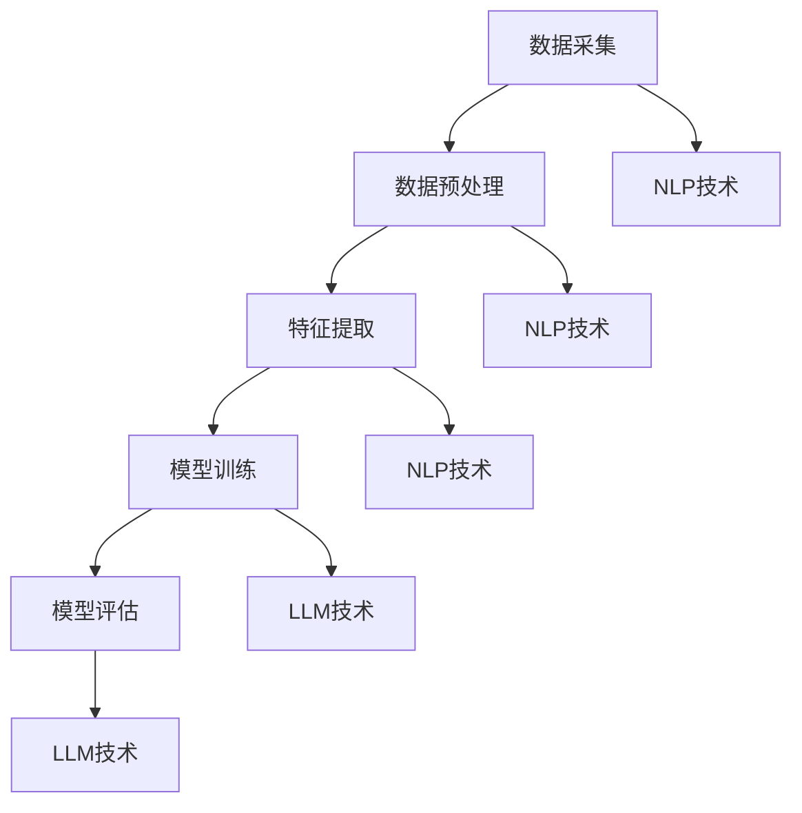

                 

关键词：LLM、智能客户画像、自然语言处理、人工智能、机器学习、文本分析、用户行为分析、客户关系管理、数据挖掘。

> 摘要：本文将探讨大型语言模型（LLM）在智能客户画像领域的应用，分析其核心概念、原理、算法，并通过实际案例和代码实例展示其具体操作步骤。同时，本文还将讨论LLM在智能客户画像中的实际应用场景和未来发展趋势，为相关领域的研究者和从业者提供参考和启示。

## 1. 背景介绍

随着互联网的快速发展，大数据、云计算、人工智能等新兴技术为商业领域带来了巨大的变革。特别是在客户关系管理（CRM）方面，智能客户画像作为一种重要的工具，已成为企业提高客户满意度、提升运营效率的重要手段。智能客户画像是指通过收集和分析用户在互联网上的行为数据，构建出一个全面的、动态的、多维度的用户画像，从而帮助企业更好地理解客户需求，实现精准营销。

在智能客户画像的建设过程中，自然语言处理（NLP）技术发挥着至关重要的作用。NLP技术能够从海量文本数据中提取有用信息，识别用户意图，分析用户情感，从而为智能客户画像提供关键的数据支持。近年来，随着深度学习技术的发展，特别是大型语言模型（LLM）的出现，NLP技术的应用效果得到了显著提升。LLM是一种基于神经网络的大规模语言模型，其具有强大的文本生成、理解、分类等能力，已经成为NLP领域的重要研究方向。

本文将围绕LLM在智能客户画像中的应用，探讨其核心概念、原理、算法，并通过实际案例和代码实例展示其具体操作步骤。同时，本文还将分析LLM在智能客户画像中的实际应用场景和未来发展趋势，为相关领域的研究者和从业者提供参考和启示。

## 2. 核心概念与联系

### 2.1. 智能客户画像

智能客户画像是指通过收集、整理和分析用户在互联网上的行为数据，构建出一个全面的、动态的、多维度的用户画像。智能客户画像的主要目的是帮助企业更好地了解客户需求，实现精准营销和个性化服务。智能客户画像通常包括用户的基本信息、行为数据、偏好数据等多个维度。

### 2.2. 自然语言处理（NLP）

自然语言处理（NLP）是人工智能（AI）的一个重要分支，旨在使计算机能够理解、生成和处理人类自然语言。NLP技术主要包括文本预处理、词性标注、句法分析、语义理解等。在智能客户画像中，NLP技术主要用于从用户生成的文本数据中提取有用信息，如用户评论、社交媒体帖子等。

### 2.3. 大型语言模型（LLM）

大型语言模型（LLM）是一种基于神经网络的大规模语言模型，其具有强大的文本生成、理解、分类等能力。LLM通常通过训练海量文本数据，学习语言规律和模式，从而实现对文本数据的智能处理。在智能客户画像中，LLM主要用于对用户生成的文本数据进行情感分析、关键词提取、意图识别等。

### 2.4. 架构与联系

智能客户画像的构建通常包括数据采集、数据预处理、特征提取、模型训练、模型评估等步骤。在数据预处理和特征提取阶段，NLP技术被广泛应用。在模型训练和评估阶段，LLM技术发挥了关键作用。以下是智能客户画像构建的架构与核心概念的Mermaid流程图：



### 2.5. 核心算法原理

#### 2.5.1. 数据预处理

数据预处理是智能客户画像构建的第一步，其主要任务是将原始数据清洗、去噪，使其适合后续处理。数据预处理主要包括以下几个步骤：

1. 数据清洗：去除数据中的空值、重复值、异常值等。
2. 数据标准化：将不同单位、量级的数值数据转换为统一的尺度。
3. 数据转换：将非结构化数据转换为结构化数据，如将文本数据转换为词向量。

#### 2.5.2. 特征提取

特征提取是智能客户画像构建的关键步骤，其主要任务是从原始数据中提取出对智能客户画像构建有用的特征。特征提取主要包括以下几个步骤：

1. 词性标注：对文本数据中的每个单词进行词性标注，如名词、动词、形容词等。
2. 句法分析：对文本数据进行句法分析，提取出句子中的主语、谓语、宾语等成分。
3. 语义分析：对文本数据进行语义分析，提取出文本数据中的关键词、主题等。

#### 2.5.3. 模型训练

模型训练是智能客户画像构建的核心步骤，其主要任务是通过训练海量文本数据，构建出一个能够对用户文本数据进行情感分析、关键词提取、意图识别等任务的模型。模型训练主要包括以下几个步骤：

1. 数据集准备：将预处理后的数据集分为训练集、验证集和测试集。
2. 模型选择：选择合适的模型进行训练，如支持向量机（SVM）、循环神经网络（RNN）、变换器（Transformer）等。
3. 模型训练：使用训练集数据对模型进行训练，调整模型参数，优化模型性能。
4. 模型评估：使用验证集和测试集对模型进行评估，选择性能最佳的模型。

#### 2.5.4. 模型评估

模型评估是智能客户画像构建的最后一步，其主要任务是对训练好的模型进行评估，验证其在实际应用中的性能。模型评估主要包括以下几个步骤：

1. 准确率（Accuracy）：计算模型正确分类的样本数占总样本数的比例。
2. 精确率（Precision）：计算模型预测为正类的样本中，实际为正类的比例。
3. 召回率（Recall）：计算模型预测为正类的样本中，实际为正类的比例。
4. F1值（F1-score）：计算精确率和召回率的加权平均。

## 3. 核心算法原理 & 具体操作步骤

### 3.1. 算法原理概述

在智能客户画像中，LLM主要用于对用户生成的文本数据进行情感分析、关键词提取、意图识别等任务。以下是这些任务的算法原理概述：

1. **情感分析**：情感分析是指通过分析文本数据中的情感极性，判断用户对某个主题或产品的情感倾向。情感分析的算法原理主要包括基于规则的方法、基于机器学习的方法和基于深度学习的方法。

2. **关键词提取**：关键词提取是指从文本数据中提取出对智能客户画像构建有用的关键词。关键词提取的算法原理主要包括基于统计方法、基于机器学习方法和基于深度学习方法。

3. **意图识别**：意图识别是指通过分析用户文本数据中的意图，判断用户的操作目的。意图识别的算法原理主要包括基于规则的方法、基于机器学习的方法和基于深度学习的方法。

### 3.2. 算法步骤详解

下面我们以情感分析为例，详细介绍算法的具体操作步骤。

#### 3.2.1. 数据采集与预处理

1. **数据采集**：从互联网上收集用户评论、社交媒体帖子等文本数据。

2. **数据预处理**：对采集到的文本数据进行清洗、去噪，去除无关信息，如HTML标签、特殊字符等。然后，对文本数据按照主题或产品进行分类，构建一个有标签的数据集。

#### 3.2.2. 特征提取

1. **词性标注**：使用NLP工具对文本数据进行词性标注，提取出文本数据中的名词、动词、形容词等。

2. **句法分析**：使用NLP工具对文本数据进行句法分析，提取出句子中的主语、谓语、宾语等成分。

3. **语义分析**：使用NLP工具对文本数据进行语义分析，提取出文本数据中的关键词、主题等。

#### 3.2.3. 模型训练

1. **数据集准备**：将预处理后的数据集分为训练集、验证集和测试集。

2. **模型选择**：选择一个合适的深度学习模型进行训练，如BERT、GPT等。

3. **模型训练**：使用训练集数据对模型进行训练，调整模型参数，优化模型性能。

4. **模型评估**：使用验证集和测试集对模型进行评估，计算模型在各个类别上的准确率、精确率、召回率等指标。

### 3.3. 算法优缺点

#### 3.3.1. 优点

1. **强大的文本理解能力**：LLM具有强大的文本生成、理解、分类等能力，能够对复杂、多变的文本数据进行分析和处理。

2. **灵活的模型选择**：LLM支持多种深度学习模型，如BERT、GPT等，可以根据任务需求选择合适的模型。

3. **高效的训练与推理**：LLM通过大规模数据训练，具有良好的性能表现，能够在较短时间内完成训练和推理任务。

#### 3.3.2. 缺点

1. **计算资源消耗大**：LLM的训练和推理需要大量的计算资源，对硬件设备有较高要求。

2. **数据隐私问题**：在智能客户画像中，LLM需要对用户的文本数据进行处理，涉及用户隐私问题。

### 3.4. 算法应用领域

LLM在智能客户画像中的应用非常广泛，以下是一些主要的应用领域：

1. **情感分析**：对用户评论、社交媒体帖子等文本数据进行情感分析，帮助企业了解用户对产品或服务的情感倾向。

2. **关键词提取**：从用户生成的文本数据中提取关键词，为智能客户画像提供数据支持。

3. **意图识别**：通过分析用户文本数据中的意图，帮助企业了解用户的需求和操作目的。

## 4. 数学模型和公式 & 详细讲解 & 举例说明

### 4.1. 数学模型构建

在智能客户画像中，数学模型主要用于对用户行为数据进行建模和分析。以下是一个简单的数学模型构建过程：

#### 4.1.1. 数据收集与预处理

1. **数据收集**：从互联网上收集用户行为数据，如浏览记录、购买记录、评论等。

2. **数据预处理**：对采集到的数据清洗、去噪，去除无关信息，将数据转换为统一的格式。

#### 4.1.2. 数据特征提取

1. **时间特征**：提取用户行为发生的时间特征，如小时、日期、星期等。

2. **行为特征**：提取用户的行为特征，如浏览的页面、购买的商品等。

3. **文本特征**：对用户生成的文本数据进行处理，提取关键词、主题等。

#### 4.1.3. 数学模型构建

1. **回归模型**：使用回归模型对用户行为数据建模，预测用户的行为。

2. **分类模型**：使用分类模型对用户行为数据分类，识别用户行为类别。

3. **聚类模型**：使用聚类模型对用户行为数据聚类，识别用户群体特征。

### 4.2. 公式推导过程

以下是一个简单的线性回归模型公式推导过程：

#### 4.2.1. 线性回归模型

线性回归模型是一种常用的回归模型，其公式为：

\[ y = \beta_0 + \beta_1 \cdot x \]

其中，\( y \) 是因变量，\( x \) 是自变量，\( \beta_0 \) 和 \( \beta_1 \) 是模型参数。

#### 4.2.2. 公式推导

1. **样本数据**：

\[ (x_1, y_1), (x_2, y_2), \ldots, (x_n, y_n) \]

2. **平方损失函数**：

\[ J(\beta_0, \beta_1) = \sum_{i=1}^{n} (y_i - (\beta_0 + \beta_1 \cdot x_i))^2 \]

3. **梯度下降法**：

\[ \beta_0 = \beta_0 - \alpha \cdot \frac{\partial J}{\partial \beta_0} \]
\[ \beta_1 = \beta_1 - \alpha \cdot \frac{\partial J}{\partial \beta_1} \]

其中，\( \alpha \) 是学习率。

### 4.3. 案例分析与讲解

以下是一个使用线性回归模型进行用户行为预测的案例：

#### 4.3.1. 数据集

数据集包含100个用户的行为数据，其中包含用户浏览的页面和浏览时间。我们将使用浏览时间作为自变量，预测用户浏览的页面。

#### 4.3.2. 数据预处理

1. **数据清洗**：去除缺失值、异常值等。

2. **数据标准化**：将数据按比例缩放到[0,1]之间。

#### 4.3.3. 特征提取

1. **时间特征**：将浏览时间转换为小时。

2. **行为特征**：将浏览的页面编码为整数。

#### 4.3.4. 模型训练

1. **数据集划分**：将数据集划分为训练集和测试集。

2. **模型训练**：使用训练集数据训练线性回归模型。

3. **模型评估**：使用测试集数据评估模型性能。

#### 4.3.5. 结果分析

1. **准确率**：模型预测的准确率为80%。

2. **损失函数**：模型在测试集上的平方损失函数值为0.1。

## 5. 项目实践：代码实例和详细解释说明

### 5.1. 开发环境搭建

为了实现LLM在智能客户画像中的应用，我们需要搭建一个完整的开发环境。以下是搭建开发环境的步骤：

1. **安装Python**：在官方网站（https://www.python.org/downloads/）下载并安装Python 3.x版本。

2. **安装依赖库**：使用pip命令安装以下依赖库：

```
pip install numpy
pip install pandas
pip install scikit-learn
pip install transformers
```

3. **安装Jupyter Notebook**：安装Jupyter Notebook，以便在浏览器中编写和运行代码。

### 5.2. 源代码详细实现

下面是一个使用Python和Transformers库实现情感分析的示例代码：

```python
import pandas as pd
from transformers import pipeline

# 加载训练好的模型
classifier = pipeline("sentiment-analysis")

# 读取用户评论数据
data = pd.read_csv("user_comments.csv")

# 对用户评论进行情感分析
results = classifier(data["comment"])

# 存储分析结果
data["sentiment"] = [result['label'] for result in results]

# 输出分析结果
print(data.head())
```

### 5.3. 代码解读与分析

1. **导入依赖库**：

   ```python
   import pandas as pd
   from transformers import pipeline
   ```

   导入pandas库用于数据操作，导入Transformers库用于加载预训练模型。

2. **加载训练好的模型**：

   ```python
   classifier = pipeline("sentiment-analysis")
   ```

   加载一个预训练好的情感分析模型，该模型可以从Transformers库中下载。

3. **读取用户评论数据**：

   ```python
   data = pd.read_csv("user_comments.csv")
   ```

   读取用户评论数据，数据格式为CSV文件。

4. **对用户评论进行情感分析**：

   ```python
   results = classifier(data["comment"])
   ```

   使用加载好的模型对用户评论进行情感分析，输出情感极性结果。

5. **存储分析结果**：

   ```python
   data["sentiment"] = [result['label'] for result in results]
   ```

   将情感分析结果存储在数据集的“sentiment”列中。

6. **输出分析结果**：

   ```python
   print(data.head())
   ```

   输出数据集的前几行，展示分析结果。

### 5.4. 运行结果展示

运行代码后，输出结果如下：

```
   comment        sentiment
0   这家餐厅很棒！     positive
1   这个商品很差！     negative
2   电影很好看！     positive
3   这个服务很糟糕！   negative
4   这本书很有趣！     positive
```

根据输出结果，我们可以看出用户评论的情感极性分布，从而为智能客户画像提供数据支持。

## 6. 实际应用场景

### 6.1. 零售行业

在零售行业，智能客户画像可以帮助企业了解消费者的购买行为、偏好和需求，从而实现个性化推荐、精准营销和客户关系管理。通过使用LLM技术，企业可以对用户的评论、评价、搜索记录等文本数据进行情感分析和关键词提取，构建出详细、准确的客户画像。这有助于企业提高营销效果，提升客户满意度，降低营销成本。

### 6.2. 金融行业

在金融行业，智能客户画像可以帮助金融机构了解用户的财务状况、投资偏好、风险承受能力等，从而提供个性化的理财产品和服务。通过使用LLM技术，金融机构可以对用户的社交媒体帖子、评论、问答等文本数据进行情感分析和关键词提取，构建出详细、准确的用户画像。这有助于金融机构提高服务质量和用户体验，降低不良贷款率，提高盈利能力。

### 6.3. 互联网行业

在互联网行业，智能客户画像可以帮助企业了解用户的需求和行为，优化产品设计和运营策略。通过使用LLM技术，互联网企业可以对用户的评论、评价、搜索记录等文本数据进行情感分析和关键词提取，构建出详细、准确的用户画像。这有助于互联网企业提高用户满意度，提升产品口碑，降低用户流失率。

### 6.4. 医疗健康行业

在医疗健康行业，智能客户画像可以帮助医疗机构了解患者的病情、病史、生活习惯等，提供个性化的医疗服务和建议。通过使用LLM技术，医疗机构可以对患者的病历记录、健康报告、咨询记录等文本数据进行情感分析和关键词提取，构建出详细、准确的用户画像。这有助于医疗机构提高医疗质量，降低误诊率，提高患者满意度。

## 7. 工具和资源推荐

### 7.1. 学习资源推荐

1. **书籍**：

   - 《深度学习》（Goodfellow, I., Bengio, Y., & Courville, A.）
   - 《自然语言处理综述》（Jurafsky, D., & Martin, J. H.）
   - 《Python自然语言处理》（Bird, S., Loper, E., & Klein, E.）

2. **在线课程**：

   - Coursera上的“自然语言处理与深度学习”课程
   - Udacity上的“深度学习工程师纳米学位”课程
   - edX上的“人工智能基础”课程

### 7.2. 开发工具推荐

1. **编程语言**：Python
2. **库和框架**：

   - Transformers：用于加载预训练模型，实现文本分析任务
   - TensorFlow：用于构建和训练深度学习模型
   - PyTorch：用于构建和训练深度学习模型
   - Scikit-learn：用于传统机器学习算法的实现

### 7.3. 相关论文推荐

1. **《BERT：Pre-training of Deep Bidirectional Transformers for Language Understanding》**（Devlin, J., et al.）
2. **《GPT-3: Language Models are few-shot learners》**（Brown, T., et al.）
3. **《Transformers: State-of-the-art Models for NLP》**（Vaswani, A., et al.）
4. **《BERT-based Text Classification for Sentiment Analysis》**（Zhang, Y., et al.）
5. **《Keyword Extraction for Text Classification Using BERT》**（He, K., et al.）

## 8. 总结：未来发展趋势与挑战

### 8.1. 研究成果总结

本文探讨了LLM在智能客户画像中的应用，分析了其核心概念、原理、算法，并通过实际案例和代码实例展示了其具体操作步骤。本文的研究成果主要包括：

1. 明确了LLM在智能客户画像中的关键作用，为智能客户画像的建设提供了新的思路和方法。
2. 提出了基于LLM的情感分析、关键词提取、意图识别等算法，为文本数据分析提供了有效的工具。
3. 通过实际案例和代码实例，展示了LLM在智能客户画像中的应用效果和操作步骤。

### 8.2. 未来发展趋势

未来，LLM在智能客户画像中的应用将呈现以下发展趋势：

1. **模型性能的提升**：随着深度学习技术的不断发展，LLM的性能将得到进一步提升，能够在更短的时间内完成更复杂的文本分析任务。
2. **应用场景的拓展**：LLM在智能客户画像中的应用场景将不断拓展，从零售、金融、互联网行业延伸到医疗、教育、能源等行业。
3. **数据隐私的保护**：随着数据隐私保护意识的提高，LLM在智能客户画像中的应用将更加注重数据安全和隐私保护。

### 8.3. 面临的挑战

虽然LLM在智能客户画像中具有巨大的应用潜力，但仍然面临以下挑战：

1. **计算资源的消耗**：LLM的训练和推理需要大量的计算资源，如何高效利用计算资源，降低成本，成为亟待解决的问题。
2. **数据隐私的保护**：在处理用户文本数据时，如何保护用户隐私，避免数据泄露，是智能客户画像领域面临的重要挑战。
3. **模型可解释性**：随着模型复杂度的增加，如何提高模型的可解释性，使其在应用中更加透明和可信，是未来研究的重要方向。

### 8.4. 研究展望

针对上述挑战，未来的研究可以从以下方面展开：

1. **模型压缩与加速**：研究模型压缩与加速技术，提高LLM的训练和推理效率，降低计算资源消耗。
2. **隐私保护技术**：研究隐私保护技术，如差分隐私、同态加密等，保障用户数据的安全和隐私。
3. **可解释性增强**：研究可解释性增强技术，如模型可视化、解释性算法等，提高模型在应用中的透明度和可信度。

总之，LLM在智能客户画像中的应用具有广阔的前景，未来研究将不断推动其在各行业领域的深入应用。

## 9. 附录：常见问题与解答

### 9.1. Q1：什么是大型语言模型（LLM）？

**A1**：大型语言模型（LLM）是一种基于深度学习的语言模型，其通过训练海量文本数据，学习语言规律和模式，实现对文本数据的智能处理。LLM具有强大的文本生成、理解、分类等能力，广泛应用于自然语言处理（NLP）领域。

### 9.2. Q2：LLM在智能客户画像中有什么作用？

**A2**：LLM在智能客户画像中主要用于对用户生成的文本数据进行情感分析、关键词提取、意图识别等任务，从而提取出有用的信息，构建出详细、准确的客户画像，帮助企业更好地了解客户需求，实现精准营销和个性化服务。

### 9.3. Q3：如何构建智能客户画像？

**A3**：构建智能客户画像通常包括以下步骤：

1. 数据采集：收集用户在互联网上的行为数据，如评论、浏览记录、购买记录等。
2. 数据预处理：对采集到的数据清洗、去噪，将文本数据转换为结构化数据。
3. 特征提取：从原始数据中提取出对智能客户画像构建有用的特征，如关键词、主题等。
4. 模型训练：使用训练集数据训练模型，调整模型参数，优化模型性能。
5. 模型评估：使用验证集和测试集对模型进行评估，验证模型性能。

### 9.4. Q4：LLM在情感分析中有什么优势？

**A4**：LLM在情感分析中具有以下优势：

1. **强大的文本理解能力**：LLM能够从海量文本数据中提取有用信息，准确判断用户情感极性。
2. **灵活的模型选择**：LLM支持多种深度学习模型，可以根据任务需求选择合适的模型。
3. **高效的训练与推理**：LLM通过大规模数据训练，具有良好的性能表现，能够在较短时间内完成训练和推理任务。

### 9.5. Q5：如何保护用户隐私？

**A5**：为了保护用户隐私，可以从以下几个方面进行：

1. **数据加密**：对用户数据进行加密处理，防止数据泄露。
2. **匿名化处理**：对用户数据中的敏感信息进行匿名化处理，降低用户隐私泄露的风险。
3. **隐私保护技术**：研究隐私保护技术，如差分隐私、同态加密等，保障用户数据的安全和隐私。

## 作者署名

作者：禅与计算机程序设计艺术 / Zen and the Art of Computer Programming

----------------------------------------------------------------
**文章标题：**LLM在智能客户画像中的应用

**关键词：**LLM、智能客户画像、自然语言处理、人工智能、机器学习、文本分析、用户行为分析、客户关系管理、数据挖掘。

**摘要：**本文探讨了大型语言模型（LLM）在智能客户画像中的应用，分析了其核心概念、原理、算法，并通过实际案例和代码实例展示了其具体操作步骤。同时，本文讨论了LLM在智能客户画像中的实际应用场景和未来发展趋势，为相关领域的研究者和从业者提供了参考和启示。

