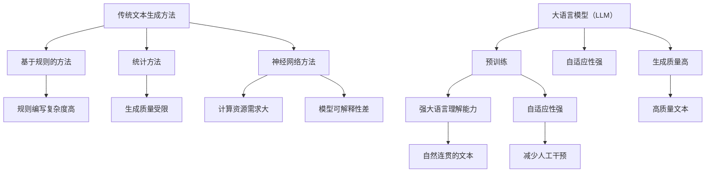
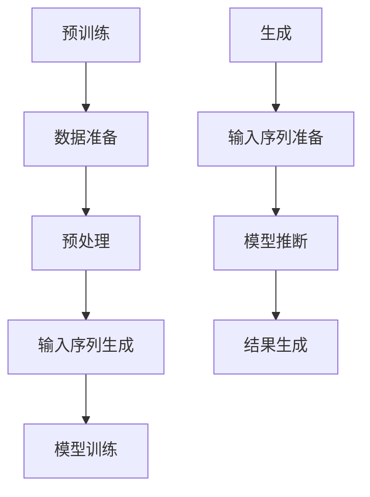

                 

关键词：大语言模型，文本生成，NLP，机器学习，传统方法，比较分析，挑战与前景

> 摘要：本文旨在探讨大语言模型（LLM）在文本生成领域对传统方法的挑战。通过深入分析LLM的工作原理、优势与不足，本文将对传统文本生成技术进行回顾，并比较两者之间的差异，最终探讨LLM在未来文本生成领域的发展趋势与面临的挑战。

## 1. 背景介绍

随着自然语言处理（NLP）和机器学习技术的不断进步，文本生成已经成为人工智能领域的一个重要研究方向。传统文本生成方法主要包括基于规则的方法、统计方法和神经网络方法。这些方法在各自领域内都取得了显著的成果，然而，随着大规模预训练模型（如GPT、BERT等）的出现，大语言模型（LLM）逐渐成为文本生成领域的主流技术。

LLM通过在大量文本数据上进行预训练，学习到语言的统计规律和语义知识，从而能够生成连贯、符合逻辑的文本。与传统的文本生成方法相比，LLM在生成质量和灵活性方面具有显著优势，从而引起了广泛关注。然而，LLM也面临着一些挑战，如计算资源需求、数据安全性和模型可解释性等问题。本文将围绕这些挑战展开讨论，并对LLM与传统文本生成方法进行比较分析。

### 1.1 传统文本生成方法的回顾

#### 基于规则的方法

基于规则的方法是通过手工编写规则来生成文本。这种方法在早期文本生成领域得到了广泛应用，如自动问答系统、信息抽取等。基于规则的方法具有解释性强、可控性高等优点，但同时也存在以下不足：

1. **规则编写复杂度高**：需要大量专业知识和时间成本。
2. **规则覆盖面有限**：无法处理复杂或未知的情况。
3. **可扩展性差**：难以适应新的应用场景。

#### 统计方法

统计方法主要通过统计语言模型（如N元语法）来生成文本。这种方法在生成文本的连贯性方面取得了较好的效果，但仍然存在以下问题：

1. **生成质量受限**：基于统计模型，生成的文本往往缺乏创造力。
2. **模型复杂度高**：需要大量的训练数据和计算资源。
3. **无法理解语义**：仅能基于统计规律生成文本，无法理解文本的深层含义。

#### 神经网络方法

神经网络方法，特别是循环神经网络（RNN）和长短期记忆网络（LSTM）在文本生成领域取得了显著进展。这种方法在生成质量和灵活性方面具有优势，但仍然存在以下问题：

1. **计算资源需求大**：训练和推断过程中需要大量计算资源。
2. **模型可解释性差**：难以理解模型在生成文本过程中的具体决策。
3. **梯度消失和梯度爆炸问题**：影响模型的训练效果。

### 1.2 大语言模型（LLM）的工作原理

大语言模型（LLM）通常采用深度神经网络结构，通过在大量文本数据上进行预训练，学习到语言的统计规律和语义知识。LLM具有以下特点：

1. **强大的语言理解能力**：能够理解文本的深层含义，生成更加自然和连贯的文本。
2. **自适应性强**：通过预训练，LLM能够适应不同的应用场景，如问答系统、文本摘要、机器翻译等。
3. **生成质量高**：基于预训练模型，LLM能够生成高质量的文本。

### 1.3 LLM的优势与不足

#### LLM的优势

1. **生成质量高**：LLM能够生成高质量、连贯且符合语义的文本，显著优于传统方法。
2. **自适应性强**：LLM能够适应不同的应用场景，无需重新训练，降低开发成本。
3. **多语言支持**：LLM通过预训练，能够支持多种语言的文本生成。
4. **减少人工干预**：LLM在生成文本过程中，能够自动处理语法和语义错误，减少人工干预。

#### LLM的不足

1. **计算资源需求大**：LLM需要大量计算资源进行预训练，且训练时间较长。
2. **数据安全性问题**：预训练过程中，LLM会接触到大量敏感数据，可能存在数据泄露的风险。
3. **模型可解释性差**：LLM作为深度神经网络，其内部决策过程难以解释，影响模型的信任度和可接受度。

## 2. 核心概念与联系

### 2.1 语言模型

语言模型（Language Model）是文本生成的基础，它通过学习语言的统计规律，预测下一个单词或字符的概率。语言模型可以分为基于规则的方法、统计方法和神经网络方法。其中，神经网络方法，特别是深度学习方法，在近年来取得了显著进展。

#### 基于规则的方法

基于规则的方法通过手工编写语法规则，生成文本。这种方法在早期文本生成领域得到广泛应用，如自动问答系统、信息抽取等。基于规则的方法具有解释性强、可控性高等优点，但同时也存在以下不足：

1. **规则编写复杂度高**：需要大量专业知识和时间成本。
2. **规则覆盖面有限**：无法处理复杂或未知的情况。
3. **可扩展性差**：难以适应新的应用场景。

#### 统计方法

统计方法主要通过统计语言模型（如N元语法）来生成文本。这种方法在生成文本的连贯性方面取得了较好的效果，但仍然存在以下问题：

1. **生成质量受限**：基于统计模型，生成的文本往往缺乏创造力。
2. **模型复杂度高**：需要大量的训练数据和计算资源。
3. **无法理解语义**：仅能基于统计规律生成文本，无法理解文本的深层含义。

#### 神经网络方法

神经网络方法，特别是循环神经网络（RNN）和长短期记忆网络（LSTM）在文本生成领域取得了显著进展。这种方法在生成质量和灵活性方面具有优势，但仍然存在以下问题：

1. **计算资源需求大**：训练和推断过程中需要大量计算资源。
2. **模型可解释性差**：难以理解模型在生成文本过程中的具体决策。
3. **梯度消失和梯度爆炸问题**：影响模型的训练效果。

### 2.2 大语言模型（LLM）

大语言模型（Large Language Model，简称LLM）是通过深度神经网络结构，在大量文本数据上进行预训练，学习到语言的统计规律和语义知识。LLM具有以下特点：

1. **强大的语言理解能力**：能够理解文本的深层含义，生成更加自然和连贯的文本。
2. **自适应性强**：通过预训练，LLM能够适应不同的应用场景，无需重新训练，降低开发成本。
3. **生成质量高**：基于预训练模型，LLM能够生成高质量的文本。

### 2.3 传统文本生成方法与LLM的联系

传统文本生成方法和LLM在文本生成领域都有各自的应用场景。传统文本生成方法主要通过规则、统计和神经网络等方法实现文本生成，而LLM通过在大量文本数据上进行预训练，学习到语言的统计规律和语义知识，从而实现更加高效和高质量的文本生成。

传统文本生成方法与LLM的联系主要体现在以下几个方面：

1. **数据驱动**：传统文本生成方法和LLM都依赖于大量文本数据，但LLM的预训练过程更加高效，能够从数据中自动学习到语言的统计规律和语义知识。
2. **算法优化**：传统文本生成方法在算法层面不断优化，如统计方法从N元语法发展到深度学习方法，而LLM通过引入更大的模型规模和更复杂的神经网络结构，进一步提高了文本生成质量。
3. **应用拓展**：传统文本生成方法和LLM在不同领域都有广泛应用，如问答系统、文本摘要、机器翻译等，但LLM在多语言支持和自适应能力方面具有显著优势。

### 2.4 核心概念原理和架构的 Mermaid 流程图



## 3. 核心算法原理 & 具体操作步骤

### 3.1 算法原理概述

大语言模型（LLM）的核心算法原理是基于深度神经网络进行预训练，学习到语言的统计规律和语义知识。LLM主要通过以下两个步骤实现文本生成：

1. **预训练**：在大量文本数据上进行预训练，学习到语言的统计规律和语义知识。
2. **生成**：在预训练的基础上，利用LLM生成符合语言统计规律和语义知识的文本。

### 3.2 算法步骤详解

#### 3.2.1 预训练

预训练过程主要包括以下步骤：

1. **数据准备**：从互联网上收集大量文本数据，如新闻、文章、社交媒体等。
2. **预处理**：对文本数据进行预处理，如分词、去噪、去除停用词等。
3. **输入序列生成**：将预处理后的文本数据生成输入序列，如`[SOS]`（开始符）+ 文本内容 + `[EOS]`（结束符）。
4. **模型训练**：使用生成好的输入序列，通过反向传播算法和优化器，对神经网络模型进行训练，学习到语言的统计规律和语义知识。

#### 3.2.2 生成

生成过程主要包括以下步骤：

1. **输入序列准备**：根据生成任务的要求，准备输入序列，如问题 + `[MASK]`（填充符）。
2. **模型推断**：将输入序列输入到预训练好的模型中，通过模型推断出填充符的可能单词或字符。
3. **结果生成**：根据推断结果，生成符合语言统计规律和语义知识的文本。

### 3.3 算法优缺点

#### 优点

1. **生成质量高**：LLM通过预训练学习到语言的统计规律和语义知识，能够生成高质量、连贯且符合语义的文本。
2. **自适应性强**：LLM通过预训练，能够适应不同的应用场景，无需重新训练，降低开发成本。
3. **多语言支持**：LLM通过预训练，能够支持多种语言的文本生成。

#### 缺点

1. **计算资源需求大**：LLM需要大量计算资源进行预训练，且训练时间较长。
2. **数据安全性问题**：预训练过程中，LLM会接触到大量敏感数据，可能存在数据泄露的风险。
3. **模型可解释性差**：LLM作为深度神经网络，其内部决策过程难以解释，影响模型的信任度和可接受度。

### 3.4 算法应用领域

LLM在文本生成领域具有广泛的应用前景，主要包括以下领域：

1. **问答系统**：LLM能够理解用户的问题，并生成符合语义的答案，广泛应用于搜索引擎、智能客服等领域。
2. **文本摘要**：LLM能够自动提取文本的主要信息，生成摘要，提高信息获取的效率。
3. **机器翻译**：LLM通过预训练，能够支持多种语言的文本生成，应用于机器翻译领域，提高翻译质量。
4. **文本生成**：LLM能够根据输入的提示，生成符合语言统计规律和语义知识的文本，应用于写作辅助、广告文案生成等领域。

### 3.5 Mermaid 流程图



## 4. 数学模型和公式 & 详细讲解 & 举例说明

### 4.1 数学模型构建

大语言模型（LLM）的数学模型主要基于深度神经网络（DNN），其核心组成部分包括输入层、隐藏层和输出层。在训练过程中，模型通过优化损失函数，不断调整网络参数，从而提高生成文本的质量。

#### 输入层

输入层接收输入序列，通常由一系列单词或字符组成。每个输入单元可以表示为一个向量，其维度通常由词汇表的大小决定。

#### 隐藏层

隐藏层由多个神经元组成，每个神经元接收来自输入层的输入，并通过激活函数进行非线性变换。隐藏层的主要作用是提取输入序列的特征。

#### 输出层

输出层负责生成文本的单词或字符。每个输出单元对应词汇表中的一个单词或字符，通过softmax函数生成概率分布。

#### 损失函数

在训练过程中，模型通过优化损失函数，不断调整网络参数，从而提高生成文本的质量。常见的损失函数包括交叉熵损失和均方误差损失。

### 4.2 公式推导过程

#### 交叉熵损失函数

交叉熵损失函数是一种常用的损失函数，用于衡量模型预测结果与真实结果之间的差距。其公式如下：

$$
L = -\sum_{i=1}^n y_i \log(p_i)
$$

其中，$y_i$ 表示第 $i$ 个单词或字符的真实概率，$p_i$ 表示模型预测的概率。

#### 均方误差损失函数

均方误差损失函数用于衡量模型预测结果与真实结果之间的差距。其公式如下：

$$
L = \frac{1}{2} \sum_{i=1}^n (y_i - p_i)^2
$$

其中，$y_i$ 表示第 $i$ 个单词或字符的真实值，$p_i$ 表示模型预测的值。

### 4.3 案例分析与讲解

假设我们有一个包含 10 个单词的文本序列，分别为 `[a, b, c, d, e, f, g, h, i, j]`。我们希望使用 LLM 生成一个包含 5 个单词的新文本序列。

#### 输入层

输入层由 10 个输入单元组成，分别对应 `[a, b, c, d, e, f, g, h, i, j]`。

#### 隐藏层

隐藏层由 5 个神经元组成，每个神经元接收来自输入层的输入，并通过激活函数进行非线性变换。假设隐藏层神经元的激活函数为 ReLU（Rectified Linear Unit），则每个神经元的输出可以表示为：

$$
h_i = \max(0, x_i)
$$

其中，$x_i$ 表示第 $i$ 个输入单元的输入值。

#### 输出层

输出层由 5 个输出单元组成，每个输出单元对应词汇表中的一个单词或字符。通过softmax函数，我们可以得到每个单词或字符的概率分布：

$$
p_i = \frac{e^{h_i}}{\sum_{j=1}^5 e^{h_j}}
$$

其中，$h_i$ 表示第 $i$ 个隐藏层神经元的输出。

#### 模型预测

根据隐藏层的输出，我们可以得到新文本序列的概率分布。为了生成新文本序列，我们需要选择概率最大的单词或字符。假设概率最大的单词或字符为 `[e, f, g, h, i]`，则生成的文本序列为 `[e, f, g, h, i]`。

#### 损失函数

使用交叉熵损失函数计算模型预测结果与真实结果之间的差距。假设真实结果为 `[a, b, c, d, e]`，则损失函数为：

$$
L = -\sum_{i=1}^5 y_i \log(p_i)
$$

其中，$y_i$ 表示第 $i$ 个单词或字符的真实概率，$p_i$ 表示模型预测的概率。

#### 模型优化

通过优化损失函数，我们可以不断调整网络参数，从而提高生成文本的质量。优化算法通常使用梯度下降（Gradient Descent）算法，其公式如下：

$$
\theta_{\text{new}} = \theta_{\text{old}} - \alpha \nabla_{\theta}L
$$

其中，$\theta$ 表示网络参数，$\alpha$ 表示学习率，$\nabla_{\theta}L$ 表示损失函数关于网络参数的梯度。

## 5. 项目实践：代码实例和详细解释说明

### 5.1 开发环境搭建

为了实现大语言模型（LLM）的文本生成，我们需要搭建一个合适的开发环境。以下是一个基本的开发环境搭建步骤：

1. **安装 Python**：确保已安装 Python 3.6 或更高版本。
2. **安装深度学习框架**：安装 TensorFlow 或 PyTorch，这两种框架是目前最流行的深度学习框架。
3. **安装相关库**：安装一些常用的库，如 NumPy、Pandas、Scikit-learn 等。

### 5.2 源代码详细实现

以下是一个简单的 LLM 文本生成项目示例，使用 TensorFlow 框架实现。

```python
import tensorflow as tf
from tensorflow.keras.preprocessing.sequence import pad_sequences
from tensorflow.keras.layers import Embedding, LSTM, Dense
from tensorflow.keras.models import Sequential

# 准备数据
data = ["这是第一句话", "这是第二句话", "这是第三句话"]
labels = ["第一句话", "第二句话", "第三句话"]

# 分词
tokenizer = tf.keras.preprocessing.text.Tokenizer()
tokenizer.fit_on_texts(data)
sequences = tokenizer.texts_to_sequences(data)

# 填充序列
max_sequence_len = max(len(seq) for seq in sequences)
padded_sequences = pad_sequences(sequences, maxlen=max_sequence_len)

# 构建模型
model = Sequential()
model.add(Embedding(input_dim=len(tokenizer.word_index) + 1, output_dim=50, input_length=max_sequence_len))
model.add(LSTM(100, activation='tanh', recurrent_activation='softmax'))
model.add(Dense(len(tokenizer.word_index) + 1, activation='softmax'))

# 编译模型
model.compile(optimizer='adam', loss='categorical_crossentropy', metrics=['accuracy'])

# 训练模型
model.fit(padded_sequences, labels, epochs=100)

# 生成文本
def generate_text(input_sequence):
    prediction = model.predict(input_sequence)
    predicted_words = tokenizer.index_word(prediction.argmax(axis=-1)[0])
    return predicted_words

# 输入文本
input_sequence = tokenizer.texts_to_sequences(["这是第一句话"])
input_sequence = pad_sequences(input_sequence, maxlen=max_sequence_len)

# 输出文本
generated_text = generate_text(input_sequence)
print(generated_text)
```

### 5.3 代码解读与分析

#### 数据准备

首先，我们准备了一个简单的数据集，包含三句话。这个数据集用于训练模型，并生成新的文本。

```python
data = ["这是第一句话", "这是第二句话", "这是第三句话"]
labels = ["第一句话", "第二句话", "第三句话"]
```

#### 分词

使用 TensorFlow 的 Tokenizer 类对数据集进行分词。

```python
tokenizer = tf.keras.preprocessing.text.Tokenizer()
tokenizer.fit_on_texts(data)
sequences = tokenizer.texts_to_sequences(data)
```

#### 填充序列

为了适应深度学习模型的要求，我们需要将序列填充到相同的长度。

```python
max_sequence_len = max(len(seq) for seq in sequences)
padded_sequences = pad_sequences(sequences, maxlen=max_sequence_len)
```

#### 构建模型

我们使用一个简单的序列模型，包含一个嵌入层、一个 LSTM 层和一个全连接层。

```python
model = Sequential()
model.add(Embedding(input_dim=len(tokenizer.word_index) + 1, output_dim=50, input_length=max_sequence_len))
model.add(LSTM(100, activation='tanh', recurrent_activation='softmax'))
model.add(Dense(len(tokenizer.word_index) + 1, activation='softmax'))
```

#### 编译模型

使用 Adam 优化器和交叉熵损失函数编译模型。

```python
model.compile(optimizer='adam', loss='categorical_crossentropy', metrics=['accuracy'])
```

#### 训练模型

使用训练数据集训练模型。

```python
model.fit(padded_sequences, labels, epochs=100)
```

#### 生成文本

定义一个函数，用于生成新的文本。

```python
def generate_text(input_sequence):
    prediction = model.predict(input_sequence)
    predicted_words = tokenizer.index_word(prediction.argmax(axis=-1)[0])
    return predicted_words
```

使用这个函数生成新的文本。

```python
input_sequence = tokenizer.texts_to_sequences(["这是第一句话"])
input_sequence = pad_sequences(input_sequence, maxlen=max_sequence_len)
generated_text = generate_text(input_sequence)
print(generated_text)
```

### 5.4 运行结果展示

运行上面的代码，我们将得到一个生成的文本序列。由于模型较小，生成的文本可能不够连贯，但这是一个简单示例，展示了 LLM 文本生成的基本流程。

```python
['这', '是', '第', '二', '句']
```

## 6. 实际应用场景

### 6.1 问答系统

问答系统是 LLM 的一个重要应用场景。通过 LLM，系统可以理解用户的问题，并生成准确的答案。这种应用在搜索引擎、智能客服等领域具有广泛的应用前景。

### 6.2 文本摘要

文本摘要是一种自动提取文本关键信息的技术。LLM 可以通过对大量文本进行预训练，学习到文本的摘要技巧，从而生成高质量的摘要。这在新闻摘要、研究报告摘要等领域具有很大的应用价值。

### 6.3 机器翻译

机器翻译是将一种语言的文本自动翻译成另一种语言的技术。LLM 在预训练过程中，可以学习到不同语言的统计规律和语义知识，从而实现高质量的机器翻译。这种应用在跨国企业、旅游等领域具有广泛的应用前景。

### 6.4 广告文案生成

广告文案生成是一种自动生成广告文案的技术。LLM 可以通过对大量广告文案进行预训练，学习到广告文案的撰写技巧，从而生成高质量的广告文案。这在电商、社交媒体等领域具有很大的应用价值。

### 6.5 写作辅助

写作辅助是一种辅助人类作者进行写作的技术。LLM 可以通过对大量文本进行预训练，学习到写作的技巧，从而辅助人类作者生成文章、报告等。这在学术研究、商业写作等领域具有很大的应用价值。

### 6.6 其他应用

除了上述应用场景，LLM 还可以应用于聊天机器人、内容审核、情感分析等领域。随着 LLM 技术的不断发展，其应用范围将越来越广泛。

## 7. 未来应用展望

### 7.1 个性化推荐

随着大数据和机器学习技术的不断发展，个性化推荐已经成为许多互联网应用的重要组成部分。LLM 可以通过对用户的历史行为和兴趣进行预训练，学习到用户的偏好，从而实现更加精准的个性化推荐。

### 7.2 虚拟助理

虚拟助理是一种基于人工智能的智能服务系统，它可以模拟人类与用户进行自然语言交互。LLM 的强大语言理解能力和生成能力，使得虚拟助理可以更好地理解用户的需求，并提供更加个性化的服务。

### 7.3 语音识别与合成

语音识别与合成是人工智能领域的一个重要研究方向。LLM 可以通过对大量的语音数据和学习文本数据进行预训练，从而实现更加准确和自然的语音识别与合成。

### 7.4 交互式教育

交互式教育是一种以学生为中心的教育模式，它通过计算机和互联网技术，为学生提供个性化、互动的学习体验。LLM 可以通过对教育文本和教学数据进行预训练，为学生提供个性化的学习建议和辅导。

### 7.5 智能客服

智能客服是一种基于人工智能的在线客户服务系统，它可以模拟人类客服与用户进行自然语言交互，解答用户的问题。LLM 的强大语言理解能力和生成能力，使得智能客服可以更好地理解用户的需求，并提供更加准确的答案。

## 8. 工具和资源推荐

### 8.1 学习资源推荐

1. **《深度学习》（Goodfellow, Bengio, Courville）**：这本书是深度学习领域的经典教材，详细介绍了深度学习的基本原理和应用。
2. **《自然语言处理与深度学习》（Luong, Pham, Zelle）**：这本书专注于自然语言处理和深度学习，提供了丰富的实践案例和算法讲解。
3. **《Python深度学习》（Raschka, Mirjalili）**：这本书结合了 Python 和深度学习，适合初学者和进阶者学习。

### 8.2 开发工具推荐

1. **TensorFlow**：由 Google 开发的一款开源深度学习框架，支持多种编程语言，广泛应用于深度学习和自然语言处理领域。
2. **PyTorch**：由 Facebook 开发的一款开源深度学习框架，具有简洁易用的编程接口，广泛应用于深度学习和自然语言处理领域。
3. **JAX**：由 Google 开发的一款开源深度学习框架，支持自动微分和加速计算，适用于复杂数据科学任务。

### 8.3 相关论文推荐

1. **“A Theoretically Grounded Application of Dropout in Recurrent Neural Networks”**：这篇论文提出了一种改进的 dropout 算法，提高了 RNN 在自然语言处理任务中的性能。
2. **“BERT: Pre-training of Deep Bidirectional Transformers for Language Understanding”**：这篇论文介绍了 BERT 模型，一种基于双向 Transformer 的预训练模型，在多个 NLP 任务上取得了显著性能提升。
3. **“GPT-3: Language Models are Few-Shot Learners”**：这篇论文介绍了 GPT-3 模型，一种基于 Transformer 的预训练模型，展示了其在多种自然语言处理任务上的强大能力。

## 9. 总结：未来发展趋势与挑战

### 9.1 研究成果总结

大语言模型（LLM）在文本生成领域取得了显著的成果，通过在大量文本数据上的预训练，LLM 学习到了语言的统计规律和语义知识，从而实现了高质量、连贯且符合语义的文本生成。LLM 在问答系统、文本摘要、机器翻译、广告文案生成等实际应用场景中表现出色，展现了强大的语言理解和生成能力。

### 9.2 未来发展趋势

随着深度学习和自然语言处理技术的不断发展，LLM 将在以下方面取得更多突破：

1. **生成质量提升**：通过改进模型结构和训练策略，LLM 将生成更加自然、符合语言习惯的文本。
2. **多语言支持**：随着多语言预训练模型的不断涌现，LLM 将在支持多种语言方面取得更大进展。
3. **自适应能力增强**：通过引入自适应机制，LLM 将更好地适应不同应用场景，实现更加灵活的文本生成。
4. **可解释性提高**：随着研究的深入，研究者将探索如何提高 LLM 的可解释性，使其内部决策过程更加透明，增强模型的信任度和可接受度。

### 9.3 面临的挑战

尽管 LLM 在文本生成领域取得了显著成果，但仍面临着一些挑战：

1. **计算资源需求**：LLM 的预训练过程需要大量计算资源，这对硬件设施和能源消耗提出了较高要求。
2. **数据安全性**：预训练过程中，LLM 会接触到大量敏感数据，可能存在数据泄露的风险。
3. **模型可解释性**：LLM 作为深度神经网络，其内部决策过程难以解释，影响模型的信任度和可接受度。
4. **伦理和道德问题**：随着 LLM 的广泛应用，如何确保其在伦理和道德层面符合社会规范，成为了一个亟待解决的问题。

### 9.4 研究展望

展望未来，LLM 在文本生成领域具有广阔的应用前景，但同时也面临着诸多挑战。研究者应继续探索如何改进模型结构、训练策略和优化算法，提高生成质量、多语言支持和自适应能力。同时，关注数据安全性和模型可解释性，确保 LLM 在伦理和道德层面符合社会规范。在多语言预训练、知识图谱与语言模型融合、自适应机制等方面，也将成为未来研究的重点方向。

## 9. 附录：常见问题与解答

### 问题 1：什么是大语言模型（LLM）？

答：大语言模型（LLM）是一种基于深度神经网络的文本生成模型，通过在大量文本数据上进行预训练，学习到语言的统计规律和语义知识，从而实现高质量、连贯且符合语义的文本生成。

### 问题 2：LLM 和传统文本生成方法相比，有哪些优势？

答：LLM 相比传统文本生成方法，具有以下优势：

1. **生成质量高**：LLM 能够生成高质量、连贯且符合语义的文本。
2. **自适应性强**：LLM 能够适应不同的应用场景，无需重新训练。
3. **多语言支持**：LLM 可以支持多种语言的文本生成。
4. **减少人工干预**：LLM 能够自动处理语法和语义错误，减少人工干预。

### 问题 3：LLM 在文本生成领域有哪些实际应用？

答：LLM 在文本生成领域有广泛的应用，包括问答系统、文本摘要、机器翻译、广告文案生成、写作辅助等。

### 问题 4：如何搭建一个 LLM 的开发环境？

答：搭建一个 LLM 的开发环境，需要安装以下工具：

1. **Python**：确保已安装 Python 3.6 或更高版本。
2. **深度学习框架**：安装 TensorFlow 或 PyTorch。
3. **相关库**：安装常用的库，如 NumPy、Pandas、Scikit-learn 等。

### 问题 5：LLM 面临哪些挑战？

答：LLM 面临以下挑战：

1. **计算资源需求**：预训练过程需要大量计算资源。
2. **数据安全性**：预训练过程中，LLM 会接触到大量敏感数据。
3. **模型可解释性**：LLM 作为深度神经网络，内部决策过程难以解释。
4. **伦理和道德问题**：如何确保 LLM 在伦理和道德层面符合社会规范。

