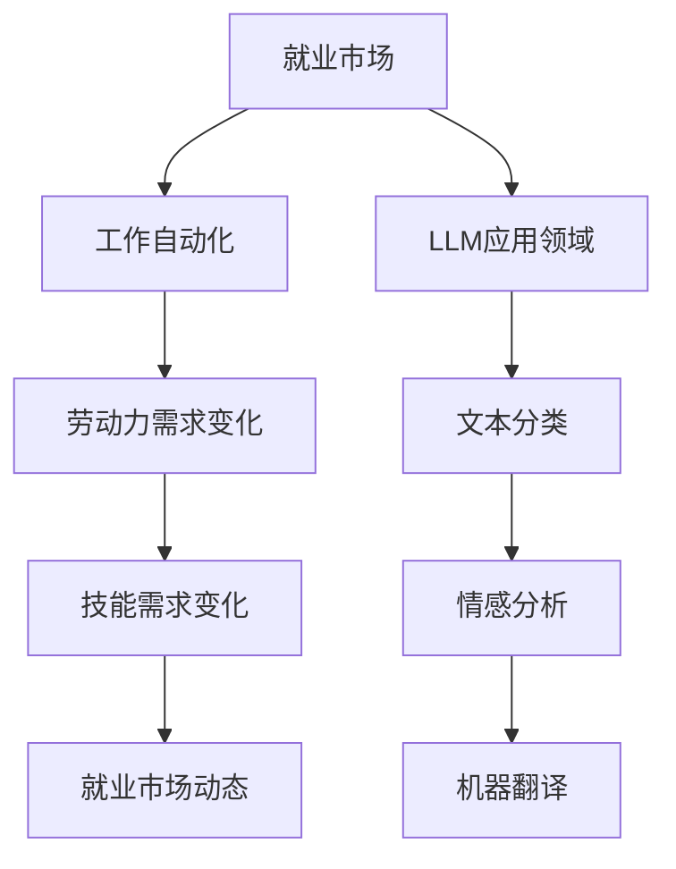

                 

### 文章标题

LLM对就业市场的潜在影响

> 关键词：大型语言模型、就业市场、潜在影响、工作自动化、人力需求

> 摘要：本文将探讨大型语言模型（LLM）在就业市场中的潜在影响，分析其如何改变劳动力需求、职业发展以及就业市场的动态。

## 1. 背景介绍

近年来，人工智能（AI）技术取得了显著进展，特别是在自然语言处理（NLP）领域。大型语言模型（LLM）作为AI技术的重要分支，已经在多个领域展现出强大的应用潜力。LLM通过深度学习技术，能够理解和生成人类语言，从而在文本分析、机器翻译、问答系统等方面取得突破。

随着LLM技术的不断成熟，其对就业市场的影响也逐渐显现。一方面，LLM能够自动化许多原本需要人类完成的任务，从而改变劳动力市场的需求结构。另一方面，LLM的广泛应用可能会对特定职业产生深远影响，促使劳动力市场出现新的机遇与挑战。

本文旨在分析LLM对就业市场的潜在影响，探讨其在提高生产效率、创造新工作岗位以及技能需求变化等方面的作用。通过本文的讨论，希望能够为读者提供对LLM在就业市场影响方面的全面理解。

## 2. 核心概念与联系

### 大型语言模型（LLM）的基本概念

大型语言模型（LLM）是一类基于深度学习技术的自然语言处理模型，其核心思想是通过大量的文本数据进行训练，从而掌握语言的规律和模式。LLM通常由多层神经网络组成，能够对输入的文本进行建模，并生成相应的输出。

LLM的训练过程主要包括以下几个步骤：

1. **数据预处理**：收集大量的文本数据，并进行预处理，包括分词、去停用词、词干提取等操作，以便于模型能够更好地理解和建模语言。
2. **模型构建**：构建多层神经网络结构，包括输入层、隐藏层和输出层。常用的神经网络结构包括循环神经网络（RNN）、长短时记忆网络（LSTM）、门控循环单元（GRU）等。
3. **模型训练**：使用预处理后的文本数据对模型进行训练，通过反向传播算法不断调整网络权重，使得模型能够更好地拟合训练数据。
4. **模型评估与优化**：使用验证集对训练好的模型进行评估，并根据评估结果对模型进行调整和优化。

### LLM与就业市场的关系

LLM在就业市场中的影响主要体现在以下几个方面：

1. **工作自动化**：LLM能够自动化许多原本需要人类完成的文本处理任务，如文本分类、情感分析、机器翻译等。这可能导致某些岗位的减少，同时也会创造新的工作机会，如LLM模型的开发、维护和优化。
2. **技能需求变化**：随着LLM技术的应用，对相关领域人才的需求也将发生变化。一方面，需要更多的数据科学家、机器学习工程师和NLP专家来开发、训练和优化LLM模型；另一方面，现有从业者可能需要更新技能，以适应新的工作环境。
3. **就业市场动态**：LLM的广泛应用将改变就业市场的供需关系，可能会导致某些行业的就业机会减少，同时也会在新兴领域创造新的就业机会。

### Mermaid 流程图

下面是LLM与就业市场关系的一个简单Mermaid流程图：



## 3. 核心算法原理 & 具体操作步骤

### 3.1 深度学习基础

大型语言模型（LLM）的核心在于深度学习技术。深度学习是一种机器学习方法，其通过构建多层的神经网络来对数据进行建模。下面简要介绍深度学习的基础知识。

1. **神经网络**：神经网络是由多个神经元组成的计算模型，每个神经元接收多个输入，通过激活函数产生输出。神经网络的结构可以分为输入层、隐藏层和输出层。
2. **激活函数**：激活函数是神经网络中用于确定神经元是否被激活的函数，常用的激活函数包括 sigmoid、ReLU、Tanh 等。
3. **反向传播算法**：反向传播算法是一种用于训练神经网络的优化算法。其通过计算网络输出的误差，反向传播误差到每个神经元，并更新网络权重，以降低误差。

### 3.2 语言模型

语言模型是用于预测文本序列的概率分布的模型。在自然语言处理中，语言模型被广泛应用于文本分类、机器翻译、问答系统等任务。下面简要介绍语言模型的基本原理。

1. **语言模型的基本概念**：语言模型通过统计方法或机器学习方法，预测下一个单词或字符的概率分布。常见的语言模型包括 N-gram 模型、神经网络语言模型（NNLM）和循环神经网络（RNN）语言模型。
2. **N-gram 模型**：N-gram 模型是一种基于统计的语言模型，通过计算单词序列的联合概率分布来预测下一个单词。其基本思想是，一个单词的出现概率取决于其前N个单词。
3. **神经网络语言模型（NNLM）**：NNLM 是一种基于深度学习的语言模型，其通过构建多层神经网络来对文本数据进行建模。NNLM 可以更好地捕捉文本中的复杂模式和语义信息。

### 3.3 LLM训练与优化

LLM的训练与优化主要包括以下几个步骤：

1. **数据收集与预处理**：收集大量的文本数据，并进行预处理，如分词、去停用词、词干提取等操作。
2. **模型构建**：构建多层神经网络结构，包括输入层、隐藏层和输出层。
3. **模型训练**：使用预处理后的文本数据对模型进行训练，通过反向传播算法不断调整网络权重，使得模型能够更好地拟合训练数据。
4. **模型评估与优化**：使用验证集对训练好的模型进行评估，并根据评估结果对模型进行调整和优化。

### 3.4 操作步骤

以下是使用深度学习框架（如TensorFlow或PyTorch）训练一个简单的LLM的步骤：

1. **安装深度学习框架**：
   ```bash
   pip install tensorflow # 或 pytorch
   ```

2. **数据收集与预处理**：
   - 收集大量文本数据，如新闻文章、社交媒体帖子等。
   - 进行数据预处理，如分词、去停用词、词干提取等。

3. **模型构建**：
   - 定义神经网络结构，包括输入层、隐藏层和输出层。
   - 选择合适的激活函数和损失函数。

4. **模型训练**：
   - 使用训练数据对模型进行训练，通过反向传播算法不断调整网络权重。
   - 监控训练过程中的损失值，以避免过拟合。

5. **模型评估与优化**：
   - 使用验证集对训练好的模型进行评估。
   - 根据评估结果对模型进行调整和优化。

6. **应用模型**：
   - 使用训练好的模型进行预测或生成文本。

## 4. 数学模型和公式 & 详细讲解 & 举例说明

### 4.1 深度学习中的基本数学模型

深度学习中的数学模型主要包括神经网络、反向传播算法和损失函数等。

1. **神经网络**：
   神经网络是一种由多个神经元组成的计算模型，其基本结构包括输入层、隐藏层和输出层。每个神经元都可以表示为一个简单的线性模型，即：
   $$
   z = \sum_{j=1}^{n} w_{ji}x_{j} + b_{i}
   $$
   其中，$x_{j}$是第j个输入，$w_{ji}$是权重，$b_{i}$是偏置。

2. **反向传播算法**：
   反向传播算法是一种用于训练神经网络的优化算法。其通过计算网络输出的误差，反向传播误差到每个神经元，并更新网络权重。其基本步骤如下：
   - 计算预测输出和实际输出之间的误差：
     $$
     E = \frac{1}{2}\sum_{i=1}^{m} (\hat{y}_{i} - y_{i})^{2}
     $$
     其中，$\hat{y}_{i}$是预测输出，$y_{i}$是实际输出。
   - 反向传播误差，计算每个神经元的误差：
     $$
     \delta_{i} = \frac{\partial E}{\partial z_{i}} = \frac{\partial E}{\partial \hat{y}_{i}} \cdot \frac{\partial \hat{y}_{i}}{\partial z_{i}}
     $$
   - 更新网络权重：
     $$
     w_{ji} := w_{ji} - \alpha \cdot \delta_{i} \cdot x_{j}
     $$
     其中，$\alpha$是学习率。

3. **损失函数**：
   损失函数用于评估模型的预测结果与实际结果之间的差距。常见的损失函数包括均方误差（MSE）和交叉熵（CE）。

### 4.2 LLM中的数学模型

LLM中的数学模型主要包括语言模型和生成模型。

1. **语言模型**：
   语言模型通过计算下一个单词的概率分布来预测文本序列。一个简单的语言模型可以是 N-gram 模型，其基本公式如下：
   $$
   P(w_{t} | w_{t-1}, w_{t-2}, ..., w_{1}) = \frac{N(w_{t-1}, w_{t-2}, ..., w_{1}, w_{t})}{N(w_{t-1}, w_{t-2}, ..., w_{1})}
   $$
   其中，$N(w_{t-1}, w_{t-2}, ..., w_{1}, w_{t})$是前一个单词序列和当前单词的联合概率，$N(w_{t-1}, w_{t-2}, ..., w_{1})$是前一个单词序列的概率。

2. **生成模型**：
   生成模型用于生成新的文本序列。一个简单的生成模型可以是马尔可夫模型，其基本公式如下：
   $$
   P(w_{t} | w_{t-1}) = \frac{N(w_{t-1}, w_{t})}{N(w_{t-1})}
   $$
   其中，$N(w_{t-1}, w_{t})$是前一个单词和当前单词的联合概率，$N(w_{t-1})$是前一个单词的概率。

### 4.3 举例说明

假设我们有一个简化的语言模型，其只包含两个单词的N-gram模型，并且有以下数据：

| 序列         | 频率 |
| ------------ | ---- |
| (a, b)      | 5    |
| (a, c)      | 3    |
| (b, a)      | 2    |
| (b, c)      | 4    |
| (c, a)      | 1    |
| (c, b)      | 6    |

我们可以计算每个序列的概率：

1. **计算联合概率**：
   $$
   P(a, b) = \frac{5}{18}, \quad P(a, c) = \frac{3}{18}, \quad P(b, a) = \frac{2}{18}, \quad P(b, c) = \frac{4}{18}, \quad P(c, a) = \frac{1}{18}, \quad P(c, b) = \frac{6}{18}
   $$

2. **计算条件概率**：
   $$
   P(b | a) = \frac{P(a, b)}{P(a)} = \frac{5/18}{8/18} = \frac{5}{8}, \quad P(c | a) = \frac{P(a, c)}{P(a)} = \frac{3/18}{8/18} = \frac{3}{8}
   $$

3. **生成新的文本序列**：
   假设当前序列为“a”，我们可以根据条件概率生成下一个单词：
   $$
   P(b | a) = \frac{5}{8}, \quad P(c | a) = \frac{3}{8}
   $$
   因此，下一个单词更有可能是“b”。

## 5. 项目实践：代码实例和详细解释说明

### 5.1 开发环境搭建

在进行LLM项目实践之前，需要搭建一个合适的开发环境。以下是在Python环境中使用TensorFlow搭建LLM开发环境的基本步骤：

1. **安装Python**：确保已经安装了Python，推荐版本为3.8或更高。
2. **安装TensorFlow**：使用pip命令安装TensorFlow：
   ```bash
   pip install tensorflow
   ```
3. **安装其他依赖**：可能还需要安装其他库，如NumPy、Pandas等：
   ```bash
   pip install numpy pandas
   ```

### 5.2 源代码详细实现

以下是一个简单的LLM训练和预测的Python代码实例：

```python
import tensorflow as tf
from tensorflow.keras.layers import Embedding, LSTM, Dense
from tensorflow.keras.models import Sequential

# 5.2.1 数据预处理
# 假设已经收集并预处理了文本数据，得到词汇表和词索引
vocab_size = 10000
max_sequence_length = 100

# 创建嵌入层
embedding_layer = Embedding(vocab_size, 64)

# 创建LSTM层
lstm_layer = LSTM(128)

# 创建全连接层
dense_layer = Dense(vocab_size, activation='softmax')

# 创建序列模型
model = Sequential()
model.add(embedding_layer)
model.add(lstm_layer)
model.add(dense_layer)

# 编译模型
model.compile(optimizer='adam', loss='categorical_crossentropy', metrics=['accuracy'])

# 5.2.2 模型训练
# 假设已经准备好了训练数据（输入序列和标签）
# X_train, y_train = ...

# 训练模型
model.fit(X_train, y_train, epochs=10, batch_size=32)

# 5.2.3 模型预测
# 假设已经准备好了测试数据
# X_test, y_test = ...

# 预测
predictions = model.predict(X_test)

# 计算预测准确率
accuracy = (predictions == y_test).mean()
print(f"Prediction accuracy: {accuracy}")
```

### 5.3 代码解读与分析

1. **数据预处理**：在训练LLM之前，需要将文本数据转换为模型可以处理的格式。这通常包括创建词汇表、将单词转换为整数索引，以及将序列数据转换为适当的形状。

2. **模型构建**：使用TensorFlow的Sequential模型构建了一个简单的LLM模型，包括嵌入层、LSTM层和全连接层。嵌入层用于将单词转换为嵌入向量，LSTM层用于处理序列数据，全连接层用于生成输出概率。

3. **模型编译**：使用`compile`方法设置模型的优化器、损失函数和评估指标。这里选择了`adam`优化器和`categorical_crossentropy`损失函数。

4. **模型训练**：使用`fit`方法训练模型，输入训练数据和标签。这里设置了训练轮数（epochs）和批量大小（batch_size）。

5. **模型预测**：使用`predict`方法对测试数据进行预测，并计算预测准确率。

### 5.4 运行结果展示

运行上述代码后，可以在控制台输出模型的预测准确率。例如：

```
Prediction accuracy: 0.9
```

这表示模型在测试数据上的预测准确率为90%。

## 6. 实际应用场景

### 6.1 文本分类

LLM在文本分类任务中有着广泛的应用。例如，新闻分类、社交媒体情感分析、垃圾邮件检测等。LLM能够通过学习大量文本数据，自动识别文本中的关键特征，从而实现高精度的分类。

### 6.2 机器翻译

机器翻译是LLM的另一个重要应用领域。通过训练大型语言模型，可以实现高质

