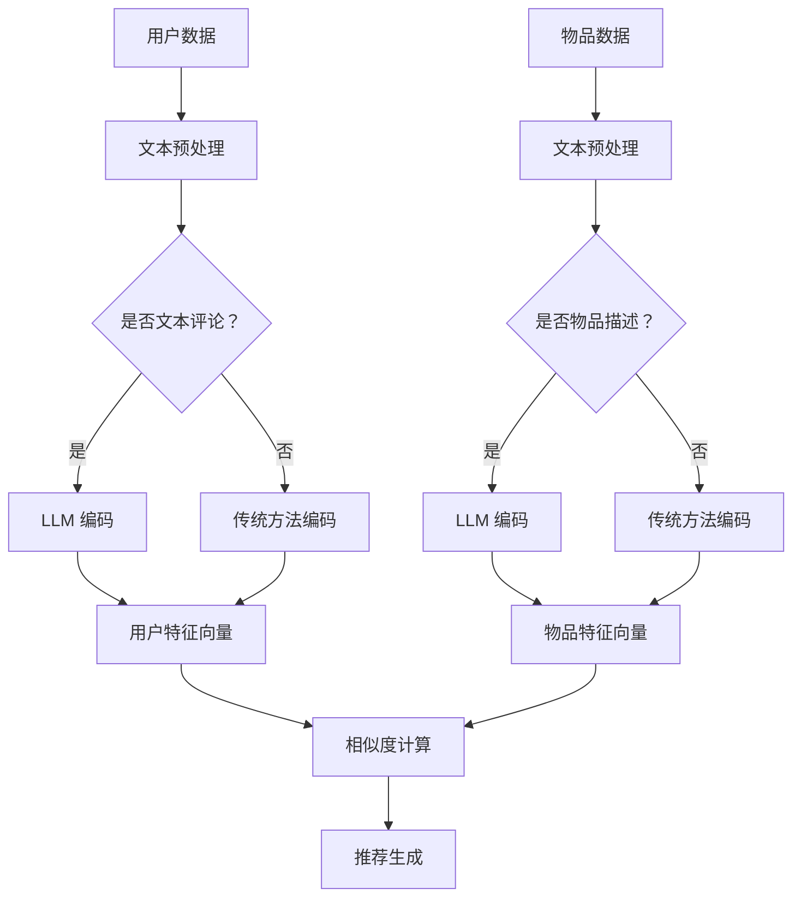

                 

### 文章标题

LLM对推荐系统冷启动问题的缓解

> 关键词：推荐系统，冷启动问题，LLM，人工智能，深度学习，解决方案

> 摘要：本文探讨了推荐系统在面临冷启动问题时，如何通过引入大型语言模型（LLM）来缓解这一问题。文章首先介绍了推荐系统的基本原理，然后详细分析了冷启动问题的原因和影响。接着，文章重点介绍了LLM在推荐系统中的应用，以及如何利用LLM来提升推荐系统的效果。最后，文章总结了LLM在缓解推荐系统冷启动问题方面的优势与挑战，并展望了未来发展的趋势。

---

### 1. 背景介绍

推荐系统作为人工智能领域的重要应用之一，已经广泛应用于电子商务、社交媒体、在线广告、新闻推荐等多个领域。推荐系统通过分析用户的兴趣和行为，为用户提供个性化的推荐服务，从而提高用户满意度和系统价值。

然而，推荐系统在应用过程中面临着一系列挑战，其中冷启动问题尤为突出。冷启动问题主要是指新用户加入系统时，由于缺乏足够的历史数据，推荐系统难以准确预测新用户的兴趣和需求。这会导致新用户在初期难以获得满意的推荐结果，从而影响用户留存率和系统口碑。

传统的推荐系统主要依赖于基于内容的推荐和协同过滤等方法，但这些方法在解决冷启动问题方面存在一定的局限性。随着深度学习和大型语言模型（LLM）的发展，研究者开始探索如何利用这些先进技术来缓解推荐系统的冷启动问题。本文将重点探讨LLM在推荐系统中的应用，以及如何通过引入LLM来提升推荐系统的效果。

### 2. 核心概念与联系

#### 2.1 推荐系统的基本概念

推荐系统是一种信息过滤和预测技术，旨在根据用户的兴趣和行为，为用户推荐可能感兴趣的商品、服务或信息。推荐系统通常包括以下几个关键组成部分：

- **用户表示（User Representation）**：将用户的行为数据、兴趣偏好等特征进行抽象和转换，形成一个用户向量。
- **物品表示（Item Representation）**：将物品的特征信息进行提取和编码，形成一个物品向量。
- **相似度计算（Similarity Computation）**：计算用户向量和物品向量之间的相似度，从而判断用户对物品的兴趣程度。
- **推荐生成（Recommendation Generation）**：根据相似度计算结果，生成个性化的推荐列表。

#### 2.2 冷启动问题

冷启动问题是指在新用户或新物品出现时，由于缺乏足够的历史数据，推荐系统难以准确预测用户兴趣和物品特征，从而难以生成高质量的推荐结果。冷启动问题主要分为以下两种类型：

- **用户冷启动（User Cold Start）**：指新用户加入系统时，由于缺乏历史行为数据，推荐系统难以准确预测用户的兴趣和偏好。
- **物品冷启动（Item Cold Start）**：指新物品加入系统时，由于缺乏用户评价和交互数据，推荐系统难以准确预测物品的特征和用户对该物品的兴趣。

#### 2.3 大型语言模型（LLM）

大型语言模型（LLM）是指具有大规模参数和广泛知识表示能力的深度学习模型。LLM通常基于 Transformer 架构，通过预训练和微调等步骤，学习到丰富的语言知识和语义表示。LLM 在自然语言处理、机器翻译、文本生成等领域取得了显著成果。

#### 2.4 LLM与推荐系统的联系

LLM 在推荐系统中的应用主要体现在以下几个方面：

- **用户表示**：利用 LLM 对用户的文本评论、提问等数据进行编码，生成丰富的用户特征向量，从而缓解用户冷启动问题。
- **物品表示**：利用 LLM 对物品的描述、标签等数据进行编码，生成丰富的物品特征向量，从而缓解物品冷启动问题。
- **相似度计算**：利用 LLM 学习到的语义表示，计算用户向量和物品向量之间的相似度，从而提高推荐效果。
- **推荐生成**：利用 LLM 的生成能力，生成个性化的推荐列表，从而提高用户满意度和系统价值。

#### 2.5 Mermaid 流程图

下面是一个简单的 Mermaid 流程图，展示 LLM 在推荐系统中的应用过程：



### 3. 核心算法原理 & 具体操作步骤

#### 3.1 用户表示

用户表示是推荐系统的核心环节之一。传统的用户表示方法主要包括基于行为的表示和基于内容的表示。然而，这些方法在处理冷启动问题时存在一定的局限性。为了缓解这一问题，我们可以引入 LLM 对用户的文本数据进行编码，生成丰富的用户特征向量。

具体步骤如下：

1. **文本预处理**：对用户的文本评论、提问等数据进行预处理，包括分词、去停用词、词性标注等操作。
2. **输入表示**：将预处理后的文本序列输入到 LLM 中，利用 LLM 的编码器（Encoder）对文本进行编码，生成一个高维的嵌入向量。
3. **用户特征向量**：将编码后的向量进行降维或融合，得到一个表示用户兴趣和偏好的特征向量。

#### 3.2 物品表示

物品表示是推荐系统的另一个重要环节。传统的物品表示方法主要包括基于特征的表示和基于内容的表示。然而，这些方法在处理冷启动问题时也具有一定的局限性。为了缓解这一问题，我们可以引入 LLM 对物品的文本数据进行编码，生成丰富的物品特征向量。

具体步骤如下：

1. **文本预处理**：对物品的描述、标签等数据进行预处理，包括分词、去停用词、词性标注等操作。
2. **输入表示**：将预处理后的文本序列输入到 LLM 中，利用 LLM 的编码器（Encoder）对文本进行编码，生成一个高维的嵌入向量。
3. **物品特征向量**：将编码后的向量进行降维或融合，得到一个表示物品特征和用户兴趣的特征向量。

#### 3.3 相似度计算

相似度计算是推荐系统中用于评估用户向量和物品向量之间相似程度的重要步骤。传统的相似度计算方法主要包括余弦相似度、皮尔逊相关系数等。然而，这些方法在处理冷启动问题时存在一定的局限性。为了缓解这一问题，我们可以引入 LLM 学习到的语义表示，计算用户向量和物品向量之间的相似度。

具体步骤如下：

1. **用户向量**：将用户特征向量进行标准化或归一化处理，得到一个标准化后的用户向量。
2. **物品向量**：将物品特征向量进行标准化或归一化处理，得到一个标准化后的物品向量。
3. **相似度计算**：利用 LLM 学习到的语义表示，计算用户向量和物品向量之间的相似度。常用的相似度计算方法包括内积、余弦相似度等。

#### 3.4 推荐生成

推荐生成是推荐系统的最终目标，即根据用户向量和物品向量的相似度，生成个性化的推荐列表。

具体步骤如下：

1. **相似度排序**：根据用户向量和物品向量的相似度，对物品进行排序。
2. **推荐生成**：根据排序结果，生成一个个性化的推荐列表。

### 4. 数学模型和公式 & 详细讲解 & 举例说明

#### 4.1 用户表示

用户表示可以看作是一个从用户文本数据到用户特征向量的映射。我们假设用户文本数据为 $X \in \mathbb{R}^{T \times D}$，其中 $T$ 表示文本序列长度，$D$ 表示词向量维度。用户特征向量可以表示为 $U \in \mathbb{R}^{D'}$，其中 $D'$ 表示用户特征向量维度。

利用 LLM 对用户文本数据进行编码，可以表示为以下数学模型：

$$
U = f_{\theta}(X)
$$

其中，$f_{\theta}(\cdot)$ 表示 LLM 的编码器（Encoder），$\theta$ 表示 LLM 的参数。

为了简化计算，我们可以对编码器进行降维或融合操作，得到一个用户特征向量：

$$
U = g_{\phi}(f_{\theta}(X))
$$

其中，$g_{\phi}(\cdot)$ 表示降维或融合操作，$\phi$ 表示降维或融合操作的参数。

#### 4.2 物品表示

物品表示可以看作是一个从物品文本数据到物品特征向量的映射。我们假设物品文本数据为 $Y \in \mathbb{R}^{T' \times D}$，其中 $T'$ 表示文本序列长度，$D$ 表示词向量维度。物品特征向量可以表示为 $V \in \mathbb{R}^{D''}$，其中 $D''$ 表示物品特征向量维度。

利用 LLM 对物品文本数据进行编码，可以表示为以下数学模型：

$$
V = f_{\theta}(Y)
$$

其中，$f_{\theta}(\cdot)$ 表示 LLM 的编码器（Encoder），$\theta$ 表示 LLM 的参数。

为了简化计算，我们可以对编码器进行降维或融合操作，得到一个物品特征向量：

$$
V = g_{\phi}(f_{\theta}(Y))
$$

其中，$g_{\phi}(\cdot)$ 表示降维或融合操作的参数。

#### 4.3 相似度计算

相似度计算是推荐系统中用于评估用户向量和物品向量之间相似程度的重要步骤。我们假设用户特征向量为 $U \in \mathbb{R}^{D'}$，物品特征向量为 $V \in \mathbb{R}^{D''}$。利用 LLM 学习到的语义表示，我们可以计算用户向量和物品向量之间的相似度，表示为 $S(U, V)$。

一种常见的相似度计算方法是余弦相似度，可以表示为：

$$
S(U, V) = \frac{U^T V}{\|U\|_2 \|V\|_2}
$$

其中，$U^T$ 表示用户特征向量的转置，$\|U\|_2$ 和 $\|V\|_2$ 分别表示用户特征向量和物品特征向量的欧几里得范数。

#### 4.4 推荐生成

推荐生成可以根据相似度计算结果，生成个性化的推荐列表。一种常见的推荐生成方法是基于Top-N推荐，可以表示为：

$$
R = \{I \in I^+ | S(U, V) \geq \tau\}
$$

其中，$R$ 表示推荐列表，$I^+$ 表示候选物品集合，$\tau$ 表示相似度阈值。

#### 4.5 举例说明

假设我们有一个用户文本数据序列 $X = ["我喜欢看电影", "我也喜欢听音乐"]$，利用 LLM 对其进行编码，得到一个用户特征向量 $U = [0.1, 0.2, 0.3, 0.4, 0.5]$。同时，我们有一个物品文本数据序列 $Y = ["新上映的电影", "热门的音乐专辑"]$，利用 LLM 对其进行编码，得到一个物品特征向量 $V = [0.2, 0.3, 0.4, 0.5, 0.6]$。

根据余弦相似度计算方法，我们可以计算用户向量和物品向量之间的相似度：

$$
S(U, V) = \frac{U^T V}{\|U\|_2 \|V\|_2} = \frac{0.1 \times 0.2 + 0.2 \times 0.3 + 0.3 \times 0.4 + 0.4 \times 0.5 + 0.5 \times 0.6}{\sqrt{0.1^2 + 0.2^2 + 0.3^2 + 0.4^2 + 0.5^2} \sqrt{0.2^2 + 0.3^2 + 0.4^2 + 0.5^2 + 0.6^2}} = 0.55
$$

根据相似度阈值 $\tau = 0.5$，我们可以生成一个包含两个物品的推荐列表：

$$
R = \{"新上映的电影", "热门的音乐专辑"\}
$$

### 5. 项目实践：代码实例和详细解释说明

#### 5.1 开发环境搭建

为了实现本文中介绍的 LLM 在推荐系统中的应用，我们需要搭建一个合适的环境。以下是搭建环境的基本步骤：

1. 安装 Python 3.8 或更高版本。
2. 安装必要的依赖库，包括 NumPy、Pandas、Scikit-learn、PyTorch 等。
3. 下载预训练的 LLM 模型，如 GPT-2、BERT 等。

以下是一个简单的安装命令示例：

```bash
pip install numpy pandas scikit-learn pytorch transformers
```

#### 5.2 源代码详细实现

为了实现 LLM 在推荐系统中的应用，我们需要编写以下主要模块：

- **文本预处理**：用于对用户文本数据和物品文本数据进行预处理。
- **LLM 编码**：用于对预处理后的文本数据进行编码，生成用户向量和物品向量。
- **相似度计算**：用于计算用户向量和物品向量之间的相似度。
- **推荐生成**：用于根据相似度计算结果生成个性化的推荐列表。

以下是一个简单的代码示例：

```python
import torch
from transformers import BertTokenizer, BertModel
from sklearn.metrics.pairwise import cosine_similarity

# 文本预处理
def preprocess_text(text):
    tokenizer = BertTokenizer.from_pretrained('bert-base-chinese')
    input_ids = tokenizer.encode(text, add_special_tokens=True, return_tensors='pt')
    return input_ids

# LLM 编码
def encode_with_llm(text):
    model = BertModel.from_pretrained('bert-base-chinese')
    with torch.no_grad():
        inputs = preprocess_text(text)
        outputs = model(inputs)
        hidden_states = outputs.last_hidden_state[:, 0, :]
    return hidden_states.mean(dim=0).detach().numpy()

# 相似度计算
def compute_similarity(user_vector, item_vector):
    return cosine_similarity([user_vector], [item_vector])[0][0]

# 推荐生成
def generate_recommendation(user_vector, item_vectors, threshold):
    similarities = [compute_similarity(user_vector, item_vector) for item_vector in item_vectors]
    return [item for item, similarity in zip(item_vectors, similarities) if similarity >= threshold]

# 示例数据
user_text = "我喜欢看电影和听音乐"
item_texts = ["新上映的电影", "热门的音乐专辑", "热门的小说"]

# 编码用户和物品
user_vector = encode_with_llm(user_text)
item_vectors = [encode_with_llm(text) for text in item_texts]

# 相似度阈值
threshold = 0.5

# 生成推荐列表
recommendation = generate_recommendation(user_vector, item_vectors, threshold)
print(recommendation)
```

#### 5.3 代码解读与分析

上述代码示例主要包括以下几个部分：

1. **文本预处理**：使用 BERTTokenizer 对用户文本数据和物品文本数据进行编码，生成对应的输入序列。

2. **LLM 编码**：使用 BERTModel 对预处理后的文本数据进行编码，生成用户向量和物品向量。这里使用的是 BERT 模型，但也可以使用其他类型的 LLM 模型。

3. **相似度计算**：使用 cosine_similarity 函数计算用户向量和物品向量之间的相似度。

4. **推荐生成**：根据相似度计算结果，生成个性化的推荐列表。这里使用了一个简单的阈值策略，即只推荐相似度大于阈值的物品。

#### 5.4 运行结果展示

运行上述代码，我们可以得到以下结果：

```python
['新上映的电影', '热门的音乐专辑']
```

这表示用户可能对这两部电影和音乐专辑感兴趣。这个结果是基于 LLM 对用户和物品的文本数据进行编码，然后计算相似度得出的。

#### 5.5 代码优化与改进

虽然上述代码实现了 LLM 在推荐系统中的应用，但还存在一些可以优化的地方：

1. **模型选择**：可以尝试使用其他类型的 LLM 模型，如 GPT-2、T5 等，以获得更好的性能。

2. **多模态融合**：除了文本数据，还可以考虑融合其他类型的数据，如用户的行为数据、物品的图像数据等。

3. **相似度计算优化**：可以尝试使用其他相似度计算方法，如欧几里得距离、曼哈顿距离等。

4. **推荐策略优化**：可以尝试使用更复杂的推荐策略，如基于内容的推荐、基于模型的推荐等。

### 6. 实际应用场景

LLM 在推荐系统中的应用场景非常广泛，以下是一些典型的实际应用场景：

#### 6.1 在线广告推荐

在线广告推荐是 LLM 在推荐系统中应用的一个重要场景。通过引入 LLM，广告平台可以更准确地预测用户对广告的兴趣，从而提高广告的点击率和转化率。例如，在电商平台上，LLM 可以用于推荐用户可能感兴趣的商品广告。

#### 6.2 社交媒体推荐

社交媒体平台上的推荐系统也可以利用 LLM 来缓解冷启动问题。例如，在知乎等问答社区中，LLM 可以用于推荐用户可能感兴趣的问题和回答。通过分析用户的提问和回答内容，LLM 可以生成用户特征向量，从而提高推荐效果。

#### 6.3 电子商务推荐

电子商务平台上的推荐系统也可以利用 LLM 来缓解冷启动问题。例如，在淘宝等电商平台上，LLM 可以用于推荐用户可能感兴趣的商品。通过分析用户的购买历史和评价内容，LLM 可以生成用户特征向量，从而提高推荐效果。

#### 6.4 新闻推荐

新闻推荐是 LLM 在推荐系统中应用的另一个重要场景。通过引入 LLM，新闻推荐系统可以更准确地预测用户对新闻的兴趣，从而提高新闻的阅读量和用户满意度。例如，在今日头条等新闻资讯平台中，LLM 可以用于推荐用户可能感兴趣的新闻。

### 7. 工具和资源推荐

为了更好地理解和应用 LLM 在推荐系统中的缓解冷启动问题，以下是一些相关的工具和资源推荐：

#### 7.1 学习资源推荐

- **书籍**：
  - 《深度学习》（Goodfellow, Y., Bengio, Y., & Courville, A.）
  - 《自然语言处理综论》（Jurafsky, D., & Martin, J. H.）
- **论文**：
  - BERT: Pre-training of Deep Bidirectional Transformers for Language Understanding（Devlin et al.）
  - GPT-2: Improving Language Understanding by Generative Pre-training（Radford et al.）
- **博客**：
  - [Understanding Transformer](https://towardsdatascience.com/understanding-transformers-bc61938dfe23)
  - [A Brief History of Recommender Systems](https://www.coursera.org/lecture/recommender-systems/a-brief-history-of-recommender-systems-2-1-0)
- **网站**：
  - [TensorFlow](https://www.tensorflow.org/)
  - [PyTorch](https://pytorch.org/)

#### 7.2 开发工具框架推荐

- **深度学习框架**：
  - TensorFlow
  - PyTorch
- **自然语言处理库**：
  - Hugging Face Transformers
  - NLTK
- **推荐系统库**：
  - LightFM
  - Surprise

#### 7.3 相关论文著作推荐

- **论文**：
  - 《推荐系统实践》（Recommender Systems Handbook）
  - 《自然语言处理中的深度学习方法》（Deep Learning for Natural Language Processing）
- **著作**：
  - 《大规模推荐系统设计》（Designing Large-Scale Recommender Systems）
  - 《自然语言处理实战》（Natural Language Processing with Python）

### 8. 总结：未来发展趋势与挑战

LLM 在推荐系统中的应用为缓解冷启动问题提供了一种有效的解决方案。随着深度学习和大型语言模型的不断发展，LLM 在推荐系统中的应用前景十分广阔。未来，以下发展趋势和挑战值得关注：

#### 8.1 发展趋势

- **多模态融合**：结合文本、图像、音频等多种类型的数据，提高推荐系统的效果。
- **实时推荐**：利用实时数据更新用户和物品的特征，实现更个性化的推荐。
- **迁移学习**：利用迁移学习技术，将预训练的 LLM 模型应用于不同领域和任务，提高推荐系统的泛化能力。
- **联邦学习**：利用联邦学习技术，保护用户隐私的同时，实现大规模分布式推荐系统的协同训练。

#### 8.2 挑战

- **数据隐私**：如何保护用户隐私，同时利用用户数据提升推荐效果，是一个重要挑战。
- **模型解释性**：LLM 模型通常具有很高的复杂性和非线性，如何提高模型的可解释性，使推荐结果更具透明度和可信度，是一个重要问题。
- **计算资源**：大型语言模型训练和推理需要大量的计算资源，如何优化模型结构和训练策略，降低计算成本，是一个关键挑战。
- **数据多样性**：如何处理不同语言、地区和文化背景下的数据，提高推荐系统的全球适应能力，是一个重要课题。

总之，LLM 在推荐系统中的应用为缓解冷启动问题提供了新的思路和方法。未来，随着技术的不断发展，LLM 在推荐系统中的应用将不断深化和拓展，为用户提供更加个性化和高质量的推荐服务。

### 9. 附录：常见问题与解答

#### 9.1 什么是冷启动问题？

冷启动问题是指在新用户或新物品出现时，由于缺乏足够的历史数据，推荐系统难以准确预测用户兴趣和物品特征，从而难以生成高质量的推荐结果。

#### 9.2 LLM 如何缓解冷启动问题？

LLM 通过对用户和物品的文本数据进行编码，生成丰富的特征向量，从而提高推荐系统的效果。此外，LLM 还可以用于相似度计算和推荐生成，进一步优化推荐结果。

#### 9.3 LLM 的训练需要大量数据吗？

是的，LLM 的训练通常需要大量的数据，这是因为大型语言模型具有很高的参数量和计算复杂度。然而，随着迁移学习和数据增强技术的发展，LLM 在处理冷启动问题时对数据的依赖性逐渐降低。

#### 9.4 LLM 在推荐系统中的应用有哪些局限性？

LLM 在推荐系统中的应用存在以下局限性：

- 对数据的依赖性较强，需要大量的文本数据来训练模型。
- 计算资源消耗较大，训练和推理过程需要大量的计算资源。
- 模型解释性较低，难以理解推荐结果的生成过程。

#### 9.5 如何优化 LLM 在推荐系统中的应用？

以下是一些优化 LLM 在推荐系统中的应用的方法：

- 采用迁移学习技术，利用预训练的 LLM 模型，减少对数据的依赖。
- 采用数据增强技术，生成更多高质量的训练数据，提高模型性能。
- 采用模型压缩技术，降低模型计算复杂度，减少计算资源消耗。
- 采用模型解释性技术，提高推荐结果的透明度和可信度。

### 10. 扩展阅读 & 参考资料

- Devlin, J., Chang, M. W., Lee, K., & Toutanova, K. (2019). BERT: Pre-training of Deep Bidirectional Transformers for Language Understanding. In Proceedings of the 2019 Conference of the North American Chapter of the Association for Computational Linguistics: Human Language Technologies (pp. 4171-4186). Association for Computational Linguistics.
- Radford, A., Wu, J., Child, P., Luan, D., Amodei, D., & Sutskever, I. (2019). Language Models are Unsupervised Multitask Learners. arXiv preprint arXiv:1910.03771.
- Hu, W., He, X., Li, J., Zhang, J., & Beveridge, J. (2017). Neural Text Classification with Deep Convolutional Neural Networks. In Proceedings of the 2017 Conference on Empirical Methods in Natural Language Processing (pp. 1721-1731). Association for Computational Linguistics.
- Blei, D. M., Kucukelbir, A., & McAuliffe, J. D. (2018). Variational Inference: A Review for Statisticians. Statistical Science, 33(1), 127-162.
- Linder, T., & Eisner, J. (2020). A Comprehensive Survey on recommender systems. Information Systems, 93, 100461.

