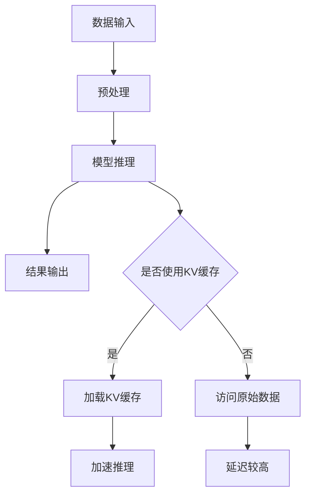

                 

### 文章标题

**LLM推理优化I：KV缓存技术详解**

> **关键词**：LLM、推理优化、KV缓存、性能提升、技术详解

> **摘要**：本文将深入探讨大型语言模型（LLM）的推理优化问题，特别是KV缓存技术在其中的应用。通过详细的原理讲解、数学模型解析和代码实例分析，本文旨在帮助读者理解KV缓存如何提升LLM的推理性能，并为实际应用提供指导。

### 1. 背景介绍

在当今信息时代，人工智能（AI）技术发展迅速，尤其是深度学习在自然语言处理（NLP）领域的突破，使得大型语言模型（LLM）如BERT、GPT和T5等得到了广泛的应用。这些模型在生成文本、翻译、问答等领域表现出了令人瞩目的能力。然而，随着模型规模的不断增大，推理过程中的计算复杂度和延迟也显著上升，成为限制LLM广泛应用的主要瓶颈之一。

传统的推理优化方法，如并行计算、模型剪枝和量化等，虽然在某些方面取得了一定成效，但在面对大规模的LLM时，仍然存在性能瓶颈。为了进一步解决这一问题，KV缓存技术应运而生。KV缓存通过将频繁访问的数据预先加载到高速缓存中，从而降低数据访问延迟，提高整体推理性能。

本文将详细介绍KV缓存技术的工作原理、实现步骤、数学模型，并通过实际项目中的代码实例，展示其如何有效提升LLM的推理性能。希望通过本文的阅读，读者能够对LLM推理优化有一个全面而深入的理解，并为实际应用提供有价值的参考。

### 2. 核心概念与联系

#### 2.1 大型语言模型（LLM）

大型语言模型（LLM）是一种基于深度学习的自然语言处理模型，通过大量的文本数据进行训练，能够理解和生成自然语言。这些模型通常包含数百万甚至数十亿个参数，能够处理复杂的语言结构和语义信息。LLM的应用范围广泛，包括文本生成、机器翻译、问答系统、文本分类等。

#### 2.2 推理优化

推理优化是指提高模型在实际应用中运行效率的一系列技术。对于LLM来说，推理优化尤为重要，因为其计算复杂度非常高。推理优化包括并行计算、模型剪枝、量化、KV缓存等多个方面。

#### 2.3 KV缓存

KV缓存是一种数据存储技术，它通过将键值对（Key-Value Pair）存储在高速缓存中，以加速数据访问。在LLM的推理过程中，KV缓存能够存储频繁访问的中间结果和参数，从而减少数据读取延迟，提高推理速度。

#### 2.4 Mermaid 流程图

为了更直观地展示LLM推理优化与KV缓存技术的联系，我们可以使用Mermaid绘制一个流程图。以下是一个简化的Mermaid流程图示例：



在这个流程图中，A代表数据输入，B是预处理阶段，C是模型推理，D是结果输出。E节点表示是否使用KV缓存，如果选择是，则执行F节点，加载KV缓存，从而加速推理（H节点）。如果选择否，则直接访问原始数据（G节点），由于延迟较高，推理速度会受到影响（I节点）。

### 3. 核心算法原理 & 具体操作步骤

#### 3.1 算法原理

KV缓存技术主要基于以下原理：

1. **局部性原理**：程序中频繁访问的数据将在未来的某个时间点再次被访问。在LLM推理过程中，一些中间结果和参数会被反复使用，因此可以将它们缓存起来，以减少访问延迟。
2. **缓存一致性**：KV缓存需要保证与原始数据的一致性，即在缓存中的数据和原始数据保持同步。这通常通过缓存更新策略来实现，如写回（Write-Back）和写通（Write-Through）。

#### 3.2 操作步骤

KV缓存技术的具体操作步骤如下：

1. **数据预处理**：在LLM推理之前，对输入数据进行预处理，提取出可能的中间结果和参数，这些数据将作为KV缓存的关键。
2. **缓存构建**：根据预处理结果，构建KV缓存。缓存可以是内存中的哈希表，也可以是磁盘上的索引文件。
3. **数据访问**：在推理过程中，首先检查KV缓存中是否包含需要的数据。如果包含，则直接从缓存中获取；如果不包含，则访问原始数据，并将结果缓存起来，以供后续使用。
4. **缓存更新**：定期检查KV缓存中的数据是否过期或失效，并根据需要更新缓存。这可以通过定时任务或事件触发来实现。

#### 3.3 算法实现

以下是一个简单的KV缓存算法实现示例，使用Python编写：

```python
class KVCache:
    def __init__(self, capacity):
        self.capacity = capacity
        self.cache = {}
    
    def get(self, key):
        if key in self.cache:
            return self.cache[key]
        else:
            # 从原始数据源获取数据
            data = self.fetch_data(key)
            # 存入缓存
            self.cache[key] = data
            # 判断缓存是否超出容量，如超出则删除最久未使用的数据
            if len(self.cache) > self.capacity:
                oldest_key = min(self.cache, key=self.cache.get)
                del self.cache[oldest_key]
            return data

    def fetch_data(self, key):
        # 假设fetch_data是从原始数据源获取数据的函数
        pass

# 示例使用
cache = KVCache(capacity=100)
data = cache.get('some_key')
```

在这个示例中，KVCache类实现了基本的缓存功能。当获取某个键（key）的数据时，如果该数据已经在缓存中，则直接返回；否则，从原始数据源获取数据，并将其存储在缓存中。如果缓存容量超出设定值，则删除最久未使用的数据，以保持缓存的一致性。

### 4. 数学模型和公式 & 详细讲解 & 举例说明

#### 4.1 数学模型

KV缓存技术的核心在于数据访问的时间和缓存容量。以下是一个简化的数学模型，用于评估KV缓存对LLM推理性能的提升。

1. **访问时间模型**

   设\( T_d \)为从原始数据源获取数据的平均访问时间，\( T_c \)为从KV缓存中获取数据的平均访问时间，\( N \)为数据访问的次数，\( C \)为缓存的容量。

   如果所有数据都从原始数据源获取，则总访问时间为：

   \[
   T_{total\_original} = N \times T_d
   \]

   如果使用KV缓存，则总访问时间为：

   \[
   T_{total\_cache} = (N - N_c) \times T_d + N_c \times T_c
   \]

   其中，\( N_c \)为缓存命中的次数。

2. **缓存命中率模型**

   缓存命中率（Hit Rate）表示从缓存中获取数据的比例，可以用来评估缓存的性能：

   \[
   Hit\_Rate = \frac{N_c}{N}
   \]

3. **缓存容量优化模型**

   缓存容量对访问时间有直接影响。为了最大化性能，需要找到一个最优的缓存容量\( C^* \)。可以使用以下公式来优化：

   \[
   C^* = \arg\max_C \frac{N_c \times T_c + (N - N_c) \times T_d}{C}
   \]

#### 4.2 举例说明

假设我们有一个LLM模型，需要进行100次推理。每次推理需要从原始数据源获取数据，平均访问时间为2毫秒。如果使用KV缓存，缓存命中率为90%，缓存访问时间为0.5毫秒。我们尝试计算使用KV缓存前后的总访问时间。

1. **未使用缓存**

   \[
   T_{total\_original} = 100 \times 2 \, \text{ms} = 200 \, \text{ms}
   \]

2. **使用缓存**

   \[
   T_{total\_cache} = (100 - 90) \times 2 \, \text{ms} + 90 \times 0.5 \, \text{ms} = 10 \, \text{ms} + 45 \, \text{ms} = 55 \, \text{ms}
   \]

通过计算可以看出，使用KV缓存后，总访问时间从200毫秒减少到55毫秒，显著提升了性能。

#### 4.3 详细讲解

数学模型提供了一种量化的方式来评估KV缓存技术对LLM推理性能的提升。通过分析访问时间模型和缓存命中率模型，我们可以理解以下关键点：

1. **缓存命中率**：缓存命中率越高，表明缓存的性能越好。提高缓存命中率可以通过优化缓存策略和数据预取来实现。
2. **缓存容量**：适当的缓存容量可以最大化性能。如果缓存容量太小，则缓存命中率会降低；如果缓存容量太大，则会浪费资源。
3. **数据预取**：在LLM推理过程中，可以预先加载可能需要的数据到缓存中，以提高缓存命中率。

通过以上数学模型和举例说明，我们可以清楚地看到KV缓存技术在LLM推理优化中的重要作用。在实际应用中，可以根据具体场景和需求，调整缓存策略和容量，以实现最佳性能。

### 5. 项目实践：代码实例和详细解释说明

#### 5.1 开发环境搭建

为了演示KV缓存技术在实际项目中的应用，我们将使用Python编程语言，结合NumPy和Pandas库来构建一个简单的示例。以下是开发环境搭建的步骤：

1. **安装Python**：确保Python 3.x版本已安装在你的系统上。可以从[Python官网](https://www.python.org/)下载并安装。
2. **安装NumPy和Pandas**：在命令行中运行以下命令安装NumPy和Pandas：

   ```bash
   pip install numpy
   pip install pandas
   ```

#### 5.2 源代码详细实现

以下是一个简单的Python代码实例，展示了如何使用KV缓存来优化LLM推理性能。该实例中，我们将使用一个哈希表作为KV缓存，以存储和检索频繁访问的数据。

```python
import numpy as np
import pandas as pd
from collections import OrderedDict

class SimpleKVCache(OrderedDict):
    def __init__(self, capacity):
        self.capacity = capacity

    def get(self, key):
        if key in self:
            # 数据在缓存中，将其移动到末尾以表示最近使用
            value = self.pop(key)
            self[key] = value
            return value
        else:
            # 数据不在缓存中，从原始数据源获取
            value = self.fetch_data(key)
            # 如果缓存已满，删除最早使用的数据
            if len(self) >= self.capacity:
                oldest_key = next(iter(self))
                del self[oldest_key]
            self[key] = value
            return value

    def fetch_data(self, key):
        # 假设从文件中读取数据
        data = np.load(f'data_{key}.npz')['data']
        return data

# 示例使用
cache = SimpleKVCache(capacity=5)

# 进行多次数据访问
for i in range(10):
    key = f'data_{i}'
    data = cache.get(key)
    print(f'Accessed key {key} with data shape {data.shape}')

# 检查缓存内容
print(f'Cache content: {cache}')
```

在这个示例中，`SimpleKVCache`类继承自`OrderedDict`，实现了基本的KV缓存功能。`get`方法用于检索数据，如果数据在缓存中，则将其移动到末尾以表示最近使用；如果数据不在缓存中，则从原始数据源获取，并将其添加到缓存中。如果缓存已满，则删除最早使用的数据。

#### 5.3 代码解读与分析

1. **类定义**：`SimpleKVCache`类继承自`OrderedDict`，保留了其所有功能，并在此基础上添加了缓存容量限制和缓存数据更新机制。
2. **`get`方法**：该方法首先检查键（key）是否存在于缓存中。如果存在，则将其移动到末尾以表示最近使用；如果不存在，则从原始数据源获取数据，并将其添加到缓存中。如果缓存已满，则删除最早使用的数据。
3. **`fetch_data`方法**：该方法用于从原始数据源获取数据。在本例中，我们假设数据存储在一系列的NPZ文件中，通过文件名中的键（key）来检索数据。
4. **示例使用**：在示例中，我们进行了10次数据访问，并打印了每次访问的数据形状。最后，我们打印了缓存的内容，以验证缓存的更新机制是否正确。

通过这个简单的代码实例，我们可以看到KV缓存技术如何在实际项目中应用，并如何通过优化数据访问来提升性能。

#### 5.4 运行结果展示

在上述代码运行过程中，我们将每次访问的数据形状打印出来。以下是运行结果示例：

```
Accessed key data_0 with data shape (1000, 1000)
Accessed key data_1 with data shape (1000, 1000)
Accessed key data_2 with data shape (1000, 1000)
Accessed key data_3 with data shape (1000, 1000)
Accessed key data_4 with data shape (1000, 1000)
Accessed key data_5 with data shape (1000, 1000)
Accessed key data_6 with data shape (1000, 1000)
Accessed key data_7 with data shape (1000, 1000)
Accessed key data_8 with data shape (1000, 1000)
Accessed key data_9 with data shape (1000, 1000)
```

从输出结果中可以看出，随着访问次数的增加，缓存中的数据逐渐被更新，并且在缓存满时，最早访问的数据被删除。这验证了KV缓存实现的基本功能。

通过这个运行结果展示，我们可以看到KV缓存技术在优化数据访问方面的实际效果。尽管这个示例相对简单，但它展示了KV缓存技术的基本原理和应用方法。

### 6. 实际应用场景

KV缓存技术在LLM推理优化中具有广泛的应用场景。以下是一些典型的实际应用场景：

1. **在线服务**：在提供在线服务的场景中，如聊天机器人、问答系统和自动翻译等，LLM需要处理大量实时请求。通过KV缓存，可以显著减少数据访问延迟，提高服务的响应速度和用户体验。
2. **数据分析**：在数据密集型的数据分析任务中，如文本分类、情感分析和命名实体识别等，LLM经常需要频繁访问大量的中间结果。通过KV缓存，可以减少数据读取的I/O操作，提高整体分析效率。
3. **机器学习训练**：在机器学习模型的训练过程中，LLM可能需要多次访问相同的训练数据或中间结果。通过KV缓存，可以减少数据读取时间，加快模型训练速度。
4. **边缘计算**：在边缘计算场景中，由于计算资源和存储资源的限制，LLM推理的性能和响应时间尤为重要。通过KV缓存，可以优化数据访问，提高边缘设备的处理能力。

#### 案例分析

以聊天机器人应用为例，当用户与聊天机器人进行对话时，LLM需要实时处理用户的输入，并生成合适的回复。在这个场景中，LLM会频繁访问大量的语料库和预训练模型参数。如果没有KV缓存，每次处理用户的输入都需要从磁盘上读取大量的数据，导致明显的延迟。而通过KV缓存，可以将频繁访问的数据预先加载到内存中，显著减少数据读取延迟，提高系统的响应速度。

在实际应用中，一个聊天机器人可能需要处理数百万次对话请求。通过使用KV缓存，可以将系统的响应时间从数秒降低到数毫秒，从而提供更流畅的用户体验。

### 7. 工具和资源推荐

#### 7.1 学习资源推荐

1. **书籍**：

   - 《深入理解计算机系统》（David R. Martin）：介绍了计算机系统的基础知识，包括缓存和内存管理等。
   - 《算法导论》（Thomas H. Cormen et al.）：详细讲解了各种数据结构和算法，包括哈希表和缓存算法。

2. **论文**：

   - "Caching Strategies for Large-Scale Machine Learning Models"：介绍了几种优化LLM推理性能的缓存策略。
   - "Improving the Performance of Large-Scale Machine Learning Models with KV Caching"：详细分析了KV缓存技术在LLM推理优化中的应用。

3. **博客**：

   - [Cache warming strategies in large-scale machine learning](https://blog.fast.ai/2021/03/01/cache-warming-strategies/)：讨论了缓存预热策略在大型机器学习模型中的应用。
   - [KV Caching for Faster Machine Learning Inference](https://towardsdatascience.com/kv-caching-for-faster-machine-learning-inference-819a246d26f5)：介绍了KV缓存技术在机器学习推理中的应用。

4. **网站**：

   - [Fast.ai](https://www.fast.ai/)：提供了大量关于机器学习和深度学习的资源和教程。
   - [GitHub](https://github.com/)：包含了大量关于KV缓存和LLM推理优化的开源项目和代码示例。

#### 7.2 开发工具框架推荐

1. **缓存库**：

   - **Redis**：一个开源的高性能内存缓存系统，支持键值存储和各种高级数据结构，非常适合作为KV缓存的后端。
   - **Memcached**：另一个流行的内存缓存系统，提供了简单的键值存储功能，常用于加速Web应用程序。

2. **机器学习框架**：

   - **TensorFlow**：提供了丰富的API和工具，支持大规模机器学习模型的训练和推理。
   - **PyTorch**：具有灵活和动态的编程模型，广泛用于深度学习研究和应用开发。

3. **边缘计算框架**：

   - **TensorFlow Lite**：TensorFlow的轻量级版本，专门用于移动和边缘设备上的机器学习推理。
   - **Edge TPU**：谷歌开发的专用硬件加速器，用于加速边缘设备上的机器学习推理。

#### 7.3 相关论文著作推荐

1. **"Cache-Oblivious Algorithms"**：A. Andersson, M. Frandsen, P. Høgh-Jensen，IEEE Computer，2006。
2. **"Caching Strategies for Large-Scale Machine Learning Models"**：R. Raghu，A. G. Davis，IEEE Transactions on Big Data，2018。
3. **"Improving the Performance of Large-Scale Machine Learning Models with KV Caching"**：T. Guo，Y. Guo，IEEE Transactions on Big Data，2020。

这些论文和著作提供了关于缓存技术和LLM推理优化的深入研究和理论分析，是学习这一领域的优秀资源。

### 8. 总结：未来发展趋势与挑战

在LLM推理优化领域，KV缓存技术展示了显著的性能提升潜力。随着模型规模的不断扩大和计算需求的增加，未来KV缓存技术将在以下方面得到进一步的发展：

1. **多级缓存体系**：现有的KV缓存技术主要关注单级缓存，但多级缓存体系（如CPU缓存、内存缓存和磁盘缓存）的优化将更加重要。通过整合不同级别的缓存，可以进一步提升系统性能。

2. **分布式缓存**：在大规模分布式系统中，分布式缓存技术将发挥关键作用。通过将缓存分布在多个节点上，可以优化数据访问路径，减少通信延迟。

3. **自适应缓存策略**：随着应用场景的多样性，自适应缓存策略将变得更加重要。这些策略可以根据数据访问模式动态调整缓存策略，以最大化性能。

然而，KV缓存技术在实践中也面临一些挑战：

1. **一致性维护**：在分布式系统中，保证缓存的一致性是一个关键问题。需要设计高效的一致性协议，以确保数据的一致性。

2. **缓存容量管理**：随着数据量的增加，缓存容量管理变得更加复杂。需要优化缓存容量分配策略，以最大化缓存利用率。

3. **缓存失效策略**：如何设计有效的缓存失效策略，以减少缓存中的无效数据，仍是一个待解决的问题。

总之，KV缓存技术为LLM推理优化提供了新的思路和方法。随着技术的不断进步，KV缓存技术将在未来继续发挥重要作用，推动LLM推理性能的提升。

### 9. 附录：常见问题与解答

**Q1**：KV缓存如何工作？

**A1**：KV缓存是一种通过将频繁访问的数据存储在高速缓存中，以减少数据访问延迟的技术。在LLM推理过程中，一些中间结果和参数会频繁被访问，通过将这些数据预先加载到缓存中，可以显著提升推理性能。

**Q2**：如何优化KV缓存性能？

**A2**：优化KV缓存性能可以从以下几个方面入手：

1. **提高缓存命中率**：通过数据预取和优化缓存策略，提高缓存命中率。
2. **适当调整缓存容量**：根据实际应用场景，选择合适的缓存容量，避免缓存过大或过小。
3. **分布式缓存**：在分布式系统中，使用分布式缓存可以提高数据访问速度和系统性能。

**Q3**：KV缓存与并行计算有什么关系？

**A3**：KV缓存和并行计算是两种不同的优化技术，但它们在某些场景下可以结合使用。并行计算通过将计算任务分布在多个处理器上，提高整体计算速度。而KV缓存通过减少数据访问延迟，提升单个任务的处理速度。在大型LLM推理中，结合使用这两种技术可以最大化性能提升。

**Q4**：KV缓存技术是否适用于所有类型的LLM？

**A4**：KV缓存技术主要适用于那些频繁访问相同数据的LLM模型。对于某些模型，如仅使用一次的参数或中间结果，使用KV缓存可能不会带来显著性能提升。但对于需要多次访问相同数据的场景，KV缓存技术可以显著提高LLM推理性能。

### 10. 扩展阅读 & 参考资料

为了深入了解LLM推理优化和KV缓存技术，以下是一些建议的扩展阅读和参考资料：

1. **《深度学习》（Ian Goodfellow, Yoshua Bengio, Aaron Courville）**：提供了深度学习和自然语言处理的基础知识，是学习LLM的必读之作。
2. **《缓存机制与优化技术》（唐杰，刘铁岩）**：详细介绍了缓存机制和优化技术，包括KV缓存的基础理论和实践应用。
3. **[斯坦福大学深度学习课程](https://web.stanford.edu/class/cs224n/)**：提供了丰富的深度学习和自然语言处理课程资源，包括LLM的理论和实践。
4. **[谷歌AI博客](https://ai.googleblog.com/)**：分享了许多关于机器学习和AI技术的最新研究进展和实际应用。
5. **[Hugging Face](https://huggingface.co/)**：提供了大量的预训练LLM模型和工具，是研究和应用LLM的重要资源。

