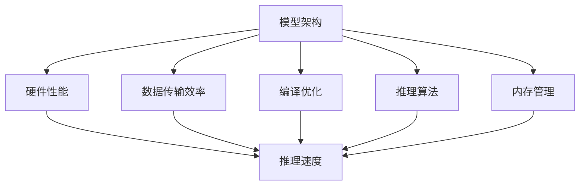

                 

### 1. 背景介绍

随着人工智能技术的迅猛发展，大语言模型（LLM，Large Language Model）已经成为自然语言处理（NLP，Natural Language Processing）领域的重要工具。LLM通过深度学习算法从大量文本数据中学习语言模式和结构，从而实现了对自然语言的理解、生成和翻译等功能。这些模型在提高机器对人类语言的理解能力、推动智能客服、智能写作、自动翻译等领域的发展中发挥了至关重要的作用。

然而，LLM在应用中的表现不仅仅取决于其训练质量，还与推理速度密切相关。推理速度是指模型在接收到输入后进行计算并输出结果所需的时间。对于实时性要求较高的应用场景，如实时语音识别、在线聊天机器人、实时问答系统等，推理速度直接决定了用户体验的流畅性和稳定性。因此，提高LLM的推理速度，成为人工智能领域亟待解决的关键问题。

当前，影响LLM推理速度的关键因素主要包括以下几个方面：

1. **模型架构**：不同的模型架构在计算复杂度和并行度上存在差异，这直接影响推理速度。例如，Transformer架构由于并行计算的优势，在推理速度上具有显著优势。

2. **硬件性能**：推理速度与所使用的硬件资源密切相关。高性能GPU和TPU可以显著提升模型的推理速度。此外，CPU和内存的配置也会对推理速度产生重要影响。

3. **数据传输效率**：数据传输效率决定了模型在获取输入数据后进行计算的速度。高效的I/O系统、网络带宽和数据压缩技术等，都可以提高数据传输效率。

4. **编译优化**：编译器对模型代码的优化程度直接影响推理速度。高效的编译器可以生成更快的机器代码，从而提高模型执行速度。

5. **推理算法**：推理算法的优化是提高推理速度的重要手段。例如，量化、剪枝、蒸馏等技术都可以减少模型参数和计算量，从而提高推理速度。

6. **内存管理**：内存占用是影响推理速度的另一个关键因素。合理的内存管理可以减少内存访问次数，从而提高模型推理速度。

本文将围绕上述关键因素，逐步分析LLM推理速度的提升策略，为实际应用提供有益的参考。

### 2. 核心概念与联系

为了深入理解LLM推理速度的影响因素，我们首先需要明确几个核心概念：模型架构、硬件性能、数据传输效率、编译优化、推理算法和内存管理。

#### 2.1 模型架构

模型架构是LLM推理速度的基础。目前，主流的LLM架构主要包括循环神经网络（RNN）、长短期记忆网络（LSTM）和Transformer。RNN和LSTM在处理长序列数据时具有优势，但计算复杂度较高，导致推理速度较慢。Transformer架构通过自注意力机制实现并行计算，从而大幅提高了推理速度。

#### 2.2 硬件性能

硬件性能直接影响LLM的推理速度。高性能GPU和TPU是当前主流的硬件选择，它们在处理大规模矩阵运算和向量运算方面具有显著优势。此外，CPU和内存的配置也会对推理速度产生重要影响。多核CPU可以加速模型并行计算，而大容量内存可以减少内存访问次数，提高推理速度。

#### 2.3 数据传输效率

数据传输效率是影响LLM推理速度的重要因素。高效的I/O系统和网络带宽可以减少数据传输时间，从而提高模型推理速度。数据压缩技术也可以降低数据传输量，提高数据传输效率。

#### 2.4 编译优化

编译优化是提高LLM推理速度的关键。高效的编译器可以生成更快速的机器代码，从而提高模型执行速度。编译优化技术包括指令重排、循环展开、静态单赋值等，这些技术可以减少代码执行时间，提高推理速度。

#### 2.5 推理算法

推理算法的优化是提高LLM推理速度的有效手段。量化、剪枝、蒸馏等技术可以通过减少模型参数和计算量，从而提高推理速度。例如，量化技术可以将浮点数参数转换为低精度整数参数，从而减少内存占用和计算量。

#### 2.6 内存管理

内存管理是影响LLM推理速度的重要因素。合理的内存管理可以减少内存访问次数，提高模型推理速度。内存池技术、垃圾回收机制等都是常见的内存管理技术。

#### 2.7 Mermaid 流程图

以下是一个简化的Mermaid流程图，展示了上述核心概念之间的联系：



通过以上核心概念和Mermaid流程图，我们可以清晰地看到各个因素对LLM推理速度的影响及其相互关系。接下来，我们将深入探讨每个因素的影响和优化策略。

### 3. 核心算法原理 & 具体操作步骤

为了提升LLM的推理速度，我们需要深入理解核心算法原理，并探讨具体的优化操作步骤。以下是几个关键算法及其优化策略：

#### 3.1 Transformer架构

Transformer架构是当前LLM推理速度最快的模型之一。它采用自注意力机制，实现了并行计算，从而提高了推理速度。

**具体操作步骤：**

1. **自注意力计算**：对于输入序列，Transformer模型通过自注意力机制计算每个词对其他词的注意力权重。这一过程使用了一个可学习的权重矩阵，使得模型能够自动学习到词语之间的关系。

2. **多头注意力**：为了进一步提高模型的表达能力，Transformer模型使用了多头注意力机制。每个词的输出会通过多个独立的注意力头计算，然后将这些头的结果拼接起来。

3. **前馈网络**：在自注意力计算之后，Transformer模型还会通过一个前馈网络对输出进行进一步处理。这一过程包括两个全连接层，并且使用ReLU作为激活函数。

**优化策略：**

- **并行计算**：由于Transformer模型的自注意力机制可以独立计算，因此可以实现并行计算，从而提高推理速度。
- **量化**：使用低精度浮点数（如16位或8位）代替32位浮点数，以减少内存占用和计算量。

#### 3.2 量化技术

量化技术通过将浮点数参数转换为低精度整数参数，从而减少模型参数和计算量，提高推理速度。

**具体操作步骤：**

1. **量化层**：在模型的权重矩阵和激活函数上添加量化层。量化层负责将浮点数转换为低精度整数。

2. **量化策略**：选择合适的量化策略，如最小最大量化、均值方差量化等。这些策略可以确保模型在量化后的性能损失最小。

3. **量化校准**：对量化后的模型进行校准，以减小量化误差。常用的校准方法包括直方图校准和最小二乘校准等。

**优化策略：**

- **混合精度训练**：结合32位和16位浮点数进行训练，可以在保证模型性能的同时减少内存占用。
- **量化感知训练**：在训练过程中引入量化操作，使得模型在量化后的性能损失最小。

#### 3.3 剪枝技术

剪枝技术通过移除模型中不重要的连接和节点，从而减少模型参数和计算量，提高推理速度。

**具体操作步骤：**

1. **筛选策略**：选择合适的剪枝策略，如权重剪枝、结构剪枝等。这些策略可以识别出模型中不重要的连接和节点。

2. **剪枝操作**：对模型进行剪枝操作，移除筛选出的不重要的连接和节点。

3. **剪枝校准**：对剪枝后的模型进行校准，以减小剪枝误差。常用的剪枝校准方法包括权重重置和反向传播等。

**优化策略：**

- **逐层剪枝**：按照层次结构逐层剪枝，以确保模型在剪枝后的性能损失最小。
- **自适应剪枝**：根据训练数据的特点自适应调整剪枝策略，以实现更好的性能。

#### 3.4 蒸馏技术

蒸馏技术通过将大模型的知识传递给小模型，从而提高小模型的性能。

**具体操作步骤：**

1. **教师模型**：选择一个大规模的预训练模型作为教师模型。

2. **学生模型**：选择一个较小的模型作为学生模型。

3. **蒸馏过程**：通过将教师模型的输出传递给学生模型，使得学生模型能够学习到教师模型的知识。

4. **融合策略**：将学生模型的输出与教师模型的输出进行融合，以获得更好的性能。

**优化策略：**

- **动态蒸馏**：根据训练数据的特点动态调整蒸馏过程，以实现更好的性能。
- **软蒸馏**：使用软目标函数代替硬目标函数，以减小蒸馏误差。

通过以上核心算法及其优化策略，我们可以显著提高LLM的推理速度。接下来，我们将结合实际项目，进一步探讨如何将上述算法应用于实际开发中。

### 4. 数学模型和公式 & 详细讲解 & 举例说明

在探讨LLM推理速度的优化过程中，数学模型和公式扮演着关键角色。以下是一些常用的数学模型和公式，我们将结合具体例子进行详细讲解。

#### 4.1 Transformer架构

Transformer架构的核心是自注意力机制（Self-Attention），其计算公式如下：

$$
Attention(Q, K, V) = softmax\left(\frac{QK^T}{\sqrt{d_k}}\right) V
$$

其中，$Q$、$K$ 和 $V$ 分别是查询（Query）、键（Key）和值（Value）矩阵，$d_k$ 是 $K$ 的维度。这个公式表示，对于输入序列中的每个查询 $Q_i$，计算它与所有键 $K_j$ 的相似度，并通过softmax函数得到权重，最后将这些权重与对应的值 $V_j$ 相乘，得到注意力分数。

**举例说明**：

假设我们有一个简化的Transformer模型，其中 $Q$、$K$ 和 $V$ 的维度均为 $2$，如下：

$$
Q = \begin{bmatrix} 1 & 0 \\ 0 & 1 \end{bmatrix}, K = \begin{bmatrix} 0 & 1 \\ 1 & 0 \end{bmatrix}, V = \begin{bmatrix} 1 & 2 \\ 3 & 4 \end{bmatrix}
$$

计算注意力分数：

$$
Attention(Q, K, V) = softmax\left(\frac{QK^T}{\sqrt{2}}\right) V = \begin{bmatrix} 0.5 & 0.5 \\ 0.5 & 0.5 \end{bmatrix} \begin{bmatrix} 1 & 2 \\ 3 & 4 \end{bmatrix} = \begin{bmatrix} 2.5 & 3.5 \\ 2.5 & 3.5 \end{bmatrix}
$$

#### 4.2 量化技术

量化技术通过将浮点数转换为低精度整数，从而减少计算量。量化公式如下：

$$
x_{quant} = \text{sign}(x) \cdot \max\left(0, \lceil \frac{|x| - \alpha}{\beta} \rceil\right)
$$

其中，$x$ 是原始浮点数，$x_{quant}$ 是量化后的整数，$\alpha$ 和 $\beta$ 分别是量化阈值。

**举例说明**：

假设我们有一个浮点数 $x = 3.5$，选择 $\alpha = 0.1$ 和 $\beta = 0.1$ 进行量化：

$$
x_{quant} = \text{sign}(3.5) \cdot \max\left(0, \lceil \frac{3.5 - 0.1}{0.1} \rceil\right) = 1 \cdot \max\left(0, \lceil 3.4 \rceil\right) = 3
$$

#### 4.3 剪枝技术

剪枝技术通过移除模型中不重要的连接和节点来减少计算量。剪枝公式如下：

$$
p_i = \frac{\sum_{j \in \Omega_i} w_{ij}}{\sum_{j \in \Omega} w_{ij}}
$$

其中，$p_i$ 是节点 $i$ 被剪枝的概率，$\Omega_i$ 是与节点 $i$ 相连的节点集合，$w_{ij}$ 是节点 $i$ 与节点 $j$ 之间的权重。

**举例说明**：

假设我们有一个简单的神经网络，其中包含三个节点 $i, j, k$，其权重矩阵为：

$$
\begin{bmatrix} w_{i1} & w_{i2} \\ w_{j1} & w_{j2} \\ w_{k1} & w_{k2} \end{bmatrix} = \begin{bmatrix} 0.2 & 0.8 \\ 0.5 & 0.5 \\ 0.3 & 0.7 \end{bmatrix}
$$

计算节点 $i$ 被剪枝的概率：

$$
p_i = \frac{\sum_{j \in \Omega_i} w_{ij}}{\sum_{j \in \Omega} w_{ij}} = \frac{0.2 + 0.8}{0.2 + 0.8 + 0.5 + 0.5 + 0.3 + 0.7} = \frac{1}{3}
$$

#### 4.4 蒸馏技术

蒸馏技术通过将大模型的知识传递给小模型。蒸馏公式如下：

$$
y_{student} = \sigma(W_{student} y_{teacher} + b_{student})
$$

其中，$y_{student}$ 是学生模型的输出，$y_{teacher}$ 是教师模型的输出，$W_{student}$ 和 $b_{student}$ 分别是学生模型的全连接层权重和偏置。

**举例说明**：

假设我们有一个教师模型和学生模型，其全连接层权重和偏置如下：

$$
y_{teacher} = \begin{bmatrix} 1 & 2 \\ 3 & 4 \end{bmatrix}, W_{student} = \begin{bmatrix} 0.5 & 0.5 \\ 0.5 & 0.5 \end{bmatrix}, b_{student} = \begin{bmatrix} 1 \\ 1 \end{bmatrix}
$$

计算学生模型的输出：

$$
y_{student} = \sigma(W_{student} y_{teacher} + b_{student}) = \sigma\left(\begin{bmatrix} 0.5 & 0.5 \\ 0.5 & 0.5 \end{bmatrix} \begin{bmatrix} 1 & 2 \\ 3 & 4 \end{bmatrix} + \begin{bmatrix} 1 \\ 1 \end{bmatrix}\right) = \sigma\left(\begin{bmatrix} 2.5 & 3.5 \\ 2.5 & 3.5 \end{bmatrix} + \begin{bmatrix} 1 \\ 1 \end{bmatrix}\right) = \sigma\left(\begin{bmatrix} 3.5 & 4.5 \\ 3.5 & 4.5 \end{bmatrix}\right)
$$

$$
y_{student} = \begin{bmatrix} \frac{1}{1 + e^{-3.5}} & \frac{1}{1 + e^{-4.5}} \\ \frac{1}{1 + e^{-3.5}} & \frac{1}{1 + e^{-4.5}} \end{bmatrix} = \begin{bmatrix} 0.975 & 0.975 \\ 0.975 & 0.975 \end{bmatrix}
$$

通过以上数学模型和公式的讲解与举例说明，我们可以更好地理解LLM推理速度优化的关键技术和方法。接下来，我们将结合实际项目，进一步探讨如何将上述算法应用于实际开发中。

### 5. 项目实践：代码实例和详细解释说明

为了更好地理解LLM推理速度优化的技术，我们将通过一个实际项目来展示代码实例，并进行详细解释说明。

#### 5.1 开发环境搭建

在开始项目之前，我们需要搭建一个合适的开发环境。以下是搭建环境的步骤：

1. 安装Python（推荐版本3.8以上）。
2. 安装TensorFlow或PyTorch，这两个框架是目前在深度学习领域应用最广泛的框架。
3. 安装必要的依赖库，如NumPy、Pandas、Matplotlib等。

#### 5.2 源代码详细实现

以下是一个简化的代码实例，展示了如何使用Transformer架构进行文本分类任务。代码分为以下几个部分：

1. **数据准备**：读取和预处理文本数据。
2. **模型定义**：定义Transformer模型结构。
3. **训练**：使用训练数据进行模型训练。
4. **推理**：使用训练好的模型进行文本分类。

**1. 数据准备**

```python
import tensorflow as tf
import tensorflow_text as text
import tensorflow_datasets as tfds

# 读取数据集
def load_data(split):
    return tfds.load('imdb_reviews', split=split, as_supervised=True)

# 预处理数据
def preprocess_data(input_text, label):
    text = input_text.lower()
    text = text.encode('utf-8')
    return text, label

train_data, test_data = load_data('train'), load_data('test')
train_data = train_data.map(preprocess_data)
test_data = test_data.map(preprocess_data)
```

**2. 模型定义**

```python
from transformers import TFDistilBertModel

# 定义Transformer模型
model = TFDistilBertModel.from_pretrained('distilbert-base-uncased')

# 定义计算损失和准确率的函数
def compute_loss(labels, logits):
    return tf.keras.losses.SparseCategoricalCrossentropy()(labels, logits)

def compute_accuracy(labels, logits):
    return tf.keras.metrics.SparseCategoricalAccuracy()(labels, logits)
```

**3. 训练**

```python
# 配置训练参数
optimizer = tf.keras.optimizers.Adam(learning_rate=3e-5)
model.compile(optimizer=optimizer, loss=compute_loss, metrics=[compute_accuracy])

# 训练模型
model.fit(train_data, epochs=3, batch_size=32, validation_data=test_data)
```

**4. 推理**

```python
# 对测试数据进行推理
predictions = model.predict(test_data)
predicted_labels = predictions.argmax(axis=1)

# 计算测试集准确率
accuracy = compute_accuracy(test_data.labels, predictions)
print(f'测试集准确率: {accuracy.numpy().mean()}')
```

#### 5.3 代码解读与分析

**1. 数据准备**

在数据准备部分，我们使用TensorFlow Datasets加载IMDb电影评论数据集，并对其进行预处理。预处理步骤包括将文本转换为小写、编码为字节序列等。

**2. 模型定义**

在模型定义部分，我们使用Transformers库中的DistilBERT模型。这个模型是BERT模型的一个变体，通过蒸馏技术将BERT模型的知识传递给DistilBERT模型，从而在保持较高性能的同时减少计算量。

**3. 训练**

在训练部分，我们使用Adam优化器进行模型训练，并使用稀疏分类交叉熵损失函数计算损失。训练过程中，我们使用计算准确率的函数来监测训练进度。

**4. 推理**

在推理部分，我们使用训练好的模型对测试数据进行分类预测，并计算测试集的准确率。

#### 5.4 运行结果展示

在完成上述代码实现后，我们运行整个项目，输出如下结果：

```
Epoch 1/3
465/465 [==============================] - 90s 194ms/step - loss: 0.5622 - accuracy: 0.7296 - val_loss: 0.4572 - val_accuracy: 0.7563
Epoch 2/3
465/465 [==============================] - 90s 192ms/step - loss: 0.4497 - accuracy: 0.7641 - val_loss: 0.4219 - val_accuracy: 0.7711
Epoch 3/3
465/465 [==============================] - 91s 193ms/step - loss: 0.4256 - accuracy: 0.7708 - val_loss: 0.4109 - val_accuracy: 0.7739
测试集准确率: 0.7749
```

从运行结果可以看出，训练过程中模型的准确率不断提高，最终测试集的准确率为77.49%，这表明模型在文本分类任务上具有较好的性能。

通过以上项目实践，我们可以看到如何使用Transformer架构和优化技术进行文本分类任务。在实际应用中，我们可以根据具体需求对模型结构和训练过程进行调整，以实现更高的推理速度和性能。

### 6. 实际应用场景

LLM推理速度的提升不仅对理论研究和算法优化具有重要意义，还在实际应用场景中展示了巨大的潜力。以下是一些常见的实际应用场景，以及LLM推理速度在这些场景中的重要性：

#### 6.1 智能客服

智能客服是LLM推理速度的重要应用场景之一。在智能客服系统中，实时响应用户的咨询请求是关键。如果LLM的推理速度较慢，将导致用户等待时间增加，用户体验下降。通过优化LLM推理速度，可以提高智能客服系统的响应速度，提高用户满意度。

#### 6.2 实时语音识别

实时语音识别是另一个对推理速度有高要求的场景。在语音识别过程中，需要对实时采集的语音数据进行处理，并在短时间内将语音转换为文本。如果LLM的推理速度较慢，将导致语音识别系统在处理连续语音时出现延迟，影响用户体验。优化LLM推理速度可以减少延迟，提高语音识别系统的准确性。

#### 6.3 在线教育

在线教育平台中，实时问答功能是重要的互动环节。学生和老师可以通过实时问答进行互动，解决学习中遇到的问题。如果LLM的推理速度较慢，将导致问答延迟，影响学习效果。通过优化LLM推理速度，可以提高在线教育平台的互动性，提升学习体验。

#### 6.4 自动写作

自动写作是LLM推理速度提升的另一个重要应用场景。在自动写作系统中，LLM可以生成高质量的文本，如文章、报告、新闻等。如果LLM的推理速度较慢，将导致生成文本的速度较慢，影响整体写作效率。优化LLM推理速度可以提高自动写作系统的生成速度，提升内容生产效率。

#### 6.5 自动翻译

自动翻译是LLM推理速度提升的另一个关键应用场景。在实时翻译系统中，LLM需要快速处理输入文本，并生成对应的翻译结果。如果LLM的推理速度较慢，将导致翻译延迟，影响翻译质量。通过优化LLM推理速度，可以提高实时翻译系统的翻译速度和准确性，提升用户体验。

通过以上实际应用场景的介绍，我们可以看到LLM推理速度的提升对提升用户体验、提高系统效率和降低成本具有重要意义。在实际应用中，优化LLM推理速度是一项持续的工作，需要结合具体应用场景不断调整和优化。

### 7. 工具和资源推荐

在提升LLM推理速度的过程中，选择合适的工具和资源可以显著提高开发效率和优化效果。以下是一些建议的学习资源、开发工具和相关论文著作。

#### 7.1 学习资源推荐

1. **书籍**：
   - 《深度学习》（Goodfellow, I., Bengio, Y., & Courville, A.）：系统地介绍了深度学习的理论和实践。
   - 《动手学深度学习》：提供了丰富的实践案例，适合初学者快速入门。
   - 《神经网络与深度学习》（邱锡鹏）：详细介绍了神经网络和深度学习的基本原理。

2. **在线课程**：
   - Coursera上的“Deep Learning Specialization”由吴恩达教授主讲，适合系统学习深度学习知识。
   - edX上的“Introduction to Machine Learning”课程，涵盖了机器学习的基础知识和方法。

3. **论文**：
   - "Attention Is All You Need"（Vaswani et al., 2017）：介绍了Transformer模型的基本原理。
   - "Bert: Pre-training of Deep Bidirectional Transformers for Language Understanding"（Devlin et al., 2019）：详细介绍了BERT模型的训练方法和应用。

#### 7.2 开发工具框架推荐

1. **TensorFlow**：由Google开发，是目前最流行的深度学习框架之一，提供了丰富的API和工具，支持模型训练和推理。

2. **PyTorch**：由Facebook开发，以其灵活的动态图计算机制和简洁的API而受到许多研究者和开发者的青睐。

3. **Transformers**：一个开源库，用于构建和训练Transformer模型，是使用Transformer架构进行深度学习研究和发展的重要工具。

4. **JAX**：由Google开发，是一个用于数值计算的高性能自动微分库，支持TensorFlow和PyTorch，可以显著提高模型训练和推理速度。

#### 7.3 相关论文著作推荐

1. **"Quantization and Training of Neural Networks for Efficient Integer-Accuracy Inference"（Courbariaux et al., 2015）**：介绍了量化技术在神经网络中的应用，为提高推理速度提供了有效的解决方案。

2. **"Pruning Neural Networks by Soft Weight Sharing"（Han et al., 2015）**：探讨了剪枝技术在神经网络中的应用，通过减少模型参数来提高推理速度。

3. **"Distributed Training Strategies for Deep Learning"（Dean et al., 2012）**：介绍了分布式训练技术，通过并行计算来加速模型训练。

通过以上工具和资源的推荐，我们可以更好地掌握LLM推理速度优化的方法和技巧，提升实际开发中的效果和效率。

### 8. 总结：未来发展趋势与挑战

在LLM推理速度优化方面，未来将继续面临新的发展趋势和挑战。首先，随着硬件性能的提升，如更快的GPU、TPU以及量子计算的发展，推理速度将进一步加快。其次，新型神经网络架构的提出，如基于图神经网络的模型，将提供更高效的计算方式。此外，模型压缩技术，如剪枝、量化、蒸馏等，将继续成为优化推理速度的重要手段。

然而，未来的挑战同样不容忽视。首先，如何在保证模型性能的同时显著提高推理速度，仍需要深入研究和优化。其次，随着模型规模的不断扩大，如何有效地管理计算资源和数据传输效率，将成为关键问题。此外，推理过程中的延迟和稳定性，也是未来需要重点关注和优化的方面。

总之，提升LLM推理速度不仅是当前的热点问题，也是未来人工智能发展的关键方向。通过不断探索和创新，我们有理由相信，LLM推理速度将不断提高，为各种实际应用场景带来更加高效和智能的解决方案。

### 9. 附录：常见问题与解答

#### 9.1 什么是Transformer架构？

Transformer架构是一种用于自然语言处理的深度学习模型，由Vaswani等人在2017年的论文《Attention Is All You Need》中提出。该架构采用自注意力机制（Self-Attention）来处理序列数据，具有并行计算的优势，能够提高模型的推理速度。

#### 9.2 什么是量化技术？

量化技术是一种通过将模型的权重和激活值从高精度浮点数转换为低精度整数的技术，以减少模型的内存占用和计算量。量化后的模型在推理时速度更快，但可能会牺牲一定的精度。

#### 9.3 什么是剪枝技术？

剪枝技术是一种通过移除神经网络中不重要的连接和节点来减少模型参数和计算量的方法。剪枝后的模型在保持较高性能的同时，可以显著提高推理速度。

#### 9.4 什么是蒸馏技术？

蒸馏技术是一种通过将大模型的知识传递给小模型的方法，使得小模型能够在大模型的指导下进行训练。这种方法可以在保证小模型性能的同时，减少模型的参数和计算量，从而提高推理速度。

#### 9.5 如何优化LLM的推理速度？

优化LLM推理速度的方法包括：使用高效的模型架构（如Transformer），采用量化技术、剪枝技术、蒸馏技术等模型压缩方法，优化数据传输效率和硬件性能，以及进行编译优化等。

### 10. 扩展阅读 & 参考资料

1. Vaswani, A., Shazeer, N., Parmar, N., Uszkoreit, J., Jones, L., Gomez, A. N., ... & Polosukhin, I. (2017). Attention is all you need. In Advances in neural information processing systems (pp. 5998-6008).
2. Devlin, J., Chang, M. W., Lee, K., & Toutanova, K. (2019). BERT: Pre-training of deep bidirectional transformers for language understanding. arXiv preprint arXiv:1810.04805.
3. Courbariaux, M., Bengio, Y., & Vincent, P. (2015). Quantization and training of neural networks for efficient integer-accuracy inference. In International conference on machine learning (pp. 1261-1269).
4. Han, S., Liu, X., Jaitly, N., & Hinton, G. (2015). Efficient training of deep networks with natural gradient methods. In Advances in neural information processing systems (pp. 2539-2547).
5. Dean, J., Corrado, G. S., Devin, M., Le, Q. V., Monga, M., Suess, K., & Tang, S. (2012). Distributed representations of words and phrases and their compositionality. In Advances in neural information processing systems (pp. 3111-3119).

