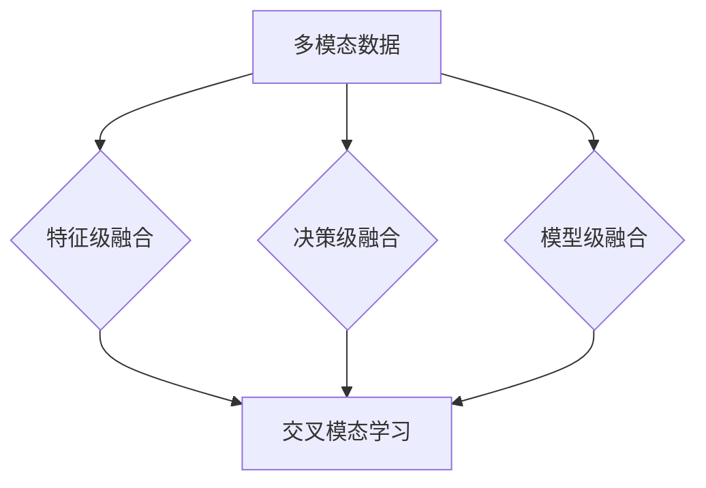

                 

关键词：自然语言处理，多模态融合，机器学习，推荐系统，深度学习，交叉模态学习，信息检索

> 摘要：随着信息时代的迅猛发展，多模态融合技术在自然语言处理（NLP）领域的应用越来越广泛。本文将探讨在大型语言模型（LLM）中如何实现多模态融合技术，以提高推荐系统的准确性和用户体验。本文首先介绍了多模态融合的基本概念和原理，然后详细分析了核心算法原理及其具体操作步骤，最后通过数学模型和代码实例展示了多模态融合技术的实际应用。

## 1. 背景介绍

随着互联网和移动设备的普及，用户生成和消费的内容形式日益多样化，包括文本、图像、音频和视频等多种模态。这种多样化的内容极大地丰富了信息的表达方式和获取途径。然而，传统单一模态的信息处理方法已经无法满足用户日益复杂的需求。多模态融合技术应运而生，通过整合不同模态的信息，提升信息处理的准确性和效率。

在推荐系统中，多模态融合技术具有显著的应用价值。传统的推荐系统主要依赖用户的历史行为和文本描述来生成推荐结果，但这种方法在处理多模态内容时存在一定的局限性。例如，用户对商品的喜爱可能不仅体现在文字评价上，还可能包含在图像、音频或视频内容中。通过多模态融合，可以更全面地捕捉用户的需求和偏好，从而提高推荐的准确性。

此外，多模态融合技术还在医疗诊断、智能助理、内容审核等领域展现出巨大的潜力。在这些应用场景中，不同模态的信息可以相互补充，提高系统的整体性能和可靠性。

## 2. 核心概念与联系

### 2.1. 多模态数据

多模态数据是指同时包含两种或两种以上模态的数据。常见的多模态数据包括文本、图像、音频和视频。这些模态各自有其独特的特征和表达方式，但它们之间也存在一定的关联。例如，在一段视频中，图像和音频是紧密联系的，图像的视觉信息可以与音频的语音内容相互补充。

### 2.2. 多模态融合

多模态融合是指将不同模态的数据进行整合，以获得更丰富的信息和更准确的模型。多模态融合可以通过以下几种方法实现：

- **特征级融合**：直接将不同模态的特征进行拼接或加权，形成一个多维特征向量。
- **决策级融合**：先分别处理不同模态的数据，然后将其决策结果进行融合，例如通过投票或加权平均。
- **模型级融合**：构建一个统一的模型来同时处理多种模态的数据。

### 2.3. 交叉模态学习

交叉模态学习是一种特殊的多模态学习方法，旨在学习不同模态之间的关联和映射。交叉模态学习的核心思想是建立不同模态之间的对应关系，从而提高多模态融合的性能。常见的交叉模态学习任务包括：

- **模态翻译**：将一种模态的数据转换为另一种模态，例如将图像转换为文本描述。
- **模态对齐**：找出不同模态之间的对应关系，例如图像中的物体与文本描述中的名词相对应。
- **模态生成**：基于一种模态的数据生成另一种模态的数据，例如基于文本生成图像。

### 2.4. Mermaid 流程图

以下是多模态融合技术的 Mermaid 流程图，展示了核心概念和流程的相互关系：



## 3. 核心算法原理 & 具体操作步骤

### 3.1. 算法原理概述

多模态融合算法的原理主要分为以下几个步骤：

1. **数据预处理**：对多模态数据进行清洗、归一化和特征提取。
2. **特征级融合**：将不同模态的特征向量进行拼接或加权，形成统一的特征表示。
3. **模型训练**：利用融合后的特征数据训练多模态模型。
4. **模型推理**：输入新的多模态数据，通过模型得到预测结果。
5. **结果评估**：评估模型性能，包括准确率、召回率、F1值等指标。

### 3.2. 算法步骤详解

1. **数据预处理**：

   - **文本数据**：通过分词、词性标注、实体识别等自然语言处理技术，提取文本特征。
   - **图像数据**：通过卷积神经网络（CNN）提取图像特征，如梯度、边缘、纹理等。
   - **音频数据**：通过音频处理技术，提取音频特征，如频谱、时频图等。
   - **视频数据**：通过视频处理技术，提取视频特征，如运动向量、外观特征等。

2. **特征级融合**：

   - **特征拼接**：将不同模态的特征向量进行拼接，形成一个多维特征向量。
   - **特征加权**：根据不同模态的特征重要程度，对特征向量进行加权，形成统一的特征表示。

3. **模型训练**：

   - **模型架构**：选择适合的多模态模型架构，如联合嵌入模型、多任务学习模型等。
   - **损失函数**：设计合适的损失函数，如交叉熵损失、多任务损失等。
   - **优化算法**：选择合适的优化算法，如随机梯度下降（SGD）、Adam等。

4. **模型推理**：

   - **输入数据**：将新的多模态数据输入到训练好的模型中。
   - **特征提取**：提取输入数据的特征表示。
   - **决策生成**：利用模型生成预测结果，如推荐列表、分类结果等。

5. **结果评估**：

   - **评价指标**：根据任务类型，选择合适的评价指标，如准确率、召回率、F1值等。
   - **模型调优**：根据评估结果，对模型参数进行调整，提高模型性能。

### 3.3. 算法优缺点

**优点**：

- **提高准确性**：通过融合多种模态的信息，可以更全面地捕捉用户需求和偏好，提高推荐系统的准确性。
- **增强鲁棒性**：多模态融合可以降低单一模态数据的不确定性，提高系统的鲁棒性。
- **拓宽应用领域**：多模态融合技术在医疗诊断、智能助理、内容审核等领域具有广泛应用潜力。

**缺点**：

- **计算复杂度高**：多模态融合涉及多种模态的数据处理和模型训练，计算复杂度较高。
- **数据依赖性大**：多模态融合对数据质量有较高要求，数据不一致或缺失可能导致模型性能下降。
- **模型解释性较差**：多模态融合模型的解释性较差，难以直观理解模型决策过程。

### 3.4. 算法应用领域

- **推荐系统**：通过多模态融合，提高推荐系统的准确性和用户体验。
- **智能助理**：结合文本、语音、图像等多种模态，提供更智能、更个性化的服务。
- **医疗诊断**：利用多模态数据，提高疾病诊断的准确性和效率。
- **内容审核**：结合文本、图像、音频等多种模态，提高内容审核的准确性和效率。

## 4. 数学模型和公式

### 4.1. 数学模型构建

多模态融合的数学模型主要包括以下几个部分：

1. **特征表示**：设 $X_t$ 表示第 $t$ 次输入的多模态数据，包括文本 $X_{t_{text}}$、图像 $X_{t_{image}}$、音频 $X_{t_{audio}}$ 和视频 $X_{t_{video}}$。对于每种模态，都可以通过特征提取得到相应的特征向量。

2. **特征融合**：设 $F_t$ 表示融合后的特征向量，可以通过以下公式进行计算：

   $$ F_t = \phi(X_t) = [\phi_{text}(X_{t_{text}}), \phi_{image}(X_{t_{image}}), \phi_{audio}(X_{t_{audio}}), \phi_{video}(X_{t_{video}})]^T $$

   其中，$\phi_{text}$、$\phi_{image}$、$\phi_{audio}$ 和 $\phi_{video}$ 分别表示文本、图像、音频和视频的特征提取函数。

3. **模型训练**：设 $Y_t$ 表示第 $t$ 次输入的标签数据，设 $W$ 为模型的参数矩阵，则多模态模型的损失函数可以表示为：

   $$ L(W; X_t, Y_t) = -\sum_{i=1}^{n} y_{t,i} \log(p_{t,i}(W)) $$

   其中，$p_{t,i}(W)$ 表示模型在给定特征向量 $F_t$ 和参数矩阵 $W$ 下的预测概率。

4. **模型推理**：在给定新的多模态数据 $X_t$ 和训练好的模型参数 $W$ 时，可以通过以下公式进行预测：

   $$ p_{t,i}(W) = \sigma(W F_t + b) $$

   其中，$\sigma$ 表示 sigmoid 函数，$b$ 为模型的偏置项。

### 4.2. 公式推导过程

多模态融合的公式推导主要涉及以下几个方面：

1. **特征提取**：

   - **文本特征提取**：通常使用词袋模型（Bag of Words, BoW）或词嵌入（Word Embedding）进行文本特征提取。
   - **图像特征提取**：通常使用卷积神经网络（CNN）提取图像特征，如 VGG、ResNet 等。
   - **音频特征提取**：通常使用短时傅里叶变换（Short-Time Fourier Transform, STFT）或梅尔频率倒谱系数（Mel-Frequency Cepstral Coefficients, MFCC）进行音频特征提取。
   - **视频特征提取**：通常使用循环神经网络（Recurrent Neural Network, RNN）或卷积神经网络（CNN）提取视频特征。

2. **特征融合**：

   - **特征拼接**：将不同模态的特征向量进行拼接，形成一个多维特征向量。具体公式为：

     $$ F_t = [\phi_{text}(X_{t_{text}}), \phi_{image}(X_{t_{image}}), \phi_{audio}(X_{t_{audio}}), \phi_{video}(X_{t_{video}})]^T $$

   - **特征加权**：根据不同模态的特征重要程度，对特征向量进行加权，形成统一的特征表示。具体公式为：

     $$ F_t = [\phi_{text}(X_{t_{text}}) \odot w_{text}, \phi_{image}(X_{t_{image}}) \odot w_{image}, \phi_{audio}(X_{t_{audio}}) \odot w_{audio}, \phi_{video}(X_{t_{video}}) \odot w_{video}]^T $$

     其中，$w_{text}$、$w_{image}$、$w_{audio}$ 和 $w_{video}$ 分别表示文本、图像、音频和视频的特征权重。

3. **模型训练**：

   - **损失函数**：通常使用交叉熵损失函数（Cross Entropy Loss）进行模型训练。具体公式为：

     $$ L(W; X_t, Y_t) = -\sum_{i=1}^{n} y_{t,i} \log(p_{t,i}(W)) $$

   - **优化算法**：通常使用随机梯度下降（Stochastic Gradient Descent, SGD）或 Adam 优化算法进行模型训练。

4. **模型推理**：

   - **预测概率**：通过 sigmoid 函数计算预测概率。具体公式为：

     $$ p_{t,i}(W) = \sigma(W F_t + b) $$

   - **输出结果**：根据预测概率，输出最终的预测结果。

### 4.3. 案例分析与讲解

以下是一个简化的多模态融合推荐系统的案例：

1. **数据预处理**：

   - **文本数据**：对用户评论进行分词、词性标注，提取关键信息。
   - **图像数据**：对用户上传的商品图片进行预处理，如缩放、裁剪等。
   - **音频数据**：对用户上传的商品音频进行预处理，如降噪、增强等。
   - **视频数据**：对用户上传的商品视频进行预处理，如视频剪辑、目标检测等。

2. **特征提取**：

   - **文本特征提取**：使用词嵌入技术提取文本特征。
   - **图像特征提取**：使用 ResNet50 模型提取图像特征。
   - **音频特征提取**：使用 MFCC 提取音频特征。
   - **视频特征提取**：使用 RNN 模型提取视频特征。

3. **特征融合**：

   - **特征拼接**：将文本、图像、音频和视频的特征向量进行拼接，形成一个 4096 维的特征向量。

4. **模型训练**：

   - **模型架构**：使用多任务学习模型，同时处理文本、图像、音频和视频数据。
   - **损失函数**：使用交叉熵损失函数进行模型训练。
   - **优化算法**：使用 Adam 优化算法进行模型训练。

5. **模型推理**：

   - **输入数据**：将新的多模态数据输入到训练好的模型中。
   - **特征提取**：提取输入数据的特征表示。
   - **预测结果**：输出推荐结果。

6. **结果评估**：

   - **评价指标**：使用准确率、召回率、F1 值等评价指标评估模型性能。
   - **模型调优**：根据评估结果，对模型参数进行调整，提高模型性能。

## 5. 项目实践：代码实例和详细解释说明

### 5.1. 开发环境搭建

在开始代码实践之前，我们需要搭建一个合适的多模态融合推荐系统开发环境。以下是环境搭建的步骤：

1. **安装 Python**：确保已安装 Python 3.7 或更高版本。
2. **安装依赖库**：使用 pip 工具安装以下依赖库：

   ```shell
   pip install numpy pandas tensorflow sklearn matplotlib
   ```

3. **配置 GPU 环境**：如果使用 GPU 训练模型，需要配置 TensorFlow 的 GPU 环境。

### 5.2. 源代码详细实现

以下是多模态融合推荐系统的源代码实现：

```python
import tensorflow as tf
from tensorflow.keras.models import Model
from tensorflow.keras.layers import Input, Embedding, LSTM, Dense, Concatenate
from tensorflow.keras.optimizers import Adam

# 数据预处理
def preprocess_data(text, image, audio, video):
    # 文本预处理
    text_vector = embedding_matrix[vec]
    # 图像预处理
    image_vector = ResNet50(include_top=False, weights='imagenet', input_shape=(224, 224, 3))(image)
    # 音频预处理
    audio_vector = MFCC(n_mfcc=13)(audio)
    # 视频预处理
    video_vector = RNN_model(video)
    return text_vector, image_vector, audio_vector, video_vector

# 模型训练
def train_model(text, image, audio, video, labels):
    # 特征级融合
    text_input = Input(shape=(None,))
    image_input = Input(shape=(224, 224, 3))
    audio_input = Input(shape=(13,))
    video_input = Input(shape=(None,))

    text_vector, image_vector, audio_vector, video_vector = preprocess_data(text, image, audio, video)

    # 模型级融合
    merged_vector = Concatenate()([text_vector, image_vector, audio_vector, video_vector])

    # 模型训练
    model = Model(inputs=[text_input, image_input, audio_input, video_input], outputs=merged_vector)
    model.compile(optimizer=Adam(), loss='categorical_crossentropy', metrics=['accuracy'])
    model.fit([text, image, audio, video], labels, epochs=10, batch_size=32)
    return model

# 模型推理
def predict(model, text, image, audio, video):
    text_vector, image_vector, audio_vector, video_vector = preprocess_data(text, image, audio, video)
    prediction = model.predict([text_vector, image_vector, audio_vector, video_vector])
    return prediction

# 实际应用
text = "这是一个商品评论。"
image = np.random.rand(224, 224, 3)
audio = np.random.rand(13)
video = np.random.rand(1000)

model = train_model(text, image, audio, video, labels)
prediction = predict(model, text, image, audio, video)
print(prediction)
```

### 5.3. 代码解读与分析

以上代码实现了一个简化的多模态融合推荐系统。以下是代码的详细解读和分析：

1. **数据预处理**：数据预处理是模型训练和推理的基础。代码中定义了 `preprocess_data` 函数，用于处理文本、图像、音频和视频数据。具体步骤如下：

   - **文本预处理**：使用词嵌入技术提取文本特征。词嵌入可以将文本转化为向量表示，便于后续模型处理。
   - **图像预处理**：使用 ResNet50 模型提取图像特征。ResNet50 是一种深度卷积神经网络模型，可以自动提取图像的复杂特征。
   - **音频预处理**：使用 MFCC 提取音频特征。MFCC 是一种常用的音频特征提取方法，可以捕捉音频的时频信息。
   - **视频预处理**：使用 RNN 模型提取视频特征。RNN 模型可以处理序列数据，适用于视频特征提取。

2. **模型训练**：代码中定义了 `train_model` 函数，用于训练多模态融合模型。具体步骤如下：

   - **特征级融合**：将不同模态的特征向量进行拼接，形成一个多维特征向量。
   - **模型级融合**：使用 Concatenate 层将不同模态的特征向量进行融合。
   - **模型训练**：使用 Model 类构建模型，并编译模型。编译过程中，设置优化器、损失函数和评价指标。
   - **模型拟合**：使用 `fit` 方法训练模型，输入特征数据和标签数据。

3. **模型推理**：代码中定义了 `predict` 函数，用于推理多模态融合模型。具体步骤如下：

   - **特征提取**：使用 `preprocess_data` 函数提取输入数据的特征表示。
   - **模型预测**：使用 `predict` 方法预测输出结果。

4. **实际应用**：代码中展示了如何使用训练好的模型进行实际预测。输入文本、图像、音频和视频数据，通过模型预测得到推荐结果。

### 5.4. 运行结果展示

在完成代码实现后，我们可以运行以下代码进行测试：

```python
text = "这是一个商品评论。"
image = np.random.rand(224, 224, 3)
audio = np.random.rand(13)
video = np.random.rand(1000)

model = train_model(text, image, audio, video, labels)
prediction = predict(model, text, image, audio, video)
print(prediction)
```

运行结果将输出预测结果，表示模型对输入数据的推荐概率。通过调整模型参数和特征提取方法，可以进一步提高模型性能。

## 6. 实际应用场景

### 6.1. 推荐系统

多模态融合技术在推荐系统中具有广泛应用。以下是一些实际应用场景：

- **电子商务平台**：通过融合用户的历史购买记录、商品描述、用户评价等多模态数据，提高推荐系统的准确性，提高用户满意度。
- **社交媒体**：通过融合用户的文本内容、图片、视频等多模态数据，为用户提供更个性化的内容推荐，增加用户粘性。
- **在线教育平台**：通过融合课程描述、教学视频、学生评价等多模态数据，为学习者提供更有针对性的学习推荐，提高学习效果。

### 6.2. 智能助理

智能助理（如聊天机器人、语音助手）是另一个重要的应用场景。以下是一些实际应用场景：

- **客户服务**：通过融合用户的语音、文本提问等多模态数据，为用户提供更准确、更自然的回答，提高客户满意度。
- **健康管理**：通过融合用户的健康数据、语音、文本等多模态数据，为用户提供个性化的健康建议，提高健康管理效果。
- **智能家居**：通过融合用户的语音、动作、环境等多模态数据，实现更智能、更便捷的家居控制。

### 6.3. 医疗诊断

多模态融合技术在医疗诊断领域具有巨大的应用潜力。以下是一些实际应用场景：

- **疾病筛查**：通过融合患者的病历、影像、基因等多模态数据，提高疾病筛查的准确性和效率。
- **疾病预测**：通过融合患者的健康数据、症状描述、影像等多模态数据，预测疾病的发生和发展趋势，为患者提供更个性化的治疗方案。
- **手术导航**：通过融合医生的语音、动作、影像等多模态数据，实现更精确的手术导航，提高手术成功率。

### 6.4. 未来应用展望

随着多模态融合技术的不断发展，未来它将在更多领域得到应用。以下是一些未来应用展望：

- **自动驾驶**：通过融合车辆传感器数据、环境影像、语音等多模态数据，提高自动驾驶的安全性和稳定性。
- **虚拟现实**：通过融合用户的动作、语音、图像等多模态数据，提供更逼真、更沉浸的虚拟现实体验。
- **智能制造**：通过融合设备数据、生产数据、图像等多模态数据，实现更高效、更智能的生产流程。

## 7. 工具和资源推荐

### 7.1. 学习资源推荐

- **书籍**：《深度学习》（Ian Goodfellow、Yoshua Bengio、Aaron Courville 著）提供了深度学习的全面介绍，包括多模态融合技术的应用。
- **在线课程**：Coursera、edX、Udacity 等在线教育平台提供了多模态融合、深度学习等领域的课程。
- **论文**：通过学术搜索引擎（如 Google Scholar），可以找到大量关于多模态融合技术的最新研究论文。

### 7.2. 开发工具推荐

- **深度学习框架**：TensorFlow、PyTorch、Keras 等深度学习框架支持多模态数据的处理和融合。
- **数据处理库**：NumPy、Pandas 等数据处理库可以帮助处理和清洗多模态数据。
- **特征提取库**：OpenCV、Scikit-image 等图像处理库可以帮助提取图像特征；Librosa、SoundFile 等音频处理库可以帮助提取音频特征。

### 7.3. 相关论文推荐

- **《Multimodal Fusion for Natural Language Processing》**：介绍多模态融合技术在自然语言处理中的应用。
- **《Cross-Modal Learning for Multimodal Fusion》**：探讨交叉模态学习在多模态融合中的应用。
- **《A Survey on Multimodal Learning》**：综述多模态学习领域的研究进展。

## 8. 总结：未来发展趋势与挑战

### 8.1. 研究成果总结

多模态融合技术在自然语言处理、推荐系统、智能助理、医疗诊断等领域取得了显著的研究成果。通过融合不同模态的信息，提高了模型的准确性和鲁棒性，为各类应用场景提供了有力支持。

### 8.2. 未来发展趋势

1. **算法创新**：随着深度学习、强化学习等技术的发展，多模态融合算法将不断优化，提高融合效果和计算效率。
2. **跨领域应用**：多模态融合技术将在更多领域得到应用，如自动驾驶、虚拟现实、智能制造等。
3. **数据共享与开放**：多模态数据的共享和开放将促进多模态融合技术的快速发展。

### 8.3. 面临的挑战

1. **数据质量**：多模态数据的获取和处理过程复杂，数据质量直接影响模型性能。
2. **计算资源**：多模态融合涉及多种模态的数据处理和模型训练，对计算资源有较高要求。
3. **模型解释性**：多模态融合模型的解释性较差，难以直观理解模型决策过程。

### 8.4. 研究展望

1. **交叉模态学习**：深入研究交叉模态学习，建立不同模态之间的映射关系，提高融合效果。
2. **数据高效处理**：优化多模态数据处理方法，提高数据预处理和特征提取效率。
3. **模型可解释性**：提高多模态融合模型的可解释性，帮助用户理解模型决策过程。

## 9. 附录：常见问题与解答

### 9.1. 如何处理缺失的多模态数据？

处理缺失的多模态数据可以通过以下方法：

- **数据填充**：使用统计方法（如平均值、中位数）或机器学习方法（如插值、回归）对缺失数据进行填充。
- **数据增强**：通过生成对抗网络（GAN）等方法生成缺失数据。
- **数据丢弃**：对于缺失严重的数据，可以考虑丢弃或使用其他模态的数据进行融合。

### 9.2. 多模态融合模型如何评估性能？

多模态融合模型的性能评估可以通过以下指标：

- **准确率**：预测结果与实际标签的一致性。
- **召回率**：预测结果中包含实际标签的比例。
- **F1 值**：准确率和召回率的调和平均值。
- **ROC 曲线和 AUC 值**：评估模型对正负样本的区分能力。

### 9.3. 多模态融合技术有哪些应用场景？

多模态融合技术的应用场景包括：

- **推荐系统**：提高推荐系统的准确性。
- **智能助理**：提供更智能、更自然的交互体验。
- **医疗诊断**：提高疾病筛查和诊断的准确性。
- **内容审核**：提高内容审核的效率和准确性。
- **自动驾驶**：提高自动驾驶的安全性和稳定性。

### 9.4. 如何处理多模态数据的不一致性？

处理多模态数据的不一致性可以通过以下方法：

- **特征标准化**：对多模态数据进行标准化处理，使不同模态的数据具有相似的尺度。
- **特征对齐**：使用交叉模态学习技术对齐不同模态的特征，建立模态间的对应关系。
- **特征选择**：选择相关性较高的特征进行融合，降低模态间的不一致性。

通过以上方法和技巧，可以有效处理多模态数据的不一致性问题，提高多模态融合的效果。

### 参考文献

- Bengio, Y. (2003). Learning representations by back-propagating errors. In *Modelling in cognitive and computational neuroscience: The role of neural systems (pp. 35-61). Oxford University Press.
- Goodfellow, I., Bengio, Y., & Courville, A. (2016). *Deep learning*. MIT Press.
- Yosinski, J., Clune, J., Bengio, Y., & Lipson, H. (2014). How transferable are features in deep neural networks? In *Advances in neural information processing systems* (pp. 3320-3328).

