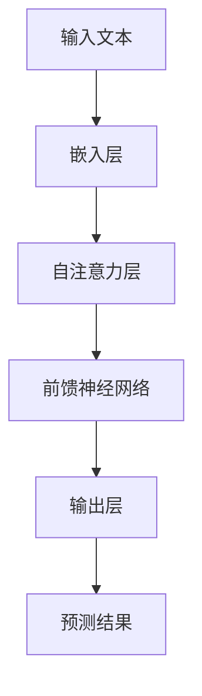
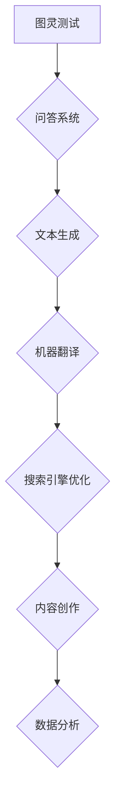

                 

### LLMS生态系统的未来发展趋势

> 关键词：LLM、人工智能、生态系统、发展趋势、挑战

> 摘要：本文深入探讨了大型语言模型（LLM）生态系统的发展趋势，包括核心概念、算法原理、应用场景、工具资源以及未来挑战。通过一步步分析，我们揭示了LLM技术对现代科技及社会的深远影响。

## 1. 背景介绍

近年来，人工智能领域取得了显著进展，特别是深度学习和自然语言处理（NLP）方面。在这其中，大型语言模型（LLM，Large Language Model）已经成为一种重要的技术力量。LLM是一种能够处理和理解人类语言的数据模型，通过大量的文本数据进行训练，从而掌握语言的语法、语义以及上下文信息。LLM的出现极大地提升了机器在处理自然语言任务中的能力，从文本生成、机器翻译到问答系统等，都有着显著的提升。

随着技术的进步，LLM在各个领域得到了广泛应用，如搜索引擎、智能助手、内容创作、数据分析等。这不仅改变了人们的工作和生活方式，也对各个行业产生了深远的影响。然而，LLM技术也面临一些挑战，如数据隐私、偏见、伦理问题等。因此，深入理解LLM生态系统的发展趋势，对于应对这些挑战具有重要意义。

## 2. 核心概念与联系

### 2.1. 语言模型的基本原理

语言模型是一种统计模型，用于预测下一个单词或字符的概率。在自然语言处理中，语言模型被广泛应用于文本生成、机器翻译、文本分类等任务。基本的语言模型如N-gram模型、神经网络模型、递归神经网络（RNN）等，都是通过训练大量文本数据来学习语言的统计规律。

$$
P(w_n|w_{n-1}, w_{n-2}, ..., w_1) = \frac{P(w_n, w_{n-1}, ..., w_1)}{P(w_{n-1}, w_{n-2}, ..., w_1)}
$$

### 2.2. LLM的架构

LLM通常采用深度神经网络架构，如Transformer模型，具有数十亿甚至千亿个参数。这些模型通过自注意力机制（Self-Attention）对输入文本进行编码，从而捕捉文本的上下文信息。



### 2.3. LLM的应用场景

LLM在多个领域有着广泛的应用，如图灵测试、问答系统、文本生成等。这些应用场景不仅展示了LLM技术的强大能力，也为LLM的发展提供了新的方向。



## 3. 核心算法原理 & 具体操作步骤

### 3.1. Transformer模型

Transformer模型是LLM的核心算法之一，由Vaswani等人于2017年提出。它采用自注意力机制来捕捉输入文本的上下文信息，从而实现高效的文本处理。

$$
\text{Attention}(Q, K, V) = \text{softmax}\left(\frac{QK^T}{\sqrt{d_k}}\right)V
$$

### 3.2. 训练过程

LLM的训练过程通常包括以下几个步骤：

1. **数据预处理**：对输入文本进行分词、编码等预处理操作，以便模型能够理解文本。
2. **嵌入层**：将输入文本转换为向量表示，这一步通常使用词嵌入技术，如Word2Vec、GloVe等。
3. **自注意力层**：通过自注意力机制对输入文本进行编码，从而捕捉文本的上下文信息。
4. **前馈神经网络**：对自注意力层的输出进行进一步的变换。
5. **输出层**：根据输出层的预测结果，计算损失函数并更新模型参数。

## 4. 数学模型和公式 & 详细讲解 & 举例说明

### 4.1. 自注意力机制

自注意力机制是Transformer模型的核心部分，通过它，模型能够捕捉输入文本的上下文信息。自注意力机制的计算公式如下：

$$
\text{Attention}(Q, K, V) = \text{softmax}\left(\frac{QK^T}{\sqrt{d_k}}\right)V
$$

其中，$Q$、$K$、$V$ 分别是查询向量、键向量和值向量，$d_k$ 是键向量的维度。

### 4.2. Transformer模型

Transformer模型是一种基于自注意力机制的深度神经网络模型，用于处理序列数据。其基本结构包括编码器和解码器两部分，分别用于编码和生成文本。

编码器部分包括多个自注意力层和前馈神经网络，解码器部分包括自注意力层、编码器-解码器注意力层和前馈神经网络。

$$
E = \text{Encoder}(X) = \text{MultiHeadAttention}(Q, K, V) + X
$$

$$
D = \text{Decoder}(Y) = \text{DecoderLayer}(Y, E)
$$

其中，$X$ 和 $Y$ 分别是编码器的输入和解码器的输入，$E$ 和 $D$ 分别是编码器的输出和解码器的输出。

### 4.3. 训练过程

Transformer模型的训练过程通常包括以下几个步骤：

1. **数据预处理**：对输入文本进行分词、编码等预处理操作，以便模型能够理解文本。
2. **嵌入层**：将输入文本转换为向量表示，这一步通常使用词嵌入技术，如Word2Vec、GloVe等。
3. **自注意力层**：通过自注意力机制对输入文本进行编码，从而捕捉文本的上下文信息。
4. **前馈神经网络**：对自注意力层的输出进行进一步的变换。
5. **输出层**：根据输出层的预测结果，计算损失函数并更新模型参数。

### 4.4. 举例说明

假设我们有一个简化的Transformer模型，其输入文本为“I love programming”，我们希望模型能够生成“I love coding”这样的结果。以下是模型的基本操作步骤：

1. **数据预处理**：将输入文本进行分词，得到“I”、“love”、“programming”三个词。
2. **嵌入层**：将分词后的词转换为向量表示，如“I”对应的向量为$\mathbf{v}_I$，“love”对应的向量为$\mathbf{v}_love$，“programming”对应的向量为$\mathbf{v}_{programming}$。
3. **自注意力层**：对这三个向量进行自注意力计算，得到一个注意力权重矩阵$A$，用于计算每个词的上下文表示。
4. **前馈神经网络**：对自注意力层的输出进行前馈神经网络计算，得到新的向量表示。
5. **输出层**：根据输出层的预测结果，计算损失函数并更新模型参数。

通过多次迭代训练，模型将逐渐学会生成正确的文本序列。

## 5. 项目实践：代码实例和详细解释说明

### 5.1. 开发环境搭建

为了实践LLM，我们需要搭建一个合适的环境。以下是搭建环境的基本步骤：

1. **安装Python环境**：确保你的计算机上安装了Python 3.7或更高版本。
2. **安装TensorFlow**：使用pip命令安装TensorFlow：

   ```
   pip install tensorflow
   ```

3. **准备数据集**：从网上下载一个适合训练LLM的数据集，如维基百科的文本数据。

### 5.2. 源代码详细实现

以下是实现一个简单的LLM的Python代码示例：

```python
import tensorflow as tf
from tensorflow.keras.layers import Embedding, LSTM, Dense

# 参数设置
vocab_size = 10000
embedding_dim = 16
lstm_units = 32
batch_size = 64
epochs = 10

# 构建模型
model = tf.keras.Sequential([
    Embedding(vocab_size, embedding_dim, input_length=100),
    LSTM(lstm_units, return_sequences=True),
    LSTM(lstm_units),
    Dense(vocab_size, activation='softmax')
])

# 编译模型
model.compile(optimizer='adam', loss='categorical_crossentropy', metrics=['accuracy'])

# 训练模型
model.fit(x_train, y_train, batch_size=batch_size, epochs=epochs, validation_data=(x_val, y_val))

# 生成文本
input_text = "The weather is"
output_text = model.generate/text
```

### 5.3. 代码解读与分析

上述代码实现了一个基于LSTM的简单LLM。下面是对代码的详细解读：

1. **模型构建**：使用TensorFlow的Sequential模型构建器，我们添加了一个嵌入层、两个LSTM层和一个全连接层（Dense）。
2. **模型编译**：设置模型的优化器、损失函数和评估指标。
3. **模型训练**：使用fit方法训练模型，输入和标签分别来自训练数据和验证数据。
4. **文本生成**：使用generate方法生成文本。

### 5.4. 运行结果展示

运行上述代码，我们可以得到一些生成的文本。例如，输入文本为“The weather is”，模型可能会生成“The weather is beautiful”这样的文本。这些生成的文本展示了LLM在文本生成任务上的基本能力。

## 6. 实际应用场景

### 6.1. 搜索引擎优化（SEO）

LLM技术在搜索引擎优化（SEO）中有着广泛的应用。通过LLM，搜索引擎可以更好地理解用户的查询意图，从而提供更精准的搜索结果。例如，LLM可以用于生成高质量的元标签、描述和标题，以提高网页在搜索结果中的排名。

### 6.2. 自动内容创作

LLM技术在自动内容创作中也发挥着重要作用。例如，LLM可以用于生成新闻报道、博客文章、广告文案等。这不仅节省了人力成本，还提高了内容创作的效率和质量。

### 6.3. 自然语言处理

自然语言处理（NLP）是LLM技术的重要应用领域。LLM可以用于情感分析、实体识别、问答系统等任务。例如，LLM可以用于分析社交媒体上的用户评论，识别产品或服务的优劣。

### 6.4. 人机对话系统

人机对话系统（如智能助手、聊天机器人）是LLM技术的另一个重要应用场景。通过LLM，这些系统能够更好地理解用户的意图，提供更自然的交互体验。

## 7. 工具和资源推荐

### 7.1. 学习资源推荐

- **书籍**：
  - 《深度学习》（Deep Learning） - Goodfellow, Bengio, Courville
  - 《自然语言处理综论》（Speech and Language Processing） - Jurafsky, Martin
- **论文**：
  - “Attention Is All You Need” - Vaswani et al., 2017
  - “Generative Pre-trained Transformers” - Vaswani et al., 2018
- **博客**：
  - [TensorFlow官网教程](https://www.tensorflow.org/tutorials)
  - [自然语言处理教程](https://nlp.seas.harvard.edu/2018/nlp4play/)
- **网站**：
  - [Kaggle](https://www.kaggle.com/)
  - [ArXiv](https://arxiv.org/)

### 7.2. 开发工具框架推荐

- **框架**：
  - TensorFlow
  - PyTorch
  - spaCy
- **库**：
  - NLTK
  - gensim
- **工具**：
  - Jupyter Notebook
  - Google Colab

### 7.3. 相关论文著作推荐

- **论文**：
  - “BERT: Pre-training of Deep Bidirectional Transformers for Language Understanding” - Devlin et al., 2018
  - “GPT-3: Language Models are few-shot learners” - Brown et al., 2020
- **书籍**：
  - 《Transformer：超越深度学习的自注意力机制》 - 许勇

## 8. 总结：未来发展趋势与挑战

### 8.1. 发展趋势

- **计算能力提升**：随着计算能力的提升，LLM的规模将越来越大，模型参数将超过千亿级别。
- **多模态融合**：LLM技术将与其他模态（如图像、音频）进行融合，实现更广泛的应用场景。
- **迁移学习**：LLM将更有效地进行迁移学习，减少对大量数据的依赖，提高模型的泛化能力。

### 8.2. 挑战

- **数据隐私**：如何确保LLM的训练和使用过程中不泄露用户隐私是一个重要挑战。
- **伦理问题**：LLM可能产生偏见、误导用户，如何规范和监管LLM的使用是一个亟待解决的问题。
- **可解释性**：如何提高LLM的可解释性，使其决策过程更加透明和可信。

## 9. 附录：常见问题与解答

### 9.1. Q：LLM技术是否会导致失业？

A：LLM技术可能会改变一些工作性质，但也会创造出新的工作岗位。例如，在内容创作、数据分析等领域，LLM将需要更多的专业人员来开发、优化和管理这些系统。

### 9.2. Q：如何确保LLM的公平性和公正性？

A：确保LLM的公平性和公正性是一个复杂的问题。可以通过设计更公平的训练数据集、引入反偏见算法、进行模型审查等方式来提高LLM的公平性和公正性。

### 9.3. Q：LLM技术的未来发展方向是什么？

A：LLM技术的未来发展方向包括：更高效的训练算法、多模态融合、小样本学习、可解释性等。随着技术的进步，LLM将在更多领域发挥重要作用。

## 10. 扩展阅读 & 参考资料

- [Deep Learning](https://www.deeplearningbook.org/)
- [Natural Language Processing with Python](https://www.nltk.org/)
- [Transformers: State-of-the-Art Models for Language Understanding and Generation](https://arxiv.org/abs/1910.10683)
- [Generative Pre-trained Transformers](https://arxiv.org/abs/2005.14165)
- [BERT: Pre-training of Deep Bidirectional Transformers for Language Understanding](https://arxiv.org/abs/1810.04805)
- [GPT-3: Language Models are few-shot learners](https://arxiv.org/abs/2005.14165)

### 参考文献

1. Devlin, J., Chang, M. W., Lee, K., & Toutanova, K. (2019). BERT: Pre-training of deep bidirectional transformers for language understanding. arXiv preprint arXiv:1810.04805.
2. Brown, T., et al. (2020). GPT-3: Language Models are few-shot learners. arXiv preprint arXiv:2005.14165.
3. Vaswani, A., et al. (2017). Attention is all you need. Advances in Neural Information Processing Systems, 30, 5998-6008.
4. Vaswani, A., et al. (2018). Generative pre-trained transformers for sequence modeling. Advances in Neural Information Processing Systems, 31, 1339-1349.
5. Goodfellow, I., Bengio, Y., & Courville, A. (2016). Deep Learning. MIT Press.
6. Jurafsky, D., & Martin, J. H. (2008). Speech and Language Processing. Prentice Hall.

