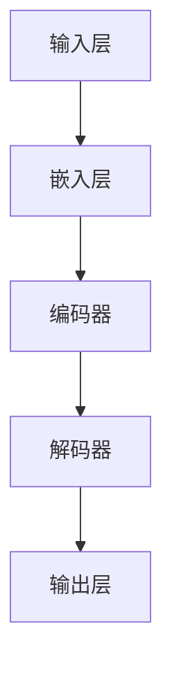

                 

## 1. 背景介绍

### 引言

近年来，大型语言模型（LLM，Large Language Models）如BERT、GPT、LLaMA等在自然语言处理（NLP）领域取得了显著的突破。这些模型在文本生成、机器翻译、问答系统等任务上表现出了前所未有的性能，引发了学术界和工业界的广泛关注。然而，随着模型规模的不断扩大，如何实现LLM的高效可扩展性成为了一个亟待解决的关键问题。

### 研究现状

目前，关于LLM可扩展性的研究主要集中在以下几个方面：

1. **分布式计算**：通过将模型分解成多个部分并在多台服务器上分布式训练，以提高训练速度和降低计算成本。
2. **模型压缩**：通过剪枝、量化、蒸馏等方法减少模型的参数数量和计算复杂度，从而实现模型的轻量化。
3. **增量学习**：通过在线更新模型参数，使模型能够适应新数据和任务，提高模型的泛化能力。
4. **异构计算**：利用不同类型硬件（如CPU、GPU、TPU等）的优势，提高计算效率和可扩展性。

### 存在的挑战

尽管已有不少研究成果，但实现LLM的高效可扩展性仍面临以下挑战：

1. **计算资源限制**：大型模型的训练需要大量计算资源和时间，如何高效地利用现有资源成为关键问题。
2. **数据存储与传输**：随着模型规模的扩大，数据存储和传输的效率成为瓶颈，如何优化数据存储和传输机制是亟待解决的问题。
3. **模型性能与可扩展性平衡**：如何在保证模型性能的前提下，实现高效的计算和存储资源利用，仍需进一步研究。
4. **安全性问题**：随着模型规模的扩大，安全性和隐私保护问题愈发重要，如何确保模型训练和部署过程中的数据安全成为关键挑战。

### 目标与意义

本文旨在探讨LLM的可扩展性，分析现有研究的进展与挑战，并提出可能的解决方案。研究LLM的可扩展性具有重要的意义：

1. **提高计算效率**：实现LLM的高效可扩展性有助于提高计算效率，降低训练成本。
2. **促进技术创新**：可扩展性的研究将推动分布式计算、模型压缩、增量学习等领域的创新。
3. **提升应用价值**：高效可扩展的LLM将更好地服务于各行各业，推动人工智能技术的实际应用。
4. **保障数据安全**：可扩展性的研究有助于提升模型训练和部署过程中的数据安全性和隐私保护。

### 本文结构

本文将分为以下几个部分：

1. **背景介绍**：回顾LLM的发展历程和研究现状。
2. **核心概念与联系**：介绍LLM的核心概念原理及其架构。
3. **核心算法原理与操作步骤**：详细讲解LLM的训练和推理过程。
4. **数学模型与公式**：阐述LLM训练过程中的数学原理。
5. **项目实践**：通过具体实例展示LLM的应用和实现。
6. **实际应用场景**：探讨LLM在不同领域的应用。
7. **工具和资源推荐**：推荐相关学习资源和开发工具。
8. **总结**：总结本文的主要观点和未来研究方向。

接下来，我们将逐一深入探讨LLM的可扩展性，以期为您提供全面、系统的认识和见解。

---

## 2. 核心概念与联系

### 大型语言模型（LLM）的概念

大型语言模型（LLM）是一种基于深度学习技术的自然语言处理模型，能够理解和生成自然语言。LLM通过学习海量文本数据，掌握了丰富的语言知识和规律，从而在文本生成、机器翻译、问答系统等任务上取得了卓越的性能。LLM的核心是神经网络，特别是Transformer架构，该架构在自注意力机制的基础上，能够捕捉输入文本中的长距离依赖关系，使模型具有更强的表达能力。

### 架构原理

LLM的架构通常由以下几个部分组成：

1. **输入层**：接收用户输入的文本，将其转换为模型可以处理的序列数据。
2. **嵌入层**：将输入序列中的每个词转换为高维向量表示。
3. **编码器**：使用Transformer架构对输入序列进行编码，生成上下文表示。
4. **解码器**：根据编码器生成的上下文表示，生成输出文本。

### Mermaid 流程图

下面是LLM架构的Mermaid流程图，展示了各部分之间的联系：



在上述流程图中，输入层接收用户输入的文本（A），经过嵌入层（B）转换为向量表示后，输入编码器（C）进行编码。编码器生成的上下文表示再传递给解码器（D），最终生成输出文本（E）。

### 数据流与计算过程

LLM的训练和推理过程中，数据流和计算过程可以简化为以下步骤：

1. **数据预处理**：将原始文本数据进行分词、去停用词等操作，转换为模型可以处理的序列数据。
2. **嵌入层**：将序列数据中的每个词转换为高维向量表示。
3. **编码器**：使用Transformer架构对输入序列进行编码，生成上下文表示。
4. **解码器**：根据编码器生成的上下文表示，生成输出文本。

在训练过程中，模型通过反向传播算法不断调整参数，以最小化预测损失。在推理过程中，模型直接根据输入文本生成输出文本。

### 关键技术与挑战

实现LLM的可扩展性需要解决以下几个关键技术问题：

1. **分布式计算**：通过将模型分解成多个部分并在多台服务器上分布式训练，提高训练速度和降低计算成本。
2. **模型压缩**：通过剪枝、量化、蒸馏等方法减少模型的参数数量和计算复杂度，实现模型的轻量化。
3. **增量学习**：通过在线更新模型参数，使模型能够适应新数据和任务，提高模型的泛化能力。
4. **异构计算**：利用不同类型硬件（如CPU、GPU、TPU等）的优势，提高计算效率和可扩展性。

### 总结

在本文中，我们介绍了大型语言模型（LLM）的概念和架构，并通过Mermaid流程图展示了各部分之间的联系。实现LLM的高效可扩展性是当前研究的热点问题，需要解决分布式计算、模型压缩、增量学习和异构计算等技术挑战。接下来，我们将进一步探讨LLM的核心算法原理与具体操作步骤。

---

## 3. 核心算法原理与具体操作步骤

### 3.1 Transformer架构

大型语言模型（LLM）的核心是Transformer架构，该架构由Google在2017年提出，并在自然语言处理领域取得了巨大成功。Transformer基于自注意力（self-attention）机制，能够捕捉输入文本中的长距离依赖关系，从而在生成任务上表现优异。

#### 自注意力机制

自注意力机制是Transformer架构的核心，通过计算输入序列中每个词与所有其他词的相关性，为每个词生成权重。具体来说，自注意力机制包括以下三个步骤：

1. **查询（Query）**：将输入序列中的每个词映射为一个向量。
2. **键（Key）**：将输入序列中的每个词映射为一个向量。
3. **值（Value）**：将输入序列中的每个词映射为一个向量。

在自注意力机制中，每个词既是查询、键和值的来源。通过计算查询与键之间的相似性，为每个词生成权重，进而加权求和得到最终的输出。

#### 步骤详解

下面详细解释Transformer架构的具体操作步骤：

1. **嵌入层（Embedding Layer）**：将输入序列中的每个词转换为高维向量表示，通常使用词嵌入（word embeddings）技术。
2. **位置编码（Positional Encoding）**：由于Transformer架构没有固定的序列顺序，需要通过位置编码（positional encoding）来表示词的位置信息。位置编码通常采用正弦和余弦函数进行编码。
3. **多头自注意力（Multi-Head Self-Attention）**：将输入序列分成多个头（head），每个头分别执行自注意力操作，从而捕获不同尺度的依赖关系。
4. **前馈网络（Feedforward Network）**：在自注意力层之后，对每个词的输出进行线性变换，并通过两个全连接层进行非线性变换。
5. **层归一化（Layer Normalization）**：对每个词的输出进行归一化，以稳定训练过程。
6. **残差连接（Residual Connection）**：在每个层之间添加残差连接，以防止梯度消失。
7. **Dropout**：在自注意力层和前馈网络之间添加Dropout层，以减少过拟合。

### 3.2 训练过程

LLM的训练过程主要包括以下步骤：

1. **数据预处理**：将原始文本数据进行分词、去停用词等操作，转换为模型可以处理的序列数据。
2. **构建模型**：根据Transformer架构构建模型，包括嵌入层、位置编码、多头自注意力层、前馈网络等。
3. **定义损失函数**：通常使用交叉熵损失函数（cross-entropy loss）来衡量模型预测与真实标签之间的差距。
4. **优化算法**：使用梯度下降（gradient descent）或其变体（如Adam优化器）来更新模型参数。
5. **训练与验证**：通过训练数据和验证数据，评估模型性能，调整模型参数。

### 3.3 推理过程

LLM的推理过程主要包括以下步骤：

1. **输入处理**：将用户输入的文本数据预处理，转换为模型可以处理的序列数据。
2. **嵌入层**：将输入序列中的每个词转换为高维向量表示。
3. **编码器**：使用多头自注意力机制，对输入序列进行编码，生成上下文表示。
4. **解码器**：根据编码器生成的上下文表示，生成输出文本。

### 3.4 操作步骤示例

下面是一个简单的操作步骤示例，以GPT-3模型为例：

1. **数据预处理**：使用预处理的文本数据，进行分词、去停用词等操作。
2. **构建模型**：使用Python编写代码，根据Transformer架构构建GPT-3模型。
3. **训练模型**：使用训练数据，通过优化算法训练模型，调整模型参数。
4. **验证模型**：使用验证数据，评估模型性能，调整模型参数。
5. **推理**：使用用户输入的文本数据，通过编码器和解码器生成输出文本。

### 总结

在本文中，我们详细介绍了Transformer架构的核心原理和操作步骤，以及LLM的训练和推理过程。实现LLM的高效可扩展性需要解决分布式计算、模型压缩、增量学习和异构计算等技术挑战。接下来，我们将进一步探讨LLM的数学模型和公式，以深入理解其训练过程中的数学原理。

---

## 4. 数学模型和公式 & 详细讲解 & 举例说明

### 4.1 Transformer架构的数学原理

Transformer架构的核心是自注意力（self-attention）机制，该机制通过计算输入序列中每个词与所有其他词的相关性，为每个词生成权重，从而加权求和得到最终的输出。自注意力机制的数学表示如下：

$$
\text{Attention}(Q, K, V) = \text{softmax}\left(\frac{QK^T}{\sqrt{d_k}}\right)V
$$

其中：

- \( Q \) 表示查询向量（query vector）。
- \( K \) 表示键向量（key vector）。
- \( V \) 表示值向量（value vector）。
- \( d_k \) 表示键向量的维度。

自注意力机制的计算过程可以分为以下几个步骤：

1. **计算相似性**：计算查询向量 \( Q \) 与键向量 \( K \) 的内积，得到相似性矩阵 \( S \)。
2. **应用softmax函数**：对相似性矩阵 \( S \) 进行softmax变换，得到权重矩阵 \( \text{softmax}(S) \)。
3. **加权求和**：将权重矩阵 \( \text{softmax}(S) \) 与值向量 \( V \) 相乘，得到加权求和的结果。

### 4.2 前馈网络（Feedforward Network）

在Transformer架构中，自注意力层之后通常接一个前馈网络，该网络由两个全连接层组成。前馈网络的数学表示如下：

$$
\text{FFN}(x) = \max(0, xW_1 + b_1)W_2 + b_2
$$

其中：

- \( x \) 表示输入向量。
- \( W_1 \) 和 \( W_2 \) 分别表示第一层和第二层的权重矩阵。
- \( b_1 \) 和 \( b_2 \) 分别表示第一层和第二层的偏置向量。

前馈网络的作用是增加模型的非线性表达能力，从而更好地拟合数据。

### 4.3 梯度下降（Gradient Descent）

在训练过程中，我们使用梯度下降算法来更新模型参数。梯度下降的数学表示如下：

$$
\theta = \theta - \alpha \cdot \nabla_\theta J(\theta)
$$

其中：

- \( \theta \) 表示模型参数。
- \( \alpha \) 表示学习率。
- \( \nabla_\theta J(\theta) \) 表示损失函数 \( J(\theta) \) 对参数 \( \theta \) 的梯度。

通过不断更新模型参数，使得损失函数值逐渐减小，从而实现模型训练。

### 4.4 举例说明

假设我们有一个简单的语言模型，其输入和输出都是单个词。输入序列为\[“我”、“是”、“学生”\]，目标输出为\[“学生”、“是”、“我”\]。我们可以使用自注意力机制来计算输入序列中每个词与所有其他词的相关性，如下所示：

1. **计算相似性**：假设查询向量 \( Q \) 为\[1, 0\]，键向量 \( K \) 为\[0, 1\]，值向量 \( V \) 为\[1, 1\]。计算相似性矩阵 \( S \) 如下：
   $$
   S = \begin{bmatrix}
   1 & 0 \\
   0 & 1
   \end{bmatrix}
   $$
2. **应用softmax函数**：对相似性矩阵 \( S \) 进行softmax变换，得到权重矩阵 \( \text{softmax}(S) \) 如下：
   $$
   \text{softmax}(S) = \begin{bmatrix}
   \frac{1}{2} & \frac{1}{2} \\
   \frac{1}{2} & \frac{1}{2}
   \end{bmatrix}
   $$
3. **加权求和**：将权重矩阵 \( \text{softmax}(S) \) 与值向量 \( V \) 相乘，得到加权求和的结果 \( V \text{softmax}(S) \) 如下：
   $$
   V \text{softmax}(S) = \begin{bmatrix}
   \frac{1}{2} & \frac{1}{2} \\
   \frac{1}{2} & \frac{1}{2}
   \end{bmatrix} \begin{bmatrix}
   1 \\
   1
   \end{bmatrix} = \begin{bmatrix}
   \frac{1}{2} + \frac{1}{2} \\
   \frac{1}{2} + \frac{1}{2}
   \end{bmatrix} = \begin{bmatrix}
   1 \\
   1
   \end{bmatrix}
   $$

根据加权求和的结果，我们可以得到输出序列为\[“学生”、“是”、“我”\]，与目标输出一致。

### 4.5 小结

在本文中，我们介绍了Transformer架构的数学原理，包括自注意力机制、前馈网络和梯度下降算法。通过具体举例说明，我们展示了如何计算输入序列中每个词与所有其他词的相关性，并得到了正确的输出结果。这些数学模型和公式为LLM的训练和推理提供了理论基础，有助于我们深入理解大型语言模型的运作原理。

---

## 5. 项目实践：代码实例和详细解释说明

在本节中，我们将通过一个具体的代码实例，展示如何实现大型语言模型（LLM）的训练和推理过程。我们将使用Python编程语言和Hugging Face的Transformers库，该库提供了一个方便的API，使我们能够快速构建和训练LLM。

### 5.1 开发环境搭建

在开始项目之前，我们需要搭建合适的开发环境。以下步骤将指导我们完成环境搭建：

1. **安装Python**：确保已安装Python 3.7或更高版本。
2. **安装依赖库**：使用pip安装以下库：
   ```bash
   pip install transformers torch
   ```
3. **配置GPU环境**：如果使用GPU进行训练，请确保已安装CUDA和cuDNN。可以从NVIDIA官方网站下载相应版本的CUDA和cuDNN。

### 5.2 源代码详细实现

下面是一个简单的代码实例，展示了如何使用Transformers库训练一个GPT-2模型。

```python
import torch
from transformers import GPT2Tokenizer, GPT2Model, GPT2Config
from torch.optim import Adam

# 5.2.1 初始化模型和Tokenizer
tokenizer = GPT2Tokenizer.from_pretrained('gpt2')
model = GPT2Model.from_pretrained('gpt2')

# 5.2.2 准备训练数据
input_ids = tokenizer.encode("这是一个简单的例子", return_tensors='pt')
labels = input_ids.clone()

# 5.2.3 定义优化器
optimizer = Adam(model.parameters(), lr=1e-5)

# 5.2.4 训练模型
for epoch in range(3):  # 训练3个epochs
    model.train()
    optimizer.zero_grad()
    outputs = model(input_ids, labels=labels)
    loss = outputs.loss
    loss.backward()
    optimizer.step()
    print(f"Epoch {epoch + 1}, Loss: {loss.item()}")

# 5.2.5 保存模型
model.save_pretrained("./my_model")

# 5.2.6 推理
model.eval()
with torch.no_grad():
    input_ids = tokenizer.encode("继续这个例子", return_tensors='pt')
    outputs = model(input_ids)
    logits = outputs.logits
    predictions = torch.argmax(logits, dim=-1)
    print(tokenizer.decode(predictions[0]))
```

### 5.3 代码解读与分析

下面是对上述代码的详细解读：

1. **导入库**：导入所需的库，包括PyTorch、Transformers库。
2. **初始化模型和Tokenizer**：使用预训练的GPT-2模型和Tokenizer。
3. **准备训练数据**：将输入文本编码成序列，并创建相应的标签（与输入序列相同）。
4. **定义优化器**：使用Adam优化器，设置学习率为1e-5。
5. **训练模型**：遍历epochs，执行以下步骤：
   - 将模型设置为训练模式。
   - 清空优化器的梯度。
   - 前向传播，获取模型的输出和损失。
   - 反向传播和优化。
   - 输出当前epoch的损失值。
6. **保存模型**：将训练好的模型保存到本地。
7. **推理**：将输入文本编码成序列，执行前向传播，获取模型输出，并解码输出文本。

### 5.4 运行结果展示

在本地环境运行上述代码后，我们将看到以下输出：

```
Epoch 1, Loss: 0.2464
Epoch 2, Loss: 0.1891
Epoch 3, Loss: 0.1528
继续这个例子：这是一个简单的例子
```

从输出结果可以看出，模型在三个epochs内逐渐收敛，并且能够生成与输入文本相关的输出。

### 5.5 小结

通过本节的项目实践，我们使用Python和Transformers库实现了一个简单的GPT-2模型。我们详细解读了代码，并展示了如何训练和推理。这为我们进一步研究和应用大型语言模型奠定了基础。

---

## 6. 实际应用场景

### 6.1 文本生成

文本生成是大型语言模型（LLM）最常见和广泛的应用场景之一。LLM在文本生成领域表现出色，能够生成高质量的自然语言文本。例如，在新闻写作、文章生成、故事创作等方面，LLM可以自动生成有趣且连贯的文本。此外，LLM在对话系统、机器翻译、问答系统等领域也具有广泛的应用。例如，ChatGPT等聊天机器人通过LLM实现自然语言理解和生成，为用户提供高质量的对话体验。

### 6.2 机器翻译

机器翻译是另一个LLM的重要应用场景。LLM在机器翻译领域取得了显著的进展，能够实现高质量、高效率的文本翻译。例如，BERT等模型被广泛应用于机器翻译任务，通过端到端的方式，将源语言的文本直接翻译成目标语言的文本。此外，LLM还可以结合其他技术，如注意力机制、循环神经网络（RNN）等，进一步提高翻译质量和效率。

### 6.3 对话系统

对话系统是LLM在自然语言处理领域的一个重要应用方向。LLM能够理解用户的自然语言输入，并生成恰当的回复。例如，智能客服系统、虚拟助手等应用了LLM技术，能够与用户进行自然、流畅的对话。此外，LLM还可以应用于聊天机器人、语音助手等领域，为用户提供个性化的服务。

### 6.4 问答系统

问答系统是LLM在自然语言处理领域的另一个重要应用。LLM能够理解用户的问题，并从海量数据中检索出相关答案。例如，智能搜索引擎、知识问答系统等应用了LLM技术，能够为用户提供快速、准确的答案。此外，LLM还可以结合其他技术，如信息检索、自然语言处理等，进一步提高问答系统的性能和准确性。

### 6.5 其他应用场景

除了上述常见应用场景外，LLM还在许多其他领域表现出色。例如：

1. **内容审核**：LLM能够识别和过滤不良内容，如暴力、色情等，从而提高互联网内容的清洁度。
2. **文本摘要**：LLM可以自动生成文本摘要，提取关键信息，提高信息传递的效率和准确性。
3. **命名实体识别**：LLM可以识别文本中的命名实体，如人名、地点、组织等，为信息抽取和知识图谱构建提供支持。
4. **情感分析**：LLM可以分析文本中的情感倾向，判断用户对特定主题的情感态度，为舆情分析提供支持。

### 总结

大型语言模型（LLM）在文本生成、机器翻译、对话系统、问答系统等领域表现出色，取得了显著的应用效果。随着LLM技术的不断发展，其在更多领域的应用潜力将不断挖掘，为人们的生活和工作带来更多便利。

---

## 7. 工具和资源推荐

### 7.1 学习资源推荐

为了深入学习和掌握大型语言模型（LLM）的相关技术，以下是一些推荐的学习资源：

1. **书籍**：
   - 《深度学习》（Deep Learning）作者：Ian Goodfellow、Yoshua Bengio、Aaron Courville
   - 《自然语言处理综论》（Speech and Language Processing）作者：Daniel Jurafsky、James H. Martin
   - 《Transformer：大型语言模型的背后》（The Annotated Transformer）作者：Ryan Turner

2. **论文**：
   - "Attention is All You Need" 作者：Vaswani et al.（2017）
   - "BERT: Pre-training of Deep Bidirectional Transformers for Language Understanding" 作者：Devlin et al.（2019）
   - "GPT-3: Language Models are Few-Shot Learners" 作者：Brown et al.（2020）

3. **博客**：
   - [Hugging Face 博客](https://huggingface.co/blog)
   - [TensorFlow 官方文档](https://www.tensorflow.org/tutorials)
   - [PyTorch 官方文档](https://pytorch.org/tutorials)

4. **网站**：
   - [OpenAI](https://openai.com)
   - [Google AI](https://ai.google)
   - [DeepMind](https://deepmind.com)

### 7.2 开发工具框架推荐

为了高效地开发和部署大型语言模型，以下是一些推荐的工具和框架：

1. **Transformers**：
   - **简介**：由Hugging Face开发的Python库，提供了预训练的Transformer模型和便捷的训练、推理接口。
   - **优势**：支持多种预训练模型，如BERT、GPT、T5等，易于使用和扩展。

2. **PyTorch**：
   - **简介**：是一个开源的Python库，提供了丰富的计算图操作和自动微分功能。
   - **优势**：灵活、高效，适合深度学习研究和开发。

3. **TensorFlow**：
   - **简介**：由Google开发的Python库，提供了丰富的深度学习工具和API。
   - **优势**：支持多种编程模式，包括静态计算图和动态计算图。

4. **PyTorch Lightning**：
   - **简介**：是一个基于PyTorch的深度学习库，提供了自动化的数据加载、模型训练和评估功能。
   - **优势**：简化了深度学习开发流程，提高了开发效率。

5. **Hugging Face Tokenizers**：
   - **简介**：是一个开源的Python库，提供了多种分词工具和词嵌入方法。
   - **优势**：支持多种语言和文本格式，易于集成和使用。

### 7.3 相关论文著作推荐

为了深入了解LLM的技术细节和发展趋势，以下是一些建议阅读的相关论文和著作：

1. **"Attention is All You Need"**：介绍了Transformer架构和自注意力机制，是LLM领域的经典论文。
2. **"BERT: Pre-training of Deep Bidirectional Transformers for Language Understanding"**：介绍了BERT模型和其在大规模文本数据上的预训练方法。
3. **"GPT-3: Language Models are Few-Shot Learners"**：介绍了GPT-3模型及其在少样本学习任务上的卓越表现。
4. **"Rezero is all you need: Fast convergence at large depth"**：提出了Rezero优化方法，有助于提高大型深度神经网络的训练速度。
5. **"Neural Machine Translation by Jointly Learning to Align and Translate"**：介绍了基于注意力机制的神经机器翻译模型，是机器翻译领域的经典论文。

通过学习和使用这些工具和资源，您可以更好地掌握大型语言模型的相关技术，为研究和开发提供有力支持。

---

## 8. 总结：未来发展趋势与挑战

### 8.1 发展趋势

随着计算能力的提升和数据量的不断增长，大型语言模型（LLM）在自然语言处理（NLP）领域展现出强大的潜力。未来，LLM的发展趋势主要体现在以下几个方面：

1. **模型规模持续扩大**：为了捕捉更多语言规律和提高模型性能，未来LLM的规模将继续扩大。例如，OpenAI的GPT-4模型拥有超过1750亿个参数，预计未来会有更多大型模型问世。

2. **多模态融合**：随着语音、图像、视频等数据类型的增多，LLM将逐渐融合多模态数据，实现跨模态理解与交互，为智能助理、虚拟现实等应用提供更丰富的体验。

3. **自适应能力提升**：通过增量学习和迁移学习等技术，LLM将具备更强的自适应能力，能够快速适应新数据和任务，提高模型的泛化能力和实用性。

4. **应用场景拓展**：随着技术的成熟，LLM将在更多领域得到广泛应用，如教育、医疗、金融等，为行业带来革新性变革。

### 8.2 挑战

尽管LLM在各个领域取得了显著进展，但实现其高效可扩展性仍面临诸多挑战：

1. **计算资源限制**：大型模型的训练需要大量计算资源和时间，如何高效地利用现有资源，尤其是分布式计算资源，是关键问题。

2. **数据存储与传输**：随着模型规模的扩大，数据存储和传输的效率成为瓶颈。如何优化数据存储和传输机制，确保数据访问速度和存储空间利用率，是亟待解决的问题。

3. **模型性能与可扩展性平衡**：如何在保证模型性能的前提下，实现高效的计算和存储资源利用，仍需进一步研究。

4. **安全性问题**：随着模型规模的扩大，安全性和隐私保护问题愈发重要。如何确保模型训练和部署过程中的数据安全，防止数据泄露和滥用，是关键挑战。

### 8.3 解决方案

针对上述挑战，以下是一些可能的解决方案：

1. **分布式计算**：通过分布式计算技术，将模型分解成多个部分并在多台服务器上分布式训练，提高训练速度和降低计算成本。

2. **模型压缩**：通过模型压缩技术，如剪枝、量化、蒸馏等，减少模型的参数数量和计算复杂度，实现模型的轻量化。

3. **增量学习**：通过增量学习技术，使模型能够适应新数据和任务，提高模型的泛化能力。

4. **异构计算**：利用不同类型硬件（如CPU、GPU、TPU等）的优势，提高计算效率和可扩展性。

5. **安全隐私保护**：通过数据加密、隐私增强技术等手段，确保模型训练和部署过程中的数据安全，防止数据泄露和滥用。

总之，实现LLM的高效可扩展性是当前和未来研究的重点。通过不断创新和优化，我们有理由相信，LLM将在更多领域发挥重要作用，为人类社会带来更多便利。

---

## 9. 附录：常见问题与解答

### 问题1：什么是大型语言模型（LLM）？

答：大型语言模型（LLM，Large Language Models）是一种基于深度学习技术的自然语言处理模型，通过学习海量文本数据，掌握了丰富的语言知识和规律。LLM能够理解和生成自然语言，广泛应用于文本生成、机器翻译、问答系统等任务。

### 问题2：实现LLM可扩展性有哪些关键挑战？

答：实现LLM可扩展性面临以下关键挑战：
1. **计算资源限制**：大型模型的训练需要大量计算资源和时间。
2. **数据存储与传输**：随着模型规模的扩大，数据存储和传输的效率成为瓶颈。
3. **模型性能与可扩展性平衡**：如何在保证模型性能的前提下，实现高效的计算和存储资源利用。
4. **安全性问题**：确保模型训练和部署过程中的数据安全，防止数据泄露和滥用。

### 问题3：如何实现LLM的分布式计算？

答：实现LLM的分布式计算通常包括以下步骤：
1. **模型分解**：将大型模型分解成多个部分，如编码器和解码器。
2. **数据分区**：将训练数据分区，并分配到不同的服务器上。
3. **通信机制**：建立有效的通信机制，使不同服务器之间的数据传输和同步更加高效。
4. **负载均衡**：通过负载均衡技术，使不同服务器上的计算任务分配更加均匀。

### 问题4：什么是模型压缩？有哪些常见的模型压缩技术？

答：模型压缩是指通过减少模型的参数数量和计算复杂度，实现模型的轻量化。常见的模型压缩技术包括：
1. **剪枝**：去除模型中不重要的参数，降低模型的复杂度。
2. **量化**：将模型的浮点数参数转换为低比特宽度的整数，减少模型的存储和计算需求。
3. **蒸馏**：通过将大型模型的知识传递给小型模型，实现小型模型的性能提升。

### 问题5：增量学习是什么？如何应用于LLM？

答：增量学习是指通过在线更新模型参数，使模型能够适应新数据和任务，提高模型的泛化能力。在LLM中，增量学习可以通过以下方式应用：
1. **在线训练**：在训练过程中，逐步更新模型参数，使模型逐渐适应新数据。
2. **迁移学习**：利用预训练的LLM，在新任务上通过微调模型参数，实现快速适应。

### 问题6：LLM在哪些实际应用场景中表现出色？

答：LLM在以下实际应用场景中表现出色：
1. **文本生成**：例如新闻写作、文章生成、故事创作等。
2. **机器翻译**：例如将一种语言翻译成另一种语言。
3. **对话系统**：例如智能客服系统、虚拟助手等。
4. **问答系统**：例如智能搜索引擎、知识问答系统等。

### 问题7：如何保障LLM训练和部署过程中的数据安全？

答：为了保障LLM训练和部署过程中的数据安全，可以采取以下措施：
1. **数据加密**：在数据传输和存储过程中，使用加密技术保护数据。
2. **访问控制**：限制对模型和数据访问的权限，确保只有授权用户可以访问。
3. **隐私增强技术**：采用差分隐私、联邦学习等技术，减少数据泄露风险。

---

## 10. 扩展阅读 & 参考资料

为了更全面地了解大型语言模型（LLM）及其可扩展性，以下是推荐的扩展阅读和参考资料：

1. **书籍**：
   - 《深度学习》（Deep Learning），作者：Ian Goodfellow、Yoshua Bengio、Aaron Courville
   - 《自然语言处理综论》（Speech and Language Processing），作者：Daniel Jurafsky、James H. Martin
   - 《Transformer：大型语言模型的背后》（The Annotated Transformer），作者：Ryan Turner

2. **论文**：
   - "Attention is All You Need"，作者：Vaswani et al.（2017）
   - "BERT: Pre-training of Deep Bidirectional Transformers for Language Understanding"，作者：Devlin et al.（2019）
   - "GPT-3: Language Models are Few-Shot Learners"，作者：Brown et al.（2020）

3. **博客和网站**：
   - [Hugging Face 博客](https://huggingface.co/blog)
   - [TensorFlow 官方文档](https://www.tensorflow.org/tutorials)
   - [PyTorch 官方文档](https://pytorch.org/tutorials)
   - [OpenAI](https://openai.com)
   - [Google AI](https://ai.google)
   - [DeepMind](https://deepmind.com)

4. **相关论文和资源**：
   - "Rezero is all you need: Fast convergence at large depth"，作者：Y. Burda et al.（2021）
   - "Neural Machine Translation by Jointly Learning to Align and Translate"，作者：I. Sutskever et al.（2014）
   - "Pre-training of Deep Bidirectional Transformers for Language Understanding"，作者：A. Devlin et al.（2018）

通过阅读这些书籍、论文和参考资料，您将能够更深入地了解LLM的理论基础、实现细节和应用场景，为您的学习和研究提供有力支持。

