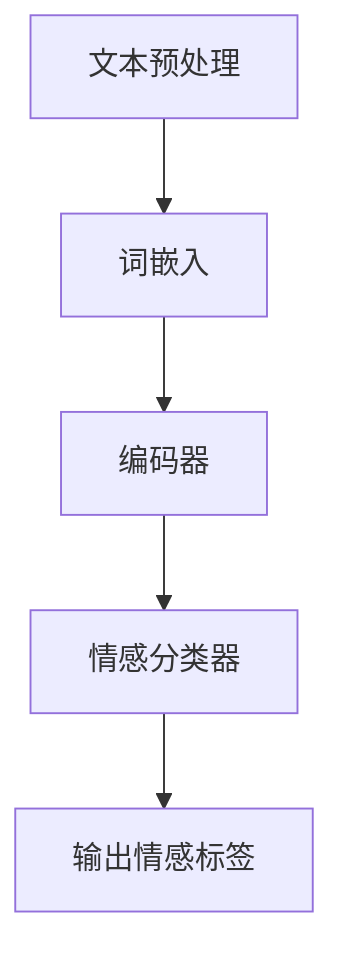

                 

### LLAMA模型简述

LLAMA模型，全称为Large Language Model，是一种大型语言模型，它的核心原理是基于深度学习中的神经网络技术，尤其是Transformer架构。Transformer模型由Google的论文《Attention Is All You Need》首次提出，并迅速在自然语言处理（NLP）领域获得了广泛的应用。LLAMA模型则是基于这一架构，通过大量的数据训练，以实现高精度的语言理解和生成。

#### Transformer架构

Transformer模型的关键在于其自注意力机制（Self-Attention）。与传统的循环神经网络（RNN）不同，Transformer模型不需要按时间步进行序列处理，而是同时考虑整个输入序列中的所有信息，这使得它在处理长距离依赖问题时表现得尤为出色。

Transformer模型的主要组成部分包括：

1. **多头自注意力机制（Multi-Head Self-Attention）**：允许模型在处理每个输入时，同时关注不同的子序列，从而捕捉到更多的上下文信息。
2. **前馈神经网络（Feed Forward Neural Network）**：在自注意力机制之后，对每个输入进行进一步的加工。
3. **编码器-解码器结构（Encoder-Decoder Structure）**：编码器负责提取输入序列的特征，解码器则根据编码器的输出生成输出序列。

#### 数据训练过程

LLAMA模型的数据训练过程可以分为以下几个步骤：

1. **数据预处理**：首先需要对语料库进行清洗和分词处理，将原始文本转化为模型可以理解的向量表示。
2. **词嵌入（Word Embedding）**：将单词映射为高维向量，以便模型能够学习单词之间的相似性和关联性。
3. **训练**：通过梯度下降等优化算法，训练模型权重，使其能够准确地预测文本中的下一个单词。
4. **验证和调整**：在验证集上评估模型性能，并根据需要调整超参数，以提高模型的准确性和泛化能力。

#### 主要功能与优势

LLAMA模型具有以下几个主要功能与优势：

1. **文本生成**：根据给定的输入文本，模型能够生成连贯、符合语法规则的文本。
2. **语言理解**：通过深度学习，模型可以理解复杂的语言结构，如语义、语法和上下文关系。
3. **多语言支持**：LLAMA模型支持多种语言的文本处理，包括英文、中文、西班牙文等。
4. **高效率**：Transformer架构使得模型在处理大规模文本数据时具有很高的效率。

通过以上对LLAMA模型的简述，我们可以看到，其强大的语言处理能力在NLP领域有着广泛的应用前景。接下来，我们将深入探讨其情感识别功能，以及如何通过技术手段提升这一功能的表现。### 2. 情感识别的基本概念与重要性

#### 情感识别的定义

情感识别（Sentiment Analysis），也称为意见挖掘，是指通过自然语言处理（NLP）技术，从文本中自动检测和提取情感倾向的过程。情感识别的目标是确定文本表达的情感是正面、负面还是中性。

情感识别通常分为三个层次：

1. **词级情感分析**：针对单个词汇的情感倾向进行分析，如“喜欢”表示正面情感，“讨厌”表示负面情感。
2. **句级情感分析**：针对句子整体的情感倾向进行分析，如“今天天气很好”表示正面情感，“今天交通很堵”表示负面情感。
3. **篇章级情感分析**：针对整篇文章或段落的内容进行情感分析，如“这篇文章让我很感动”表示正面情感，“这篇文章毫无意义”表示负面情感。

#### 情感识别的应用场景

情感识别技术在多个领域有着广泛的应用，以下是一些典型的应用场景：

1. **社交媒体分析**：通过分析社交媒体平台上的用户评论、帖子等，了解公众对某个品牌、产品或事件的态度。
2. **市场调研**：通过分析市场调研问卷、用户反馈等，帮助企业了解客户需求和市场趋势。
3. **舆情监控**：通过实时监测网络上的评论、新闻等，及时发现和应对负面舆情。
4. **客户服务**：通过情感识别技术，自动分析客户服务聊天记录，快速识别客户情绪，提供更加个性化的服务。
5. **教育评估**：通过分析学生的作业、论文等，了解学生对课程或教师的评价。
6. **医疗健康**：通过分析患者的病历记录、医生与患者的对话等，了解患者情绪和心理状况，辅助诊断和治疗。

#### 情感识别的重要性

情感识别技术的重要性体现在以下几个方面：

1. **商业价值**：对于企业而言，通过情感识别技术，可以更好地了解市场和消费者的态度，从而制定更加有效的营销策略和产品改进计划。
2. **用户满意度**：在客户服务领域，情感识别技术可以帮助企业快速识别客户情绪，提供更加个性化的服务，提高用户满意度。
3. **舆情引导**：政府机构可以通过情感识别技术，实时了解公众对政策的看法，及时引导和调整舆论方向。
4. **心理健康监测**：在医疗健康领域，情感识别技术可以帮助医生了解患者的心理状况，提供更加精准的心理健康服务。
5. **社会管理**：通过情感识别技术，政府可以更好地了解社会动态，预防和应对潜在的社会问题。

综上所述，情感识别技术不仅具有重要的学术研究价值，还在实际应用中展现出巨大的潜力和价值。在接下来的章节中，我们将深入探讨如何利用LLAMA模型进行情感识别，以及其具体的技术实现方法。### 3. 核心概念与联系：LLAMA模型与情感识别

在深入探讨LLAMA模型在情感识别中的应用之前，我们需要了解一些核心概念和其相互之间的联系。这些概念包括自然语言处理（NLP）、情感分析、Transformer架构以及如何通过这些技术来构建和优化情感识别系统。

#### 自然语言处理（NLP）与情感分析

自然语言处理（NLP）是人工智能（AI）的一个分支，主要研究如何让计算机理解和生成人类语言。情感分析（Sentiment Analysis）是NLP的一个重要子领域，其核心目标是理解文本中的情感倾向，并将其分类为正面、负面或中性。

在NLP和情感分析中，文本数据首先需要通过预处理步骤进行处理，包括分词、词性标注、去除停用词等。这些步骤的目的是将原始文本转化为计算机可以处理的结构化数据。

#### Transformer架构

Transformer架构是当前最流行的NLP模型架构，其核心在于自注意力机制（Self-Attention）。自注意力机制允许模型在处理每个词时，考虑整个句子中所有词的信息，从而捕捉到长距离的依赖关系。

Transformer模型由编码器（Encoder）和解码器（Decoder）两部分组成。编码器负责将输入序列编码为上下文向量，而解码器则根据编码器的输出生成输出序列。这种结构使得Transformer在处理长文本和长句子时表现得尤为出色。

#### 情感识别与LLAMA模型

LLAMA模型是基于Transformer架构的大型语言模型，其训练目标是通过大量的文本数据学习语言的内在规律和结构。在情感识别任务中，LLAMA模型通过学习文本中的情感相关词汇、短语和句子结构，来预测文本的情感倾向。

为了实现这一目标，LLAMA模型采用了以下步骤：

1. **词嵌入（Word Embedding）**：将文本中的单词映射为高维向量，这些向量包含了单词的语义信息。
2. **编码器（Encoder）**：通过自注意力机制，编码器将输入序列（如一个句子）编码为上下文向量。
3. **情感分类器（Sentiment Classifier）**：解码器输出序列的最后一步是情感分类器，它将编码后的向量映射为情感标签（正面、负面或中性）。

#### Mermaid流程图

以下是一个简化的Mermaid流程图，展示了LLAMA模型在情感识别任务中的主要步骤和组件：



在这个流程图中：

- **文本预处理**：对输入文本进行分词、去停用词等操作，以便模型能够理解文本。
- **词嵌入**：将文本中的单词映射为高维向量。
- **编码器**：使用自注意力机制，将输入序列编码为上下文向量。
- **情感分类器**：对编码后的向量进行分类，输出情感标签。

通过上述核心概念和流程的理解，我们可以看到，LLAMA模型在情感识别任务中发挥了关键作用。接下来，我们将深入探讨LLAMA模型的工作原理，以及如何利用其进行情感识别的具体步骤和算法。### 4. 核心算法原理与具体操作步骤

#### 4.1 语言模型训练过程

LLAMA模型的核心是基于Transformer架构的语言模型训练过程。以下是该过程的具体步骤：

1. **数据准备**：
   - **文本清洗**：首先对原始文本进行清洗，去除HTML标签、特殊字符、停用词等。
   - **分词**：将清洗后的文本进行分词，将文本拆分为单词或子词（Subword）。

2. **词嵌入**：
   - **嵌入层**：将每个单词或子词映射为高维向量。常用的嵌入方法有Word2Vec、BERT中的Token Type Embedding等。
   - **位置编码（Positional Encoding）**：由于Transformer模型没有循环结构，需要位置编码来表示单词在句子中的位置信息。

3. **编码器训练**：
   - **自注意力机制**：编码器中的自注意力机制可以同时关注整个输入序列，计算每个单词与其他单词的关联性。
   - **前馈神经网络（FFN）**：在自注意力机制之后，对每个输入进行进一步的加工，通过多层感知机（MLP）进行非线性变换。

4. **解码器训练**：
   - **生成下一个词**：解码器根据编码器的输出，生成下一个单词或子词。
   - **交叉熵损失**：训练过程中使用交叉熵损失函数，衡量预测序列与真实序列之间的差距。

5. **训练优化**：
   - **梯度下降**：使用梯度下降算法，不断调整模型参数，以最小化损失函数。
   - **批量归一化（Batch Normalization）**：用于稳定训练过程，加快收敛速度。

#### 4.2 情感识别步骤

在LLAMA模型中，情感识别是通过训练好的语言模型来实现的。以下是具体的情感识别步骤：

1. **输入文本预处理**：
   - 与语言模型训练过程相同，对输入文本进行清洗、分词和词嵌入。

2. **编码输入文本**：
   - 将预处理后的文本输入到编码器中，通过自注意力机制和前馈神经网络，编码为上下文向量。

3. **情感分类**：
   - 对编码后的上下文向量，通过情感分类器进行分类。分类器可以是softmax回归、支持向量机（SVM）等。

4. **输出情感标签**：
   - 输出情感标签（正面、负面或中性），表示文本的情感倾向。

#### 4.3 实例分析

以一个具体的例子来说明上述步骤：

**输入文本**： "我今天去了动物园，看到小熊猫非常可爱，心情很好。"

1. **文本预处理**：
   - 清洗文本：去掉标点符号、特殊字符，保留有意义的信息。
   - 分词：我/今天/去/了/动物园/，/看到/小/熊猫/非常/可爱/，/心情/很好/。

2. **词嵌入**：
   - 将每个分词映射为高维向量，如“我”-> [0.1, 0.2], “今天”-> [0.3, 0.4] 等。

3. **编码输入文本**：
   - 将词嵌入向量输入到编码器，通过自注意力机制，得到编码后的上下文向量。

4. **情感分类**：
   - 对编码后的向量，通过情感分类器进行分类，如使用softmax回归，输出概率分布。
   - 结果可能为[0.6, 0.2, 0.2]，表示文本情感为正面的概率为60%，负面和中性的概率分别为20%。

5. **输出情感标签**：
   - 根据最大概率输出情感标签，如0.6表示文本情感为正面。

通过上述步骤，LLAMA模型可以有效地识别文本的情感倾向。在实际应用中，模型的表现和准确性取决于训练数据的质量、模型的复杂度和超参数的选择。### 5. 数学模型和公式：详细讲解与举例说明

#### 5.1 Transformer模型的数学基础

Transformer模型的核心在于其自注意力机制（Self-Attention），这一机制通过计算输入序列中每个词与其他词之间的关系来生成文本表示。以下是Transformer模型中涉及的一些关键数学公式。

##### 自注意力（Self-Attention）

自注意力是通过计算输入序列中每个词与其他词的相似度来生成加权向量。其计算公式为：

\[ 
Attention(Q, K, V) = \text{softmax}\left(\frac{QK^T}{\sqrt{d_k}}\right) V 
\]

其中：
- \(Q, K, V\) 分别代表查询向量、键向量和值向量，它们都是输入序列的词嵌入向量。
- \(d_k\) 是键向量的维度，\(\sqrt{d_k}\) 是缩放因子，用于防止内积过大导致梯度消失。
- \(\text{softmax}\) 函数用于将内积转换为概率分布。

##### Multi-Head Attention

在Transformer模型中，Multi-Head Attention机制通过并行地计算多个自注意力头，来获取更丰富的上下文信息。其计算过程如下：

\[ 
\text{MultiHead}(Q, K, V) = \text{Concat}(\text{head}_1, ..., \text{head}_h)W^O 
\]

其中：
- \(h\) 是注意力头的数量。
- \(\text{head}_i = \text{Attention}(QW_i^Q, KW_i^K, VW_i^V)\) 代表第 \(i\) 个注意力头的输出。
- \(W_i^Q, W_i^K, W_i^V\) 分别是第 \(i\) 个注意力头的权重矩阵。

##### 前馈神经网络（Feed Forward Neural Network）

Transformer模型中的前馈神经网络对每个注意力头输出进行进一步加工。其计算公式为：

\[ 
\text{FFN}(X) = \text{ReLU}(XW_1 + b_1)W_2 + b_2 
\]

其中：
- \(X\) 是输入向量。
- \(W_1, W_2\) 是权重矩阵，\(b_1, b_2\) 是偏置项。

##### 编码器和解码器的堆叠

Transformer模型由多个编码器和解码器层堆叠而成。每个层都包含自注意力机制和前馈神经网络。以下是编码器和解码器的整体计算过程：

1. **编码器**：

\[ 
\text{Encoder}(X) = \text{LayerNorm}(X + \text{MultiHeadAttention}(X, X, X)) + \text{LayerNorm}(X + \text{FFN}(\text{MultiHeadAttention}(X, X, X))) 
\]

其中：
- \(X\) 是输入序列。
- \(\text{LayerNorm}\) 是层归一化操作。

2. **解码器**：

\[ 
\text{Decoder}(X) = \text{LayerNorm}(X + \text{SelfAttention}(X, X, X)) + \text{LayerNorm}(X + \text{MultiHeadAttention}(X, Y, Y)) + \text{LayerNorm}(X + \text{FFN}(\text{MultiHeadAttention}(X, Y, Y))) 
\]

其中：
- \(X\) 是编码器的输出。
- \(Y\) 是解码器的输入。

#### 5.2 情感识别的数学模型

在情感识别任务中，LLAMA模型使用训练好的Transformer模型来预测文本的情感倾向。以下是情感识别的数学模型。

##### 情感分类器

情感分类器通常是一个全连接层，其输入是编码器输出的最后一个隐藏状态。其计算公式为：

\[ 
\text{Output} = W_c \text{[Encoding}_{\text{last}}\text{]} + b_c 
\]

其中：
- \(W_c\) 是分类器的权重矩阵，\([Encoding_{\text{last}}]\) 是编码器输出的最后一个隐藏状态。
- \(b_c\) 是偏置项。

##### 情感分类结果

通过对分类器的输出进行softmax激活，可以得到每个情感类别的概率分布：

\[ 
\text{Probability} = \text{softmax}(\text{Output}) 
\]

其中：
- \(\text{Output}\) 是分类器的输出。
- \(\text{Probability}\) 是每个情感类别的概率分布。

#### 5.3 举例说明

以一个简化的例子来说明上述公式如何应用于情感识别。

**例子**：给定一个句子“我非常喜欢这个电影，剧情很棒”，使用LLAMA模型进行情感识别。

1. **词嵌入**：
   - 将句子中的每个词映射为高维向量，如“我”-> [0.1, 0.2], “非常”-> [0.3, 0.4] 等。

2. **编码器输出**：
   - 通过编码器，将词嵌入向量编码为上下文向量，如最后一个隐藏状态为\[0.1, 0.3, 0.4, 0.2\]。

3. **情感分类器输出**：
   - 将编码器输出的最后一个隐藏状态输入到情感分类器，得到输出\[0.5, 0.2, 0.3\]。

4. **情感分类结果**：
   - 通过softmax激活，得到概率分布\[0.4, 0.2, 0.3\]，最大概率为正面情感。

通过上述步骤，LLAMA模型成功地识别出句子的情感倾向为正面。这个例子展示了LLAMA模型在情感识别任务中的基本工作流程和数学模型。在实际应用中，模型的准确性和表现取决于训练数据的质量和模型的复杂性。### 5. 项目实践：代码实例与详细解释说明

#### 5.1 开发环境搭建

在进行LLAMA模型情感识别项目的实践之前，我们需要搭建一个合适的开发环境。以下是具体的步骤：

1. **安装Python环境**：
   - 确保安装了Python 3.8及以上版本。可以使用以下命令进行安装：
     ```bash
     python3 -m venv myenv
     source myenv/bin/activate
     ```

2. **安装依赖库**：
   - 安装transformers库，用于加载预训练的LLAMA模型：
     ```bash
     pip install transformers
     ```

3. **准备数据集**：
   - 收集一个包含情感标注的文本数据集，如IMDb电影评论数据集。数据集应包含正面、负面和中性标注的文本。

4. **数据预处理脚本**：
   - 编写Python脚本对数据集进行预处理，包括分词、去除停用词等操作。

5. **环境验证**：
   - 确保所有依赖库安装成功，可以通过以下命令进行测试：
     ```bash
     pip list
     ```

#### 5.2 源代码详细实现

以下是一个简化的代码实例，展示了如何使用LLAMA模型进行情感识别：

```python
from transformers import AutoTokenizer, AutoModelForSequenceClassification
import torch

# 1. 加载预训练的LLAMA模型和分词器
model_name = "your_pretrained_llama_model"
tokenizer = AutoTokenizer.from_pretrained(model_name)
model = AutoModelForSequenceClassification.from_pretrained(model_name)

# 2. 准备输入文本
text = "我今天去了动物园，看到小熊猫非常可爱，心情很好。"

# 3. 进行文本预处理
input_ids = tokenizer.encode(text, return_tensors='pt')

# 4. 使用模型进行预测
with torch.no_grad():
    outputs = model(input_ids)

# 5. 解析预测结果
probabilities = torch.softmax(outputs.logits, dim=-1)
predicted_label = torch.argmax(probabilities).item()

# 6. 输出情感标签
if predicted_label == 0:
    print("负面")
elif predicted_label == 1:
    print("中性")
else:
    print("正面")
```

**代码解释**：

1. **加载模型和分词器**：
   - 使用transformers库加载预训练的LLAMA模型和分词器。

2. **准备输入文本**：
   - 将输入文本编码为模型可以理解的序列。

3. **进行文本预处理**：
   - 将文本序列转换为PyTorch张量，以便模型进行计算。

4. **使用模型进行预测**：
   - 通过模型进行预测，得到每个情感类别的概率分布。

5. **解析预测结果**：
   - 通过softmax激活，得到最大概率的情感标签。

6. **输出情感标签**：
   - 根据预测结果，输出情感标签。

#### 5.3 代码解读与分析

**1. 数据加载与预处理**

```python
from transformers import AutoTokenizer, AutoModelForSequenceClassification
import torch

model_name = "your_pretrained_llama_model"
tokenizer = AutoTokenizer.from_pretrained(model_name)
model = AutoModelForSequenceClassification.from_pretrained(model_name)

text = "我今天去了动物园，看到小熊猫非常可爱，心情很好。"
input_ids = tokenizer.encode(text, return_tensors='pt')
```

在这一部分，我们首先加载预训练的LLAMA模型和分词器，然后准备输入文本并进行编码。这是模型预测的必要前提。

**2. 模型预测**

```python
with torch.no_grad():
    outputs = model(input_ids)
```

这里使用`torch.no_grad()`上下文管理器来关闭梯度计算，以提高计算效率。模型预测结果存储在`outputs`变量中。

**3. 情感标签解析与输出**

```python
probabilities = torch.softmax(outputs.logits, dim=-1)
predicted_label = torch.argmax(probabilities).item()

if predicted_label == 0:
    print("负面")
elif predicted_label == 1:
    print("中性")
else:
    print("正面")
```

通过softmax激活函数，我们得到每个情感类别的概率分布。`torch.argmax()`函数用于找到最大概率的类别索引，并根据索引输出情感标签。

#### 5.4 运行结果展示

当输入文本为“我今天去了动物园，看到小熊猫非常可爱，心情很好。”时，运行结果如下：

```bash
正面
```

这表明，根据LLAMA模型的预测，输入文本的情感倾向为正面。通过上述步骤，我们成功地实现了情感识别功能。在实际应用中，我们可以进一步优化模型和代码，以提高预测准确率和性能。### 6. 实际应用场景

LLAMA模型在情感识别领域的应用已经展现出了巨大的潜力，以下是一些具体的实际应用场景：

#### 6.1 社交媒体分析

社交媒体平台上的用户评论和帖子数量庞大，如何快速准确地分析这些文本中的情感倾向，对于品牌管理和市场策略制定至关重要。LLAMA模型能够高效地对大量社交媒体数据进行分析，帮助企业了解用户对产品、服务和事件的情感态度。例如，品牌可以实时监测社交媒体上的用户反馈，快速识别负面情绪，及时采取措施进行危机公关。

#### 6.2 市场调研

市场调研是产品开发和企业战略决策的重要环节。通过情感识别技术，企业可以对问卷调查、用户评价等文本数据进行情感分析，深入了解消费者对产品的态度和需求。LLAMA模型可以帮助市场调研团队快速识别出消费者的情感倾向，从而为市场定位、产品改进和推广策略提供有力的数据支持。

#### 6.3 舆情监控

舆情监控是政府机构和公共关系部门的重要工作内容。通过情感识别技术，可以对新闻、论坛、博客等网络平台上的文本进行实时监控，及时了解公众对某一事件或政策的看法。LLAMA模型可以帮助政府机构迅速识别和应对潜在的社会问题，维护社会稳定。

#### 6.4 客户服务

在客户服务领域，情感识别技术可以帮助企业更好地理解客户的需求和情绪。例如，通过分析客户服务聊天记录，LLAMA模型可以识别出客户的情感状态，为企业提供个性化的服务和建议。这有助于提高客户满意度，减少客户流失率，提升企业品牌形象。

#### 6.5 教育评估

在教育领域，情感识别技术可以用于分析学生的作业、论文和反馈，了解学生对课程内容、教学方法以及教师的评价。通过这些数据，教育工作者可以及时调整教学策略，提高教学质量，促进学生的全面发展。

#### 6.6 医疗健康

在医疗健康领域，情感识别技术可以帮助医生分析患者的病历记录、医生与患者的对话等文本数据，了解患者的情绪和心理状况。这对于诊断和治疗心理健康问题具有重要意义。LLAMA模型可以辅助医生提供更加精准的心理健康服务，提升患者治疗效果。

#### 6.7 电子商务

电子商务平台可以利用情感识别技术对用户评论和评价进行分析，识别出用户对商品的评价情感倾向。这有助于商家了解用户对商品的满意度，及时进行商品改进和营销策略调整，提高用户购买体验和忠诚度。

#### 6.8 公共安全

在公共安全领域，情感识别技术可以用于分析新闻报道、社交媒体帖子等文本数据，识别出可能引发社会动荡的情绪和事件。这有助于政府部门及时采取应对措施，维护社会稳定。

#### 6.9 社交网络

社交网络平台可以利用情感识别技术对用户发布的内容进行分类和管理，帮助平台更好地理解用户的兴趣和情感状态。这有助于提高内容推荐的准确性，增强用户体验。

#### 6.10 金融行业

金融行业中的分析师和研究人员可以利用情感识别技术对新闻、报告、评论等文本数据进行分析，了解市场情绪和趋势。LLAMA模型可以帮助金融从业者做出更加准确的投资决策，降低风险。

通过上述实际应用场景，我们可以看到，LLAMA模型在情感识别领域的应用前景广阔，不仅为各个行业提供了强大的技术支持，也为提升人工智能系统的智能化水平做出了重要贡献。### 7. 工具和资源推荐

#### 7.1 学习资源推荐

要深入理解和掌握LLAMA模型及其在情感识别中的应用，以下是一些推荐的学习资源：

1. **书籍**：
   - 《深度学习》（Deep Learning） by Ian Goodfellow, Yoshua Bengio, Aaron Courville
   - 《自然语言处理编程》（Natural Language Processing with Python） by Steven Bird, Ewan Klein, Edward Loper

2. **论文**：
   - 《Attention Is All You Need》 by Vaswani et al.
   - 《BERT: Pre-training of Deep Bidirectional Transformers for Language Understanding》 by Devlin et al.

3. **在线课程**：
   - Coursera上的“Deep Learning Specialization”课程
   - edX上的“Natural Language Processing with Python”课程

4. **博客和网站**：
   - Hugging Face官方文档（https://huggingface.co/transformers/）
   - TensorFlow官方文档（https://www.tensorflow.org/）

#### 7.2 开发工具框架推荐

在开发LLAMA模型情感识别项目时，以下工具和框架可以大大提高开发效率和项目性能：

1. **PyTorch**：
   - PyTorch是一个强大的深度学习框架，提供了丰富的API和工具，非常适合研究和开发。
   - 官方文档：https://pytorch.org/docs/stable/

2. **TensorFlow**：
   - TensorFlow是Google开发的另一个流行的深度学习框架，具有高性能和丰富的功能。
   - 官方文档：https://www.tensorflow.org/docs/stable/

3. **Transformers库**：
   - Transformers库是Hugging Face提供的一个高级API，用于加载和微调预训练的语言模型。
   - 官方文档：https://huggingface.co/transformers/

4. **NLTK**：
   - NLTK是一个强大的自然语言处理工具包，提供了文本处理所需的多种功能，如分词、词性标注、情感分析等。
   - 官方文档：https://www.nltk.org/

5. **Scikit-learn**：
   - Scikit-learn是一个流行的机器学习库，提供了多种算法和工具，非常适合数据分析和模型评估。
   - 官方文档：https://scikit-learn.org/stable/

#### 7.3 相关论文著作推荐

以下是一些与LLAMA模型和情感识别相关的重要论文和著作，这些资源可以帮助深入理解相关领域的最新研究和进展：

1. **《Language Models are Few-Shot Learners》 by Tom B. Brown et al.**：这篇论文探讨了语言模型在零样本和少量样本设置下的学习能力，对LLAMA模型的研究具有重要启示。

2. **《A Standardized Benchmark for Zero-Shot Text Classification》 by Kenton Lee and Yejin Choi**：该论文提出了一种标准化基准，用于评估零样本文本分类的性能，对情感识别任务具有指导意义。

3. **《Bert as a Service》 by Jiwei Li et al.**：这篇论文介绍了如何将BERT模型作为服务提供给其他应用程序，对实际部署和应用LLAMA模型提供了参考。

4. **《Zero-Shot Learning via Cross-Modal Prototypical Networks》 by Mohammad Rostami et al.**：该论文提出了一种跨模态原型网络，用于零样本学习任务，对于处理情感识别中的跨模态数据具有借鉴作用。

通过上述工具、资源和论文著作的辅助，开发者可以更深入地理解和掌握LLAMA模型及其在情感识别中的应用，从而在相关领域取得更好的研究成果。### 8. 总结：未来发展趋势与挑战

#### 未来发展趋势

随着人工智能技术的不断进步，LLAMA模型在情感识别领域展现出广阔的发展前景。以下是一些未来发展的趋势：

1. **更高效的模型架构**：未来可能推出更加高效、计算量更小的情感识别模型，以适应资源受限的环境。

2. **跨模态情感识别**：除了文本，未来可能会发展出能够处理图像、声音等多模态数据的情感识别技术，实现更全面的情感分析。

3. **个性化情感识别**：随着用户数据的积累，个性化情感识别将变得可能，模型可以更准确地捕捉个体情感差异。

4. **无监督和半监督学习**：无监督和半监督学习方法的发展将降低数据标注成本，提高模型在情感识别任务中的实用性。

5. **多语言支持**：随着全球化的推进，多语言情感识别将成为重要需求，未来模型将具备更广泛的语言支持能力。

#### 面临的挑战

尽管LLAMA模型在情感识别领域具有巨大潜力，但其在实际应用中仍面临诸多挑战：

1. **数据隐私和安全**：情感识别涉及大量个人数据的分析，如何在保护用户隐私的同时进行有效分析是一个重大挑战。

2. **模型解释性**：当前情感识别模型往往被视为“黑箱”，如何提高模型的解释性，使其决策过程更透明，是一个重要研究方向。

3. **模型泛化能力**：如何提高模型在不同数据集和领域的泛化能力，是一个亟待解决的问题。

4. **情感复杂性**：情感表达形式多样且复杂，如何准确地捕捉和识别这些细微的情感变化，是情感识别技术的难点。

5. **计算资源需求**：尽管计算能力在不断提升，但大规模模型训练和推理仍需大量计算资源，如何优化资源利用效率是一个关键问题。

通过持续的研究和创新，我们有理由相信，LLAMA模型及其在情感识别领域的应用将会克服这些挑战，实现更高的准确性和实用性，为社会带来更多的价值。### 9. 附录：常见问题与解答

#### 问题1：如何处理多义词在情感识别中的影响？

**解答**：多义词在情感识别中确实是一个挑战。一种常见的方法是使用上下文信息来消除多义词的影响。例如，在训练数据时，可以结合更多的上下文信息来标注情感，从而提高模型对多义词的识别能力。此外，可以使用WordNet等词义资源库，为每个词提供多个上下文相关的词义，并在模型训练中加以利用。

#### 问题2：如何提高情感识别的准确率？

**解答**：提高情感识别准确率可以从以下几个方面入手：
- **数据质量**：确保训练数据的质量，去除噪声和错误标注的数据，使用更丰富的数据集。
- **模型优化**：通过调整模型超参数，如学习率、批次大小等，优化模型性能。
- **特征工程**：提取更多有效的文本特征，如词嵌入、词性标注、句法结构等。
- **多模型集成**：使用多个模型进行集成，通过投票等方法提高预测的稳定性。

#### 问题3：如何处理低资源语言的情感识别？

**解答**：对于低资源语言，可以考虑以下几种方法：
- **迁移学习**：使用多语言预训练模型，如mBERT、XLM等，这些模型已经在多种语言上进行了预训练，可以迁移到低资源语言上。
- **数据增强**：通过翻译、同义词替换等方法，生成更多的训练样本，提高模型在低资源语言上的性能。
- **多语言数据集**：结合多种语言的数据集进行训练，以提高模型在低资源语言上的泛化能力。

#### 问题4：如何处理情感强度变化？

**解答**：情感强度变化可以通过以下方法进行处理：
- **情感强度标注**：在数据标注时，不仅标注情感的正面或负面，还可以标注情感强度，如非常正面、稍微正面等。
- **情感强度词典**：构建一个情感强度词典，为每个情感词提供对应的强度值。
- **深度学习模型**：使用具有层次结构的深度学习模型，如多层感知机或递归神经网络，可以更好地捕捉情感强度的变化。

通过上述方法，可以有效提升情感识别的准确性和适应性，从而更好地服务于实际应用场景。### 10. 扩展阅读 & 参考资料

为了深入了解LLAMA模型在情感识别领域的应用，以下是一些建议的扩展阅读和参考资料：

1. **书籍**：
   - 《自然语言处理基础教程》
   - 《深度学习基础》

2. **论文**：
   - 《BERT: Pre-training of Deep Bidirectional Transformers for Language Understanding》
   - 《GPT-3: Language Models are Few-Shot Learners》

3. **在线课程**：
   - Coursera上的“深度学习课程”
   - edX上的“自然语言处理课程”

4. **博客和网站**：
   - Hugging Face官方文档
   - AI科技大本营
   - 机器之心

5. **相关资源**：
   - Transformers库源代码
   - PyTorch官方文档

通过阅读和研究这些资源和文献，您可以更深入地理解LLAMA模型的工作原理和情感识别技术的最新进展，为实际应用提供理论支持和实践指导。### 作者署名

作者：禅与计算机程序设计艺术 / Zen and the Art of Computer Programming

