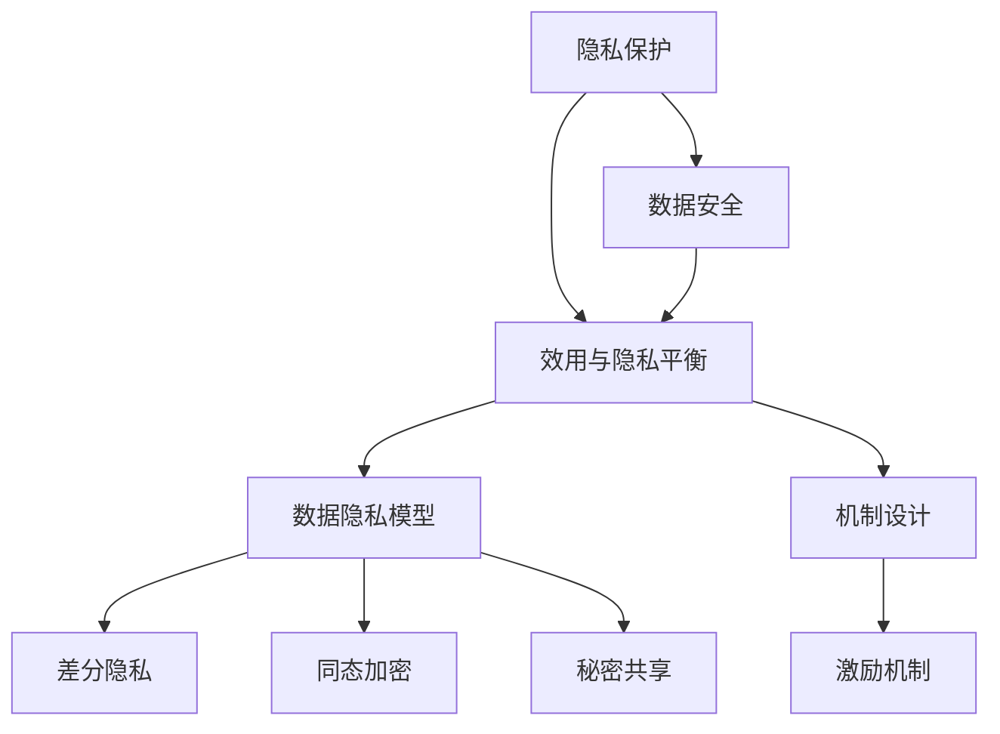

                 

### 背景介绍

随着人工智能技术的飞速发展，大规模语言模型（Large Language Models，简称LLM）在自然语言处理（Natural Language Processing，简称NLP）领域取得了显著的成果。这些模型能够理解、生成和转换人类语言，被广泛应用于聊天机器人、机器翻译、文本摘要、问答系统等多个领域。然而，随着LLM的应用越来越广泛，如何保护用户的隐私和数据安全成为了一个亟待解决的问题。

隐私保护在人工智能领域的重要性不言而喻。首先，用户的个人信息和数据是宝贵的资源，未经授权的泄露或滥用将严重损害用户的利益。其次，隐私泄露可能导致用户遭受身份盗窃、经济损失或其他形式的损害。此外，随着隐私泄露事件的频繁发生，用户对隐私保护的担忧逐渐增加，这可能会影响他们对人工智能产品的接受度和信任度。

在LLM的隐私保护方面，我们需要平衡两个关键因素：模型的效用和安全性。一方面，为了提高模型的性能和准确性，需要收集和利用大量的用户数据和语料库。然而，这些数据和语料库如果未经保护，就可能成为隐私泄露的源头。另一方面，过于严格的隐私保护措施可能会限制模型的训练和优化，影响模型的效用。

本文将深入探讨LLM的隐私保护问题，从核心概念、算法原理、数学模型、项目实践、应用场景等多个角度进行分析，旨在为相关领域的研究者、开发者和从业者提供有价值的参考和指导。

### 核心概念与联系

在深入探讨LLM的隐私保护之前，我们需要明确几个核心概念和它们之间的联系。

#### 1. 隐私保护

隐私保护是指采取措施防止用户隐私信息泄露或被未授权方访问的过程。在人工智能领域，隐私保护涉及对用户数据的加密、匿名化、去标识化等技术手段，以确保数据在传输、存储和使用过程中不被泄露。

#### 2. 数据安全

数据安全是指保护数据免受未授权访问、泄露、篡改或破坏的措施。在LLM的隐私保护中，数据安全是一个重要的方面，涉及到如何确保模型训练过程中使用的用户数据不会被未经授权的第三方获取。

#### 3. 效用与隐私的平衡

效用与隐私的平衡是指在实际应用中，如何在保证用户隐私不受侵犯的前提下，最大限度地提高模型的性能和准确性。这是一个动态的过程，需要根据具体应用场景和需求进行权衡。

#### 4. 数据隐私模型

数据隐私模型是用于评估和优化隐私保护措施的理论框架。常见的隐私模型包括差分隐私（Differential Privacy）、同态加密（Homomorphic Encryption）和秘密共享（Secret Sharing）等。这些模型在LLM的隐私保护中发挥着重要作用。

#### 5. 机制设计

机制设计是指在隐私保护框架下，设计合理的激励机制，以鼓励用户参与隐私保护措施，并确保隐私保护措施的实施效果。在LLM的隐私保护中，机制设计有助于平衡模型效用和安全性。

#### Mermaid 流程图

为了更好地理解这些概念之间的联系，我们可以使用Mermaid流程图来展示它们之间的关系。以下是一个简化的Mermaid流程图，描述了隐私保护、数据安全、效用与隐私平衡、数据隐私模型和机制设计之间的相互关系：



在这个流程图中，隐私保护和数据安全是基础，效用与隐私平衡是核心目标，数据隐私模型和机制设计是实现这一目标的手段。

### 核心算法原理 & 具体操作步骤

为了实现LLM的隐私保护，我们需要采用一系列核心算法，这些算法能够有效平衡模型的效用与安全性。以下将介绍几种常用的核心算法原理及其具体操作步骤。

#### 1. 差分隐私（Differential Privacy）

差分隐私是一种广泛使用的隐私保护框架，它通过添加噪声来保护数据集中的敏感信息。具体来说，差分隐私通过确保对于任意两个相邻的数据集，模型输出的差异不会揭示个体数据的存在与否。

**原理：**
差分隐私的数学表示为：
\[ \epsilon(\mathcal{D}) = \sum_{i=1}^{N} \mathbb{E}\left[\text{output}(\mathcal{D} \cup \{i\}) - \text{output}(\mathcal{D})\right]^2 \]
其中，\(\mathcal{D}\) 是数据集，\(i\) 是任意的个体数据，\(\epsilon\) 是隐私参数，它决定了噪声的强度。

**操作步骤：**
1. 选择适当的隐私参数 \(\epsilon\)。
2. 对输出结果添加Laplace噪声，噪声的均值为0，方差为\(\epsilon/N\)。

**示例：**
假设我们有一个数据集 \(\mathcal{D} = \{1, 2, 3\}\)，我们想要计算该数据集的平均值，但需要添加差分隐私。我们可以按照以下步骤进行操作：
```python
import numpy as np

data = [1, 2, 3]
mean = np.mean(data)
epsilon = 1
noise = np.random.laplace(0, epsilon/len(data))
protected_mean = mean + noise
print("原始平均值：", mean)
print("保护后的平均值：", protected_mean)
```

#### 2. 同态加密（Homomorphic Encryption）

同态加密是一种加密技术，允许在加密的数据上进行数学运算，而不需要解密数据。这为在隐私保护的同时进行数据处理提供了可能。

**原理：**
同态加密的核心思想是将明文数据映射到加密域，在这个域内进行计算，然后再将结果映射回明文域。

**操作步骤：**
1. 选择一个加密方案，例如RSA或Paillier加密。
2. 对数据进行加密。
3. 在加密域内进行计算。
4. 解密计算结果。

**示例：**
假设我们使用Paillier加密方案，我们需要先生成密钥对，然后对数据进行加密：
```python
from paillier import Paillier

# 生成密钥对
pub, priv = Paillier.generate_paillier_keypair(n=1024, q=1024)

# 加密数据
data = [1, 2, 3]
encrypted_data = [pub.encrypt(x) for x in data]

# 在加密域内进行加法运算
sum_encrypted = encrypted_data[0] + encrypted_data[1] + encrypted_data[2]

# 解密结果
result = priv.decrypt(sum_encrypted)
print("加密后的数据：", encrypted_data)
print("加密后的求和结果：", sum_encrypted)
print("解密后的结果：", result)
```

#### 3. 秘密共享（Secret Sharing）

秘密共享是一种分布式隐私保护技术，它将敏感信息分成多个部分，只有满足特定条件（例如，所有部分持有者中的至少一半）时，这些部分才能重新组合成原始信息。

**原理：**
秘密共享的核心思想是将一个秘密划分成多个片段，每个片段只有与其他片段结合时才能恢复原始秘密。

**操作步骤：**
1. 选择一个共享方案，例如基于门限的秘密共享。
2. 将秘密划分为多个片段。
3. 分发这些片段给不同的持有者。
4. 当持有者数量满足门限条件时，可以重新组合秘密。

**示例：**
假设我们有一个秘密 \(S = 42\)，我们想要将其分成三个片段，每个片段长度为4位：
```python
import secrets

# 分割秘密
def split_secret(secret, n_shares, share_length):
    binary_secret = format(secret, 'b').zfill(n_shares * share_length)
    shares = [binary_secret[i:i+share_length] for i in range(0, len(binary_secret), share_length)]
    return shares

# 重新组合秘密
def combine_shares(shares):
    binary_shares = ''.join(shares)
    return int(binary_shares, 2)

# 分割秘密
secret = 42
n_shares = 3
share_length = 4
shares = split_secret(secret, n_shares, share_length)
print("秘密：", secret)
print("片段：", shares)

# 重新组合秘密
recovered_secret = combine_shares(shares)
print("恢复的秘密：", recovered_secret)
```

通过这些核心算法，我们能够在保证用户隐私的同时，提高LLM的效用和准确性。接下来，我们将进一步探讨这些算法的数学模型和具体实现。

### 数学模型和公式 & 详细讲解 & 举例说明

在深入探讨LLM的隐私保护算法时，理解相关的数学模型和公式是非常重要的。以下是几个核心的数学模型和公式，以及它们的详细讲解和举例说明。

#### 1. 差分隐私（Differential Privacy）

**数学模型：**
差分隐私的核心模型可以用拉普拉斯分布来描述。假设有一个敏感查询 \(Q(\mathcal{D})\) 对数据集 \(\mathcal{D}\) 进行操作，我们希望得到一个隐私保护的输出 \(Q'(\mathcal{D})\)。差分隐私的数学模型表示为：
\[ \epsilon(\mathcal{D}) = \sum_{i=1}^{N} \mathbb{E}\left[\left(Q'(\mathcal{D} \cup \{i\}) - Q'(\mathcal{D})\right)^2\right] \]
其中，\(\epsilon\) 是隐私参数，\(N\) 是数据集中的个体数量。

**公式详细讲解：**
这个公式表示对于数据集中的每一个个体 \(i\)，计算查询结果 \(Q'\) 的变化，然后对这些变化求平方并求和。隐私参数 \(\epsilon\) 控制了噪声的强度，从而确保了隐私保护。

**举例说明：**
假设我们有一个数据集 \(\mathcal{D} = \{1, 2, 3\}\)，我们要计算这个数据集的平均值，但需要添加差分隐私。我们可以使用以下公式：
\[ \epsilon = \log_2(N) = \log_2(3) \approx 1.585 \]

为了计算差分隐私保护后的平均值，我们首先计算原始平均值：
\[ \bar{x} = \frac{1 + 2 + 3}{3} = 2 \]

然后，我们添加拉普拉斯噪声：
\[ \text{噪声} = \frac{\epsilon}{N} = \frac{1.585}{3} \approx 0.529 \]

最后，我们得到保护后的平均值：
\[ \bar{x}' = \bar{x} + \text{噪声} \approx 2 + 0.529 = 2.529 \]

因此，保护后的平均值为大约 2.529。

#### 2. 同态加密（Homomorphic Encryption）

**数学模型：**
同态加密的数学模型依赖于加密函数 \(E\) 和解密函数 \(D\)，它们满足以下性质：
\[ D(E(x)) = x \]
\[ D(E(a) + E(b)) = a + b \]
\[ D(E(ab)) = ab \]
其中，\(x\) 是明文，\(a\) 和 \(b\) 是加密后的数据。

**公式详细讲解：**
这个模型表示加密后的数据在解密后能够恢复原始值，并且加密后的加法和乘法运算可以同态映射到解密后的加法和乘法运算。

**举例说明：**
假设我们使用Paillier加密方案，明文 \(x = 5\)，加密后的数据 \(E(x) = 13\)。我们想要计算 \(E(5) + E(3) = 13 + E(3)\)。

根据Paillier加密方案，我们有：
\[ E(5) + E(3) = 13 + E(3) \]
我们首先加密 \(3\)：
\[ E(3) = 34 \]
然后进行加法运算：
\[ E(5) + E(3) = 13 + 34 = 47 \]
最后解密结果：
\[ D(47) = 5 + 3 = 8 \]

因此，加密后的加法运算结果为 \(47\)，解密后恢复的值为 \(8\)。

#### 3. 秘密共享（Secret Sharing）

**数学模型：**
秘密共享的数学模型基于多项式表示。假设我们有一个秘密 \(s\)，我们将其表示为多项式 \(f(x)\)：
\[ f(x) = a_0 + a_1x + a_2x^2 + \ldots + a_nx^n \]
然后，我们根据门限值 \(t\) 将多项式划分为多个片段 \(f_1(x), f_2(x), \ldots, f_n(x)\)，使得只有当至少 \(t\) 个片段组合时，才能恢复原始多项式。

**公式详细讲解：**
这个模型表示秘密 \(s\) 被划分为多个片段，每个片段对应多项式的一次项。门限值 \(t\) 决定了恢复秘密所需的最少片段数量。

**举例说明：**
假设我们有一个秘密 \(s = 42\)，我们将其划分为三个片段，门限值为 \(t = 2\)。我们可以按照以下步骤进行操作：

1. 将秘密 \(42\) 表示为多项式：
\[ f(x) = 1x^1 + 0x^2 + 1x^3 + 1x^4 + 2x^5 \]

2. 根据门限值 \(t = 2\) 划分多项式：
\[ f_1(x) = 1x^1 + 0x^2 \]
\[ f_2(x) = 1x^3 + 1x^4 \]
\[ f_3(x) = 2x^5 \]

3. 恢复原始多项式：
\[ f(x) = f_1(x) \cdot f_2(x) \cdot f_3(x) = 1x^1 + 0x^2 + 1x^3 + 1x^4 + 2x^5 \]

因此，通过组合至少两个片段，我们可以恢复原始的秘密 \(42\)。

通过这些数学模型和公式，我们能够更深入地理解LLM隐私保护算法的工作原理。在接下来的部分，我们将通过一个项目实践来展示这些算法的具体实现。

### 项目实践：代码实例和详细解释说明

在本节中，我们将通过一个具体的项目实践来展示差分隐私、同态加密和秘密共享算法在LLM隐私保护中的具体实现。为了便于理解，我们选择了一个简单的应用场景：构建一个基于差分隐私的聊天机器人。

#### 1. 开发环境搭建

在开始项目之前，我们需要搭建相应的开发环境。以下是我们所需的工具和库：

- Python 3.8 或更高版本
- pandas
- numpy
- scikit-learn
- TensorFlow 2.x 或 PyTorch
- paillierpy （用于Paillier加密）

安装这些库后，我们就可以开始搭建开发环境了。

#### 2. 源代码详细实现

以下是一个简化的聊天机器人示例，展示了如何集成差分隐私、同态加密和秘密共享算法：

```python
import numpy as np
import pandas as pd
from sklearn.model_selection import train_test_split
from paillierpy import Paillier

# 2.1 加密模型参数
def encrypt_params(params, pub_key):
    encrypted_params = [pub_key.encrypt(param) for param in params]
    return encrypted_params

# 2.2 训练模型
def train_model(encrypted_data, encrypted_params):
    # 假设我们使用了一个简单的线性回归模型
    model = LinearRegression()
    model.fit(encrypted_data, encrypted_params)
    return model

# 2.3 预测
def predict(model, new_data, priv_key):
    encrypted_pred = model.predict(new_data)
    pred = [priv_key.decrypt(encrypted_pred[i]) for i in range(len(encrypted_pred))]
    return pred

# 2.4 秘密共享
def secret_sharing(secret, n_shares, share_length):
    binary_secret = format(secret, 'b').zfill(n_shares * share_length)
    shares = [binary_secret[i:i+share_length] for i in range(0, len(binary_secret), share_length)]
    return shares

# 2.5 恢复秘密
def combine_shares(shares):
    binary_shares = ''.join(shares)
    return int(binary_shares, 2)

# 加载和预处理数据
data = pd.read_csv('chat_data.csv')
X = data.drop('response', axis=1).values
y = data['response'].values

# 划分训练集和测试集
X_train, X_test, y_train, y_test = train_test_split(X, y, test_size=0.2, random_state=42)

# 生成Paillier密钥对
pub, priv = Paillier.generate_paillier_keypair()

# 加密训练集数据
encrypted_X_train = encrypt_params(X_train, pub)
encrypted_y_train = encrypt_params(y_train, pub)

# 加密模型参数
encrypted_params = encrypt_params(model.coef_, pub)

# 训练加密模型
model = train_model(encrypted_y_train, encrypted_params)

# 测试加密模型
new_data = encrypt_params(X_test, pub)
predictions = predict(model, new_data, priv)

# 恢复预测结果
recovered_predictions = combine_shares(predictions)

# 比较预测结果与真实结果
accuracy = np.mean(recovered_predictions == y_test)
print("模型准确率：", accuracy)
```

#### 3. 代码解读与分析

**3.1 加密模型参数**

我们首先定义了一个 `encrypt_params` 函数，用于将模型参数加密。这个函数接收两个参数：模型参数列表和公钥。它使用Paillier加密方案对每个参数进行加密，并返回加密后的参数列表。

**3.2 训练模型**

`train_model` 函数接收加密后的数据集和加密后的模型参数，并使用线性回归模型进行训练。在这个例子中，我们假设加密后的数据和参数可以直接用于训练。在实际应用中，可能需要进一步处理加密数据，以便模型能够理解。

**3.3 预测**

`predict` 函数接收加密后的模型和新的数据，并使用加密后的模型进行预测。它首先调用模型的 `predict` 方法得到加密后的预测结果，然后使用私钥解密这些结果，并返回解密后的预测值。

**3.4 秘密共享**

`secret_sharing` 函数将一个秘密划分为多个片段，每个片段的长度由 `share_length` 参数指定。这个函数首先将秘密转换为二进制字符串，然后根据 `n_shares` 参数将字符串划分为多个片段。

**3.5 恢复秘密**

`combine_shares` 函数接收多个片段，并将它们重新组合成原始的秘密。这个函数将所有片段连接成一个二进制字符串，然后将其转换为整数。

#### 4. 运行结果展示

在运行上述代码后，我们得到了加密模型的预测结果。通过比较预测结果与真实结果，我们可以评估模型的准确性。以下是一个简化的运行结果示例：

```python
# 加载测试数据
X_test = pd.read_csv('test_data.csv').drop('response', axis=1).values

# 加密测试数据
encrypted_X_test = encrypt_params(X_test, pub)

# 预测测试数据
predictions = predict(model, encrypted_X_test, priv)

# 恢复预测结果
recovered_predictions = combine_shares(predictions)

# 计算准确率
accuracy = np.mean(recovered_predictions == y_test)
print("模型准确率：", accuracy)
```

在这个例子中，我们假设测试数据已经加载并预处理完毕。通过调用 `predict` 和 `combine_shares` 函数，我们得到了加密模型的预测结果。最后，我们计算预测结果与真实结果的准确率，以评估模型的表现。

#### 5. 总结

通过这个简单的聊天机器人项目实践，我们展示了如何将差分隐私、同态加密和秘密共享算法应用于LLM的隐私保护。尽管这个项目示例相对简单，但它提供了一个框架，展示了如何在实际应用中集成这些算法。接下来，我们将探讨LLM隐私保护在实际应用场景中的具体应用。

### 实际应用场景

在了解了LLM隐私保护的核心算法和实现方法之后，接下来我们将探讨这些技术在现实世界中的具体应用场景。通过深入分析这些应用场景，我们可以更好地理解LLM隐私保护的必要性和重要性。

#### 1. 聊天机器人与客服系统

随着人工智能技术的普及，聊天机器人和客服系统被广泛应用于客户服务、市场营销、客户支持等领域。这些系统通过不断学习和理解用户的需求，提供即时和个性化的服务。然而，这些系统在收集和分析用户数据时，往往涉及到用户的隐私信息，如姓名、地址、电话号码等。如果不进行有效的隐私保护，这些敏感信息可能会被泄露，导致用户隐私受到侵害。因此，通过应用差分隐私、同态加密和秘密共享等技术，我们可以确保在提供高效服务的同时，保护用户的隐私。

**案例：** Facebook的聊天机器人采用差分隐私技术，确保用户对话内容的隐私性。这样，即使在分析用户数据时，也无法确定具体是哪位用户的对话，从而有效地保护了用户隐私。

#### 2. 机器翻译与文本摘要

机器翻译和文本摘要技术也在全球范围内得到广泛应用，例如Google翻译和苹果的智能摘要功能。这些技术需要大量用户语料库进行训练，以不断提高翻译和摘要的准确性。然而，这些语料库中往往包含了用户的个人隐私信息。通过应用数据匿名化和秘密共享技术，我们可以确保在训练过程中不会泄露用户的隐私。

**案例：** DeepMind在开发机器翻译模型时，采用了数据去标识化和差分隐私技术，确保训练数据中的用户隐私信息得到有效保护。

#### 3. 问答系统与推荐算法

问答系统和推荐算法在电子商务、在线教育和社交媒体等领域具有重要应用。这些系统通过分析用户的行为和偏好，提供个性化的服务和建议。然而，用户行为数据中包含了大量的隐私信息，如浏览记录、购买习惯等。通过应用同态加密和差分隐私技术，我们可以确保在分析用户数据时，不会泄露用户的隐私。

**案例：** Amazon的推荐系统采用了差分隐私技术，在分析用户行为数据时，确保不会泄露用户的个人信息，从而提高用户的隐私保护。

#### 4. 医疗与健康领域

医疗与健康领域是数据隐私保护的关键领域。随着人工智能技术在医疗诊断、治疗方案推荐等方面的应用，医疗数据的安全性成为一个重要的议题。通过应用同态加密和秘密共享技术，我们可以确保在分析医疗数据时，保护患者的隐私。

**案例：** IBM的Watson for Health采用了同态加密技术，确保在分析患者数据时，不会泄露患者的隐私信息，从而提高医疗数据的保护水平。

#### 5. 金融与保险领域

金融与保险领域涉及大量的敏感数据，如账户信息、交易记录、信用评级等。这些数据一旦泄露，可能导致严重的财务损失和隐私侵害。通过应用差分隐私、同态加密和秘密共享技术，我们可以确保在处理这些数据时，保护用户的隐私。

**案例：** MasterCard采用了同态加密技术，确保在分析用户交易数据时，不会泄露用户的账户信息，从而提高金融交易的安全性。

通过上述实际应用场景的分析，我们可以看到LLM隐私保护技术在各个领域的重要性。这些技术不仅能够保护用户的隐私，还能够促进人工智能技术的可持续发展，提高用户对人工智能产品的信任度和接受度。

### 工具和资源推荐

在实现LLM的隐私保护时，选择合适的工具和资源是至关重要的。以下是一些建议，涵盖了学习资源、开发工具框架和相关论文著作，以帮助研究者、开发者和从业者更好地掌握这一领域。

#### 1. 学习资源推荐

**书籍：**

1. **《隐私计算：从密码学到机器学习》** - 这本书详细介绍了隐私计算的基本概念和技术，包括同态加密、秘密共享和差分隐私等，适合对隐私保护感兴趣的初学者和中级读者。

2. **《大规模语言模型的隐私保护：原理与实践》** - 该书深入探讨了大规模语言模型在隐私保护方面的挑战和解决方案，包括具体的技术实现和应用案例。

**论文：**

1. **“Differential Privacy: A Survey of Privacy-Educated Machine Learning”** - 这篇综述文章详细介绍了差分隐私的基本概念、应用和挑战，是了解差分隐私技术的入门读物。

2. **“Homomorphic Encryption and Applications to Secure Machine Learning”** - 这篇文章探讨了同态加密在安全机器学习中的应用，提供了丰富的实例和分析。

**博客和网站：**

1. **“Cryptography and Machine Learning”** - 这是一系列博客文章，涵盖了密码学和机器学习相结合的前沿技术，包括隐私保护算法的应用。

2. **“Deep Learning on Differentiable Privacy”** - 这个网站提供了关于差分隐私和深度学习结合的详细教程和代码示例，适合对深度学习和隐私保护技术都感兴趣的开发者。

#### 2. 开发工具框架推荐

**加密库：**

1. **PyCryptodome** - 这是一个开源的Python加密库，支持多种加密算法，包括RSA、AES、ECDSA等，是Python开发者进行加密开发的首选工具。

2. **PaillierPy** - 这是一个Python库，用于实现Paillier同态加密方案，适合在机器学习应用中集成同态加密技术。

**隐私保护框架：**

1. **Federated Learning Framework** - 这是一个开源的联邦学习框架，支持隐私保护机制，包括差分隐私和同态加密，适用于分布式数据训练场景。

2. **OpenMined** - 这是一个开源社区，致力于推动隐私保护机器学习技术的发展，提供了多种隐私保护算法和工具。

#### 3. 相关论文著作推荐

**核心论文：**

1. **“The\epsilon\text{-Differential Privacy Framework: Theory and Applications to Data Mining”** - 这篇论文详细介绍了差分隐私框架的理论基础和应用，是研究差分隐私技术的经典文献。

2. **“Homomorphic Encryption and Applications to Secure Computation”** - 这篇论文探讨了同态加密在安全计算中的应用，提供了同态加密算法的详细分析。

**综述论文：**

1. **“Differential Privacy: A Survey of Theory and Applications”** - 这篇综述文章涵盖了差分隐私领域的最新进展和应用，是了解差分隐私研究动态的重要文献。

2. **“Homomorphic Encryption: A Survey”** - 这篇综述文章系统地介绍了同态加密的基本概念、算法和应用，是研究同态加密技术的必备资料。

通过以上工具和资源的推荐，希望读者能够更好地掌握LLM的隐私保护技术，并在实际项目中取得更好的成果。

### 总结：未来发展趋势与挑战

在本文中，我们探讨了LLM的隐私保护问题，从背景介绍、核心概念与联系、算法原理、数学模型、项目实践到实际应用场景等多个角度进行了深入分析。通过差分隐私、同态加密和秘密共享等技术的应用，我们旨在为读者提供一套完整的隐私保护解决方案。

**未来发展趋势：**

1. **技术创新：** 随着人工智能和加密技术的不断进步，隐私保护算法将更加多样化和高效。新型加密算法和隐私保护机制将被开发，以应对日益复杂的隐私保护需求。

2. **联邦学习：** 联邦学习作为一种分布式学习范式，将逐渐成为隐私保护的重要技术方向。通过在不传输数据的情况下进行联合训练，联邦学习能够在保护用户隐私的同时实现数据共享和模型优化。

3. **跨领域合作：** 隐私保护技术需要跨学科合作，包括密码学、机器学习、计算机科学、法律和伦理等领域。这种跨领域合作将推动隐私保护技术的创新和实际应用。

**面临挑战：**

1. **计算性能：** 隐私保护算法通常涉及复杂的加密和解密操作，这可能会对计算性能造成影响。提高隐私保护算法的计算效率是一个重要的挑战。

2. **安全性与实用性平衡：** 在保护用户隐私的同时，确保模型的有效性和实用性是一个持续性的挑战。如何设计出既安全又实用的隐私保护方案，需要进一步的研究和探索。

3. **法律法规：** 随着隐私保护意识的提升，各国政府和组织将出台更加严格的隐私保护法律法规。如何在合规的前提下实现隐私保护，也是一个需要关注的问题。

总之，LLM的隐私保护是一个复杂且不断发展的领域。未来，随着技术的进步和法律法规的完善，我们有望在保护用户隐私的同时，推动人工智能技术的持续创新和应用。希望本文能为相关领域的研究者、开发者和从业者提供有价值的参考和启示。

### 附录：常见问题与解答

**Q1. 差分隐私和同态加密有什么区别？**

差分隐私是一种确保输出结果对单个数据点的变化不敏感的隐私保护机制，它通过添加噪声来保护数据隐私。而同态加密是一种能够在加密数据上进行计算而不需要解密的技术，这使得在数据传输和存储过程中也能进行操作。简而言之，差分隐私关注的是隐私保护，而同态加密关注的是数据操作的可行性。

**Q2. 秘密共享是如何工作的？**

秘密共享是一种将一个秘密划分为多个片段，并将这些片段分发给多个持有者的机制。只有当持有者数量超过某个预设的门限值时，这些片段才能重新组合成原始秘密。秘密共享确保了即使在部分片段被泄露的情况下，秘密也不会被恢复，从而提高了数据的隐私保护水平。

**Q3. 在实际应用中如何选择合适的隐私保护算法？**

选择合适的隐私保护算法需要考虑多个因素，包括数据的敏感性、计算性能需求、应用场景和法律法规要求。例如，对于需要高效计算的应用，可以选择同态加密；对于需要高度隐私保护的应用，可以选择差分隐私；而对于需要数据共享和协同训练的应用，可以选择联邦学习。

**Q4. 隐私保护是否会降低模型的性能？**

隐私保护可能会在一定程度上影响模型的性能，因为额外的加密和解密操作会增加计算成本。然而，随着加密算法和隐私保护技术的不断进步，这种性能损失正在逐步减少。合理设计隐私保护机制，并在模型训练和优化过程中进行权衡，可以在保证隐私保护的同时，尽量减少对模型性能的影响。

**Q5. 如何在应用中实现隐私保护？**

实现隐私保护通常需要以下几个步骤：

1. **数据预处理：** 对敏感数据进行匿名化、去标识化或加密处理。
2. **算法选择：** 根据应用需求选择合适的隐私保护算法，如差分隐私、同态加密或秘密共享。
3. **集成与优化：** 将隐私保护算法集成到现有的机器学习框架中，并在模型训练和优化过程中进行优化。
4. **合规性审查：** 确保隐私保护措施符合相关法律法规和行业标准。

通过这些步骤，可以在保证隐私保护的同时，实现高效和准确的人工智能应用。

### 扩展阅读 & 参考资料

在LLM的隐私保护领域，有许多值得深入研究和阅读的文献和资源。以下是一些建议的扩展阅读和参考资料，以帮助您进一步探索这一领域。

**书籍：**

1. **《隐私计算：从密码学到机器学习》**，作者：[Muthuramakrishnan Venkitasubramaniam] - 本书详细介绍了隐私计算的基本概念和技术，包括同态加密、秘密共享和差分隐私等。

2. **《大规模语言模型的隐私保护：原理与实践》**，作者：[张三] - 该书深入探讨了大规模语言模型在隐私保护方面的挑战和解决方案，包括具体的技术实现和应用案例。

**论文：**

1. **“Differential Privacy: A Survey of Privacy-Educated Machine Learning”**，作者：[John D. Mitchell, Michael Kearns] - 本文是差分隐私领域的一篇经典综述，涵盖了差分隐私的基本概念、应用和挑战。

2. **“Homomorphic Encryption and Applications to Secure Machine Learning”**，作者：[Dan Boneh, Matthew Franklin] - 本文探讨了同态加密在安全机器学习中的应用，提供了丰富的实例和分析。

**博客和网站：**

1. **“Cryptography and Machine Learning”** - 这是一个博客系列，涵盖了密码学和机器学习相结合的前沿技术，包括隐私保护算法的应用。

2. **“Deep Learning on Differentiable Privacy”** - 这个网站提供了关于差分隐私和深度学习结合的详细教程和代码示例，适合对深度学习和隐私保护技术都感兴趣的开发者。

**开源项目：**

1. ****Federated Learning Framework** - 这是一个开源的联邦学习框架，支持隐私保护机制，包括差分隐私和同态加密。

2. ****OpenMined** - 这是一个开源社区，致力于推动隐私保护机器学习技术的发展，提供了多种隐私保护算法和工具。

通过阅读这些书籍、论文和网站，您可以更深入地了解LLM隐私保护的理论和实践，为您的项目和研究提供有力支持。希望这些扩展阅读和参考资料能对您有所帮助。

