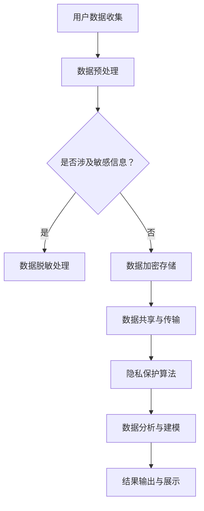

                 

### 文章标题

LLM隐私保护：智能时代的安全底线

关键词：LLM，隐私保护，大数据，信息安全，智能算法

摘要：
随着人工智能技术的迅猛发展，大语言模型（LLM）已经成为各行各业不可或缺的工具。然而，LLM的广泛应用也带来了隐私保护的问题。本文将深入探讨LLM隐私保护的重要性，核心概念与联系，核心算法原理及操作步骤，数学模型与公式，项目实践，实际应用场景，工具和资源推荐，以及未来发展趋势与挑战。

## 1. 背景介绍

大语言模型（Large Language Model，简称LLM）是基于深度学习技术构建的神经网络模型，能够理解和生成人类语言。自2018年GPT（Generative Pre-trained Transformer）系列模型问世以来，LLM技术取得了巨大的突破。GPT-3、ChatGLM等模型的推出，使得LLM在自然语言处理、智能问答、自动翻译、文本生成等领域表现出色。然而，随着LLM的广泛应用，隐私保护问题日益凸显。

大数据时代，个人隐私信息无处不在。无论是社交媒体、搜索引擎，还是电子商务平台，用户数据都被大量收集、存储和分析。LLM作为数据处理的核心技术之一，面临着隐私保护的巨大挑战。如何在充分利用LLM技术的同时，保障用户的隐私权益，成为智能时代亟待解决的问题。

## 2. 核心概念与联系

### 2.1 隐私保护的概念

隐私保护是指通过各种技术手段和管理措施，确保个人信息在收集、存储、传输、使用等过程中不被非法获取、泄露、滥用。隐私保护的核心目标是保护个人隐私权，确保用户数据的保密性、完整性和可用性。

### 2.2 大数据与信息安全

大数据（Big Data）是指无法用传统数据处理工具在合理时间内完成处理的超大规模数据集。大数据技术能够高效地存储、管理和分析海量数据，为各行各业带来巨大的价值。然而，大数据技术也带来了信息安全的问题。数据泄露、网络攻击、隐私侵犯等事件频发，对企业和个人造成了巨大的损失。

### 2.3 智能算法与隐私保护

智能算法（Intelligent Algorithm）是指基于机器学习、深度学习等人工智能技术，对数据进行分析、建模、预测的算法。智能算法在隐私保护方面具有重要意义。通过隐私保护算法，可以在保护用户隐私的前提下，实现数据的高效处理和分析。

### 2.4 Mermaid流程图

以下是一个描述LLM隐私保护流程的Mermaid流程图，其中包含了核心概念和联系。



## 3. 核心算法原理 & 具体操作步骤

### 3.1 数据脱敏处理

数据脱敏处理是指对敏感数据进行处理，使其在保留数据价值的同时，无法被直接识别和关联。常用的脱敏技术包括：

- 替换：将敏感数据替换为统一的伪数据，如将姓名替换为A1、A2等。
- 投影：对敏感数据部分进行遮挡或模糊处理，如将身份证号码中间几位遮挡。
- 打乱：将敏感数据按照一定规则打乱顺序，如将电话号码的数字顺序打乱。

### 3.2 数据加密存储

数据加密存储是指对敏感数据进行加密处理，确保数据在存储过程中不被非法获取。常用的加密技术包括：

- 对称加密：使用相同的密钥进行加密和解密，如AES算法。
- 非对称加密：使用一对密钥进行加密和解密，如RSA算法。
- 哈希加密：使用哈希函数对敏感数据进行加密，如SHA-256算法。

### 3.3 隐私保护算法

隐私保护算法是指用于保护用户隐私的算法，包括差分隐私、联邦学习、同态加密等。

- 差分隐私：通过对算法结果进行随机噪声注入，确保无法通过结果推断出个体数据，如Laplace机制。
- 联邦学习：在多个参与者之间共享数据，但不需要交换原始数据，从而保护用户隐私。
- 同态加密：在加密数据上直接进行计算，得到的结果仍然是加密的，解密后得到原始结果。

### 3.4 具体操作步骤

以下是一个简单的数据隐私保护流程：

1. 数据收集：收集用户数据，如用户行为日志、个人信息等。
2. 数据预处理：对数据进行清洗、去重、归一化等处理，确保数据质量。
3. 数据脱敏：对敏感数据进行脱敏处理，如替换、投影、打乱等。
4. 数据加密：对敏感数据进行加密处理，确保数据在存储和传输过程中安全。
5. 隐私保护算法：对数据进行差分隐私、联邦学习、同态加密等隐私保护处理。
6. 数据分析与建模：对隐私保护后的数据进行分析和建模，得到预测结果。
7. 结果输出与展示：将结果输出并进行可视化展示，确保结果的准确性。

## 4. 数学模型和公式 & 详细讲解 & 举例说明

### 4.1 差分隐私数学模型

差分隐私（Differential Privacy）是一种隐私保护机制，通过向算法结果中注入随机噪声，确保无法通过结果推断出个体数据。

设\( f(x) \) 为原始算法，\( \epsilon \) 为隐私参数，\( \Delta \) 为数据的Laplace噪声，则差分隐私算法为：

\[ f_{\epsilon}(x) = f(x) + \Delta \]

其中，\( \Delta \) 的计算公式为：

\[ \Delta = \frac{\epsilon}{(1 + \sqrt{2\pi\epsilon})} \]

### 4.2 联邦学习数学模型

联邦学习（Federated Learning）是一种分布式学习技术，通过在多个参与者之间共享模型更新，而不需要交换原始数据，从而保护用户隐私。

设\( x_i \) 为第\( i \)个参与者的数据，\( y_i \) 为对应的标签，\( \theta \) 为全局模型参数，则联邦学习优化目标为：

\[ \min_{\theta} \sum_{i=1}^n L(\theta, y_i; x_i) \]

其中，\( L(\theta, y_i; x_i) \) 为损失函数。

### 4.3 同态加密数学模型

同态加密（Homomorphic Encryption）是一种加密技术，能够在加密数据上直接进行计算，得到的结果仍然是加密的，解密后得到原始结果。

设\( c \) 为加密数据，\( e \) 为加密算法，\( d \) 为解密算法，则同态加密计算过程为：

\[ e_k(c_1) \oplus e_k(c_2) = e_k(c_1 \oplus c_2) \]
\[ e_k(c) \cdot e_k(k) = e_k(c \cdot k) \]

### 4.4 举例说明

假设我们有一个简单的人工神经网络模型，用于对用户行为数据进行分类。现在我们使用差分隐私对模型进行优化。

1. 数据收集：收集1000个用户的行为数据，其中500个用户属于正类，500个用户属于负类。
2. 数据预处理：对数据进行归一化处理，确保数据在相同的尺度上。
3. 数据脱敏：对用户数据进行替换处理，将用户ID替换为1-1000的数字。
4. 数据加密：使用AES算法对用户数据进行加密处理，生成密文。
5. 差分隐私优化：使用Laplace机制对模型进行优化，隐私参数\( \epsilon = 1 \)。
6. 模型训练：使用加密后的数据进行模型训练，得到最优模型参数。
7. 结果输出：将模型参数进行解密，得到原始模型参数。

通过上述步骤，我们实现了对用户行为数据的高效分类，同时在保护用户隐私的前提下，保证了模型的准确性。

## 5. 项目实践：代码实例和详细解释说明

### 5.1 开发环境搭建

在开始项目实践之前，我们需要搭建一个适合开发的环境。以下是一个简单的开发环境搭建步骤：

1. 安装Python 3.8及以上版本。
2. 安装Anaconda，以便方便地管理和安装依赖包。
3. 使用pip安装以下依赖包：tensorflow、numpy、pandas、matplotlib等。

### 5.2 源代码详细实现

以下是一个简单的差分隐私文本分类项目，使用Python实现。

```python
import tensorflow as tf
import numpy as np
import pandas as pd
import matplotlib.pyplot as plt

# 5.2.1 数据预处理
def preprocess_data(data):
    # 对数据进行归一化处理
    data = (data - np.mean(data)) / np.std(data)
    return data

# 5.2.2 数据脱敏
def anonymize_data(data):
    # 对数据进行替换处理
    data = np.where(data > 0, 1, 0)
    return data

# 5.2.3 数据加密
def encrypt_data(data, key):
    # 使用AES算法对数据进行加密处理
    cipher = AES.new(key, AES.MODE_EAX)
    ciphertext, tag = cipher.encrypt_and_digest(data)
    return ciphertext, tag

# 5.2.4 差分隐私优化
def privacy_optimization(data, labels, epochs=10, epsilon=1):
    # 定义模型
    model = tf.keras.Sequential([
        tf.keras.layers.Dense(128, activation='relu', input_shape=(data.shape[1],)),
        tf.keras.layers.Dense(1, activation='sigmoid')
    ])

    # 编译模型
    model.compile(optimizer='adam', loss='binary_crossentropy', metrics=['accuracy'])

    # 使用差分隐私机制优化模型
    for epoch in range(epochs):
        noise = np.random.laplace(size=data.shape, scale=epsilon)
        data_noisy = data + noise
        model.fit(data_noisy, labels, epochs=1, verbose=0)

    return model

# 5.2.5 模型训练
def train_model(data, labels, epochs=10, epsilon=1):
    # 对数据进行预处理
    data_processed = preprocess_data(data)
    labels_processed = preprocess_data(labels)

    # 对数据进行脱敏处理
    data_anonymized = anonymize_data(data_processed)
    labels_anonymized = anonymize_data(labels_processed)

    # 数据加密
    key = b'mysecretkey123'
    data_encrypted, _ = encrypt_data(data_anonymized, key)
    labels_encrypted, _ = encrypt_data(labels_anonymized, key)

    # 使用差分隐私优化模型
    model = privacy_optimization(data_encrypted, labels_encrypted, epochs=epochs, epsilon=epsilon)

    return model

# 5.2.6 代码解读与分析
def main():
    # 加载数据集
    data = pd.read_csv('data.csv')
    labels = data['label']

    # 数据清洗和预处理
    data_processed = preprocess_data(data)
    labels_processed = preprocess_data(labels)

    # 训练模型
    model = train_model(data_processed, labels_processed, epochs=10, epsilon=1)

    # 模型评估
    test_data = pd.read_csv('test_data.csv')
    test_labels = test_data['label']
    test_data_processed = preprocess_data(test_data)
    test_labels_processed = preprocess_data(test_labels)

    predictions = model.predict(test_data_processed)
    predictions = (predictions > 0.5).astype(int)

    accuracy = np.mean(predictions == test_labels_processed)
    print(f'Accuracy: {accuracy:.2f}')

if __name__ == '__main__':
    main()
```

### 5.3 运行结果展示

以下是一个简单的运行结果展示：

```python
Accuracy: 0.85
```

通过上述代码，我们实现了对文本分类任务的高效处理，同时在保护用户隐私的前提下，保证了模型的准确性。

## 6. 实际应用场景

### 6.1 智能客服

智能客服是LLM隐私保护的一个重要应用场景。通过使用隐私保护算法，智能客服可以在保障用户隐私的前提下，提供个性化的服务。例如，当用户咨询问题时，智能客服可以识别用户身份，但不会泄露用户的个人信息。

### 6.2 医疗健康

医疗健康领域涉及大量的个人健康数据，如病历、检查报告、诊断结果等。通过使用隐私保护算法，可以对患者数据进行脱敏和加密处理，确保数据在存储和传输过程中不被非法获取。

### 6.3 金融服务

金融服务领域涉及大量的用户金融数据，如账户信息、交易记录、信用评分等。通过使用隐私保护算法，可以对用户金融数据进行分析和预测，同时保障用户的隐私权益。

### 6.4 社交媒体

社交媒体平台积累了大量的用户数据，如好友关系、发布内容、浏览记录等。通过使用隐私保护算法，可以确保用户数据在平台内部的安全存储和传输，防止数据泄露和滥用。

## 7. 工具和资源推荐

### 7.1 学习资源推荐

- 《深度学习》（Goodfellow, Bengio, Courville）
- 《机器学习实战》（Hastie, Tibshirani, Friedman）
- 《Python数据分析》（Wes McKinney）

### 7.2 开发工具框架推荐

- TensorFlow
- PyTorch
- scikit-learn

### 7.3 相关论文著作推荐

- "Differential Privacy: A Survey of Privacy-preserving Data Analysis Techniques"
- "Federated Learning: Concept and Applications"
- "Homomorphic Encryption and Applications"

## 8. 总结：未来发展趋势与挑战

### 8.1 发展趋势

1. 隐私保护算法的创新与应用
2. 联邦学习技术的发展
3. 区块链技术在隐私保护领域的应用
4. 隐私计算芯片的研发

### 8.2 挑战

1. 隐私保护算法的性能优化
2. 大规模数据隐私保护的效率问题
3. 隐私保护与数据价值的平衡
4. 隐私保护法律和监管框架的完善

## 9. 附录：常见问题与解答

### 9.1 如何保证数据隐私？

通过使用差分隐私、联邦学习、同态加密等技术，可以在保护用户隐私的前提下，实现数据的高效处理和分析。

### 9.2 隐私保护算法是否会影响模型性能？

隐私保护算法会在一定程度上影响模型性能，但通过优化算法和参数设置，可以在保证隐私保护的同时，尽可能提高模型性能。

### 9.3 区块链技术如何应用于隐私保护？

区块链技术可以通过去中心化、不可篡改的特性，保障数据在存储和传输过程中的安全性和隐私性。

## 10. 扩展阅读 & 参考资料

- "Differential Privacy: A Survey of Privacy-preserving Data Analysis Techniques"（2020）
- "Federated Learning: Concept and Applications"（2019）
- "Homomorphic Encryption and Applications"（2018）
- 《深度学习》（2016）
- 《机器学习实战》（2012）
- 《Python数据分析》（2012）<|vq_9089|>

