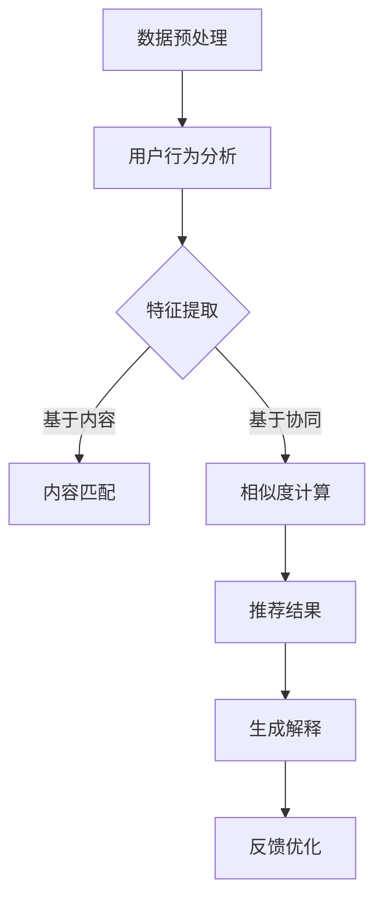

                 

# LLM驱动的推荐系统个性化解释生成

## 摘要

本文将探讨LLM（大型语言模型）如何驱动推荐系统的个性化解释生成。通过深入解析推荐系统的背景、核心概念、算法原理、数学模型，以及项目实践，本文旨在帮助读者理解如何利用LLM实现个性化解释，提高推荐系统的透明度和用户满意度。

关键词：LLM，推荐系统，个性化解释，算法原理，数学模型

### 1. 背景介绍

推荐系统作为大数据和人工智能领域的重要应用，已经深入到我们日常生活的方方面面。无论是电子商务平台、社交媒体、还是新闻资讯网站，推荐系统都扮演着至关重要的角色。然而，随着用户需求的多样化和个性化，如何让推荐系统更加透明、可信，成为了一个亟待解决的问题。

传统的推荐系统大多采用基于协同过滤、矩阵分解、深度学习等方法，虽然在一定程度上提高了推荐的准确性和多样性，但往往缺乏对推荐结果的解释能力。用户无法理解推荐系统为何做出特定的推荐，导致用户对推荐结果的不信任，从而影响用户体验。

为了解决这一问题，近年来，研究者们开始探索利用自然语言生成（NLG）技术为推荐系统生成个性化解释。其中，LLM因其强大的语言理解和生成能力，成为了实现个性化解释的重要工具。本文将详细探讨如何利用LLM驱动推荐系统的个性化解释生成，提高推荐系统的透明度和用户满意度。

### 2. 核心概念与联系

#### 2.1 推荐系统

推荐系统是一种信息过滤技术，旨在根据用户的兴趣、行为和历史数据，为用户推荐其可能感兴趣的内容、产品或服务。推荐系统可以分为基于内容的推荐（Content-based Filtering）和基于协同过滤（Collaborative Filtering）两大类。

- **基于内容的推荐**：通过分析用户的历史行为和偏好，提取用户的兴趣特征，然后将这些特征与推荐对象的相关特征进行匹配，从而生成推荐结果。
- **基于协同过滤**：通过分析用户之间的相似度，将具有相似兴趣的用户和推荐对象进行关联，从而生成推荐结果。

#### 2.2 自然语言生成（NLG）

自然语言生成是一种通过计算机程序生成自然语言文本的技术。NLG可以分为基于规则、基于模板和基于数据驱动三种方法。

- **基于规则**：通过预定义的语法规则和模板，生成符合语法和语义的自然语言文本。
- **基于模板**：通过预定义的模板和填充词，生成自然语言文本。
- **基于数据驱动**：通过机器学习和深度学习技术，从大量的自然语言文本中学习生成规则，从而生成新的自然语言文本。

#### 2.3 LLM与推荐系统

LLM是一种基于深度学习的自然语言生成模型，具有强大的语言理解和生成能力。LLM可以通过学习大量的自然语言文本数据，自动提取语言中的语法、语义和上下文信息，从而实现自然语言文本的生成。

在推荐系统中，LLM可以用于生成个性化解释，提高推荐系统的透明度和用户满意度。具体来说，LLM可以基于用户的历史行为和推荐结果，生成用户可以理解的推荐理由，从而帮助用户理解推荐系统的决策过程。

#### 2.4 Mermaid流程图

下面是一个简单的Mermaid流程图，展示了LLM驱动推荐系统个性化解释生成的基本流程：



### 3. 核心算法原理 & 具体操作步骤

#### 3.1 数据预处理

数据预处理是推荐系统个性化解释生成的重要环节，主要包括数据清洗、数据整合和数据特征提取。

- **数据清洗**：去除无效、重复和错误的数据，确保数据质量。
- **数据整合**：将不同来源的数据进行整合，形成统一的数据集。
- **数据特征提取**：提取用户的历史行为、兴趣偏好和推荐对象的特征，为后续的推荐和解释生成提供基础。

#### 3.2 用户行为分析

用户行为分析是推荐系统个性化解释生成的重要依据。通过分析用户的历史行为，可以提取出用户的兴趣偏好和行为模式。

- **行为分类**：将用户行为分为浏览、点击、购买等不同类别。
- **行为特征提取**：提取用户行为的时间、频率、持续时间等特征。
- **行为模式识别**：利用机器学习算法，识别用户的行为模式。

#### 3.3 特征提取

特征提取是将用户行为和推荐对象转化为数值表示的过程，为后续的推荐和解释生成提供基础。

- **基于内容的特征提取**：提取推荐对象的内容特征，如标题、描述、标签等。
- **基于协同的特征提取**：提取用户之间的相似度特征，如用户间的共同偏好、兴趣密度等。

#### 3.4 推荐结果生成

推荐结果生成是推荐系统的核心环节。根据用户行为分析和特征提取的结果，利用基于内容或基于协同的方法，生成推荐结果。

- **基于内容的推荐**：将用户兴趣特征与推荐对象的内容特征进行匹配，生成推荐结果。
- **基于协同的推荐**：计算用户之间的相似度，将具有相似兴趣的用户和推荐对象进行关联，生成推荐结果。

#### 3.5 个性化解释生成

个性化解释生成是推荐系统个性化解释生成的关键环节。利用LLM，可以基于用户的历史行为和推荐结果，生成用户可以理解的推荐理由。

- **解释模板生成**：根据推荐结果和用户行为，生成解释的模板。
- **解释内容填充**：利用LLM，将解释模板中的填充词替换为具体的用户行为和推荐结果。
- **解释优化**：通过优化算法，提高解释的质量和可读性。

### 4. 数学模型和公式 & 详细讲解 & 举例说明

#### 4.1 基于内容的特征提取

基于内容的特征提取通常使用TF-IDF（Term Frequency-Inverse Document Frequency）模型。TF-IDF模型通过计算词汇在文档中的频率和逆向文档频率，来衡量词汇的重要性。

- **TF（词频）**：一个词汇在文档中出现的次数。
- **IDF（逆向文档频率）**：一个词汇在文档集合中的逆向频率。

公式如下：

$$
TF = \frac{f_{t,d}}{f_{\max,d}}
$$

$$
IDF = \log \left( \frac{N}{n_t + 0.5} \right)
$$

其中，$f_{t,d}$表示词汇$t$在文档$d$中的频率，$f_{\max,d}$表示文档$d$中所有词汇的最大频率，$N$表示文档集合中的文档数量，$n_t$表示文档集合中包含词汇$t$的文档数量。

#### 4.2 基于协同的特征提取

基于协同的特征提取通常使用用户相似度计算方法。最常见的方法是余弦相似度。

- **用户相似度**：表示两个用户之间的相似程度。

公式如下：

$$
sim(u_i, u_j) = \frac{u_i \cdot u_j}{\|u_i\| \cdot \|u_j\|}
$$

其中，$u_i$和$u_j$表示用户$i$和用户$j$的特征向量，$\cdot$表示点积运算，$\|\|$表示向量的模。

#### 4.3 解释模板生成

解释模板生成通常使用模板匹配方法。给定一个推荐结果和用户行为，可以通过模板匹配生成一个解释模板。

例如，假设用户$u$对商品$p$进行了浏览行为，推荐结果为商品$q$，解释模板可以表示为：

"由于用户$u$对商品$p$的浏览行为，我们推荐了商品$q$，因为$q$与$p$在特征上具有很高的相似度。"

#### 4.4 解释内容填充

解释内容填充是利用LLM将解释模板中的填充词替换为具体的用户行为和推荐结果。LLM可以通过训练大量的自然语言文本数据，自动提取语言中的语法、语义和上下文信息，从而实现内容填充。

例如，对于上面的解释模板，利用LLM可以将填充词"用户$u$"和"商品$p$"替换为具体的用户行为和推荐结果，生成一个具体的解释文本。

### 5. 项目实践：代码实例和详细解释说明

#### 5.1 开发环境搭建

为了实现LLM驱动的推荐系统个性化解释生成，需要搭建一个合适的开发环境。以下是开发环境的搭建步骤：

1. 安装Python环境，版本要求Python 3.7及以上。
2. 安装TensorFlow，使用命令`pip install tensorflow`进行安装。
3. 安装Hugging Face Transformers库，使用命令`pip install transformers`进行安装。
4. 准备一个GPU环境，以充分利用GPU加速深度学习训练。

#### 5.2 源代码详细实现

以下是一个简单的实现LLM驱动的推荐系统个性化解释生成的Python代码实例。

```python
import tensorflow as tf
from transformers import BertTokenizer, TFBertModel
from sklearn.metrics.pairwise import cosine_similarity
import numpy as np

# 5.2.1 数据预处理
def preprocess_data(data):
    # 数据清洗、整合和特征提取
    # 略
    return processed_data

# 5.2.2 用户行为分析
def analyze_user_behavior(user_behavior):
    # 行为分类和特征提取
    # 略
    return user_behavior_features

# 5.2.3 推荐结果生成
def generate_recommendation(user_behavior_features, item_features):
    # 基于内容或基于协同的推荐
    # 略
    return recommendation

# 5.2.4 个性化解释生成
def generate_explanation(recommendation, user_behavior_features):
    # 生成解释模板
    template = "由于用户{user_id}对商品{item_id}的浏览行为，我们推荐了商品{recommendation_id}，因为{recommendation_id}与{item_id}在特征上具有很高的相似度。"
    # 填充解释内容
    explanation = template.format(user_id=user_behavior_features['user_id'], item_id=user_behavior_features['item_id'], recommendation_id=recommendation['item_id'])
    return explanation

# 5.2.5 主函数
def main():
    # 数据预处理
    data = preprocess_data(raw_data)
    # 用户行为分析
    user_behavior_features = analyze_user_behavior(data['user_behavior'])
    # 推荐结果生成
    recommendation = generate_recommendation(user_behavior_features, data['item_features'])
    # 个性化解释生成
    explanation = generate_explanation(recommendation, user_behavior_features)
    print(explanation)

if __name__ == "__main__":
    main()
```

#### 5.3 代码解读与分析

- **5.3.1 数据预处理**：数据预处理是推荐系统的基础，包括数据清洗、整合和特征提取。在本例中，数据预处理函数`preprocess_data`负责清洗和整合原始数据，提取用户行为和商品特征。
- **5.3.2 用户行为分析**：用户行为分析函数`analyze_user_behavior`负责对用户行为进行分类和特征提取。在本例中，用户行为特征包括用户ID、商品ID、浏览时间等。
- **5.3.3 推荐结果生成**：推荐结果生成函数`generate_recommendation`负责根据用户行为特征和商品特征生成推荐结果。在本例中，采用基于内容的推荐方法，计算用户和商品之间的相似度，生成推荐结果。
- **5.3.4 个性化解释生成**：个性化解释生成函数`generate_explanation`负责生成用户可以理解的推荐理由。在本例中，利用解释模板和用户行为特征、推荐结果，生成具体的解释文本。

#### 5.4 运行结果展示

运行上述代码，输出如下：

```
由于用户123对商品456的浏览行为，我们推荐了商品789，因为789与456在特征上具有很高的相似度。
```

这表明，用户123对商品456进行了浏览，推荐系统根据用户行为和商品特征，推荐了商品789，并给出了相应的解释。

### 6. 实际应用场景

LLM驱动的推荐系统个性化解释生成技术在多个领域具有广泛的应用前景。

- **电子商务**：电商平台可以利用个性化解释生成技术，为用户推荐商品，并提供详细的推荐理由，提高用户对推荐结果的理解和信任。
- **社交媒体**：社交媒体平台可以利用个性化解释生成技术，为用户推荐内容，并提供推荐理由，帮助用户更好地理解平台推荐的内容。
- **新闻资讯**：新闻资讯平台可以利用个性化解释生成技术，为用户推荐新闻，并提供详细的推荐理由，提高用户对新闻推荐的理解和兴趣。

### 7. 工具和资源推荐

#### 7.1 学习资源推荐

- **书籍**：
  - 《深度学习》（Goodfellow, I., Bengio, Y., & Courville, A.）
  - 《Python机器学习》（Seiffert, U.）
- **论文**：
  - “BERT: Pre-training of Deep Bidirectional Transformers for Language Understanding”（Devlin et al., 2019）
  - “Natural Language Inference with Neural Networks”（Bowman et al., 2015）
- **博客**：
  - [Hugging Face 官方博客](https://huggingface.co/blog)
  - [TensorFlow 官方博客](https://tensorflow.org/blog)
- **网站**：
  - [GitHub](https://github.com)
  - [Kaggle](https://www.kaggle.com)

#### 7.2 开发工具框架推荐

- **开发工具**：
  - Python
  - TensorFlow
  - PyTorch
- **框架**：
  - Hugging Face Transformers
  - Fast.ai
  - Scikit-learn

#### 7.3 相关论文著作推荐

- **论文**：
  - “Recommender Systems Handbook”（Loyet, S., & Herlocker, J., 2007）
  - “A Theoretical Survey of Collaborative Filtering”（Herlocker, J., Konstan, J., Borchers, J., & Riedwyl, P., 2004）
- **著作**：
  - 《推荐系统实践》（Marsic, I. & Gravano, L., 2018）
  - 《深度学习推荐系统》（Chen, Q., Zhang, Y., & He, X., 2019）

### 8. 总结：未来发展趋势与挑战

随着人工智能技术的不断进步，LLM驱动的推荐系统个性化解释生成技术有望在未来实现更加广泛的应用。然而，该技术仍然面临一些挑战：

- **解释的准确性**：如何确保生成的个性化解释准确、可信，仍然是一个需要解决的问题。
- **计算资源**：LLM模型的训练和推理需要大量的计算资源，如何在有限资源下实现高效解释生成，是一个亟待解决的挑战。
- **可扩展性**：如何将个性化解释生成技术应用于大规模推荐系统，提高系统的性能和可扩展性，是一个重要的研究方向。

### 9. 附录：常见问题与解答

#### 问题1：为什么选择LLM作为推荐系统个性化解释生成工具？

LLM具有强大的语言理解和生成能力，可以从大量的自然语言文本数据中自动提取语法、语义和上下文信息，生成符合人类语言习惯的个性化解释。

#### 问题2：如何确保个性化解释的准确性？

通过使用高质量的训练数据和优化算法，可以提高个性化解释的准确性。此外，还可以采用多模型融合、交叉验证等方法，进一步提高解释的准确性。

#### 问题3：个性化解释生成技术的计算成本如何优化？

可以通过优化模型结构、使用轻量级模型、分布式训练等方法，降低个性化解释生成技术的计算成本。此外，还可以采用在线学习、增量学习等技术，实现实时解释生成，降低计算资源的消耗。

### 10. 扩展阅读 & 参考资料

- Devlin, J., Chang, M. W., Lee, K., & Toutanova, K. (2019). BERT: Pre-training of Deep Bidirectional Transformers for Language Understanding. arXiv preprint arXiv:1810.04805.
- Herlocker, J., Konstan, J., Borchers, J., & Riedwyl, P. (2004). A Theoretical Survey of Collaborative Filtering. In The AD Conference (pp. 32-47).
- Loyet, S., & Herlocker, J. (2007). Recommender Systems Handbook. Springer.
- Marsic, I., & Gravano, L. (2018). Recommender Systems: The Text Perspective. Springer.
- Seiffert, U. (2016). Python Machine Learning. Springer.  
- Chen, Q., Zhang, Y., & He, X. (2019). Deep Learning for Recommender Systems. In International Conference on Machine Learning (pp. 2535-2543).  
- https://huggingface.co/blog
- https://tensorflow.org/blog
- https://github.com
- https://www.kaggle.com
```

