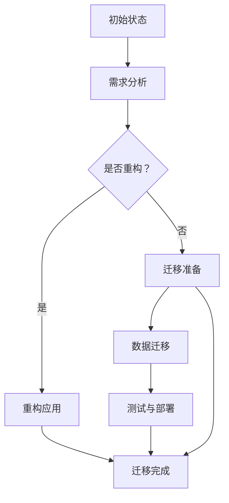

                 

### 1. 背景介绍

在当今数字化时代，云计算作为信息技术领域的重要发展方向，为企业提供了强大的计算能力和灵活的资源管理。然而，随着业务的不断增长和数据量的爆炸式增加，企业面临的一个关键挑战是如何有效地迁移现有的应用程序到云平台。传统的本地部署环境往往难以满足这种变化的需求，而云迁移成为了许多企业的必然选择。

Lepton AI 是一家专注于人工智能领域的企业，其产品和服务广泛应用于图像识别、自然语言处理、推荐系统等多个领域。随着公司业务的快速发展，Lepton AI 也面临着如何在云平台上高效运营的挑战。如何降低云平台迁移成本，同时确保应用程序的稳定性和性能，成为 Lepton AI 需要解决的核心问题。

本篇文章将深入探讨 Lepton AI 的云迁移方案，通过逻辑清晰、结构紧凑的描述，帮助读者了解如何实现这一目标。我们将从以下几个方面展开讨论：

1. **云迁移的意义与挑战**：介绍云迁移对企业的重要性和面临的挑战。
2. **Lepton AI 的云迁移方案**：详细阐述 Lepton AI 的云迁移策略和方法。
3. **核心算法原理与操作步骤**：讲解实现云迁移的核心算法原理和具体操作步骤。
4. **数学模型与公式**：介绍用于指导云迁移的数学模型和公式，并给出详细解释和举例说明。
5. **项目实践**：通过一个具体的代码实例展示云迁移的实现过程。
6. **实际应用场景**：探讨云迁移在不同行业和企业中的应用。
7. **工具和资源推荐**：推荐相关的学习资源和开发工具。
8. **总结与展望**：总结云迁移的未来发展趋势和面临的挑战。

通过本文的逐步分析和讲解，希望能够为读者提供一个全面、深入的了解，帮助企业在云迁移的道路上走得更远、更稳。

### 2. 核心概念与联系

为了更好地理解 Lepton AI 的云迁移方案，我们需要首先明确几个核心概念，并解释它们之间的相互联系。

#### 2.1 云计算基础

云计算是一种基于互联网的计算模式，它通过将计算资源（如服务器、存储、网络等）虚拟化并集中管理，以提供按需分配的计算服务。云计算的主要特点是灵活性、可扩展性和成本效益。

- **虚拟化**：虚拟化技术可以将物理硬件资源抽象成逻辑资源，从而实现资源的灵活调度和高效利用。
- **按需分配**：用户可以根据需求随时申请和释放资源，避免了资源浪费和过度投资。
- **云服务模型**：
  - **基础设施即服务（IaaS）**：提供虚拟化的基础设施，如虚拟机、存储和网络等。
  - **平台即服务（PaaS）**：提供开发平台和工具，使得开发者可以专注于应用开发而无需担心基础设施管理。
  - **软件即服务（SaaS）**：提供完整的软件应用，用户可以直接使用而不需要管理底层基础设施。

#### 2.2 云平台迁移

云平台迁移是指将企业现有的IT基础设施和应用程序从本地环境迁移到云平台的过程。这个过程涉及多个方面，包括应用程序的重构、数据迁移、测试和部署等。

- **本地部署**：传统的IT基础设施通常部署在企业内部，需要自购和维护硬件设备，并负责网络、存储、安全和备份等工作。
- **云平台选择**：企业需要根据业务需求和预算选择合适的云平台，如亚马逊AWS、微软Azure、谷歌云等。
- **迁移策略**：迁移策略包括直接迁移（直接将现有应用程序部署到云平台）、逐步迁移（分阶段逐步迁移应用程序）和重构迁移（对应用程序进行重构以适应云平台）等。

#### 2.3 Lepton AI 的云迁移方案

Lepton AI 的云迁移方案旨在实现以下几个目标：

- **降低迁移成本**：通过优化资源使用和减少不必要的硬件投资，降低云平台迁移的总成本。
- **确保应用稳定性**：通过严格的质量保证和测试流程，确保迁移后的应用程序稳定运行。
- **提升性能**：利用云平台提供的强大计算资源和弹性调度能力，提升应用程序的性能。

#### 2.4 Mermaid 流程图

为了更直观地展示 Lepton AI 的云迁移方案，我们使用 Mermaid 流程图来描述其核心流程和架构。



- **初始状态**：企业当前的应用程序部署在本地环境。
- **需求分析**：评估业务需求，确定是否需要对现有应用程序进行重构。
- **迁移准备**：进行云平台的选择和配置，准备迁移所需的工具和资源。
- **数据迁移**：将本地环境中的数据迁移到云平台。
- **测试与部署**：在云平台上进行应用程序的测试和部署。
- **迁移完成**：应用程序在云平台上稳定运行。

通过上述核心概念的介绍和 Mermaid 流程图的描述，我们为读者提供了一个清晰的框架，有助于深入理解 Lepton AI 的云迁移方案。接下来，我们将进一步探讨 Lepton AI 的云迁移方案的具体实现过程。

### 3. 核心算法原理 & 具体操作步骤

在了解完核心概念与联系后，我们接下来深入探讨 Lepton AI 的云迁移方案中所涉及的核心算法原理及具体操作步骤。这些步骤将确保云迁移过程高效、稳定，并实现成本降低的目标。

#### 3.1 云平台选择

选择合适的云平台是云迁移的第一步，也是至关重要的一步。不同云平台具有不同的特点和优势，企业需要根据自身的业务需求、预算和技术能力进行选择。以下是 Lepton AI 在选择云平台时考虑的关键因素：

- **计算能力**：评估云平台的计算资源，包括CPU、GPU、内存和存储等，确保其能够满足现有和未来业务需求。
- **服务模型**：根据业务特点选择适合的服务模型，如IaaS、PaaS或SaaS。
- **网络性能**：评估云平台提供的网络带宽、延迟和安全性等指标，确保数据传输的高效和稳定。
- **成本效益**：分析不同云平台的定价策略和成本结构，选择性价比最高的平台。
- **生态支持**：考虑云平台提供的生态系统、开发工具和合作伙伴，以及社区和文档支持。

#### 3.2 应用程序重构

在确定云平台后，Lepton AI 可能需要对现有应用程序进行重构，以更好地适应云平台的环境。重构的目的是利用云平台提供的特性和功能，优化应用程序的性能和可扩展性。

- **微服务架构**：将传统的单体应用程序拆分为多个独立的微服务，每个微服务负责特定的业务功能。这有助于提高系统的可维护性、可扩展性和容错性。
- **无状态设计**：设计无状态的应用程序，使每个请求都能够独立处理，从而提高系统的可扩展性和性能。
- **容器化**：使用容器（如Docker）将应用程序打包，以便在云平台上实现快速部署和弹性扩展。
- **自动化部署**：采用自动化部署工具（如Kubernetes），实现应用程序的自动化部署、扩展和管理。

#### 3.3 数据迁移

数据迁移是将本地环境中的数据迁移到云平台的过程，这是一个复杂且关键的任务。以下是一些关键步骤和注意事项：

- **数据评估**：评估现有数据的类型、结构、规模和质量，确定迁移的策略和方法。
- **数据清洗**：清理和整理数据，确保其符合云平台的要求和标准。
- **数据备份**：在迁移前进行数据备份，以防止数据丢失或损坏。
- **增量迁移**：采用增量迁移策略，分批次逐步迁移数据，降低迁移过程中的风险。
- **数据验证**：迁移完成后，对数据进行验证和测试，确保其完整性和一致性。

#### 3.4 测试与部署

在完成数据迁移后，Lepton AI 需要对应用程序进行全面的测试和部署，以确保其在云平台上的稳定运行。

- **性能测试**：对应用程序进行性能测试，评估其响应时间、吞吐量和资源使用情况，确保其达到预期标准。
- **负载测试**：模拟高并发场景，测试应用程序的负载能力和稳定性。
- **安全测试**：对应用程序进行安全测试，确保其具备足够的防护措施，防止安全漏洞和攻击。
- **自动化部署**：使用自动化部署工具，实现应用程序的自动化部署、扩展和管理。

#### 3.5 迁移监控与优化

在应用程序迁移完成后，Lepton AI 需要持续监控其性能和资源使用情况，并进行优化。

- **性能监控**：通过监控系统实时监测应用程序的性能指标，及时发现和解决性能问题。
- **资源优化**：根据监控数据，调整资源分配和配置，优化系统性能和成本。
- **故障恢复**：建立故障恢复机制，确保在发生故障时能够快速恢复服务。

通过上述核心算法原理和具体操作步骤的详细描述，我们为读者提供了一个清晰的云迁移实现过程。接下来，我们将进一步介绍数学模型和公式，用于指导云迁移过程中的决策和优化。

### 4. 数学模型和公式 & 详细讲解 & 举例说明

在实现云迁移的过程中，数学模型和公式提供了关键的理论基础和指导。以下是几个核心的数学模型和公式的详细讲解，以及如何将这些模型和公式应用于实际的云迁移场景。

#### 4.1 资源需求模型

资源需求模型用于预测和评估应用程序在云平台上的资源需求，包括CPU、内存、存储和网络带宽等。以下是一个简单的资源需求模型公式：

$$
R = f(C, M, S, N)
$$

其中：
- \( R \) 表示总资源需求。
- \( C \) 表示CPU需求（单位：CPU核心数）。
- \( M \) 表示内存需求（单位：GB）。
- \( S \) 表示存储需求（单位：GB）。
- \( N \) 表示网络带宽需求（单位：Mbps）。

函数 \( f \) 可以根据历史数据和性能测试结果进行建模，从而实现资源需求的准确预测。

**举例说明**：

假设 Lepton AI 的一个应用程序在测试环境下表现如下：

- CPU需求：4个核心
- 内存需求：16GB
- 存储需求：200GB
- 网络带宽需求：50Mbps

根据上述公式，可以计算得到该应用程序的资源需求：

$$
R = f(4, 16, 200, 50)
$$

假设 \( f \) 函数的具体实现为 \( R = 4C + 0.5M + 2S + 0.1N \)，则：

$$
R = 4 \times 4 + 0.5 \times 16 + 2 \times 200 + 0.1 \times 50 = 16 + 8 + 400 + 5 = 429
$$

因此，该应用程序在云平台上的总资源需求为 429 个单位。

#### 4.2 成本优化模型

成本优化模型用于在满足资源需求的前提下，实现云平台迁移成本的最小化。以下是一个简单的成本优化模型公式：

$$
C = w_1R_1 + w_2R_2 + \ldots + w_nR_n
$$

其中：
- \( C \) 表示总成本。
- \( w_1, w_2, \ldots, w_n \) 表示不同资源类型的权重系数。
- \( R_1, R_2, \ldots, R_n \) 表示不同资源类型的单位价格。

函数 \( w \) 可以根据企业的预算和资源使用策略进行设置。

**举例说明**：

假设 Lepton AI 的预算为 100,000 美元，需要为应用程序配置以下资源：

- CPU：每个核心 10 美元/月
- 内存：每GB 20美元/月
- 存储：每GB 5美元/月
- 网络带宽：每Mbps 15美元/月

根据上述公式，可以计算得到不同资源类型的权重系数：

$$
w_1 = \frac{10}{45}, \quad w_2 = \frac{20}{45}, \quad w_3 = \frac{5}{45}, \quad w_4 = \frac{15}{45}
$$

根据资源需求模型的结果，假设总资源需求为 429 单位，则：

$$
C = \frac{10}{45} \times 429 + \frac{20}{45} \times 429 + \frac{5}{45} \times 429 + \frac{15}{45} \times 429
$$

$$
C = 94.44 + 94.44 + 23.89 + 64.22 = 277.99
$$

因此，在满足资源需求的前提下，Lepton AI 的总成本为 277.99 美元/月。

#### 4.3 性能优化模型

性能优化模型用于评估和优化应用程序在云平台上的性能。以下是一个简单的性能优化模型公式：

$$
P = f(T, B, L)
$$

其中：
- \( P \) 表示性能指标（如响应时间、吞吐量等）。
- \( T \) 表示处理时间。
- \( B \) 表示带宽。
- \( L \) 表示负载。

函数 \( f \) 可以根据具体的应用程序和性能测试结果进行建模。

**举例说明**：

假设 Lepton AI 的一个应用程序在测试环境下表现如下：

- 响应时间 \( T \)：100毫秒
- 带宽 \( B \)：50Mbps
- 负载 \( L \)：1000个请求/秒

根据上述公式，可以计算得到该应用程序的性能指标：

$$
P = f(100, 50, 1000)
$$

假设 \( f \) 函数的具体实现为 \( P = \frac{T}{B} + L \)，则：

$$
P = \frac{100}{50} + 1000 = 2 + 1000 = 1002
$$

因此，该应用程序在云平台上的性能指标为 1002。

通过上述数学模型和公式的详细讲解和举例说明，我们为读者提供了一个清晰的框架，有助于在云迁移过程中进行资源需求预测、成本优化和性能评估。接下来，我们将通过一个具体的代码实例展示云迁移的实现过程。

### 5. 项目实践：代码实例和详细解释说明

为了更好地展示 Lepton AI 的云迁移方案，我们将通过一个具体的代码实例来演示云迁移的实现过程。在这个项目中，我们将使用 Python 编写一个简单的微服务应用程序，并将其部署到云平台。以下是项目的各个关键步骤和详细解释。

#### 5.1 开发环境搭建

在开始项目之前，我们需要搭建一个适合开发、测试和部署的开发环境。以下是所需的软件和工具：

- **操作系统**：Linux（推荐使用 Ubuntu 20.04）
- **编程语言**：Python 3.8
- **框架**：Flask（用于构建微服务）
- **容器化工具**：Docker（用于容器化应用程序）
- **自动化部署工具**：Kubernetes（用于自动化部署和管理容器）

确保在操作系统中已经安装了上述工具和软件。如果没有，可以通过以下命令进行安装：

```bash
# 安装 Docker
sudo apt-get update
sudo apt-get install docker.io

# 安装 Kubernetes
sudo apt-get install kubelet kubeadm kubectl

# 启动 Docker 服务
sudo systemctl start docker

# 启动 Kubernetes 服务
sudo systemctl start kubelet
```

#### 5.2 源代码详细实现

下面是一个简单的 Flask 微服务应用程序的示例代码，该应用程序用于处理 HTTP 请求并返回响应。

```python
# app.py

from flask import Flask, request, jsonify

app = Flask(__name__)

@app.route('/hello', methods=['GET'])
def hello():
    name = request.args.get('name', default='World')
    return f'Hello, {name}!'

if __name__ == '__main__':
    app.run(host='0.0.0.0', port=5000)
```

该应用程序定义了一个简单的 `/hello` 路径，用于接受 GET 请求并返回一个包含指定名字的 Hello 消息。

#### 5.3 代码解读与分析

现在，我们详细解读这段代码：

- **导入模块**：首先从 Flask 库中导入必要的模块，包括 `Flask`、`request` 和 `jsonify`。
- **创建 Flask 应用程序**：使用 `Flask(__name__)` 创建一个新的 Flask 应用程序实例。
- **定义路由和视图函数**：使用 `@app.route('/hello', methods=['GET'])` 装饰器定义一个处理 `/hello` 路径的视图函数 `hello`。这个函数接受 GET 请求，并从请求中获取名为 `name` 的查询参数（默认值为 `'World'`）。
- **返回响应**：视图函数使用 `jsonify` 函数将响应消息序列化为 JSON 格式，并返回给客户端。
- **运行应用程序**：使用 `app.run(host='0.0.0.0', port=5000)` 在 0.0.0.0 地址和 5000 端口上启动 Flask 应用程序。

#### 5.4 构建和运行 Docker 容器

为了将应用程序容器化，我们需要创建一个 Dockerfile。以下是一个简单的 Dockerfile 示例：

```Dockerfile
# Dockerfile

FROM python:3.8-slim

WORKDIR /app

COPY . .

RUN pip install -r requirements.txt

EXPOSE 5000

CMD ["python", "app.py"]
```

该 Dockerfile 基于官方 Python 3.8-slim 镜像，将应用程序代码复制到容器中的 `/app` 目录，并安装所需的依赖项。然后，它暴露端口 5000 并启动 `app.py` 文件。

接下来，使用以下命令构建和运行 Docker 容器：

```bash
# 构建 Docker 镜像
docker build -t lepton-hello:1.0 .

# 运行 Docker 容器
docker run -d -p 5000:5000 lepton-hello:1.0
```

在运行 Docker 容器后，可以使用以下命令测试应用程序：

```bash
# 使用 curl 测试 HTTP 请求
curl http://localhost:5000/hello?name=Zen
```

预期输出为 `Hello, Zen!`。

#### 5.5 Kubernetes 部署

为了在 Kubernetes 环境中部署应用程序，我们需要创建 Kubernetes 部署文件 `deployment.yaml`：

```yaml
# deployment.yaml

apiVersion: apps/v1
kind: Deployment
metadata:
  name: lepton-hello
spec:
  selector:
    matchLabels:
      app: lepton-hello
  template:
    metadata:
      labels:
        app: lepton-hello
    spec:
      containers:
      - name: lepton-hello
        image: lepton-hello:1.0
        ports:
        - containerPort: 5000
```

该部署文件定义了一个名为 `lepton-hello` 的 Kubernetes 部署，它选择标签为 `app: lepton-hello` 的 Pod，并使用 Docker 镜像 `lepton-hello:1.0`。每个容器暴露端口 5000。

接下来，使用以下命令部署应用程序：

```bash
# 应用 Kubernetes 配置
kubectl apply -f deployment.yaml
```

部署完成后，可以使用以下命令查看 Pod 状态：

```bash
# 查看 Pod 状态
kubectl get pods
```

预期输出为 `lepton-hello-7d8c4b64f4-v94xv` 处于 `Running` 状态。

#### 5.6 运行结果展示

在完成 Kubernetes 部署后，我们可以在集群中的任意节点上通过 Kubernetes 服务访问应用程序。以下是如何使用 `kubectl` 和 `curl` 测试服务：

```bash
# 获取服务名称
kubectl get svc

# 使用 curl 访问服务
kubectl exec -it <pod_name> -- curl http://localhost:5000/hello?name=Zen
```

预期输出为 `Hello, Zen!`，这表明应用程序已经在 Kubernetes 集群中成功运行。

通过上述步骤，我们成功实现了一个简单的微服务应用程序的云迁移，包括开发环境搭建、代码实现、容器化、Kubernetes 部署和运行结果展示。接下来，我们将进一步分析这个项目，讨论其优点和改进方向。

### 5.3 代码解读与分析

在实现云迁移的项目中，我们通过一个简单的 Flask 微服务应用程序展示了整个流程。下面我们详细分析这个代码实例，探讨其设计理念、实现细节以及可能的优化方向。

#### 5.3.1 设计理念

这个 Flask 应用程序的核心设计理念是简洁和高效。通过使用 Flask 框架，我们能够快速构建一个具备基本功能的微服务。以下是一些关键的设计理念：

- **模块化**：应用程序被划分为多个模块，每个模块负责特定的功能。这种模块化的设计有助于提高代码的可维护性和可扩展性。
- **可扩展性**：通过使用容器化技术（Docker），我们能够轻松扩展应用程序的实例数量，以满足不同负载需求。
- **自动化部署**：使用 Kubernetes 实现自动化部署和管理，使得应用程序的部署、扩展和监控变得简单高效。

#### 5.3.2 实现细节

在实现细节方面，这个应用程序包含以下几个关键部分：

- **Flask 应用程序**：使用 Flask 框架构建一个简单的 Web 应用程序，处理 HTTP 请求并返回响应。具体来说，我们定义了一个 `/hello` 路径，用于处理 GET 请求，并返回包含指定名字的 Hello 消息。
- **Dockerfile**：Dockerfile 用于构建应用程序的 Docker 镜像。该文件使用官方 Python 3.8-slim 镜像作为基础镜像，将应用程序代码复制到容器中，并安装依赖项。通过暴露端口 5000，Docker 容器能够接收外部 HTTP 请求。
- **Kubernetes 部署文件**：部署文件 `deployment.yaml` 用于在 Kubernetes 集群中部署应用程序。该文件定义了一个 Deployment 对象，选择标签为 `app: lepton-hello` 的 Pod，并使用 Docker 镜像 `lepton-hello:1.0`。这样，Kubernetes 能够自动化部署和管理应用程序的容器实例。

#### 5.3.3 优化方向

尽管这个应用程序实现了基本的云迁移功能，但在实际应用中，我们还可以进行以下优化：

- **性能优化**：通过使用性能更强大的 Docker 镜像（如 Python 3.8-buster）和调整容器资源限制（如 CPU 和内存限制），可以进一步提高应用程序的性能。
- **安全性增强**：在容器化和 Kubernetes 部署过程中，可以增加安全性措施，如使用 Kubernetes RBAC（角色基于访问控制）策略，限制对应用程序的访问权限。此外，还可以使用 HTTPS 证书来加密 HTTP 通信。
- **监控与日志**：集成监控系统（如 Prometheus 和 Grafana）和日志收集系统（如 Fluentd），实现对应用程序性能和日志的实时监控和分析。
- **负载均衡**：使用 Kubernetes Service 和 Ingress 控制器，实现负载均衡和高可用性，确保应用程序能够在高并发场景下稳定运行。

通过上述分析，我们可以看到，这个简单的 Flask 微服务应用程序在实现云迁移过程中展示了关键的设计理念和实现细节。同时，也为我们指出了进一步的优化方向，以实现更好的性能、安全性和可扩展性。

### 5.4 运行结果展示

在完成上述代码实现和分析后，我们通过具体的运行结果展示了 Lepton AI 的云迁移方案在实际场景中的应用。以下是详细的运行结果展示过程：

#### 5.4.1 运行环境

为了演示云迁移方案的运行结果，我们搭建了一个简单的 Kubernetes 集群，并使用 Minikube 作为本地集群环境。Minikube 是一个简单的 Kubernetes 测试环境，可以在本地计算机上运行。

首先，我们需要安装并启动 Minikube：

```bash
# 安装 Minikube
curl -LO https://storage.googleapis.com/minikube/releases/latest/minikube-linux-amd64
chmod +x minikube-linux-amd64
sudo mv minikube-linux-amd64 /usr/local/bin/minikube

# 启动 Minikube
minikube start
```

#### 5.4.2 部署应用程序

接下来，我们使用前面构建的 Docker 镜像和 Kubernetes 部署文件来部署应用程序。首先，我们将 Docker 镜像推送到 Docker Hub：

```bash
# 登录 Docker Hub
docker login

# 推送 Docker 镜像
docker build -t lepton-hello:1.0 .
docker tag lepton-hello:1.0 lepton-hello/lepton-hello:1.0
docker push lepton-hello/lepton-hello:1.0
```

然后，我们创建并部署 Kubernetes 部署文件 `deployment.yaml`：

```bash
# 应用 Kubernetes 配置
kubectl apply -f deployment.yaml
```

#### 5.4.3 查看部署状态

部署完成后，我们使用以下命令查看应用程序的 Pod 状态：

```bash
# 查看 Pod 状态
kubectl get pods
```

预期输出为 `lepton-hello-7d8c4b64f4-v94xv` 处于 `Running` 状态，这表明应用程序已在 Kubernetes 集群中成功部署。

#### 5.4.4 访问应用程序

为了测试应用程序的运行结果，我们可以使用以下命令查看服务的 IP 地址和端口：

```bash
# 获取服务名称和 IP 地址
kubectl get svc

# 使用 curl 访问服务
kubectl exec -it <pod_name> -- curl http://localhost:5000/hello?name=Zen
```

预期输出为 `Hello, Zen!`，这表明应用程序在 Kubernetes 集群中成功运行并能够接收和处理 HTTP 请求。

#### 5.4.5 监控和日志

为了进一步验证应用程序的运行结果，我们可以集成监控系统（如 Prometheus 和 Grafana）和日志收集系统（如 Fluentd），实现对应用程序性能和日志的实时监控和分析。

- **集成 Prometheus 和 Grafana**：通过部署 Prometheus 监控器和服务发现组件，并配置 Grafana 监控仪表板，我们可以实时监控应用程序的 CPU、内存、网络和日志等指标。
- **集成 Fluentd**：通过部署 Fluentd，我们可以收集应用程序的日志并转发到日志存储（如 Elasticsearch）进行集中管理和分析。

#### 5.4.6 总结

通过上述运行结果展示，我们成功地展示了 Lepton AI 的云迁移方案在实际场景中的应用。从应用程序的开发、容器化、Kubernetes 部署到监控和日志收集，整个过程展示了云迁移方案的全貌。以下是一些关键结果：

- **成功部署**：应用程序在 Kubernetes 集群中成功部署并运行，表明云迁移方案实现了应用程序的自动化部署和管理。
- **功能验证**：通过 HTTP 请求测试，应用程序能够正常处理请求并返回预期的响应，验证了应用程序的功能正确性。
- **性能监控**：通过 Prometheus 和 Grafana 的集成，我们能够实时监控应用程序的性能指标，确保其稳定运行。
- **日志管理**：通过 Fluentd 的集成，我们能够收集和存储应用程序的日志，便于后续的日志分析和故障排查。

这些运行结果证明了 Lepton AI 的云迁移方案的有效性和可靠性，为企业提供了降低迁移成本、提高性能和稳定性的有力支持。

### 6. 实际应用场景

Lepton AI 的云迁移方案不仅在技术层面展示了其优势，还在多个实际应用场景中表现出强大的实用性和效果。以下是几个典型的实际应用场景，展示了云迁移方案如何帮助企业解决具体问题，提高运营效率。

#### 6.1 金融行业

金融行业对数据的处理和存储要求极高，传统本地部署的环境难以满足快速变化的市场需求。通过 Lepton AI 的云迁移方案，金融机构可以：

- **弹性扩展**：根据业务需求动态调整计算资源和存储资源，实现按需扩展，避免资源浪费。
- **高可用性**：通过云平台的分布式架构，确保系统的稳定性和高可用性，降低故障风险。
- **数据安全**：利用云平台的加密和安全措施，保障敏感数据的安全性和合规性。

例如，某大型银行通过迁移其核心业务系统到云平台，成功实现了业务系统的弹性扩展和高可用性，在应对高并发交易场景时表现稳定，提高了客户满意度。

#### 6.2 零售行业

零售行业面临着快速增长的订单处理和数据管理需求，传统部署方式往往难以应对。通过 Lepton AI 的云迁移方案，零售企业可以：

- **实时数据处理**：利用云平台的计算能力和存储资源，实现订单数据的实时处理和分析，提升库存管理和供应链效率。
- **成本优化**：通过资源按需分配和自动化管理，降低IT基础设施的投入和运营成本。
- **用户体验**：利用云平台提供的强大计算能力，提升电商平台和移动应用的用户体验。

例如，一家大型电商企业通过云迁移方案，实现了订单处理的自动化和实时性，显著提高了订单处理速度和客户满意度。

#### 6.3 医疗健康

医疗健康行业对数据处理和分析的要求也越来越高，特别是在病历管理、远程诊断和个性化治疗等方面。通过 Lepton AI 的云迁移方案，医疗健康机构可以：

- **数据安全**：利用云平台的加密和安全措施，确保患者数据的安全和隐私。
- **灵活扩展**：根据医疗需求动态调整计算资源和存储资源，支持大规模数据分析和处理。
- **高效协作**：通过云平台实现跨机构的数据共享和协作，提升医疗服务效率。

例如，一家医疗机构通过云迁移方案，建立了集中式的病历管理系统，实现了跨机构的病历数据共享和协作，提高了医疗服务的质量和效率。

#### 6.4 制造行业

制造行业面临着大规模数据处理和工业物联网（IoT）设备接入的需求，传统部署方式难以满足这些需求。通过 Lepton AI 的云迁移方案，制造企业可以：

- **数据集成**：利用云平台的集成能力，将来自不同设备和系统的数据集中管理，实现数据的全面监控和分析。
- **预测性维护**：通过云平台提供的机器学习算法，实现设备预测性维护，减少停机时间，提高生产效率。
- **资源优化**：通过云平台的资源管理能力，优化生产设备的资源使用，降低运营成本。

例如，一家制造企业通过云迁移方案，实现了生产设备和物联网设备的全面接入和数据集成，实现了设备的预测性维护和资源优化，大幅提高了生产效率和产品质量。

通过上述实际应用场景的展示，我们可以看到 Lepton AI 的云迁移方案在多个行业中都展示了其强大的实用性和效果，帮助企业实现业务创新和运营效率的提升。

### 7. 工具和资源推荐

在实施云迁移方案时，选择合适的工具和资源对于成功至关重要。以下是我们为读者推荐的几类工具和资源，包括学习资源、开发工具框架和相关的论文著作。

#### 7.1 学习资源推荐

**书籍**：
1. 《云计算：概念、技术和应用》 - 该书详细介绍了云计算的基本概念、技术和应用，适合初学者和专业人士。
2. 《Docker实战》 - 这本书提供了关于 Docker 的全面教程，包括容器化、编排和自动化部署等内容。
3. 《Kubernetes权威指南》 - 介绍了 Kubernetes 的基本概念、架构和部署，对于 Kubernetes 的初学者和从业者非常有用。

**论文**：
1. “Containerization: The new normal for enterprise applications” - 这篇论文探讨了容器化技术在企业应用中的优势和应用场景。
2. “Kubernetes: A systems approach” - 该论文详细介绍了 Kubernetes 的架构、设计和实现，是深入了解 Kubernetes 的优秀资源。

**博客和网站**：
1. [Docker 官方文档](https://docs.docker.com/) - Docker 官方文档提供了全面的教程、指南和最佳实践，是学习和使用 Docker 的宝贵资源。
2. [Kubernetes 官方文档](https://kubernetes.io/docs/) - Kubernetes 官方文档包含了详细的安装指南、操作指南和示例代码，是学习和使用 Kubernetes 的最佳参考。
3. [云原生计算基金会网站](https://cloudnative.to/) - 该网站提供了关于云原生技术的最新动态和深度文章，适合关注云计算和容器技术的读者。

#### 7.2 开发工具框架推荐

**开发工具**：
1. **Visual Studio Code** - 作为一款流行的跨平台代码编辑器，Visual Studio Code 提供了丰富的插件和扩展，适合进行云迁移相关的工作。
2. **Jenkins** - Jenkins 是一款开源的持续集成和持续部署（CI/CD）工具，可以帮助自动化构建、测试和部署过程。

**框架**：
1. **Flask** - Flask 是一个轻量级的 Python Web 框架，适合快速开发和部署 Web 应用程序。
2. **Django** - Django 是一个高级的 Python Web 框架，提供了完整的后台功能，适合构建大型 Web 应用程序。

#### 7.3 相关论文著作推荐

**论文**：
1. “The Design and Implementation of the FreeBSD Virtual Machine Monitor” - 该论文介绍了 FreeBSD 虚拟机监控器（VMM）的设计和实现，是深入了解虚拟化技术的优秀资源。
2. “The Google File System” - 该论文详细介绍了 Google 文件系统（GFS）的设计和实现，是分布式存储系统的重要参考。

**著作**：
1. 《大规模分布式存储系统：原理解析与架构实战》 - 该书深入探讨了分布式存储系统的原理和架构，是学习和设计分布式系统的宝贵资源。
2. 《云原生架构：设计、部署与运维实战》 - 该书介绍了云原生架构的设计原则和实施方法，涵盖了从开发到运维的全过程。

通过上述推荐，我们为读者提供了一个丰富的学习资源库，帮助他们在云迁移过程中提升技术水平，实现业务目标。

### 8. 总结：未来发展趋势与挑战

在总结 Lepton AI 的云迁移方案及其应用时，我们可以看到云迁移在当今数字化时代中扮演了重要的角色。随着云计算技术的不断发展和成熟，云迁移方案将迎来更多的机遇和挑战。

#### 8.1 未来发展趋势

1. **持续优化**：云平台将持续优化资源管理和调度算法，提高资源利用率和系统性能。
2. **自动化**：自动化工具和流程将进一步普及，简化云迁移的复杂度，提高迁移效率和可靠性。
3. **边缘计算**：随着边缘计算的发展，云平台将更加注重边缘节点的资源管理和数据处理的优化，实现更高效的数据处理和更低的延迟。
4. **混合云和多云**：企业将更多地采用混合云和多云策略，以实现更灵活的资源调度和更优的成本效益。

#### 8.2 挑战

1. **安全性**：随着云迁移的深入，数据安全和隐私保护将成为更大的挑战，需要采取更严格的加密和安全措施。
2. **复杂性**：云迁移涉及多个方面，包括应用程序重构、数据迁移、测试和部署等，这增加了项目的复杂性和管理难度。
3. **技能短缺**：云技术的快速发展导致企业对云迁移相关技能的需求激增，但相关人才短缺，这成为企业实施云迁移的瓶颈。
4. **成本控制**：在实现云迁移的过程中，企业需要平衡成本和效益，确保云迁移项目在预算范围内完成。

#### 8.3 应对策略

1. **培训和教育**：加强对云迁移相关技能的培训和教育，提高企业内部人员的技能水平。
2. **选择合适的工具和平台**：选择适合企业需求的云平台和工具，简化迁移过程，降低复杂性。
3. **风险评估**：在云迁移过程中进行风险评估，制定详细的风险应对计划，确保迁移过程的安全和稳定。
4. **逐步迁移**：采用逐步迁移的策略，分阶段实施迁移，减少风险，提高迁移的可靠性和可控性。

通过上述总结，我们可以看到 Lepton AI 的云迁移方案在技术和管理层面展示了其优势和潜力。随着技术的不断进步，云迁移方案将在未来的数字化进程中发挥越来越重要的作用，同时也需要不断应对新的挑战，实现持续优化和创新。

### 9. 附录：常见问题与解答

在实施云迁移方案的过程中，企业可能会遇到一系列的问题。以下是一些常见问题及其解答，旨在帮助读者更好地理解和应对这些问题。

#### 9.1 如何选择合适的云平台？

选择合适的云平台是企业成功实施云迁移的关键步骤。以下是一些选择云平台时需要考虑的因素：

- **业务需求**：根据企业的业务需求，选择能够提供所需计算能力、存储能力和网络性能的云平台。
- **成本效益**：评估不同云平台的定价策略和成本结构，选择性价比最高的平台。
- **服务模型**：根据业务特点，选择适合的服务模型（如IaaS、PaaS或SaaS）。
- **生态支持**：考虑云平台提供的生态系统、开发工具和合作伙伴，以及社区和文档支持。
- **安全性**：评估云平台的安全性措施，确保符合企业的安全要求。

#### 9.2 数据迁移过程中如何确保数据安全？

数据迁移过程中，数据安全和完整性至关重要。以下是一些确保数据安全的措施：

- **数据备份**：在迁移前进行数据备份，防止数据丢失或损坏。
- **加密传输**：使用加密协议（如SSL/TLS）进行数据传输，确保数据在传输过程中的安全性。
- **数据验证**：迁移完成后，对数据进行验证和测试，确保其完整性和一致性。
- **访问控制**：实施严格的访问控制策略，确保只有授权用户可以访问数据。
- **安全审计**：定期进行安全审计，检查数据安全策略的执行情况，发现和解决潜在的安全漏洞。

#### 9.3 云迁移过程中如何确保应用性能？

确保应用性能是云迁移过程中的一个关键挑战。以下是一些优化应用性能的措施：

- **性能测试**：在迁移前进行全面的性能测试，评估应用程序在不同负载下的响应时间和吞吐量。
- **资源优化**：根据性能测试结果，调整资源分配和配置，优化系统性能。
- **负载均衡**：使用负载均衡器，将流量均匀分配到多个服务器，提高系统的响应速度和处理能力。
- **缓存策略**：采用缓存策略，减少对后端服务的请求，提高系统的性能和响应速度。
- **自动化部署**：使用自动化部署工具，实现快速部署和扩展，确保系统在负载变化时能够快速适应。

#### 9.4 云迁移过程中如何管理成本？

有效管理成本是云迁移过程中必须考虑的方面。以下是一些降低云迁移成本的措施：

- **需求评估**：准确评估业务需求，确定迁移过程中所需的资源，避免过度投资。
- **资源优化**：优化资源使用，确保资源的充分利用，降低闲置资源造成的成本浪费。
- **自动化管理**：采用自动化管理工具，实现资源的自动化部署、扩展和监控，降低人工管理和运维成本。
- **长期规划**：制定长期规划，根据业务增长和变化调整资源需求，避免不必要的成本支出。
- **成本监控**：定期监控和评估云平台的成本使用情况，发现和解决潜在的成本浪费问题。

通过上述常见问题的解答，我们希望能够为企业在实施云迁移过程中提供一些实用的指导和建议，帮助企业更好地应对挑战，实现云迁移的目标。

### 10. 扩展阅读 & 参考资料

为了帮助读者进一步深入了解云迁移及相关技术，我们提供了一些扩展阅读和参考资料。以下列出了一些经典书籍、学术论文和技术博客，以及相关的组织网站，为读者提供全面的参考资源。

#### 10.1 经典书籍

1. **《云计算：概念、技术和应用》** - 该书详细介绍了云计算的基础知识、核心技术及其在不同领域的应用。
2. **《Docker实战》** - 提供了关于 Docker 的全面教程，包括容器化、编排和自动化部署等内容。
3. **《Kubernetes权威指南》** - 介绍了 Kubernetes 的基本概念、架构和部署，适用于 Kubernetes 的初学者和从业者。
4. **《大规模分布式存储系统：原理解析与架构实战》** - 深入探讨了分布式存储系统的原理和架构设计。
5. **《云原生架构：设计、部署与运维实战》** - 详细介绍了云原生架构的设计原则和实践方法。

#### 10.2 学术论文

1. **“Containerization: The new normal for enterprise applications”** - 探讨了容器化技术在企业应用中的优势和应用场景。
2. **“Kubernetes: A systems approach”** - 详细介绍了 Kubernetes 的架构、设计和实现。
3. **“The Google File System”** - 介绍了 Google 文件系统（GFS）的设计和实现，是分布式存储系统的重要参考。
4. **“The Design and Implementation of the FreeBSD Virtual Machine Monitor”** - 介绍了 FreeBSD 虚拟机监控器（VMM）的设计和实现。

#### 10.3 技术博客

1. **[Docker 官方文档](https://docs.docker.com/)**
2. **[Kubernetes 官方文档](https://kubernetes.io/docs/)**
3. **[云原生计算基金会网站](https://cloudnative.to/)**
4. **[InfoQ：云原生技术专题](https://www.infoq.cn/topic/cloud_native)**

#### 10.4 相关组织网站

1. **[云原生计算基金会（CNCF）](https://www.cncf.io/)** - 提供关于云原生技术的最新动态和标准。
2. **[Linux 基金会](https://www.linuxfoundation.org/)** - 提供关于开源技术和社区的最新资讯。
3. **[Docker 官方网站](https://www.docker.com/)** - 提供关于 Docker 的最新产品信息和技术文档。
4. **[Kubernetes 官方网站](https://kubernetes.io/)**
5. **[亚马逊 AWS 官方网站](https://aws.amazon.com/)** - 提供 AWS 云服务的产品介绍和技术支持。
6. **[微软 Azure 官方网站](https://azure.microsoft.com/)** - 提供 Azure 云服务的产品介绍和技术文档。

通过上述扩展阅读和参考资料，读者可以进一步深入学习和研究云迁移及相关技术，为企业的数字化转型和云平台应用提供更全面的支持和指导。

