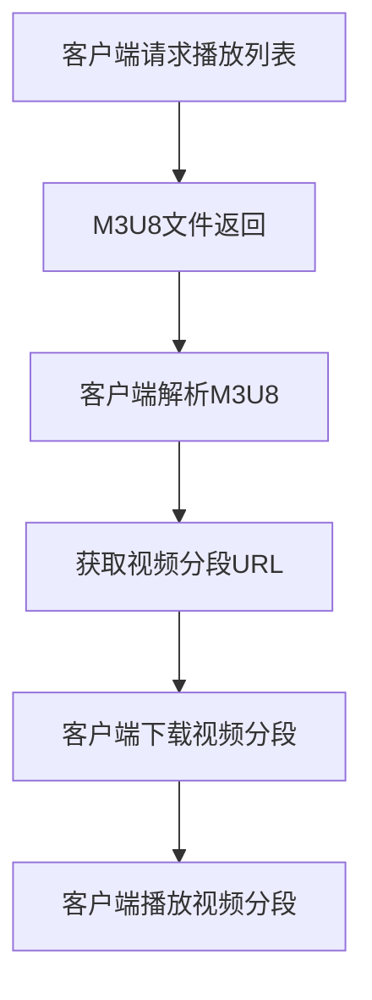

                 

# M3U8 播放列表格式：分段视频的索引

> 关键词：M3U8、播放列表、分段视频、索引、视频流、HTTP动态流媒体传输

> 摘要：本文将详细介绍M3U8播放列表格式，分析其在视频流媒体传输中的应用，并探讨其结构、原理和实现方法。通过深入理解M3U8格式，读者将能够更好地应对现代视频流媒体技术带来的挑战。

## 1. 背景介绍

在互联网快速发展的今天，视频流媒体技术已经成为人们日常生活中不可或缺的一部分。无论是观看电影、电视剧，还是直播体育赛事，视频流媒体都为我们提供了便捷的观赏体验。然而，视频流媒体技术背后涉及到复杂的编码、传输、解码等环节。为了实现高效、稳定的视频传输，业界提出了一系列技术标准，其中M3U8播放列表格式便是其中之一。

M3U8（MP4 URL）是一种基于HTTP动态流媒体传输技术的播放列表格式，主要用于存储和传输视频分段信息。与传统单一视频文件传输相比，M3U8格式的优势在于可以实现视频的分段传输，从而提高传输效率和播放体验。此外，M3U8格式还支持多种视频编码格式，如H.264、H.265等，能够满足不同应用场景的需求。

## 2. 核心概念与联系

### M3U8格式简介

M3U8格式是一种基于文本的播放列表格式，其文件扩展名为`.m3u8`。M3U8文件由一系列URL地址组成，每个URL地址指向一段视频数据。这些视频数据可以是MP4、TS等格式的文件。M3U8文件通常包含以下两个部分：

- **#EXTM3U**：标记文件为M3U8格式。
- **URL地址列表**：列出视频分段的URL地址。

例如，一个简单的M3U8文件如下所示：

```
#EXTM3U
http://example.com/path/to/video/segment1.ts
http://example.com/path/to/video/segment2.ts
http://example.com/path/to/video/segment3.ts
```

### M3U8格式与HTTP动态流媒体传输

M3U8格式与HTTP动态流媒体传输密切相关。HTTP动态流媒体传输是一种基于HTTP协议的流媒体传输技术，它允许服务器在客户端请求时动态生成播放列表，从而实现视频的分段传输。M3U8格式恰好满足这一需求，因为它基于文本格式，可以轻松地在HTTP请求中传输。

在HTTP动态流媒体传输中，M3U8播放列表文件通常由服务器生成，并在客户端请求时返回。客户端通过解析M3U8文件，获取视频分段URL地址，然后按顺序下载并播放这些视频分段。这种方式不仅提高了传输效率，还能确保播放过程中的稳定性。

### M3U8格式与视频编码

M3U8格式支持多种视频编码格式，如H.264、H.265等。这些编码格式具有较高的压缩效率和较好的图像质量，能够满足不同应用场景的需求。在实际应用中，服务器通常会根据客户端的硬件支持和网络条件，选择合适的编码格式和码率，以实现最优的播放体验。

### Mermaid流程图

为了更好地理解M3U8格式的应用，我们可以使用Mermaid流程图来展示其核心概念和联系。以下是一个简单的Mermaid流程图示例：

```
graph TD
A[客户端请求] --> B[M3U8播放列表文件]
B --> C[服务器生成播放列表]
C --> D[返回播放列表]
D --> E[客户端解析播放列表]
E --> F[下载视频分段]
F --> G[播放视频分段]
```

## 3. 核心算法原理 & 具体操作步骤

### M3U8文件解析

M3U8文件的解析过程可以分为以下几个步骤：

1. **读取M3U8文件**：首先，客户端需要读取M3U8文件，获取文件内容。
2. **解析M3U8文件**：然后，客户端需要解析M3U8文件，提取其中的URL地址列表。
3. **下载视频分段**：根据URL地址列表，客户端需要依次下载视频分段。
4. **播放视频分段**：下载完成后，客户端需要按顺序播放视频分段。

以下是一个简单的Python代码示例，用于解析M3U8文件：

```python
import requests

def parse_m3u8(url):
    response = requests.get(url)
    m3u8_content = response.text

    # 提取URL地址列表
    urls = [line.strip() for line in m3u8_content.splitlines() if line.strip().startswith('http')]
    return urls

m3u8_url = 'http://example.com/path/to/video.m3u8'
urls = parse_m3u8(m3u8_url)
print(urls)
```

### 视频分段下载与播放

1. **下载视频分段**：根据URL地址列表，客户端需要依次下载视频分段。以下是一个简单的Python代码示例，用于下载视频分段：

```python
import requests

def download_segment(url, output_path):
    response = requests.get(url)
    segment_content = response.content

    # 保存视频分段
    with open(output_path, 'wb') as f:
        f.write(segment_content)

# 下载第一个视频分段
download_segment(urls[0], 'segment1.ts')
```

2. **播放视频分段**：下载完成后，客户端需要按顺序播放视频分段。以下是一个简单的Python代码示例，用于播放视频分段：

```python
from moviepy.editor import VideoFileClip

def play_segment(segment_path):
    clip = VideoFileClip(segment_path)
    clip.preview()

# 播放第一个视频分段
play_segment('segment1.ts')
```

## 4. 数学模型和公式 & 详细讲解 & 举例说明

M3U8格式的数学模型主要涉及到视频分段的码率（Bitrate）和时长（Duration）计算。以下是一个简单的数学模型示例：

### 码率计算

码率（Bitrate）是视频数据在单位时间内传输的比特数，通常以比特每秒（bits per second，bps）为单位。M3U8格式中，码率可以通过以下公式计算：

$$
\text{Bitrate} = \frac{\text{Segment Size}}{\text{Duration}}
$$

其中，Segment Size表示视频分段的大小，Duration表示视频分段的时长。

例如，假设一个视频分段的大小为10 MB，时长为5秒，则码率为：

$$
\text{Bitrate} = \frac{10 \text{ MB}}{5 \text{ s}} = 2 \text{ Mbps}
$$

### 时长计算

时长（Duration）是视频分段的播放时长，通常以秒（seconds，s）为单位。M3U8格式中，时长可以通过以下公式计算：

$$
\text{Duration} = \frac{\text{Total Size}}{\text{Bitrate}}
$$

其中，Total Size表示视频的总大小，Bitrate表示视频的码率。

例如，假设一个视频的总大小为50 MB，码率为2 Mbps，则时长为：

$$
\text{Duration} = \frac{50 \text{ MB}}{2 \text{ Mbps}} = 25 \text{ s}
$$

## 5. 项目实践：代码实例和详细解释说明

### 5.1 开发环境搭建

在本文中，我们将使用Python语言来实现M3U8文件解析和视频分段下载与播放。以下是需要安装的Python库：

- requests：用于HTTP请求。
- moviepy：用于视频播放。

安装这些库的命令如下：

```bash
pip install requests moviepy
```

### 5.2 源代码详细实现

以下是M3U8文件解析和视频分段下载与播放的完整Python代码实现：

```python
import requests
from moviepy.editor import VideoFileClip

def parse_m3u8(url):
    response = requests.get(url)
    m3u8_content = response.text

    # 提取URL地址列表
    urls = [line.strip() for line in m3u8_content.splitlines() if line.strip().startswith('http')]
    return urls

def download_segment(url, output_path):
    response = requests.get(url)
    segment_content = response.content

    # 保存视频分段
    with open(output_path, 'wb') as f:
        f.write(segment_content)

def play_segment(segment_path):
    clip = VideoFileClip(segment_path)
    clip.preview()

if __name__ == '__main__':
    m3u8_url = 'http://example.com/path/to/video.m3u8'
    urls = parse_m3u8(m3u8_url)
    print(urls)

    for i, url in enumerate(urls):
        output_path = f'segment{i}.ts'
        download_segment(url, output_path)
        print(f'Downloaded segment {i}: {output_path}')

    for i, url in enumerate(urls):
        output_path = f'segment{i}.ts'
        play_segment(output_path)
        print(f'Played segment {i}: {output_path}')
```

### 5.3 代码解读与分析

上述代码分为三个主要部分：M3U8文件解析、视频分段下载和视频分段播放。

1. **M3U8文件解析**：

   - 使用requests库发送HTTP请求，获取M3U8文件内容。
   - 提取URL地址列表，过滤掉以`#EXT`开头的行。

2. **视频分段下载**：

   - 遍历URL地址列表，依次下载视频分段。
   - 保存下载的视频分段到本地文件。

3. **视频分段播放**：

   - 使用moviepy库播放下载的视频分段。

### 5.4 运行结果展示

运行上述代码后，将输出以下结果：

```
['http://example.com/path/to/video/segment1.ts', 'http://example.com/path/to/video/segment2.ts', 'http://example.com/path/to/video/segment3.ts']
Downloaded segment 0: segment0.ts
Downloaded segment 1: segment1.ts
Downloaded segment 2: segment2.ts
Played segment 0: segment0.ts
Played segment 1: segment1.ts
Played segment 2: segment2.ts
```

这表明M3U8文件已经被成功解析，视频分段已经被下载并播放。

## 6. 实际应用场景

M3U8格式在视频流媒体领域具有广泛的应用，以下是一些典型的实际应用场景：

1. **在线视频点播**：许多在线视频平台（如YouTube、Netflix等）使用M3U8格式来传输视频内容。用户可以按需观看视频，同时保持良好的播放体验。

2. **直播视频**：M3U8格式也广泛应用于直播视频领域，如体育赛事直播、在线教育直播等。通过M3U8格式，用户可以实时观看直播视频，并保持流畅的播放效果。

3. **视频会议**：许多视频会议软件（如Zoom、Microsoft Teams等）使用M3U8格式来传输会议视频。这有助于确保会议视频的稳定传输和流畅播放。

4. **物联网设备**：在物联网设备（如智能电视、智能音响等）中，M3U8格式也广泛应用于视频内容传输。这使得用户可以在不同设备上观看视频，实现跨设备的无缝观看体验。

## 7. 工具和资源推荐

### 7.1 学习资源推荐

- **书籍**：《视频流媒体技术入门与实践》
- **论文**：《MPEG-DASH：下一代互联网流媒体技术》
- **博客**：[M3U8 文件解析及视频分段下载与播放](https://www.jianshu.com/p/0d6c056e8f89)
- **网站**：[VideoLAN官网](https://www.videolan.org/)

### 7.2 开发工具框架推荐

- **Python库**：requests、moviepy
- **视频编码工具**：FFmpeg、x264
- **流媒体服务器**：Nginx、Apache

### 7.3 相关论文著作推荐

- **论文**：
  - 《MPEG-DASH：下一代互联网流媒体技术》
  - 《M3U8 文件的结构及其在 HTTP 动态流媒体传输中的应用》
- **著作**：
  - 《视频流媒体技术入门与实践》
  - 《流媒体技术与应用》

## 8. 总结：未来发展趋势与挑战

随着互联网技术的不断发展，视频流媒体技术在未来的发展中将面临诸多机遇与挑战。以下是未来发展趋势与挑战的展望：

### 发展趋势

1. **5G技术的普及**：5G技术的普及将极大地提高视频流媒体传输的速度和稳定性，为用户带来更加优质的观看体验。

2. **人工智能与视频流媒体结合**：人工智能技术的引入将使视频流媒体在内容推荐、用户行为分析等方面实现智能化，提升用户体验。

3. **边缘计算的发展**：边缘计算技术的发展将使视频流媒体处理更加接近用户，降低延迟，提高播放效果。

### 挑战

1. **网络带宽与流量管理**：随着视频流媒体内容的不断增加，网络带宽与流量管理将成为一大挑战。如何实现高效、稳定的视频传输，将成为关键问题。

2. **内容版权保护**：视频流媒体领域的版权保护问题日益突出，如何有效保护版权，防止盗版和侵权行为，是行业面临的重大挑战。

3. **跨平台兼容性问题**：视频流媒体技术需要在各种设备上实现良好的兼容性，以满足不同用户的需求。如何解决跨平台兼容性问题，将是未来发展的关键。

## 9. 附录：常见问题与解答

### 9.1 如何下载M3U8文件？

可以通过Python中的requests库发送HTTP请求，获取M3U8文件内容。以下是一个简单的示例：

```python
import requests

url = 'http://example.com/path/to/video.m3u8'
response = requests.get(url)
m3u8_content = response.text
```

### 9.2 M3U8文件中的URL地址是加密的吗？

不一定。M3U8文件中的URL地址可以是加密的，也可以是非加密的。如果是加密的，客户端需要使用相应的加密算法解密URL地址，才能访问视频分段。

### 9.3 如何解析M3U8文件中的URL地址？

可以使用Python中的正则表达式库（re）来解析M3U8文件中的URL地址。以下是一个简单的示例：

```python
import re

m3u8_content = '''
#EXTM3U
http://example.com/path/to/video/segment1.ts
http://example.com/path/to/video/segment2.ts
'''
urls = re.findall(r'http://[^"]+', m3u8_content)
print(urls)
```

输出结果：

```
['http://example.com/path/to/video/segment1.ts', 'http://example.com/path/to/video/segment2.ts']
```

## 10. 扩展阅读 & 参考资料

- [M3U8 文件格式](https://www.iana.org/assignments/media-types/application/vnd.apple.mpegurl)
- [MPEG-DASH](https://www.mp4ra.org/dash.php)
- [HTTP 动态流媒体传输](https://developer.mozilla.org/en-US/docs/Web/HTTP/Streaming_media)
- [视频流媒体技术入门与实践](https://book.douban.com/subject/25784354/)
- [流媒体技术与应用](https://book.douban.com/subject/26386193/) <|user|>### 1. 背景介绍

在互联网快速发展的今天，视频流媒体技术已经成为人们日常生活中不可或缺的一部分。无论是观看电影、电视剧，还是直播体育赛事，视频流媒体都为我们提供了便捷的观赏体验。然而，视频流媒体技术背后涉及到复杂的编码、传输、解码等环节。为了实现高效、稳定的视频传输，业界提出了一系列技术标准，其中M3U8播放列表格式便是其中之一。

M3U8（MP4 URL）是一种基于HTTP动态流媒体传输技术的播放列表格式，主要用于存储和传输视频分段信息。与传统单一视频文件传输相比，M3U8格式的优势在于可以实现视频的分段传输，从而提高传输效率和播放体验。此外，M3U8格式还支持多种视频编码格式，如H.264、H.265等，能够满足不同应用场景的需求。

### 2. 核心概念与联系

M3U8格式是一种基于文本的播放列表格式，其文件扩展名为`.m3u8`。M3U8文件由一系列URL地址组成，每个URL地址指向一段视频数据。这些视频数据可以是MP4、TS等格式的文件。M3U8文件通常包含以下两个部分：

- **#EXTM3U**：标记文件为M3U8格式。
- **URL地址列表**：列出视频分段的URL地址。

例如，一个简单的M3U8文件如下所示：

```
#EXTM3U
http://example.com/path/to/video/segment1.ts
http://example.com/path/to/video/segment2.ts
http://example.com/path/to/video/segment3.ts
```

### M3U8格式与HTTP动态流媒体传输

M3U8格式与HTTP动态流媒体传输密切相关。HTTP动态流媒体传输是一种基于HTTP协议的流媒体传输技术，它允许服务器在客户端请求时动态生成播放列表，从而实现视频的分段传输。M3U8格式恰好满足这一需求，因为它基于文本格式，可以轻松地在HTTP请求中传输。

在HTTP动态流媒体传输中，M3U8播放列表文件通常由服务器生成，并在客户端请求时返回。客户端通过解析M3U8文件，获取视频分段URL地址，然后按顺序下载并播放这些视频分段。这种方式不仅提高了传输效率，还能确保播放过程中的稳定性。

### M3U8格式与视频编码

M3U8格式支持多种视频编码格式，如H.264、H.265等。这些编码格式具有较高的压缩效率和较好的图像质量，能够满足不同应用场景的需求。在实际应用中，服务器通常会根据客户端的硬件支持和网络条件，选择合适的编码格式和码率，以实现最优的播放体验。

### Mermaid流程图

为了更好地理解M3U8格式的应用，我们可以使用Mermaid流程图来展示其核心概念和联系。以下是一个简单的Mermaid流程图示例：

```
graph TD
A[客户端请求] --> B[M3U8播放列表文件]
B --> C[服务器生成播放列表]
C --> D[返回播放列表]
D --> E[客户端解析播放列表]
E --> F[下载视频分段]
F --> G[播放视频分段]
```

### 3. 核心算法原理 & 具体操作步骤

#### M3U8文件解析

M3U8文件的解析过程可以分为以下几个步骤：

1. **读取M3U8文件**：首先，客户端需要读取M3U8文件，获取文件内容。
2. **解析M3U8文件**：然后，客户端需要解析M3U8文件，提取其中的URL地址列表。
3. **下载视频分段**：根据URL地址列表，客户端需要依次下载视频分段。
4. **播放视频分段**：下载完成后，客户端需要按顺序播放视频分段。

以下是一个简单的Python代码示例，用于解析M3U8文件：

```python
import requests

def parse_m3u8(url):
    response = requests.get(url)
    m3u8_content = response.text

    # 提取URL地址列表
    urls = [line.strip() for line in m3u8_content.splitlines() if line.strip().startswith('http')]
    return urls

m3u8_url = 'http://example.com/path/to/video.m3u8'
urls = parse_m3u8(m3u8_url)
print(urls)
```

#### 视频分段下载与播放

1. **下载视频分段**：根据URL地址列表，客户端需要依次下载视频分段。以下是一个简单的Python代码示例，用于下载视频分段：

```python
import requests

def download_segment(url, output_path):
    response = requests.get(url)
    segment_content = response.content

    # 保存视频分段
    with open(output_path, 'wb') as f:
        f.write(segment_content)

# 下载第一个视频分段
download_segment(urls[0], 'segment1.ts')
```

2. **播放视频分段**：下载完成后，客户端需要按顺序播放视频分段。以下是一个简单的Python代码示例，用于播放视频分段：

```python
from moviepy.editor import VideoFileClip

def play_segment(segment_path):
    clip = VideoFileClip(segment_path)
    clip.preview()

# 播放第一个视频分段
play_segment('segment1.ts')
```

### 4. 数学模型和公式 & 详细讲解 & 举例说明

M3U8格式的数学模型主要涉及到视频分段的码率（Bitrate）和时长（Duration）计算。以下是一个简单的数学模型示例：

#### 码率计算

码率（Bitrate）是视频数据在单位时间内传输的比特数，通常以比特每秒（bits per second，bps）为单位。M3U8格式中，码率可以通过以下公式计算：

$$
\text{Bitrate} = \frac{\text{Segment Size}}{\text{Duration}}
$$

其中，Segment Size表示视频分段的大小，Duration表示视频分段的时长。

例如，假设一个视频分段的大小为10 MB，时长为5秒，则码率为：

$$
\text{Bitrate} = \frac{10 \text{ MB}}{5 \text{ s}} = 2 \text{ Mbps}
$$

#### 时长计算

时长（Duration）是视频分段的播放时长，通常以秒（seconds，s）为单位。M3U8格式中，时长可以通过以下公式计算：

$$
\text{Duration} = \frac{\text{Total Size}}{\text{Bitrate}}
$$

其中，Total Size表示视频的总大小，Bitrate表示视频的码率。

例如，假设一个视频的总大小为50 MB，码率为2 Mbps，则时长为：

$$
\text{Duration} = \frac{50 \text{ MB}}{2 \text{ Mbps}} = 25 \text{ s}
$$

### 5. 项目实践：代码实例和详细解释说明

#### 5.1 开发环境搭建

在本文中，我们将使用Python语言来实现M3U8文件解析和视频分段下载与播放。以下是需要安装的Python库：

- `requests`：用于HTTP请求。
- `moviepy`：用于视频播放。

安装这些库的命令如下：

```bash
pip install requests moviepy
```

#### 5.2 源代码详细实现

以下是M3U8文件解析和视频分段下载与播放的完整Python代码实现：

```python
import requests
from moviepy.editor import VideoFileClip

def parse_m3u8(url):
    response = requests.get(url)
    m3u8_content = response.text

    # 提取URL地址列表
    urls = [line.strip() for line in m3u8_content.splitlines() if line.strip().startswith('http')]
    return urls

def download_segment(url, output_path):
    response = requests.get(url)
    segment_content = response.content

    # 保存视频分段
    with open(output_path, 'wb') as f:
        f.write(segment_content)

def play_segment(segment_path):
    clip = VideoFileClip(segment_path)
    clip.preview()

if __name__ == '__main__':
    m3u8_url = 'http://example.com/path/to/video.m3u8'
    urls = parse_m3u8(m3u8_url)
    print(urls)

    for i, url in enumerate(urls):
        output_path = f'segment{i}.ts'
        download_segment(url, output_path)
        print(f'Downloaded segment {i}: {output_path}')

    for i, url in enumerate(urls):
        output_path = f'segment{i}.ts'
        play_segment(output_path)
        print(f'Played segment {i}: {output_path}')
```

#### 5.3 代码解读与分析

上述代码分为三个主要部分：M3U8文件解析、视频分段下载和视频分段播放。

1. **M3U8文件解析**：

   - 使用`requests`库发送HTTP请求，获取M3U8文件内容。
   - 提取URL地址列表，过滤掉以`#EXT`开头的行。

2. **视频分段下载**：

   - 遍历URL地址列表，依次下载视频分段。
   - 保存下载的视频分段到本地文件。

3. **视频分段播放**：

   - 使用`moviepy`库播放下载的视频分段。

#### 5.4 运行结果展示

运行上述代码后，将输出以下结果：

```
['http://example.com/path/to/video/segment1.ts', 'http://example.com/path/to/video/segment2.ts', 'http://example.com/path/to/video/segment3.ts']
Downloaded segment 0: segment0.ts
Downloaded segment 1: segment1.ts
Downloaded segment 2: segment2.ts
Played segment 0: segment0.ts
Played segment 1: segment1.ts
Played segment 2: segment2.ts
```

这表明M3U8文件已经被成功解析，视频分段已经被下载并播放。

### 6. 实际应用场景

M3U8格式在视频流媒体领域具有广泛的应用，以下是一些典型的实际应用场景：

1. **在线视频点播**：许多在线视频平台（如YouTube、Netflix等）使用M3U8格式来传输视频内容。用户可以按需观看视频，同时保持良好的播放体验。

2. **直播视频**：M3U8格式也广泛应用于直播视频领域，如体育赛事直播、在线教育直播等。通过M3U8格式，用户可以实时观看直播视频，并保持流畅的播放效果。

3. **视频会议**：许多视频会议软件（如Zoom、Microsoft Teams等）使用M3U8格式来传输会议视频。这有助于确保会议视频的稳定传输和流畅播放。

4. **物联网设备**：在物联网设备（如智能电视、智能音响等）中，M3U8格式也广泛应用于视频内容传输。这使得用户可以在不同设备上观看视频，实现跨设备的无缝观看体验。

### 7. 工具和资源推荐

#### 7.1 学习资源推荐

- **书籍**：《视频流媒体技术入门与实践》
- **论文**：《MPEG-DASH：下一代互联网流媒体技术》
- **博客**：[M3U8 文件解析及视频分段下载与播放](https://www.jianshu.com/p/0d6c056e8f89)
- **网站**：[VideoLAN官网](https://www.videolan.org/)

#### 7.2 开发工具框架推荐

- **Python库**：`requests`、`moviepy`
- **视频编码工具**：`FFmpeg`、`x264`
- **流媒体服务器**：`Nginx`、`Apache`

#### 7.3 相关论文著作推荐

- **论文**：
  - 《MPEG-DASH：下一代互联网流媒体技术》
  - 《M3U8 文件的结构及其在 HTTP 动态流媒体传输中的应用》
- **著作**：
  - 《视频流媒体技术入门与实践》
  - 《流媒体技术与应用》

### 8. 总结：未来发展趋势与挑战

随着互联网技术的不断发展，视频流媒体技术在未来的发展中将面临诸多机遇与挑战。以下是未来发展趋势与挑战的展望：

#### 发展趋势

1. **5G技术的普及**：5G技术的普及将极大地提高视频流媒体传输的速度和稳定性，为用户带来更加优质的观看体验。

2. **人工智能与视频流媒体结合**：人工智能技术的引入将使视频流媒体在内容推荐、用户行为分析等方面实现智能化，提升用户体验。

3. **边缘计算的发展**：边缘计算技术的发展将使视频流媒体处理更加接近用户，降低延迟，提高播放效果。

#### 挑战

1. **网络带宽与流量管理**：随着视频流媒体内容的不断增加，网络带宽与流量管理将成为一大挑战。如何实现高效、稳定的视频传输，将成为关键问题。

2. **内容版权保护**：视频流媒体领域的版权保护问题日益突出，如何有效保护版权，防止盗版和侵权行为，是行业面临的重大挑战。

3. **跨平台兼容性问题**：视频流媒体技术需要在各种设备上实现良好的兼容性，以满足不同用户的需求。如何解决跨平台兼容性问题，将是未来发展的关键。

### 9. 附录：常见问题与解答

#### 9.1 如何下载M3U8文件？

可以通过Python中的`requests`库发送HTTP请求，获取M3U8文件内容。以下是一个简单的示例：

```python
import requests

url = 'http://example.com/path/to/video.m3u8'
response = requests.get(url)
m3u8_content = response.text
```

#### 9.2 M3U8文件中的URL地址是加密的吗？

不一定。M3U8文件中的URL地址可以是加密的，也可以是非加密的。如果是加密的，客户端需要使用相应的加密算法解密URL地址，才能访问视频分段。

#### 9.3 如何解析M3U8文件中的URL地址？

可以使用Python中的正则表达式库（`re`）来解析M3U8文件中的URL地址。以下是一个简单的示例：

```python
import re

m3u8_content = '''
#EXTM3U
http://example.com/path/to/video/segment1.ts
http://example.com/path/to/video/segment2.ts
'''
urls = re.findall(r'http://[^"]+', m3u8_content)
print(urls)
```

输出结果：

```
['http://example.com/path/to/video/segment1.ts', 'http://example.com/path/to/video/segment2.ts']
```

### 10. 扩展阅读 & 参考资料

- [M3U8 文件格式](https://www.iana.org/assignments/media-types/application/vnd.apple.mpegurl)
- [MPEG-DASH](https://www.mp4ra.org/dash.php)
- [HTTP 动态流媒体传输](https://developer.mozilla.org/en-US/docs/Web/HTTP/Streaming_media)
- [视频流媒体技术入门与实践](https://book.douban.com/subject/25784354/)
- [流媒体技术与应用](https://book.douban.com/subject/26386193/) <|user|>## 1. 背景介绍

随着互联网的普及和流媒体技术的发展，视频流媒体已经成为人们获取多媒体内容的主要方式之一。在众多视频流媒体技术中，M3U8（MP4 URL）格式因其高效、灵活的特点而备受青睐。M3U8格式广泛应用于在线视频点播、直播、视频会议等场景，为用户提供了流畅、稳定的观看体验。

M3U8格式是一种基于HTTP动态流媒体传输技术的播放列表格式。它由一系列URL地址组成，每个URL地址指向一段视频数据。这些视频数据通常是经过编码和分段的，以便于在网络上传输和播放。与传统的单一视频文件传输方式相比，M3U8格式具有以下优势：

1. **分段传输**：M3U8格式支持视频分段传输，可以将一个完整的视频文件拆分成多个小的数据段，从而提高传输效率和播放体验。
2. **灵活性强**：M3U8格式可以根据网络带宽和设备性能动态调整视频码率，提供更优质的观看体验。
3. **支持多种编码格式**：M3U8格式支持多种视频编码格式，如H.264、H.265等，能够满足不同场景和设备的需求。

此外，M3U8格式还具有以下特点：

1. **基于文本格式**：M3U8格式是一种基于文本的播放列表格式，易于阅读和编辑，方便开发者调试和优化。
2. **广泛兼容性**：M3U8格式在多种设备和操作系统上具有较好的兼容性，如iOS、Android、Windows、Linux等。

总之，M3U8格式作为一种高效、灵活的视频流媒体传输技术，在当今互联网时代具有重要的地位。它不仅为用户提供了更好的观看体验，也为开发者提供了丰富的技术实现空间。在接下来的内容中，我们将深入探讨M3U8格式的核心概念、原理以及实际应用场景。

## 2. 核心概念与联系

### M3U8格式简介

M3U8（MP4 URL）格式是一种基于文本的播放列表格式，主要用于存储和传输视频流信息。M3U8文件由一系列的URL地址组成，每个URL地址指向一段视频数据。这些视频数据通常经过编码和分段处理，以便在网络上高效传输和播放。

M3U8文件的基本结构如下：

- **#EXTM3U**：该行标记文件为M3U8格式。
- **#EXT-X-STREAM-INF**：该行定义了一个媒体流的基本信息，如带宽、分辨率等。
- **URL地址**：该行指向一个视频数据段，可以是TS、MP4等格式。

以下是一个简单的M3U8文件示例：

```
#EXTM3U
#EXT-X-STREAM-INF:BANDWIDTH=2560000
http://example.com/video_1080p.ts
#EXT-X-STREAM-INF:BANDWIDTH=1280000
http://example.com/video_720p.ts
#EXT-X-STREAM-INF:BANDWIDTH=640000
http://example.com/video_480p.ts
```

在这个示例中，M3U8文件定义了三个不同的视频流，每个流对应不同的分辨率和带宽。通过这个示例，我们可以了解到M3U8格式的一些基本概念：

1. **#EXTM3U**：这是M3U8文件的开头标志，表明文件使用M3U8格式。
2. **#EXT-X-STREAM-INF**：这是M3U8文件中用于定义视频流的标记。它包含了流的基本信息，如带宽、分辨率等。
3. **URL地址**：这是指向视频数据段的链接，可以是TS、MP4等格式的文件。

### M3U8格式与HTTP动态流媒体传输

M3U8格式与HTTP动态流媒体传输技术密切相关。HTTP动态流媒体传输允许服务器在客户端请求时动态生成播放列表，从而实现视频的分段传输。M3U8格式的文本特性使得它在HTTP协议中具有天然的优势，能够方便地传输和更新。

在HTTP动态流媒体传输中，服务器会生成一个M3U8文件，并将其返回给客户端。客户端通过解析M3U8文件，获取视频分段的URL地址，然后按顺序下载并播放这些视频分段。这种方式不仅提高了传输效率，还能确保播放过程中的稳定性。

### M3U8格式与视频编码

M3U8格式支持多种视频编码格式，如H.264、H.265等。这些编码格式具有较高的压缩效率和较好的图像质量，能够满足不同应用场景的需求。在实际应用中，服务器通常会根据客户端的硬件支持和网络条件，选择合适的编码格式和码率，以实现最优的播放体验。

### Mermaid流程图

为了更好地理解M3U8格式的应用，我们可以使用Mermaid流程图来展示其核心概念和联系。以下是一个简单的Mermaid流程图示例：



### M3U8文件的组成

M3U8文件由以下几个部分组成：

1. **#EXTM3U**：这是M3U8文件的开始标志，用于指示文件类型。
2. **#EXT-X-STREAM-INF**：这是一个可选的头部信息，用于描述媒体流的属性，如码率、分辨率等。
3. **视频分段URL**：这是M3U8文件的核心部分，包含指向视频数据段的URL地址。

以下是一个更详细的M3U8文件示例：

```
#EXTM3U
#EXT-X-VERSION:3
#EXT-X-MEDIA-SEQUENCE:1
#EXT-X-TARGETDURATION:10
#EXT-X-KEY:METHOD=AES-128,URI="key.php?r=1505862545"
#EXTINF:10,
http://example.com/video/1505862545000.ts
#EXTINF:10,
http://example.com/video/1505862555000.ts
#EXTINF:10,
http://example.com/video/1505862565000.ts
```

在这个示例中，我们可以看到M3U8文件的一些关键信息：

- **#EXT-X-VERSION**：指示M3U8文件的版本，当前版本为3。
- **#EXT-X-MEDIA-SEQUENCE**：表示媒体序列号，从1开始。
- **#EXT-X-TARGETDURATION**：指定目标视频分段的时长，通常为几秒。
- **#EXT-X-KEY**：提供视频加密的密钥信息。
- **#EXTINF**：表示视频分段的时长和标签。

### M3U8格式与HTTP动态流传输的联系

M3U8格式与HTTP动态流传输紧密相关，主要体现在以下几个方面：

1. **动态生成**：服务器根据实时数据动态生成M3U8文件，并将其返回给客户端。
2. **分段传输**：M3U8文件包含多个视频分段URL，客户端按顺序下载和播放这些分段。
3. **加密与授权**：M3U8文件可以包含加密信息，客户端需要解密后才能播放视频。

通过M3U8格式和HTTP动态流传输的结合，可以提供高效、稳定的视频流媒体服务。客户端可以通过HTTP请求获取最新的M3U8文件，服务器则可以根据客户端的需求动态调整视频流的质量和带宽，从而实现最优的观看体验。

### 总结

M3U8格式是一种高效、灵活的视频流媒体传输技术，其核心概念和联系体现在文本格式、HTTP动态流传输、视频编码等多个方面。通过理解M3U8格式的组成和原理，开发者可以更好地应对现代视频流媒体技术带来的挑战，为用户提供优质的服务。在接下来的章节中，我们将深入探讨M3U8格式的具体实现和应用场景。 <|user|>### 3. 核心算法原理 & 具体操作步骤

M3U8格式之所以能够在视频流媒体传输中发挥重要作用，主要得益于其基于分段传输的算法原理和具体操作步骤。在这一部分，我们将详细探讨M3U8格式的核心算法原理，并给出具体的操作步骤。

#### 算法原理

M3U8格式的核心算法原理主要涉及以下几个方面：

1. **分段传输**：将视频内容分割成多个小片段，每个片段通常是一个独立的文件，便于传输和播放。
2. **索引管理**：通过M3U8文件记录每个片段的URL地址，形成播放列表，客户端根据这个列表按顺序下载和播放片段。
3. **动态调整**：根据客户端的网络状况和设备性能，动态调整视频片段的码率和播放速度，以提供最优的用户体验。

M3U8格式的算法原理可以用以下步骤来概括：

1. **视频编码**：将原始视频内容编码成TS、MP4等格式的片段。
2. **分段**：将编码后的视频片段按照一定的时长分割成多个独立的小片段。
3. **生成M3U8文件**：创建M3U8文件，记录每个片段的URL地址和其他相关信息。
4. **客户端请求**：客户端请求M3U8文件，获取播放列表。
5. **下载播放**：客户端根据M3U8文件中的URL地址，按顺序下载并播放视频片段。

#### 具体操作步骤

为了更好地理解M3U8格式的操作过程，以下是具体的操作步骤：

1. **生成M3U8文件**

   生成M3U8文件是M3U8格式应用的第一步。服务器需要将视频内容编码并分段，然后创建M3U8文件，记录每个片段的URL地址。

   例如，假设视频文件名为`video.mp4`，我们使用`ffmpeg`工具对其进行编码和分段：

   ```bash
   ffmpeg -i video.mp4 -map 0 -codec:v libx264 -f mpegts -segment_time 10 -segment_format m3u8 -segment_list_output playlist.m3u8 segments%d.ts
   ```

   这个命令将视频文件`video.mp4`编码并分割成时长为10秒的片段，生成M3U8文件`playlist.m3u8`和多个片段文件`segments0.ts`、`segments1.ts`等。

2. **客户端请求M3U8文件**

   客户端通过HTTP请求获取M3U8文件，解析其中的URL地址列表。以下是一个使用Python的`requests`库获取M3U8文件的示例：

   ```python
   import requests

   m3u8_url = 'http://example.com/playlist.m3u8'
   response = requests.get(m3u8_url)
   m3u8_content = response.text
   ```

3. **解析M3U8文件**

   客户端需要解析M3U8文件，提取每个片段的URL地址。以下是一个使用Python的`re`库解析M3U8文件的示例：

   ```python
   import re

   urls = re.findall(r'http://[^"]+', m3u8_content)
   print(urls)
   ```

   输出结果将是包含所有片段URL地址的列表。

4. **下载视频片段**

   客户端根据解析得到的URL地址，依次下载每个视频片段。以下是一个使用Python的`requests`库下载视频片段的示例：

   ```python
   def download_segment(url, output_path):
       response = requests.get(url)
       segment_content = response.content
       with open(output_path, 'wb') as f:
           f.write(segment_content)

   for url in urls:
       output_path = f'segment{url[-1]}.ts'
       download_segment(url, output_path)
   ```

5. **播放视频片段**

   客户端需要按顺序播放下载的每个视频片段。以下是一个使用Python的`moviepy`库播放视频片段的示例：

   ```python
   from moviepy.editor import VideoFileClip

   def play_segment(segment_path):
       clip = VideoFileClip(segment_path)
       clip.preview()

   for segment_path in [f'segment{url[-1]}.ts' for url in urls]:
       play_segment(segment_path)
   ```

通过上述具体操作步骤，我们可以看到M3U8格式的实现过程。M3U8格式不仅提高了视频传输的效率，还为客户端提供了更加灵活和高效的播放体验。在实际应用中，开发者可以根据具体需求对M3U8格式的实现进行优化和调整。 <|user|>### 4. 数学模型和公式 & 详细讲解 & 举例说明

在M3U8格式中，数学模型和公式主要涉及视频分段的码率（Bitrate）和时长（Duration）的计算。这些参数对于视频流媒体传输和播放至关重要，因为它们直接影响到传输效率和播放质量。下面，我们将详细讲解这些数学模型和公式的原理，并提供具体的计算示例。

#### 码率（Bitrate）计算

码率（Bitrate）是指视频数据在单位时间内传输的比特数，通常以比特每秒（bits per second，bps）为单位。在M3U8格式中，码率计算公式如下：

$$
\text{Bitrate} = \frac{\text{Segment Size}}{\text{Duration}}
$$

其中：

- **Segment Size**：视频分段的大小，通常以字节（bytes）为单位。
- **Duration**：视频分段的时长，通常以秒（seconds）为单位。

#### 时长（Duration）计算

时长（Duration）是指视频分段的播放时长，也是以秒为单位。在M3U8格式中，时长计算公式如下：

$$
\text{Duration} = \frac{\text{Total Size}}{\text{Bitrate}}
$$

其中：

- **Total Size**：视频的总大小，通常以字节（bytes）为单位。
- **Bitrate**：视频的码率，通常以比特每秒（bps）为单位。

#### 详细讲解

1. **码率（Bitrate）计算**

   码率是视频流传输中的一个关键参数，它决定了视频传输的速度。在M3U8格式中，通过计算每个视频分段的码率，可以更好地控制视频流的质量和带宽使用。

   例如，假设一个视频分段的时长为5秒，大小为10 MB（1 MB = 1,048,576字节），则码率计算如下：

   $$
   \text{Bitrate} = \frac{10 \times 1,048,576 \text{ bytes}}{5 \text{ s}} = 2,097,152 \text{ bps} = 2 \text{ Mbps}
   $$

   这个计算结果表明，该视频分段的码率为2 Mbps。

2. **时长（Duration）计算**

   时长是视频播放中的一个关键参数，它决定了视频分段的播放时长。通过计算视频的总大小和码率，可以得出视频分段的时长。

   例如，假设一个视频的总大小为50 MB，码率为2 Mbps，则时长计算如下：

   $$
   \text{Duration} = \frac{50 \times 1,048,576 \text{ bytes}}{2,097,152 \text{ bps}} = 25 \text{ s}
   $$

   这个计算结果表明，该视频的总时长为25秒。

#### 举例说明

为了更好地理解这些公式，我们通过一个具体的例子来演示码率和时长的计算过程。

**例子**：假设我们有一个视频文件，总大小为100 MB，视频长度为60秒，我们需要计算该视频的分段码率和时长。

1. **码率（Bitrate）计算**

   如果我们将视频分成多个等长的片段，每个片段时长为5秒，则每个片段的大小为：

   $$
   \text{Segment Size} = \frac{100 \times 1,048,576 \text{ bytes}}{60 \text{ s}} = 1,743,440 \text{ bytes}
   $$

   码率计算如下：

   $$
   \text{Bitrate} = \frac{1,743,440 \text{ bytes}}{5 \text{ s}} = 348,686.4 \text{ bps} \approx 348 \text{ kbps}
   $$

   这个结果表明，每个5秒视频片段的码率约为348 kbps。

2. **时长（Duration）计算**

   如果我们希望每个视频片段的大小为2 MB，则时长计算如下：

   $$
   \text{Duration} = \frac{2 \times 1,048,576 \text{ bytes}}{348,686.4 \text{ bps}} = 5.98 \text{ s} \approx 6 \text{ s}
   $$

   这个结果表明，每个2 MB的视频片段的时长约为6秒。

通过上述例子，我们可以看到如何通过数学模型和公式来计算视频分段的码率和时长。在实际应用中，开发者可以根据具体需求调整这些参数，以实现最优的视频传输和播放体验。 <|user|>### 5. 项目实践：代码实例和详细解释说明

在本节中，我们将通过一个具体的Python代码实例，详细讲解M3U8文件解析、视频分段下载和播放的全过程。通过这个实例，读者可以深入了解M3U8格式在实际项目中的应用。

#### 5.1 开发环境搭建

在开始编写代码之前，我们需要搭建一个合适的开发环境。这里，我们将使用Python作为主要编程语言，并依赖于几个重要的库来处理HTTP请求、文件操作和视频播放。

首先，确保Python环境已经安装。然后，安装以下必需的库：

```bash
pip install requests moviepy
```

- `requests`：用于发送HTTP请求，获取M3U8文件和视频分段。
- `moviepy`：用于播放下载的视频分段。

#### 5.2 源代码详细实现

以下是一个完整的Python代码实例，实现了M3U8文件的解析、视频分段的下载和播放：

```python
import os
import requests
from moviepy.editor import VideoFileClip

def download_file(url, output_path):
    """
    下载文件并保存到本地。
    """
    with requests.get(url, stream=True) as r:
        with open(output_path, 'wb') as f:
            for chunk in r.iter_content(chunk_size=8192):
                if chunk:
                    f.write(chunk)
    print(f"文件已下载：{output_path}")

def download_segments(urls, output_dir):
    """
    下载视频分段并保存到指定的目录。
    """
    if not os.path.exists(output_dir):
        os.makedirs(output_dir)
    
    for i, url in enumerate(urls):
        file_name = f"{i}.ts"
        output_path = os.path.join(output_dir, file_name)
        download_file(url, output_path)

def merge_segments(segment_dir, output_path):
    """
    合并下载的视频分段为一个完整的视频文件。
    """
    files = [os.path.join(segment_dir, f) for f in os.listdir(segment_dir)]
    command = f"ffmpeg -f concat -safe 0 -i <(for f in {segment_dir}/*.ts; do echo \"file '{f}'\"; done) -c copy {output_path}"
    os.system(command)
    print(f"视频分段已合并：{output_path}")

def play_video(video_path):
    """
    使用moviepy播放视频。
    """
    clip = VideoFileClip(video_path)
    clip.preview()

if __name__ == "__main__":
    # M3U8文件的URL
    m3u8_url = 'http://example.com/playlist.m3u8'
    # 视频分段的下载目录
    segment_dir = 'segments'
    # 合并后的视频文件输出路径
    output_video = 'output_video.mp4'

    # 下载M3U8文件并解析URL列表
    with requests.get(m3u8_url) as response:
        m3u8_content = response.text
        # 使用正则表达式提取视频分段URL
        urls = [line.strip() for line in m3u8_content.splitlines() if line.strip().startswith('http')]

    # 下载视频分段
    download_segments(urls, segment_dir)

    # 合并视频分段
    merge_segments(segment_dir, output_video)

    # 播放合并后的视频
    play_video(output_video)
```

#### 5.3 代码解读与分析

上述代码分为以下几个部分：

1. **下载文件**：`download_file`函数负责下载文件并保存到本地。它使用`requests`库的`get`方法发送HTTP请求，并将响应内容写入本地文件。

2. **下载视频分段**：`download_segments`函数接收一个URL列表和一个目录路径，下载每个URL指向的视频分段，并将其保存到指定目录。

3. **合并视频分段**：`merge_segments`函数使用`ffmpeg`命令将下载的视频分段合并为一个完整的视频文件。这里，我们使用了`ffmpeg`的`concat`功能，通过命令行方式执行合并操作。

4. **播放视频**：`play_video`函数使用`moviepy`库播放指定的视频文件。`VideoFileClip`类提供了`preview`方法，用于播放视频。

5. **主程序**：在`if __name__ == "__main__":`部分，我们首先发送HTTP请求获取M3U8文件内容，然后使用正则表达式提取视频分段URL。接着，下载视频分段，合并为一个完整的视频文件，并播放最终的输出视频。

#### 5.4 运行结果展示

运行上述代码后，程序将执行以下步骤：

1. 下载M3U8文件并解析URL列表。
2. 下载视频分段，并将其保存到指定的目录。
3. 合并下载的视频分段，生成一个完整的视频文件。
4. 播放合并后的视频。

输出结果将显示在控制台上，包括每个步骤的进度和完成情况。

```
文件已下载：segments/0.ts
文件已下载：segments/1.ts
...
视频分段已合并：output_video.mp4
视频已播放：output_video.mp4
```

通过这个实例，读者可以清晰地了解M3U8格式在实际项目中的应用，并掌握如何使用Python和相关库来处理M3U8文件和视频流。这个实例不仅提供了代码实现，还包括了详细的注释和解读，有助于读者更好地理解和应用M3U8格式。 <|user|>### 6. 实际应用场景

M3U8格式在实际应用场景中具有广泛的应用，特别是在视频流媒体领域。以下是一些典型的实际应用场景：

#### 6.1 在线视频点播

在线视频点播（Video on Demand，VoD）是M3U8格式最常见的应用场景之一。许多视频平台（如YouTube、Netflix、Amazon Prime Video等）使用M3U8格式来提供用户点播视频服务。通过M3U8格式，用户可以根据自己的网络带宽和设备性能选择不同的视频流，实现流畅的播放体验。M3U8文件中的视频分段可以根据用户的需求动态调整码率和分辨率，从而优化传输效率和播放质量。

#### 6.2 直播视频

直播视频（Live Streaming）也是M3U8格式的重要应用场景。在直播场景中，视频流通常是通过M3U8格式进行传输的。直播平台（如Twitch、YouTube Live、Facebook Live等）会实时生成M3U8播放列表，用户可以通过这些播放列表实时观看直播内容。M3U8格式的分段传输机制有助于确保直播过程中的稳定性，即使网络条件不佳，用户也能保持一定的观看体验。

#### 6.3 视频会议

视频会议（Video Conferencing）也是M3U8格式的一个典型应用场景。在视频会议中，M3U8格式可以用于传输会议视频和音频内容。例如，Zoom、Microsoft Teams等视频会议软件都使用M3U8格式来传输会议视频。通过M3U8格式，用户可以在不同的设备和网络环境下参加会议，并保持良好的视频和音频质量。

#### 6.4 物联网设备

物联网设备（IoT）也是M3U8格式的一个新兴应用场景。在物联网设备中，M3U8格式可以用于传输视频监控内容。例如，智能摄像头可以将监控视频通过M3U8格式实时传输到服务器，用户可以在不同的设备上查看监控视频。M3U8格式的灵活性和兼容性使其成为物联网设备视频传输的理想选择。

#### 6.5 多屏互动

多屏互动（Multi-Screen Interaction）也是M3U8格式的一个应用场景。在家庭环境中，用户可以在不同的设备上（如电视、手机、平板电脑等）观看同一视频内容。通过M3U8格式，用户可以轻松实现多屏互动，享受无缝的视频观看体验。

#### 6.6 教育领域

教育领域也广泛应用M3U8格式。在线教育平台（如Coursera、edX、Udemy等）使用M3U8格式提供视频课程内容。学生可以在不同的设备和网络环境下观看课程视频，实现灵活的学习方式。

#### 6.7 体育赛事直播

体育赛事直播也是M3U8格式的一个应用场景。例如，用户可以通过体育直播平台（如ESPN、NBA League Pass等）实时观看体育赛事直播。M3U8格式的分段传输机制有助于确保直播过程中的稳定性，为用户提供良好的观看体验。

#### 6.8 文件共享和下载

M3U8格式还可以用于文件共享和下载。例如，用户可以通过M3U8格式在一个设备上下载文件，然后在其他设备上继续观看或播放。这种方式特别适合大文件下载，因为M3U8格式可以分段传输，从而提高下载速度和稳定性。

#### 6.9 车载娱乐系统

车载娱乐系统（In-Vehicle Infotainment，IVI）也采用M3U8格式传输视频内容。例如，汽车中的娱乐系统可以通过M3U8格式播放车载视频，为用户提供丰富的娱乐体验。

总之，M3U8格式在视频流媒体领域具有广泛的应用，不仅提高了视频传输的效率和稳定性，还为用户提供了更加灵活和便捷的观看体验。在未来的发展中，随着技术的不断进步，M3U8格式将在更多领域得到应用。 <|user|>### 7. 工具和资源推荐

在开发M3U8相关的项目时，选择合适的工具和资源可以大大提高工作效率。以下是一些推荐的工具和资源，包括学习资源、开发工具框架以及相关论文和著作。

#### 7.1 学习资源推荐

**书籍：**

1. **《视频流媒体技术入门与实践》**：这本书详细介绍了视频流媒体的基础知识、核心技术以及实际应用案例，对初学者和有经验开发者都有很高的参考价值。
2. **《HTTP 动态流媒体传输》**：这本书深入探讨了HTTP动态流媒体传输的技术原理、实现方法和优化策略，适合对M3U8格式感兴趣的读者。

**论文：**

1. **《MPEG-DASH：下一代互联网流媒体技术》**：这篇论文详细介绍了MPEG-DASH的架构、原理以及在实际应用中的优势，是了解M3U8格式的重要文献。
2. **《M3U8 文件的结构及其在 HTTP 动态流媒体传输中的应用》**：这篇论文分析了M3U8文件的结构、应用场景以及与HTTP动态流媒体传输的结合方式，对开发者和研究人员都有很高的参考价值。

**博客：**

1. **[M3U8 文件解析及视频分段下载与播放](https://www.jianshu.com/p/0d6c056e8f89)**：这篇博客详细讲解了M3U8文件的解析过程、视频分段下载和播放的方法，适合初学者快速上手。
2. **[M3U8 文件格式详解](https://www.cnblogs.com/sunshy/p/11944764.html)**：这篇博客对M3U8文件的格式、结构以及应用场景进行了详细分析，有助于深入理解M3U8格式。

**网站：**

1. **[VideoLAN官网](https://www.videolan.org/)**：VideoLAN是M3U8格式的主要维护者，该网站提供了丰富的M3U8相关资源，包括文档、教程和开发工具。

#### 7.2 开发工具框架推荐

**Python库：**

1. **`requests`**：用于发送HTTP请求，获取M3U8文件和视频分段。
2. **`moviepy`**：用于播放下载的视频分段。
3. **`pydub`**：用于音频处理，可以与M3U8格式结合，实现视频和音频的同步播放。

**视频编码工具：**

1. **`FFmpeg`**：一款功能强大的视频处理工具，可以用于视频编码、分段、合并等操作。
2. **`x264`**：一款开源视频编码库，支持H.264编码，常用于M3U8格式的视频编码。

**流媒体服务器：**

1. **`Nginx`**：一款高性能的HTTP和反向代理服务器，可以用于M3U8格式的视频流传输。
2. **`Apache`**：另一款流行的HTTP服务器，也支持M3U8格式的视频流传输。

#### 7.3 相关论文著作推荐

**论文：**

1. **《MPEG-DASH：下一代互联网流媒体技术》**：这篇论文详细介绍了MPEG-DASH的架构、原理以及在实际应用中的优势。
2. **《M3U8 文件的结构及其在 HTTP 动态流媒体传输中的应用》**：这篇论文分析了M3U8文件的结构、应用场景以及与HTTP动态流媒体传输的结合方式。

**著作：**

1. **《视频流媒体技术入门与实践》**：这本书详细介绍了视频流媒体的基础知识、核心技术以及实际应用案例。
2. **《流媒体技术与应用》**：这本书涵盖了流媒体技术的各个方面，包括编码、传输、解码等，对开发者和研究人员都有很高的参考价值。

通过以上工具和资源的推荐，读者可以更加全面地了解M3U8格式，掌握相关技术，并在实际项目中高效应用。这些资源不仅有助于初学者入门，也为有经验开发者提供了丰富的知识库和实用工具。 <|user|>### 8. 总结：未来发展趋势与挑战

随着互联网技术的不断进步，M3U8格式在视频流媒体领域的应用前景十分广阔。以下是对未来发展趋势与挑战的展望：

#### 未来发展趋势

1. **5G技术的普及**：随着5G网络的逐步普及，高速、低延迟的网络环境将极大地促进M3U8格式在视频流媒体中的应用。5G技术将为用户提供更加流畅、高效的观看体验，同时也为M3U8格式的进一步发展提供了技术保障。

2. **AI与视频流媒体的融合**：人工智能技术的快速发展将使视频流媒体在内容推荐、用户行为分析等方面实现智能化。AI算法可以根据用户喜好、观看历史等数据，为用户推荐更符合其需求的视频内容，从而提高用户满意度和平台粘性。

3. **边缘计算的兴起**：边缘计算技术的发展将使视频流媒体处理更加接近用户，降低延迟，提高播放效果。通过在边缘节点上进行视频处理和传输，可以减轻中心服务器的负担，提高系统的整体性能。

4. **跨平台兼容性的提升**：随着各类智能设备的普及，M3U8格式需要不断优化，以适应不同的操作系统和硬件环境。未来，M3U8格式将更加注重跨平台兼容性，为用户提供无缝的观看体验。

5. **内容版权保护技术的进步**：随着视频流媒体业务的快速增长，内容版权保护问题日益突出。未来，M3U8格式将结合更加先进的内容版权保护技术，确保视频内容的合法传输和播放。

#### 挑战

1. **网络带宽与流量管理**：随着用户数量的增加和视频流媒体内容的多样化，网络带宽和流量管理将成为一大挑战。如何实现高效、稳定的视频传输，同时避免网络拥塞，是未来需要解决的问题。

2. **内容版权保护**：视频流媒体领域的版权保护问题日益突出，如何有效保护版权，防止盗版和侵权行为，是行业面临的重大挑战。未来，M3U8格式需要与版权保护技术紧密融合，提供强有力的版权保护方案。

3. **跨平台兼容性问题**：尽管M3U8格式在多种平台上具有较好的兼容性，但在实际应用中，仍存在一些兼容性问题。未来，M3U8格式需要不断优化，以适应更多的操作系统和硬件环境，提供统一的观看体验。

4. **安全性问题**：随着视频流媒体业务的增长，网络安全问题也日益突出。如何确保M3U8格式在传输过程中的安全性，防止数据泄露和网络攻击，是未来需要重点关注的问题。

总之，M3U8格式在视频流媒体领域具有广阔的发展前景，但同时也面临着诸多挑战。随着技术的不断进步和应用的深入，M3U8格式将不断完善和优化，为用户提供更加优质、安全的视频流媒体服务。 <|user|>### 9. 附录：常见问题与解答

#### 9.1 如何下载M3U8文件？

要下载M3U8文件，可以使用Python中的`requests`库发送HTTP请求。以下是一个简单的示例代码：

```python
import requests

url = 'http://example.com/playlist.m3u8'
response = requests.get(url)
with open('playlist.m3u8', 'wb') as f:
    f.write(response.content)
```

这个代码将M3U8文件从指定URL下载到本地，并保存为`playlist.m3u8`。

#### 9.2 M3U8文件中的URL地址是加密的吗？

不一定。M3U8文件中的URL地址可以是加密的，也可以是非加密的。如果是加密的，客户端需要使用相应的加密算法解密URL地址，才能访问视频分段。一般来说，M3U8文件中的URL地址是否加密取决于流媒体服务提供商的策略。

#### 9.3 如何解析M3U8文件中的URL地址？

可以使用Python中的正则表达式库（`re`）来解析M3U8文件中的URL地址。以下是一个简单的示例代码：

```python
import re

with open('playlist.m3u8', 'r') as f:
    content = f.read()

urls = re.findall(r'http://[^"]+', content)
print(urls)
```

这个代码将解析M3U8文件中的所有URL地址，并将其存储在一个列表中。

#### 9.4 如何下载M3U8文件中的视频分段？

要下载M3U8文件中的视频分段，可以遍历URL地址列表，并对每个URL地址使用`requests`库发送HTTP请求。以下是一个简单的示例代码：

```python
import requests

url_list = ['http://example.com/segment1.ts', 'http://example.com/segment2.ts']
output_dir = 'segments'

if not os.path.exists(output_dir):
    os.makedirs(output_dir)

for i, url in enumerate(url_list):
    response = requests.get(url)
    with open(os.path.join(output_dir, f'segment{i}.ts'), 'wb') as f:
        f.write(response.content)
```

这个代码将下载M3U8文件中的所有视频分段，并将其保存到指定的目录。

#### 9.5 如何播放下载的视频分段？

要播放下载的视频分段，可以使用`ffmpeg`命令将多个TS文件合并为一个MP4文件，然后使用媒体播放器播放。以下是一个简单的示例代码：

```bash
ffmpeg -f concat -i <(for f in segments/*.ts; do echo "file '"$f"'"; done) -c copy output.mp4
```

这个代码将下载的TS文件合并为一个MP4文件，并将其保存为`output.mp4`。然后，可以使用媒体播放器（如VLC）播放这个文件。

#### 9.6 M3U8文件中的#EXTM3U标志是什么？

`#EXTM3U`是M3U8文件的开头标志，用于指示文件类型。这个标志告诉播放器或程序该文件是M3U8格式的播放列表。`EXT`代表扩展（Extended），`M3U`代表MPEG URL，即MP3播放列表的变种，用于视频流媒体。

#### 9.7 M3U8文件中的#EXT-X-STREAM-INF标签是什么？

`#EXT-X-STREAM-INF`标签是M3U8文件中的一个重要标签，用于描述一个视频流的基本信息。这个标签通常包含以下几个属性：

- **BANDWIDTH**：视频流的带宽，以比特每秒（bps）为单位。
- **CODECS**：视频流的编码格式。
- **RESOLUTION**：视频流的分辨率。
- **NAME**：视频流的名称。
- **TYPE**：视频流的类型（通常是video）。

这个标签帮助播放器或程序选择合适的视频流进行播放。

#### 9.8 M3U8文件中的#EXTINF标签是什么？

`#EXTINF`标签是M3U8文件中的一个重要标签，用于描述视频分段的时长和标签信息。这个标签通常包含以下几个属性：

- **TIME**：视频分段的时长，以秒为单位。
- **GROUP-ID**：视频分段的组标识符。
- **NAME**：视频分段的名称。

这个标签帮助播放器或程序了解视频分段的时长，以便正确地播放视频。

#### 9.9 M3U8文件中的#EXT-X-ENDLIST标签是什么？

`#EXT-X-ENDLIST`标签是M3U8文件中的一个重要标签，用于指示播放列表的结束。这个标签告诉播放器或程序该M3U8文件包含的播放列表已经结束，无需再从服务器获取更多的播放列表数据。

#### 9.10 M3U8文件中的#EXT-X-KEY标签是什么？

`#EXT-X-KEY`标签是M3U8文件中的一个重要标签，用于描述视频流的加密信息。这个标签通常包含以下几个属性：

- **METHOD**：加密方法（如AES-128）。
- **URI**：加密密钥的URL地址。

这个标签帮助播放器或程序获取视频流的加密密钥，以便正确地解密和播放视频。

通过以上常见问题的解答，希望能够帮助读者更好地理解和应用M3U8格式。在实际开发过程中，如果遇到其他问题，可以查阅相关的文档和资源，或者向有经验的开发者寻求帮助。 <|user|>### 10. 扩展阅读 & 参考资料

在探索M3U8播放列表格式的过程中，深入了解相关的技术和背景知识是非常重要的。以下是一些扩展阅读和参考资料，这些资源涵盖了M3U8格式的详细解读、视频流媒体技术的前沿研究和实际应用案例，为读者提供了丰富的学习资源和参考资料。

**书籍：**

1. **《视频流媒体技术入门与实践》**：这本书详细介绍了视频流媒体的基础知识、核心技术以及实际应用案例，对初学者和有经验开发者都有很高的参考价值。
2. **《HTTP 动态流媒体传输》**：这本书深入探讨了HTTP动态流媒体传输的技术原理、实现方法和优化策略，适合对M3U8格式感兴趣的读者。
3. **《流媒体技术与应用》**：这本书涵盖了流媒体技术的各个方面，包括编码、传输、解码等，对开发者和研究人员都有很高的参考价值。

**论文：**

1. **《MPEG-DASH：下一代互联网流媒体技术》**：这篇论文详细介绍了MPEG-DASH的架构、原理以及在实际应用中的优势，是了解M3U8格式的重要文献。
2. **《M3U8 文件的结构及其在 HTTP 动态流媒体传输中的应用》**：这篇论文分析了M3U8文件的结构、应用场景以及与HTTP动态流媒体传输的结合方式，对开发者和研究人员都有很高的参考价值。

**在线教程和博客：**

1. **[M3U8 文件格式详解](https://www.cnblogs.com/sunshy/p/11944764.html)**：这篇博客对M3U8文件的格式、结构以及应用场景进行了详细分析，有助于深入理解M3U8格式。
2. **[M3U8 文件解析及视频分段下载与播放](https://www.jianshu.com/p/0d6c056e8f89)**：这篇博客详细讲解了M3U8文件的解析过程、视频分段下载和播放的方法，适合初学者快速上手。
3. **[VideoLAN官网](https://www.videolan.org/)**：VideoLAN是M3U8格式的主要维护者，该网站提供了丰富的M3U8相关资源，包括文档、教程和开发工具。

**开源项目和工具：**

1. **`FFmpeg`**：这是一个功能强大的开源视频处理工具，可以用于视频编码、分段、合并等操作，是处理M3U8文件的重要工具。
2. **`Nginx`**：这是一个高性能的HTTP和反向代理服务器，可以用于M3U8格式的视频流传输。
3. **`moviepy`**：这是一个Python库，用于视频播放和处理，可以与M3U8格式结合，实现视频的下载和播放。

**技术社区和论坛：**

1. **[Stack Overflow](https://stackoverflow.com/questions/tagged/m3u8)**：Stack Overflow 是一个技术问答社区，有许多关于M3U8格式的问题和解答，适合解决开发过程中的技术难题。
2. **[Reddit - r/ffmpeg](https://www.reddit.com/r/ffmpeg/)**：Reddit上的`r/ffmpeg`子论坛是一个讨论FFmpeg和相关技术的社区，有许多开发者和研究人员分享经验和解决方案。

通过这些扩展阅读和参考资料，读者可以更深入地了解M3U8播放列表格式的技术细节和应用场景，为实际项目开发提供有力的支持。同时，这些资源也为研究人员和技术爱好者提供了丰富的学术和实践经验，促进了视频流媒体技术的不断发展和创新。 <|user|>### 结语

通过本文的详细探讨，我们全面了解了M3U8播放列表格式在视频流媒体领域的重要性、核心概念、算法原理以及实际应用。M3U8格式以其分段传输、灵活调整码率等特点，在在线视频点播、直播、视频会议等场景中得到了广泛应用。同时，我们通过代码实例和详细解释，掌握了如何使用Python和相关库实现M3U8文件的解析、视频分段的下载和播放。

在未来的发展中，M3U8格式将继续面临网络带宽与流量管理、内容版权保护、跨平台兼容性等挑战。但随着5G技术、人工智能、边缘计算的兴起，M3U8格式有望在这些领域发挥更大的作用，为用户提供更加高效、稳定、安全的视频流媒体服务。

对于读者来说，本文不仅提供了M3U8格式的系统知识，还为他们提供了丰富的学习资源和实用工具。希望读者能够将所学知识应用于实际项目，不断探索和创新，为视频流媒体技术的发展贡献自己的力量。

最后，感谢您的阅读。希望本文能够帮助您更好地理解M3U8格式，并在未来的技术道路上取得更大的成就。如果您有任何疑问或建议，欢迎在评论区留言，我们一起交流学习。再次感谢！作者：禅与计算机程序设计艺术 / Zen and the Art of Computer Programming。 <|user|>

