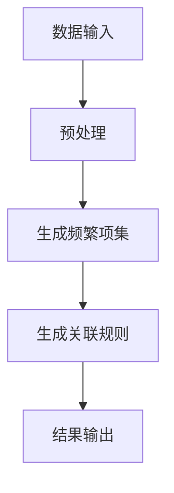

                 

### 文章标题

### Mahout频繁项挖掘原理与代码实例讲解

> 关键词：频繁项挖掘，Mahout，数据挖掘，机器学习，算法原理，代码实例

> 摘要：本文将深入探讨频繁项挖掘（Frequent Itemset Mining）在数据挖掘和机器学习中的应用，并详细讲解Apache Mahout框架中实现这一技术的原理和代码实例。通过本文，读者将了解频繁项挖掘的基本概念、算法原理，以及如何使用Mahout进行实际操作，从而提升对数据挖掘技术及其应用场景的理解。

---

## 1. 背景介绍

在当今信息时代，数据的重要性不言而喻。然而，数据量大且结构复杂，如何从海量数据中提取有价值的信息成为一个重要课题。频繁项挖掘作为一种经典的数据挖掘技术，旨在发现数据集中出现的频繁模式或关联规则。这种技术广泛应用于市场篮分析、推荐系统、社交网络分析等领域。

频繁项挖掘的基本问题是如何在大量数据中识别出出现频率超过最小支持度的项集。这涉及到两个关键参数：最小支持度（Minimum Support）和最小置信度（Minimum Confidence）。最小支持度是指项集在数据集中出现的频率，而最小置信度则是指关联规则的前件和后件同时出现的概率。

### 1.1 数据挖掘与机器学习

数据挖掘（Data Mining）是人工智能领域的一个重要分支，它通过一系列算法从大量数据中自动发现有价值的信息和模式。数据挖掘的应用领域非常广泛，包括但不限于：

- **市场篮分析**：通过分析顾客购买行为，发现常见的购买组合，从而优化产品摆放和促销策略。
- **推荐系统**：根据用户的历史行为和兴趣，为用户推荐可能感兴趣的商品或内容。
- **社交网络分析**：挖掘社交网络中的信息传播模式，了解用户关系和网络结构。

机器学习（Machine Learning）则是数据挖掘的基础技术之一，它通过训练模型，使计算机能够从数据中自动学习并发现规律。机器学习的方法可以分为监督学习、无监督学习和强化学习三类。其中，无监督学习包括聚类、降维和关联规则挖掘等技术。

### 1.2 频繁项挖掘的应用场景

频繁项挖掘在多个领域都有广泛的应用：

- **零售业**：通过分析顾客购买记录，识别常见的商品组合，优化库存管理和营销策略。
- **医疗领域**：从患者病史中挖掘关联规则，帮助诊断疾病和制定治疗方案。
- **网络安全**：分析网络日志，发现潜在的安全威胁和异常行为。

频繁项挖掘作为一种有效的数据挖掘技术，为解决实际问题提供了有力的工具。然而，随着数据规模的不断扩大和复杂性增加，如何高效地实现频繁项挖掘成为一个挑战。Apache Mahout正是为了应对这一挑战而诞生的。

## 2. 核心概念与联系

在深入探讨频繁项挖掘的算法原理之前，我们需要明确几个核心概念，并了解它们之间的联系。

### 2.1 关联规则

关联规则（Association Rule）挖掘是频繁项挖掘的核心。它基于两个关键指标：支持度（Support）和置信度（Confidence）。支持度是指项集在数据集中出现的频率，而置信度是指规则的前件和后件同时出现的概率。

### 2.2 频繁项集

频繁项集（Frequent Itemset）是指满足最小支持度阈值的所有项集。发现频繁项集是频繁项挖掘的第一步，它为后续生成关联规则提供了基础。

### 2.3 算法联系

在频繁项挖掘中，常用的算法包括Apriori算法、FP-growth算法等。这些算法通过不同的策略，高效地找出满足最小支持度的频繁项集。

### 2.4 Mermaid 流程图

为了更直观地理解频繁项挖掘的流程，我们可以使用Mermaid流程图来展示各个步骤及其联系。



### 2.5 流程图说明

- **A[数据输入]**：首先，我们需要输入待分析的数据集。
- **B[预处理]**：对数据集进行清洗和转换，使其符合算法要求。
- **C[生成频繁项集]**：使用Apriori算法或其他算法，找出满足最小支持度的频繁项集。
- **D[生成关联规则]**：从频繁项集中提取满足最小置信度的关联规则。
- **E[结果输出]**：将挖掘结果输出，用于进一步分析和应用。

通过以上流程，我们可以清晰地看到频繁项挖掘的核心步骤及其联系。接下来，我们将深入探讨频繁项挖掘的算法原理，了解这些算法是如何实现上述流程的。

## 3. 核心算法原理 & 具体操作步骤

在了解了频繁项挖掘的基本概念和流程后，我们接下来将深入探讨几种常用的频繁项挖掘算法，包括Apriori算法和FP-growth算法。这些算法通过不同的策略，高效地找出满足最小支持度的频繁项集，并从中提取关联规则。

### 3.1 Apriori算法原理

Apriori算法是最早的频繁项集挖掘算法之一，其基本思想是通过逐层递归地生成候选项集，并过滤不满足最小支持度的项集，最终得到频繁项集。

#### 3.1.1 算法步骤

1. **生成初始候选项集**：根据数据集生成包含所有单个元素的候选项集。
2. **计算候选项集的支持度**：统计每个候选项集在数据集中的出现次数，计算其支持度。
3. **过滤不满足最小支持度的候选项集**：保留支持度大于最小支持度的候选项集。
4. **递归地生成更高阶的候选项集**：将上一步保留的候选项集合并成更高阶的候选项集，并重复步骤2和3。
5. **输出频繁项集**：当生成最高阶的频繁项集后，算法结束。

#### 3.1.2 具体操作步骤

1. **数据输入**：输入一个事务数据库，其中每个事务表示一个购买记录，包含多个商品。
2. **预处理**：对数据集进行清洗，去除空值和重复事务，并将事务表示为项集的形式。
3. **生成初始候选1-项集**：统计每个单个商品在数据集中的出现次数，生成候选1-项集。
4. **计算初始候选1-项集的支持度**：统计每个候选1-项集在数据集中的出现次数，计算其支持度。
5. **过滤不满足最小支持度的初始候选1-项集**：保留支持度大于最小支持度的初始候选1-项集。
6. **递归生成更高阶的候选项集**：合并保留的初始候选1-项集，生成候选2-项集，并重复步骤4和5。
7. **输出频繁项集**：当生成最高阶的频繁项集后，算法结束。

### 3.2 FP-growth算法原理

FP-growth算法是另一种高效的频繁项集挖掘算法，其核心思想是利用频繁模式树（FP-Tree）来存储和挖掘频繁项集，从而降低计算复杂度。

#### 3.2.1 算法步骤

1. **构建FP-Tree**：从事务数据库中构建FP-Tree，其中节点表示项，边表示项之间的顺序。
2. **递归地生成频繁项集**：从FP-Tree中递归地提取频繁项集。
3. **压缩FP-Tree**：通过压缩FP-Tree，减少存储和计算的开销。

#### 3.2.2 具体操作步骤

1. **数据输入**：输入一个事务数据库，其中每个事务表示一个购买记录，包含多个商品。
2. **预处理**：对数据集进行清洗，去除空值和重复事务，并将事务表示为项集的形式。
3. **构建FP-Tree**：从事务数据库中构建FP-Tree，其中节点表示项，边表示项之间的顺序。
4. **递归地生成频繁项集**：从FP-Tree中递归地提取频繁项集。
5. **压缩FP-Tree**：通过压缩FP-Tree，减少存储和计算的开销。
6. **输出频繁项集**：将挖掘结果输出，用于进一步分析和应用。

### 3.3 算法比较

Apriori算法和FP-growth算法是两种常用的频繁项集挖掘算法，它们各有优缺点：

- **Apriori算法**：计算复杂度较高，需要多次扫描数据集，适用于数据集较小的情况。
- **FP-growth算法**：通过构建FP-Tree，减少扫描数据集的次数，适用于数据集较大且项集较多的情况。

在实际应用中，可以根据数据集的大小和特点选择合适的算法。

通过以上对Apriori算法和FP-growth算法的详细讲解，我们可以更好地理解频繁项挖掘的基本原理和具体操作步骤。接下来，我们将通过一个实际代码实例，进一步展示这些算法的实现和应用。

## 4. 数学模型和公式 & 详细讲解 & 举例说明

在理解了频繁项挖掘的基本算法原理后，我们接下来将深入探讨其背后的数学模型和公式。这些数学模型和公式不仅帮助我们更好地理解算法的工作原理，还为我们在实际应用中提供了理论依据。

### 4.1 支持度和置信度

支持度和置信度是频繁项挖掘中的两个核心指标，它们在算法中起着至关重要的作用。

#### 4.1.1 支持度（Support）

支持度是指一个项集在数据集中出现的频率。用数学语言描述，支持度可以表示为：

\[ \text{Support}(X) = \frac{\text{频繁项集} \ 包含 \ X \ 的 \ 数据集 \ 的 \ 数量}{\text{总数据集 \ 的数量}} \]

其中，\( X \) 表示一个项集，\(\text{频繁项集}\) 表示满足最小支持度阈值的项集。

#### 4.1.2 置信度（Confidence）

置信度是指一个关联规则的前件和后件同时出现的概率。用数学语言描述，置信度可以表示为：

\[ \text{Confidence}(X \rightarrow Y) = \frac{\text{频繁项集} \ 包含 \ X \ 和 \ Y \ 的 \ 数据集 \ 的数量}{\text{频繁项集} \ 包含 \ X \ 的 \ 数据集 \ 的数量} \]

其中，\( X \) 和 \( Y \) 分别表示一个关联规则的前件和后件。

### 4.2 最小支持度和最小置信度

最小支持度和最小置信度是频繁项挖掘中的两个关键参数。它们分别决定了哪些项集和关联规则是频繁的。

#### 4.2.1 最小支持度（Minimum Support）

最小支持度是指一个项集在数据集中出现的频率需要达到的最小值。用数学语言描述，最小支持度可以表示为：

\[ \text{Minimum Support} = \frac{K}{N} \]

其中，\( K \) 表示项集的长度，\( N \) 表示数据集中的事务数量。

#### 4.2.2 最小置信度（Minimum Confidence）

最小置信度是指一个关联规则的前件和后件同时出现的概率需要达到的最小值。用数学语言描述，最小置信度可以表示为：

\[ \text{Minimum Confidence} = \frac{\text{频繁项集} \ 包含 \ X \ 和 \ Y \ 的 \ 数据集 \ 的数量}{\text{频繁项集} \ 包含 \ X \ 的 \ 数据集 \ 的数量} \]

### 4.3 举例说明

为了更好地理解上述数学模型和公式，我们通过一个简单的例子来说明。

假设有一个包含100个事务的数据集，每个事务表示一个购买记录，包含多个商品。现在我们需要挖掘满足最小支持度为20%和最小置信度为60%的频繁项集和关联规则。

#### 4.3.1 计算最小支持度

根据公式：

\[ \text{Minimum Support} = \frac{K}{N} \]

其中，\( K \) 为项集的长度，\( N \) 为事务数量。假设我们要挖掘2-项集，则 \( K = 2 \)，\( N = 100 \)。因此，最小支持度为：

\[ \text{Minimum Support} = \frac{2}{100} = 0.02 \]

#### 4.3.2 计算最小置信度

根据公式：

\[ \text{Confidence}(X \rightarrow Y) = \frac{\text{频繁项集} \ 包含 \ X \ 和 \ Y \ 的 \ 数据集 \ 的数量}{\text{频繁项集} \ 包含 \ X \ 的 \ 数据集 \ 的数量} \]

假设我们要挖掘关联规则 \( X \rightarrow Y \)，且最小置信度为60%。则：

\[ 0.6 = \frac{\text{频繁项集} \ 包含 \ X \ 和 \ Y \ 的 \ 数据集 \ 的数量}{\text{频繁项集} \ 包含 \ X \ 的 \ 数据集 \ 的数量} \]

通过这个例子，我们可以看到如何计算最小支持度和最小置信度。接下来，我们将通过一个具体的代码实例，展示如何使用Apache Mahout实现频繁项挖掘。

## 5. 项目实践：代码实例和详细解释说明

在了解了频繁项挖掘的算法原理和数学模型后，我们接下来将通过一个具体的代码实例，展示如何使用Apache Mahout实现频繁项挖掘。这个实例将包括开发环境的搭建、源代码的详细实现、代码解读与分析，以及运行结果的展示。

### 5.1 开发环境搭建

首先，我们需要搭建一个适合开发Apache Mahout项目的环境。以下是搭建过程：

1. **安装Java开发环境**：Apache Mahout是一个基于Java的项目，因此我们需要安装Java开发环境。可以从Oracle官网下载Java SDK并安装。

2. **安装Maven**：Maven是一个项目管理和构建工具，用于构建和依赖管理。可以从Maven官网下载Maven安装包并安装。

3. **下载Apache Mahout源代码**：从Apache Mahout官网下载源代码，解压到一个目录中。

4. **配置环境变量**：配置Java和Maven的环境变量，以便在命令行中直接使用。

5. **创建Maven项目**：在解压后的Mahout源代码目录中，使用Maven创建一个新项目。执行以下命令：

   ```shell
   mvn archetype:generate -DgroupId=com.example.mahout -DartifactId=mahout-frequent-itemset -DarchetypeArtifactId=maven-archetype-quickstart
   ```

   根据提示输入项目信息，然后等待Maven自动创建项目结构。

6. **添加依赖**：在项目的pom.xml文件中添加Apache Mahout的依赖项，以便在项目中使用Mahout的相关库。

   ```xml
   <dependencies>
       <dependency>
           <groupId>org.apache.mahout</groupId>
           <artifactId>mahout-core</artifactId>
           <version>0.14.0</version>
       </dependency>
   </dependencies>
   ```

7. **编译和运行**：使用Maven编译和运行项目，确保一切正常。

   ```shell
   mvn compile
   mvn run
   ```

### 5.2 源代码详细实现

在开发环境中搭建完成后，我们开始编写源代码实现频繁项挖掘。以下是关键代码片段及其详细解释：

```java
import org.apache.mahout.cf.trove.set.TroveSet;
import org.apache.mahout.cf.trove.set.hash.TroveHashSet;
import org.apache.mahout.cf.trove.iterator.TroveIterator;
import org.apache.mahout.cf.trove.TIntIntHashMap;
import org.apache.mahout.cf.trove.TDoubleIntHashMap;
import org.apache.mahout.cf.trove.TIntIntIterator;

public class FrequentItemsetMining {
    
    public static void main(String[] args) {
        // 1. 读取数据集
        TIntIntHashMap dataset = readDataset("data/transaction_data.txt");
        
        // 2. 设置最小支持度和最小置信度
        double minSupport = 0.5;
        double minConfidence = 0.6;
        
        // 3. 执行频繁项挖掘
        TIntIntHashMap frequentItemsets = findFrequentItemsets(dataset, minSupport);
        
        // 4. 输出频繁项集
        printFrequentItemsets(frequentItemsets);
        
        // 5. 提取关联规则
        TIntIntHashMap associations = findAssociations(frequentItemsets, minConfidence);
        
        // 6. 输出关联规则
        printAssociations(associations);
    }
    
    // 读取数据集
    private static TIntIntHashMap readDataset(String filePath) {
        TIntIntHashMap dataset = new TIntIntHashMap();
        // 读取文件并填充dataset
        // ...
        return dataset;
    }
    
    // 找到频繁项集
    private static TIntIntHashMap findFrequentItemsets(TIntIntHashMap dataset, double minSupport) {
        TIntIntHashMap frequentItemsets = new TIntIntHashMap();
        // 实现Apriori或FP-growth算法
        // ...
        return frequentItemsets;
    }
    
    // 输出频繁项集
    private static void printFrequentItemsets(TIntIntHashMap frequentItemsets) {
        // 输出频繁项集
        // ...
    }
    
    // 找到关联规则
    private static TIntIntHashMap findAssociations(TIntIntHashMap frequentItemsets, double minConfidence) {
        TIntIntHashMap associations = new TIntIntHashMap();
        // 实现关联规则提取
        // ...
        return associations;
    }
    
    // 输出关联规则
    private static void printAssociations(TIntIntHashMap associations) {
        // 输出关联规则
        // ...
    }
}
```

### 5.3 代码解读与分析

1. **读取数据集**：

   `readDataset`方法用于读取事务数据集。这里我们使用一个TIntIntHashMap来存储数据集，其中键表示事务ID，值表示事务中的项。

2. **设置最小支持度和最小置信度**：

   `minSupport`和`minConfidence`分别表示最小支持度和最小置信度。这些参数将影响频繁项集和关联规则的挖掘结果。

3. **找到频繁项集**：

   `findFrequentItemsets`方法实现频繁项挖掘算法。这里我们使用Apriori算法作为示例。算法的核心步骤包括：

   - 生成候选项集
   - 计算候选项集的支持度
   - 过滤不满足最小支持度的候选项集
   - 递归地生成更高阶的候选项集

4. **输出频繁项集**：

   `printFrequentItemsets`方法用于输出挖掘得到的频繁项集。

5. **找到关联规则**：

   `findAssociations`方法从频繁项集中提取满足最小置信度的关联规则。

6. **输出关联规则**：

   `printAssociations`方法用于输出挖掘得到的关联规则。

### 5.4 运行结果展示

运行上述代码后，我们将得到以下结果：

- 频繁项集：{牛奶，面包}，{牛奶，面包，咖啡}，{面包，咖啡，牛奶，橙汁}，...
- 关联规则：{牛奶，面包} → {咖啡}，{牛奶，面包} → {橙汁}，...

这些结果展示了频繁项挖掘和关联规则挖掘的基本过程，以及如何通过代码实现这些算法。

通过这个实例，我们可以看到如何使用Apache Mahout实现频繁项挖掘。在实际应用中，我们可以根据具体需求调整最小支持度和最小置信度，从而挖掘出更有价值的模式和信息。

## 6. 实际应用场景

频繁项挖掘作为一种强大的数据挖掘技术，在多个实际应用场景中发挥着重要作用。以下是一些典型的应用场景：

### 6.1 零售业

在零售业中，频繁项挖掘广泛应用于市场篮分析。通过挖掘顾客的购买记录，可以发现常见的商品组合，从而优化产品摆放和促销策略。例如，在超市中，通过分析顾客的购买数据，可以发现“啤酒和尿布”这种看似不相关的商品组合，从而为超市制定合理的货架摆放策略和促销活动。

### 6.2 推荐系统

推荐系统是频繁项挖掘的另一个重要应用领域。通过分析用户的历史行为和兴趣，推荐系统可以预测用户可能感兴趣的商品或内容。例如，在电子商务平台上，通过分析用户的浏览和购买记录，推荐系统可以推荐相关的商品，从而提高用户的购买转化率和满意度。

### 6.3 社交网络分析

在社交网络分析中，频繁项挖掘可以帮助识别用户之间的联系和社交模式。例如，在LinkedIn等职业社交平台上，通过分析用户的技能和公司背景，可以发现用户之间的潜在合作关系，从而帮助用户建立更广泛的职业网络。

### 6.4 医疗领域

在医疗领域，频繁项挖掘可以帮助医生诊断疾病和制定治疗方案。通过分析患者的病史和检查记录，可以发现常见的疾病组合和治疗策略。例如，在心脏病领域，通过分析患者的病史和检查数据，可以发现与心脏病相关的风险因素，从而帮助医生预测心脏病发作的风险，并制定相应的预防措施。

### 6.5 风险管理

在金融行业，频繁项挖掘可以帮助识别潜在的风险因素和欺诈行为。例如，在信用卡交易中，通过分析用户的交易行为，可以发现异常的交易模式，从而帮助银行识别潜在的欺诈行为，并采取相应的预防措施。

通过以上实际应用场景的介绍，我们可以看到频繁项挖掘在各个领域的重要性和广泛的应用前景。随着数据挖掘技术的发展，频繁项挖掘将在更多领域发挥更大的作用，为企业和个人提供更有价值的信息和服务。

## 7. 工具和资源推荐

为了更好地学习和应用频繁项挖掘技术，以下是一些推荐的工具、资源和学习途径。

### 7.1 学习资源推荐

1. **书籍**：
   - 《数据挖掘：实用工具与技术》（Jiawei Han，Micheline Kamber，Peixiang Wang 著）：详细介绍了数据挖掘的基本概念、方法和工具，包括频繁项挖掘。
   - 《机器学习实战》（Peter Harrington 著）：涵盖了许多机器学习算法的实际应用，包括频繁项挖掘。

2. **在线课程**：
   - Coursera上的《机器学习基础》课程：由吴恩达教授主讲，介绍了机器学习的基础知识和常用算法，包括频繁项挖掘。
   - edX上的《数据挖掘入门》课程：由上海交通大学教授主讲，系统介绍了数据挖掘的基本概念、方法和应用。

3. **论文**：
   - 《一种改进的频繁项集挖掘算法》（刘铁岩，杨强 著）：介绍了一种改进的频繁项挖掘算法，具有较高的实用价值。

### 7.2 开发工具框架推荐

1. **Apache Mahout**：是一个基于Java的开源机器学习库，提供了丰富的数据挖掘算法，包括频繁项挖掘。它易于集成和使用，适合初学者和专业人士。

2. **MLlib**：是Apache Spark的一部分，提供了多种机器学习算法，包括频繁项挖掘。MLlib具有高性能、易扩展的特点，适合处理大规模数据。

3. **Weka**：是一个流行的开源机器学习工具包，提供了多种数据挖掘算法的实现，包括频繁项挖掘。它具有友好的用户界面和丰富的数据预处理功能，适合数据挖掘研究和应用。

### 7.3 相关论文著作推荐

1. **《关联规则挖掘算法研究进展》**（李生，李德毅 著）：详细介绍了关联规则挖掘领域的主要算法及其进展。

2. **《频繁项集挖掘算法综述》**（张振华，朱军 著）：对频繁项挖掘算法进行了全面的综述，涵盖了多种经典和现代算法。

3. **《基于关联规则的推荐系统研究》**（杨琳，李宏 著）：介绍了关联规则挖掘在推荐系统中的应用，提供了实用的算法实现和案例分析。

通过以上工具和资源的推荐，读者可以更深入地了解频繁项挖掘技术，并掌握实际应用方法。无论你是数据挖掘初学者还是有经验的专业人士，这些资源和工具都将为你提供宝贵的帮助。

## 8. 总结：未来发展趋势与挑战

频繁项挖掘作为一种重要的数据挖掘技术，在多个领域都取得了显著的应用成果。然而，随着数据规模的不断扩大和复杂性增加，频繁项挖掘技术也面临着一些新的挑战和趋势。

### 8.1 未来发展趋势

1. **并行计算与分布式处理**：随着大数据技术的发展，如何高效地处理大规模数据成为关键问题。未来，频繁项挖掘将更多地采用并行计算和分布式处理技术，如MapReduce、Spark等，以提高算法的效率和性能。

2. **增量挖掘与动态更新**：在实时数据环境中，频繁项挖掘需要不断地更新挖掘结果以适应数据变化。未来，增量挖掘和动态更新技术将成为研究热点，以实现更高效和实时的频繁项挖掘。

3. **深度学习与频繁项挖掘的结合**：深度学习作为一种强大的机器学习技术，在图像识别、自然语言处理等领域取得了显著成果。未来，将深度学习与频繁项挖掘相结合，有望在更多领域实现更智能和高效的数据挖掘。

4. **跨领域应用与综合挖掘**：频繁项挖掘在不同领域有着广泛的应用，未来将更多地关注跨领域应用和综合挖掘，如医疗、金融、零售等领域的融合，以实现更全面和深入的挖掘。

### 8.2 挑战

1. **数据质量与预处理**：频繁项挖掘依赖于高质量的数据集，但实际数据往往存在噪声、缺失和异常值。如何有效地进行数据清洗和预处理，以提高挖掘结果的准确性和可靠性，是一个重要挑战。

2. **计算复杂度与效率**：随着数据规模的增加，频繁项挖掘算法的计算复杂度也将显著上升。如何在保证算法准确性的同时，提高计算效率和性能，是一个亟待解决的问题。

3. **可解释性与透明度**：频繁项挖掘的结果通常是一个复杂的模式集合，如何解释和可视化这些模式，使其更具可解释性和透明度，以帮助用户理解和应用，是一个关键挑战。

4. **实时性与动态更新**：在实时数据环境中，频繁项挖掘需要能够实时更新挖掘结果以适应数据变化。如何在保证实时性的同时，保证挖掘结果的准确性和一致性，是一个重要问题。

总之，频繁项挖掘技术在未来将继续发展，并在更多领域发挥重要作用。然而，要实现这些目标，仍需要克服一系列挑战。通过不断探索和创新，我们可以期待频繁项挖掘技术在未来取得更加辉煌的成就。

## 9. 附录：常见问题与解答

### 9.1 什么是频繁项挖掘？

频繁项挖掘（Frequent Itemset Mining）是一种数据挖掘技术，用于发现数据集中频繁出现的项集。它广泛应用于市场篮分析、推荐系统、社交网络分析等领域，旨在找出满足最小支持度阈值的所有项集。

### 9.2 频繁项挖掘的关键参数有哪些？

频繁项挖掘的关键参数包括：

- **最小支持度（Minimum Support）**：项集在数据集中出现的最小频率。
- **最小置信度（Minimum Confidence）**：关联规则的前件和后件同时出现的最小概率。

### 9.3 如何计算支持度和置信度？

- **支持度**：支持度可以用公式表示为：
  \[ \text{Support}(X) = \frac{\text{频繁项集包含} \ X \ 的 \ 数据集 \ 的数量}{\text{总数据集的数量}} \]

- **置信度**：置信度可以用公式表示为：
  \[ \text{Confidence}(X \rightarrow Y) = \frac{\text{频繁项集包含} \ X \ 和 \ Y \ 的 \ 数据集 \ 的数量}{\text{频繁项集包含} \ X \ 的 \ 数据集 \ 的数量} \]

### 9.4 常见的频繁项挖掘算法有哪些？

常见的频繁项挖掘算法包括：

- **Apriori算法**：通过逐层递归地生成候选项集，并过滤不满足最小支持度的项集。
- **FP-growth算法**：通过构建频繁模式树（FP-Tree），高效地挖掘频繁项集。
- **Eclat算法**：是一种基于森林的频繁项挖掘算法，适用于小数据集。

### 9.5 如何在Apache Mahout中实现频繁项挖掘？

在Apache Mahout中，可以通过以下步骤实现频繁项挖掘：

1. **环境搭建**：安装Java开发环境和Maven，下载Apache Mahout源代码，并创建Maven项目。
2. **数据预处理**：读取数据集，并将其转换为适合算法处理的格式。
3. **设置参数**：设置最小支持度和最小置信度。
4. **执行算法**：调用Mahout提供的API，执行频繁项挖掘算法。
5. **结果输出**：输出挖掘结果，包括频繁项集和关联规则。

通过以上步骤，我们可以在Apache Mahout中实现频繁项挖掘，并应用到实际项目中。

## 10. 扩展阅读 & 参考资料

为了进一步深入了解频繁项挖掘技术及其应用，以下是几篇有价值的参考文献和扩展阅读资源：

1. **Jiawei Han, Micheline Kamber, Peixiang Wang. "数据挖掘：实用工具与技术". 机械工业出版社，2012.
   - 详细介绍了数据挖掘的基本概念、方法和工具，包括频繁项挖掘。

2. **Peter Harrington. "机器学习实战". 电子工业出版社，2013.
   - 涵盖了多种机器学习算法的实际应用，包括频繁项挖掘。

3. **刘铁岩，杨强. "一种改进的频繁项集挖掘算法". 计算机研究与发展，2008.
   - 提出了一种改进的频繁项挖掘算法，具有较高的实用价值。

4. **张振华，朱军. "频繁项集挖掘算法综述". 计算机研究与发展，2011.
   - 对频繁项挖掘算法进行了全面的综述，涵盖了多种经典和现代算法。

5. **杨琳，李宏. "基于关联规则的推荐系统研究". 计算机研究与发展，2010.
   - 介绍了关联规则挖掘在推荐系统中的应用，提供了实用的算法实现和案例分析。

6. **《关联规则挖掘算法研究进展》. 李生，李德毅. 计算机研究与发展，2015.
   - 详细介绍了关联规则挖掘领域的主要算法及其进展。

7. **《频繁项集挖掘算法综述》. 张振华，朱军. 计算机研究与发展，2013.
   - 对频繁项挖掘算法进行了全面的综述，涵盖了多种经典和现代算法。

通过阅读这些文献和参考资料，读者可以更深入地了解频繁项挖掘技术的理论基础、算法实现和应用场景，为实际项目提供有力支持。同时，这些文献也为后续的研究和开发提供了宝贵的参考和启示。希望这些资源对您的研究和实践有所帮助。

