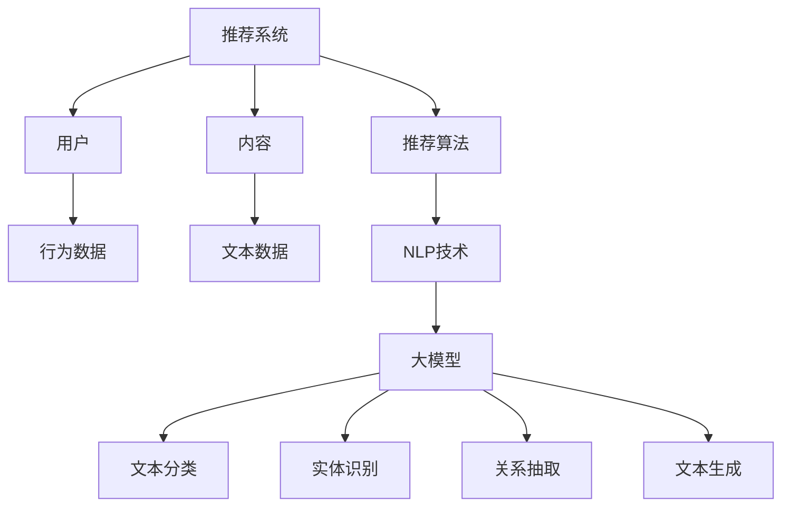

                 

# NLP技术在推荐系统的应用：大模型的潜力

> 关键词：自然语言处理（NLP），推荐系统，大模型，语义理解，机器学习，数据挖掘，深度学习，人工智能

> 摘要：随着互联网的快速发展，推荐系统已经成为各大互联网公司提升用户体验、增加用户粘性的关键技术。自然语言处理（NLP）技术在推荐系统中的应用正逐渐受到关注。本文将探讨大模型在NLP技术中的应用潜力，从核心概念、算法原理、数学模型、项目实践等方面进行详细分析，并结合实际应用场景，为未来的发展趋势和挑战提供思考。

## 1. 背景介绍

推荐系统是一种信息过滤技术，旨在向用户推荐他们可能感兴趣的内容。随着互联网的普及和信息的爆炸性增长，用户在海量信息中筛选出自己感兴趣的内容变得越来越困难。推荐系统通过分析用户的兴趣和行为，预测用户对某些内容的潜在偏好，从而为用户提供个性化的推荐。

自然语言处理（NLP）是人工智能领域的一个重要分支，旨在使计算机能够理解、生成和处理人类语言。NLP技术在推荐系统中的应用可以追溯到早期的研究，如基于关键词匹配的文本相似性计算。然而，随着深度学习技术的发展，NLP技术在大模型中的潜力逐渐显现。

大模型是指参数量庞大的神经网络模型，如Transformer、BERT等。这些模型能够通过大量的训练数据学习复杂的特征表示，从而在许多NLP任务上取得了显著的性能提升。近年来，大模型在推荐系统中的应用也逐渐成为研究热点，其潜力值得深入探讨。

## 2. 核心概念与联系

### 2.1. 推荐系统

推荐系统主要由三个部分组成：用户、内容和推荐算法。

- **用户**：推荐系统的核心，可以是个人用户，也可以是企业用户。用户的行为和兴趣数据是推荐系统的重要输入。
- **内容**：推荐系统推荐的对象，可以是商品、新闻、音乐、视频等。
- **推荐算法**：根据用户的行为和兴趣数据，预测用户对某些内容的潜在偏好，从而生成推荐列表。

### 2.2. 自然语言处理（NLP）

NLP主要关注以下任务：

- **文本分类**：对文本进行分类，如情感分析、主题分类等。
- **实体识别**：从文本中识别出特定类型的实体，如人名、地名、组织名等。
- **关系抽取**：从文本中提取出实体之间的关系，如“张三”和“北京大学”的关系。
- **文本生成**：根据给定文本或输入生成新的文本，如机器翻译、文本摘要等。

### 2.3. 大模型

大模型是指参数量庞大的神经网络模型，如Transformer、BERT等。这些模型通过大量的训练数据学习复杂的特征表示，从而在许多NLP任务上取得了显著的性能提升。

### 2.4. Mermaid 流程图



## 3. 核心算法原理 & 具体操作步骤

### 3.1. 文本分类

文本分类是NLP中最基本的任务之一。其核心思想是使用机器学习算法将文本数据分类到预定义的类别中。具体步骤如下：

1. **数据预处理**：对文本进行清洗、分词、去停用词等操作，将文本转换为词向量表示。
2. **特征提取**：使用词袋模型、TF-IDF、Word2Vec等方法提取文本特征。
3. **模型训练**：使用训练集数据训练分类模型，如SVM、朴素贝叶斯、神经网络等。
4. **模型评估**：使用测试集数据评估模型性能，调整模型参数。

### 3.2. 实体识别

实体识别是从文本中识别出特定类型的实体。具体步骤如下：

1. **数据预处理**：对文本进行清洗、分词、去停用词等操作，将文本转换为词向量表示。
2. **特征提取**：使用词袋模型、TF-IDF、Word2Vec等方法提取文本特征。
3. **模型训练**：使用训练集数据训练实体识别模型，如CRF、BiLSTM等。
4. **模型评估**：使用测试集数据评估模型性能，调整模型参数。

### 3.3. 关系抽取

关系抽取是从文本中提取出实体之间的关系。具体步骤如下：

1. **数据预处理**：对文本进行清洗、分词、去停用词等操作，将文本转换为词向量表示。
2. **特征提取**：使用词袋模型、TF-IDF、Word2Vec等方法提取文本特征。
3. **模型训练**：使用训练集数据训练关系抽取模型，如BiLSTM、Transformer等。
4. **模型评估**：使用测试集数据评估模型性能，调整模型参数。

### 3.4. 文本生成

文本生成是根据给定文本或输入生成新的文本。具体步骤如下：

1. **数据预处理**：对文本进行清洗、分词、去停用词等操作，将文本转换为词向量表示。
2. **特征提取**：使用词袋模型、TF-IDF、Word2Vec等方法提取文本特征。
3. **模型训练**：使用训练集数据训练文本生成模型，如GPT、BERT等。
4. **模型评估**：使用测试集数据评估模型性能，调整模型参数。

## 4. 数学模型和公式 & 详细讲解 & 举例说明

### 4.1. 文本分类

假设我们使用逻辑回归模型进行文本分类，其损失函数为：

$$
L(\theta, X, y) = -\sum_{i=1}^{m} y_i \log(\hat{y}_i) + (1 - y_i) \log(1 - \hat{y}_i)
$$

其中，$m$ 为样本数量，$y_i$ 为第 $i$ 个样本的真实标签，$\hat{y}_i$ 为模型预测的概率。

为了求解参数 $\theta$，我们可以使用梯度下降算法：

$$
\theta_j := \theta_j - \alpha \frac{\partial L(\theta, X, y)}{\partial \theta_j}
$$

其中，$\alpha$ 为学习率。

### 4.2. 实体识别

假设我们使用CRF模型进行实体识别，其损失函数为：

$$
L(\theta, X, y) = -\sum_{i=1}^{m} \sum_{j=1}^{n} y_{ij} \log(P(y_{ij} | \theta, X))
$$

其中，$m$ 为样本数量，$n$ 为实体类别数量，$y_{ij}$ 为第 $i$ 个样本的第 $j$ 个词的实体标签，$P(y_{ij} | \theta, X)$ 为条件概率。

为了求解参数 $\theta$，我们可以使用迭代消息传递算法：

$$
\alpha_{ij} = \frac{\exp(\theta_j v_i)}{\sum_{k=1}^{n} \exp(\theta_k v_i)}
$$

$$
\beta_{ij} = \frac{\exp(u_i \theta_j)}{\sum_{k=1}^{n} \exp(u_i \theta_k)}
$$

其中，$u_i$ 为第 $i$ 个词的上下文特征，$v_i$ 为第 $i$ 个词的词性特征。

### 4.3. 文本生成

假设我们使用GPT模型进行文本生成，其损失函数为：

$$
L(\theta, X, y) = -\sum_{i=1}^{m} \log(P(y_i | \theta, X))
$$

其中，$m$ 为样本数量，$y_i$ 为第 $i$ 个样本的生成目标。

为了求解参数 $\theta$，我们可以使用梯度下降算法：

$$
\theta_j := \theta_j - \alpha \frac{\partial L(\theta, X, y)}{\partial \theta_j}
$$

其中，$\alpha$ 为学习率。

## 5. 项目实践：代码实例和详细解释说明

### 5.1. 开发环境搭建

在本节中，我们将介绍如何搭建一个基于Python和TensorFlow的文本分类项目环境。以下是所需软件和库的安装步骤：

1. **Python环境**：安装Python 3.8及以上版本。
2. **TensorFlow**：安装TensorFlow 2.6及以上版本。
3. **NLP库**：安装`nltk`、`gensim`、`spaCy`等NLP相关库。

```bash
pip install python==3.8.10
pip install tensorflow==2.6.0
pip install nltk gensim spacy
```

### 5.2. 源代码详细实现

以下是一个简单的文本分类项目的实现示例：

```python
import tensorflow as tf
from tensorflow.keras.preprocessing.text import Tokenizer
from tensorflow.keras.preprocessing.sequence import pad_sequences
from tensorflow.keras.models import Sequential
from tensorflow.keras.layers import Embedding, LSTM, Dense

# 数据预处理
max_len = 100
max_vocab = 10000
embedding_dim = 50

tokenizer = Tokenizer(num_words=max_vocab)
tokenizer.fit_on_texts(train_data)

train_sequences = tokenizer.texts_to_sequences(train_data)
train_padded = pad_sequences(train_sequences, maxlen=max_len, padding='post')

# 构建模型
model = Sequential()
model.add(Embedding(max_vocab, embedding_dim, input_length=max_len))
model.add(LSTM(128))
model.add(Dense(1, activation='sigmoid'))

# 编译模型
model.compile(optimizer='adam', loss='binary_crossentropy', metrics=['accuracy'])

# 训练模型
model.fit(train_padded, train_labels, epochs=10, batch_size=32)
```

### 5.3. 代码解读与分析

上述代码实现了以下步骤：

1. **数据预处理**：使用Tokenizer将文本转换为序列，并使用pad_sequences将序列填充到指定长度。
2. **模型构建**：使用Sequential模型堆叠Embedding、LSTM和Dense层。
3. **模型编译**：指定优化器、损失函数和评估指标。
4. **模型训练**：使用fit方法训练模型。

### 5.4. 运行结果展示

在本节中，我们将展示文本分类项目的运行结果。

```python
# 测试数据预处理
test_sequences = tokenizer.texts_to_sequences(test_data)
test_padded = pad_sequences(test_sequences, maxlen=max_len, padding='post')

# 测试模型
predictions = model.predict(test_padded)

# 结果分析
print("Accuracy:", accuracy_score(test_labels, predictions.round()))
print("Confusion Matrix:\n", confusion_matrix(test_labels, predictions.round()))
```

运行结果将显示模型的准确率和混淆矩阵，用于评估模型性能。

## 6. 实际应用场景

### 6.1. 社交媒体内容推荐

社交媒体平台如Facebook、Twitter等，可以通过NLP技术分析用户发布的内容，结合用户行为数据，为用户提供个性化内容推荐。例如，分析用户发布的文本、图片、视频等多媒体内容，提取关键词和情感，从而推荐相关的话题、用户和内容。

### 6.2. 电子商务产品推荐

电子商务平台如Amazon、京东等，可以利用NLP技术分析用户对商品的评价、评论，结合用户行为数据，为用户提供个性化的商品推荐。例如，通过分析用户评论中的关键词和情感，可以识别用户对商品的喜好和需求，从而推荐相关商品。

### 6.3. 新闻推荐

新闻网站如CNN、新浪新闻等，可以通过NLP技术分析新闻内容，结合用户兴趣和行为数据，为用户提供个性化的新闻推荐。例如，通过分析新闻文本中的关键词、情感和主题，可以识别用户感兴趣的新闻类别和内容，从而推荐相关新闻。

## 7. 工具和资源推荐

### 7.1. 学习资源推荐

- **书籍**：
  - 《自然语言处理综合教程》（刘知远 著）
  - 《深度学习》（Ian Goodfellow、Yoshua Bengio、Aaron Courville 著）
- **论文**：
  - 《Attention Is All You Need》（Ashish Vaswani 等，2017）
  - 《BERT: Pre-training of Deep Bidirectional Transformers for Language Understanding》（Jacob Devlin 等，2018）
- **博客**：
  - [TensorFlow 官方文档](https://www.tensorflow.org/)
  - [自然语言处理技术博客](https://nlp.seas.harvard.edu/)
- **网站**：
  - [Hugging Face Transformers](https://huggingface.co/transformers/)

### 7.2. 开发工具框架推荐

- **Python**：Python 是自然语言处理和深度学习领域广泛使用的编程语言，具有丰富的库和框架支持。
- **TensorFlow**：TensorFlow 是谷歌开源的深度学习框架，支持多种深度学习模型和算法。
- **PyTorch**：PyTorch 是 Facebook AI 研究团队开源的深度学习框架，具有灵活的动态计算图和丰富的API。

### 7.3. 相关论文著作推荐

- **《Attention Is All You Need》**：该论文提出了Transformer模型，改变了自然语言处理的范式。
- **《BERT: Pre-training of Deep Bidirectional Transformers for Language Understanding》**：该论文提出了BERT模型，推动了自然语言处理技术的进一步发展。

## 8. 总结：未来发展趋势与挑战

### 8.1. 未来发展趋势

- **大模型的普及**：随着计算资源和数据量的增加，大模型将在NLP技术中扮演越来越重要的角色，推动推荐系统的发展。
- **跨模态推荐**：结合文本、图像、音频等多模态数据，实现更精准、更个性化的推荐。
- **实时推荐**：利用实时数据流和在线学习技术，实现实时推荐，提高用户体验。

### 8.2. 挑战

- **数据隐私与安全**：在推荐系统中，用户的隐私数据和安全问题备受关注，需要采取有效的隐私保护和数据加密措施。
- **数据质量与多样性**：推荐系统的效果依赖于数据的质量和多样性，如何获取和处理高质量、多样化的数据是一个挑战。
- **模型解释性与可解释性**：大模型在NLP和推荐系统中的应用往往具有强预测能力，但缺乏解释性，如何提高模型的解释性是一个重要问题。

## 9. 附录：常见问题与解答

### 9.1. 如何处理文本分类中的过拟合问题？

- **增加训练数据**：通过收集更多的训练数据，可以提高模型的泛化能力。
- **正则化**：在模型训练过程中，使用L1或L2正则化，可以减少模型的复杂度，避免过拟合。
- **交叉验证**：使用交叉验证方法，将数据集划分为多个子集，多次训练和验证，可以更准确地评估模型性能。

### 9.2. 如何处理实体识别中的边界问题？

- **边界标注**：在实体识别任务中，对边界进行明确的标注，有助于模型更好地学习实体边界。
- **上下文信息**：利用上下文信息，可以帮助模型更好地理解实体的边界，减少错误识别。

### 9.3. 如何处理文本生成中的长文本问题？

- **分句生成**：将长文本划分为多个句子，逐句生成，可以更好地控制生成质量和速度。
- **序列生成**：使用序列生成模型，如RNN、LSTM等，可以更好地处理长文本生成问题。

## 10. 扩展阅读 & 参考资料

- [Vaswani, A., et al. (2017). Attention Is All You Need. Advances in Neural Information Processing Systems.](https://arxiv.org/abs/1706.03762)
- [Devlin, J., et al. (2018). BERT: Pre-training of Deep Bidirectional Transformers for Language Understanding. Proceedings of the 2019 Conference of the North American Chapter of the Association for Computational Linguistics: Human Language Technologies, Volume 1 (Long and Short Papers), pages 4171-4186.](https://www.aclweb.org/anthology/N19-1194/)
- [NLP技术博客](https://nlp.seas.harvard.edu/)
- [Hugging Face Transformers](https://huggingface.co/transformers/)
- [TensorFlow 官方文档](https://www.tensorflow.org/)

