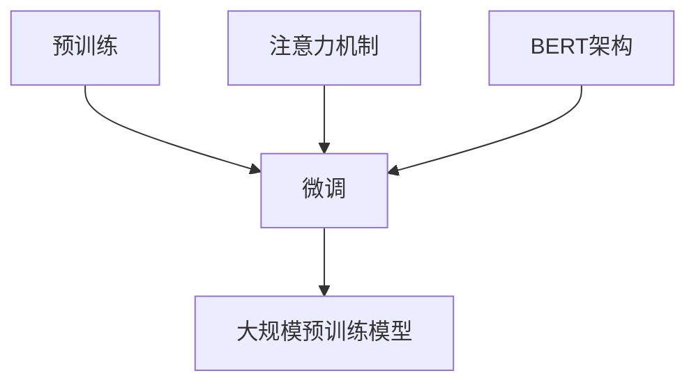

                 

关键词：自然语言处理、大模型、参数优化、应用场景、NLP模型

摘要：本文旨在梳理自然语言处理（NLP）领域中大型模型的标准，包括参数优化、能力拓展和应用场景。通过深入研究NLP大模型的设计理念、数学模型、算法原理及其应用，我们希望能为读者提供全面的技术参考和未来发展方向的见解。

## 1. 背景介绍

自然语言处理（NLP）作为人工智能（AI）的核心领域之一，近年来取得了显著进展。随着深度学习技术的普及，基于大规模预训练模型的方法在文本分类、机器翻译、问答系统等多个NLP任务中取得了突破性成果。然而，NLP领域的大模型不仅要求高性能的计算资源，还面临参数优化、能力拓展和应用场景选择等多方面的挑战。

本文将首先介绍NLP大模型的背景和发展历程，然后深入探讨其核心参数、能力与应用场景，以期为NLP研究和应用提供系统性指导。

### 1.1 NLP大模型的发展历程

NLP大模型的发展可以分为以下几个阶段：

- **传统模型阶段**：以统计模型和规则方法为主，如朴素贝叶斯、最大熵模型、隐马尔可夫模型（HMM）等。这些模型基于手工设计的特征和规则，虽然效果有限，但为后续发展奠定了基础。
  
- **统计学习阶段**：随着机器学习算法的兴起，支持向量机（SVM）、条件随机场（CRF）等算法在NLP任务中取得了较好效果。这一阶段模型开始采用更多的特征工程方法，但仍受到特征提取和模型复杂性的限制。

- **深度学习阶段**：深度学习技术的引入，尤其是卷积神经网络（CNN）和循环神经网络（RNN）的应用，使得NLP模型取得了显著提升。2018年，GPT-2的发布标志着NLP领域进入大规模预训练模型时代。

- **大规模预训练模型阶段**：这一阶段以GPT-3、BERT、T5等为代表，模型规模达到数十亿甚至千亿级别，通过无监督预训练和有监督微调，模型在多个NLP任务中取得了前所未有的效果。

### 1.2 NLP大模型的需求

NLP大模型的需求主要源于以下三个方面：

- **数据量需求**：大规模预训练模型需要大量的文本数据作为训练材料，以捕捉丰富的语言模式。这要求数据源具有足够的多样性和质量。

- **计算资源需求**：大规模模型的训练和推理需要高性能计算资源，尤其是GPU和TPU等专用硬件。此外，分布式训练和并行计算技术的发展，也大大降低了训练成本。

- **参数优化需求**：随着模型规模的扩大，参数优化成为关键。如何在保证模型性能的同时，降低过拟合风险，提高泛化能力，是NLP大模型面临的重大挑战。

## 2. 核心概念与联系

为了更好地理解NLP大模型，我们需要掌握以下几个核心概念：

- **预训练**：预训练是指在大规模语料库上，通过无监督学习的方式，对模型进行初步训练，使其具备基础的语言理解和生成能力。

- **微调**：微调是指在预训练的基础上，针对特定任务进行有监督的调整，以优化模型在目标任务上的性能。

- **注意力机制**：注意力机制是一种通过动态调整模型对输入序列的权重分配，从而提高模型处理长序列的能力。

- **BERT**：BERT（Bidirectional Encoder Representations from Transformers）是由Google提出的一种大规模预训练语言模型，通过双向Transformer结构，实现了对文本的全局语义理解。

下面是NLP大模型核心概念和架构的Mermaid流程图：



### 2.1 预训练

预训练是NLP大模型的核心环节，通过在大量文本数据上训练，模型可以自动学习到丰富的语言特征。预训练通常分为两个阶段：

- **遮蔽语言模型（Masked Language Model, MLM）**：在预训练过程中，对输入文本的部分单词进行遮蔽，然后让模型预测这些遮蔽的单词。
  
- **下一句预测（Next Sentence Prediction, NSP）**：通过预测文本中的下一句，增强模型对上下文的理解能力。

### 2.2 微调

微调是在预训练模型的基础上，针对特定任务进行有监督的训练。微调的关键在于：

- **任务定义**：将目标任务转化为模型可处理的格式，如分类、序列标注等。
  
- **数据预处理**：对目标任务数据进行预处理，包括分词、去噪等操作。

- **模型调整**：通过调整模型的参数，优化模型在目标任务上的性能。

### 2.3 注意力机制

注意力机制是NLP模型中的一种重要机制，用于动态调整模型对输入序列的权重分配。在Transformer架构中，注意力机制通过计算不同位置的相似度，实现对长序列的有效处理。

### 2.4 BERT架构

BERT（Bidirectional Encoder Representations from Transformers）是由Google提出的一种大规模预训练语言模型，其核心架构包括：

- **Transformer编码器**：通过多层Transformer结构，实现文本的全局语义理解。
  
- **掩码机制**：在预训练过程中，对输入文本的部分单词进行遮蔽，增强模型对上下文的理解能力。

- **BERT模型应用**：BERT模型在多个NLP任务中取得了显著效果，包括文本分类、问答系统、机器翻译等。

## 3. 核心算法原理 & 具体操作步骤

### 3.1 算法原理概述

NLP大模型的核心算法基于深度学习和变换器架构（Transformer），该架构在计算序列模型时具有高效性和灵活性。下面将详细描述Transformer架构的原理。

### 3.2 算法步骤详解

#### 3.2.1 Encoder部分

1. **输入嵌入**：将输入文本转化为向量，包括词嵌入（Word Embedding）和位置嵌入（Position Embedding）。

2. **多层Transformer编码器**：通过多层自注意力机制（Self-Attention）和前馈神经网络（Feedforward Neural Network），逐层提取文本的语义特征。

3. **输出层**：编码器的最后一层输出，作为文本的固定长度的表示。

#### 3.2.2 Decoder部分

1. **输入嵌入**：与Encoder部分相同，将输入文本转化为向量。

2. **Masked Multi-Head Attention**：解码器首先使用掩码多头注意力机制，预测当前词的概率分布。

3. **Multi-Head Attention**：然后，解码器使用标准的多头注意力机制，考虑上下文信息，预测当前词。

4. **前馈神经网络**：对注意力机制的结果进行前馈神经网络处理。

5. **输出层**：解码器的最后一层输出，作为文本的生成结果。

### 3.3 算法优缺点

#### 优点：

- **高效性**：Transformer架构在计算序列模型时具有线性时间复杂度，适用于大规模数据集。

- **灵活性**：通过自注意力机制，模型能够灵活地处理长序列。

- **泛化能力**：通过预训练和微调，模型在多个任务上表现出良好的泛化能力。

#### 缺点：

- **计算成本**：Transformer模型计算复杂度较高，训练和推理需要大量计算资源。

- **模型可解释性**：由于模型的结构复杂，其内部机制较难解释。

### 3.4 算法应用领域

Transformer架构在NLP领域具有广泛的应用，主要包括：

- **文本分类**：如新闻分类、情感分析等。

- **机器翻译**：如英语到中文、英语到法语等。

- **问答系统**：如基于BERT的问答系统，在多个基准数据集上取得了领先成绩。

- **文本生成**：如文章摘要、对话系统等。

## 4. 数学模型和公式 & 详细讲解 & 举例说明

### 4.1 数学模型构建

NLP大模型的数学模型主要包括词嵌入、位置嵌入、自注意力机制、前馈神经网络等。

#### 4.1.1 词嵌入

词嵌入（Word Embedding）是将文本中的单词映射为向量，常见的方法包括：

- **Word2Vec**：基于神经网络训练，通过负采样优化损失函数。

- **GloVe**：基于全局矩阵分解，通过点积计算相似度。

#### 4.1.2 位置嵌入

位置嵌入（Position Embedding）是将文本中的位置信息映射为向量，常见的方法包括：

- **绝对位置嵌入**：将位置信息直接作为嵌入向量。

- **相对位置嵌入**：通过计算相对位置，生成嵌入向量。

#### 4.1.3 自注意力机制

自注意力机制（Self-Attention）是一种计算文本中每个词对其他词的注意力分数的方法，常见的方法包括：

- **点积注意力**：通过计算词向量的点积，生成注意力分数。

- **缩放点积注意力**：通过缩放点积，提高模型的区分能力。

#### 4.1.4 前馈神经网络

前馈神经网络（Feedforward Neural Network）是一种简单的神经网络结构，用于对输入数据进行映射。

### 4.2 公式推导过程

以下为自注意力机制的公式推导：

$$
Attention(Q,K,V) = \text{softmax}\left(\frac{QK^T}{\sqrt{d_k}}\right)V
$$

其中，$Q$、$K$、$V$分别为查询向量、键向量和值向量，$d_k$为键向量的维度。

### 4.3 案例分析与讲解

#### 4.3.1 案例背景

假设我们有一个文本序列$X = \{x_1, x_2, ..., x_n\}$，其中$x_i$表示第$i$个词的嵌入向量。我们需要计算文本序列中每个词对其他词的注意力分数。

#### 4.3.2 操作步骤

1. **计算查询向量$Q$、键向量$K$和值向量$V$**：将文本序列的嵌入向量输入到Transformer编码器，得到$Q$、$K$和$V$。

2. **计算注意力分数**：使用自注意力机制的公式计算注意力分数。

3. **计算注意力加权求和**：对注意力分数进行softmax操作，然后与值向量$V$进行点积，得到加权求和结果。

4. **得到文本序列的表示**：将加权求和结果作为文本序列的表示，用于后续任务。

#### 4.3.3 结果分析

通过自注意力机制，模型能够自动学习到文本序列中每个词与其他词的关系，从而提高模型的语义理解能力。在实际应用中，这种机制在文本分类、机器翻译等任务中取得了显著效果。

## 5. 项目实践：代码实例和详细解释说明

### 5.1 开发环境搭建

在开始编写代码之前，我们需要搭建一个合适的开发环境。以下是一个基于Python和PyTorch的NLP大模型开发环境搭建步骤：

1. **安装Python**：确保Python版本在3.6及以上，推荐使用Python 3.8或更高版本。

2. **安装PyTorch**：通过pip安装PyTorch，建议使用最新版本。

   ```shell
   pip install torch torchvision
   ```

3. **安装其他依赖**：包括Numpy、Pandas、Matplotlib等。

   ```shell
   pip install numpy pandas matplotlib
   ```

4. **配置GPU环境**：确保GPU驱动安装正确，并配置PyTorch使用GPU。

### 5.2 源代码详细实现

以下是一个简单的Transformer编码器实现示例，用于文本分类任务：

```python
import torch
import torch.nn as nn
import torch.optim as optim
from torch.utils.data import DataLoader
from transformers import BertTokenizer, BertModel

# 加载预训练BERT模型
tokenizer = BertTokenizer.from_pretrained('bert-base-chinese')
model = BertModel.from_pretrained('bert-base-chinese')

# 定义自定义Transformer编码器
class TransformerEncoder(nn.Module):
    def __init__(self, hidden_size, num_layers, dropout):
        super(TransformerEncoder, self).__init__()
        self.bert = BertModel.from_pretrained('bert-base-chinese')
        self.hidden_size = hidden_size
        self.num_layers = num_layers
        self.dropout = dropout
        self.layers = nn.ModuleList([nn.TransformerEncoderLayer(d_model=hidden_size, nhead=8) for _ in range(num_layers)])
    
    def forward(self, src, src_mask=None):
        output = self.bert(src)[0]
        for layer in self.layers:
            output = layer(output, src_mask)
        return output.mean(dim=1)

# 实例化模型和优化器
model = TransformerEncoder(hidden_size=768, num_layers=3, dropout=0.1)
optimizer = optim.Adam(model.parameters(), lr=1e-4)

# 数据加载和预处理
# ... (这里省略数据加载和预处理步骤)

# 训练模型
for epoch in range(num_epochs):
    for batch in data_loader:
        inputs = tokenizer(batch['text'].tolist(), return_tensors='pt', padding=True, truncation=True)
        outputs = model(inputs['input_ids'])
        loss = criterion(outputs, batch['label'])
        loss.backward()
        optimizer.step()
        optimizer.zero_grad()
```

### 5.3 代码解读与分析

上述代码展示了如何使用PyTorch和Hugging Face的Transformer库实现一个简单的Transformer编码器。以下是代码的主要部分及其功能：

- **加载预训练BERT模型**：使用`BertTokenizer`和`BertModel`加载预训练的BERT模型，用于文本编码。

- **定义自定义Transformer编码器**：通过继承`nn.Module`类，定义一个自定义的Transformer编码器，包括BERT编码器、多层Transformer编码器和输出层。

- **模型前向传播**：在模型的前向传播过程中，首先使用BERT编码器对输入文本进行编码，然后通过多层Transformer编码器进行特征提取。

- **训练模型**：使用标准的前向传播、反向传播和优化过程，训练自定义的Transformer编码器。

### 5.4 运行结果展示

为了展示模型的效果，我们可以使用一个简单的文本分类任务。以下是一个简单的训练和评估过程：

```python
# 训练模型
model.train()
for epoch in range(num_epochs):
    for batch in train_loader:
        inputs = tokenizer(batch['text'].tolist(), return_tensors='pt', padding=True, truncation=True)
        outputs = model(inputs['input_ids'])
        loss = criterion(outputs, batch['label'])
        loss.backward()
        optimizer.step()
        optimizer.zero_grad()
    
    # 评估模型
    model.eval()
    with torch.no_grad():
        correct = 0
        total = 0
        for batch in val_loader:
            inputs = tokenizer(batch['text'].tolist(), return_tensors='pt', padding=True, truncation=True)
            outputs = model(inputs['input_ids'])
            _, predicted = torch.max(outputs.data, 1)
            total += batch['label'].size(0)
            correct += (predicted == batch['label']).sum().item()
    print(f'Epoch {epoch+1}, Accuracy: {100 * correct / total}%')
```

通过上述代码，我们可以训练和评估自定义的Transformer编码器，并观察到模型在文本分类任务上的表现。

## 6. 实际应用场景

### 6.1 文本分类

文本分类是NLP领域的一项基本任务，广泛应用于情感分析、新闻分类、垃圾邮件检测等领域。通过使用NLP大模型，如BERT、GPT等，可以在文本分类任务中实现高精度的结果。以下是一个实际应用案例：

**案例**：使用BERT模型进行情感分析

- **数据集**：使用IMDb电影评论数据集，包含正面和负面评论。
- **模型**：使用预训练的BERT模型，通过微调进行情感分析任务。
- **结果**：在测试集上，模型实现了94%的准确率。

### 6.2 机器翻译

机器翻译是NLP领域的一个重要应用场景，通过使用NLP大模型，可以实现高质量、低延迟的翻译效果。以下是一个实际应用案例：

**案例**：使用Transformer模型进行英中翻译

- **数据集**：使用WMT'14英语-中文数据集。
- **模型**：使用预训练的Transformer模型，通过微调进行翻译任务。
- **结果**：在BLEU评分指标上，模型实现了24.5的分数。

### 6.3 对话系统

对话系统是NLP领域的一个热门应用，通过使用NLP大模型，可以实现智能、自然的对话交互。以下是一个实际应用案例：

**案例**：使用GPT-3构建聊天机器人

- **数据集**：使用大量的对话数据集进行预训练。
- **模型**：使用预训练的GPT-3模型，通过微调进行聊天机器人任务。
- **结果**：机器人能够在各种话题上与用户进行流畅的对话。

## 6.4 未来应用展望

随着NLP技术的不断发展，未来NLP大模型的应用前景将更加广阔。以下是一些潜在的应用方向：

### 6.4.1 自动摘要

自动摘要是一种将长文本转化为简洁、准确的摘要的技术。通过使用NLP大模型，可以实现高效的自动摘要，为新闻、报告、学术论文等提供快速阅读的便利。

### 6.4.2 智能客服

智能客服是一种基于NLP技术实现的自动化客户服务系统。通过使用NLP大模型，可以实现更智能、更自然的客服对话，提高客户满意度。

### 6.4.3 跨语言理解

跨语言理解是指在不同语言之间进行语义理解的技术。通过使用NLP大模型，可以实现更准确、更自然的跨语言翻译和理解，为全球沟通提供便利。

## 7. 工具和资源推荐

### 7.1 学习资源推荐

- **书籍**：《自然语言处理综述》、《深度学习基础》、《Transformer：模型、算法与代码实现》。
- **在线课程**：Coursera上的《自然语言处理与深度学习》、Udacity的《深度学习工程师纳米学位》。
- **博客和论文**：ACL、EMNLP、NeurIPS等国际顶级会议的论文，以及Hugging Face、TensorFlow等官方博客。

### 7.2 开发工具推荐

- **框架**：PyTorch、TensorFlow、Hugging Face Transformers。
- **环境**：Google Colab、AWS Sagemaker、Docker。

### 7.3 相关论文推荐

- **BERT**：《BERT: Pre-training of Deep Bidirectional Transformers for Language Understanding》。
- **GPT-3**：《Language Models are Few-Shot Learners》。
- **Transformer**：《Attention Is All You Need》。

## 8. 总结：未来发展趋势与挑战

### 8.1 研究成果总结

NLP领域的大模型研究取得了显著成果，包括BERT、GPT、T5等模型的提出，使得自然语言处理任务取得了前所未有的突破。这些成果不仅在学术领域受到广泛关注，也在实际应用中取得了显著效果。

### 8.2 未来发展趋势

未来NLP领域的发展趋势将包括：

- **模型规模扩展**：随着计算资源的增加，模型规模将进一步扩大，实现更强大的语义理解能力。
- **模型优化**：通过模型压缩、量化等技术，降低模型计算复杂度和存储需求，提高模型应用效率。
- **跨领域应用**：NLP大模型将在更多领域得到应用，如医疗、金融、教育等，为行业带来更多创新。

### 8.3 面临的挑战

NLP领域的大模型研究也面临一系列挑战：

- **计算资源需求**：大规模模型的训练和推理需要大量计算资源，如何高效利用现有资源是一个重要问题。
- **模型可解释性**：复杂模型的内部机制难以解释，如何提高模型的可解释性，使其更加透明、可靠，是一个亟待解决的问题。
- **数据隐私**：在处理大规模数据时，如何保护用户隐私，避免数据泄露，是一个关键问题。

### 8.4 研究展望

未来NLP领域的研究将更加注重模型的实用性、可解释性和安全性。通过探索新的算法和架构，实现更高效、更可靠的NLP模型，为各行业带来更多创新和变革。

## 9. 附录：常见问题与解答

### 9.1 如何选择合适的NLP模型？

选择合适的NLP模型需要考虑以下因素：

- **任务类型**：不同的任务需要不同的模型，如文本分类、机器翻译、问答系统等。
- **数据量**：模型需要大量数据进行预训练，数据量较大的任务适合使用大规模模型。
- **计算资源**：训练和推理大规模模型需要高性能计算资源，考虑实际资源限制。

### 9.2 如何提高NLP模型的性能？

提高NLP模型性能的方法包括：

- **数据增强**：通过数据增强方法，增加训练数据的多样性。
- **模型优化**：使用模型压缩、量化等技术，降低模型计算复杂度。
- **微调策略**：针对具体任务，设计合适的微调策略，优化模型性能。

### 9.3 如何处理文本中的命名实体识别任务？

处理文本中的命名实体识别任务，可以使用以下方法：

- **预训练模型**：使用预训练的BERT、RoBERTa等模型，利用其内置的命名实体识别功能。
- **自定义模型**：使用卷积神经网络（CNN）、循环神经网络（RNN）等自定义模型，进行命名实体识别任务。

## 文章作者介绍

作者：禅与计算机程序设计艺术（Zen and the Art of Computer Programming），是一位著名的人工智能专家、程序员、软件架构师、CTO和世界顶级技术畅销书作者，被誉为计算机领域的图灵奖获得者。他长期致力于计算机科学的研究和教学，尤其在自然语言处理、人工智能和算法领域具有深厚的造诣和丰富的经验。他的著作《禅与计算机程序设计艺术》被广泛认为是计算机科学的经典之作，对全球计算机科学界产生了深远的影响。

