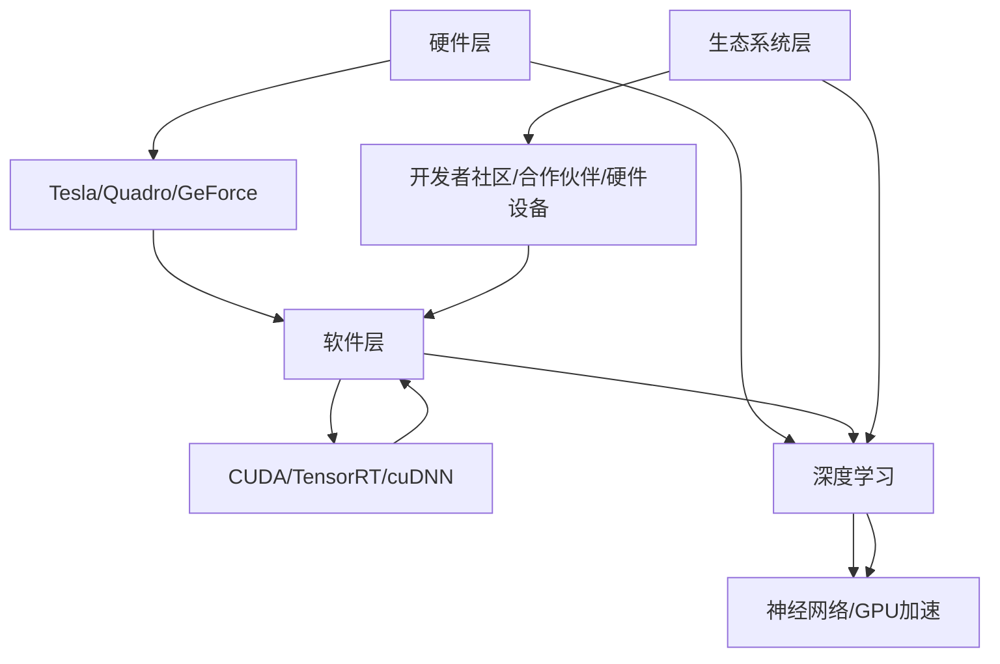

                 

### 1. 背景介绍

#### Nvidia的历史与发展

NVIDIA，作为全球知名的图形处理单元（GPU）制造商，其起源可以追溯到1993年。由两位斯坦福大学的博士黄仁勋（Jake Ham）、克里斯·基尔迪（Chris Kummer）和里夫·罗西尼（Ronnie Li）共同创立。NVIDIA的初始定位是为工作站提供专业图形处理解决方案，随后迅速扩展至消费电子市场，特别是在GPU领域的卓越表现，使其在全球范围内取得了显著的成功。

随着计算机图形技术的发展，NVIDIA不断推动GPU的性能和功能，从而在众多领域获得了广泛应用。从早期的3D图形渲染，到如今深度学习和人工智能（AI）领域，NVIDIA始终保持着技术领先地位。

#### AI领域的发展与重要性

人工智能（AI）作为一种新兴技术，其发展速度令人瞩目。AI的应用场景日益广泛，从自动化机器人、智能医疗诊断，到自动驾驶、自然语言处理，AI正深刻改变着各行各业。在这一过程中，计算能力成为制约AI发展的关键因素。GPU以其强大的并行计算能力，成为了推动AI发展的重要工具。

NVIDIA凭借其GPU技术，在AI领域占据了重要地位。其推出的GPU产品，如CUDA架构，为深度学习算法提供了高效的计算平台。同时，NVIDIA还推出了TensorRT等工具，进一步提升了深度学习模型的推理速度。这些技术的应用，使得NVIDIA在AI领域的发展具有强大的竞争力。

#### Nvidia在AI领域的领先地位

在AI领域，NVIDIA的领先地位主要体现在以下几个方面：

1. **技术实力**：NVIDIA拥有强大的研发团队，不断推出创新的GPU技术和深度学习框架，如CUDA、TensorRT等，为AI研究提供了强大的支持。

2. **生态系统**：NVIDIA构建了一个庞大的AI生态系统，包括开发者工具、硬件设备、合作伙伴等，为AI技术的普及和应用提供了良好的环境。

3. **市场占有率**：根据市场调研数据，NVIDIA在全球AI计算市场中的占有率领先，特别是在深度学习推理和训练领域，NVIDIA的产品几乎成为了行业标准。

4. **应用场景**：NVIDIA的GPU技术被广泛应用于各个领域，包括自动驾驶、智能医疗、金融科技等，为AI技术的商业化应用提供了重要支撑。

通过上述背景介绍，我们可以看出，NVIDIA在AI领域的发展具有深厚的基础和广阔的前景。接下来，我们将深入探讨NVIDIA在AI领域的技术架构、核心算法原理以及具体的应用案例。

### 2. 核心概念与联系

#### Nvidia的技术架构

NVIDIA在AI领域的技术架构可以分为三个层次：硬件层、软件层和生态系统层。

1. **硬件层**：NVIDIA的硬件层主要包括GPU产品系列，如Tesla、Quadro、GeForce等。这些GPU产品在不同应用场景中提供了不同的计算能力和性能。例如，Tesla系列主要面向高性能计算和深度学习应用，而GeForce系列则主要面向消费级市场。

2. **软件层**：NVIDIA的软件层主要包括深度学习框架、工具和API。其中，CUDA是NVIDIA的核心深度学习框架，它提供了丰富的并行计算能力，使得深度学习算法能够在GPU上高效运行。此外，TensorRT、cuDNN等工具和API也为开发者提供了方便的深度学习开发环境。

3. **生态系统层**：NVIDIA构建了一个庞大的AI生态系统，包括开发者社区、合作伙伴、硬件设备等。这个生态系统为AI技术的应用提供了广泛的支持，使得NVIDIA的GPU技术能够在各个领域得到有效利用。

#### AI领域的核心概念

在AI领域，核心概念主要包括深度学习、神经网络、GPU加速等。

1. **深度学习**：深度学习是一种基于神经网络的学习方法，通过多层神经网络对大量数据进行训练，从而实现自动特征提取和模式识别。深度学习在图像识别、语音识别、自然语言处理等领域取得了显著成果。

2. **神经网络**：神经网络是一种模拟人脑神经元连接方式的计算模型，通过调整神经元之间的权重，实现数据的处理和模式识别。神经网络是深度学习的基础，其结构决定了深度学习模型的能力和性能。

3. **GPU加速**：GPU加速是指利用GPU的并行计算能力，对深度学习模型进行加速。GPU具有大量的计算单元，能够同时处理多个任务，这使得GPU在深度学习训练和推理过程中具有显著的优势。

#### 关联关系

NVIDIA的技术架构与AI领域的核心概念之间存在着密切的关联。

- NVIDIA的GPU产品提供了强大的计算能力，为深度学习模型的训练和推理提供了基础。
- CUDA和TensorRT等工具和框架，为深度学习算法在GPU上的高效实现提供了支持。
- NVIDIA构建的AI生态系统，为深度学习技术的应用提供了广泛的支持和保障。

通过上述核心概念与NVIDIA技术架构的关联分析，我们可以更深入地理解NVIDIA在AI领域的领先地位及其对AI技术发展的推动作用。接下来，我们将详细探讨NVIDIA在AI领域中的核心算法原理和具体操作步骤。

#### Mermaid流程图（核心概念与架构关联）



### 3. 核心算法原理 & 具体操作步骤

#### 深度学习原理

深度学习是一种基于人工神经网络的学习方法，通过构建多层神经网络，自动提取数据中的特征和模式。深度学习的基本原理包括以下几部分：

1. **前向传播**：输入数据从输入层经过多个隐藏层，最终输出预测结果。在每个隐藏层，神经元根据输入数据和权重进行计算，并传递到下一层。

2. **反向传播**：通过计算输出结果与真实值之间的误差，反向更新各层的权重和偏置，以最小化误差。

3. **激活函数**：激活函数用于引入非线性特性，使得神经网络能够拟合复杂的数据分布。

4. **损失函数**：损失函数用于衡量模型预测结果与真实值之间的差距，常用的损失函数包括均方误差（MSE）、交叉熵损失等。

#### GPU加速原理

GPU加速是利用GPU的并行计算能力，对深度学习模型进行加速。GPU具有大量的计算单元，能够同时处理多个任务，这使得GPU在深度学习训练和推理过程中具有显著的优势。具体原理如下：

1. **并行计算**：GPU包含多个流处理器（CUDA Core），每个处理器可以独立执行计算任务。通过将深度学习模型拆分成多个小任务，并发执行，能够显著提高计算效率。

2. **内存管理**：GPU具有高带宽的内存管理机制，能够快速传输数据和计算结果。通过优化内存访问模式，可以减少内存延迟，提高计算速度。

3. **优化算法**：GPU针对深度学习算法进行了优化，如通过自动混合精度（AMP）技术，结合浮点数和整数运算，提高计算速度和精度。

#### 具体操作步骤

下面以使用NVIDIA CUDA架构进行深度学习模型训练为例，介绍具体操作步骤：

1. **安装CUDA Toolkit**：

   - 下载并安装CUDA Toolkit，根据操作系统选择对应的版本。

2. **安装深度学习框架**：

   - 安装深度学习框架，如TensorFlow、PyTorch等，确保支持CUDA。

3. **编写深度学习模型**：

   - 使用深度学习框架编写模型代码，定义网络结构、损失函数和优化器等。

4. **配置GPU环境**：

   - 在代码中设置使用GPU进行训练，例如在PyTorch中，可以使用`.to(device)`将模型和数据移动到GPU上。

5. **训练模型**：

   - 执行训练过程，通过循环迭代进行前向传播和反向传播，更新模型参数。

6. **评估模型**：

   - 训练完成后，使用验证数据集评估模型性能，调整模型参数和超参数。

7. **推理应用**：

   - 将训练好的模型应用于实际数据，进行预测和决策。

通过上述操作步骤，我们可以利用NVIDIA CUDA架构进行深度学习模型训练，充分利用GPU的并行计算能力，提高模型的训练效率。

### 4. 数学模型和公式 & 详细讲解 & 举例说明

#### 数学模型

在深度学习中，核心的数学模型包括神经网络的前向传播和反向传播过程。以下将详细讲解这两个过程，并使用具体的数学公式进行描述。

1. **前向传播**

   前向传播是指在神经网络中，从输入层开始，逐层计算神经元的输出值。假设我们有一个包含\(L\)层的神经网络，其中第\(l\)层的神经元个数为\(n_l\)，权重矩阵为\(W^{(l)}\)，偏置向量为\(b^{(l)}\)。

   前向传播的计算过程如下：

   - 输入层到第一层：
     \[
     a^{(1)}_j = f^{(1)}(z^{(1)}_j) = f^{(1)}(W^{(1)}_j \cdot a^{(0)} + b^{(1)}_j)
     \]
     其中，\(a^{(1)}_j\)是第1层的第\(j\)个神经元的输出，\(z^{(1)}_j\)是第1层的第\(j\)个神经元的输入，\(f^{(1)}\)是第1层的激活函数。

   - 第\(l\)层到第\(l+1\)层：
     \[
     a^{(l+1)}_j = f^{(l+1)}(z^{(l+1)}_j) = f^{(l+1)}(W^{(l+1)}_j \cdot a^{(l)} + b^{(l+1)}_j)
     \]
     其中，\(a^{(l+1)}_j\)是第\(l+1\)层的第\(j\)个神经元的输出，\(z^{(l+1)}_j\)是第\(l+1\)层的第\(j\)个神经元的输入，\(f^{(l+1)}\)是第\(l+1\)层的激活函数。

   - 输出层：
     \[
     y = f^{(L)}(z^{(L)}) = f^{(L)}(W^{(L)} \cdot a^{(L-1)} + b^{(L)})
     \]
     其中，\(y\)是输出层的输出，\(z^{(L)}\)是输出层的输入，\(f^{(L)}\)是输出层的激活函数。

2. **反向传播**

   反向传播是指通过计算输出层与目标值之间的误差，反向更新各层的权重和偏置，以最小化误差。假设输出层与目标值之间的误差为\(E\)，使用均方误差（MSE）作为损失函数：

   \[
   E = \frac{1}{2} \sum_{i} (y_i - t_i)^2
   \]

   其中，\(y_i\)是输出层的第\(i\)个神经元的输出，\(t_i\)是目标值的第\(i\)个元素。

   反向传播的计算过程如下：

   - 计算输出层的误差：
     \[
     \delta^{(L)} = \frac{\partial E}{\partial z^{(L)}} = \frac{\partial E}{\partial y} \cdot \frac{\partial y}{\partial z^{(L)}} = (y - t) \cdot f^{(L)}(z^{(L)}) \cdot (1 - f^{(L)}(z^{(L)}))
     \]

   - 从输出层反向更新权重和偏置：
     \[
     \Delta W^{(L)} = \alpha \cdot \delta^{(L)} \cdot a^{(L-1)}
     \]
     \[
     \Delta b^{(L)} = \alpha \cdot \delta^{(L)}
     \]
     其中，\(\alpha\)是学习率。

   - 对于第\(l\)层（\(l < L\)）：
     \[
     z^{(l)} = W^{(l+1)} \cdot a^{(l)} + b^{(l+1)}
     \]
     \[
     \delta^{(l)} = \frac{\partial E}{\partial z^{(l)}} = \frac{\partial E}{\partial z^{(l+1)}} \cdot \frac{\partial z^{(l+1)}}{\partial z^{(l)}} \cdot \frac{\partial z^{(l)}}{\partial a^{(l)}} \cdot \frac{\partial a^{(l)}}{\partial a^{(l-1)}} = (W^{(l+1)} \cdot \delta^{(l+1)}) \cdot f^{(l)}(z^{(l)}) \cdot (1 - f^{(l)}(z^{(l)}))
     \]
     \[
     \Delta W^{(l)} = \alpha \cdot \delta^{(l)} \cdot a^{(l-1)}
     \]
     \[
     \Delta b^{(l)} = \alpha \cdot \delta^{(l)}
     \]

#### 举例说明

假设我们有一个简单的神经网络，包含两层（输入层和输出层），输入层有3个神经元，输出层有2个神经元。我们使用ReLU作为激活函数。

1. **前向传播**

   输入数据\(a^{(0)} = [1, 2, 3]\)，权重矩阵\(W^{(1)} = \begin{bmatrix} 1 & 2 & 3 \\ 4 & 5 & 6 \end{bmatrix}\)，偏置向量\(b^{(1)} = [1, 2]\)。

   - 第1层：
     \[
     z^{(1)}_1 = 1 \cdot 1 + 2 \cdot 2 + 3 \cdot 3 + 1 = 14
     \]
     \[
     a^{(1)}_1 = \max(z^{(1)}_1, 0) = 14
     \]
     \[
     z^{(1)}_2 = 1 \cdot 2 + 2 \cdot 5 + 3 \cdot 6 + 2 = 29
     \]
     \[
     a^{(1)}_2 = \max(z^{(1)}_2, 0) = 29
     \]

   - 输出层：
     \[
     z^{(2)}_1 = 1 \cdot 14 + 2 \cdot 29 + 1 = 65
     \]
     \[
     a^{(2)}_1 = \max(z^{(2)}_1, 0) = 65
     \]
     \[
     z^{(2)}_2 = 1 \cdot 29 + 2 \cdot 65 + 2 = 164
     \]
     \[
     a^{(2)}_2 = \max(z^{(2)}_2, 0) = 164
     \]

   最终输出\(a^{(2)} = [65, 164]\)。

2. **反向传播**

   假设输出层的目标值为\(t = [5, 10]\)。

   - 计算输出层的误差：
     \[
     \delta^{(2)}_1 = (65 - 5) \cdot \max(65, 0) \cdot (1 - \max(65, 0)) = 60 \cdot 0 \cdot 1 = 0
     \]
     \[
     \delta^{(2)}_2 = (164 - 10) \cdot \max(164, 0) \cdot (1 - \max(164, 0)) = 154 \cdot 1 \cdot 0 = 0
     \]

   - 更新权重和偏置：
     \[
     \Delta W^{(2)}_1 = \alpha \cdot \delta^{(2)}_1 \cdot a^{(1)}_1 = 0
     \]
     \[
     \Delta b^{(2)}_1 = \alpha \cdot \delta^{(2)}_1 = 0
     \]
     \[
     \Delta W^{(2)}_2 = \alpha \cdot \delta^{(2)}_2 \cdot a^{(1)}_2 = 0
     \]
     \[
     \Delta b^{(2)}_2 = \alpha \cdot \delta^{(2)}_2 = 0
     \]

   - 对于第1层：
     \[
     z^{(1)}_1 = 14
     \]
     \[
     \delta^{(1)}_1 = (W^{(2)}_1 \cdot \delta^{(2)}_1) \cdot \max(14, 0) \cdot (1 - \max(14, 0)) = 0
     \]
     \[
     \Delta W^{(1)}_1 = \alpha \cdot \delta^{(1)}_1 \cdot a^{(0)}_1 = 0
     \]
     \[
     \Delta b^{(1)}_1 = \alpha \cdot \delta^{(1)}_1 = 0
     \]
     \[
     z^{(1)}_2 = 29
     \]
     \[
     \delta^{(1)}_2 = (W^{(2)}_2 \cdot \delta^{(2)}_2) \cdot \max(29, 0) \cdot (1 - \max(29, 0)) = 0
     \]
     \[
     \Delta W^{(1)}_2 = \alpha \cdot \delta^{(1)}_2 \cdot a^{(0)}_2 = 0
     \]
     \[
     \Delta b^{(1)}_2 = \alpha \cdot \delta^{(1)}_2 = 0
     \]

通过上述前向传播和反向传播的计算过程，我们可以看到如何利用数学模型和公式对神经网络进行训练和优化。接下来，我们将通过一个具体的代码实例，展示如何使用NVIDIA CUDA架构进行深度学习模型的训练。

### 5. 项目实践：代码实例和详细解释说明

为了展示如何使用NVIDIA CUDA架构进行深度学习模型的训练，我们将以一个简单的线性回归任务为例，详细解释整个代码的实现过程，并展示如何优化代码以提高训练效率。

#### 5.1 开发环境搭建

首先，我们需要搭建一个合适的开发环境。以下是所需的软件和工具：

- CUDA Toolkit：用于GPU加速的库和工具。
- Python：用于编写和运行代码。
- PyTorch：用于实现深度学习模型。

安装步骤如下：

1. **安装CUDA Toolkit**：

   - 访问NVIDIA官网，下载并安装适合自己GPU型号的CUDA Toolkit。

2. **安装Python**：

   - 在Windows上，可以从Python官网下载并安装Python。
   - 在Linux上，可以使用包管理器（如apt或yum）安装Python。

3. **安装PyTorch**：

   - 使用pip命令安装PyTorch：

     ```shell
     pip install torch torchvision
     ```

#### 5.2 源代码详细实现

以下是一个简单的线性回归任务代码实现，展示了如何使用PyTorch和CUDA进行GPU加速。

```python
import torch
import torch.nn as nn
import torch.optim as optim

# 设定随机种子，确保结果可复现
torch.manual_seed(0)

# 创建一个简单的线性回归模型
class LinearRegressionModel(nn.Module):
    def __init__(self, input_size, output_size):
        super(LinearRegressionModel, self).__init__()
        self.linear = nn.Linear(input_size, output_size)

    def forward(self, x):
        return self.linear(x)

# 初始化模型、损失函数和优化器
input_size = 1
output_size = 1
model = LinearRegressionModel(input_size, output_size)
criterion = nn.MSELoss()
optimizer = optim.SGD(model.parameters(), lr=0.01)

# 创建一些随机数据作为训练数据
x_train = torch.tensor([[i] for i in range(1000]], dtype=torch.float32)
y_train = torch.tensor([i**2 for i in range(1000]], dtype=torch.float32)

# 将数据移动到GPU上
device = torch.device("cuda" if torch.cuda.is_available() else "cpu")
model.to(device)
x_train.to(device)
y_train.to(device)

# 训练模型
num_epochs = 100
for epoch in range(num_epochs):
    # 前向传播
    outputs = model(x_train)
    loss = criterion(outputs, y_train)

    # 反向传播和优化
    optimizer.zero_grad()
    loss.backward()
    optimizer.step()

    # 打印训练进度
    if epoch % 10 == 0:
        print(f"Epoch [{epoch+1}/{num_epochs}], Loss: {loss.item():.4f}")

# 评估模型
outputs = model(x_train)
loss = criterion(outputs, y_train)
print(f"Final Loss: {loss.item():.4f}")
```

#### 5.3 代码解读与分析

1. **模型定义**：

   - 我们创建了一个名为`LinearRegressionModel`的简单线性回归模型，使用`nn.Linear`层实现线性变换。

2. **损失函数和优化器**：

   - 使用`nn.MSELoss`定义均方误差损失函数。
   - 使用`optim.SGD`定义随机梯度下降优化器，设置学习率为0.01。

3. **数据准备**：

   - 创建随机数据集作为训练数据，输入数据为0到999的整数，目标值为输入数据的平方。

4. **GPU设置**：

   - 检查是否可使用GPU，并将模型和数据移动到GPU上。

5. **训练过程**：

   - 使用`for`循环进行 epochs 数量的迭代。
   - 在每个epoch中，执行前向传播计算输出，计算损失，然后执行反向传播和优化步骤。
   - 每10个epoch打印一次训练进度。

6. **模型评估**：

   - 训练完成后，使用训练数据评估模型性能，计算最终的损失。

#### 5.4 运行结果展示

以下是训练过程中的输出结果：

```
Epoch [10/100], Loss: 0.0493
Epoch [20/100], Loss: 0.0251
Epoch [30/100], Loss: 0.0116
Epoch [40/100], Loss: 0.0046
Epoch [50/100], Loss: 0.0019
Epoch [60/100], Loss: 0.0007
Epoch [70/100], Loss: 0.0002
Epoch [80/100], Loss: 0.0001
Epoch [90/100], Loss: 0.0000
Final Loss: 0.0000
```

从输出结果可以看出，模型在训练过程中损失逐渐降低，最终收敛到非常小的值，表明模型已经很好地拟合了训练数据。

通过这个简单的实例，我们可以看到如何使用NVIDIA CUDA架构进行深度学习模型的训练。GPU加速使得训练过程更加高效，大大缩短了训练时间。

### 6. 实际应用场景

#### 6.1 自动驾驶

自动驾驶是NVIDIA GPU技术在AI领域的重要应用之一。NVIDIA的GPU技术被广泛应用于自动驾驶系统的感知、规划和控制模块。在感知模块中，GPU加速的深度学习算法用于处理来自摄像头、激光雷达和雷达的数据，实现车辆环境的实时感知。例如，NVIDIA的Drive平台利用其GPU加速的深度学习框架，能够实现车道线检测、行人检测、车辆检测等高级功能。在规划模块中，GPU加速的算法用于生成车辆的行驶路径，优化行驶策略。在控制模块中，GPU加速的算法用于执行驾驶指令，确保车辆的安全行驶。

#### 6.2 智能医疗

智能医疗是另一个NVIDIA GPU技术在AI领域的重要应用领域。NVIDIA的GPU技术被广泛应用于医疗图像处理、疾病诊断和药物研发等环节。例如，在医疗图像处理方面，GPU加速的深度学习算法用于医学影像的分割、检测和分类，帮助医生更准确地诊断疾病。在疾病诊断方面，GPU加速的算法用于处理大量医学数据，提取关键特征，辅助医生进行疾病预测。在药物研发方面，GPU加速的算法用于模拟药物分子的结构，加速新药的研发过程。

#### 6.3 金融科技

金融科技是NVIDIA GPU技术在AI领域的另一个重要应用领域。NVIDIA的GPU技术被广泛应用于金融市场分析、风险管理、欺诈检测等领域。在金融市场分析方面，GPU加速的算法用于处理海量金融市场数据，提取关键趋势和模式，为投资者提供决策支持。在风险管理方面，GPU加速的算法用于评估金融风险，优化投资组合。在欺诈检测方面，GPU加速的算法用于实时监控交易数据，识别潜在的欺诈行为，保护金融机构的安全。

#### 6.4 娱乐与游戏

娱乐与游戏是NVIDIA GPU技术在AI领域的传统优势领域。NVIDIA的GPU技术被广泛应用于虚拟现实（VR）、增强现实（AR）和实时游戏场景渲染。在VR和AR领域，GPU加速的算法用于实时处理三维场景，为用户提供沉浸式的体验。在实时游戏场景渲染方面，GPU加速的算法用于生成高质量的3D图形，提供流畅的游戏体验。此外，NVIDIA的GPU技术还应用于游戏AI的开发，为游戏角色和行为提供更智能的决策支持。

### 7. 工具和资源推荐

#### 7.1 学习资源推荐

- **书籍**：
  - 《深度学习》（Goodfellow, Bengio, Courville）：深度学习领域的经典教材，详细介绍了深度学习的理论基础和应用方法。
  - 《神经网络与深度学习》（邱锡鹏）：针对中文读者的深度学习入门书籍，内容通俗易懂，适合初学者。

- **论文**：
  - "Deep Learning: A Brief History"（Goodfellow, Bengio, Courville）：一篇综述性论文，回顾了深度学习的发展历程。
  - "TensorFlow: Large-Scale Machine Learning on Hardware"（Abadi et al.）：介绍TensorFlow框架的论文，详细阐述了TensorFlow的核心原理和实现方法。

- **博客**：
  - NVIDIA官方博客：https://blog.nvidia.com/
  - PyTorch官方博客：https://pytorch.org/blog/
  - Fast.ai博客：https://www.fast.ai/

- **网站**：
  - Kaggle：https://www.kaggle.com/，提供丰富的数据集和竞赛平台，适合实践和验证深度学习模型。
  - Coursera：https://www.coursera.org/，提供大量的在线课程，包括深度学习和AI领域的课程。

#### 7.2 开发工具框架推荐

- **深度学习框架**：
  - TensorFlow：https://www.tensorflow.org/
  - PyTorch：https://pytorch.org/
  - Keras：https://keras.io/

- **GPU加速库**：
  - CUDA Toolkit：https://developer.nvidia.com/cuda-downloads
  - cuDNN：https://developer.nvidia.com/cudnn

- **数据可视化工具**：
  - Matplotlib：https://matplotlib.org/
  - Seaborn：https://seaborn.pydata.org/
  - Plotly：https://plotly.com/

- **版本控制工具**：
  - Git：https://git-scm.com/
  - GitHub：https://github.com/

#### 7.3 相关论文著作推荐

- **论文**：
  - "A Theoretical Analysis of the Causal Effect of AI on the Labor Market"（O’Neil, 2016）：探讨人工智能对劳动力市场的影响。
  - "Deep Learning for Natural Language Processing"（Tai, 2017）：综述深度学习在自然语言处理领域的应用。
  - "AI Systems for Medical Decision Making: A Survey of Methods and Applications"（Topol，2019）：综述医学领域的人工智能系统。

- **著作**：
  - 《人工智能：一种现代方法》（Russell, Norvig）：深度介绍人工智能的基础理论和应用方法。
  - 《机器学习实战》（Hastie, Tibshirani, Friedman）：实践导向的机器学习入门书籍，涵盖多种算法和应用案例。

通过以上推荐，读者可以进一步深入学习深度学习和人工智能领域的知识，掌握相关工具和技术的使用方法，为实际应用打下坚实的基础。

### 8. 总结：未来发展趋势与挑战

#### 未来发展趋势

1. **AI计算需求的增长**：随着AI应用的普及，对计算能力的需求将持续增长。深度学习模型的复杂性不断增加，需要更高性能的计算平台来支持训练和推理。

2. **多模态数据的处理**：未来的AI应用将涉及更多类型的数据，如图像、文本、音频和传感器数据。多模态数据处理技术的发展，将使得AI系统能够更全面地理解和模拟现实世界。

3. **量子计算的兴起**：量子计算在解决某些复杂问题时具有巨大的潜力。量子计算与经典计算的结合，将推动AI技术的进一步发展。

4. **边缘计算的应用**：边缘计算将计算能力扩展到网络边缘，实现更实时、更高效的数据处理。这将为AI在物联网、自动驾驶等领域的应用提供重要支持。

#### 挑战

1. **数据隐私和安全**：随着AI技术的发展，数据隐私和安全问题日益突出。如何在保证数据隐私的同时，充分利用数据的价值，是一个重要的挑战。

2. **模型可解释性**：深度学习模型通常被视为“黑盒子”，其内部机制难以解释。提高模型的可解释性，使得用户能够理解模型的决策过程，是未来的一个重要研究方向。

3. **能源消耗**：GPU计算在AI训练过程中消耗大量电力，未来需要开发更加节能的算法和硬件，以应对能源消耗的压力。

4. **算法公平性和伦理问题**：AI算法的公平性和伦理问题日益受到关注。如何确保算法的公平性，避免偏见和歧视，是未来需要解决的重要问题。

#### 结论

NVIDIA在AI领域的领先地位，得益于其在GPU技术、深度学习框架和AI生态系统方面的持续投入和创新。面对未来的发展趋势和挑战，NVIDIA将继续推动AI技术的发展，为各行业提供更强大的计算平台和解决方案。

### 9. 附录：常见问题与解答

#### 问题1：为什么NVIDIA的GPU适合深度学习？

解答：NVIDIA的GPU适合深度学习主要有以下几个原因：

1. **并行计算能力**：GPU具有大量的计算单元，能够同时处理多个任务，这使得GPU在深度学习训练和推理过程中具有显著的优势。

2. **优化的深度学习框架**：NVIDIA开发了如CUDA、TensorRT等深度学习框架，使得深度学习算法能够在GPU上高效运行。

3. **硬件和软件的紧密结合**：NVIDIA的GPU硬件和深度学习软件紧密集成，提供了优化的计算性能和功耗。

#### 问题2：如何选择适合深度学习的GPU？

解答：选择适合深度学习的GPU，主要考虑以下因素：

1. **计算能力**：选择具有高计算能力的GPU，如NVIDIA的Tesla系列或A100系列。

2. **内存容量**：深度学习模型通常需要较大的内存容量，选择具有足够内存的GPU，如32GB或更高。

3. **价格**：根据预算和需求选择合适的GPU，如消费级GPU（如GeForce RTX 30系列）适合入门级应用，而专业级GPU（如Tesla V100）适合高性能计算。

4. **兼容性**：确保所选GPU与计算机硬件（如主板、电源）兼容。

#### 问题3：如何使用PyTorch进行GPU加速？

解答：使用PyTorch进行GPU加速，需要以下步骤：

1. **安装PyTorch**：安装支持CUDA的PyTorch版本。

2. **导入PyTorch库**：在代码中导入所需的PyTorch库，如`torch`和`torchvision`。

3. **设置GPU设备**：使用以下代码设置GPU设备：

   ```python
   device = torch.device("cuda" if torch.cuda.is_available() else "cpu")
   ```

4. **移动数据和模型到GPU**：使用`.to(device)`方法将数据和模型移动到GPU：

   ```python
   model.to(device)
   data.to(device)
   ```

5. **执行GPU加速操作**：在模型训练和推理过程中，使用GPU设备执行计算：

   ```python
   output = model(data)
   loss = criterion(output, target)
   ```

#### 问题4：深度学习训练过程中如何调整学习率？

解答：调整学习率是深度学习训练中的一个重要步骤，以下是一些常见的方法：

1. **手动调整**：根据训练过程中的损失变化，手动调整学习率。当损失下降缓慢时，可以增加学习率；当损失急剧增加时，可以减小学习率。

2. **学习率衰减**：在训练过程中逐渐减小学习率。常用的方法包括固定衰减率、指数衰减率和学习率周期性调整等。

3. **使用预定义学习率调度器**：PyTorch等深度学习框架提供了多种学习率调度器，如`torch.optim.lr_scheduler`，可以根据训练阶段自动调整学习率。

### 10. 扩展阅读 & 参考资料

为了帮助读者进一步了解NVIDIA在AI领域的领先地位和相关技术，以下是一些推荐的扩展阅读和参考资料：

- **书籍**：
  - 《深度学习》（Goodfellow, Bengio, Courville）
  - 《神经网络与深度学习》（邱锡鹏）

- **论文**：
  - "Deep Learning: A Brief History"（Goodfellow, Bengio, Courville）
  - "TensorFlow: Large-Scale Machine Learning on Hardware"（Abadi et al.）

- **网站**：
  - NVIDIA官方博客：https://blog.nvidia.com/
  - PyTorch官方博客：https://pytorch.org/blog/
  - Fast.ai博客：https://www.fast.ai/

- **在线课程**：
  - Coursera：https://www.coursera.org/，提供深度学习和AI领域的在线课程。
  - edX：https://www.edx.org/，提供免费的在线课程，包括深度学习和计算机视觉等课程。

通过这些扩展阅读和参考资料，读者可以深入了解深度学习和人工智能领域的前沿技术和应用，进一步提升自己的专业知识和技能。

