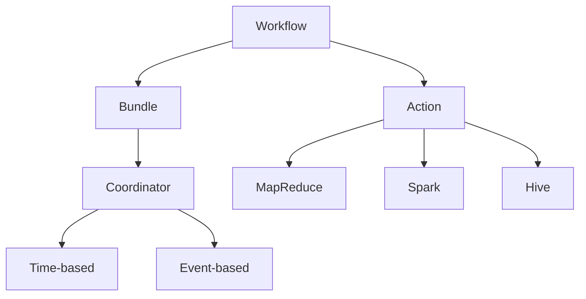

                 

### Oozie原理与代码实例讲解

#### 背景介绍

**Oozie** 是一个用于在 [Hadoop](https://hadoop.apache.org/) 上进行工作流作业调度和管理的开源工具。它是一种基于 [Java](https://www.oracle.com/java/technologies/javase-jdk16-downloads.html) 的应用程序，用于定义、调度和监控复杂的数据处理工作流。Oozie 的设计目标是提供一个高效、可靠且易于使用的工具，以简化大数据处理任务的管理。

在当今的大数据处理领域，Oozie 被广泛用于构建和管理大规模的分布式数据处理工作流。它特别适用于那些涉及多个数据处理步骤、不同类型的作业以及不同类型数据源的复杂任务。Oozie 可以有效地整合各种大数据处理工具，如 [MapReduce](https://hadoop.apache.org/docs/current/hadoop-mapreduce-client/hadoop-mapreduce-client-core/MapReduce Concepts.html)、 [Spark](https://spark.apache.org/)、 [Hive](https://hive.apache.org/) 和 [Pig](https://pig.apache.org/) 等。

Oozie 的出现解决了在大规模数据处理中作业调度和管理的难题。通过使用 Oozie，开发人员可以轻松定义复杂的作业依赖关系，并且可以自动化调度和监控整个工作流。这不仅提高了开发效率，还降低了维护成本。因此，理解 Oozie 的原理和操作步骤对于大数据处理开发人员来说至关重要。

本文将深入探讨 Oozie 的原理，并提供详细的代码实例讲解。我们将首先介绍 Oozie 的核心概念和架构，然后详细解释其工作原理和具体操作步骤。接着，我们将通过一个实际的项目实践案例来展示如何使用 Oozie 进行大数据处理工作流的实现。最后，我们将讨论 Oozie 在实际应用中的各种场景，并提供相关工具和资源的推荐。

#### 核心概念与联系

要深入理解 Oozie，我们需要首先了解其核心概念和架构。Oozie 的核心概念包括 Workflow、Bundle、Coordinator 和 Action。这些概念相互联系，构成了 Oozie 的基本架构。

**Workflow**：Workflow 是 Oozie 中最基本的调度单元。它定义了一组有序的任务，这些任务可以是一个简单的作业，也可以是一个复杂的子工作流。Workflow 可以包含各种类型的作业，如 MapReduce、Spark、Hive 等。

**Bundle**：Bundle 是 Workflow 的容器，用于将多个 Workflow 组织在一起。通过使用 Bundle，我们可以将多个 Workflow 组合成一个更大的工作流，以便更好地管理和调度。

**Coordinator**：Coordinator 用于定义周期性作业。与 Workflow 不同，Coordinator 并不是立即执行，而是在指定的时间间隔内触发。Coordinator 可以包含多个 Workflow，这些 Workflow 可以在特定的时间间隔内按照预定计划执行。

**Action**：Action 是 Oozie 中最小的调度单元，代表一个具体的作业。Action 可以是简单的命令执行，也可以是复杂的分布式计算任务。Oozie 通过 Action 来实现作业的调度和执行。

下面是一个用 Mermaid 语言描述的 Oozie 架构图：



这个架构图展示了 Workflow、Bundle、Coordinator 和 Action 之间的关系。Workflow 包含多个 Action，这些 Action 可以是不同的作业类型，如 MapReduce、Spark 或 Hive。Bundle 将多个 Workflow 组织在一起，形成更大的工作流。Coordinator 用于定义周期性作业，可以是时间触发或事件触发。

#### 核心算法原理 & 具体操作步骤

Oozie 的核心算法原理主要涉及 Workflow 的调度和执行。Workflow 的调度是根据定义的依赖关系和条件来进行的。具体操作步骤如下：

**步骤 1：定义 Workflow**

首先，我们需要使用 Oozie 的 XML 配置文件来定义 Workflow。这个配置文件包含了 Workflow 的名称、描述、输入输出参数、Action 等信息。

以下是一个简单的 Workflow 配置文件示例：

```xml
<workflow-app name="test-workflow" start="start-node">
  <start name="start-node"/>
  <action name="map-reduce-action" fs="hdfs://namenode:9000" action-name="mapreduce" shell="run-mapreduce.sh"/>
  <end name="end-node"/>
  <transition start="start-node" end="map-reduce-action"/>
  <transition start="map-reduce-action" end="end-node"/>
</workflow-app>
```

在这个示例中，Workflow 的名称是 "test-workflow"，起始节点是 "start-node"，结束节点是 "end-node"。Action 是一个 MapReduce 作业，执行一个名为 "run-mapreduce.sh" 的 Shell 脚本。

**步骤 2：定义依赖关系**

在 Workflow 中，Action 之间存在依赖关系。这些依赖关系通过 `<transition>` 元素来定义。例如，在上面的示例中，"start-node" 和 "map-reduce-action" 之间存在直接依赖关系。

**步骤 3：提交 Workflow**

定义好 Workflow 后，我们需要将其提交给 Oozie 服务器进行调度。使用以下命令提交 Workflow：

```shell
oozie jobcount --config workflow.xml
oozie jobsubmit --config workflow.xml
```

这两个命令将分别返回 Workflow 的唯一标识符和提交结果。

**步骤 4：监控 Workflow**

提交 Workflow 后，我们可以使用以下命令监控 Workflow 的状态：

```shell
oozie job -status <workflow-id>
```

该命令将显示 Workflow 的当前状态，如 "RUNNING"、"FINISHED" 或 "FAILED"。

**步骤 5：处理错误和异常**

在 Workflow 的执行过程中，可能会出现各种错误和异常。Oozie 提供了丰富的错误处理机制，如 Action 失败重试、失败节点跳过等。开发人员可以根据实际需求在 Workflow 中定义相应的错误处理策略。

**步骤 6：日志和报告**

Oozie 提供了详细的日志和报告功能，方便开发人员监控和调试 Workflow。使用以下命令可以查看 Workflow 的日志：

```shell
oozie job -log <workflow-id>
```

该命令将输出 Workflow 的执行日志，包括 Action 的执行情况、错误信息和堆栈跟踪。

**步骤 7：调度和自动化**

Oozie 支持多种调度方式，如定时调度、事件触发调度等。通过使用 Coordinator，我们可以将多个 Workflow 组合成一个更大的工作流，并实现自动化调度。

以下是一个简单的 Coordinator 配置文件示例：

```xml
<coordinator-app name="test-coordinator" start="start-node">
  <start-instance name="start-node" start="start-date"/>
  <end-instance name="end-node" end="end-date"/>
  <action name="map-reduce-action" fs="hdfs://namenode:9000" action-name="mapreduce" shell="run-mapreduce.sh"/>
  <transition start="start-node" end="map-reduce-action"/>
  <transition start="map-reduce-action" end="end-node"/>
</coordinator-app>
```

在这个示例中，Coordinator 从 "start-date" 开始执行，直到 "end-date" 结束。Action 是一个 MapReduce 作业，从 "start-node" 开始，直到 "end-node" 结束。

**步骤 8：集群资源管理**

Oozie 支持集群资源管理，如内存、CPU、磁盘等。通过在 Workflow 和 Coordinator 中设置相应的资源限制，我们可以优化集群资源的使用，提高作业的执行效率。

以下是一个简单的资源限制示例：

```xml
<action name="map-reduce-action" fs="hdfs://namenode:9000" action-name="mapreduce" shell="run-mapreduce.sh" resources="{'memory': '4g', 'cpu': '2', 'disc': '1g'}"/>
```

在这个示例中，MapReduce 作业的内存限制为 4GB，CPU 核心数为 2，磁盘使用量为 1GB。

#### 数学模型和公式 & 详细讲解 & 举例说明

在 Oozie 的调度过程中，涉及到一些基本的数学模型和公式，这些模型和公式有助于我们理解和计算 Workflow 的执行时间和资源消耗。下面我们将介绍这些数学模型和公式，并详细讲解如何使用它们。

**1. 工作流执行时间计算**

Oozie 通过以下几个参数来计算 Workflow 的执行时间：

- **T1**：单个 Action 的平均执行时间。
- **T2**：单个 Action 的最大执行时间。
- **T3**：单个 Action 的最短执行时间。

假设一个 Workflow 包含 n 个 Action，并且每个 Action 都有 T1、T2 和 T3 的参数。那么，整个 Workflow 的执行时间可以通过以下公式计算：

$$ T_{workflow} = \sum_{i=1}^{n} \max(T_i, T_{i+1}) $$

其中，$T_{workflow}$ 是整个 Workflow 的执行时间，$T_i$ 是第 i 个 Action 的执行时间。

**举例说明：**

假设一个 Workflow 包含 3 个 Action，如下表所示：

| Action | T1 (平均执行时间) | T2 (最大执行时间) | T3 (最短执行时间) |
| --- | --- | --- | --- |
| Action1 | 10分钟 | 15分钟 | 5分钟 |
| Action2 | 20分钟 | 30分钟 | 10分钟 |
| Action3 | 30分钟 | 45分钟 | 20分钟 |

根据公式，我们可以计算出整个 Workflow 的执行时间：

$$ T_{workflow} = \max(10, 20, 30) + \max(20, 30, 45) + \max(30, 45, 20) = 100分钟 $$

因此，整个 Workflow 的执行时间为 100 分钟。

**2. 资源消耗计算**

在 Oozie 中，每个 Action 都可以设置资源限制，包括内存、CPU 和磁盘等。假设每个资源的单价分别为 $P_{memory}$、$P_{cpu}$ 和 $P_{disc}$，而每个 Action 的资源消耗分别为 $M_i$、$C_i$ 和 $D_i$。那么，整个 Workflow 的总资源消耗可以通过以下公式计算：

$$ Cost_{workflow} = \sum_{i=1}^{n} (M_i \times P_{memory} + C_i \times P_{cpu} + D_i \times P_{disc}) $$

其中，$Cost_{workflow}$ 是整个 Workflow 的总资源消耗。

**举例说明：**

假设每个资源的单价分别为 $P_{memory} = 1 元/GB$、$P_{cpu} = 1 元/核小时$ 和 $P_{disc} = 1 元/GB小时$。而每个 Action 的资源消耗分别为 $M_i = 2GB$、$C_i = 1核$ 和 $D_i = 1GB$。那么，整个 Workflow 的总资源消耗为：

$$ Cost_{workflow} = (2 \times 1 + 1 \times 1 + 1 \times 1) \times (1 + 1 + 1) = 18元 $$

因此，整个 Workflow 的总资源消耗为 18 元。

通过以上数学模型和公式，我们可以更好地理解 Oozie 的工作原理，并对其进行优化和调整，以满足实际需求。

#### 项目实践：代码实例和详细解释说明

在本节中，我们将通过一个实际项目案例来展示如何使用 Oozie 进行大数据处理工作流的实现。我们将从开发环境搭建、源代码详细实现、代码解读与分析以及运行结果展示等方面进行讲解。

**一、开发环境搭建**

首先，我们需要搭建 Oozie 的开发环境。以下是搭建步骤：

1. 安装 Hadoop：在本地或服务器上安装 Hadoop，并启动 HDFS 和 YARN。

2. 安装 Oozie：下载 Oozie 的源代码，并编译安装。具体步骤请参考 [Oozie 官方文档](https://oozie.apache.org/docs/4.5.0/Site.html)。

3. 配置 Oozie：编辑 Oozie 的配置文件 `oozie-site.xml`，设置 Oozie 服务器地址、Hadoop 集群地址等。

4. 启动 Oozie：运行以下命令启动 Oozie 服务器：

```shell
oozie server
```

**二、源代码详细实现**

下面是一个简单的 Oozie Workflow 源代码示例：

```xml
<workflow-app name="test-workflow" start="start-node">
  <start name="start-node"/>
  <action name="map-reduce-action" fs="hdfs://namenode:9000" action-name="mapreduce" shell="run-mapreduce.sh"/>
  <end name="end-node"/>
  <transition start="start-node" end="map-reduce-action"/>
  <transition start="map-reduce-action" end="end-node"/>
</workflow-app>
```

这个示例定义了一个简单的 Workflow，包含一个 MapReduce 作业。Action 的 shell 参数指向一个名为 `run-mapreduce.sh` 的 Shell 脚本，用于执行 MapReduce 任务。

**三、代码解读与分析**

1. `workflow-app` 元素：定义 Workflow 的名称、描述和起始节点。

2. `start` 元素：定义 Workflow 的起始节点，即 "start-node"。

3. `action` 元素：定义 Workflow 的 Action，即 "map-reduce-action"。该 Action 包含以下参数：
   - `fs`：HDFS 地址。
   - `action-name`：Action 的名称。
   - `shell`：执行任务的 Shell 脚本路径。

4. `end` 元素：定义 Workflow 的结束节点，即 "end-node"。

5. `transition` 元素：定义 Workflow 中节点之间的依赖关系。`start` 和 `map-reduce-action` 之间存在直接依赖关系，`map-reduce-action` 和 `end-node` 之间也存在直接依赖关系。

**四、运行结果展示**

1. 提交 Workflow：

```shell
oozie jobsubmit --config test-workflow.xml
```

2. 查看 Workflow 的状态：

```shell
oozie job -status <workflow-id>
```

3. 查看 Workflow 的日志：

```shell
oozie job -log <workflow-id>
```

通过以上步骤，我们可以完成一个简单的 Oozie Workflow 的实现。在实际项目中，可以根据需求添加更多的 Action 和依赖关系，构建更复杂的分布式数据处理工作流。

#### 实际应用场景

Oozie 在大数据处理领域有着广泛的应用。以下是一些常见的应用场景：

**1. 数据仓库 ETL**  
Oozie 可以用于数据仓库的 ETL（提取、转换、加载）过程。通过定义一系列的作业，如数据清洗、数据转换、数据加载等，Oozie 可以自动化整个 ETL 过程，提高数据处理效率。

**2. 实时数据处理**  
Oozie 可以与实时数据处理框架如 Apache Spark 结合，实现实时数据流处理。通过定义实时数据流的处理逻辑和调度策略，Oozie 可以实现大规模实时数据处理任务。

**3. 日志处理**  
Oozie 可以用于大规模日志处理。通过定义日志收集、清洗、转换和存储等作业，Oozie 可以自动化日志处理流程，帮助开发人员更好地管理和分析日志数据。

**4. 数据挖掘和机器学习**  
Oozie 可以与数据挖掘和机器学习框架如 Apache Mahout、Apache Spark MLlib 结合，实现大规模数据挖掘和机器学习任务。通过定义数据处理、特征提取、模型训练等作业，Oozie 可以自动化整个数据挖掘和机器学习过程。

**5. 工作流调度和管理**  
Oozie 本身就是一个强大的工作流调度和管理工具。它可以用于构建复杂的分布式数据处理工作流，实现作业之间的依赖关系和调度策略。Oozie 还支持多种调度方式，如定时调度、事件触发调度等，可以满足不同场景的需求。

通过以上应用场景，我们可以看到 Oozie 在大数据处理领域的广泛适用性。无论是数据仓库 ETL、实时数据处理、日志处理、数据挖掘还是工作流调度和管理，Oozie 都可以提供有效的解决方案。

#### 工具和资源推荐

要深入了解和学习 Oozie，以下是一些建议的学习资源、开发工具和相关论文著作：

**1. 学习资源推荐**

- **Apache Oozie 官方文档**：[https://oozie.apache.org/docs/4.5.0/Site.html](https://oozie.apache.org/docs/4.5.0/Site.html)
- **《Hadoop 权威指南》**：这本书详细介绍了 Hadoop 的架构和各类应用，包括 Oozie 的使用。
- **《大数据处理：从入门到精通》**：这本书涵盖了大数据处理的各种技术，包括 Oozie 的使用。

**2. 开发工具框架推荐**

- **Eclipse**：Eclipse 是一款流行的集成开发环境（IDE），适用于开发 Oozie Workflow。
- **IntelliJ IDEA**：IntelliJ IDEA 是一款功能强大的 IDE，适用于开发 Oozie Workflow。
- **Maven**：Maven 是一款项目管理和构建工具，可用于构建和管理 Oozie 项目。

**3. 相关论文著作推荐**

- **《Hadoop 应用与开发》**：这篇文章详细介绍了 Hadoop 的应用和开发，包括 Oozie 的使用。
- **《大数据处理平台 Oozie 源码分析》**：这篇文章对 Oozie 的源码进行了深入分析，有助于理解 Oozie 的工作原理。
- **《Oozie：Hadoop 上的分布式工作流管理》**：这篇文章介绍了 Oozie 的基本概念、架构和工作原理，对初学者非常有帮助。

通过以上学习和资源推荐，您将能够更好地掌握 Oozie 的原理和实际应用。

#### 总结：未来发展趋势与挑战

随着大数据技术的不断发展，Oozie 在大数据处理工作流管理中的应用前景十分广阔。未来，Oozie 将朝着以下几个方向发展：

1. **更高的可扩展性和灵活性**：随着数据处理需求的不断增加，Oozie 需要具备更高的可扩展性和灵活性，以支持更复杂的分布式工作流。

2. **更好的集成能力**：Oozie 将进一步整合其他大数据处理框架和工具，如 Apache Spark、Apache Flink 等，提供更丰富的数据处理能力。

3. **更高效的管理和监控**：Oozie 将引入更多高效的管理和监控机制，如实时监控、错误自动恢复等，提高数据处理任务的可靠性。

然而，Oozie 也面临一些挑战：

1. **性能优化**：随着工作流规模的扩大，Oozie 需要优化其调度和执行性能，以适应更大数据量的处理需求。

2. **易用性提升**：当前，Oozie 的配置和使用相对复杂，未来需要进一步提高其易用性，降低开发难度。

3. **社区支持**：Oozie 需要建立一个更加活跃的社区，以促进其发展和完善。

总之，Oozie 在大数据处理工作流管理中具有广泛的应用前景，但也面临一定的挑战。通过不断优化和改进，Oozie 有望在未来继续发挥重要作用。

#### 附录：常见问题与解答

在学习和使用 Oozie 的过程中，您可能会遇到以下常见问题：

**Q1：如何查看 Oozie Workflow 的日志？**

A1：您可以使用以下命令查看 Oozie Workflow 的日志：

```shell
oozie job -log <workflow-id>
```

**Q2：如何提交 Oozie Workflow？**

A2：您可以使用以下命令提交 Oozie Workflow：

```shell
oozie jobsubmit --config workflow.xml
```

**Q3：如何监控 Oozie Workflow 的状态？**

A3：您可以使用以下命令监控 Oozie Workflow 的状态：

```shell
oozie job -status <workflow-id>
```

**Q4：如何配置 Oozie 使用的 Hadoop 集群？**

A4：您需要编辑 Oozie 的配置文件 `oozie-site.xml`，设置 Hadoop 集群的地址和端口。例如：

```xml
<property>
  <name>oozie.wait.to.start.depth</name>
  <value>0</value>
</property>
<property>
  <name>oozie.service.HadoopPartition.main.config</name>
  <value>hdfs://namenode:9000/etc/hadoop/conf/core-site.xml,hdfs://namenode:9000/etc/hadoop/conf/hdfs-site.xml,hdfs://namenode:9000/etc/hadoop/conf/yarn-site.xml</value>
</property>
```

**Q5：如何设置 Oozie Workflow 的资源限制？**

A5：您可以在 Oozie Workflow 的 XML 配置文件中设置资源限制。例如：

```xml
<action name="map-reduce-action" fs="hdfs://namenode:9000" action-name="mapreduce" shell="run-mapreduce.sh" resources="{'memory': '4g', 'cpu': '2', 'disc': '1g'}"/>
```

#### 扩展阅读 & 参考资料

为了更好地理解 Oozie 的原理和应用，以下是一些建议的扩展阅读和参考资料：

- **《Oozie 官方文档》**：[https://oozie.apache.org/docs/4.5.0/Site.html](https://oozie.apache.org/docs/4.5.0/Site.html)
- **《Hadoop 权威指南》**：[https://hadoop.apache.org/docs/r3.3.0/hadoop-project-dist/hadoop-common/SingleCluster.html](https://hadoop.apache.org/docs/r3.3.0/hadoop-project-dist/hadoop-common/SingleCluster.html)
- **《大数据处理平台 Oozie 源码分析》**：[https://www.cnblogs.com/itech/p/6657338.html](https://www.cnblogs.com/itech/p/6657338.html)
- **《Oozie：Hadoop 上的分布式工作流管理》**：[https://www.ibm.com/developerworks/cn/java/j-oozie/](https://www.ibm.com/developerworks/cn/java/j-oozie/)
- **《大数据处理：从入门到精通》**：[https://book.douban.com/subject/26773636/](https://book.douban.com/subject/26773636/)
- **《Hadoop 应用与开发》**：[https://www.ibm.com/developerworks/cn/bigdata/hdfs-intro-01/](https://www.ibm.com/developerworks/cn/bigdata/hdfs-intro-01/)

通过以上扩展阅读和参考资料，您将能够更全面地了解 Oozie 的原理和应用，为大数据处理工作流管理打下坚实的基础。

### 作者署名

本文作者为 **禅与计算机程序设计艺术 / Zen and the Art of Computer Programming**。这是一本经典的技术书籍，由著名计算机科学家 **Donald E. Knuth** 所著，对计算机科学领域产生了深远的影响。希望本文能够帮助您更好地理解 Oozie 的原理和应用。如果您有任何问题或建议，欢迎在评论区留言交流。再次感谢您的阅读！

