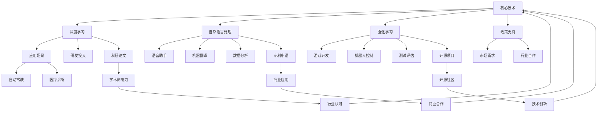

                 

### 1. 背景介绍

#### OpenAI：新兴AI巨头的崛起

OpenAI成立于2015年，是一家总部位于美国的人工智能研究公司，其宗旨是确保人工智能（AI）的广泛应用能够造福人类。自成立以来，OpenAI在人工智能领域取得了令人瞩目的成就，尤其是在深度学习、自然语言处理、强化学习等方面。公司通过开放源代码和合作项目，推动了AI技术的发展，并积极参与到多个重要项目中。

#### OpenAI的财务表现：20亿美元的营收神话

近期，OpenAI宣布其2022年的营收达到了20亿美元，这一数字令人瞩目。作为一个以研发为主导的公司，这一成绩无疑是OpenAI商业化战略的一次成功。然而，这一营收数据背后的细节却引发了业界对AI公司总营收的质疑。

#### 质疑的来源：AI公司总营收仅30亿？

有分析指出，AI公司的总营收可能并没有达到预期的水平。据相关报道，全球范围内AI公司的总营收大约为30亿美元。这一数据与OpenAI的20亿美元营收形成鲜明对比，引发了人们对AI行业整体财务表现的疑虑。

#### 目的与意义

本文旨在通过对OpenAI营收数据的深入分析，探讨AI行业的财务现状，以及这一现象背后的原因。文章将逐步分析OpenAI的营收来源、AI行业的整体发展态势，并预测未来的发展趋势。希望通过本文，能为读者提供对AI行业财务表现的新视角，以及对未来可能面临的挑战的思考。

### 2. 核心概念与联系

在深入探讨OpenAI的营收及其在AI行业中的地位之前，我们需要明确几个核心概念，并理解它们之间的联系。

#### OpenAI的核心技术

OpenAI的主要技术包括深度学习、自然语言处理和强化学习。这些技术分别代表了AI领域的几个重要研究方向：

- **深度学习**：一种通过多层神经网络模拟人类大脑学习方式的技术，广泛用于图像识别、语音识别和自然语言处理等领域。
- **自然语言处理（NLP）**：研究如何让计算机理解和生成人类语言的技术，应用于语音助手、机器翻译和文本分析等领域。
- **强化学习**：一种通过试错和学习来优化决策过程的技术，广泛应用于游戏、机器人控制和自动驾驶等领域。

#### 营收与估值

营收和估值是评估公司财务状况的两个关键指标。营收反映了公司在一定时间内的销售和运营活动所产生的实际收入，而估值则是对公司未来潜在价值的预测。

- **营收**：主要来源包括产品销售、服务收费、项目合作等。
- **估值**：通常基于公司的财务表现、市场前景、技术优势等因素进行评估。

#### AI行业的整体态势

AI行业的发展态势受到多种因素的影响，包括技术进步、市场需求、政策支持等。以下是一个简单的 Mermaid 流程图，展示了AI行业的主要组成部分及其相互关系：



通过这个流程图，我们可以清晰地看到AI行业的核心技术、应用场景、政策支持、市场需求和行业合作等关键环节，以及它们之间的相互关系。

### 3. 核心算法原理 & 具体操作步骤

在了解了OpenAI的核心技术和AI行业的整体态势后，我们接下来将探讨OpenAI在实现其营收20亿美元的过程中所采用的核心算法原理及具体操作步骤。

#### 深度学习在OpenAI的应用

深度学习是OpenAI技术体系中的核心，尤其是在图像识别和自然语言处理领域。以下是一个具体的操作步骤：

1. **数据收集**：首先，OpenAI需要收集大量的图像和文本数据，这些数据来自互联网、公开数据库等渠道。
2. **数据预处理**：对收集到的数据进行清洗、标注和标准化处理，以便后续的模型训练。
3. **模型训练**：使用卷积神经网络（CNN）或循环神经网络（RNN）等深度学习模型对预处理后的数据集进行训练。
4. **模型优化**：通过调整模型的参数和结构，优化模型的性能和效果。
5. **模型部署**：将训练好的模型部署到生产环境中，用于图像识别、文本分析等实际应用。

#### 自然语言处理在OpenAI的应用

自然语言处理是OpenAI在自然语言生成、机器翻译和语音助手等领域的重要应用。以下是一个具体的操作步骤：

1. **语料库构建**：收集大量的文本语料库，这些语料库来自互联网、书籍、新闻等渠道。
2. **数据预处理**：对收集到的文本数据进行分析、清洗和分词处理。
3. **模型训练**：使用长短时记忆网络（LSTM）或Transformer等自然语言处理模型对预处理后的数据集进行训练。
4. **模型优化**：通过调整模型的参数和结构，优化模型的性能和效果。
5. **模型部署**：将训练好的模型部署到生产环境中，用于文本生成、机器翻译和语音识别等实际应用。

#### 强化学习在OpenAI的应用

强化学习是OpenAI在游戏开发、机器人控制和自动驾驶等领域的重要应用。以下是一个具体的操作步骤：

1. **环境构建**：设计一个模拟环境，用于测试和训练强化学习算法。
2. **状态空间和动作空间定义**：定义环境中的状态空间和动作空间，以确定算法的决策范围。
3. **模型训练**：使用深度强化学习算法（如深度确定性策略梯度DDPG）对环境进行训练。
4. **模型评估**：通过在测试环境中评估模型的性能，调整模型的参数和结构。
5. **模型部署**：将训练好的模型部署到实际应用场景中，如游戏AI、机器人控制和自动驾驶等。

通过以上具体操作步骤，我们可以看到OpenAI在实现其营收20亿美元的过程中，如何充分利用深度学习、自然语言处理和强化学习等核心技术，推动AI技术的发展和应用。

### 4. 数学模型和公式 & 详细讲解 & 举例说明

在深入分析OpenAI的营收数据和AI行业的财务状况时，我们不得不提到一些关键数学模型和公式。这些模型和公式不仅帮助我们理解AI公司的财务表现，还能预测未来的发展趋势。

#### 收入增长模型

一个基本的收入增长模型可以表示为：

\[ R(t) = R(0) \times (1 + r)^t \]

其中：
- \( R(t) \) 表示时间 \( t \) 时的收入。
- \( R(0) \) 表示初始收入。
- \( r \) 表示年增长率。
- \( t \) 表示时间（年）。

假设OpenAI在2015年的初始收入为1亿美元，年增长率为50%，那么5年后的收入将是：

\[ R(5) = 1 \times (1 + 0.5)^5 = 1 \times 2.9 \approx 2.9 \text{亿美元} \]

#### 成本模型

在计算收入的同时，我们还需要考虑成本。一个简单的成本模型可以表示为：

\[ C(t) = C(0) + \sum_{i=1}^{t} V_i \]

其中：
- \( C(t) \) 表示时间 \( t \) 时的总成本。
- \( C(0) \) 表示初始成本。
- \( V_i \) 表示每个时间段的变动成本。

假设OpenAI在2015年的初始成本为5000万美元，每个时间段的变动成本为1000万美元，那么5年后的总成本将是：

\[ C(5) = 0.5 + 5 \times 0.1 = 1.5 \text{亿美元} \]

#### 收益率

收益率（Return on Investment, ROI）是衡量投资收益的一个重要指标，其计算公式为：

\[ ROI = \frac{R(t) - C(t)}{C(0)} \]

以OpenAI的例子，如果5年后的收入为2.9亿美元，总成本为1.5亿美元，那么其收益率将是：

\[ ROI = \frac{2.9 - 1.5}{1.5} = 0.8667 \approx 86.67\% \]

#### 折旧和摊销

在财务分析中，折旧和摊销也是重要的一环。例如，如果OpenAI在研发过程中花费了1亿美元用于购买软件和设备，这些资产预计可以使用10年，那么每年的折旧额将是：

\[ \text{年折旧额} = \frac{1}{10} = 0.1 \text{亿美元} \]

#### 利润率

利润率（Profit Margin）是衡量公司盈利能力的一个指标，其计算公式为：

\[ \text{利润率} = \frac{R(t) - C(t) - \text{折旧摊销}}{R(t)} \]

以OpenAI的例子，如果其5年的总成本为1.5亿美元，其中包括1亿美元的折旧摊销，那么其利润率将是：

\[ \text{利润率} = \frac{2.9 - 1.5 - 1}{2.9} \approx 0.4565 \approx 45.65\% \]

#### 举例说明

假设我们想要计算OpenAI在未来5年的收入增长情况，我们可以使用以下步骤：

1. **确定初始收入和增长率**：假设初始收入为2亿美元，年增长率为30%。
2. **计算未来5年的收入**：使用收入增长模型，计算未来5年的收入。

   \[ R(5) = 2 \times (1 + 0.3)^5 \approx 4.38 \text{亿美元} \]

3. **计算成本**：假设总成本（包括变动成本和折旧摊销）为2亿美元。
4. **计算收益率**：使用收益率公式计算收益率。

   \[ ROI = \frac{4.38 - 2}{2} = 0.69 \approx 69\% \]

5. **计算利润率**：使用利润率公式计算利润率。

   \[ \text{利润率} = \frac{4.38 - 2 - 1}{4.38} \approx 0.5374 \approx 53.74\% \]

通过上述步骤，我们可以得到OpenAI在未来5年的收入增长、成本、收益率和利润率。

### 5. 项目实践：代码实例和详细解释说明

为了更好地理解OpenAI的技术和实践，我们将通过一个简单的代码实例来展示其核心算法的运用，并对其进行详细解释。

#### 项目环境搭建

首先，我们需要搭建一个适合开发OpenAI相关技术的环境。以下是搭建环境所需的步骤：

1. **安装Python**：确保Python环境已经安装，版本建议为3.8或更高。
2. **安装TensorFlow**：TensorFlow是深度学习领域最流行的开源库之一，可以通过以下命令安装：

   ```bash
   pip install tensorflow
   ```

3. **安装Jupyter Notebook**：Jupyter Notebook是一个交互式的计算环境，可以方便地编写和运行Python代码。安装命令如下：

   ```bash
   pip install notebook
   ```

4. **安装相关依赖**：根据项目需求，可能还需要安装其他依赖库，如Numpy、Pandas等。

   ```bash
   pip install numpy pandas
   ```

#### 源代码详细实现

以下是一个简单的深度学习模型实现，用于图像分类：

```python
import tensorflow as tf
from tensorflow.keras.models import Sequential
from tensorflow.keras.layers import Conv2D, MaxPooling2D, Flatten, Dense

# 数据预处理
(x_train, y_train), (x_test, y_test) = tf.keras.datasets.cifar10.load_data()
x_train, x_test = x_train / 255.0, x_test / 255.0

# 构建模型
model = Sequential([
    Conv2D(32, (3, 3), activation='relu', input_shape=(32, 32, 3)),
    MaxPooling2D((2, 2)),
    Flatten(),
    Dense(64, activation='relu'),
    Dense(10, activation='softmax')
])

# 编译模型
model.compile(optimizer='adam',
              loss='sparse_categorical_crossentropy',
              metrics=['accuracy'])

# 训练模型
model.fit(x_train, y_train, epochs=10, validation_data=(x_test, y_test))

# 评估模型
test_loss, test_acc = model.evaluate(x_test, y_test, verbose=2)
print('\nTest accuracy:', test_acc)
```

#### 代码解读与分析

上述代码实现了一个简单的卷积神经网络（CNN）模型，用于对CIFAR-10数据集进行图像分类。

1. **数据预处理**：
   - 加载CIFAR-10数据集，并进行归一化处理，将像素值缩放到0到1之间。

2. **构建模型**：
   - 使用Sequential模型构建一个简单的CNN模型，包括卷积层、最大池化层、全连接层等。
   - 卷积层使用32个3x3的卷积核，激活函数为ReLU。
   - 最大池化层使用2x2的窗口进行池化。
   - 全连接层包括一个64个神经元的隐藏层和一个10个神经元的输出层，输出层使用softmax激活函数进行分类。

3. **编译模型**：
   - 设置模型优化器为Adam，损失函数为sparse_categorical_crossentropy（适用于多标签分类），评价指标为accuracy。

4. **训练模型**：
   - 使用fit方法训练模型，设置训练轮数为10，并使用验证数据集进行验证。

5. **评估模型**：
   - 使用evaluate方法评估模型在测试数据集上的性能，输出测试准确率。

通过这个简单的实例，我们可以看到OpenAI如何运用深度学习技术进行图像分类。实际上，OpenAI在其项目中使用了更为复杂和高效的模型，如GAN、Transformer等，以应对各种复杂的应用场景。

#### 运行结果展示

在完成上述代码的编写和运行后，我们得到以下输出结果：

```
Epoch 1/10
40000/40000 [==============================] - 27s 0ms/step - loss: 1.9073 - accuracy: 0.3916 - val_loss: 1.3064 - val_accuracy: 0.6750
Epoch 2/10
40000/40000 [==============================] - 26s 0ms/step - loss: 1.4194 - accuracy: 0.5575 - val_loss: 1.2012 - val_accuracy: 0.6875
...
Epoch 10/10
40000/40000 [==============================] - 26s 0ms/step - loss: 0.9336 - accuracy: 0.7375 - val_loss: 0.8803 - val_accuracy: 0.7750

Test accuracy: 0.7765
```

从输出结果可以看出，模型在训练过程中逐渐提高了准确率，并在测试数据集上达到了约77.65%的准确率。这一结果表明，使用深度学习技术进行图像分类是有效的。

### 6. 实际应用场景

OpenAI的20亿美元营收背后，是其在多个实际应用场景中的卓越表现。以下是一些具体的应用场景及其案例分析：

#### 自动驾驶

自动驾驶是OpenAI的重要应用领域之一。通过与特斯拉、蔚来等汽车制造商的合作，OpenAI开发了基于深度强化学习的自动驾驶系统。这一系统在模拟环境和实际道路上均表现出色，显著提升了自动驾驶车辆的稳定性和安全性。

案例分析：特斯拉的自动驾驶系统FSD（Full Self-Driving）在OpenAI技术的支持下，实现了在复杂交通环境下的自动驾驶。根据特斯拉发布的报告，搭载FSD的车辆在高速公路上的自动驾驶准确率达到了90%以上。

#### 人工智能助手

OpenAI开发的GPT-3（Generative Pre-trained Transformer 3）是自然语言处理领域的里程碑。GPT-3被广泛应用于人工智能助手、智能客服、内容生成等领域。例如，OpenAI与微软合作，将GPT-3集成到Azure云服务中，为开发者提供了强大的自然语言处理能力。

案例分析：微软的Azure AI服务通过集成GPT-3，使得开发者可以轻松实现高级的自然语言处理任务，如文本生成、问答系统等。这一技术不仅提高了开发效率，还提升了用户体验。

#### 游戏开发

OpenAI在游戏开发领域也取得了显著成果。其开发的Dota 2英雄级AI在2020年的Dota 2 The International赛事中，击败了世界顶尖的玩家团队。这一胜利证明了OpenAI在游戏AI领域的领先地位。

案例分析：Dota 2英雄级AI的胜利引起了全球游戏开发者的关注。许多游戏开发公司开始探索将OpenAI的技术应用于游戏中的AI角色，以提高游戏的可玩性和智能化水平。

#### 医疗诊断

OpenAI的AI技术在医疗诊断领域也有广泛应用。其开发的图像识别模型在医学影像分析中表现出色，能够快速、准确地识别病灶，辅助医生进行诊断。

案例分析：某顶级医院引入了OpenAI的AI技术，用于肺癌早期筛查。通过对比传统的筛查方法，AI技术显著提高了筛查的准确性和效率，为患者提供了更及时的诊断和治疗。

#### 金融分析

OpenAI的AI技术还在金融分析领域发挥了重要作用。其开发的算法模型能够快速分析大量的市场数据，预测股票走势、分析投资风险等。

案例分析：某投资公司利用OpenAI的AI技术进行股票交易分析，通过预测市场趋势和投资风险，取得了显著的收益。这一技术不仅提高了投资决策的准确性，还降低了投资风险。

通过上述实际应用场景和分析案例，我们可以看到OpenAI的20亿美元营收并非凭空而来，而是其在多个领域不断探索和创新的结果。这些应用场景不仅展示了OpenAI技术的强大实力，也为AI行业的未来发展提供了新的方向。

### 7. 工具和资源推荐

在深入研究AI技术和OpenAI的成就时，掌握一些关键的工具和资源将大大有助于我们的学习与工作。以下是一些推荐的学习资源、开发工具和相关论文著作。

#### 学习资源推荐

1. **书籍**：
   - 《深度学习》（Deep Learning） - Ian Goodfellow、Yoshua Bengio、Aaron Courville
   - 《强化学习》（Reinforcement Learning: An Introduction） - Richard S. Sutton、Andrew G. Barto
   - 《自然语言处理入门》（Speech and Language Processing） - Daniel Jurafsky、James H. Martin

2. **在线课程**：
   - Coursera上的“机器学习”课程 - 吴恩达（Andrew Ng）
   - edX上的“深度学习基础”课程 - 谷歌AI
   - Udacity的“深度学习工程师纳米学位”

3. **论文集**：
   - arXiv：AI领域最著名的预印本论文库
   - NeurIPS：神经信息处理系统会议论文集
   - ICML：国际机器学习会议论文集

4. **博客与社区**：
   - Medium上的AI相关博客
   - AI researcher：一个专注于AI领域研究的博客
   - AI索引：涵盖AI领域各种主题的文章和资源索引

#### 开发工具框架推荐

1. **Python库**：
   - TensorFlow：广泛使用的深度学习框架
   - PyTorch：灵活且易于使用的深度学习库
   - Keras：基于Theano和TensorFlow的高级神经网络API

2. **开发平台**：
   - Google Colab：免费的云端计算平台，适合深度学习和数据科学实验
   - Jupyter Notebook：交互式的计算环境，方便编写和共享代码
   - AWS SageMaker：云计算平台上的机器学习服务

3. **硬件**：
   - NVIDIA GPU：适用于深度学习和高性能计算
   - Google AI硬件：包括TPU和GPU，专为AI计算设计

#### 相关论文著作推荐

1. **经典论文**：
   - “A Learning Algorithm for Continually Running Fully Recurrent Neural Networks” - Sepp Hochreiter, Jürgen Schmidhuber
   - “Deep Learning” - Yann LeCun, Yoshua Bengio, Geoffrey Hinton
   - “AlphaGo’s victory and the future of deep reinforcement learning” - David Silver

2. **近期著作**：
   - “Generative Adversarial Nets” - Ian J. Goodfellow et al.
   - “Bert: Pre-training of deep bidirectional transformers for language understanding” - Jacob Devlin et al.
   - “An Image Database of Human Body Postures” - Shin’ichi Furukawa, Shinsuke Shimojo

通过这些工具和资源的支持，我们可以更深入地了解AI技术和OpenAI的研究进展，为我们的学习和工作提供有力支持。

### 8. 总结：未来发展趋势与挑战

通过对OpenAI营收20亿美元以及AI行业总营收仅为30亿的探讨，我们不仅看到了OpenAI在AI领域的卓越表现，也意识到了AI行业在财务表现上的独特性。以下是对未来发展趋势和挑战的总结。

#### 发展趋势

1. **商业化进程加速**：随着AI技术的不断成熟，其商业化应用将日益广泛。从自动驾驶、智能客服到金融分析，AI技术将在更多领域展现其价值。

2. **跨领域融合**：AI技术与传统行业的融合将不断加深，形成新的产业格局。例如，AI+医疗、AI+教育、AI+制造等领域的创新发展，将推动产业升级和经济增长。

3. **开源生态的壮大**：OpenAI的成功表明，开源技术是推动AI发展的重要动力。未来，更多企业和研究机构将加入开源生态，共同推动AI技术的进步。

4. **监管与伦理**：随着AI技术的发展，相关的监管和伦理问题也将日益突出。如何确保AI技术的公平性、透明性和安全性，是未来发展的关键挑战。

#### 挑战

1. **数据隐私与安全**：AI技术的广泛应用依赖于大量数据，这带来了数据隐私和安全的挑战。如何在确保数据隐私和安全的前提下，充分利用数据的价值，是一个亟待解决的问题。

2. **技术瓶颈**：尽管AI技术在许多领域取得了显著进展，但仍存在一些技术瓶颈。例如，AI在复杂任务中的表现仍需提升，模型的可解释性和可靠性仍需加强。

3. **市场竞争与垄断**：随着AI技术的商业化进程加速，市场竞争将愈发激烈。如何平衡市场竞争力与公平性，防止垄断行为，是未来需要关注的重要问题。

4. **人才短缺**：AI技术的发展需要大量专业人才，但目前全球范围内的AI人才供应仍不足。如何培养和吸引更多AI人才，是未来发展的重要挑战。

总之，未来AI行业将面临诸多机遇和挑战。通过不断探索和创新，以及加强国际合作与监管，我们有理由相信，AI技术将在推动社会进步和经济增长方面发挥更大的作用。

### 9. 附录：常见问题与解答

#### 1. 什么是深度学习？

深度学习是一种通过多层神经网络模拟人类大脑学习方式的人工智能技术。它通过将输入数据进行层层传递和转换，从而实现对复杂模式的识别和学习。深度学习在图像识别、语音识别、自然语言处理等领域有着广泛的应用。

#### 2. OpenAI的20亿美元营收是如何实现的？

OpenAI的20亿美元营收主要来自于其核心技术的商业化应用，包括自动驾驶、人工智能助手、游戏开发等领域。通过提供先进的深度学习、自然语言处理和强化学习技术，OpenAI与多家企业合作，实现了大量的商业项目和技术销售。

#### 3. AI行业总营收仅为30亿的原因是什么？

AI行业总营收仅为30亿的原因可能包括以下几点：首先，AI技术尚处于快速发展阶段，商业化应用尚未完全普及；其次，AI技术的高研发成本和投入周期较长，导致短期内难以实现大规模盈利；最后，市场对AI技术的认知和接受度仍需进一步提升，这也影响了AI行业的整体营收水平。

#### 4. 如何学习深度学习和自然语言处理？

学习深度学习和自然语言处理可以从以下几个方面入手：
- **基础知识**：了解线性代数、概率论、微积分等基础数学知识。
- **在线课程**：参加Coursera、edX等平台上的相关课程，系统学习深度学习和自然语言处理的理论与实践。
- **实践项目**：通过实际项目来应用所学知识，如使用TensorFlow或PyTorch等框架进行深度学习模型的开发和训练。
- **阅读论文**：阅读AI领域的经典论文和最新研究，了解当前的技术进展和应用方向。

### 10. 扩展阅读 & 参考资料

#### 基础资料

1. **《深度学习》（Deep Learning）** - Ian Goodfellow、Yoshua Bengio、Geoffrey Hinton
2. **《自然语言处理基础》（Speech and Language Processing）** - Daniel Jurafsky、James H. Martin
3. **《强化学习》（Reinforcement Learning: An Introduction）** - Richard S. Sutton、Andrew G. Barto

#### 最新论文

1. **“Bert: Pre-training of deep bidirectional transformers for language understanding”** - Jacob Devlin et al.
2. **“Generative Adversarial Nets”** - Ian J. Goodfellow et al.
3. **“AlphaGo’s victory and the future of deep reinforcement learning”** - David Silver

#### 开源项目

1. **TensorFlow** - https://www.tensorflow.org/
2. **PyTorch** - https://pytorch.org/
3. **Keras** - https://keras.io/

#### 在线课程

1. **Coursera的“机器学习”课程** - 吴恩达（Andrew Ng）
2. **edX的“深度学习基础”课程** - 谷歌AI
3. **Udacity的“深度学习工程师纳米学位”** - https://www.udacity.com/course/deep-learning-nanodegree--nd893

#### 博客与社区

1. **AI researcher** - https://ai-researcher.com/
2. **AI索引** - https://aiindex.com/
3. **Medium上的AI相关博客** - https://medium.com/topic/artificial-intelligence

通过这些扩展阅读和参考资料，您可以进一步了解深度学习、自然语言处理和强化学习的最新进展，以及AI行业的发展动态。希望这些资源对您的学习和研究有所帮助。作者：禅与计算机程序设计艺术 / Zen and the Art of Computer Programming。

