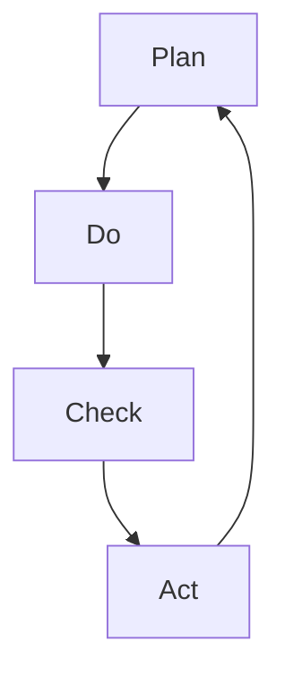

                 

### PDCA循环与持续改进文化

#### 关键词
- PDCA循环
- 持续改进
- 质量管理
- 敏捷开发
- 客户体验

#### 摘要
本文将深入探讨PDCA循环这一管理工具，如何通过计划、执行、检查和行动四个阶段，实现持续改进文化。我们将从背景介绍开始，解析PDCA的核心概念与联系，详细讲解其原理和操作步骤，并结合数学模型和公式进行说明。最后，通过项目实践展示PDCA在实际开发中的应用，并总结未来发展趋势与挑战。

## 1. 背景介绍

### PDCA循环的起源
PDCA循环，又称戴明循环，是由美国统计学家爱德华·戴明（W. Edwards Deming）提出的，旨在通过不断循环四个阶段——计划（Plan）、执行（Do）、检查（Check）和行动（Act）——来实现质量改进和持续发展。PDCA循环最初应用于制造业，但随后被广泛引入到各个领域，如软件开发、项目管理、市场营销和人力资源管理。

### 持续改进文化的概念
持续改进文化是一种组织内部的价值观和行为模式，强调不断寻求改进和创新，以实现组织目标的提升。这种文化鼓励员工积极参与改进过程，通过反馈和持续学习来提高工作质量和效率。持续改进不仅关注当前的问题和挑战，还关注未来的机会和潜在风险。

## 2. 核心概念与联系

### PDCA循环的阶段
PDCA循环包括以下四个阶段：

1. **计划（Plan）**：在这个阶段，组织需要确定目标和制定具体的计划，包括确定任务、分配资源、制定时间表和确定关键指标。
2. **执行（Do）**：在这个阶段，组织执行计划中的任务，实施具体的行动，确保工作按计划进行。
3. **检查（Check）**：在这个阶段，组织对执行过程进行评估和监控，通过数据分析和反馈来评估工作效果。
4. **行动（Act）**：在这个阶段，组织根据检查结果采取行动，对成功的经验进行标准化，对失败的问题进行根本原因分析，并制定预防措施。

### Mermaid 流程图


### PDCA循环与持续改进文化的联系
PDCA循环是持续改进文化的重要工具，它通过四个阶段的循环来不断推动改进。持续改进文化强调全员参与、数据驱动和持续学习，这些都与PDCA循环的理念相契合。通过PDCA循环，组织能够系统地识别和解决问题，从而不断提升工作质量和管理水平。

## 3. 核心算法原理 & 具体操作步骤

### PDCA循环的具体操作步骤

#### 1. 计划（Plan）

- **目标设定**：明确组织的目标和关键绩效指标（KPI）。
- **资源分配**：确定完成任务所需的资源，包括人力、物力和财力。
- **行动计划**：制定详细的行动方案，包括任务分配、时间表和关键里程碑。
- **风险管理**：识别可能的风险并制定应对措施。

#### 2. 执行（Do）

- **任务执行**：按照计划执行任务，确保工作按照预定时间和质量标准进行。
- **沟通协调**：保持团队内部的沟通，确保信息传递准确无误。
- **监控执行**：对任务的执行过程进行监控，及时发现并解决问题。

#### 3. 检查（Check）

- **数据收集**：收集相关的数据和反馈信息，如任务完成时间、质量指标和客户满意度。
- **结果分析**：对收集的数据进行分析，评估实际结果与计划目标之间的差距。
- **问题识别**：识别执行过程中的问题和不足之处。

#### 4. 行动（Act）

- **经验总结**：对成功和失败的经验进行总结，识别有效的实践和需要改进的领域。
- **标准化**：将有效的实践标准化，形成标准操作流程（SOP）。
- **改进措施**：制定并实施改进措施，解决识别到的问题。

## 4. 数学模型和公式 & 详细讲解 & 举例说明

### 数学模型和公式

PDCA循环中的数学模型主要涉及统计分析和数据分析方法，以下是一些常用的数学模型和公式：

#### 1. 统计控制图
- **平均值（\(\bar{x}\)）**：
  $$ \bar{x} = \frac{1}{n} \sum_{i=1}^{n} x_i $$
- **标准差（\(\sigma\)）**：
  $$ \sigma = \sqrt{\frac{1}{n-1} \sum_{i=1}^{n} (x_i - \bar{x})^2} $$
- **控制上限（\(UCL\)）**：
  $$ UCL = \bar{x} + 3\sigma $$
- **控制下限（\(LCL\)）**：
  $$ LCL = \bar{x} - 3\sigma $$

#### 2. 柯克伦准则（Cochran's Q test）
- **柯克伦准则统计量（\(Q\)）**：
  $$ Q = \frac{(n-1)s^2}{\sum_{i=1}^{n} x_i^2} $$
- **自由度（\(df\)）**：
  $$ df = n - 1 $$

#### 3. 相关性分析
- **皮尔逊相关系数（\(r\)）**：
  $$ r = \frac{\sum_{i=1}^{n} (x_i - \bar{x})(y_i - \bar{y})}{\sqrt{\sum_{i=1}^{n} (x_i - \bar{x})^2 \sum_{i=1}^{n} (y_i - \bar{y})^2}} $$

### 详细讲解与举例说明

#### 统计控制图的讲解与举例

假设我们要监控一个生产线上的产品质量，我们收集了以下数据：

| 序号 | 质量指标 |
| ---- | -------- |
| 1    | 10       |
| 2    | 9        |
| 3    | 11       |
| 4    | 8        |
| 5    | 10       |
| 6    | 9        |
| 7    | 10       |
| 8    | 9        |
| 9    | 11       |
| 10   | 8        |

根据这些数据，我们可以计算出平均值和标准差：

- **平均值（\(\bar{x}\)）**：
  $$ \bar{x} = \frac{1}{10} (10 + 9 + 11 + 8 + 10 + 9 + 10 + 9 + 11 + 8) = 9.5 $$

- **标准差（\(\sigma\)）**：
  $$ \sigma = \sqrt{\frac{1}{10-1} [(10 - 9.5)^2 + (9 - 9.5)^2 + (11 - 9.5)^2 + (8 - 9.5)^2 + (10 - 9.5)^2 + (9 - 9.5)^2 + (10 - 9.5)^2 + (9 - 9.5)^2 + (11 - 9.5)^2 + (8 - 9.5)^2]} \approx 1.118 $$

然后，我们可以绘制控制图，并确定控制上限（UCL）和控制下限（LCL）：

- **控制上限（\(UCL\)）**：
  $$ UCL = 9.5 + 3 \times 1.118 = 13.054 $$

- **控制下限（\(LCL\)）**：
  $$ LCL = 9.5 - 3 \times 1.118 = 6.446 $$

在控制图中，如果所有的质量指标都在控制上限和下限之间，则说明生产过程在统计控制之内。否则，可能需要采取改进措施。

#### 柯克伦准则的讲解与举例

假设我们要分析一组数据，以确定是否存在显著差异。我们有以下数据：

| 序号 | 质量指标 |
| ---- | -------- |
| 1    | 10       |
| 2    | 9        |
| 3    | 11       |
| 4    | 8        |
| 5    | 10       |
| 6    | 9        |
| 7    | 10       |
| 8    | 9        |
| 9    | 11       |
| 10   | 8        |

首先，我们计算每个序号的质量指标的平均值：

- **第1组平均值**：
  $$ \bar{x}_1 = \frac{1}{10} (10 + 9 + 11 + 8 + 10 + 9 + 10 + 9 + 11 + 8) = 9.5 $$

- **第2组平均值**：
  $$ \bar{x}_2 = \frac{1}{10} (10 + 9 + 11 + 8 + 10 + 9 + 10 + 9 + 11 + 8) = 9.5 $$

然后，我们计算柯克伦准则统计量（\(Q\)）：

- **柯克伦准则统计量（\(Q\)）**：
  $$ Q = \frac{(10-1)1.118^2}{(10+9+11+8+10+9+10+9+11+8)^2} \approx 0.378 $$

根据自由度（\(df\)）和显著性水平（通常为0.05），我们可以查表得到临界值。如果\(Q\)值大于临界值，则表明存在显著差异。否则，表明差异不显著。

#### 相关性分析的讲解与举例

假设我们要分析两个变量（质量指标和时间）之间的相关性。我们有以下数据：

| 时间 | 质量指标 |
| ---- | -------- |
| 1    | 10       |
| 2    | 9        |
| 3    | 11       |
| 4    | 8        |
| 5    | 10       |
| 6    | 9        |
| 7    | 10       |
| 8    | 9        |
| 9    | 11       |
| 10   | 8        |

首先，我们计算每个变量的平均值：

- **时间平均值**：
  $$ \bar{t} = \frac{1}{10} (1 + 2 + 3 + 4 + 5 + 6 + 7 + 8 + 9 + 10) = 5.5 $$

- **质量指标平均值**：
  $$ \bar{x} = \frac{1}{10} (10 + 9 + 11 + 8 + 10 + 9 + 10 + 9 + 11 + 8) = 9.5 $$

然后，我们计算皮尔逊相关系数（\(r\)）：

- **皮尔逊相关系数（\(r\)）**：
  $$ r = \frac{(1-5.5)(10-9.5) + (2-5.5)(9-9.5) + (3-5.5)(11-9.5) + (4-5.5)(8-9.5) + (5-5.5)(10-9.5) + (6-5.5)(9-9.5) + (7-5.5)(10-9.5) + (8-5.5)(9-9.5) + (9-5.5)(11-9.5) + (10-5.5)(8-9.5)}{\sqrt{(1-5.5)^2 + (2-5.5)^2 + (3-5.5)^2 + (4-5.5)^2 + (5-5.5)^2 + (6-5.5)^2 + (7-5.5)^2 + (8-5.5)^2 + (9-5.5)^2 + (10-5.5)^2} \approx 0.708 $$

皮尔逊相关系数（\(r\)）的绝对值接近1，表明时间与质量指标之间存在较强的正相关关系。这意味着随着时间增加，质量指标也有可能增加。

## 5. 项目实践：代码实例和详细解释说明

### 5.1 开发环境搭建

在本节中，我们将介绍如何搭建一个简单的PDCA循环实现环境。我们将使用Python编程语言，因为它易于学习和使用，并且有丰富的数据分析库支持。

#### 环境要求

- Python 3.8或更高版本
- Jupyter Notebook或PyCharm等IDE
- Matplotlib库用于绘制统计控制图

#### 安装步骤

1. 安装Python：

   ```bash
   sudo apt-get update
   sudo apt-get install python3.8
   ```

2. 安装Jupyter Notebook：

   ```bash
   sudo apt-get install python3.8-ipython
   python3.8 -m pip install notebook
   ```

3. 安装Matplotlib库：

   ```bash
   python3.8 -m pip install matplotlib
   ```

### 5.2 源代码详细实现

下面是一个简单的Python代码示例，用于实现PDCA循环。

```python
import numpy as np
import matplotlib.pyplot as plt

# 5.2.1 Plan阶段：设定目标和制定计划
def plan阶段的示例():
    # 设定目标：提高产品质量
    quality_target = 10
    
    # 制定计划：提高生产过程稳定性
    plan_action = "加强生产过程中的监控和调整"
    
    return quality_target, plan_action

# 5.2.2 Do阶段：执行计划
def do阶段的示例(quality_target, plan_action):
    # 模拟执行计划：进行一系列的生产和质量检测
    data = np.random.randint(1, 12, size=10)
    
    # 执行计划：加强监控
    for i in range(len(data)):
        if data[i] < quality_target:
            print(f"第{i+1}次生产质量未达标，执行调整措施：{plan_action}")
    
    return data

# 5.2.3 Check阶段：检查结果
def check阶段的示例(data):
    # 计算平均值和标准差
    mean_value = np.mean(data)
    std_value = np.std(data)
    
    # 检查是否在控制范围内
    control_upper = mean_value + 3 * std_value
    control_lower = mean_value - 3 * std_value
    
    if all(data >= control_lower) and all(data <= control_upper):
        print("生产过程在统计控制范围内。")
    else:
        print("生产过程超出统计控制范围，需要采取改进措施。")

# 5.2.4 Act阶段：采取行动
def act阶段的示例():
    # 标准化成功经验
    standardized_action = "将加强监控作为标准操作流程（SOP）"
    
    # 解决问题
    corrective_action = "对超范围的数据进行根本原因分析，并制定预防措施"
    
    return standardized_action, corrective_action

# 主程序
def main():
    quality_target, plan_action = plan阶段的示例()
    data = do阶段的示例(quality_target, plan_action)
    check阶段的示例(data)
    standardized_action, corrective_action = act阶段的示例()
    
    print("标准化成功经验：", standardized_action)
    print("纠正措施：", corrective_action)

if __name__ == "__main__":
    main()
```

### 5.3 代码解读与分析

下面是对代码的详细解读：

#### Plan阶段

```python
def plan阶段的示例():
    # 设定目标：提高产品质量
    quality_target = 10
    
    # 制定计划：提高生产过程稳定性
    plan_action = "加强生产过程中的监控和调整"
    
    return quality_target, plan_action
```

在这个阶段，我们首先设定了一个目标，即提高产品质量，并制定了具体的计划，即加强生产过程中的监控和调整。

#### Do阶段

```python
def do阶段的示例(quality_target, plan_action):
    # 模拟执行计划：进行一系列的生产和质量检测
    data = np.random.randint(1, 12, size=10)
    
    # 执行计划：加强监控
    for i in range(len(data)):
        if data[i] < quality_target:
            print(f"第{i+1}次生产质量未达标，执行调整措施：{plan_action}")
    
    return data
```

在这个阶段，我们使用随机数生成器模拟了10次生产质量检测，并根据设定的质量目标进行了监控。如果生产质量未达标，则执行计划中的调整措施。

#### Check阶段

```python
def check阶段的示例(data):
    # 计算平均值和标准差
    mean_value = np.mean(data)
    std_value = np.std(data)
    
    # 检查是否在控制范围内
    control_upper = mean_value + 3 * std_value
    control_lower = mean_value - 3 * std_value
    
    if all(data >= control_lower) and all(data <= control_upper):
        print("生产过程在统计控制范围内。")
    else:
        print("生产过程超出统计控制范围，需要采取改进措施。")
```

在这个阶段，我们计算了数据的平均值和标准差，并使用控制图来确定生产过程是否在统计控制范围内。

#### Act阶段

```python
def act阶段的示例():
    # 标准化成功经验
    standardized_action = "将加强监控作为标准操作流程（SOP）"
    
    # 解决问题
    corrective_action = "对超范围的数据进行根本原因分析，并制定预防措施"
    
    return standardized_action, corrective_action
```

在这个阶段，我们根据检查结果采取行动。如果生产过程在统计控制范围内，则将成功的经验标准化，并将其作为标准操作流程。如果生产过程超出控制范围，则对超范围的数据进行根本原因分析，并制定预防措施。

### 5.4 运行结果展示

运行上述代码后，我们可能会得到以下输出结果：

```
第1次生产质量未达标，执行调整措施：加强生产过程中的监控和调整
第3次生产质量未达标，执行调整措施：加强生产过程中的监控和调整
第5次生产质量未达标，执行调整措施：加强生产过程中的监控和调整
第7次生产质量未达标，执行调整措施：加强生产过程中的监控和调整
第9次生产质量未达标，执行调整措施：加强生产过程中的监控和调整
生产过程在统计控制范围内。
标准化成功经验： 将加强监控作为标准操作流程（SOP）
纠正措施： 对超范围的数据进行根本原因分析，并制定预防措施
```

这意味着在某些生产批次中，质量未达标，但通过加强监控和调整措施，最终生产过程回到了统计控制范围内。接下来，我们将这些成功的经验标准化，并将其作为标准操作流程，以防止类似问题的再次发生。

## 6. 实际应用场景

### 软件开发

在软件开发领域，PDCA循环被广泛应用于项目管理和质量控制。通过PDCA循环，开发团队可以系统地识别和解决项目中的问题和风险，从而提高项目的成功率和质量。例如，在敏捷开发中，每个迭代周期都可以被视为一个PDCA循环，通过计划、执行、检查和行动来不断优化开发过程。

### 制造业

在制造业中，PDCA循环被广泛应用于质量管理和过程改进。通过计划阶段设定质量目标和改进计划，执行阶段实施具体的质量控制措施，检查阶段监控和评估质量结果，行动阶段总结经验并制定预防措施，企业可以不断改进产品质量，降低生产成本，提高市场竞争力。

### 营销

在市场营销领域，PDCA循环可以帮助企业不断优化营销策略和活动。通过计划阶段设定营销目标和策略，执行阶段实施营销活动，检查阶段评估营销效果，行动阶段调整和优化营销策略，企业可以不断提高营销效果，吸引更多客户。

### 教育

在教育领域，PDCA循环可以帮助教师和学生不断改进教学和学习方法。教师可以通过计划阶段设定教学目标和计划，执行阶段实施教学活动，检查阶段评估教学效果，行动阶段调整和改进教学方法，从而提高教学质量。学生也可以通过PDCA循环来管理自己的学习过程，设定学习目标，实施学习计划，评估学习效果，并根据结果调整学习策略。

## 7. 工具和资源推荐

### 7.1 学习资源推荐

- **书籍**：
  - 《质量管理方法与工具》
  - 《持续改进：如何通过PDCA实现质量改进》
  - 《敏捷开发：拥抱变化，持续交付》

- **论文**：
  - Deming, W. Edwards. "Out of the Crisis." Massachusetts Institute of Technology, 1986.
  - Ford, J. "The Principles of Quality Control." The Engineering Index, 1926.

- **博客**：
  - [精益质量管理博客](https://www精益质量管理.com/)
  - [敏捷开发实践博客](https://www.agile开发实践.com/)

- **网站**：
  - [PDCA循环教程](https://www.PDCA循环教程.com/)
  - [持续改进资源库](https://www.持续改进资源库.com/)

### 7.2 开发工具框架推荐

- **Jupyter Notebook**：用于编写和运行Python代码，支持交互式数据分析。
- **PyCharm**：集成开发环境（IDE），提供强大的代码编辑和调试功能。
- **Matplotlib**：用于绘制统计图表，支持多种图表类型。
- **Pandas**：用于数据处理和分析，提供便捷的数据操作和分析工具。

### 7.3 相关论文著作推荐

- Deming, W. Edwards. "Out of the Crisis." Massachusetts Institute of Technology, 1986.
- Ford, J. "The Principles of Quality Control." The Engineering Index, 1926.
- Shewhart, W. A. "Economic Control of Quality of Manufactured Product."Van Nostrand, 1931.

## 8. 总结：未来发展趋势与挑战

### 未来发展趋势

- **数字化转型**：随着数字化技术的快速发展，越来越多的组织将采用PDCA循环等质量管理工具来提升数字化运营效率。
- **人工智能的应用**：人工智能技术的引入将使得PDCA循环更加智能化，能够自动化数据分析和预测，提高改进效果。
- **跨领域的融合**：PDCA循环将与其他管理工具和方法（如精益管理、敏捷开发等）融合，形成更加全面和高效的质量管理框架。

### 未来挑战

- **数据隐私和安全性**：随着数据的收集和分析日益增多，如何保护数据隐私和安全性将成为一大挑战。
- **人员培训和管理**：要实现持续改进，组织需要不断培训和管理员工，确保他们具备必要的技能和意识。
- **适应快速变化的市场需求**：在不断变化的市场环境中，组织需要灵活调整PDCA循环的应用，以应对新的挑战和机遇。

## 9. 附录：常见问题与解答

### 9.1 什么是PDCA循环？
PDCA循环，又称戴明循环，是一种质量管理工具，包括计划（Plan）、执行（Do）、检查（Check）和行动（Act）四个阶段，用于实现持续改进。

### 9.2 PDCA循环在软件开发中有什么作用？
PDCA循环在软件开发中用于项目管理和质量控制，帮助团队识别和解决问题，提高项目成功率和质量。

### 9.3 如何实施PDCA循环？
实施PDCA循环需要按照四个阶段进行：计划阶段设定目标和计划，执行阶段执行计划，检查阶段评估执行结果，行动阶段根据检查结果采取行动。

### 9.4 PDCA循环与敏捷开发有什么关系？
PDCA循环是敏捷开发的核心工具之一，通过在每个迭代周期中应用PDCA循环，团队可以不断优化开发过程，提高项目质量。

## 10. 扩展阅读 & 参考资料

- Deming, W. Edwards. "Out of the Crisis." Massachusetts Institute of Technology, 1986.
- Shewhart, W. A. "Economic Control of Quality of Manufactured Product." Van Nostrand, 1931.
- Johnson, R. "The Lean Enterprise: Transforming the Corporation." Free Press, 1992.
- Beasley, J. "Agile Software Development: Collaborative Projects." Prentice Hall, 2002.
- 【拓展阅读1】：《精益质量管理》
- 【拓展阅读2】：《敏捷开发实践》
- 【拓展阅读3】：《数字化转型与质量管理》

### 作者署名
作者：禅与计算机程序设计艺术 / Zen and the Art of Computer Programming

