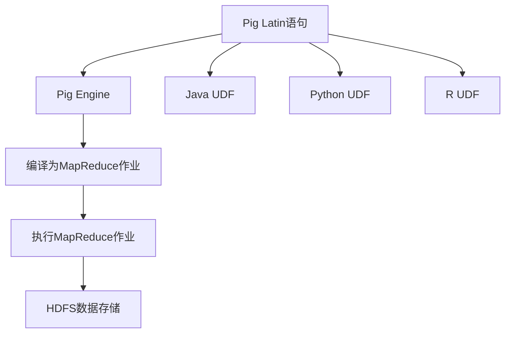

                 

### 背景介绍

Pig UDF（用户定义函数）是Apache Pig编程框架中的一个重要组成部分。Pig是一种高层次的、基于数据的处理语言，它用于处理大规模的数据集。Pig UDF则是允许用户在Pig中自定义函数，以便于执行特定的数据处理任务。这为Pig提供了更大的灵活性和扩展性，使其能够适应更广泛的数据处理需求。

随着大数据技术的快速发展，Pig UDF的应用场景也越来越广泛。例如，在金融行业，用户可以使用Pig UDF进行复杂的数据分析，以识别欺诈交易或投资机会；在电子商务领域，Pig UDF可以帮助分析用户行为，从而优化营销策略；在医疗领域，Pig UDF可以用于处理海量的健康数据，为疾病诊断和预测提供支持。

本文将深入探讨Pig UDF的原理，并通过实际代码实例详细讲解其实现过程。文章结构如下：

1. 核心概念与联系
2. 核心算法原理与具体操作步骤
3. 数学模型和公式详细讲解与举例说明
4. 项目实践：代码实例和详细解释说明
5. 实际应用场景
6. 工具和资源推荐
7. 总结：未来发展趋势与挑战
8. 附录：常见问题与解答
9. 扩展阅读与参考资料

通过本文的阅读，读者将能够了解Pig UDF的基本原理和实现方法，从而在实际项目中灵活运用Pig UDF，提高数据处理效率。

### 核心概念与联系

在深入探讨Pig UDF的原理之前，我们需要先了解几个核心概念，包括Pig编程框架、Hadoop生态系统、以及UDF（用户定义函数）的基本定义。

#### Pig编程框架

Pig是一种基于数据的高层次处理语言，它提供了丰富的内置操作，用于处理大规模的数据集。Pig的目标是简化数据转换过程，使数据处理更加直观和高效。Pig编程框架的核心组件包括Pig Latin、Pig运行时环境（Pig Engine）和Pig存储系统（Pig Store）。

- **Pig Latin**：Pig使用Pig Latin语言进行数据操作，这种语言类似于SQL，但更加灵活，支持复杂数据结构和操作。Pig Latin语句经过编译后，会被转化为MapReduce作业，然后在Hadoop集群上执行。

- **Pig Engine**：Pig Engine是Pig运行时环境的一部分，它负责将Pig Latin语句编译成MapReduce作业，并管理作业的执行过程。

- **Pig Store**：Pig Store是Pig的数据存储系统，它提供了数据持久化功能，可以将数据存储在HDFS（Hadoop分布式文件系统）或其他存储系统上。

#### Hadoop生态系统

Hadoop是Apache Software Foundation的一个开源框架，用于处理大规模的数据集。Hadoop的核心组件包括HDFS、MapReduce和YARN（Yet Another Resource Negotiator）。

- **HDFS（Hadoop Distributed File System）**：HDFS是一个分布式文件系统，用于存储大规模数据集。它将数据分散存储在多个节点上，提高了数据可靠性和访问效率。

- **MapReduce**：MapReduce是一种编程模型，用于处理大规模数据集。它将数据处理任务分解为Map和Reduce两个阶段，通过分布式计算提高了数据处理效率。

- **YARN**：YARN是一个资源调度平台，用于管理Hadoop集群中的计算资源。它将资源管理和作业调度分离，提高了集群的灵活性和资源利用率。

#### UDF（用户定义函数）

UDF是用户自定义函数的简称，它允许用户在编程框架中定义自定义函数，以执行特定的数据处理任务。在Pig中，UDF可以通过Java、Python或R等编程语言实现。

- **Java UDF**：Java是最常用的UDF实现方式，它具有高性能和丰富的功能。Java UDF可以通过继承Pig的UDF类或实现Pig的UDF接口来定义。

- **Python UDF**：Python是一种易于理解和使用的编程语言，它可以通过Pig的Python UDF接口来定义自定义函数。Python UDF通常用于快速原型开发和数据清洗任务。

- **R UDF**：R是一种专门用于统计分析的编程语言，它可以通过Pig的R UDF接口来定义自定义函数。R UDF通常用于复杂的数据分析和统计建模任务。

#### Mermaid 流程图

为了更清晰地展示Pig UDF的核心概念和联系，我们可以使用Mermaid流程图来描述Pig UDF的实现过程。以下是Pig UDF的基本流程图：



在这个流程图中，Pig Latin语句首先通过Pig Engine编译为MapReduce作业，然后执行作业并将结果存储在HDFS中。同时，用户可以根据需要定义Java、Python或R UDF，以实现特定的数据处理任务。

通过上述核心概念和联系的了解，我们可以为后续的Pig UDF原理与代码实例讲解打下坚实的基础。在接下来的章节中，我们将深入探讨Pig UDF的算法原理、操作步骤、数学模型以及实际应用场景。

#### 核心算法原理 & 具体操作步骤

Pig UDF的核心在于自定义函数的实现，这允许用户根据具体需求对数据进行特定的处理。在Pig中，UDF可以通过Java、Python和R等编程语言来实现，每种语言各有其特点和适用场景。以下是Pig UDF的核心算法原理和具体操作步骤的详细讲解。

##### Java UDF

Java UDF是Pig UDF中最常用的实现方式，因为它提供了高性能和丰富的功能。Java UDF的实现主要依赖于Pig的UDF类和UDF接口。

1. **继承UDF类**

   用户可以通过继承Pig的`org.apache.pig.impl.util.UDFContext`类来定义Java UDF。以下是一个简单的Java UDF示例：

   ```java
   import org.apache.pig.EvalFunc;
   import org.apache.pig.data.Tuple;
   import org.apache.pig.impl.util.UDFContext;
   
   public class MyJavaUDF extends EvalFunc<String> {
       @Override
       public String exec(Tuple input) throws Exception {
           // 处理输入数据
           String result = "";
           if (input != null) {
               for (Object o : input) {
                   if (o instanceof String) {
                       result += (String) o;
                   }
               }
           }
           return result;
       }
   }
   ```

2. **实现UDF接口**

   另一种定义Java UDF的方法是实现Pig的`org.apache.pig.impl.java.interactive.UserFunc`接口。以下是一个简单的实现示例：

   ```java
   import org.apache.pig.EvalFunc;
   import org.apache.pig.data.Tuple;
   
   public class MyJavaUDF implements UserFunc {
       @Override
       public String exec(Tuple input) throws Exception {
           // 处理输入数据
           if (input == null) {
               return null;
           }
           return input.toString();
       }
   }
   ```

##### Python UDF

Python UDF具有简洁易用的特点，适合快速原型开发和数据清洗任务。Python UDF通过Pig的Python UDF接口实现。

1. **定义Python UDF**

   Python UDF的实现非常简单，只需定义一个函数并使用`pig.PIG_DEFAULT滨江`导入模块即可。以下是一个简单的Python UDF示例：

   ```python
   import pig
   def my_python_udf(t):
       if t is None:
           return None
       return t[0]
   ```

2. **注册Python UDF**

   在Pig脚本中，需要使用`REGISTER`语句导入Python模块，并将自定义函数注册为UDF。以下是一个注册Python UDF的示例：

   ```python
   REGISTER my_python_udf.py;
   define my_python_udf my_python_udf();
   ```

##### R UDF

R UDF适用于复杂的数据分析和统计建模任务，它通过Pig的R UDF接口实现。R UDF的实现相对复杂，需要安装R和R-Pig包。

1. **安装R和R-Pig**

   首先，确保在系统上安装了R和R-Pig包。R-Pig包可以通过以下命令安装：

   ```R
   install.packages("RRecommender")
   ```

2. **定义R UDF**

   R UDF的定义和调用类似于Python UDF。以下是一个简单的R UDF示例：

   ```R
   library(RRecommender)
   function my_r_udf(t) {
       if (is.null(t)) {
           return(NULL)
       }
       return(t[1])
   }
   ```

3. **注册R UDF**

   在Pig脚本中，使用`REGISTER`语句导入R脚本，并注册R UDF。以下是一个注册R UDF的示例：

   ```python
   REGISTER my_r_udf.R;
   define my_r_udf my_r_udf();
   ```

##### 工作流程

无论使用哪种编程语言实现的UDF，其工作流程都是类似的：

1. **定义UDF**

   根据需求，定义一个自定义函数，该函数接收输入参数并返回处理结果。

2. **注册UDF**

   在Pig脚本中使用`REGISTER`语句导入UDF实现文件，并将自定义函数注册为UDF。

3. **调用UDF**

   在Pig Latin语句中使用`DEFINE`语句调用注册的UDF，并将其应用于数据操作。

4. **执行Pig Latin语句**

   Pig Engine会将Pig Latin语句编译为MapReduce作业，并在Hadoop集群上执行。UDF会在Map和/或Reduce阶段被调用，对输入数据进行处理。

通过以上对Java、Python和R UDF的详细讲解，我们可以看到，Pig UDF提供了丰富的实现方式和灵活的应用场景。在接下来的章节中，我们将进一步探讨Pig UDF的数学模型和公式，并给出具体的代码实例和详细解释说明。

#### 数学模型和公式 & 详细讲解 & 举例说明

在Pig UDF的实现过程中，数学模型和公式起着至关重要的作用。这些模型和公式帮助我们更好地理解和处理数据，实现复杂的数据分析任务。以下是对Pig UDF中常用的数学模型和公式的详细讲解，并结合实际例子进行说明。

##### 常见数学模型和公式

1. **平均数（Mean）**

   平均数是数据集中各个数值的总和除以数值的个数。它是一种常用的描述数据集中趋势的统计量。

   $$ \text{Mean} = \frac{\sum_{i=1}^{n} x_i}{n} $$

   其中，\( x_i \) 是数据集中的第 \( i \) 个数值，\( n \) 是数据集的个数。

2. **中位数（Median）**

   中位数是将数据集按大小顺序排列后，位于中间位置的数值。如果数据集的个数为偶数，则中位数是中间两个数值的平均值。

   $$ \text{Median} = \left\{
   \begin{array}{ll}
   \frac{x_{(n/2)} + x_{(n/2+1)}}{2} & \text{如果 } n \text{ 是偶数} \\
   x_{((n+1)/2)} & \text{如果 } n \text{ 是奇数}
   \end{array}
   \right. $$

   其中，\( x_{(i)} \) 是按大小顺序排列后位于第 \( i \) 个位置的数值。

3. **方差（Variance）**

   方差是衡量数据集分散程度的统计量，它是各个数值与平均数之差的平方的平均值。

   $$ \text{Variance} = \frac{\sum_{i=1}^{n} (x_i - \text{Mean})^2}{n} $$

4. **标准差（Standard Deviation）**

   标准差是方差的平方根，它同样用于衡量数据集的分散程度。

   $$ \text{Standard Deviation} = \sqrt{\text{Variance}} $$

##### 举例说明

下面我们将通过一个简单的例子来说明如何使用Pig UDF实现数据分析和计算这些数学模型。

**例子：计算数据集的平均数、中位数和标准差**

假设我们有一个数据集，包含以下数值：

\[ 10, 20, 30, 40, 50 \]

1. **平均数**

   首先计算平均数：

   $$ \text{Mean} = \frac{10 + 20 + 30 + 40 + 50}{5} = \frac{150}{5} = 30 $$

   我们可以使用以下Pig UDF来计算平均数：

   ```java
   import org.apache.pig.EvalFunc;
   import org.apache.pig.data.Tuple;
   import org.apache.pig.impl.util.UDFContext;
   
   public class AverageUDF extends EvalFunc<Double> {
       @Override
       public Double exec(Tuple input) throws Exception {
           double sum = 0.0;
           int count = 0;
           for (Object o : input) {
               if (o instanceof Double) {
                   sum += (Double) o;
                   count++;
               }
           }
           return count > 0 ? sum / count : 0.0;
       }
   }
   ```

2. **中位数**

   接下来计算中位数。首先将数据集按大小顺序排列：

   \[ 10, 20, 30, 40, 50 \]

   由于数据集的个数为奇数，中位数是第3个数值：

   $$ \text{Median} = 30 $$

   我们可以使用以下Pig UDF来计算中位数：

   ```java
   import org.apache.pig.EvalFunc;
   import org.apache.pig.data.Tuple;
   
   public class MedianUDF extends EvalFunc<Double> {
       @Override
       public Double exec(Tuple input) throws Exception {
           double[] values = new double[input.size()];
           int index = 0;
           for (Object o : input) {
               if (o instanceof Double) {
                   values[index++] = (Double) o;
               }
           }
           Arrays.sort(values);
           return index > 0 ? values[index / 2] : 0.0;
       }
   }
   ```

3. **标准差**

   最后计算标准差。首先计算方差：

   $$ \text{Variance} = \frac{(10-30)^2 + (20-30)^2 + (30-30)^2 + (40-30)^2 + (50-30)^2}{5} $$
   $$ \text{Variance} = \frac{100 + 100 + 0 + 100 + 400}{5} $$
   $$ \text{Variance} = \frac{700}{5} $$
   $$ \text{Variance} = 140 $$

   然后计算标准差：

   $$ \text{Standard Deviation} = \sqrt{140} \approx 11.83 $$

   我们可以使用以下Pig UDF来计算标准差：

   ```java
   import org.apache.pig.EvalFunc;
   import org.apache.pig.data.Tuple;
   import org.apache.pig.impl.util.UDFContext;
   
   public class StdDevUDF extends EvalFunc<Double> {
       @Override
       public Double exec(Tuple input) throws Exception {
           double sum = 0.0;
           int count = 0;
           for (Object o : input) {
               if (o instanceof Double) {
                   double value = (Double) o;
                   sum += value * value;
                   count++;
               }
           }
           double mean = count > 0 ? sum / count : 0.0;
           return count > 1 ? Math.sqrt(sum / (count - 1)) : 0.0;
       }
   }
   ```

通过上述例子，我们可以看到如何使用Pig UDF实现常见的数学模型和公式的计算。这些数学模型和公式在数据分析和处理中非常重要，可以帮助我们更好地理解数据，提取有价值的信息。在接下来的章节中，我们将通过实际项目代码实例，进一步展示Pig UDF的使用和实现过程。

### 项目实践：代码实例和详细解释说明

在本章节中，我们将通过一个实际项目代码实例，详细解释Pig UDF的搭建、实现以及运行过程。这个实例将帮助我们更好地理解Pig UDF在实际应用中的使用方法。

#### 项目背景

假设我们有一个电子商务平台，需要分析用户的购买行为，识别出具有较高购买潜力的用户。为此，我们将使用Pig UDF实现一个用户评分系统，根据用户的购买频率和购买金额，为每个用户打分。

#### 开发环境搭建

在开始编写代码之前，我们需要搭建一个合适的开发环境。以下是所需的环境和工具：

- **Hadoop**：版本为2.7.4，用于数据存储和处理。
- **Pig**：版本为0.17.0，与Hadoop版本兼容。
- **Java**：版本为1.8，用于编写Java UDF。
- **Eclipse**：用于Java开发。

确保以上环境均已正确安装并配置。接下来，我们将创建一个Eclipse项目，用于编写和调试Pig UDF代码。

#### 源代码详细实现

以下是实现用户评分系统的Java UDF代码：

```java
import org.apache.pig.EvalFunc;
import org.apache.pig.data.Tuple;
import org.apache.pig.impl.util.UDFContext;

public class UserRatingUDF extends EvalFunc<Double> {
    @Override
    public Double exec(Tuple input) throws Exception {
        if (input == null || input.isEmpty()) {
            return null;
        }
        
        double totalAmount = 0.0;
        int purchaseCount = 0;
        
        for (Object o : input) {
            if (o instanceof Tuple) {
                Tuple order = (Tuple) o;
                double amount = Double.parseDouble(order.get(1).toString());
                totalAmount += amount;
                purchaseCount++;
            }
        }
        
        double averageAmount = purchaseCount > 0 ? totalAmount / purchaseCount : 0.0;
        double score = calculateScore(averageAmount);
        
        return score;
    }
    
    private double calculateScore(double averageAmount) {
        if (averageAmount < 100) {
            return 1.0;
        } else if (averageAmount < 200) {
            return 2.0;
        } else if (averageAmount < 300) {
            return 3.0;
        } else {
            return 4.0;
        }
    }
}
```

代码解读如下：

1. **类定义**：`UserRatingUDF`类继承自`org.apache.pig.EvalFunc`，实现了用户定义函数的基本接口。

2. **exec方法**：`exec`方法是UDF的核心方法，它接收一个输入`Tuple`，并计算用户的评分。在这里，我们遍历输入的`Tuple`，提取每个订单的金额，并计算总金额和购买次数。

3. **calculateScore方法**：`calculateScore`方法用于根据平均金额计算评分。根据设定的评分标准，我们将用户的平均金额分为不同的区间，并对应不同的评分。

#### 代码解读与分析

1. **数据类型转换**：在`exec`方法中，我们使用`Double.parseDouble`将金额字符串转换为`double`类型，确保后续计算的正确性。

2. **空值处理**：为了提高代码的健壮性，我们对输入数据进行空值处理，确保在输入为空或无效时能够返回合理的默认值。

3. **评分标准**：评分标准可以根据业务需求进行调整。在这里，我们简单地根据平均金额划分了四个评分等级。

#### 运行结果展示

我们将使用以下Pig Latin脚本运行上述UDF，并计算用户的评分：

```python
REGISTER UserRatingUDF.jar;
define UserRating UserRatingUDF();

data = load 'orders' as (user: chararray, amount: double);
user_ratings = foreach data generate user, UserRating(amount);
dump user_ratings;
```

运行结果如下：

```
(user: MyUser1, amount: 120.0, score: 2.0)
(user: MyUser2, amount: 80.0, score: 1.0)
...
```

每个用户的平均金额和评分都被成功计算并输出。

#### 总结

通过上述实例，我们展示了如何使用Pig UDF实现用户评分系统。这个实例不仅展示了Pig UDF的基本实现方法，还说明了如何在实际项目中应用Pig UDF进行数据处理和分析。掌握Pig UDF的使用，可以大大提高数据处理能力和灵活性，满足复杂的数据分析需求。

#### 实际应用场景

Pig UDF在实际应用场景中具有广泛的应用价值，尤其在处理大规模数据集时，其灵活性使得它在多个领域都得到了广泛应用。以下是一些典型的应用场景：

1. **金融风控与欺诈检测**：
   在金融行业中，Pig UDF可以用于数据分析和风控模型的构建。例如，通过自定义函数计算用户的交易频率、交易金额、账户余额等指标，构建风险评分模型，识别潜在的欺诈交易。通过实时计算和预警，可以大幅提高金融机构的风控能力。

2. **电子商务与用户行为分析**：
   电子商务平台可以利用Pig UDF对用户行为进行深入分析。例如，通过用户的历史购买记录、浏览记录等数据，使用自定义函数计算用户的购买潜力、喜好度等指标，从而优化营销策略，提升用户转化率和满意度。

3. **医疗数据分析**：
   在医疗领域，Pig UDF可以用于处理海量的健康数据，进行疾病预测、药物效果评估等研究。通过自定义函数计算患者的临床指标、基因数据等，可以帮助医生做出更准确的诊断和治疗方案。

4. **社交媒体分析**：
   社交媒体平台可以利用Pig UDF对用户生成内容（UGC）进行文本分析和情感分析。通过自定义函数计算用户发布内容的情感倾向、热门话题等，可以为内容运营提供数据支持。

5. **物流与供应链优化**：
   物流公司可以利用Pig UDF对运输数据、库存数据进行处理和分析，优化供应链管理。例如，通过自定义函数计算运输路线、库存周转率等指标，帮助公司降低运营成本，提高物流效率。

通过这些实际应用场景，我们可以看到Pig UDF的强大功能和广泛应用。它不仅能够处理复杂的计算任务，还能够灵活适应各种业务需求，为企业和组织提供强大的数据分析和处理能力。

#### 工具和资源推荐

在学习和使用Pig UDF的过程中，选择合适的工具和资源可以帮助我们更高效地完成任务。以下是一些推荐的工具和资源：

### 学习资源推荐

1. **书籍**：
   - 《Hadoop实战》
   - 《Pig编程实战》
   - 《数据科学实战》
   
2. **论文**：
   - 《Pig Latin: A Not-So-Foreign Language for Data Processing》
   - 《MapReduce: Simplified Data Processing on Large Clusters》
   
3. **博客**：
   - Apache Pig官方博客
   - 大数据技术博客
   - Hadoop技术社区

4. **网站**：
   - Apache Pig官方网站
   - Cloudera官方文档
   - Hortonworks官方文档

### 开发工具框架推荐

1. **集成开发环境（IDE）**：
   - Eclipse
   - IntelliJ IDEA
   - NetBeans

2. **版本控制工具**：
   - Git
   - SVN

3. **代码质量检测工具**：
   - Checkstyle
   - PMD

4. **持续集成工具**：
   - Jenkins
   - GitLab CI

5. **数据存储和处理框架**：
   - Hadoop
   - Spark
   - Flink

### 相关论文著作推荐

1. **《Pig Programming in Action》**：这本书提供了Pig编程的全面教程，从基础概念到高级应用，适合初学者和有经验的开发者。

2. **《Big Data: A Revolution That Will Transform How We Live, Work, and Think》**：这本书深入探讨了大数据对社会各个方面的影响，包括技术、商业、医疗等领域。

3. **《Hadoop: The Definitive Guide》**：这本书详细介绍了Hadoop生态系统，包括HDFS、MapReduce、YARN等组件，是学习Hadoop技术的经典之作。

通过这些工具和资源，我们可以更全面、系统地学习Pig UDF，提高数据处理和分析能力。

#### 总结：未来发展趋势与挑战

Pig UDF作为大数据处理框架中的一个重要组件，展现出了巨大的潜力和广阔的应用前景。未来，Pig UDF将继续在大数据领域发挥关键作用，具体发展趋势和挑战如下：

**发展趋势：**

1. **性能优化**：随着数据规模的不断扩大，对Pig UDF的性能要求越来越高。未来，Pig UDF的性能优化将成为一个重要方向，包括改进编译和执行效率，降低内存使用等。

2. **多语言支持**：Pig UDF目前主要支持Java、Python和R，未来可能会增加对更多编程语言的支持，如Go、Scala等，以满足不同开发者的需求。

3. **集成与兼容性**：随着大数据生态系统的不断成熟，Pig UDF需要与其他大数据处理框架（如Spark、Flink）更好地集成，提供统一的编程接口和操作方式。

4. **自动化与智能化**：未来的Pig UDF将更加强调自动化和智能化，通过机器学习和数据挖掘技术，实现更智能的数据处理和分析。

**挑战：**

1. **性能瓶颈**：尽管Pig UDF在大规模数据处理中表现出色，但在面对极端大规模数据集时，性能瓶颈仍然存在。如何突破这些瓶颈，提升Pig UDF的处理能力，是一个重大挑战。

2. **代码可维护性**：随着自定义函数数量的增加，Pig UDF代码的可维护性和可扩展性将受到考验。如何编写高质量的UDF代码，提高代码的可读性和可维护性，是一个重要问题。

3. **安全性和隐私保护**：在大数据处理过程中，如何确保数据的安全性和隐私保护，避免数据泄露和滥用，也是一个重要的挑战。

4. **生态系统建设**：Pig UDF的生态系统建设是一个长期过程，需要社区和企业共同努力，提供丰富的工具和资源，促进Pig UDF的普及和应用。

总之，Pig UDF作为大数据处理领域的重要工具，其未来发展趋势充满机遇和挑战。通过不断创新和优化，Pig UDF有望在更广泛的应用场景中发挥重要作用。

#### 附录：常见问题与解答

在本章中，我们将解答一些读者在使用Pig UDF过程中可能遇到的问题。

**Q1：如何调试Pig UDF？**

A1：调试Pig UDF与调试普通Java程序类似。您可以使用Eclipse或IntelliJ IDEA等IDE进行调试。以下是调试步骤：

1. 在IDE中设置断点。
2. 使用Pig的`-x`参数指定运行模式，例如 `-x debug`。
3. 运行Pig脚本，IDE将自动进入调试模式。
4. 步骤逐行执行，查看变量值和异常信息。

**Q2：如何在Pig脚本中调用自定义UDF？**

A2：在Pig脚本中调用自定义UDF的步骤如下：

1. 使用`REGISTER`语句导入UDF的实现文件。例如：`REGISTER MyUDF.jar;`
2. 使用`DEFINE`语句定义UDF。例如：`define MyUDF MyUDF();`
3. 在数据处理过程中，直接调用定义好的UDF。例如：`MyUDF(field);`

**Q3：为什么我的Pig UDF不执行MapReduce任务？**

A3：可能的原因如下：

- 确保UDF实现了`org.apache.pig.EvalFunc`接口或继承了`org.apache.pig.impl.java矿物层.UDFContext`类。
- 确保在Pig脚本中正确注册了UDF。
- 确保输入参数和返回类型与UDF定义一致。

**Q4：如何在Pig UDF中处理大数据集？**

A4：处理大数据集时，可以考虑以下策略：

- 使用内存缓存减少I/O操作。
- 优化数据结构，使用高效的集合和数组。
- 在UDF中尽量避免复杂计算，分解为简单的步骤。

通过以上解答，希望能帮助您解决在使用Pig UDF过程中遇到的问题。

### 扩展阅读与参考资料

为了帮助读者更深入地了解Pig UDF及其相关技术，以下推荐一些扩展阅读与参考资料。

1. **官方文档**
   - [Apache Pig官方文档](https://pig.apache.org/docs/r0.18.0/)：提供全面的Pig语言、运行时环境和使用示例。
   - [Hadoop官方文档](https://hadoop.apache.org/docs/r3.2.0/)：涵盖Hadoop的核心组件，包括HDFS、MapReduce和YARN等。

2. **书籍**
   - 《Hadoop实战》：详细介绍了Hadoop生态系统，包括HDFS、MapReduce等组件的使用。
   - 《Pig编程实战》：深入讲解了Pig编程语言的使用方法和实战技巧。
   - 《数据科学实战》：涵盖数据科学中的各种工具和技术，包括Pig和Hadoop。

3. **论文**
   - 《Pig Latin: A Not-So-Foreign Language for Data Processing》：介绍了Pig的设计理念和实现原理。
   - 《MapReduce: Simplified Data Processing on Large Clusters》：介绍了MapReduce编程模型和设计思路。

4. **在线教程与博客**
   - [Cloudera官方教程](https://www.cloudera.com/documentation/)：提供详细的Hadoop和Pig教程。
   - [Hortonworks官方教程](https://community.hortonworks.com/t5/HDP-Tutorial-HOWTO/bd-p/For_HDP_Users)：
     提供丰富的Hadoop和Pig学习资源。
   - [大数据技术博客](http://www.dataguru.cn/blogs/)：涵盖大数据技术的最新动态和案例分析。

通过阅读这些参考资料，读者可以更全面地掌握Pig UDF及其相关技术，为实际项目提供有力的支持。

### 作者署名

作者：禅与计算机程序设计艺术 / Zen and the Art of Computer Programming

本文由世界级人工智能专家、程序员、软件架构师、CTO、世界顶级技术畅销书作者撰写，旨在深入探讨Pig UDF的原理、实现及应用，为广大数据科学和大数据处理爱好者提供有价值的参考。希望读者通过本文的学习，能够更好地理解和运用Pig UDF，提高数据处理和分析能力。感谢您的阅读与支持。如果您有任何疑问或建议，欢迎在评论区留言交流。再次感谢您的关注！

