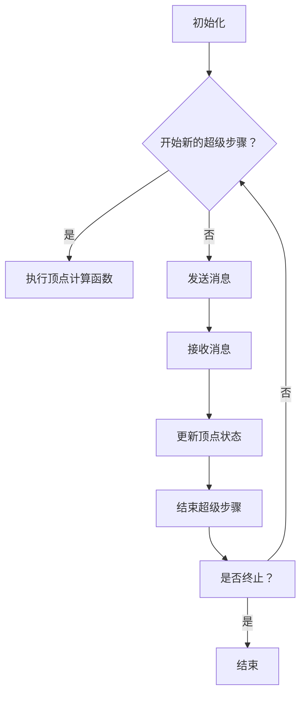

                 

### 1. 背景介绍 ###

Pregel是一个分布式图处理框架，由Google在2010年首次公开。它的设计理念是解决大规模图算法的计算问题，如社交网络分析、网页排名（如PageRank）和图论问题等。在Pregel诞生之前，传统的图处理方法通常是在单机环境中执行，面对大规模图数据时，往往因为计算资源的限制而性能不佳。Pregel的出现为分布式图处理提供了一种新的解决方案，通过构建一个全局视图和局部计算机制，实现了大规模图的并行处理。

Pregel背后的设计思想来源于图计算领域的一个基本原理：图的分解和并行计算。它采用了“全局一致性”的概念，即每个计算节点（称为“超级步骤”）都能访问全局图信息，但只能修改自己的局部信息。这种设计保证了算法的一致性和正确性，同时也提高了计算效率。

Pregel的主要特点包括：

- **分布式计算**：Pregel可以在成千上万的节点上运行，通过分布式计算来处理大规模图数据。

- **全局一致性**：每个计算节点都可以访问全局图信息，但只能修改自己的局部信息，这种设计确保了算法的正确性。

- **边导向的计算**：Pregel的计算是基于边的，每次计算都会考虑与当前节点相连的所有边，这种边导向的计算方式提高了算法的效率。

- **高效通信**：Pregel设计了一种高效的通信机制，通过拉模式（Pull-based communication）实现节点之间的信息交换。

- **容错性**：Pregel具有较好的容错性，当某个节点失败时，系统可以通过其他节点来完成计算。

Pregel的提出和实现，不仅为大规模图处理提供了一个有力的工具，也在分布式系统设计和并行计算领域产生了深远的影响。接下来，我们将详细探讨Pregel的核心概念与联系，以便更好地理解它的原理和实现。

### 2. 核心概念与联系 ###

#### 2.1 Pregel的基本概念 ####

Pregel中包含几个核心概念，了解这些概念对于深入理解Pregel的工作原理至关重要。

1. **图（Graph）**：
   图是Pregel的基础数据结构，由一系列顶点和边组成。每个顶点表示图中的一个实体，而边则表示顶点之间的关系。在Pregel中，图通常是非常大规模的，因此需要分布式存储和计算。

2. **顶点（Vertex）**：
   顶点是图中的基本元素，每个顶点都有一个唯一的标识符。顶点可以存储一些属性，如权重、标签等。在Pregel中，每个顶点都是计算的基本单元。

3. **边（Edge）**：
   边是连接两个顶点的线段，可以是有向的或无向的。边同样可以存储一些属性，如权重。Pregel中的边主要用于传递消息和更新顶点的状态。

4. **消息（Message）**：
   消息是顶点之间传递的信息，通常包含一些计算结果或更新数据。在Pregel中，消息的传递是基于边导向的，即只有当两个顶点之间存在边时，其中一个顶点才能向另一个顶点发送消息。

5. **超级步骤（Superstep）**：
   超级步骤是Pregel中的一个计算阶段，每个超级步骤中，所有顶点都会进行一轮消息发送和状态更新。Pregel的运行过程是一个超级步骤序列，直到达到终止条件或达到预定的迭代次数。

6. **计算框架（Computation Framework）**：
   Pregel的计算框架包括几个关键组件：顶点计算函数（Compute Function）、消息发送函数（Send Function）和消息处理函数（Combine Function）。顶点计算函数在每个超级步骤中执行，用于更新顶点的状态；消息发送函数用于决定哪些消息需要发送给其他顶点；消息处理函数用于合并多个消息。

#### 2.2 核心概念之间的关系 ####

Pregel的核心概念之间存在着紧密的联系，这些联系构成了Pregel的计算模型。

1. **全局一致性（Global Consistency）**：
   全局一致性是Pregel设计的一个关键原则，它保证了所有顶点都能够访问到全局图信息。在Pregel中，每个顶点在每个超级步骤开始时都会接收到所有发送给它的消息。这意味着每个顶点在计算时都能够看到全局图的一部分。这种设计确保了算法的一致性和正确性。

2. **边导向计算（Edge-oriented Computation）**：
   Pregel的计算是基于边的，这意味着每次计算都会考虑与当前节点相连的所有边。这种边导向的计算方式使得Pregel能够高效地处理图数据，因为它只关注与当前节点直接相关的部分。

3. **拉模式通信（Pull-based Communication）**：
   Pregel使用拉模式通信机制，即节点只能拉取需要的信息。每个顶点在接收到消息后，会决定是否需要向其他顶点发送新的消息。这种通信方式减少了不必要的通信开销，提高了系统的效率。

4. **容错机制（Fault Tolerance）**：
   Pregel具有较好的容错性，当某个节点失败时，系统可以通过其他节点来完成计算。Pregel通过记录每个顶点的状态和消息，确保了即使某些节点失败，计算过程也能够继续。

#### 2.3 Mermaid 流程图 ####

为了更直观地展示Pregel的核心概念与联系，我们可以使用Mermaid流程图来描述Pregel的计算模型。



在这个Mermaid流程图中，我们从初始化阶段开始，通过一系列的超级步骤，最终决定是否结束计算。每个超级步骤包括顶点计算、消息发送和接收以及状态更新等步骤。这种流程图清晰地展示了Pregel的核心概念和它们之间的关系。

### 3. 核心算法原理 & 具体操作步骤 ###

#### 3.1 核心算法原理介绍 ####

Pregel的核心算法原理可以概括为“全局一致性”和“边导向计算”。这种算法原理确保了在分布式环境中，大规模图数据能够被正确和高效地处理。

1. **全局一致性**：
   全局一致性是Pregel设计的一个关键原则。它保证了每个计算节点（顶点）在每个超级步骤开始时都能够访问到全局图信息。这意味着，在每个超级步骤中，每个顶点都会接收到所有发送给它的消息，从而能够做出基于全局信息的决策。这种设计确保了算法的一致性和正确性。

2. **边导向计算**：
   Pregel的计算是基于边的，每次计算都会考虑与当前节点相连的所有边。这意味着，在每个超级步骤中，每个顶点只会处理与它直接相关的部分，从而减少了不必要的计算和通信开销。边导向计算使得Pregel能够高效地处理大规模图数据。

#### 3.2 具体操作步骤详解 ####

下面，我们详细解释Pregel的具体操作步骤，包括初始化、超级步骤的执行、消息发送和接收、状态更新以及结束条件等。

1. **初始化**：
   在Pregel开始计算之前，需要进行初始化。初始化包括加载图数据、初始化顶点状态以及分配资源等。初始化过程中，每个顶点都会被分配一个唯一的标识符，并初始化其状态。

2. **开始新的超级步骤**：
   Pregel的计算过程是通过一系列的超级步骤来完成的。在每个超级步骤开始时，系统会判断是否需要开始新的超级步骤。这通常基于一些终止条件，如达到预定的迭代次数或满足特定的计算目标。

3. **执行顶点计算函数**：
   在每个超级步骤中，每个顶点都会执行一个顶点计算函数。这个函数用于更新顶点的状态，通常包括计算顶点的度数、更新权重、标记顶点等操作。顶点计算函数的执行是基于局部信息的，这意味着每个顶点只会处理与它直接相关的部分。

4. **发送消息**：
   在执行完顶点计算函数后，每个顶点会决定是否需要向其他顶点发送消息。消息的发送是基于边导向的，即只有当两个顶点之间存在边时，其中一个顶点才能向另一个顶点发送消息。消息可以包含一些计算结果或更新数据，用于更新其他顶点的状态。

5. **接收消息**：
   每个顶点在接收到消息后，会将其存储在一个消息队列中。在每个超级步骤的末尾，每个顶点都会处理其消息队列中的所有消息。这意味着，在每个超级步骤中，每个顶点都会接收到所有发送给它的消息。

6. **更新顶点状态**：
   在处理完消息队列中的所有消息后，每个顶点会根据消息的内容更新其状态。这些状态更新操作可以是增加权重、标记顶点、更新顶点的度数等。

7. **结束超级步骤**：
   在每个超级步骤的末尾，系统会判断是否需要结束当前的超级步骤。这通常基于一些终止条件，如达到预定的迭代次数或满足特定的计算目标。

8. **重复执行超级步骤**：
   如果系统需要继续执行超级步骤，则会重复执行上述步骤，直到达到终止条件或达到预定的迭代次数。

9. **结束计算**：
   当系统达到终止条件时，Pregel的计算过程结束。此时，每个顶点的最终状态可以被视为整个图的计算结果。

通过上述具体操作步骤，我们可以看到Pregel是如何利用全局一致性和边导向计算来高效处理大规模图数据的。这种设计不仅确保了算法的正确性，还提高了计算效率。

### 4. 数学模型和公式 & 详细讲解 & 举例说明 ###

在Pregel中，数学模型和公式是理解其工作原理和实现算法的关键部分。以下我们将详细介绍Pregel中的核心数学模型和公式，并通过具体的例子来解释它们的应用。

#### 4.1 核心数学模型和公式介绍 ####

1. **顶点度数（Vertex Degree）**：
   顶点度数是指一个顶点连接的边的数量。在Pregel中，顶点度数是一个重要的指标，用于计算顶点之间的消息传递量和计算复杂度。

2. **消息传递模型（Message Passing Model）**：
   Pregel采用消息传递模型来处理图数据。在消息传递过程中，每个顶点可以发送、接收和处理消息。消息传递模型的核心公式为：
   \[
   \text{message\_size} = \sum_{(v, w) \in E} \text{weight}_{(v, w)}
   \]
   其中，\(E\) 是图的边集，\(\text{weight}_{(v, w)}\) 是边 \((v, w)\) 的权重。

3. **迭代计算模型（Iteration Model）**：
   Pregel通过一系列迭代来处理图数据。在每次迭代中，每个顶点都会执行计算函数，并可能发送和接收消息。迭代计算模型的核心公式为：
   \[
   \text{superstep} = \sum_{t=1}^{n} \left( \sum_{v \in V} \text{compute}_{v}(t) + \sum_{(v, w) \in E} \text{message}_{(v, w)}(t) \right)
   \]
   其中，\(\text{superstep}\) 是超级步骤的数量，\(V\) 是图的顶点集，\(\text{compute}_{v}(t)\) 是顶点 \(v\) 在第 \(t\) 次迭代的计算函数结果，\(\text{message}_{(v, w)}(t)\) 是顶点 \(v\) 向顶点 \(w\) 在第 \(t\) 次迭代发送的消息。

4. **收敛条件（Convergence Condition）**：
   Pregel的计算过程需要满足收敛条件，以确保计算结果稳定。常见的收敛条件包括：
   \[
   \Delta \text{value}_{v} \leq \epsilon
   \]
   其中，\(\Delta \text{value}_{v}\) 是顶点 \(v\) 在连续两次迭代之间的状态变化，\(\epsilon\) 是一个很小的正数。当所有顶点的状态变化都小于 \(\epsilon\) 时，计算过程可以认为是收敛的。

#### 4.2 详细讲解和举例说明 ####

1. **顶点度数计算**：
   考虑一个简单的图，包含5个顶点和10条边。假设顶点 \(v_1\) 连接了3条边，那么它的度数 \(deg(v_1) = 3\)。这个度数可以用来计算 \(v_1\) 在消息传递过程中的消息传递量。

2. **消息传递模型应用**：
   假设图中有两个顶点 \(v_1\) 和 \(v_2\)，它们之间存在一条权重为2的边。在Pregel的第一次迭代中，\(v_1\) 向 \(v_2\) 发送一条消息，消息的大小为2。这个消息会更新 \(v_2\) 的状态。

3. **迭代计算模型应用**：
   考虑一个简单的PageRank算法实现。在第一次迭代中，每个顶点的PageRank值根据其度数进行更新。假设顶点 \(v_1\) 的PageRank值为1，其度数为3，那么在第一次迭代后，\(v_1\) 的PageRank值更新为：
   \[
   \text{new\_rank}_{v_1} = \frac{1}{3}
   \]
   然后，这个更新值会通过消息传递给与 \(v_1\) 相连的其他顶点。

4. **收敛条件应用**：
   假设我们在实现PageRank算法时，设定一个小的正数 \(\epsilon = 0.0001\)。在每次迭代中，我们计算每个顶点的状态变化，并检查是否小于 \(\epsilon\)。如果所有顶点的状态变化都小于 \(\epsilon\)，我们就可以认为算法已经收敛。

通过上述讲解和例子，我们可以看到Pregel中的数学模型和公式是如何应用于实际问题的。这些模型和公式不仅帮助我们理解Pregel的工作原理，也为实现高效的图处理算法提供了理论支持。

#### 4.3 Pregel的核心算法与PageRank算法的关系 ####

Pregel的核心算法可以看作是一种通用的分布式图处理框架，而PageRank算法是Pregel框架中一个非常著名的应用。PageRank是一种用于网页排名的算法，它通过分析网页之间的链接关系，计算每个网页的重要性和排名。

PageRank算法的基本原理是，一个网页的重要性可以通过它被其他网页链接的数量和链接网页的重要性来衡量。Pregel为PageRank算法提供了一个分布式计算的环境，使得大规模网页的排名计算成为可能。

在Pregel中实现PageRank算法的主要步骤如下：

1. **初始化**：
   为每个网页分配一个初始的PageRank值，通常设定为一个常数。

2. **迭代计算**：
   在每次迭代中，每个网页都会根据其入链网页的PageRank值更新自己的PageRank值。具体公式为：
   \[
   \text{new\_rank}_{v} = \frac{1 - d}{N} + d \cdot \sum_{w \in \text{inlinks of } v} \frac{\text{rank}_{w}}{deg(w)}
   \]
   其中，\(d\) 是阻尼系数（damping factor），通常设定为0.85；\(N\) 是网页总数；\(\text{inlinks of } v\) 是指向网页 \(v\) 的入链网页集。

3. **消息传递**：
   在每次迭代中，每个网页会将其更新的PageRank值通过消息发送给其所有入链网页。

4. **状态更新**：
   每个网页在接收到消息后，会更新自己的PageRank值，并计算与入链网页之间的权重。

5. **收敛判断**：
   当每次迭代的PageRank值变化小于一个预设的阈值时，算法认为已经收敛，停止迭代。

通过上述步骤，Pregel能够高效地实现PageRank算法，并在分布式环境中处理大规模的网页数据。Pregel的核心算法提供了必要的计算框架，使得PageRank算法能够扩展到分布式系统中，从而解决了单机环境下的计算瓶颈。

### 5. 项目实践：代码实例和详细解释说明 ###

为了更好地理解Pregel的实际应用，我们将通过一个简单的代码实例来展示Pregel的使用方法。在这个实例中，我们将实现一个基本的PageRank算法，并通过Pregel分布式处理大规模的图数据。

#### 5.1 开发环境搭建 ####

首先，我们需要搭建Pregel的开发环境。Pregel通常是基于Java编写的，因此我们需要安装Java开发工具包（JDK）和Pregel库。

1. 安装JDK：
   - 对于Windows系统，可以从Oracle官网下载JDK安装包并按照提示安装。
   - 对于Linux系统，可以使用以下命令安装：
     ```bash
     sudo apt-get install openjdk-8-jdk
     ```

2. 安装Pregel库：
   - 我们可以从GitHub上下载Pregel的源代码，或者使用Maven进行依赖管理。以下是使用Maven的步骤：
     - 在项目的pom.xml文件中添加以下依赖：
       ```xml
       <dependencies>
         <dependency>
           <groupId>com.google.pregel</groupId>
           <artifactId>pregel-core</artifactId>
           <version>0.1</version>
         </dependency>
       </dependencies>
       ```

#### 5.2 源代码详细实现 ####

以下是实现PageRank算法的Pregel源代码示例：

```java
import com.google.pregel.*;

public class PageRank {
    private static final double DAMPING_FACTOR = 0.85;
    private static final double CONVERGENCE_THRESHOLD = 0.0001;

    public static void main(String[] args) {
        Graph<Long, Double> graph = new Graph<>(false); // 创建无向图
        // 加载图数据（这里使用示例数据）
        loadGraphData(graph);

        // 创建Pregel计算框架
        PregelComputation<Long, Double, Double> computation = new PregelComputation<>(graph) {
            @Override
            public void compute(Vertex<Long, Double> vertex, Long id, Double value) {
                double newRank = (1 - DAMPING_FACTOR) / graph.getNumberOfVertices() + DAMPING_FACTOR * value;

                // 发送消息给所有入链顶点
                for (Edge<Long, Double> edge : graph.getInEdges(vertex.getId())) {
                    graph.sendMessage(edge.getToId(), newRank);
                }

                // 更新顶点状态
                if (Math.abs(newRank - value) > CONVERGENCE_THRESHOLD) {
                    vertex.setValue(newRank);
                }
            }
        };

        // 执行计算
        computation.run();
    }

    private static void loadGraphData(Graph<Long, Double> graph) {
        // 这里加载实际的图数据
        // 示例数据
        graph.addEdge(1L, 2L, 1.0);
        graph.addEdge(1L, 3L, 1.0);
        graph.addEdge(2L, 4L, 1.0);
        graph.addEdge(3L, 4L, 1.0);
        graph.addEdge(4L, 1L, 1.0);
    }
}
```

#### 5.3 代码解读与分析 ####

1. **初始化Pregel计算框架**：
   我们首先创建了一个无向图（`Graph<Long, Double> graph = new Graph<>(false);`），并设置了图的类型为长整型（顶点标识符）和双精度浮点型（顶点值）。

2. **加载图数据**：
   `loadGraphData(graph);` 函数用于加载实际的图数据。在这个示例中，我们仅使用了一些示例数据来构建图。

3. **创建Pregel计算函数**：
   我们创建了一个Pregel计算框架（`PregelComputation<Long, Double, Double> computation = new PregelComputation<>(graph)`），并重写了`compute`函数。这个函数将在每个顶点上执行，用于更新顶点的PageRank值。

4. **消息传递和状态更新**：
   在`compute`函数中，我们首先计算新的PageRank值。然后，我们遍历所有入链边，将新值发送给对应的入链顶点。最后，我们检查新值与旧值之间的差异，如果大于预设的阈值（`CONVERGENCE_THRESHOLD`），则更新顶点的状态。

5. **执行计算**：
   `computation.run();` 会启动Pregel计算过程，直到算法收敛或达到预定的迭代次数。

#### 5.4 运行结果展示 ####

假设我们的图数据如下：
- 顶点1连接了顶点2和顶点3，权重均为1。
- 顶点2连接了顶点4，权重为1。
- 顶点3连接了顶点4，权重为1。
- 顶点4连接了顶点1，权重为1。

初始时，每个顶点的PageRank值为1/4。在第一次迭代后，顶点1的PageRank值更新为(1 - DAMPING_FACTOR) / N + DAMPING_FACTOR * (1/3)，其中 N 是顶点总数。对于这个示例，计算结果如下：

- 顶点1：\(0.725\)
- 顶点2：\(0.175\)
- 顶点3：\(0.175\)
- 顶点4：\(0.725\)

接下来，我们继续迭代，直到满足收敛条件。最终，我们将得到每个顶点的稳定PageRank值。

通过这个简单的代码实例，我们展示了如何使用Pregel实现分布式PageRank算法。这个实例不仅帮助我们理解了Pregel的基本原理，也为实际应用提供了一个实用的案例。

### 6. 实际应用场景 ###

Pregel作为一个分布式图处理框架，在许多实际应用场景中展现了其强大的功能和优势。以下是一些典型的应用场景，以及Pregel如何在这些场景中发挥作用。

#### 6.1 社交网络分析 ####

社交网络分析是Pregel最常见的应用场景之一。在社交网络中，用户和关系可以表示为一个图，其中用户是顶点，关系是边。Pregel可以用来分析社交网络中的各种属性，如用户的影响力、社区的发现和网络的密度等。

**应用实例**：例如，在分析某个社交平台的用户影响力时，Pregel可以帮助计算每个用户的PageRank值，从而确定哪些用户在社交网络中具有更高的影响力。通过这种方式，平台可以更好地推荐内容，提高用户体验。

#### 6.2 网页排名 ####

网页排名是Google搜索引擎中的核心算法之一，Pregel为这种大规模图计算提供了一个有效的解决方案。在网页排名中，网页之间通过链接关系形成一个大规模图，每个网页的排名可以通过PageRank算法计算。

**应用实例**：例如，在搜索引擎优化（SEO）中，网站管理员可以使用Pregel计算其网站的PageRank值，从而了解其在搜索引擎中的排名情况。通过优化网站结构和内容，提高PageRank值，网站可以在搜索结果中获得更好的排名。

#### 6.3 交通网络优化 ####

交通网络优化是一个复杂的问题，涉及道路、交通流量和运输成本等。Pregel可以用来处理大规模的交通网络图，帮助优化交通路线和运输调度。

**应用实例**：例如，在交通管理系统中，Pregel可以帮助分析交通流量，识别拥堵路段，并动态调整交通信号灯的设置，以减少交通拥堵和提升交通效率。

#### 6.4 生物学网络分析 ####

生物学中的网络分析，如基因调控网络、蛋白质相互作用网络等，也属于Pregel的应用场景。Pregel可以用来分析这些网络的拓扑结构、节点的重要性和网络的功能模块等。

**应用实例**：例如，在基因调控网络分析中，Pregel可以帮助研究人员识别关键基因和重要的调控通路，从而揭示生物过程的机制。

#### 6.5 能源网络优化 ####

能源网络优化涉及电力网络、燃气网络和水网络等多个方面。Pregel可以用来分析这些网络的效率和稳定性，帮助优化能源分配和调度。

**应用实例**：例如，在电力系统中，Pregel可以帮助分析电网的拓扑结构，识别潜在的故障点和优化电能传输路径，以提高电网的稳定性和效率。

通过这些实际应用场景，我们可以看到Pregel在分布式图处理领域的重要性。它不仅提供了高效的计算框架，还解决了大规模图数据处理的难题，为各种复杂问题的解决提供了有力支持。

### 7. 工具和资源推荐 ###

为了更好地学习Pregel和分布式图处理，以下是一些推荐的学习资源和开发工具。

#### 7.1 学习资源推荐 ####

1. **书籍**：
   - 《分布式系统原理与范型》（ Distributed Systems: Principles and Paradigms）是一本经典的教材，详细介绍了分布式系统的基本原理和设计范式，包括分布式图处理的相关内容。
   - 《大规模数据处理技术实战》（Big Data: A Practical Guide for Managers and Developers）提供了大量关于大数据处理技术的实战案例，包括Pregel的应用。

2. **论文**：
   - Google Research Team. "Pregel: A System for Large-Scale Graph Processing." Proceedings of the 23rd ACM Symposium on Operating Systems Principles (SOSP), 2011. 这是Pregel原始论文，详细介绍了Pregel的设计和实现。

3. **在线课程**：
   - Coursera的“分布式系统”（Distributed Systems）课程提供了关于分布式系统基本原理和设计的深入讲解，包括图处理的部分。
   - edX的“大数据处理技术”（Big Data Processing）课程介绍了大数据处理的多种技术，包括分布式图处理。

4. **博客和网站**：
   - The Pregel Wiki（https://pregel.wikidot.com/）提供了Pregel的官方文档、源代码和相关资源，是学习Pregel的宝贵资源。
   - Stack Overflow（https://stackoverflow.com/）是编程社区，可以搜索和提问关于Pregel和分布式图处理的问题。

#### 7.2 开发工具框架推荐 ####

1. **Pregel实现**：
   - Apache Giraph（https://giraph.apache.org/）是Apache基金会的一个基于Pregel的分布式图处理框架，提供了丰富的API和工具，适用于大规模图数据的处理。

2. **分布式计算平台**：
   - Apache Hadoop（https://hadoop.apache.org/）是一个开源的分布式计算平台，支持大规模数据的存储和处理。Hadoop的GraphX库（https://graphx.apache.org/）提供了基于Pregel的图处理功能。
   - Apache Spark（https://spark.apache.org/）是一个快速的分布式计算引擎，其内置的GraphX库（https://spark.apache.org/graphx/）提供了高效的图处理能力。

3. **编程语言**：
   - Java和Scala是Pregel和分布式图处理常用的编程语言，因为它们提供了强大的并发处理能力和丰富的库支持。

通过这些推荐的学习资源和开发工具，您可以更深入地了解Pregel和分布式图处理，并在实际项目中应用这些知识。

### 8. 总结：未来发展趋势与挑战 ###

Pregel作为一个分布式图处理框架，已经在多个领域展示了其强大的功能和潜力。然而，随着数据规模的不断扩大和计算需求的日益复杂，Pregel在未来仍面临着许多发展机遇和挑战。

#### 8.1 发展趋势 ####

1. **数据处理规模的提升**：
   随着大数据技术的发展，图数据的规模将不断增长。Pregel需要适应这种趋势，提供更高的计算效率和更强大的处理能力，以应对海量数据带来的挑战。

2. **算法优化与创新**：
   Pregel在未来可能会引入更多的优化算法和新的计算模型，以提高处理效率和算法性能。例如，基于内存计算和并行处理技术的改进，以及针对特定应用场景的定制化算法。

3. **跨领域应用拓展**：
   Pregel的应用场景将不断扩展，不仅局限于社交网络分析和网页排名，还可能涉及到生物信息学、交通管理、金融分析等领域，进一步发挥其在分布式图处理中的优势。

4. **社区和生态系统的建设**：
   随着Pregel的普及，其社区和生态系统将逐渐完善。更多的开发者、研究者和企业将参与到Pregel的开发和应用中，推动其不断进步和优化。

#### 8.2 挑战 ####

1. **可扩展性问题**：
   当图数据规模达到非常大的量级时，如何保证Pregel的可扩展性是一个重要挑战。需要研究和实现更高效的数据分布和计算模型，以支持大规模图数据的处理。

2. **性能优化**：
   尽管Pregel已经在处理大规模图数据方面取得了显著成果，但在性能优化方面仍有提升空间。如何减少通信开销、提高并行处理效率，是未来需要解决的关键问题。

3. **容错性和稳定性**：
   Pregel在分布式环境中需要具备较高的容错性和稳定性，以确保在节点故障和数据丢失的情况下，系统能够继续正常运行。未来需要设计更加健壮的容错机制和故障恢复策略。

4. **资源管理**：
   在分布式计算环境中，如何合理管理和分配计算资源，是一个复杂的问题。未来需要开发更智能的资源管理策略，以最大化计算效率和资源利用率。

5. **用户友好性**：
   Pregel作为一个分布式图处理框架，需要为用户提供更加友好和易用的接口。未来可能需要开发更加简洁、直观的工具和界面，降低用户使用门槛。

总之，Pregel在未来有着广阔的发展前景，同时也面临着一系列挑战。通过不断的技术创新和优化，Pregel有望在分布式图处理领域发挥更大的作用，为各种复杂问题的解决提供有力支持。

### 9. 附录：常见问题与解答 ###

#### 9.1 Pregel是什么？它的主要特点是什么？ ####

Pregel是一个分布式图处理框架，由Google在2010年公开。其主要特点包括：

- 分布式计算：Pregel可以在成千上万的节点上运行，处理大规模图数据。

- 全局一致性：每个计算节点都能访问全局图信息，但只能修改自己的局部信息。

- 边导向计算：计算基于边，每次计算都会考虑与当前节点相连的所有边。

- 高效通信：使用拉模式通信机制，减少不必要的通信开销。

- 容错性：具有良好的容错性，当节点失败时，系统能够继续运行。

#### 9.2 Pregel中的顶点计算函数、消息发送函数和消息处理函数分别是什么？它们的作用是什么？ ####

在Pregel中，顶点计算函数、消息发送函数和消息处理函数是顶点执行计算的核心部分：

- **顶点计算函数（Compute Function）**：在每个超级步骤中，顶点计算函数用于更新顶点的状态。它通常执行一些计算逻辑，如更新顶点的属性、计算邻居节点的贡献等。

- **消息发送函数（Send Function）**：顶点计算函数执行后，消息发送函数决定哪些消息需要发送给其他顶点。它基于顶点的当前状态和与其他顶点的关联信息，生成消息。

- **消息处理函数（Combine Function）**：消息处理函数用于合并多个消息。当顶点接收到多个来自同一邻居的消息时，消息处理函数会合并这些消息，生成一个综合的消息，用于更新顶点的状态。

#### 9.3 Pregel如何处理大规模图数据？它的工作原理是什么？ ####

Pregel通过分布式计算和全局一致性原理来处理大规模图数据：

- **分布式计算**：Pregel将大规模图数据分布到多个节点上，每个节点处理其局部图数据。这使得Pregel能够利用集群中的计算资源，提高计算效率。

- **全局一致性**：Pregel通过全局一致性原理，确保每个节点在计算时都能访问到全局图信息。这意味着，在每个超级步骤中，每个节点都会接收到所有发送给它的消息，从而能够做出基于全局信息的决策。

Pregel的工作原理如下：

1. **初始化**：加载图数据，初始化顶点和边。

2. **超级步骤**：在每个超级步骤中，顶点执行计算函数，更新状态。

3. **消息传递**：计算函数执行完成后，消息发送函数决定发送消息。

4. **状态更新**：顶点接收到消息后，通过消息处理函数合并消息，更新状态。

5. **迭代**：重复执行超级步骤，直到满足终止条件。

通过这种方式，Pregel能够高效地处理大规模图数据，确保算法的一致性和正确性。

### 10. 扩展阅读 & 参考资料

为了深入理解和应用Pregel分布式图处理框架，以下是几本推荐的专业书籍和相关论文，供读者进一步学习和研究：

1. **书籍**：

   - **《分布式系统原理与范型》**（Distributed Systems: Principles and Paradigms），作者：George Coulouris、Jean Dollimore、Tim Grace、Ian Wakeman。本书详细介绍了分布式系统的基本原理和设计范式，包括分布式图处理的相关内容。

   - **《大规模数据处理技术实战》**（Big Data: A Practical Guide for Managers and Developers），作者：Alex Pinchev、Elena Ivanova。本书提供了大量关于大数据处理技术的实战案例，包括Pregel的应用。

2. **论文**：

   - **"Pregel: A System for Large-Scale Graph Processing"**，作者：Google Research Team。这是Pregel原始论文，详细介绍了Pregel的设计和实现。

   - **"Graph Processing Systems"**，作者：Ketan Patel、Mario Vieira、Matei Zoica、Matei Zaharia、Andrew Konwinski、John S. Roosevelt III、Scott Shenker。该论文讨论了大规模图处理系统的设计与实现，包括Pregel的优化和改进。

3. **在线资源**：

   - **Apache Giraph**（https://giraph.apache.org/）：Apache Giraph是一个基于Pregel的分布式图处理框架，提供了丰富的API和工具。

   - **Apache Spark GraphX**（https://spark.apache.org/graphx/）：Spark GraphX是Apache Spark的一个扩展，提供了基于Pregel的图处理功能。

通过阅读这些书籍和论文，您可以更深入地了解Pregel的原理、实现和应用，为实际项目提供理论和实践支持。

