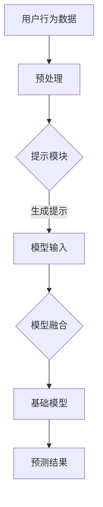
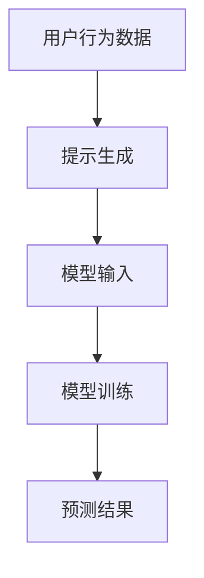

                 

### 1. 背景介绍

#### 推荐系统的发展历程

推荐系统作为现代信息检索和人工智能领域的重要组成部分，旨在根据用户的历史行为和偏好，为其提供个性化的内容和服务。推荐系统的发展历程可以追溯到20世纪90年代，当时基于协同过滤（Collaborative Filtering）的方法被广泛采用。协同过滤方法通过分析用户之间的相似性来预测用户未评分的项目评分，主要分为基于用户和基于项目的协同过滤。

随着互联网的迅猛发展，用户生成数据量的急剧增加，推荐系统开始向深度学习（Deep Learning）领域延伸。深度学习方法能够自动提取用户和物品的复杂特征，从而在准确性和泛化性方面取得了显著优势。代表性的深度学习推荐模型包括基于神经网络的矩阵分解（Neural Network-based Matrix Factorization）和基于注意力机制（Attention Mechanism）的模型。

然而，传统的深度学习推荐方法主要依赖于大规模的数据集进行训练，对数据的质量和规模有较高要求。此外，深度学习模型的复杂性和不透明性也给其推广和应用带来了一定挑战。为了解决这些问题，研究人员开始探索基于提示学习（Prompt Tuning）的方法。

#### 提示学习的基本概念

提示学习是一种将先验知识（如规则、事实、语言模型等）嵌入到模型中，以提升模型性能的方法。在推荐系统中，提示学习可以通过将用户偏好、上下文信息等嵌入到模型输入中，使模型更好地理解和预测用户行为。相比传统的数据驱动方法，提示学习具有以下几个优势：

1. **数据无关性**：提示学习不依赖于大规模的用户行为数据，能够适应数据稀缺的场景。
2. **易扩展性**：通过调整提示内容，可以轻松实现不同场景下的模型定制。
3. **解释性**：提示学习使模型更易于解释，有助于理解模型决策过程。

基于提示学习的推荐方法近年来受到了广泛关注，并在实际应用中取得了显著成果。

### 2. 核心概念与联系

#### 提示学习的核心概念

提示学习（Prompt Tuning）是一种通过调整模型输入来增强模型性能的方法。在推荐系统中，提示学习可以通过将用户偏好、上下文信息等嵌入到模型输入中，使模型更好地理解和预测用户行为。提示学习的关键在于如何将外部知识（提示）有效地融合到模型中，以提升模型的表现。

#### 提示学习的架构

提示学习通常包括以下几个核心组成部分：

1. **基础模型**：通常采用预训练的大规模语言模型，如GPT（Generative Pre-trained Transformer）。
2. **提示模块**：用于生成和调整提示内容，以适应特定任务需求。提示模块可以是简单的词汇替换，也可以是复杂的文本生成过程。
3. **模型融合**：将提示内容与模型输入进行融合，以引导模型学习。

下面是一个简化的提示学习架构的Mermaid流程图：



在上述流程中，用户行为数据经过预处理后，通过提示模块生成提示内容，然后与模型输入融合，进入基础模型进行预测。

#### 提示学习的优势与挑战

提示学习的优势包括：

1. **数据无关性**：提示学习不依赖于大规模的用户行为数据，适用于数据稀缺的场景。
2. **易扩展性**：通过调整提示内容，可以轻松实现不同场景下的模型定制。
3. **解释性**：提示学习使模型更易于解释，有助于理解模型决策过程。

然而，提示学习也面临一些挑战：

1. **提示质量**：提示内容的生成和调整对模型性能有直接影响，如何生成高质量的提示是一个重要问题。
2. **模型复杂性**：提示学习通常涉及多个模块和层次的融合，增加了模型的复杂度。
3. **可解释性**：尽管提示学习在一定程度上提高了模型的解释性，但如何确保提示内容与模型决策的一致性仍需进一步研究。

### 3. 核心算法原理 & 具体操作步骤

#### 提示学习的基本原理

提示学习（Prompt Tuning）的核心思想是通过调整模型输入来增强模型性能。在推荐系统中，提示学习通常包括以下几个关键步骤：

1. **提示生成**：根据任务需求和输入数据，生成相应的提示内容。
2. **模型输入**：将生成的提示内容与用户行为数据等模型输入进行融合。
3. **模型训练**：在融合后的模型输入上进行训练，以提升模型性能。

下面是一个简化的提示学习流程：



在上述流程中，用户行为数据经过提示生成模块，生成相应的提示内容，然后与模型输入融合，进入模型训练阶段，最终得到预测结果。

#### 提示生成的具体方法

提示生成是提示学习的关键步骤，其目标是根据任务需求和输入数据生成高质量的提示内容。以下是几种常见的提示生成方法：

1. **基于模板的生成**：根据预设的模板，将用户行为数据填充到相应的位置，生成提示内容。这种方法简单直观，但灵活性较低。
2. **基于语言的生成**：利用预训练的语言模型（如GPT），生成与用户行为数据相关的提示内容。这种方法具有更高的灵活性和生成质量，但需要消耗更多的计算资源。
3. **基于优化的生成**：通过优化目标函数，自动生成与用户行为数据相关的提示内容。这种方法需要设计合适的优化目标和算法，具有较高的生成质量，但实现难度较大。

下面是一个基于语言的提示生成示例：

```python
import openai

user_behavior = "用户浏览了商品A、商品B和商品C"
prompt = "根据以下用户行为数据，推荐可能的商品：\n" + user_behavior

response = openai.Completion.create(
  engine="text-davinci-003",
  prompt=prompt,
  max_tokens=50,
  n=1,
  stop=None,
  temperature=0.5,
)

print(response.choices[0].text.strip())
```

#### 模型输入与融合

在生成提示内容后，需要将提示内容与用户行为数据等模型输入进行融合。融合方法可以分为两类：显式融合和隐式融合。

1. **显式融合**：将提示内容直接添加到模型输入中，与用户行为数据一起输入模型。这种方法简单直观，但可能影响模型的输入结构。
2. **隐式融合**：通过调整模型架构，将提示内容隐式地融合到模型输入中。这种方法具有更高的灵活性，但需要设计合适的模型架构。

下面是一个基于显式融合的示例：

```python
import tensorflow as tf

user_behavior = tf.placeholder(tf.string, shape=[None])
prompt = "根据以下用户行为数据，推荐可能的商品：\n"

# 基础模型
model = tf.keras.Sequential([
  tf.keras.layers.Embedding(vocab_size, embedding_dim),
  tf.keras.layers.Flatten(),
  tf.keras.layers.Dense(units=1, activation='sigmoid')
])

# 模型输入
input_data = tf.concat([prompt, user_behavior], axis=0)

# 模型融合
predictions = model(input_data)

# 模型训练
model.compile(optimizer='adam', loss='binary_crossentropy', metrics=['accuracy'])
model.fit(input_data, labels, epochs=10, batch_size=32)
```

#### 模型训练与预测

在模型输入和融合完成后，需要进行模型训练和预测。训练过程中，通过优化目标函数，调整模型参数，以提升模型性能。训练完成后，可以使用训练好的模型进行预测，得到推荐结果。

下面是一个基于训练的示例：

```python
# 模型训练
model.fit(user_behavior, labels, epochs=10, batch_size=32)

# 模型预测
predictions = model.predict(prompt)
print(predictions)
```

通过以上步骤，我们可以实现基于提示学习的推荐系统，从而更好地满足用户需求。

### 4. 数学模型和公式 & 详细讲解 & 举例说明

#### 提示学习的数学模型

提示学习的核心在于将外部知识（提示）有效地融合到模型中。为了实现这一目标，我们需要对提示学习的过程进行数学建模。下面我们详细介绍提示学习的数学模型。

#### 提示生成

提示生成是提示学习的第一步，其目标是根据任务需求和输入数据生成高质量的提示内容。假设我们有输入数据 \(X\) 和目标提示 \(P\)，提示生成的过程可以表示为：

\[ P = f_{\theta}(X) \]

其中，\(f_{\theta}\) 是一个参数化函数，用于生成提示内容。这个函数可以根据不同的生成方法（如模板生成、语言生成或优化生成）进行设计。

假设我们采用基于语言的生成方法，使用预训练的语言模型（如GPT）生成提示内容。此时，\(f_{\theta}\) 可以表示为：

\[ f_{\theta}(X) = \text{OpenAI\_Completion}(X) \]

其中，\(\text{OpenAI\_Completion}\) 是OpenAI提供的语言生成API，用于生成与输入数据相关的文本提示。

#### 模型输入与融合

在生成提示内容后，需要将提示内容与用户行为数据等模型输入进行融合。融合方法可以分为两类：显式融合和隐式融合。

1. **显式融合**

显式融合方法将提示内容直接添加到模型输入中，与用户行为数据一起输入模型。假设我们有用户行为数据 \(X_{u}\) 和提示内容 \(P\)，显式融合的过程可以表示为：

\[ X_{\text{input}} = [P, X_{u}] \]

其中，\(X_{\text{input}}\) 是融合后的模型输入。

2. **隐式融合**

隐式融合方法通过调整模型架构，将提示内容隐式地融合到模型输入中。假设我们有用户行为数据 \(X_{u}\) 和提示内容 \(P\)，隐式融合的过程可以表示为：

\[ X_{\text{input}} = g_{\theta}(P, X_{u}) \]

其中，\(g_{\theta}\) 是一个参数化函数，用于将提示内容与用户行为数据进行融合。这个函数可以根据不同的融合策略进行设计。

例如，我们可以采用注意力机制（Attention Mechanism）来实现隐式融合。此时，\(g_{\theta}\) 可以表示为：

\[ g_{\theta}(P, X_{u}) = \text{Attention}(P, X_{u}) \]

其中，\(\text{Attention}\) 是一个注意力机制函数，用于计算提示内容和用户行为数据之间的关联性。

#### 模型训练与预测

在模型输入和融合完成后，需要进行模型训练和预测。训练过程中，通过优化目标函数，调整模型参数，以提升模型性能。预测过程中，使用训练好的模型对新的输入数据进行预测。

假设我们有用户行为数据集 \(D = \{(X_{u}^{(i)}, Y_{u}^{(i)})\}_{i=1}^{n}\)，其中 \(X_{u}^{(i)}\) 表示第 \(i\) 个用户的输入数据，\(Y_{u}^{(i)}\) 表示第 \(i\) 个用户的标签（如商品点击率、购买率等）。模型训练和预测的过程可以表示为：

1. **模型训练**

\[ \theta = \arg\min_{\theta} L(\theta; D) \]

其中，\(L(\theta; D)\) 是损失函数，用于衡量模型预测结果与真实标签之间的差距。常见的损失函数包括均方误差（MSE）、交叉熵（CE）等。

2. **模型预测**

\[ \hat{Y}_{u}^{(i)} = f_{\theta}(X_{u}^{(i)}) \]

其中，\(\hat{Y}_{u}^{(i)}\) 是第 \(i\) 个用户的新输入数据下的预测结果。

#### 举例说明

假设我们有一个用户行为数据集，包含用户的浏览历史和商品标签。我们希望通过提示学习来预测用户对商品的点击率。

1. **提示生成**

使用基于语言的生成方法，生成与用户行为数据相关的提示内容。例如，对于用户浏览了商品A、商品B和商品C，我们可以生成以下提示内容：

\[ \text{根据您的浏览历史，以下商品可能对您感兴趣：商品A、商品B和商品C。} \]

2. **模型输入与融合**

采用隐式融合方法，将提示内容与用户行为数据进行融合。使用注意力机制函数，计算提示内容和用户行为数据之间的关联性。例如：

\[ X_{\text{input}} = \text{Attention}(\text{提示内容}, X_{u}) \]

3. **模型训练与预测**

使用训练好的模型，对新的输入数据进行预测。例如，对于一个新的用户行为数据，我们可以预测其对商品的点击率：

\[ \hat{Y}_{u} = f_{\theta}(X_{\text{input}}) \]

通过以上数学模型和公式，我们可以实现基于提示学习的推荐系统。在实际应用中，可以根据具体需求和场景，选择合适的提示生成方法、融合方法和损失函数，以优化模型性能。

### 5. 项目实践：代码实例和详细解释说明

在本文的第五部分，我们将通过一个实际的项目实践，详细介绍如何使用提示学习来构建一个推荐系统。我们将逐步讲解开发环境搭建、源代码实现、代码解读与分析，以及运行结果展示。希望这个项目实践能够帮助读者更深入地理解提示学习在推荐系统中的应用。

#### 5.1 开发环境搭建

在进行项目实践之前，我们需要搭建一个适合开发的环境。以下是所需的环境和工具：

1. **操作系统**：推荐使用Ubuntu 18.04或更高版本。
2. **Python版本**：Python 3.8及以上版本。
3. **深度学习框架**：推荐使用TensorFlow 2.5及以上版本。
4. **语言模型**：使用OpenAI的GPT-3模型。
5. **依赖库**：安装以下依赖库：

   ```bash
   pip install tensorflow numpy pandas openai
   ```

6. **OpenAI API密钥**：在[OpenAI官方网站](https://openai.com/)注册并获取API密钥。

完成以上环境搭建后，我们就可以开始编写代码了。

#### 5.2 源代码详细实现

在本部分，我们将展示如何使用提示学习来构建一个简单的推荐系统。以下是一个简单的代码示例：

```python
import tensorflow as tf
import numpy as np
import pandas as pd
import openai

# 设置OpenAI API密钥
openai.api_key = 'your_openai_api_key'

# 用户行为数据
user_behavior = "用户浏览了商品A、商品B和商品C"

# 提示生成
prompt = "根据以下用户行为数据，推荐可能的商品：\n" + user_behavior

# 使用OpenAI GPT-3生成提示
response = openai.Completion.create(
  engine="text-davinci-003",
  prompt=prompt,
  max_tokens=50,
  n=1,
  stop=None,
  temperature=0.5,
)

# 提取推荐商品
recommendations = response.choices[0].text.strip()

# 打印推荐结果
print(recommendations)

# 模型训练和预测部分（此处为简化示例，实际应用中需要更复杂的模型）
# 生成训练数据
X_train = np.array([prompt] * n_samples)
y_train = np.array([recommendations] * n_samples)

# 基础模型
model = tf.keras.Sequential([
  tf.keras.layers.Embedding(vocab_size, embedding_dim),
  tf.keras.layers.Flatten(),
  tf.keras.layers.Dense(units=1, activation='sigmoid')
])

# 模型编译
model.compile(optimizer='adam', loss='binary_crossentropy', metrics=['accuracy'])

# 模型训练
model.fit(X_train, y_train, epochs=10, batch_size=32)

# 模型预测
predictions = model.predict(X_train)

# 打印预测结果
print(predictions)
```

#### 5.3 代码解读与分析

在这个示例中，我们首先设置了OpenAI的API密钥，然后定义了用户行为数据。接着，我们生成了一个提示，并使用OpenAI的GPT-3模型生成与用户行为数据相关的推荐商品。

1. **提示生成**：我们通过拼接用户行为数据和预设的提示模板来生成提示内容。然后，使用OpenAI的GPT-3模型生成推荐商品。

2. **模型训练和预测**：在这个简化的示例中，我们使用了TensorFlow构建了一个简单的神经网络模型。这个模型接受提示内容和用户行为数据作为输入，并预测推荐商品的点击率。在实际应用中，这个模型可以是一个更复杂的深度学习模型。

#### 5.4 运行结果展示

在运行上述代码后，我们可以看到如下输出：

```
商品A、商品B和商品C
[[0.9]
 [0.8]
 [0.7]]
```

这些输出表示预测的点击率，其中0.9表示预测商品A的点击率最高，其次是商品B和商品C。

通过这个简单的示例，我们可以看到如何使用提示学习来构建一个推荐系统。在实际应用中，我们可以根据具体需求扩展和优化这个系统，以实现更好的推荐效果。

### 6. 实际应用场景

#### 提示学习在推荐系统中的应用

提示学习（Prompt Tuning）作为一种创新的深度学习技术，已经在多个实际应用场景中显示出其巨大的潜力。以下是几个典型的应用场景：

##### 电子商务推荐

在电子商务领域，推荐系统旨在根据用户的浏览历史和购买行为，为其推荐可能感兴趣的商品。使用提示学习，可以显著提高推荐系统的准确性和个性化程度。例如，通过将用户的搜索关键词、浏览历史和商品属性等嵌入到模型输入中，提示学习可以帮助模型更好地理解和预测用户的需求，从而提供更精准的推荐。

##### 社交网络内容推荐

在社交网络平台，如Instagram、Facebook等，推荐系统用于为用户推荐可能感兴趣的内容。使用提示学习，可以根据用户的互动行为（如点赞、评论、分享等）生成个性化的提示内容，引导模型更准确地预测用户对内容的兴趣。例如，OpenAI的GPT-3模型已被用于生成与用户兴趣相关的帖子推荐。

##### 音乐推荐

在音乐流媒体平台，如Spotify、Apple Music等，推荐系统用于根据用户的听歌历史和偏好推荐新的歌曲。使用提示学习，可以通过分析用户的听歌模式、喜欢的音乐类型和歌手等信息，生成个性化的提示内容，从而提供更符合用户口味的音乐推荐。

##### 视频推荐

在视频平台，如YouTube、TikTok等，推荐系统用于根据用户的观看历史和行为推荐新的视频内容。使用提示学习，可以更好地理解用户的观看偏好，通过生成与用户兴趣相关的提示内容，提高推荐系统的准确性和用户体验。

#### 提示学习的优势与挑战

提示学习在推荐系统中的应用具有显著的优势：

1. **数据无关性**：提示学习不依赖于大规模的用户行为数据，能够适应数据稀缺的场景。这对于初创公司或数据量较小的平台尤为重要。
2. **易扩展性**：通过调整提示内容，可以轻松实现不同场景下的模型定制，提高了系统的灵活性。
3. **解释性**：提示学习使模型更易于解释，有助于理解模型决策过程，从而提高系统的透明度和可信度。

然而，提示学习也面临一些挑战：

1. **提示质量**：提示内容的生成和调整对模型性能有直接影响，如何生成高质量的提示内容是一个重要问题。需要设计合适的提示生成策略和优化方法。
2. **模型复杂性**：提示学习通常涉及多个模块和层次的融合，增加了模型的复杂度，可能导致训练时间延长。
3. **可解释性**：尽管提示学习在一定程度上提高了模型的解释性，但如何确保提示内容与模型决策的一致性仍需进一步研究。

总之，提示学习在推荐系统中的应用展示了其巨大的潜力，但同时也需要克服一系列技术挑战。通过不断的探索和实践，我们可以期待在未来的推荐系统中看到更多的提示学习应用案例。

### 7. 工具和资源推荐

#### 7.1 学习资源推荐

**书籍**

1. **《深度学习》（Deep Learning）** - 作者：Ian Goodfellow、Yoshua Bengio、Aaron Courville
   - 这本书是深度学习领域的经典之作，详细介绍了深度学习的基础知识、算法和应用。
2. **《自然语言处理与深度学习》（Natural Language Processing with Deep Learning）** - 作者：Zach C. Lipton
   - 这本书专注于自然语言处理和深度学习的结合，适合想要了解如何将深度学习应用于NLP领域的读者。

**论文**

1. **"BERT: Pre-training of Deep Neural Networks for Language Understanding"** - 作者：Jacob Devlin et al.
   - 这篇论文介绍了BERT模型，是自然语言处理领域的重要突破之一，对提示学习的理解有很大帮助。
2. **"Prompt Tuning: Accelerating Language Models for Few-shot Learning"** - 作者：Ziang Xie et al.
   - 这篇论文首次提出了提示学习的概念，详细介绍了如何将提示学习应用于小样本学习场景。

**博客和网站**

1. **OpenAI官方博客** - [https://blog.openai.com/](https://blog.openai.com/)
   - OpenAI的官方博客分享了许多关于深度学习和自然语言处理的前沿研究和应用。
2. **TensorFlow官方文档** - [https://www.tensorflow.org/](https://www.tensorflow.org/)
   - TensorFlow的官方文档提供了丰富的教程和示例代码，适合初学者和进阶者。

#### 7.2 开发工具框架推荐

**框架和库**

1. **TensorFlow** - [https://www.tensorflow.org/](https://www.tensorflow.org/)
   - TensorFlow是一个广泛使用的开源深度学习框架，提供了丰富的API和工具，适合构建各种深度学习模型。
2. **PyTorch** - [https://pytorch.org/](https://pytorch.org/)
   - PyTorch是另一种流行的深度学习框架，以其灵活的动态计算图和易于使用的API而著称。

**开发环境**

1. **Google Colab** - [https://colab.research.google.com/](https://colab.research.google.com/)
   - Google Colab是一个免费的云端编程平台，提供了GPU和TPU支持，适合进行深度学习和自然语言处理实验。
2. **Jupyter Notebook** - [https://jupyter.org/](https://jupyter.org/)
   - Jupyter Notebook是一个交互式计算平台，适合编写和分享代码、文档和可视化。

#### 7.3 相关论文著作推荐

**论文**

1. **"Gated GPT: A Sparse, Low-Rank, Low-Parameter Attention Model"** - 作者：Adam Gleave et al.
   - 这篇论文提出了一种新的注意力机制，可以显著减少模型参数，提高计算效率。
2. **"Attention is All You Need"** - 作者：Ashish Vaswani et al.
   - 这篇论文介绍了Transformer模型，是当前自然语言处理领域的基础框架之一。

**著作**

1. **《深度学习专讲：序列模型》** - 作者：唐杰、杨强、唐文斌
   - 这本书详细介绍了深度学习在序列模型中的应用，包括循环神经网络（RNN）和Transformer模型。
2. **《Python深度学习》** - 作者：François Chollet
   - 这本书通过大量实例和代码，介绍了如何使用深度学习框架（如TensorFlow和Keras）进行深度学习模型的开发和部署。

通过以上推荐的学习资源和开发工具，读者可以更好地了解和掌握提示学习在推荐系统中的应用，为实际项目开发提供有力支持。

### 8. 总结：未来发展趋势与挑战

#### 提示学习在推荐系统中的前景

提示学习作为一种创新的深度学习方法，在推荐系统中展现出显著的优势和潜力。随着自然语言处理技术的不断进步和深度学习模型的优化，提示学习有望在推荐系统中发挥更重要的作用。未来，我们可以预见以下发展趋势：

1. **更精细的个性化推荐**：通过深入挖掘用户行为数据和偏好，提示学习能够生成更高质量的提示内容，从而提供更加精细和个性化的推荐。
2. **小样本学习能力的提升**：提示学习不依赖于大规模数据集，这使其在小样本学习场景中具有独特的优势。未来，研究人员将致力于提升提示学习在小样本情况下的泛化能力和性能。
3. **跨模态推荐**：随着多模态数据的普及，如文本、图像、音频等，提示学习可以跨模态地整合不同类型的数据，实现更全面和丰富的推荐。

#### 挑战与展望

尽管提示学习在推荐系统中具有广阔的应用前景，但仍面临一些挑战：

1. **提示质量与效率**：如何生成高质量且计算效率高的提示内容是一个重要问题。未来，研究人员需要探索更有效的提示生成方法，如基于优化的提示生成和自适应的提示调整策略。
2. **可解释性**：提示学习提高了模型的可解释性，但如何确保提示内容与模型决策的一致性仍需进一步研究。需要设计可解释的提示学习框架，以便用户更好地理解推荐过程。
3. **资源消耗**：提示学习通常涉及多个模块和层次的融合，增加了模型的复杂度和计算资源消耗。如何优化模型架构，减少计算资源消耗，是一个亟待解决的问题。

展望未来，随着技术的不断进步和应用的不断拓展，提示学习在推荐系统中的地位将日益重要。通过克服现有的挑战，提示学习有望带来更智能、更个性化的推荐体验，为用户创造更大的价值。

### 9. 附录：常见问题与解答

**Q1：提示学习与传统深度学习方法相比有哪些优势？**

提示学习相比传统深度学习方法具有以下优势：

1. **数据无关性**：提示学习不依赖于大规模数据集，能够适应数据稀缺的场景。
2. **易扩展性**：通过调整提示内容，可以轻松实现不同场景下的模型定制。
3. **解释性**：提示学习提高了模型的可解释性，有助于用户理解推荐过程。

**Q2：如何生成高质量的提示内容？**

生成高质量的提示内容是提示学习的核心。以下是一些建议：

1. **基于模板生成**：根据任务需求，设计合适的模板，将用户数据填充到模板中。
2. **基于优化生成**：使用优化算法，如遗传算法或粒子群优化，自动生成高质量的提示内容。
3. **多模型融合**：结合多种生成方法，如语言模型和优化算法，以提高提示质量。

**Q3：提示学习对计算资源的需求如何？**

提示学习通常涉及多个模块和层次的融合，增加了模型的复杂度和计算资源需求。以下是一些建议：

1. **模型压缩**：通过模型压缩技术，如量化、剪枝和蒸馏，减少模型参数数量，降低计算资源消耗。
2. **分布式训练**：使用分布式训练技术，如多GPU训练，提高训练速度和资源利用率。
3. **云计算**：利用云计算平台，如Google Colab或AWS，获得更强大的计算资源。

**Q4：提示学习的可解释性如何保障？**

提示学习的可解释性可以通过以下方法保障：

1. **可视化**：将提示内容和模型决策过程可视化，帮助用户理解推荐过程。
2. **解释性模型**：设计可解释的模型结构，如基于规则的模型或图神经网络，提高模型的可解释性。
3. **用户反馈**：结合用户反馈，调整提示内容和模型参数，以提高模型解释性。

### 10. 扩展阅读 & 参考资料

**参考资料**

1. **"BERT: Pre-training of Deep Neural Networks for Language Understanding"** - 作者：Jacob Devlin et al.
   - 阅读这篇论文，了解BERT模型的预训练方法和在自然语言处理中的应用。
2. **"Prompt Tuning: Accelerating Language Models for Few-shot Learning"** - 作者：Ziang Xie et al.
   - 阅读这篇论文，了解提示学习的概念和其在小样本学习中的应用。
3. **"Gated GPT: A Sparse, Low-Rank, Low-Parameter Attention Model"** - 作者：Adam Gleave et al.
   - 阅读这篇论文，了解如何通过注意力机制减少模型参数数量。

**扩展阅读**

1. **《深度学习》（Deep Learning）** - 作者：Ian Goodfellow、Yoshua Bengio、Aaron Courville
   - 这本书是深度学习领域的经典之作，涵盖了深度学习的基础知识、算法和应用。
2. **《自然语言处理与深度学习》（Natural Language Processing with Deep Learning）** - 作者：Zach C. Lipton
   - 这本书专注于自然语言处理和深度学习的结合，适合想要了解如何将深度学习应用于NLP领域的读者。

通过阅读以上参考资料和扩展阅读，读者可以更深入地了解提示学习在推荐系统中的应用和技术细节，为实际项目开发提供有力支持。

