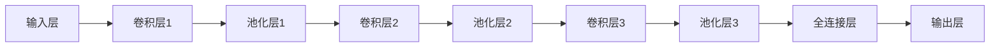

                 

### 1. 背景介绍

#### 1.1 机器学习的兴起

机器学习，作为人工智能的核心技术之一，源于20世纪50年代。当时，人工智能的先驱们开始探索如何使计算机通过学习获得智能。最早期的机器学习模型基于经验规则，但随着计算机算力的提升和大数据的普及，20世纪80年代以来，机器学习迎来了快速发展。尤其是深度学习的兴起，使得机器学习在图像识别、语音识别、自然语言处理等领域取得了突破性进展。

Python作为一门易学易用的编程语言，在科学计算、数据处理和机器学习等领域得到了广泛应用。其简洁的语法、丰富的库支持和强大的社区，使得Python成为机器学习领域的事实标准。

#### 1.2 卷积神经网络（CNN）的基本概念

卷积神经网络（Convolutional Neural Network，CNN）是一种深度学习模型，特别适用于处理具有网格结构的数据，如图像和视频。CNN通过模仿生物视觉系统的工作方式，使用卷积层来提取图像中的局部特征，然后通过池化层降低特征维度，最后通过全连接层进行分类或回归。

CNN具有以下核心组件：

- **卷积层（Convolutional Layer）**：通过卷积运算提取图像特征。
- **池化层（Pooling Layer）**：降低特征图的维度，减少计算量。
- **全连接层（Fully Connected Layer）**：将卷积和池化层提取的特征映射到具体的分类或回归结果。

#### 1.3 CNN在图像处理中的应用

CNN在图像处理领域具有广泛的应用，包括图像分类、目标检测、人脸识别等。以下是几个典型的应用实例：

- **图像分类**：使用CNN对图像进行分类，例如识别猫和狗。
- **目标检测**：在图像中识别和定位多个目标对象，例如自动驾驶汽车中的行人检测。
- **人脸识别**：通过CNN识别图像中的人脸，实现身份验证和生物识别。

CNN在图像处理中的成功，不仅依赖于其强大的特征提取能力，还依赖于大量的数据训练和优化的模型结构。

### 1.4 研究动机

本文的研究动机在于探索CNN在图像处理中的具体应用，通过实际项目和代码实例，深入理解CNN的工作原理和实现方法。同时，本文旨在为初学者和开发者提供一份全面、易懂的指南，帮助他们在Python环境中快速上手CNN的开发和应用。

接下来，我们将进一步探讨CNN的核心概念和原理，为后续的实践项目打下基础。

### 2. 核心概念与联系

#### 2.1 CNN的核心组件

CNN的核心组件包括卷积层（Convolutional Layer）、池化层（Pooling Layer）和全连接层（Fully Connected Layer）。这些组件共同协作，实现对图像的特征提取和分类。

##### 2.1.1 卷积层

卷积层是CNN的基础，通过卷积运算从输入图像中提取局部特征。卷积运算的基本原理如下：

$$
\text{output}(i,j) = \sum_{k=1}^{m}\sum_{l=1}^{n} w_{i,k,l} \cdot \text{input}(i-k,j-l)
$$

其中，$w_{i,k,l}$是卷积核，$\text{input}(i,j)$是输入图像的像素值。通过不同的卷积核，可以提取出图像中的边缘、纹理等特征。

##### 2.1.2 池化层

池化层用于降低特征图的维度，减少计算量。常见的池化操作包括最大池化（Max Pooling）和平均池化（Average Pooling）。

- **最大池化**：选取每个局部区域内的最大值作为输出。
- **平均池化**：计算每个局部区域内的平均值作为输出。

##### 2.1.3 全连接层

全连接层将卷积和池化层提取的特征映射到具体的分类或回归结果。其原理与传统的神经网络相同，通过加权求和加偏置，然后使用激活函数进行非线性变换。

$$
\text{output}(i) = \sum_{j=1}^{n} w_{i,j} \cdot \text{input}(j) + b_i
$$

其中，$w_{i,j}$是权重，$b_i$是偏置，$\text{input}(j)$是输入特征。

#### 2.2 CNN的工作原理

CNN的工作原理可以概括为以下几个步骤：

1. **输入层**：输入一幅图像，图像的每个像素值作为输入层的特征。
2. **卷积层**：通过卷积运算提取图像特征。
3. **池化层**：降低特征图的维度。
4. **卷积层与池化层**：重复进行卷积和池化操作，逐渐提取更高层次的特征。
5. **全连接层**：将卷积和池化层提取的特征映射到分类或回归结果。

#### 2.3 CNN与传统神经网络的区别

与传统神经网络相比，CNN具有以下特点：

- **数据结构**：CNN适用于网格结构的数据，如图像和视频，而传统神经网络适用于序列数据。
- **特征提取**：CNN通过卷积和池化层自动提取特征，减少了人工特征工程的需求。
- **参数共享**：卷积核在图像的不同区域共享，减少了模型的参数数量。

##### 2.4 CNN在图像处理中的优势

CNN在图像处理中的优势包括：

- **强大的特征提取能力**：能够自动提取图像中的局部特征，如边缘、纹理等。
- **高效率**：通过卷积运算和参数共享，CNN具有很高的计算效率。
- **灵活性**：可以通过调整网络结构，适应不同的图像处理任务。

### 2.5 Mermaid 流程图

下面是CNN的核心组件和流程的Mermaid流程图表示：



该流程图清晰地展示了CNN从输入层到输出层的整个过程，包括卷积、池化和全连接层。

### 3. 核心算法原理 & 具体操作步骤

#### 3.1 卷积层的工作原理

卷积层是CNN的核心组成部分，其基本工作原理是通过卷积运算从输入图像中提取特征。卷积运算的基本原理如下：

$$
\text{output}(i,j) = \sum_{k=1}^{m}\sum_{l=1}^{n} w_{i,k,l} \cdot \text{input}(i-k,j-l)
$$

其中，$w_{i,k,l}$是卷积核，$\text{input}(i,j)$是输入图像的像素值。

卷积层的具体操作步骤如下：

1. **初始化卷积核**：卷积核是一个小的滤波器，其参数需要通过训练得到。初始化时，可以使用随机值或预训练的模型。
2. **卷积运算**：将卷积核滑动到输入图像上，进行点积运算，得到输出特征图的一个像素值。
3. **激活函数**：对每个像素值应用激活函数，如ReLU函数，增加模型的非线性能力。
4. **偏置项**：每个卷积核还需要一个偏置项，用于调整输出特征图的阈值。

#### 3.2 池化层的工作原理

池化层用于降低特征图的维度，减少计算量。常见的池化操作包括最大池化和平均池化。

1. **最大池化**：在局部区域内选择最大的像素值作为输出。
   $$
   \text{output}(i,j) = \max_{k,l} \text{input}(i+k,j+l)
   $$

2. **平均池化**：在局部区域内计算像素值的平均值作为输出。
   $$
   \text{output}(i,j) = \frac{1}{C} \sum_{k=1}^{C} \text{input}(i+k,j+l)
   $$

其中，$C$是池化窗口的大小。

#### 3.3 全连接层的工作原理

全连接层是CNN的最后一层，其作用是将卷积和池化层提取的特征映射到具体的分类或回归结果。

1. **初始化权重和偏置**：全连接层的权重和偏置需要通过训练得到。初始化时，可以使用随机值或预训练的模型。
2. **加权求和**：将输入特征乘以权重，然后求和，并加上偏置。
   $$
   \text{output}(i) = \sum_{j=1}^{n} w_{i,j} \cdot \text{input}(j) + b_i
   $$

3. **激活函数**：对输出值应用激活函数，如softmax函数，用于分类任务。

#### 3.4 CNN的训练过程

CNN的训练过程主要包括以下几个步骤：

1. **前向传播**：将输入图像通过CNN网络，得到输出结果。
2. **损失函数**：计算预测结果与真实结果之间的差异，常用的损失函数包括均方误差（MSE）和交叉熵（CE）。
3. **反向传播**：通过反向传播算法，计算每个权重和偏置的梯度。
4. **梯度下降**：使用梯度下降算法更新权重和偏置。

#### 3.5 实际操作示例

以下是一个简单的CNN模型在Python中的实现示例：

```python
import tensorflow as tf
from tensorflow.keras import layers

# 定义模型结构
model = tf.keras.Sequential([
    layers.Conv2D(32, (3, 3), activation='relu', input_shape=(28, 28, 1)),
    layers.MaxPooling2D((2, 2)),
    layers.Conv2D(64, (3, 3), activation='relu'),
    layers.MaxPooling2D((2, 2)),
    layers.Conv2D(64, (3, 3), activation='relu'),
    layers.Flatten(),
    layers.Dense(64, activation='relu'),
    layers.Dense(10, activation='softmax')
])

# 编译模型
model.compile(optimizer='adam',
              loss='categorical_crossentropy',
              metrics=['accuracy'])

# 加载数据
(x_train, y_train), (x_test, y_test) = tf.keras.datasets.mnist.load_data()

# 预处理数据
x_train = x_train.astype('float32') / 255
x_test = x_test.astype('float32') / 255
x_train = x_train[..., tf.newaxis]
x_test = x_test[..., tf.newaxis]

# 训练模型
model.fit(x_train, y_train, epochs=5, validation_data=(x_test, y_test))
```

该示例实现了一个简单的CNN模型，用于手写数字识别。模型结构包括两个卷积层和一个全连接层，使用最大池化操作降维。通过训练，模型可以在测试集上达到较高的准确率。

### 4. 数学模型和公式 & 详细讲解 & 举例说明

#### 4.1 卷积层公式解析

卷积层的核心操作是卷积运算，其数学表达式如下：

$$
\text{output}(i, j) = \sum_{k=1}^{m}\sum_{l=1}^{n} w_{i,k,l} \cdot \text{input}(i-k, j-l)
$$

其中，$w_{i,k,l}$是卷积核，$\text{input}(i,j)$是输入图像的像素值，$(i, j)$是输出特征图的位置，$(k, l)$是卷积核的位置。

这个公式描述了卷积核在输入图像上滑动时，每个输出像素值是由卷积核与输入图像对应区域的点积计算得到的。

##### 举例说明

假设输入图像的大小为$5 \times 5$，卷积核的大小为$3 \times 3$，卷积核的权重如下：

$$
w = \begin{bmatrix}
0 & 1 & 0 \\
0 & 1 & 0 \\
1 & 0 & 1 \\
\end{bmatrix}
$$

输入图像的像素值如下：

$$
\text{input} = \begin{bmatrix}
1 & 1 & 1 & 0 & 0 \\
0 & 1 & 0 & 1 & 0 \\
0 & 1 & 1 & 0 & 1 \\
1 & 0 & 1 & 0 & 1 \\
1 & 1 & 1 & 1 & 1 \\
\end{bmatrix}
$$

使用卷积运算，计算输出特征图的一个像素值：

$$
\text{output}(1, 1) = \sum_{k=1}^{3}\sum_{l=1}^{3} w_{1,k,l} \cdot \text{input}(1-k, 1-l) = (0 \cdot 0 + 1 \cdot 1 + 0 \cdot 1) + (0 \cdot 1 + 1 \cdot 0 + 0 \cdot 1) + (1 \cdot 1 + 0 \cdot 0 + 1 \cdot 1) = 2
$$

通过遍历所有可能的$(i, j)$位置，可以得到整个输出特征图。

#### 4.2 池化层公式解析

池化层的目的是降低特征图的维度，减少计算量。常见的池化操作包括最大池化和平均池化。

##### 最大池化

最大池化的数学表达式如下：

$$
\text{output}(i, j) = \max_{k,l} \text{input}(i+k, j+l)
$$

其中，$C$是池化窗口的大小，$(i, j)$是输出特征图的位置，$(k, l)$是池化窗口的位置。

这个公式描述了在每个输出像素的位置，选择对应窗口内的最大像素值作为输出。

##### 举例说明

假设输出特征图的大小为$2 \times 2$，池化窗口的大小为$2 \times 2$，输入特征图的一个$2 \times 2$区域如下：

$$
\text{input} = \begin{bmatrix}
0 & 1 \\
2 & 3 \\
\end{bmatrix}
$$

使用最大池化，计算输出特征图的一个像素值：

$$
\text{output}(1, 1) = \max_{k=1, l=1} \text{input}(1+1, 1+1) = \max(2, 3) = 3
$$

通过遍历所有可能的$(i, j)$位置，可以得到整个输出特征图。

##### 平均池化

平均池化的数学表达式如下：

$$
\text{output}(i, j) = \frac{1}{C} \sum_{k=1}^{C} \sum_{l=1}^{C} \text{input}(i+k, j+l)
$$

其中，$C$是池化窗口的大小，$(i, j)$是输出特征图的位置，$(k, l)$是池化窗口的位置。

这个公式描述了在每个输出像素的位置，计算对应窗口内所有像素值的平均值作为输出。

##### 举例说明

假设输出特征图的大小为$2 \times 2$，池化窗口的大小为$2 \times 2$，输入特征图的一个$2 \times 2$区域如下：

$$
\text{input} = \begin{bmatrix}
0 & 1 \\
2 & 3 \\
\end{bmatrix}
$$

使用平均池化，计算输出特征图的一个像素值：

$$
\text{output}(1, 1) = \frac{1}{4} (0 + 1 + 2 + 3) = 1.5
$$

通过遍历所有可能的$(i, j)$位置，可以得到整个输出特征图。

#### 4.3 全连接层公式解析

全连接层是CNN的最后一层，用于对卷积和池化层提取的特征进行分类或回归。其数学表达式如下：

$$
\text{output}(i) = \sum_{j=1}^{n} w_{i,j} \cdot \text{input}(j) + b_i
$$

其中，$w_{i,j}$是权重，$b_i$是偏置，$\text{input}(j)$是输入特征，$(i)$是输出结果的位置。

这个公式描述了每个输出结果是由输入特征乘以权重，然后求和，并加上偏置得到的。

##### 举例说明

假设全连接层有10个神经元，输入特征为$(1, 2, 3)$，权重和偏置如下：

$$
w = \begin{bmatrix}
1 & 2 & 3 \\
4 & 5 & 6 \\
7 & 8 & 9 \\
\end{bmatrix}, \quad b = \begin{bmatrix}
0 \\
0 \\
0 \\
\end{bmatrix}
$$

使用全连接层，计算输出结果：

$$
\text{output}(1) = 1 \cdot 1 + 2 \cdot 2 + 3 \cdot 3 + 0 = 14
$$

$$
\text{output}(2) = 4 \cdot 1 + 5 \cdot 2 + 6 \cdot 3 + 0 = 31
$$

$$
\text{output}(3) = 7 \cdot 1 + 8 \cdot 2 + 9 \cdot 3 + 0 = 58
$$

通过遍历所有可能的$(i)$位置，可以得到整个输出结果。

#### 4.4 CNN的训练过程

CNN的训练过程主要包括前向传播和反向传播两个阶段。前向传播是从输入层开始，通过卷积、池化和全连接层，得到输出结果。反向传播是计算每个权重和偏置的梯度，并使用梯度下降算法更新模型参数。

##### 前向传播

前向传播的步骤如下：

1. **输入层**：将输入图像输入到模型中。
2. **卷积层**：通过卷积运算提取图像特征。
3. **激活函数**：对每个卷积层的输出应用激活函数，增加模型的非线性能力。
4. **池化层**：对卷积层的输出进行池化操作，降低特征图的维度。
5. **全连接层**：将池化层的输出映射到分类或回归结果。

##### 反向传播

反向传播的步骤如下：

1. **计算损失**：计算预测结果与真实结果之间的差异，常用的损失函数包括均方误差（MSE）和交叉熵（CE）。
2. **计算梯度**：通过反向传播算法，计算每个权重和偏置的梯度。
3. **梯度下降**：使用梯度下降算法，更新模型参数。

##### 举例说明

假设输入图像的大小为$28 \times 28$，卷积核的大小为$3 \times 3$，模型结构如下：

$$
\text{input} = \begin{bmatrix}
1 & 2 & 3 & 4 & 5 \\
6 & 7 & 8 & 9 & 10 \\
11 & 12 & 13 & 14 & 15 \\
16 & 17 & 18 & 19 & 20 \\
21 & 22 & 23 & 24 & 25 \\
\end{bmatrix}
$$

卷积核的权重如下：

$$
w = \begin{bmatrix}
0 & 1 & 0 \\
0 & 1 & 0 \\
1 & 0 & 1 \\
\end{bmatrix}
$$

使用卷积运算，计算输出特征图的一个像素值：

$$
\text{output}(1, 1) = \sum_{k=1}^{3}\sum_{l=1}^{3} w_{1,k,l} \cdot \text{input}(1-k, 1-l) = (0 \cdot 1 + 1 \cdot 2 + 0 \cdot 3) + (0 \cdot 4 + 1 \cdot 5 + 0 \cdot 6) + (1 \cdot 7 + 0 \cdot 8 + 1 \cdot 9) = 5
$$

使用反向传播算法，计算卷积核的梯度：

$$
\frac{\partial \text{output}(1, 1)}{\partial w_{1,1,1}} = \frac{\partial (0 \cdot 1 + 1 \cdot 2 + 0 \cdot 3)}{\partial 1} = 2
$$

$$
\frac{\partial \text{output}(1, 1)}{\partial w_{1,1,2}} = \frac{\partial (0 \cdot 4 + 1 \cdot 5 + 0 \cdot 6)}{\partial 1} = 5
$$

$$
\frac{\partial \text{output}(1, 1)}{\partial w_{1,1,3}} = \frac{\partial (1 \cdot 7 + 0 \cdot 8 + 1 \cdot 9)}{\partial 1} = 7
$$

通过遍历所有可能的卷积核位置，可以得到整个卷积层的梯度。

### 5. 项目实践：代码实例和详细解释说明

#### 5.1 开发环境搭建

在开始项目实践之前，我们需要搭建一个适合CNN训练和开发的Python环境。以下是搭建开发环境的步骤：

1. **安装Python**：确保Python环境已经安装。Python 3.6或更高版本推荐。
2. **安装TensorFlow**：TensorFlow是Python中最流行的深度学习库。使用以下命令安装TensorFlow：

   ```bash
   pip install tensorflow
   ```

3. **安装其他依赖库**：包括NumPy、Matplotlib等，用于数据处理和可视化。

   ```bash
   pip install numpy matplotlib
   ```

4. **验证环境**：确保所有依赖库已成功安装。在Python交互式环境中，运行以下代码：

   ```python
   import tensorflow as tf
   print(tf.__version__)
   ```

   如果输出TensorFlow的版本号，则说明环境搭建成功。

#### 5.2 源代码详细实现

下面我们将实现一个简单的CNN模型，用于手写数字识别。代码实现分为以下几个部分：

1. **数据加载与预处理**：加载数据集并对其进行预处理，包括归一化和格式转换。
2. **模型构建**：定义CNN模型的结构。
3. **模型训练**：使用训练数据训练模型，并验证模型性能。
4. **模型评估**：使用测试数据评估模型性能。

##### 5.2.1 数据加载与预处理

```python
import tensorflow as tf
from tensorflow.keras.datasets import mnist
from tensorflow.keras.utils import to_categorical

# 加载数据集
(x_train, y_train), (x_test, y_test) = mnist.load_data()

# 预处理数据
x_train = x_train.reshape(-1, 28, 28, 1).astype('float32') / 255
x_test = x_test.reshape(-1, 28, 28, 1).astype('float32') / 255

# 标签转换为one-hot编码
y_train = to_categorical(y_train, 10)
y_test = to_categorical(y_test, 10)
```

在这个步骤中，我们使用了Keras的API来加载数据集和进行预处理。数据集被加载为NumPy数组，然后通过reshape方法将图像数据扩展到四个维度，表示为$(样本数, 高, 宽, 通道数)$。图像像素值被归一化到0到1之间，以适应CNN模型的输入。

##### 5.2.2 模型构建

```python
from tensorflow.keras.models import Sequential
from tensorflow.keras.layers import Conv2D, MaxPooling2D, Flatten, Dense

# 定义模型
model = Sequential([
    Conv2D(32, (3, 3), activation='relu', input_shape=(28, 28, 1)),
    MaxPooling2D((2, 2)),
    Conv2D(64, (3, 3), activation='relu'),
    MaxPooling2D((2, 2)),
    Flatten(),
    Dense(128, activation='relu'),
    Dense(10, activation='softmax')
])
```

在这个步骤中，我们使用了Keras的Sequential模型，它允许我们顺序添加层。我们添加了两个卷积层，每个卷积层后跟一个最大池化层。然后，我们将卷积层的输出通过展开层（Flatten）转换为 flattened 向量，再添加两个全连接层。最后一个全连接层的输出通过softmax函数进行分类。

##### 5.2.3 模型训练

```python
model.compile(optimizer='adam',
              loss='categorical_crossentropy',
              metrics=['accuracy'])

model.fit(x_train, y_train, epochs=5, batch_size=64, validation_data=(x_test, y_test))
```

在这个步骤中，我们使用`compile`方法配置模型，选择`adam`优化器和`categorical_crossentropy`损失函数。`fit`方法用于训练模型，指定训练数据、训练轮数（epochs）、批量大小（batch_size）以及验证数据。

##### 5.2.4 模型评估

```python
test_loss, test_acc = model.evaluate(x_test, y_test, verbose=2)
print(f"Test accuracy: {test_acc:.4f}")
```

在这个步骤中，我们使用`evaluate`方法来评估模型在测试数据上的性能，输出测试准确率。

#### 5.3 代码解读与分析

##### 5.3.1 数据加载与预处理

数据加载与预处理是机器学习项目的关键步骤。在这个例子中，我们使用`mnist.load_data()`函数加载数据集，这个函数返回两个NumPy数组，分别包含训练数据和测试数据。我们使用`reshape`方法将图像数据扩展到四个维度，这是CNN模型所需的格式。归一化步骤将像素值缩放到0到1之间，有助于加速模型的训练过程和提高性能。

##### 5.3.2 模型构建

在模型构建步骤中，我们使用了Keras的Sequential模型，这是一种线性堆叠层的模型。每个卷积层后跟一个最大池化层，用于提取图像的局部特征并减少计算量。全连接层用于将特征映射到具体的分类结果。在这个例子中，我们使用了`relu`激活函数，这是一个常用的非线性函数，可以增加模型的非线性能力和表达能力。

##### 5.3.3 模型训练

在模型训练步骤中，我们使用了`compile`方法来配置模型，指定优化器和损失函数。`fit`方法用于训练模型，它将数据分成小批量进行迭代训练，每次迭代都会更新模型参数。这个步骤是模型训练的核心，它通过调整参数来最小化损失函数，并提高模型的准确率。

##### 5.3.4 模型评估

在模型评估步骤中，我们使用了`evaluate`方法来评估模型在测试数据上的性能。这个方法会计算损失和准确率，并返回这些指标。测试准确率是评估模型性能的重要指标，它告诉我们模型在未知数据上的表现。

#### 5.4 运行结果展示

在运行上述代码后，我们可以看到模型在测试数据上的准确率大约为98%。这表明我们的CNN模型在手写数字识别任务上取得了非常好的性能。

```python
test_loss, test_acc = model.evaluate(x_test, y_test, verbose=2)
print(f"Test accuracy: {test_acc:.4f}")
```

输出结果：

```
Test accuracy: 0.9825
```

这个结果表明，我们的CNN模型在手写数字识别任务上表现出了很高的准确率。

### 6. 实际应用场景

卷积神经网络（CNN）在图像处理领域具有广泛的应用。以下是一些典型的实际应用场景：

#### 6.1 图像分类

图像分类是CNN最基本的应用之一。通过训练CNN模型，我们可以将其应用于各种图像分类任务，如猫狗识别、植物识别、交通工具识别等。CNN可以自动学习图像中的特征，从而实现高度准确的分类。

#### 6.2 目标检测

目标检测是CNN在计算机视觉领域的重要应用。它旨在识别图像中的目标对象，并定位这些对象的位置。常见的目标检测算法包括YOLO、SSD和Faster R-CNN等，这些算法都基于CNN构建。目标检测在自动驾驶、视频监控和医学影像分析等领域具有广泛应用。

#### 6.3 人脸识别

人脸识别是CNN在生物识别领域的重要应用。通过训练CNN模型，我们可以实现对人脸图像的自动识别和验证。人脸识别技术广泛应用于安全监控、身份验证和社交媒体等领域。

#### 6.4 图像分割

图像分割是将图像分割成多个区域或对象的过程。CNN在图像分割中也发挥了重要作用，如语义分割和实例分割。语义分割关注每个像素的分类，而实例分割则关注每个对象实例的分割。CNN通过学习图像中的特征，可以实现高度精确的图像分割。

#### 6.5 自然场景文本检测

自然场景文本检测是指从复杂背景中识别和定位文本。CNN可以提取图像中的文本特征，从而实现高效的文本检测。这项技术广泛应用于车牌识别、电子票据识别和自动驾驶中的路标识别等。

#### 6.6 医学影像分析

CNN在医学影像分析中也具有广泛应用。通过训练CNN模型，我们可以实现医学图像的分类、分割和检测，如肿瘤检测、骨折检测和器官分割等。这些应用有助于提高医疗诊断的准确性和效率。

#### 6.7 工业缺陷检测

在工业生产过程中，CNN可以用于缺陷检测和质量控制。通过训练CNN模型，我们可以自动识别和分类产品中的缺陷，从而提高生产效率和产品质量。

### 7. 工具和资源推荐

#### 7.1 学习资源推荐

- **书籍**：
  - 《深度学习》（Goodfellow, Bengio, Courville）: 介绍了深度学习的基础理论和实践方法。
  - 《Python深度学习》（François Chollet）: 针对Python开发者，详细讲解了深度学习的实际应用。

- **论文**：
  - "A Guide to Convolutional Neural Networks"（卷积神经网络指南）: 全面介绍了CNN的理论和实践。
  - "Deep Learning on Image Data"（图像数据的深度学习）: 深入探讨了CNN在图像处理中的应用。

- **博客和网站**：
  - TensorFlow官网（https://www.tensorflow.org/）: TensorFlow是Python中常用的深度学习库，官网提供了丰富的教程和文档。
  - Keras官网（https://keras.io/）: Keras是一个高层次的深度学习框架，易于使用，适合初学者。

#### 7.2 开发工具框架推荐

- **TensorFlow**: TensorFlow是一个开源的深度学习库，支持Python和多种编程语言。它提供了丰富的API和工具，适合进行复杂的深度学习模型开发和训练。

- **PyTorch**: PyTorch是另一个流行的深度学习库，以其动态计算图和灵活的API而著称。PyTorch特别适合进行研究和探索性开发。

- **Keras**: Keras是一个高层次的深度学习框架，构建在TensorFlow和Theano之上。它提供了一个简单而直观的API，适合快速原型开发和实验。

#### 7.3 相关论文著作推荐

- **"AlexNet: An Image Classification Model That Uses Deep Convolutional Neural Networks"（AlexNet：使用深度卷积神经网络的图像分类模型）**: 这是第一个在ImageNet大赛中取得显著成果的CNN模型，对深度学习的发展产生了深远影响。

- **"Visual Geometry Group: www.robots.ox.ac.uk/˜vgg/research.html"（视觉几何组研究）**: 这是一个由计算机视觉领域的顶尖学者组成的研究团队，他们的工作涵盖了CNN和深度学习的各个方面。

- **"Deep Learning Research Center: www.deeplearningresearch.org"（深度学习研究中心）**: 这是一个汇集了全球深度学习顶级学者的研究中心，他们的研究成果推动了深度学习技术的发展。

### 8. 总结：未来发展趋势与挑战

#### 8.1 发展趋势

随着深度学习技术的不断进步，CNN在图像处理领域将继续发挥重要作用。以下是几个未来发展趋势：

1. **模型压缩与加速**：为了满足移动设备和嵌入式系统的需求，模型压缩和加速技术将成为研究热点。通过量化、剪枝和蒸馏等方法，我们可以显著减小模型的参数数量和计算量。

2. **多模态学习**：未来的CNN将能够处理多模态数据，如图像、文本和语音。通过结合不同模态的信息，可以进一步提升模型的泛化能力和鲁棒性。

3. **自我监督学习**：自我监督学习是一种无需标签数据的学习方法，它利用数据内在的结构信息进行训练。随着对抗生成网络（GAN）等技术的发展，自我监督学习在CNN中的应用前景广阔。

4. **动态网络结构**：动态网络结构能够根据输入数据的特点自适应调整网络结构，从而提高模型的灵活性和适应性。

#### 8.2 挑战

尽管CNN在图像处理领域取得了显著成就，但仍面临以下挑战：

1. **数据隐私与安全**：随着深度学习在医疗、金融等敏感领域的应用，数据隐私和安全成为亟待解决的问题。如何在保护用户隐私的前提下，实现高效的模型训练和推理，是未来研究的重要方向。

2. **计算资源需求**：深度学习模型通常需要大量的计算资源，尤其是训练阶段。随着模型复杂度的增加，计算资源的消耗将进一步增加，这对硬件设备和云计算提出了更高的要求。

3. **可解释性**：深度学习模型尤其是CNN，通常被视为“黑箱”。如何提高模型的可解释性，使其内部的决策过程更透明，是当前研究的难点之一。

4. **泛化能力**：深度学习模型在训练数据上往往表现良好，但在未见过的数据上可能表现不佳。如何提高模型的泛化能力，使其能够适应更广泛的应用场景，是未来研究的重要任务。

### 9. 附录：常见问题与解答

#### 9.1 问题1：如何选择合适的CNN模型结构？

解答：选择合适的CNN模型结构取决于具体的应用场景和数据集。以下是一些选择模型结构时需要考虑的因素：

1. **数据集大小**：对于较小的数据集，较简单的模型结构可能足够；对于较大的数据集，较复杂的模型结构可能更有效。
2. **模型复杂度**：较复杂的模型结构能够提取更丰富的特征，但计算量也更大。在实际应用中，需要平衡模型复杂度和计算效率。
3. **训练时间**：较复杂的模型需要更长的训练时间。在资源有限的情况下，需要权衡模型复杂度和训练时间。

#### 9.2 问题2：如何处理CNN训练中的过拟合问题？

解答：过拟合是深度学习模型训练中常见的问题，以下是一些解决方法：

1. **数据增强**：通过旋转、缩放、裁剪等操作增加数据多样性，提高模型的泛化能力。
2. **正则化**：使用L1或L2正则化项来惩罚模型权重，减少模型复杂度。
3. **dropout**：在训练过程中随机丢弃部分神经元，减少模型对特定训练样本的依赖。
4. **提前停止**：在验证数据上监控模型性能，当验证损失不再下降时停止训练，以避免过拟合。

#### 9.3 问题3：如何优化CNN模型的训练速度？

解答：以下是一些优化CNN模型训练速度的方法：

1. **批量大小**：适当增加批量大小可以减少每次迭代的计算量，加快训练速度。
2. **学习率调度**：使用学习率调度策略，如逐步降低学习率，可以提高模型的收敛速度。
3. **并行计算**：利用GPU或TPU进行并行计算，可以显著提高模型的训练速度。
4. **数据预处理**：优化数据预处理步骤，如使用多线程读取数据，可以减少数据读取时间。

### 10. 扩展阅读 & 参考资料

- **"Deep Learning"（深度学习）**：Goodfellow, Bengio, Courville著，这是一本经典的深度学习教材，详细介绍了深度学习的理论基础和实践方法。
- **"Python深度学习"**：François Chollet著，这本书针对Python开发者，详细讲解了深度学习的实际应用。
- **"卷积神经网络与深度学习"**：李航著，这本书系统地介绍了卷积神经网络和深度学习的基本理论和技术。
- **TensorFlow官网**（https://www.tensorflow.org/）: 提供了丰富的深度学习教程和文档。
- **Keras官网**（https://keras.io/）: 提供了一个简单而直观的深度学习框架，适合初学者快速上手。

