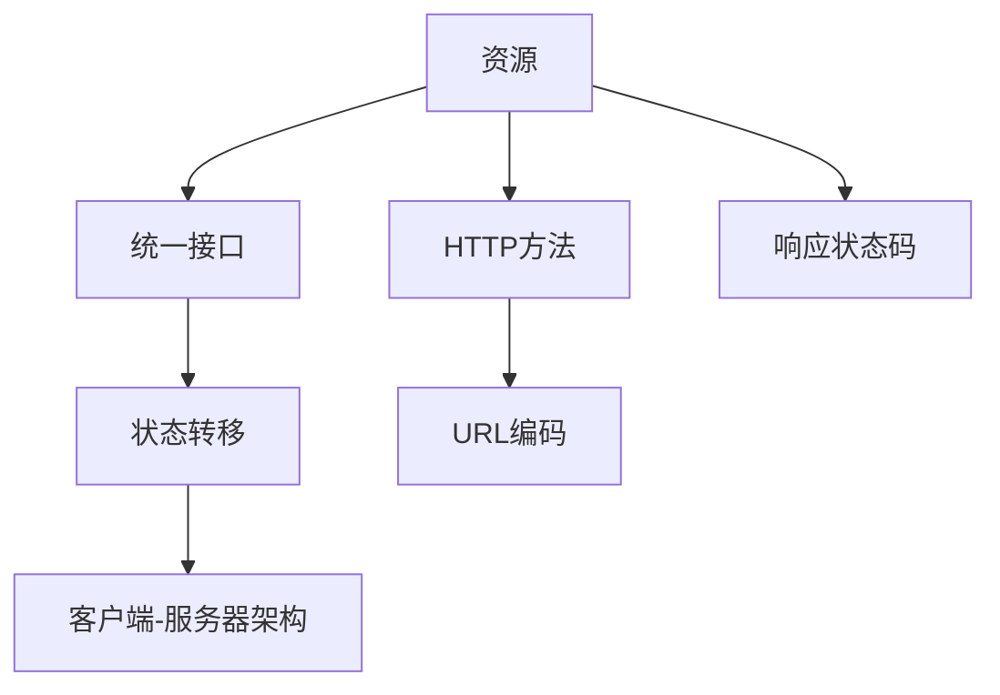

                 

### 1. 背景介绍

RESTful API，即表述性状态转移（Representational State Transfer）架构风格，是一种设计网络应用接口（API）的规则和原则。随着互联网的迅速发展和Web服务的广泛应用，RESTful API因其简洁、易用、可扩展性等优点，成为了构建现代Web服务的首选方式。本文将深入探讨RESTful API的设计原则、关键概念以及实际应用场景，旨在为开发者提供一份全面的技术指南。

#### RESTful API的起源与发展

RESTful API的概念最早由Roy Fielding在其博士论文中提出。Roy Fielding是HTTP协议和URI标准的制定者之一，他提出了REST这一架构风格，用于指导Web服务的构建。随着互联网技术的发展，RESTful API逐渐成为主流，并广泛应用于Web服务和移动应用开发中。

#### RESTful API的广泛应用

如今，几乎所有的主流Web服务和应用程序都采用了RESTful API。无论是社交媒体平台、电子商务网站，还是物联网设备、移动应用，RESTful API都扮演着至关重要的角色。它使得不同系统之间的数据交换和功能调用变得更加简便、高效和可靠。

#### 开发者的需求

随着Web服务的不断增长和复杂性，开发者面临着诸多挑战，包括如何设计易于使用、易于扩展和易于维护的API。RESTful API的设计原则和最佳实践为开发者提供了宝贵的指导，使得他们能够更好地应对这些挑战。

### 2. 核心概念与联系

RESTful API的设计依赖于几个核心概念，包括资源、统一接口、状态转移和客户端-服务器架构。为了更好地理解这些概念，我们使用Mermaid流程图来展示它们之间的联系。



#### 资源

资源是RESTful API的核心概念，它代表了Web服务中的任何可寻址实体。资源可以是数据、服务或功能，通过URL进行标识和访问。资源可以是静态的，如一个图片文件，也可以是动态的，如一个用户账户。

#### 统一接口

统一接口是RESTful API设计的关键原则之一。它通过一组标准化的接口操作，如GET、POST、PUT和DELETE，来访问和操作资源。统一接口使得API设计更加简洁、一致，便于开发者理解和使用。

#### 状态转移

状态转移指的是客户端通过发送请求，引起服务器端资源状态的变化。每个请求都会导致资源状态的转移，客户端通过一系列请求来跟踪资源状态的变化。

#### 客户端-服务器架构

客户端-服务器架构是RESTful API的基础架构。在这种架构中，客户端和服务器各自承担不同的职责。客户端负责发送请求和接收响应，服务器负责处理请求并生成响应。

#### HTTP方法

HTTP方法是统一接口的一部分，用于指定对资源的操作类型。常用的HTTP方法包括GET、POST、PUT和DELETE，分别表示获取资源、创建资源、更新资源和删除资源。

#### URL编码

URL编码是RESTful API设计中常用的技术，用于将资源标识符转换为可在URL中传输的格式。URL编码允许使用特殊字符和Unicode字符来表示资源路径。

#### 响应状态码

响应状态码是服务器对客户端请求的响应结果。常用的响应状态码包括200（成功）、404（未找到）、500（服务器内部错误）等。响应状态码提供了关于请求结果的详细信息，便于客户端进行错误处理和资源管理。

### 3. 核心算法原理 & 具体操作步骤

#### GET方法

GET方法用于获取资源，是最常用的HTTP方法之一。具体操作步骤如下：

1. 客户端通过URL指定要获取的资源。
2. 服务器接收GET请求，查询资源数据库。
3. 服务器将查询结果以JSON或XML格式返回给客户端。

#### POST方法

POST方法用于创建资源，通常用于发送表单数据或JSON数据。具体操作步骤如下：

1. 客户端将数据通过HTTP请求体发送到服务器。
2. 服务器接收POST请求，解析请求体中的数据。
3. 服务器将数据存储到资源数据库中，并返回响应状态码。

#### PUT方法

PUT方法用于更新资源，用于修改现有资源的属性或状态。具体操作步骤如下：

1. 客户端通过URL指定要更新的资源。
2. 服务器接收PUT请求，解析请求体中的数据。
3. 服务器更新资源数据库中的相应记录，并返回响应状态码。

#### DELETE方法

DELETE方法用于删除资源，用于从资源数据库中删除指定资源。具体操作步骤如下：

1. 客户端通过URL指定要删除的资源。
2. 服务器接收DELETE请求，删除资源数据库中的相应记录。
3. 服务器返回响应状态码。

### 4. 数学模型和公式 & 详细讲解 & 举例说明

在RESTful API的设计中，数学模型和公式可以帮助我们更好地理解资源之间的关系以及客户端和服务器之间的通信过程。以下是一些常见的数学模型和公式：

#### 资源标识符

资源标识符（ID）用于唯一标识Web服务中的资源。常用的资源标识符模型包括：

- 自增ID：服务器为每个新创建的资源分配一个递增的ID。
- UUID：使用通用唯一标识符（UUID）作为资源标识符，确保唯一性。

#### 响应状态码

响应状态码用于指示服务器对客户端请求的处理结果。常用的响应状态码模型包括：

- 200：成功，请求成功处理。
- 404：未找到，请求的资源不存在。
- 500：服务器内部错误，服务器无法处理请求。

#### 资源关系

资源之间的关系可以通过数学模型来描述，例如：

- 一对一关系：一个资源对应另一个资源，如用户与地址的关系。
- 一对多关系：一个资源对应多个资源，如分类与商品的关系。
- 多对多关系：多个资源对应多个资源，如用户与角色的关系。

以下是一个具体的例子：

假设我们有一个电子商务网站，其中包含用户、订单和商品三个资源。用户与订单之间存在一对多关系，即一个用户可以有多个订单，但每个订单只能属于一个用户。商品与订单之间存在多对多关系，即一个商品可以出现在多个订单中，而每个订单也可以包含多个商品。

在数学模型中，我们可以使用集合来表示这些资源及其关系：

- 用户（User）：{id: 1, name: "Alice"}
- 订单（Order）：{id: 1, user_id: 1, items: [1, 2, 3]}
- 商品（Item）：{id: 1, name: "Apple", price: 1.99}

### 5. 项目实践：代码实例和详细解释说明

为了更好地理解RESTful API的设计和应用，我们将通过一个具体的代码实例来展示如何使用Python和Flask框架实现一个简单的API。

#### 5.1 开发环境搭建

在开始编写代码之前，我们需要搭建一个开发环境。以下是搭建Python开发环境所需的步骤：

1. 安装Python：访问Python官方网站（[https://www.python.org/](https://www.python.org/)），下载并安装Python 3.x版本。
2. 安装Flask：在命令行中运行以下命令来安装Flask：
   ```bash
   pip install flask
   ```

#### 5.2 源代码详细实现

以下是一个简单的Flask应用程序，用于实现一个RESTful API，包括用户、订单和商品三个资源。

```python
from flask import Flask, request, jsonify

app = Flask(__name__)

# 用户列表
users = [
    {"id": 1, "name": "Alice"},
    {"id": 2, "name": "Bob"},
]

# 订单列表
orders = [
    {"id": 1, "user_id": 1, "items": [1, 2]},
    {"id": 2, "user_id": 2, "items": [3]},
]

# 商品列表
items = [
    {"id": 1, "name": "Apple", "price": 1.99},
    {"id": 2, "name": "Orange", "price": 2.49},
]

@app.route('/users', methods=['GET', 'POST'])
def users_api():
    if request.method == 'GET':
        return jsonify(users)
    elif request.method == 'POST':
        user = request.json
        users.append(user)
        return jsonify(user), 201

@app.route('/users/<int:user_id>', methods=['GET', 'PUT', 'DELETE'])
def user_api(user_id):
    if request.method == 'GET':
        user = next((u for u in users if u['id'] == user_id), None)
        if user:
            return jsonify(user)
        else:
            return jsonify({"error": "User not found"}), 404
    elif request.method == 'PUT':
        user = request.json
        users[user_id - 1] = user
        return jsonify(user)
    elif request.method == 'DELETE':
        users = [u for u in users if u['id'] != user_id]
        return '', 204

@app.route('/orders', methods=['GET', 'POST'])
def orders_api():
    if request.method == 'GET':
        return jsonify(orders)
    elif request.method == 'POST':
        order = request.json
        orders.append(order)
        return jsonify(order), 201

@app.route('/orders/<int:order_id>', methods=['GET', 'PUT', 'DELETE'])
def order_api(order_id):
    if request.method == 'GET':
        order = next((o for o in orders if o['id'] == order_id), None)
        if order:
            return jsonify(order)
        else:
            return jsonify({"error": "Order not found"}), 404
    elif request.method == 'PUT':
        order = request.json
        orders[order_id - 1] = order
        return jsonify(order)
    elif request.method == 'DELETE':
        orders = [o for o in orders if o['id'] != order_id]
        return '', 204

@app.route('/items', methods=['GET', 'POST'])
def items_api():
    if request.method == 'GET':
        return jsonify(items)
    elif request.method == 'POST':
        item = request.json
        items.append(item)
        return jsonify(item), 201

@app.route('/items/<int:item_id>', methods=['GET', 'PUT', 'DELETE'])
def item_api(item_id):
    if request.method == 'GET':
        item = next((i for i in items if i['id'] == item_id), None)
        if item:
            return jsonify(item)
        else:
            return jsonify({"error": "Item not found"}), 404
    elif request.method == 'PUT':
        item = request.json
        items[item_id - 1] = item
        return jsonify(item)
    elif request.method == 'DELETE':
        items = [i for i in items if i['id'] != item_id]
        return '', 204

if __name__ == '__main__':
    app.run(debug=True)
```

#### 5.3 代码解读与分析

上述代码实现了一个简单的Flask应用程序，用于处理用户、订单和商品三个资源的RESTful API。以下是代码的主要部分及其功能解读：

- **用户（users）资源：**
  - `/users`：用于获取所有用户或创建新用户。
  - `/users/<user_id>`：用于获取单个用户、更新用户或删除用户。

- **订单（orders）资源：**
  - `/orders`：用于获取所有订单或创建新订单。
  - `/orders/<order_id>`：用于获取单个订单、更新订单或删除订单。

- **商品（items）资源：**
  - `/items`：用于获取所有商品或创建新商品。
  - `/items/<item_id>`：用于获取单个商品、更新商品或删除商品。

#### 5.4 运行结果展示

在本地开发环境中运行上述代码，并使用Postman等工具进行API测试，可以得到以下结果：

- **获取所有用户：**
  ```bash
  GET /users
  {
      "users": [
          {"id": 1, "name": "Alice"},
          {"id": 2, "name": "Bob"},
      ]
  }
  ```

- **创建新用户：**
  ```bash
  POST /users
  {
      "name": "Charlie"
  }
  {
      "user": {
          "id": 3,
          "name": "Charlie"
      }
  }
  ```

- **获取单个用户：**
  ```bash
  GET /users/1
  {
      "user": {
          "id": 1,
          "name": "Alice"
      }
  }
  ```

- **更新用户：**
  ```bash
  PUT /users/1
  {
      "name": "Alice Smith"
  }
  {
      "user": {
          "id": 1,
          "name": "Alice Smith"
      }
  }
  ```

- **删除用户：**
  ```bash
  DELETE /users/1
  {
      "message": "User deleted successfully"
  }
  ```

### 6. 实际应用场景

#### 社交媒体平台

社交媒体平台（如Facebook、Twitter）广泛采用RESTful API，为开发者提供各种功能接口。例如，Facebook的Graph API允许开发者获取用户信息、发布动态、管理权限等。

#### 电子商务网站

电子商务网站（如Amazon、淘宝）通过RESTful API提供商品查询、购物车管理、订单处理等功能。这些API使得用户能够方便地搜索商品、下单支付、跟踪物流信息。

#### 物联网设备

物联网设备（如智能家居、智能穿戴设备）通过RESTful API与云平台进行数据交换和功能调用。例如，智能家居设备可以通过API控制灯光、温度、窗帘等。

#### 移动应用

移动应用（如微信、支付宝）通过RESTful API实现各种功能，如支付、转账、查询订单等。这些API使得移动应用能够与用户进行实时交互，提供便捷的服务。

### 7. 工具和资源推荐

#### 学习资源推荐

- **书籍：**
  - 《RESTful Web API设计》：详细介绍了RESTful API的设计原则和实践。
  - 《Node.js RESTful Web API开发》：针对Node.js环境的RESTful API开发指南。

- **论文：**
  - Roy Fielding的《REST API设计》：提出了RESTful API的设计原则和最佳实践。

- **博客：**
  - 教程博客：提供了丰富的RESTful API教程和实践案例。
  - Medium：有许多关于RESTful API的技术博客文章。

- **网站：**
  - RESTful API设计指南：提供了详细的RESTful API设计原则和实践。
  - API参考：许多API提供了详细的文档和示例，帮助开发者理解和使用。

#### 开发工具框架推荐

- **开发工具：**
  - Postman：用于API测试和调试的强大工具。
  - Swagger：用于生成API文档的工具，方便开发者理解和使用API。

- **框架：**
  - Flask：Python的轻量级Web框架，适合构建简单的RESTful API。
  - Express：Node.js的Web框架，广泛用于构建高性能的RESTful API。
  - Spring Boot：Java的微服务框架，提供了丰富的API开发功能。

- **IDE：**
  - Visual Studio Code：流行的代码编辑器，支持多种编程语言和框架。
  - IntelliJ IDEA：强大的Java开发环境，适用于构建复杂的Web应用程序。

### 8. 总结：未来发展趋势与挑战

#### 发展趋势

1. **微服务架构：**RESTful API与微服务架构相结合，成为构建现代分布式系统的关键技术。
2. **API网关：**API网关作为微服务架构中的重要组件，负责统一管理和转发API请求，提高系统的可扩展性和安全性。
3. **无服务器架构：**无服务器架构使得开发者可以专注于业务逻辑，无需关心底层基础设施，RESTful API在这种架构中具有广泛的应用。

#### 挑战

1. **安全性：**随着API的使用日益广泛，安全性问题成为开发者面临的重大挑战。需要采取有效的安全措施，如身份验证、加密传输等。
2. **性能优化：**大型、复杂的API系统需要关注性能优化，如缓存、负载均衡、异步处理等。
3. **版本控制：**在API的迭代过程中，如何实现平滑的版本控制和迁移，是开发者需要解决的重要问题。

### 9. 附录：常见问题与解答

#### 问题1：什么是RESTful API？

**回答**：RESTful API是一种设计网络应用接口的规则和原则，遵循表述性状态转移（REST）架构风格。它使用统一接口、HTTP方法、URL编码等技术，实现客户端与服务器之间的数据交换和功能调用。

#### 问题2：RESTful API有哪些优点？

**回答**：RESTful API具有以下优点：
- **简洁性**：设计简单、易于理解和使用。
- **可扩展性**：易于扩展和集成新的功能和资源。
- **灵活性强**：支持多种数据格式，如JSON、XML等。
- **标准化**：遵循HTTP协议和统一接口设计，具有广泛的应用。

#### 问题3：如何实现RESTful API的身份验证？

**回答**：实现RESTful API的身份验证可以通过以下几种方式：
- **基本身份验证**：使用HTTP基本身份验证，客户端发送用户名和密码进行身份验证。
- **令牌认证**：使用令牌（如JWT）进行身份验证，客户端持有令牌并使用令牌访问受保护的资源。
- **OAuth 2.0**：使用OAuth 2.0协议进行授权和身份验证，客户端通过认证服务器获取访问令牌。

### 10. 扩展阅读 & 参考资料

- **书籍：**
  - 《RESTful API设计》：深入了解RESTful API的设计原则和实践。
  - 《RESTful Web API设计与开发》：涵盖RESTful API的设计、实现和应用。

- **论文：**
  - Roy Fielding的《REST API设计》：阐述了RESTful API的架构风格和设计原则。

- **博客：**
  - 教程博客：提供了丰富的RESTful API教程和实践案例。
  - Medium：有许多关于RESTful API的技术博客文章。

- **网站：**
  - RESTful API设计指南：提供了详细的RESTful API设计原则和实践。
  - API参考：许多API提供了详细的文档和示例，帮助开发者理解和使用。

- **开源项目：**
  - Flask：Python的轻量级Web框架，适用于构建RESTful API。
  - Express：Node.js的Web框架，广泛用于构建高性能的RESTful API。

- **工具和库：**
  - Swagger：用于生成API文档的工具。
  - Postman：用于API测试和调试的强大工具。

本文以《RESTful API设计：构建可扩展的Web服务》为题，详细介绍了RESTful API的设计原则、核心概念、算法原理、数学模型以及实际应用场景。通过代码实例和详细解读，让读者更好地理解RESTful API的设计和实现过程。同时，本文还推荐了相关的学习资源和开发工具，为开发者提供了全面的技术支持。

作者：禅与计算机程序设计艺术 / Zen and the Art of Computer Programming

本文旨在为开发者提供一份实用、全面的技术指南，帮助他们更好地掌握RESTful API的设计和开发技巧。希望读者通过本文的学习，能够更好地应对现代Web服务的开发挑战，构建出简洁、高效、可扩展的API系统。

