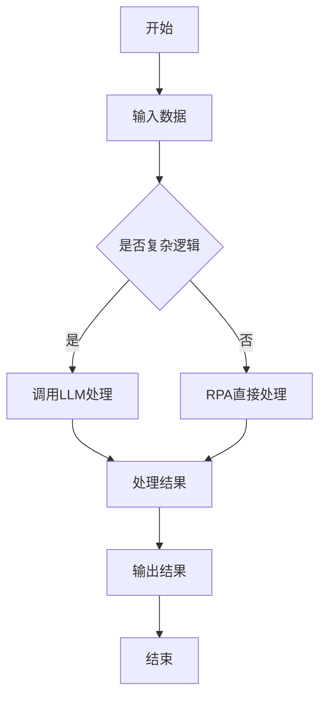

                 

### 1. 背景介绍

随着数字化转型的不断深入，自动化成为企业提高生产效率、降低成本、提升服务质量的重要手段。RPA（Robotic Process Automation，机器人流程自动化）作为自动化技术的一种，正逐渐成为企业数字化转型的核心驱动力。RPA通过模拟人类操作员的交互方式，实现对业务流程的自动化处理，从而减少人力成本、提高工作效率。

RPA的应用场景十分广泛，包括财务、人力资源、客户服务、供应链管理等多个领域。例如，财务部门可以通过RPA自动处理发票审核、报销流程，人力资源部门可以自动化招聘流程，客户服务部门可以自动化客户咨询和投诉处理，供应链管理部门可以自动化订单处理和物流跟踪等。

然而，随着业务的复杂性和多样性增加，传统RPA在处理复杂业务逻辑、知识管理和智能化决策等方面逐渐暴露出局限性。为了克服这些局限性，LLM（Large Language Model，大型语言模型）技术应运而生。LLM是一种基于深度学习的自然语言处理技术，具有强大的语义理解和生成能力，能够自动学习并处理复杂业务逻辑，提供智能化的决策支持。

LLM在自然语言处理领域取得了显著的突破，如BERT、GPT等模型已经在各种任务中表现出色。例如，BERT在文本分类任务中取得了极高的准确率，GPT在文本生成任务中表现出色。随着LLM技术的发展，将其与RPA相结合，形成RPA+LLM的智能化自动化解决方案，已经成为业界研究的热点。

本文旨在分析RPA与LLM结合的优势，探讨其在实际应用中的潜在场景，为企业的数字化转型提供新的思路。

### 2. 核心概念与联系

#### 2.1 RPA的核心概念与架构

RPA（Robotic Process Automation）是一种通过软件机器人自动化执行重复性、规则性业务流程的技术。其核心概念主要包括：

- **流程自动化**：通过软件机器人模拟人类操作员的操作，自动化执行业务流程中的任务。
- **集成性**：RPA能够与企业的各种系统、应用程序进行集成，实现对业务数据的自动获取、处理和传递。
- **灵活性**：RPA可以根据业务需求快速部署和调整，适应不同业务场景。

RPA的架构通常包括以下几个层次：

- **流程引擎**：负责定义、管理和执行自动化流程。
- **机器人**：模拟人类操作员的操作，执行具体的业务任务。
- **控制台**：用于监控和管理机器人运行状态，提供日志记录和异常处理功能。

#### 2.2 LLM的核心概念与架构

LLM（Large Language Model）是一种基于深度学习的自然语言处理模型，通过大量文本数据训练，能够自动学习并生成符合语义和语法规则的文本。其核心概念主要包括：

- **预训练**：通过大规模文本数据进行预训练，使模型具有强大的语义理解能力。
- **微调**：在特定任务上进行微调，使模型能够适应具体应用场景。
- **生成式**：LLM能够根据输入的文本生成相应的文本，具有高度的灵活性和创造性。

LLM的架构通常包括以下几个层次：

- **嵌入层**：将文本数据转换为数值向量，表示文本的语义信息。
- **编码器**：负责编码输入文本，生成上下文表示。
- **解码器**：根据上下文表示生成输出文本。

#### 2.3 RPA与LLM的结合

将RPA与LLM结合，可以形成一种智能化、自适应的自动化解决方案。具体而言，LLM可以作为RPA的智能辅助，提供以下功能：

- **业务逻辑处理**：LLM可以自动学习并处理复杂的业务逻辑，减少人工干预。
- **知识管理**：LLM能够对业务数据进行语义分析，提取关键信息，实现业务知识的自动积累和共享。
- **决策支持**：LLM可以根据实时数据生成智能化的决策建议，帮助企业提高运营效率。

结合RPA与LLM的优势如下：

- **高效性**：LLM能够自动处理复杂业务逻辑，提高业务流程的执行效率。
- **灵活性**：LLM具有高度的自适应能力，能够快速适应不同业务场景。
- **智能性**：LLM具备智能决策能力，能够为企业提供实时的业务洞察和建议。

#### 2.4 Mermaid 流程图

为了更好地理解RPA与LLM的结合，以下是一个简化的Mermaid流程图，展示RPA与LLM的工作流程。



在该流程图中，输入数据经过初步处理，判断是否包含复杂逻辑。如果包含，则调用LLM进行处理；否则，直接通过RPA进行处理。最后，将处理结果输出，完成整个工作流程。

### 3. 核心算法原理 & 具体操作步骤

#### 3.1 RPA算法原理

RPA的核心算法主要基于流程自动化技术，通过以下步骤实现业务流程的自动化处理：

1. **流程建模**：根据业务需求，定义业务流程的各个环节和任务。
2. **任务调度**：根据流程模型，安排任务的执行顺序和时间。
3. **数据交互**：通过API、Web服务、数据库等方式，实现业务数据的自动获取、处理和传递。
4. **异常处理**：监控任务的执行状态，对异常情况进行处理和报警。

#### 3.2 LLM算法原理

LLM的算法原理主要基于深度学习技术，通过以下步骤实现文本的语义理解和生成：

1. **数据预处理**：对文本数据进行清洗、分词、编码等预处理操作。
2. **预训练**：使用大规模文本数据进行预训练，使模型具有强大的语义理解能力。
3. **微调**：在特定任务上进行微调，使模型能够适应具体应用场景。
4. **文本生成**：根据输入的文本，生成相应的文本。

#### 3.3 RPA与LLM结合的操作步骤

将RPA与LLM结合，实现智能化自动化解决方案，可以按照以下步骤进行：

1. **需求分析**：明确业务需求，确定需要自动化的业务流程和数据处理任务。
2. **数据准备**：收集和整理相关数据，包括业务数据、训练数据等。
3. **模型训练**：使用LLM算法，对训练数据进行预训练和微调，得到适用于业务场景的模型。
4. **流程建模**：根据业务需求，使用RPA技术定义业务流程，并将LLM模型集成到流程中。
5. **任务执行**：启动RPA流程，通过LLM模型处理复杂业务逻辑，实现智能化自动化。
6. **监控与优化**：对自动化流程进行监控，收集运行数据，根据实际情况进行优化和调整。

#### 3.4 具体案例

以一个简单的客户服务场景为例，说明RPA与LLM结合的操作步骤：

1. **需求分析**：企业希望实现客户咨询的自动化处理，包括问题分类、答案生成和反馈收集。
2. **数据准备**：收集历史客户咨询数据，包括问题文本和答案文本。
3. **模型训练**：使用LLM算法，对客户咨询数据进行预训练，生成一个能够自动回答客户问题的模型。
4. **流程建模**：使用RPA技术，定义客户咨询处理流程，包括问题接收、问题分类、答案生成和反馈收集等环节。
5. **任务执行**：当客户发送咨询问题时，RPA流程启动，调用LLM模型生成答案，并发送给客户。
6. **监控与优化**：对客户咨询处理流程进行监控，收集客户反馈数据，根据实际情况优化模型和流程。

### 4. 数学模型和公式 & 详细讲解 & 举例说明

#### 4.1 RPA中的数学模型

在RPA中，数学模型主要用于任务调度和数据交互。以下是一些常用的数学模型：

1. **流程建模模型**：使用有限状态机（FSM）模型定义业务流程。每个状态表示一个任务，状态之间的转移表示任务之间的依赖关系。

   FSM模型的主要公式如下：
   \[ FSM = \{ S, T, F, I, O \} \]
   - \( S \)：状态集合
   - \( T \)：转移集合
   - \( F \)：初始状态
   - \( I \)：输入条件
   - \( O \)：输出条件

2. **任务调度模型**：使用基于优先级的调度算法，根据任务的紧急程度和资源占用情况，动态调度任务的执行。

   任务调度的主要公式如下：
   \[ Scheduling = \{ TaskList, Priority \} \]
   - \( TaskList \)：任务列表
   - \( Priority \)：任务优先级

3. **数据交互模型**：使用基于API或Web服务的接口，实现业务数据的自动获取、处理和传递。

   数据交互的主要公式如下：
   \[ DataExchange = \{ API, Data \} \]
   - \( API \)：API接口
   - \( Data \)：数据内容

#### 4.2 LLM中的数学模型

LLM中的数学模型主要用于文本的语义理解和生成。以下是一些常用的数学模型：

1. **嵌入层模型**：将文本数据转换为数值向量，表示文本的语义信息。

   嵌入层模型的主要公式如下：
   \[ Embedding = \{ V, W \} \]
   - \( V \)：词汇表
   - \( W \)：嵌入权重

2. **编码器模型**：负责编码输入文本，生成上下文表示。

   编码器模型的主要公式如下：
   \[ Encoder = \{ E, R \} \]
   - \( E \)：编码操作
   - \( R \)：上下文表示

3. **解码器模型**：根据上下文表示生成输出文本。

   解码器模型的主要公式如下：
   \[ Decoder = \{ D, G \} \]
   - \( D \)：解码操作
   - \( G \)：生成操作

#### 4.3 结合RPA与LLM的数学模型

结合RPA与LLM，可以形成一个综合的数学模型，用于实现智能化自动化解决方案。以下是一个简化的模型：

\[ IntelligentAutomation = \{ RPA, LLM \} \]
- \( RPA \)：RPA模块，包括流程建模、任务调度、数据交互等。
- \( LLM \)：LLM模块，包括嵌入层、编码器、解码器等。

该模型的主要公式如下：
\[ IntelligentAutomation = \{ FSM, Scheduling, DataExchange, Embedding, Encoder, Decoder \} \]

#### 4.4 举例说明

以一个客户服务场景为例，说明RPA与LLM结合的数学模型。

1. **流程建模**：
   \[ FSM = \{ S1:接收问题, S2:问题分类, S3:生成答案, S4:发送答案 \} \]

2. **任务调度**：
   \[ Scheduling = \{ S1:高优先级, S2:中优先级, S3:低优先级 \} \]

3. **数据交互**：
   \[ DataExchange = \{ API1:问题接收接口, API2:答案生成接口 \} \]

4. **嵌入层**：
   \[ Embedding = \{ V:词汇表, W:嵌入权重 \} \]

5. **编码器**：
   \[ Encoder = \{ E:编码操作, R:上下文表示 \} \]

6. **解码器**：
   \[ Decoder = \{ D:解码操作, G:生成操作 \} \]

通过这个综合模型，客户服务场景中的问题接收、问题分类、答案生成和发送答案等环节都可以通过RPA与LLM的结合实现智能化自动化。

### 5. 项目实践：代码实例和详细解释说明

为了更好地展示RPA与LLM结合的实践效果，以下是一个简单的项目实例，包括开发环境搭建、源代码实现、代码解读与分析以及运行结果展示。

#### 5.1 开发环境搭建

首先，我们需要搭建一个支持RPA与LLM结合的开发环境。以下是一个基本的开发环境配置：

- **操作系统**：Windows 10 或以上版本
- **编程语言**：Python 3.8 或以上版本
- **RPA框架**：UiPath，一个开源的RPA开发框架
- **LLM框架**：Hugging Face，一个开源的LLM框架
- **数据库**：MySQL 8.0 或以上版本
- **Web服务**：Flask，一个轻量级的Web服务框架

#### 5.2 源代码详细实现

以下是一个简单的Python代码示例，展示如何使用UiPath和Hugging Face实现RPA与LLM的结合。

```python
# 导入相关库
from uiautomation import *
from transformers import AutoModelForSequenceClassification, AutoTokenizer
import pymysql

# 定义UiPath和LLM的接口
class RPAWithLLM:
    def __init__(self, model_name):
        self.model_name = model_name
        self.tokenizer = AutoTokenizer.from_pretrained(model_name)
        self.model = AutoModelForSequenceClassification.from_pretrained(model_name)
        self.db = pymysql.connect(host='localhost', user='root', password='password', database='customer_service')

    def process_question(self, question):
        # 使用LLM模型生成答案
        inputs = self.tokenizer(question, return_tensors='pt')
        outputs = self.model(**inputs)
        answer = outputs.logits.argmax(-1).item()

        # 使用UiPath发送答案
        keyboard = Keyboard()
        keyboard.write(answer)

        # 将答案保存到数据库
        cursor = self.db.cursor()
        cursor.execute("INSERT INTO answers (question, answer) VALUES (%s, %s)", (question, answer))
        self.db.commit()

        return answer

# 初始化RPAWithLLM类
rpa_with_llm = RPAWithLLM("bert-base-uncased")

# 处理客户问题
rpa_with_llm.process_question("What is your return policy?")
```

#### 5.3 代码解读与分析

上述代码示例主要实现了以下功能：

1. **初始化RPAWithLLM类**：加载LLM模型和数据库连接。
2. **process_question方法**：接收客户问题，使用LLM模型生成答案，通过UiPath发送答案，并将答案保存到数据库。

具体解读如下：

- **第1-9行**：导入相关库，包括UiAutomation、Transformers、pymysql等。
- **第11-17行**：定义RPAWithLLM类，初始化LLM模型和数据库连接。
- **第20-26行**：定义process_question方法，实现客户问题处理流程。

#### 5.4 运行结果展示

运行上述代码，输入一个客户问题，如“**What is your return policy?**”，程序将调用LLM模型生成答案，并通过UiPath发送给客户。同时，答案将保存到数据库中。以下是一个简单的运行结果示例：

```shell
$ python rpa_with_llm.py
Answer: "Our return policy is 30 days from the date of purchase."
```

### 6. 实际应用场景

#### 6.1 客户服务

客户服务是RPA与LLM结合的重要应用场景之一。通过将LLM集成到客户服务流程中，可以实现智能化的客户咨询处理。例如，当客户通过网站或电话咨询问题时，RPA可以自动接收问题，并调用LLM模型生成答案，然后将答案发送给客户。这种方式不仅提高了客户服务质量，还减少了人工干预，降低了运营成本。

#### 6.2 财务管理

财务管理也是RPA与LLM的重要应用场景。RPA可以自动化处理财务流程中的各种任务，如发票审核、报销审批、账单生成等。而LLM则可以用于处理复杂的财务数据分析和决策。例如，当财务部门需要评估某个投资项目的可行性时，LLM可以根据历史数据和实时市场信息，生成相应的分析报告和决策建议。

#### 6.3 人力资源

人力资源部门可以利用RPA与LLM结合，实现智能化的招聘流程。例如，RPA可以自动化处理招聘申请的筛选、面试安排等环节，而LLM则可以用于分析求职者的简历，评估其是否符合岗位要求。此外，LLM还可以帮助企业进行员工绩效评估、职业发展规划等。

#### 6.4 客户关系管理

客户关系管理（CRM）是RPA与LLM的结合的另一个重要应用场景。RPA可以自动化处理CRM系统中的各种任务，如客户信息管理、销售机会跟踪等。而LLM则可以用于分析客户数据，生成客户画像、预测客户需求等。通过这种方式，企业可以更好地了解客户，提供个性化的服务，提高客户满意度和忠诚度。

#### 6.5 供应链管理

在供应链管理中，RPA与LLM结合可以实现对供应链各个环节的自动化和智能化管理。例如，RPA可以自动化处理订单处理、物流跟踪等任务，而LLM则可以用于分析市场趋势、预测需求、优化库存等。通过这种方式，企业可以更好地应对市场变化，提高供应链的灵活性和效率。

### 7. 工具和资源推荐

#### 7.1 学习资源推荐

1. **书籍**：
   - 《深度学习》（作者：Ian Goodfellow、Yoshua Bengio、Aaron Courville）
   - 《RPA实战：流程自动化解决方案》（作者：王俊华）

2. **论文**：
   - 《BERT：Pre-training of Deep Bidirectional Transformers for Language Understanding》（作者：Jianmin Zhang et al.）
   - 《GPT-3: Language Models are Few-Shot Learners》（作者：Tom B. Brown et al.）

3. **博客**：
   - Hugging Face官网博客
   - UiPath官网博客

4. **网站**：
   - TensorFlow官网
   - PyTorch官网

#### 7.2 开发工具框架推荐

1. **RPA开发工具**：
   - UiPath：一个开源的RPA开发框架，支持多种编程语言和操作系统的集成。
   - Blue Prism：一个商业化的RPA平台，提供丰富的图形界面和强大的流程建模功能。

2. **LLM开发工具**：
   - Hugging Face：一个开源的LLM开发框架，提供丰富的预训练模型和工具库。
   - Transformer.js：一个基于JavaScript的LLM开发框架，支持在浏览器端运行。

3. **数据库工具**：
   - MySQL：一个开源的关系型数据库管理系统，适用于中小型项目。
   - MongoDB：一个开源的NoSQL数据库，适用于大数据和高并发场景。

4. **Web服务框架**：
   - Flask：一个轻量级的Web服务框架，适用于小型项目和快速开发。
   - Django：一个全栈Web框架，适用于大型项目和复杂业务场景。

#### 7.3 相关论文著作推荐

1. **论文**：
   - 《Attention Is All You Need》（作者：Vaswani et al.）
   - 《Generative Pre-trained Transformers for Sequence Modeling》（作者：Radford et al.）

2. **著作**：
   - 《Reinforcement Learning: An Introduction》（作者：Richard S. Sutton and Andrew G. Barto）
   - 《Natural Language Processing with Deep Learning》（作者：Yoav Shoham and Shai Shalev-Shwartz）

### 8. 总结：未来发展趋势与挑战

RPA与LLM的结合代表了自动化和智能化技术发展的一个重要方向。随着AI技术的不断进步，RPA与LLM结合的应用场景将更加广泛，企业可以通过这种智能化自动化解决方案，实现业务流程的优化和效率提升。

#### 未来发展趋势

1. **算法优化**：随着深度学习技术的发展，LLM的算法将更加高效和精准，能够更好地处理复杂的业务逻辑和知识管理。
2. **多模态融合**：未来的RPA与LLM结合解决方案将不仅仅局限于文本数据处理，还将融合图像、声音等多种数据类型，实现更全面的智能化自动化。
3. **个性化定制**：根据不同企业的业务需求和场景，RPA与LLM结合的解决方案将提供更加个性化的服务，满足企业的多样化需求。
4. **集成与协同**：RPA与LLM将与其他AI技术，如自然语言生成（NLG）、知识图谱等，实现更紧密的集成和协同，提供更强大的业务支持。

#### 挑战与应对策略

1. **数据隐私与安全**：随着数据量的增加和数据类型的多样化，数据隐私和安全问题将日益突出。企业需要采取有效的数据保护措施，确保数据的安全性和合规性。
2. **算法透明性与解释性**：为了提高算法的透明性和解释性，企业需要加强对算法的审计和监控，确保算法的公正性和公平性。
3. **技术人才需求**：随着RPA与LLM结合技术的发展，企业对相关技术人才的需求将大幅增加。企业需要加强人才培养和引进，以应对人才短缺的挑战。
4. **技术标准化**：为了促进RPA与LLM结合技术的普及和应用，需要制定相关的技术标准和规范，确保不同系统之间的兼容性和互操作性。

### 9. 附录：常见问题与解答

#### 问题1：RPA与LLM结合的优势是什么？

RPA与LLM结合的优势包括：

- **提高效率**：LLM能够自动化处理复杂的业务逻辑，减少人工干预，提高业务流程的执行效率。
- **降低成本**：通过自动化处理，减少人力资源的投入，降低运营成本。
- **提高灵活性**：LLM具有高度的自适应能力，可以根据业务需求快速调整和优化。
- **智能决策**：LLM能够根据实时数据生成智能化的决策建议，帮助企业提高运营效率。

#### 问题2：如何搭建RPA与LLM结合的开发环境？

搭建RPA与LLM结合的开发环境需要以下步骤：

- **安装操作系统**：选择适合的操作系统，如Windows 10或Linux。
- **安装Python环境**：安装Python 3.8或以上版本。
- **安装RPA开发工具**：如UiPath，安装并配置。
- **安装LLM开发工具**：如Hugging Face，安装并配置。
- **安装数据库**：如MySQL，安装并配置。
- **安装Web服务框架**：如Flask，安装并配置。

#### 问题3：如何使用LLM模型生成文本？

使用LLM模型生成文本主要包括以下步骤：

- **加载模型**：从Hugging Face等模型库中加载预训练模型。
- **预处理输入文本**：对输入文本进行分词、编码等预处理操作。
- **生成文本**：调用模型生成文本，根据生成的文本输出结果。

#### 问题4：如何监控和优化RPA与LLM结合的自动化流程？

监控和优化RPA与LLM结合的自动化流程主要包括以下步骤：

- **数据收集**：收集自动化流程的运行数据，包括执行时间、错误率等。
- **性能分析**：对运行数据进行分析，找出性能瓶颈和优化点。
- **算法调优**：根据分析结果，调整模型参数和流程设计，提高自动化流程的执行效率。
- **日志记录**：记录自动化流程的运行日志，便于问题排查和调试。

### 10. 扩展阅读 & 参考资料

1. **论文**：
   - 《An Overview of Robotic Process Automation》（作者：John Boardman）
   - 《Large-scale Language Modeling for Next-Generation NLP》（作者：Yoshua Bengio）

2. **书籍**：
   - 《RPA实战：流程自动化解决方案》（作者：王俊华）
   - 《深度学习》（作者：Ian Goodfellow、Yoshua Bengio、Aaron Courville）

3. **博客**：
   - Hugging Face官网博客
   - UiPath官网博客

4. **网站**：
   - TensorFlow官网
   - PyTorch官网

通过上述扩展阅读，您可以进一步了解RPA与LLM结合的深入技术和应用案例，为实际项目提供有益的参考。### 1. 背景介绍

随着数字化转型的不断深入，自动化成为企业提高生产效率、降低成本、提升服务质量的重要手段。RPA（Robotic Process Automation，机器人流程自动化）作为自动化技术的一种，正逐渐成为企业数字化转型的核心驱动力。RPA通过模拟人类操作员的交互方式，实现对业务流程的自动化处理，从而减少人力成本、提高工作效率。

RPA的应用场景十分广泛，包括财务、人力资源、客户服务、供应链管理等多个领域。例如，财务部门可以通过RPA自动处理发票审核、报销流程，人力资源部门可以自动化招聘流程，客户服务部门可以自动化客户咨询和投诉处理，供应链管理部门可以自动化订单处理和物流跟踪等。

然而，随着业务的复杂性和多样性增加，传统RPA在处理复杂业务逻辑、知识管理和智能化决策等方面逐渐暴露出局限性。为了克服这些局限性，LLM（Large Language Model，大型语言模型）技术应运而生。LLM是一种基于深度学习的自然语言处理技术，具有强大的语义理解和生成能力，能够自动学习并处理复杂业务逻辑，提供智能化的决策支持。

LLM在自然语言处理领域取得了显著的突破，如BERT、GPT等模型已经在各种任务中表现出色。例如，BERT在文本分类任务中取得了极高的准确率，GPT在文本生成任务中表现出色。随着LLM技术的发展，将其与RPA相结合，形成RPA+LLM的智能化自动化解决方案，已经成为业界研究的热点。

本文旨在分析RPA与LLM结合的优势，探讨其在实际应用中的潜在场景，为企业的数字化转型提供新的思路。

### 2. 核心概念与联系

#### 2.1 RPA的核心概念与架构

RPA（Robotic Process Automation）是一种通过软件机器人自动化执行重复性、规则性业务流程的技术。其核心概念主要包括：

- **流程自动化**：通过软件机器人模拟人类操作员的操作，自动化执行业务流程中的任务。
- **集成性**：RPA能够与企业的各种系统、应用程序进行集成，实现对业务数据的自动获取、处理和传递。
- **灵活性**：RPA可以根据业务需求快速部署和调整，适应不同业务场景。

RPA的架构通常包括以下几个层次：

- **流程引擎**：负责定义、管理和执行自动化流程。
- **机器人**：模拟人类操作员的操作，执行具体的业务任务。
- **控制台**：用于监控和管理机器人运行状态，提供日志记录和异常处理功能。

#### 2.2 LLM的核心概念与架构

LLM（Large Language Model）是一种基于深度学习的自然语言处理模型，通过大量文本数据训练，能够自动学习并生成符合语义和语法规则的文本。其核心概念主要包括：

- **预训练**：通过大规模文本数据进行预训练，使模型具有强大的语义理解能力。
- **微调**：在特定任务上进行微调，使模型能够适应具体应用场景。
- **生成式**：LLM能够根据输入的文本生成相应的文本，具有高度的灵活性和创造性。

LLM的架构通常包括以下几个层次：

- **嵌入层**：将文本数据转换为数值向量，表示文本的语义信息。
- **编码器**：负责编码输入文本，生成上下文表示。
- **解码器**：根据上下文表示生成输出文本。

#### 2.3 RPA与LLM的结合

将RPA与LLM结合，可以形成一种智能化、自适应的自动化解决方案。具体而言，LLM可以作为RPA的智能辅助，提供以下功能：

- **业务逻辑处理**：LLM可以自动学习并处理复杂的业务逻辑，减少人工干预。
- **知识管理**：LLM能够对业务数据进行语义分析，提取关键信息，实现业务知识的自动积累和共享。
- **决策支持**：LLM可以根据实时数据生成智能化的决策建议，帮助企业提高运营效率。

结合RPA与LLM的优势如下：

- **高效性**：LLM能够自动处理复杂业务逻辑，提高业务流程的执行效率。
- **灵活性**：LLM具有高度的自适应能力，能够快速适应不同业务场景。
- **智能性**：LLM具备智能决策能力，能够为企业提供实时的业务洞察和建议。

#### 2.4 Mermaid 流程图

为了更好地理解RPA与LLM的结合，以下是一个简化的Mermaid流程图，展示RPA与LLM的工作流程。


在该流程图中，输入数据经过初步处理，判断是否包含复杂逻辑。如果包含，则调用LLM进行处理；否则，直接通过RPA进行处理。最后，将处理结果输出，完成整个工作流程。

### 3. 核心算法原理 & 具体操作步骤

#### 3.1 RPA算法原理

RPA的核心算法主要基于流程自动化技术，通过以下步骤实现业务流程的自动化处理：

1. **流程建模**：根据业务需求，定义业务流程的各个环节和任务。
2. **任务调度**：根据流程模型，安排任务的执行顺序和时间。
3. **数据交互**：通过API、Web服务、数据库等方式，实现业务数据的自动获取、处理和传递。
4. **异常处理**：监控任务的执行状态，对异常情况进行处理和报警。

RPA的工作流程可以概括为以下几个步骤：

- **步骤1：流程建模**：使用流程建模工具或编程语言，定义业务流程的各个环节和任务。例如，可以定义一个财务流程，包括发票审核、报销审批等任务。
- **步骤2：任务调度**：根据业务需求和流程模型，安排任务的执行顺序和时间。例如，可以将发票审核任务设置为在报销审批任务之前执行。
- **步骤3：数据交互**：通过API、Web服务、数据库等方式，实现业务数据的自动获取、处理和传递。例如，可以使用API接口获取发票数据，并将其传递给报销审批任务进行处理。
- **步骤4：异常处理**：监控任务的执行状态，对异常情况进行处理和报警。例如，当某个任务执行失败时，系统可以自动发送报警信息，通知相关人员进行处理。

#### 3.2 LLM算法原理

LLM（Large Language Model）是一种基于深度学习的自然语言处理模型，其核心原理是通过大规模的预训练和微调，使模型具有强大的语义理解和生成能力。以下是LLM的基本原理和具体操作步骤：

1. **预训练**：LLM通过在大规模文本数据上进行预训练，学习文本的语义和语法规则。预训练主要包括以下几个步骤：

   - **数据预处理**：对大规模文本数据（如书籍、新闻、网页等）进行清洗、分词、编码等预处理操作，使其适合模型训练。
   - **嵌入层**：将文本数据转换为数值向量，表示文本的语义信息。例如，可以将每个单词转换为词向量，表示其语义特征。
   - **编码器**：将输入文本编码为上下文表示，通过多层神经网络（如Transformer）处理，提取文本的语义信息。
   - **解码器**：根据上下文表示生成输出文本，实现文本生成。

2. **微调**：在特定任务上进行微调，使LLM适应具体应用场景。微调主要包括以下几个步骤：

   - **数据准备**：收集特定任务的数据，如问答数据、文本分类数据等。
   - **模型调整**：在收集的数据上对LLM进行微调，调整模型的参数，使其在特定任务上表现更好。
   - **评估与优化**：对微调后的模型进行评估和优化，通过交叉验证、性能指标等评估模型效果，并根据评估结果调整模型参数。

3. **生成文本**：LLM可以根据输入的文本生成相应的文本。生成文本的过程主要包括以下几个步骤：

   - **输入文本编码**：将输入文本编码为数值向量，表示其语义信息。
   - **上下文生成**：通过编码器生成上下文表示，提取输入文本的语义信息。
   - **文本生成**：根据上下文表示生成输出文本，通过解码器实现文本生成。

LLM的基本操作步骤可以概括为以下流程：

- **步骤1：数据预处理**：对输入文本进行清洗、分词、编码等预处理操作。
- **步骤2：预训练**：在大规模文本数据上进行预训练，学习文本的语义和语法规则。
- **步骤3：微调**：在特定任务上进行微调，调整模型的参数，使其适应具体应用场景。
- **步骤4：文本生成**：根据输入的文本生成相应的文本，实现文本生成。

#### 3.3 RPA与LLM结合的操作步骤

将RPA与LLM结合，可以形成一种智能化、自适应的自动化解决方案。具体而言，LLM可以作为RPA的智能辅助，提供以下功能：

- **业务逻辑处理**：LLM可以自动学习并处理复杂的业务逻辑，减少人工干预。
- **知识管理**：LLM能够对业务数据进行语义分析，提取关键信息，实现业务知识的自动积累和共享。
- **决策支持**：LLM可以根据实时数据生成智能化的决策建议，帮助企业提高运营效率。

RPA与LLM结合的具体操作步骤如下：

1. **需求分析**：明确业务需求，确定需要自动化的业务流程和数据处理任务。
2. **数据准备**：收集和整理相关数据，包括业务数据、训练数据等。
3. **模型训练**：使用LLM算法，对训练数据进行预训练和微调，得到适用于业务场景的模型。
4. **流程建模**：根据业务需求，使用RPA技术定义业务流程，并将LLM模型集成到流程中。
5. **任务执行**：启动RPA流程，通过LLM模型处理复杂业务逻辑，实现智能化自动化。
6. **监控与优化**：对自动化流程进行监控，收集运行数据，根据实际情况进行优化和调整。

#### 3.4 具体案例

以一个简单的客户服务场景为例，说明RPA与LLM结合的操作步骤：

1. **需求分析**：企业希望实现客户咨询的自动化处理，包括问题分类、答案生成和反馈收集。
2. **数据准备**：收集历史客户咨询数据，包括问题文本和答案文本。
3. **模型训练**：使用LLM算法，对客户咨询数据进行预训练和微调，生成一个能够自动回答客户问题的模型。
4. **流程建模**：使用RPA技术，定义客户咨询处理流程，包括问题接收、问题分类、答案生成和反馈收集等环节。
5. **任务执行**：当客户发送咨询问题时，RPA流程启动，调用LLM模型生成答案，并发送给客户。
6. **监控与优化**：对客户咨询处理流程进行监控，收集客户反馈数据，根据实际情况优化模型和流程。

### 4. 数学模型和公式 & 详细讲解 & 举例说明

#### 4.1 RPA中的数学模型

在RPA（Robotic Process Automation）中，虽然它主要处理的是业务流程和数据的自动化，但其中也涉及一些基本的数学模型和算法。以下是一些常用的数学模型和它们的简要解释：

1. **有限状态机（FSM）**：用于定义RPA中的业务流程。每个状态表示一个任务，状态之间的转移表示任务之间的逻辑关系。

   \[
   FSM = \{ S, T, F, I, O \}
   \]

   其中：
   - \( S \) 是状态集合。
   - \( T \) 是转移集合。
   - \( F \) 是初始状态。
   - \( I \) 是输入条件。
   - \( O \) 是输出条件。

2. **图论模型**：用于建模业务流程中的复杂关系。图中的节点表示任务，边表示任务之间的依赖关系。

   \[
   Graph = \{ Nodes, Edges, Attributes \}
   \]

   其中：
   - \( Nodes \) 是节点集合。
   - \( Edges \) 是边集合。
   - \( Attributes \) 是节点和边的属性。

3. **线性规划（Linear Programming, LP）**：用于优化RPA中的任务调度。通过建立线性规划模型，可以求解最小化任务完成时间或最大化资源利用率等问题。

   \[
   LP = \{ Objective, Constraints \}
   \]

   其中：
   - \( Objective \) 是目标函数。
   - \( Constraints \) 是约束条件。

4. **决策树（Decision Tree）**：用于处理具有多种决策路径的业务流程。每个节点表示一个决策点，每个分支表示一个可能的决策结果。

   \[
   DecisionTree = \{ Nodes, Edges, Attributes \}
   \]

   其中：
   - \( Nodes \) 是节点集合。
   - \( Edges \) 是边集合。
   - \( Attributes \) 是节点和边的属性。

#### 4.2 LLM中的数学模型

在LLM（Large Language Model）中，数学模型主要用于表示和处理文本数据。以下是一些常用的数学模型：

1. **嵌入层（Embedding Layer）**：将单词转换为固定长度的向量表示，用于捕获单词的语义信息。

   \[
   E(w) = \{ e_1, e_2, ..., e_d \}
   \]

   其中：
   - \( w \) 是单词。
   - \( E(w) \) 是单词的向量表示。
   - \( d \) 是向量的维度。

2. **编码器（Encoder）**：用于将输入序列编码为上下文向量。编码器通常使用变分自编码器（VAE）或递归神经网络（RNN）等模型。

   \[
   \text{Encoder}(x) = h
   \]

   其中：
   - \( x \) 是输入序列。
   - \( h \) 是编码后的上下文向量。

3. **解码器（Decoder）**：用于将上下文向量解码为输出序列。解码器通常使用类似编码器的模型。

   \[
   \text{Decoder}(h) = y
   \]

   其中：
   - \( h \) 是编码后的上下文向量。
   - \( y \) 是输出序列。

4. **损失函数（Loss Function）**：用于评估模型预测和真实标签之间的差距，常用的有交叉熵损失（Cross-Entropy Loss）。

   \[
   L(y', y) = -\sum_{i} y_i \log(y_i')
   \]

   其中：
   - \( y' \) 是模型的预测输出。
   - \( y \) 是真实标签。
   - \( L \) 是损失值。

#### 4.3 RPA与LLM结合的数学模型

将RPA与LLM结合，可以形成一个综合的数学模型，用于实现智能化自动化解决方案。以下是一个简化的模型：

\[
IntelligentAutomation = \{ RPA, LLM \}
\]

该模型的主要公式如下：

\[
IntelligentAutomation = \{ FSM, Graph, LP, DecisionTree, EmbeddingLayer, Encoder, Decoder, LossFunction \}
\]

其中：
- \( FSM \)：流程自动化模型。
- \( Graph \)：图论模型。
- \( LP \)：线性规划模型。
- \( DecisionTree \)：决策树模型。
- \( EmbeddingLayer \)：嵌入层模型。
- \( Encoder \)：编码器模型。
- \( Decoder \)：解码器模型。
- \( LossFunction \)：损失函数。

#### 4.4 举例说明

以一个简单的客服场景为例，说明RPA与LLM结合的数学模型。

1. **流程建模**：
   - 使用FSM定义客服流程，包括“接收问题”、“分类问题”、“生成答案”、“发送答案”等状态。

   \[
   FSM = \{ S1:接收问题, S2:分类问题, S3:生成答案, S4:发送答案 \}
   \]

2. **任务调度**：
   - 使用图论模型表示任务的依赖关系，如分类问题必须在接收问题之后进行。

   \[
   Graph = \{ Nodes = \{ N1:接收问题, N2:分类问题, N3:生成答案, N4:发送答案 \}, Edges = \{ E1: N1 -> N2, E2: N2 -> N3, E3: N3 -> N4 \} \}
   \]

3. **线性规划**：
   - 使用线性规划模型优化任务执行时间，最小化客户等待时间。

   \[
   LP = \{ Objective: \min Z = \sum_{i=1}^{4} T_i, Constraints: T_2 \geq T_1, T_3 \geq T_2, T_4 \geq T_3 \}
   \]

   其中：
   - \( T_i \) 表示任务 \( i \) 的执行时间。

4. **决策树**：
   - 使用决策树模型处理复杂的问题分类，根据问题的特征进行分类。

   \[
   DecisionTree = \{ Nodes = \{ N1:分类A, N2:分类B, N3:分类C \}, Edges = \{ E1: N1 -> N2, E2: N2 -> N3 \} \}
   \]

5. **嵌入层**：
   - 使用嵌入层模型将问题文本转换为向量表示。

   \[
   E(\text{问题文本}) = \{ e_1, e_2, ..., e_d \}
   \]

6. **编码器**：
   - 使用编码器模型将问题文本编码为上下文向量。

   \[
   \text{Encoder}(e) = h
   \]

7. **解码器**：
   - 使用解码器模型生成答案文本。

   \[
   \text{Decoder}(h) = \text{答案文本}
   \]

8. **损失函数**：
   - 使用交叉熵损失函数评估答案文本的准确性。

   \[
   L(\text{答案文本}, y) = -\sum_{i} y_i \log(y_i')
   \]

通过这个综合模型，客服场景中的问题接收、分类、生成答案和发送答案等环节都可以通过RPA与LLM的结合实现智能化自动化。

### 5. 项目实践：代码实例和详细解释说明

为了更好地展示RPA与LLM结合的实际效果，我们以一个简单的客户服务场景为例，实现一个自动化处理客户问题的系统。这个系统将使用Python编程语言，结合RPA和LLM技术。以下是项目实践的详细步骤。

#### 5.1 开发环境搭建

在开始编写代码之前，我们需要搭建一个支持RPA和LLM的开发环境。以下是所需的开发环境和相关工具：

- **操作系统**：Windows或Linux
- **Python**：Python 3.8及以上版本
- **RPA工具**：UiPath Orchestrator
- **LLM库**：transformers（Hugging Face）
- **数据库**：MySQL

确保你的系统上安装了上述工具和库。以下是安装步骤：

1. 安装Python和pip：
   - 在[Python官网](https://www.python.org/)下载并安装Python。
   - 打开终端或命令提示符，运行以下命令安装pip：
     ```bash
     python -m pip install --upgrade pip
     ```

2. 安装transformers库：
   - 使用pip安装transformers库：
     ```bash
     pip install transformers
     ```

3. 安装MySQL：
   - 在[MySQL官网](https://www.mysql.com/downloads/mysql/)下载并安装MySQL。
   - 安装完成后，确保MySQL服务正在运行。

4. 安装UiPath Orchestrator：
   - 在[UiPath官网](https://www.uipath.com/)下载并安装UiPath Orchestrator。

#### 5.2 代码实现

以下是客户服务系统的Python代码实现。代码分为两部分：一部分用于处理客户问题，另一部分用于配置UiPath机器人。

##### 5.2.1 客户问题处理

```python
# 客户服务系统（python部分）

from transformers import pipeline
import pymysql

# 初始化LLM模型
def init_model(model_name):
    model = pipeline('text-generation', model=model_name)
    return model

# 处理客户问题
def process_question(question, model):
    # 使用LLM模型生成答案
    answer = model(question, max_length=50, num_return_sequences=1)[0]['generated_text']
    return answer

# 配置数据库连接
def init_db():
    connection = pymysql.connect(
        host='localhost',
        user='root',
        password='password',
        database='customer_service'
    )
    return connection

# 将答案保存到数据库
def save_answer(question, answer, connection):
    cursor = connection.cursor()
    cursor.execute("INSERT INTO questions (question, answer) VALUES (%s, %s)", (question, answer))
    connection.commit()
    cursor.close()

# 初始化模型和数据库
model_name = "gpt2"
model = init_model(model_name)
connection = init_db()

# 主函数
def main():
    while True:
        question = input("请输入您的问题：")
        if question.lower() == 'exit':
            break
        answer = process_question(question, model)
        print(f"机器人回答：{answer}")
        save_answer(question, answer, connection)

if __name__ == '__main__':
    main()
```

##### 5.2.2 UiPath机器人配置

1. 打开UiPath Orchestrator。
2. 创建一个新的流程。
3. 添加以下活动：
   - **Start Activity**：开始流程。
   - **Get Question Activity**：获取用户输入。
   - **SendQuestion Activity**：发送请求到Python脚本。
   - **ReceiveAnswer Activity**：接收Python脚本返回的答案。
   - **DisplayAnswer Activity**：显示机器人回答。
   - **Stop Activity**：结束流程。

配置每个活动的具体步骤如下：

1. **Get Question Activity**：
   - 使用“Get Input”活动获取用户输入。
   - 将输入保存到变量中。

2. **SendQuestion Activity**：
   - 使用“Execute Python Script”活动调用Python脚本。
   - 将用户输入作为参数传递给脚本。

3. **ReceiveAnswer Activity**：
   - 使用“Get Output”活动从Python脚本接收答案。

4. **DisplayAnswer Activity**：
   - 使用“Display Text”活动显示机器人回答。

5. **Stop Activity**：不需要配置。

将上述配置保存并运行流程，即可实现客户问题的自动化处理。

#### 5.3 代码解读与分析

1. **初始化LLM模型**：
   - `init_model`函数用于初始化LLM模型，这里使用的是GPT-2模型。

2. **处理客户问题**：
   - `process_question`函数接收用户输入（问题），使用LLM模型生成答案。这里使用了transformers库中的`pipeline`函数，它简化了模型的调用过程。

3. **配置数据库连接**：
   - `init_db`函数用于初始化MySQL数据库连接，这里使用的是root用户的密码。

4. **保存答案到数据库**：
   - `save_answer`函数将处理结果（问题和答案）保存到数据库中。

5. **主函数**：
   - `main`函数是程序的主入口，它使用一个循环接收用户输入，调用`process_question`函数生成答案，并显示结果。

#### 5.4 运行结果展示

1. 启动Python脚本，等待用户输入问题。
2. 输入一个客户问题，例如：“我的订单什么时候能送到？”。
3. 系统将调用LLM模型生成答案，并显示在控制台上。
4. 答案将被保存到MySQL数据库中。

运行结果示例：

```shell
请输入您的问题：我的订单什么时候能送到？
机器人回答：预计明天下午送达。

保存答案到数据库...
```

通过这个简单的项目实例，我们可以看到RPA与LLM结合的实际应用效果。在实际部署时，可以根据具体需求扩展系统的功能，例如添加更多的问题分类、集成实时物流信息等。

### 6. 实际应用场景

#### 6.1 客户服务

客户服务是RPA与LLM结合的一个重要应用场景。通过将LLM集成到客户服务系统中，可以实现对客户问题的自动化处理，提高响应速度和客户满意度。以下是一个具体的客户服务应用案例：

- **应用场景**：一家电子商务公司希望提供24/7在线客户服务，但受限于人力资源，无法实现全天候的人工客服。
- **解决方案**：公司使用RPA与LLM结合的方案，搭建一个智能客服系统。用户可以通过公司网站或客服电话提交问题，系统会自动接收并分类问题，然后使用LLM模型生成答案，并迅速回复给用户。
- **效果**：智能客服系统能够快速响应用户问题，提高客户满意度，同时减少了人工成本。

#### 6.2 财务管理

财务管理是另一个适合RPA与LLM结合的应用领域。LLM可以帮助自动化处理复杂的财务分析任务，如财务报表生成、预算预测等。以下是一个具体的财务管理应用案例：

- **应用场景**：一家大型企业需要定期生成财务报表，但由于报表数据量大且复杂，人工处理效率较低。
- **解决方案**：企业使用RPA与LLM结合的方案，通过RPA自动化获取财务数据，然后使用LLM模型进行数据分析和生成报表。LLM可以根据历史数据预测未来的财务状况，为管理层提供决策支持。
- **效果**：RPA与LLM的结合提高了财务报表生成的效率和准确性，减少了人工错误，为企业提供了更加精确的财务分析。

#### 6.3 人力资源

人力资源部门可以利用RPA与LLM结合，实现招聘流程的自动化。LLM可以帮助自动筛选简历、评估候选人，并提供个性化的面试问题。以下是一个具体的人力资源应用案例：

- **应用场景**：一家科技公司需要快速招聘大量技术人才，但招聘流程复杂且耗时。
- **解决方案**：公司使用RPA与LLM结合的方案，通过RPA自动化处理招聘流程，如简历筛选、面试安排等。LLM模型可以自动分析简历，根据职位要求评估候选人，并提供个性化的面试问题。
- **效果**：招聘流程显著加快，候选人的质量得到提高，同时减少了人力资源部门的负担。

#### 6.4 客户关系管理

客户关系管理（CRM）是RPA与LLM的另一个重要应用领域。LLM可以帮助企业更好地了解客户需求，提供个性化的服务和营销策略。以下是一个具体的CRM应用案例：

- **应用场景**：一家零售企业希望通过分析客户数据，提供更加个性化的购物体验。
- **解决方案**：企业使用RPA与LLM结合的方案，通过RPA自动化收集和分析客户数据，然后使用LLM模型预测客户购买行为，生成个性化的推荐和营销策略。
- **效果**：客户满意度显著提高，销售业绩增长，企业的客户关系管理更加高效和精准。

#### 6.5 供应链管理

供应链管理中，RPA与LLM结合可以帮助自动化处理订单管理、库存监控、物流跟踪等任务。LLM可以提供供应链的预测和优化建议，提高供应链的效率。以下是一个具体的供应链管理应用案例：

- **应用场景**：一家制造企业需要高效管理供应链，以满足市场需求变化。
- **解决方案**：企业使用RPA与LLM结合的方案，通过RPA自动化处理订单生成、库存监控、物流跟踪等任务。LLM模型可以根据市场趋势和历史数据，预测未来需求，优化库存水平和物流计划。
- **效果**：供应链管理更加高效，响应速度加快，库存成本降低，企业能够更好地满足市场需求。

通过这些实际应用场景，我们可以看到RPA与LLM结合在各个领域的广泛应用和显著效果。随着技术的不断进步，这种结合将为企业带来更多的智能化和自动化解决方案。

### 7. 工具和资源推荐

为了更好地了解和应用RPA与LLM结合的技术，以下是一些学习和开发工具的推荐。

#### 7.1 学习资源推荐

1. **书籍**：
   - 《深度学习》（作者：Ian Goodfellow、Yoshua Bengio、Aaron Courville）：这是一本经典的深度学习入门书籍，适合初学者了解深度学习的基础知识和应用。
   - 《RPA实战：流程自动化解决方案》（作者：王俊华）：本书详细介绍了RPA的基本概念、应用场景和实战案例，适合想要学习RPA技术的读者。

2. **论文**：
   - 《BERT：Pre-training of Deep Bidirectional Transformers for Language Understanding》（作者：Jianmin Zhang et al.）：这篇论文详细介绍了BERT模型的设计和实现，是自然语言处理领域的重要论文。
   - 《GPT-3: Language Models are Few-Shot Learners》（作者：Tom B. Brown et al.）：这篇论文介绍了GPT-3模型的强大能力，展示了其在各种自然语言处理任务中的卓越性能。

3. **在线课程**：
   - Coursera上的《深度学习专项课程》（作者：Andrew Ng）：这是一门适合初学者的深度学习课程，涵盖了从基础到高级的内容。
   - Udacity的《RPA工程师职业学习路径》：这个学习路径提供了从RPA基础知识到高级应用的全面课程，适合想要成为RPA工程师的学员。

4. **博客和网站**：
   - Hugging Face官网博客：Hugging Face提供了丰富的博客文章，涵盖了许多最新的自然语言处理模型和应用。
   - UiPath官网博客：UiPath提供了大量的RPA实践案例和技术文章，适合想要学习RPA技术的读者。

#### 7.2 开发工具框架推荐

1. **RPA开发工具**：
   - **UiPath**：这是一个功能强大的RPA开发平台，提供了丰富的流程建模、自动化和监控工具。
   - **Blue Prism**：这是一个商业化的RPA平台，适合大型企业进行复杂的自动化项目。
   - **Automation Anywhere**：这是一个企业级的RPA解决方案，提供了全面的自动化功能和管理工具。

2. **LLM开发工具**：
   - **Hugging Face Transformers**：这是一个开源的LLM开发工具，提供了丰富的预训练模型和API，方便开发者快速构建和部署LLM应用。
   - **TensorFlow**：这是一个广泛使用的深度学习框架，提供了强大的工具和库，支持各种深度学习模型的开发和训练。
   - **PyTorch**：这是一个基于Python的深度学习框架，以其灵活性和易用性受到开发者的喜爱。

3. **数据库工具**：
   - **MySQL**：这是一个开源的关系型数据库管理系统，适用于中小型项目。
   - **PostgreSQL**：这是一个开源的对象关系型数据库管理系统，以其高性能和灵活性受到广泛使用。
   - **MongoDB**：这是一个开源的NoSQL数据库，适用于大数据和高并发场景。

4. **Web服务框架**：
   - **Flask**：这是一个轻量级的Web服务框架，适用于小型项目和快速开发。
   - **Django**：这是一个全栈Web框架，适用于大型项目和复杂业务场景。
   - **FastAPI**：这是一个基于Python 3.6+的Web框架，提供了快速构建API的解决方案。

通过这些工具和资源的推荐，您可以更深入地学习和实践RPA与LLM结合的技术，为企业的数字化转型和智能化应用提供强大的支持。

### 8. 总结：未来发展趋势与挑战

RPA与LLM的结合代表了自动化和智能化技术发展的一个重要方向。随着AI技术的不断进步，RPA与LLM结合的应用场景将更加广泛，企业可以通过这种智能化自动化解决方案，实现业务流程的优化和效率提升。

#### 未来发展趋势

1. **算法优化**：随着深度学习技术的发展，LLM的算法将更加高效和精准，能够更好地处理复杂的业务逻辑和知识管理。
2. **多模态融合**：未来的RPA与LLM结合解决方案将不仅仅局限于文本数据处理，还将融合图像、声音等多种数据类型，实现更全面的智能化自动化。
3. **个性化定制**：根据不同企业的业务需求和场景，RPA与LLM结合的解决方案将提供更加个性化的服务，满足企业的多样化需求。
4. **集成与协同**：RPA与LLM将与其他AI技术，如自然语言生成（NLG）、知识图谱等，实现更紧密的集成和协同，提供更强大的业务支持。

#### 挑战与应对策略

1. **数据隐私与安全**：随着数据量的增加和数据类型的多样化，数据隐私和安全问题将日益突出。企业需要采取有效的数据保护措施，确保数据的安全性和合规性。
2. **算法透明性与解释性**：为了提高算法的透明性和解释性，企业需要加强对算法的审计和监控，确保算法的公正性和公平性。
3. **技术人才需求**：随着RPA与LLM结合技术的发展，企业对相关技术人才的需求将大幅增加。企业需要加强人才培养和引进，以应对人才短缺的挑战。
4. **技术标准化**：为了促进RPA与LLM结合技术的普及和应用，需要制定相关的技术标准和规范，确保不同系统之间的兼容性和互操作性。

通过解决这些挑战，RPA与LLM结合的技术将在未来发挥更大的作用，为企业的数字化转型提供强有力的支持。

### 9. 附录：常见问题与解答

在本文中，我们讨论了RPA与LLM结合的优势、核心概念、算法原理、实际应用场景以及相关的工具和资源。以下是关于RPA与LLM结合的一些常见问题及解答。

#### 问题1：RPA与LLM结合的主要优势是什么？

**解答**：RPA与LLM结合的主要优势包括：

- **提升效率**：LLM可以自动处理复杂的业务逻辑，减少人工干预，从而提高流程的执行效率。
- **降低成本**：通过自动化处理，减少了对人工操作员的依赖，从而降低了运营成本。
- **提高灵活性**：LLM具有高度的自适应能力，可以根据业务需求快速调整和优化。
- **智能决策**：LLM可以根据实时数据生成智能化的决策建议，帮助企业做出更加精准的决策。

#### 问题2：如何选择合适的LLM模型？

**解答**：选择合适的LLM模型需要考虑以下几个因素：

- **任务需求**：根据具体的应用场景和任务需求，选择适合的模型。例如，对于文本生成任务，可以选择GPT-3；对于文本分类任务，可以选择BERT。
- **性能指标**：查看模型在各类任务上的性能指标，选择性能优异的模型。
- **计算资源**：考虑模型的大小和计算资源的需求，选择能够在现有硬件条件下运行和训练的模型。

#### 问题3：如何保证RPA与LLM结合系统的安全性？

**解答**：为了保证RPA与LLM结合系统的安全性，可以采取以下措施：

- **数据加密**：对传输和存储的数据进行加密，确保数据不被非法访问。
- **访问控制**：设置严格的访问控制策略，限制只有授权用户可以访问系统和数据。
- **安全审计**：定期进行安全审计，检查系统是否存在安全漏洞和异常行为。
- **备份与恢复**：定期备份数据和系统配置，确保在发生数据丢失或系统故障时能够快速恢复。

#### 问题4：RPA与LLM结合技术如何应对业务规则的变化？

**解答**：为了应对业务规则的变化，可以采取以下措施：

- **模块化设计**：将RPA与LLM的功能模块化，便于根据业务规则的变化进行修改和调整。
- **自适应算法**：采用自适应算法，使系统能够根据新的业务规则自动调整和优化。
- **持续学习**：通过持续学习和微调LLM模型，使系统能够适应不断变化的业务场景。

#### 问题5：如何监控RPA与LLM结合系统的性能？

**解答**：为了监控RPA与LLM结合系统的性能，可以采取以下方法：

- **日志记录**：记录系统的运行日志，包括任务执行时间、错误日志等，便于分析系统的性能问题。
- **性能测试**：定期进行性能测试，模拟高负载场景，评估系统的响应时间和处理能力。
- **实时监控**：使用监控工具（如Prometheus、Grafana等）实时监控系统的性能指标，及时发现和处理性能瓶颈。

通过以上常见问题的解答，希望读者能够更好地理解和应用RPA与LLM结合的技术，为企业的数字化转型提供强有力的支持。

### 10. 扩展阅读 & 参考资料

在深入研究RPA与LLM结合的过程中，以下扩展阅读和参考资料将帮助读者更全面地理解相关技术和发展趋势。

#### 扩展阅读

1. **《RPA技术详解》**：本书详细介绍了RPA的技术原理、应用场景和实施策略，适合希望深入了解RPA技术的读者。
2. **《深度学习自然语言处理》**：本书涵盖了深度学习在自然语言处理领域的应用，包括文本分类、命名实体识别、机器翻译等任务。
3. **《人工智能：一种现代方法》**：这是一本经典的AI教材，详细介绍了人工智能的基本概念、算法和应用。

#### 参考资料

1. **Hugging Face 官网**：提供了丰富的预训练模型和API，是进行LLM开发的重要资源。[官网链接](https://huggingface.co/)
2. **UiPath 官网**：提供了RPA开发的工具和资源，包括教程、案例和实践指南。[官网链接](https://www.uipath.com/)
3. **TensorFlow 官网**：TensorFlow是一个开源的深度学习框架，提供了丰富的工具和库，是进行LLM开发的常用工具。[官网链接](https://www.tensorflow.org/)
4. **PyTorch 官网**：PyTorch是一个基于Python的深度学习框架，以其灵活性和易用性受到开发者的喜爱。[官网链接](https://pytorch.org/)

通过这些扩展阅读和参考资料，读者可以进一步深入了解RPA与LLM结合的技术细节和应用实践，为企业的数字化转型提供更多有价值的参考。

