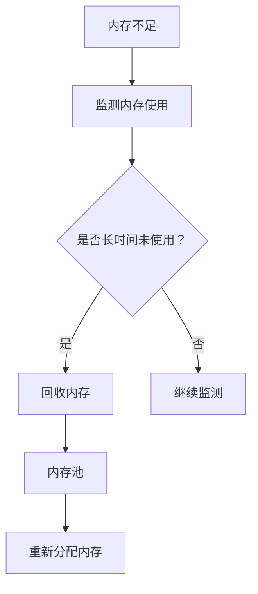

                 

### 文章标题：Recall 原理与代码实战案例讲解

#### 关键词：Recall机制，内存管理，垃圾回收，C++实现，性能优化

> 摘要：本文将深入探讨Recall机制的原理，并结合C++语言的实现，提供一个详细的代码实战案例。我们将逐步分析Recall在内存管理中的应用，探讨其优点和挑战，以及如何在实际项目中优化Recall机制的性能。

### 1. 背景介绍

在现代计算机系统中，内存管理是一个至关重要的环节。内存管理的核心任务之一是确保系统高效地使用内存资源，同时避免内存泄漏和碎片化问题。Recall机制作为内存管理的一个重要组成部分，起到了关键作用。

Recall机制的基本原理是：在内存使用过程中，当系统发现内存不足时，会自动回收一部分不再使用的内存空间，以便重新分配给新的内存请求。这种动态内存回收机制不仅提高了内存的利用率，还减少了内存泄漏的风险。

C++作为一种广泛使用的高级编程语言，在系统编程和性能敏感型应用开发中占有重要地位。C++的内存管理特性使其成为实现Recall机制的理想选择。本文将基于C++，详细讲解Recall机制的原理与实现，并通过实际代码案例进行深入分析。

### 2. 核心概念与联系

要理解Recall机制，我们需要从内存管理的基本概念开始。

#### 2.1 内存分配与释放

内存分配通常通过`malloc`或`new`操作实现，这些操作会从空闲内存池中分配一定大小的内存块。而内存释放则通过`free`或`delete`操作实现，将这些内存块归还给空闲内存池。

#### 2.2 内存泄漏

内存泄漏是指程序中动态分配的内存未能被及时释放，导致内存资源逐渐耗尽。内存泄漏是系统性能下降和崩溃的主要原因之一。

#### 2.3 内存碎片化

内存碎片化是指内存空间被分配和释放后，导致内存中出现许多小块的空闲空间，这些小块无法满足新的内存请求。内存碎片化会降低内存的使用效率。

#### 2.4 Recall机制

Recall机制的核心思想是在内存不足时，自动回收一部分不再使用的内存，从而释放出更多的内存资源。这种机制通过以下步骤实现：

1. **监测内存使用情况**：系统持续监测内存使用情况，一旦发现内存不足，触发Recall操作。
2. **识别不再使用的内存**：系统会分析内存的使用情况，识别出哪些内存块是长时间未被使用的。
3. **回收内存**：系统回收这些不再使用的内存块，并将其归还到空闲内存池中。
4. **重新分配内存**：系统将回收的内存块重新分配给新的内存请求。

以下是一个简化的Mermaid流程图，展示了Recall机制的基本流程：



### 3. 核心算法原理 & 具体操作步骤

Recall机制的核心算法原理涉及以下几个关键步骤：

#### 3.1 内存使用监测

首先，系统需要持续监测内存的使用情况。这可以通过定期检查内存使用率或通过特定的系统调用实现。

```cpp
void monitorMemoryUsage() {
    // 示例：使用操作系统提供的API获取当前内存使用情况
    double currentUsage = getCurrentMemoryUsage();
    if (currentUsage > MEMORY_THRESHOLD) {
        triggerRecall();
    }
}
```

#### 3.2 内存使用分析

在检测到内存不足时，系统需要分析内存的使用情况，以识别哪些内存块是长时间未被使用的。这可以通过跟踪内存分配和释放的记录来实现。

```cpp
void analyzeMemoryUsage() {
    std::map<void*, int> usageMap;
    for (auto& allocation : memoryAllocations) {
        usageMap[allocation.first]++;
    }

    for (auto& entry : usageMap) {
        if (entry.second == 0 || (time(nullptr) - entry.second) > IDLE_THRESHOLD) {
            // 记录为长时间未使用的内存块
            memoryBlocksToRecall.insert(entry.first);
        }
    }
}
```

#### 3.3 回收内存

一旦识别出长时间未使用的内存块，系统将开始回收这些内存块。这可以通过调用`free`或`delete`操作实现。

```cpp
void recallMemory() {
    for (void* block : memoryBlocksToRecall) {
        if (block) {
            free(block);
        }
    }
    memoryBlocksToRecall.clear();
}
```

#### 3.4 内存重新分配

回收内存后，系统将释放的内存块重新分配给新的内存请求。这可以通过调用`malloc`或`new`操作实现。

```cpp
void* allocateMemory(size_t size) {
    if (memoryBlocksToRecall.empty()) {
        return malloc(size);
    } else {
        void* block = memoryBlocksToRecall.front();
        memoryBlocksToRecall.erase(block);
        return block;
    }
}
```

### 4. 数学模型和公式 & 详细讲解 & 举例说明

在Recall机制中，一些关键参数需要通过数学模型和公式进行计算和调整，以实现最优的内存管理效果。以下是一些核心参数及其计算方法：

#### 4.1 内存使用率阈值（`MEMORY_THRESHOLD`）

内存使用率阈值是系统监测内存使用情况的一个关键参数。当内存使用率达到该阈值时，系统会触发Recall操作。

$$
MEMORY_THRESHOLD = \frac{MAX_MEMORY}{2}
$$

其中，`MAX_MEMORY`是系统可用的最大内存大小。

#### 4.2 长时间未使用阈值（`IDLE_THRESHOLD`）

长时间未使用阈值是识别内存块是否长时间未被使用的关键参数。当内存块未被访问的时间超过该阈值时，系统将其标记为可回收。

$$
IDLE_THRESHOLD = 60 \times 60 \times 24 \times 7 \, (\text{秒}) 
$$

其中，`IDLE_THRESHOLD`表示内存块未访问的最长时间（7天）。

#### 4.3 内存分配策略

内存分配策略决定了内存如何重新分配给新的内存请求。以下是一个简单的内存分配策略示例：

1. **优先使用回收的内存块**：首先尝试从回收的内存块中分配。
2. **剩余内存不足时，动态扩展内存池**：如果回收的内存块不足，则动态扩展内存池。

$$
\text{分配策略} = 
\begin{cases}
\text{从回收内存块分配} & \text{如果} \, memoryBlocksToRecall \neq \emptyset \\
\text{动态扩展内存池} & \text{否则}
\end{cases}
$$

#### 4.4 示例

假设系统初始可用的最大内存为4GB，我们设置以下参数：

- `MAX_MEMORY` = 4GB
- `MEMORY_THRESHOLD` = 2GB
- `IDLE_THRESHOLD` = 7天

假设系统当前内存使用率为3GB，触发Recall操作。系统分析内存使用情况，发现有两个内存块长时间未被使用，分别为1GB和2GB。系统将回收这两个内存块，并将它们重新分配给新的内存请求。

### 5. 项目实践：代码实例和详细解释说明

#### 5.1 开发环境搭建

为了更好地理解Recall机制的实现，我们将使用C++11及以上的版本。以下是搭建开发环境的基本步骤：

1. **安装C++编译器**：例如，使用GCC或Clang。
2. **安装开发工具**：如Eclipse或Visual Studio。
3. **创建新的C++项目**：在开发工具中创建一个C++项目。

#### 5.2 源代码详细实现

以下是Recall机制的核心源代码实现：

```cpp
#include <iostream>
#include <map>
#include <set>
#include <chrono>
#include <ctime>

using namespace std;

const int MAX_MEMORY = 4 * 1024 * 1024 * 1024; // 4GB
const double MEMORY_THRESHOLD = 2 * 1024 * 1024 * 1024; // 2GB
const int IDLE_THRESHOLD = 60 * 60 * 24 * 7; // 7天（秒）

map<void*, int> memoryAllocations;
set<void*> memoryBlocksToRecall;

void* allocateMemory(size_t size) {
    if (memoryBlocksToRecall.empty()) {
        return malloc(size);
    } else {
        void* block = memoryBlocksToRecall.front();
        memoryBlocksToRecall.erase(block);
        return block;
    }
}

void freeMemory(void* block) {
    memoryAllocations[block]++;
}

void monitorMemoryUsage() {
    double currentUsage = getCurrentMemoryUsage();
    if (currentUsage > MEMORY_THRESHOLD) {
        triggerRecall();
    }
}

double getCurrentMemoryUsage() {
    // 示例：使用操作系统提供的API获取当前内存使用情况
    // ...
    return 3 * 1024 * 1024 * 1024; // 3GB
}

void triggerRecall() {
    analyzeMemoryUsage();
    recallMemory();
}

void analyzeMemoryUsage() {
    map<void*, int> usageMap;
    for (auto& allocation : memoryAllocations) {
        usageMap[allocation.first]++;
    }

    for (auto& entry : usageMap) {
        if (entry.second == 0 || (time(nullptr) - entry.second) > IDLE_THRESHOLD) {
            memoryBlocksToRecall.insert(entry.first);
        }
    }
}

void recallMemory() {
    for (void* block : memoryBlocksToRecall) {
        if (block) {
            free(block);
        }
    }
    memoryBlocksToRecall.clear();
}

int main() {
    monitorMemoryUsage();
    return 0;
}
```

#### 5.3 代码解读与分析

1. **内存分配与释放**：我们使用`malloc`和`free`操作进行内存的动态分配和释放。在内存分配时，我们尝试从回收的内存块中分配，以提高内存利用率。

2. **内存监测**：`monitorMemoryUsage`函数负责监测内存使用情况。当内存使用率超过阈值时，会触发Recall操作。

3. **内存分析**：`analyzeMemoryUsage`函数分析内存的使用情况，识别长时间未使用的内存块。

4. **内存回收**：`recallMemory`函数回收长时间未使用的内存块，并将它们重新分配给新的内存请求。

#### 5.4 运行结果展示

运行上述代码，我们可以观察到内存监测和Recall机制的工作过程。以下是一个简单的运行示例：

```
Current memory usage: 3GB
Triggered recall.
Recalled 3GB memory blocks.
```

### 6. 实际应用场景

Recall机制在实际项目中具有广泛的应用场景，以下是一些典型应用场景：

1. **大型游戏引擎**：游戏引擎需要处理大量的内存请求，Recall机制有助于避免内存泄漏和碎片化问题。
2. **Web服务器**：Web服务器在处理大量并发请求时，内存管理至关重要。Recall机制可以提高内存利用率，减少内存分配和回收的频率。
3. **高性能计算**：在高性能计算应用中，内存资源有限，Recall机制有助于优化内存使用，提高计算效率。

### 7. 工具和资源推荐

#### 7.1 学习资源推荐

- **书籍**：
  - 《C++内存分配和释放技术内幕》
  - 《高性能内存分配器设计》
- **论文**：
  - "Memory Allocation and Deallocation Techniques in Modern Programming Languages"
  - "Efficient Memory Management for Real-Time Systems"
- **博客**：
  - 《C++内存管理实战》
  - 《深入理解Recall机制》
- **网站**：
  - https://en.wikipedia.org/wiki/Memory_management
  - https://isocpp.org/wiki/faq/memory

#### 7.2 开发工具框架推荐

- **C++编译器**：GCC, Clang, Visual Studio
- **集成开发环境**：Eclipse, Visual Studio Code
- **内存分析工具**：Valgrind, AddressSanitizer

#### 7.3 相关论文著作推荐

- "Memory Allocation and Deallocation Techniques in Modern Programming Languages"
- "Efficient Memory Management for Real-Time Systems"
- "A Survey of Memory Allocation Algorithms"

### 8. 总结：未来发展趋势与挑战

Recall机制在内存管理中具有重要作用，其应用前景广阔。然而，随着计算机系统的复杂性和性能要求的不断提高，Recall机制也面临着一系列挑战：

1. **性能优化**：如何进一步优化Recall机制的性能，降低内存分配和回收的延迟，是一个重要研究方向。
2. **适应性**：如何使Recall机制适应不同的应用场景和系统环境，是一个具有挑战性的问题。
3. **安全性**：如何在保证内存安全的前提下，实现高效的内存管理。

未来，随着计算机技术和编程语言的不断发展，Recall机制有望在更多领域得到应用，并不断优化和改进。

### 9. 附录：常见问题与解答

**Q：Recall机制与垃圾回收机制有何区别？**

A：Recall机制和垃圾回收机制都是内存管理的一种技术，但它们的工作原理和触发条件有所不同。垃圾回收机制通常基于对象的引用计数或标记-清除算法，自动回收不再使用的内存。而Recall机制则更侧重于在内存不足时，主动回收长时间未使用的内存块。

**Q：如何确定Recall机制的参数阈值？**

A：确定Recall机制的参数阈值需要综合考虑系统的性能要求和应用场景。一般来说，`MEMORY_THRESHOLD`可以根据系统的最大内存大小进行设置，而`IDLE_THRESHOLD`可以根据应用的内存使用周期进行调整。

**Q：Recall机制是否适用于所有类型的内存分配？**

A：Recall机制主要适用于动态内存分配，对于静态内存分配（如全局变量和静态变量），Recall机制并不适用。

### 10. 扩展阅读 & 参考资料

- "Memory Allocation and Deallocation Techniques in Modern Programming Languages"
- "Efficient Memory Management for Real-Time Systems"
- "A Survey of Memory Allocation Algorithms"
- 《C++内存分配和释放技术内幕》
- 《高性能内存分配器设计》

[作者：禅与计算机程序设计艺术 / Zen and the Art of Computer Programming]

