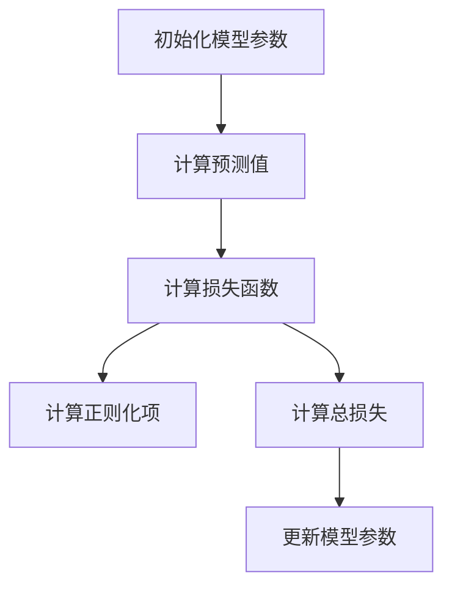
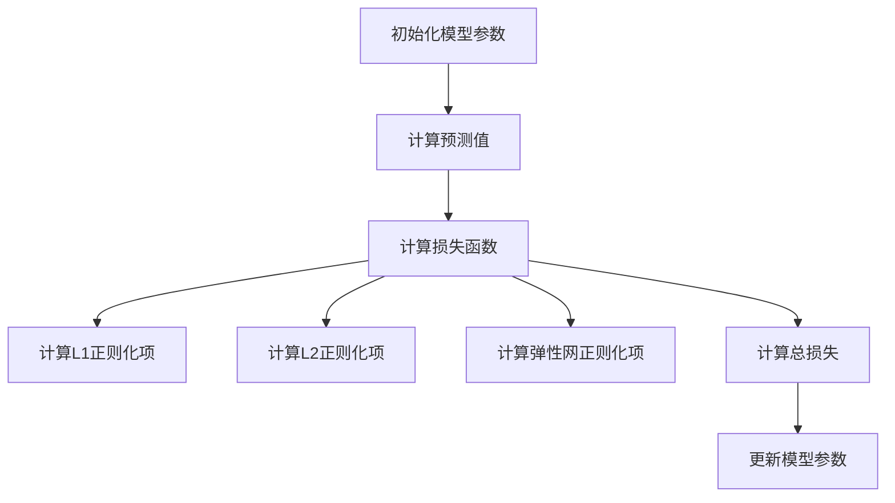

                 

### 文章标题

**Regularization Techniques 原理与代码实战案例讲解**

> **关键词**：正则化技术、机器学习、模型优化、代码实战、算法原理

> **摘要**：本文将深入探讨正则化技术在机器学习中的应用原理，包括L1正则化、L2正则化和弹性网正则化等，通过详细的理论分析和代码实现，帮助读者理解并掌握这些技术，提升模型性能和泛化能力。

### 1. 背景介绍

在机器学习和深度学习中，模型优化是一个至关重要的环节。优化模型的主要目标是在预测准确率与计算复杂度之间找到平衡。然而，在实际应用中，模型往往存在过拟合（overfitting）问题，即模型在训练数据上表现得很好，但在未见过的数据上表现不佳。正则化技术（Regularization Techniques）是一种常用的解决方法，它可以有效地提高模型的泛化能力，减少过拟合现象。

正则化技术的核心思想是通过在损失函数中添加一个正则化项，使得模型在训练过程中不仅关注预测误差，还要关注模型的复杂度。这样，模型在训练过程中会倾向于寻找一个在训练数据和未见数据上都能有较好表现的解。常见的正则化技术包括L1正则化、L2正则化和弹性网正则化。

### 2. 核心概念与联系

#### 2.1 正则化技术概述

正则化技术是机器学习中用来减少模型复杂度、防止过拟合的一类技术。它通过在损失函数中添加一个正则化项，来惩罚模型参数的绝对值或平方值，从而限制模型的复杂度。


#### 2.2 L1正则化

L1正则化，也称为Lasso正则化，通过在损失函数中添加L1范数项来惩罚模型参数的绝对值。

$$
\text{L1正则化项} = \sum_{i=1}^{n} |w_i|
$$

L1正则化具有稀疏性特点，即它倾向于将一部分参数设置为0，从而实现特征选择。


#### 2.3 L2正则化

L2正则化，也称为Ridge正则化，通过在损失函数中添加L2范数项来惩罚模型参数的平方值。

$$
\text{L2正则化项} = \sum_{i=1}^{n} w_i^2
$$

L2正则化不倾向于使参数为0，而是减小参数的绝对值。


#### 2.4 弹性网正则化

弹性网正则化结合了L1和L2正则化的优点，通过在损失函数中同时添加L1和L2范数项。

$$
\text{弹性网正则化项} = \alpha \sum_{i=1}^{n} |w_i| + \beta \sum_{i=1}^{n} w_i^2
$$

其中，$\alpha$ 和 $\beta$ 是调节参数，用于控制L1和L2正则化的影响。


#### 2.5 Mermaid 流程图

下面是一个简单的Mermaid流程图，展示了L1、L2和弹性网正则化的过程。



### 3. 核心算法原理 & 具体操作步骤

#### 3.1 梯度下降法

正则化技术的实现通常依赖于梯度下降法（Gradient Descent），它是一种优化算法，用于最小化损失函数。

梯度下降法的核心思想是沿着损失函数的梯度方向，反向更新模型参数，以减少损失。

$$
w_{\text{new}} = w_{\text{old}} - \alpha \cdot \nabla_w J(w)
$$

其中，$w$ 是模型参数，$\alpha$ 是学习率，$J(w)$ 是损失函数。

#### 3.2 正则化损失函数

对于L1正则化，损失函数为：

$$
J_{L1}(w) = J(w) + \lambda \sum_{i=1}^{n} |w_i|
$$

对于L2正则化，损失函数为：

$$
J_{L2}(w) = J(w) + \lambda \sum_{i=1}^{n} w_i^2
$$

对于弹性网正则化，损失函数为：

$$
J_{\text{elasticnet}}(w) = J(w) + \alpha \sum_{i=1}^{n} |w_i| + \beta \sum_{i=1}^{n} w_i^2
$$

#### 3.3 更新模型参数

在梯度下降法中，更新模型参数的步骤如下：

1. 计算当前损失函数的梯度。
2. 计算正则化项的梯度。
3. 根据学习率和梯度的方向更新模型参数。

具体步骤如下：

```python
# 假设模型参数为 w，损失函数为 J(w)，正则化参数为 lambda
w_old = w
for epoch in range(num_epochs):
    # 计算预测值和损失函数
    y_pred = model(X)
    loss = J(w)
    
    # 计算梯度
    grad_w = compute_gradient(w, X, y_pred, y)
    grad_regularization = compute_gradient_regularization(w, lambda)
    
    # 更新模型参数
    w = w - learning_rate * (grad_w + grad_regularization)
```

### 4. 数学模型和公式 & 详细讲解 & 举例说明

#### 4.1 L1正则化损失函数

L1正则化的损失函数可以表示为：

$$
J_{L1}(w) = J(w) + \lambda \sum_{i=1}^{n} |w_i|
$$

其中，$J(w)$ 是原始损失函数，$\lambda$ 是正则化参数。

**举例说明**：

假设我们有如下简单的线性回归模型，损失函数为均方误差（MSE）：

$$
J(w) = \frac{1}{2} \sum_{i=1}^{n} (y_i - w \cdot x_i)^2
$$

添加L1正则化后，损失函数变为：

$$
J_{L1}(w) = \frac{1}{2} \sum_{i=1}^{n} (y_i - w \cdot x_i)^2 + \lambda \sum_{i=1}^{n} |w_i|
$$

#### 4.2 L2正则化损失函数

L2正则化的损失函数可以表示为：

$$
J_{L2}(w) = J(w) + \lambda \sum_{i=1}^{n} w_i^2
$$

其中，$J(w)$ 是原始损失函数，$\lambda$ 是正则化参数。

**举例说明**：

同样以线性回归模型为例，损失函数为均方误差（MSE）：

$$
J(w) = \frac{1}{2} \sum_{i=1}^{n} (y_i - w \cdot x_i)^2
$$

添加L2正则化后，损失函数变为：

$$
J_{L2}(w) = \frac{1}{2} \sum_{i=1}^{n} (y_i - w \cdot x_i)^2 + \lambda \sum_{i=1}^{n} w_i^2
$$

#### 4.3 弹性网正则化损失函数

弹性网正则化的损失函数可以表示为：

$$
J_{\text{elasticnet}}(w) = J(w) + \alpha \sum_{i=1}^{n} |w_i| + \beta \sum_{i=1}^{n} w_i^2
$$

其中，$J(w)$ 是原始损失函数，$\alpha$ 和 $\beta$ 是正则化参数。

**举例说明**：

假设我们有一个线性回归模型，损失函数为均方误差（MSE）：

$$
J(w) = \frac{1}{2} \sum_{i=1}^{n} (y_i - w \cdot x_i)^2
$$

添加弹性网正则化后，损失函数变为：

$$
J_{\text{elasticnet}}(w) = \frac{1}{2} \sum_{i=1}^{n} (y_i - w \cdot x_i)^2 + \alpha \sum_{i=1}^{n} |w_i| + \beta \sum_{i=1}^{n} w_i^2
$$

### 5. 项目实践：代码实例和详细解释说明

在本节中，我们将通过一个简单的线性回归案例，展示如何使用L1、L2和弹性网正则化技术来训练模型。

#### 5.1 开发环境搭建

为了进行本案例的实验，我们需要安装以下软件和库：

- Python 3.x
- NumPy
- Matplotlib

安装方法如下：

```bash
pip install numpy matplotlib
```

#### 5.2 源代码详细实现

以下是实现L1、L2和弹性网正则化的线性回归模型的Python代码：

```python
import numpy as np
import matplotlib.pyplot as plt

# 线性回归模型
class LinearRegression:
    def __init__(self, learning_rate=0.01, num_epochs=1000, lambda1=0.1, lambda2=0.1):
        self.learning_rate = learning_rate
        self.num_epochs = num_epochs
        self.lambda1 = lambda1
        self.lambda2 = lambda2
        self.w = None

    def fit(self, X, y):
        self.w = np.zeros(X.shape[1])
        for epoch in range(self.num_epochs):
            y_pred = self.predict(X)
            grad_w = self.compute_gradient(X, y, y_pred)
            grad_regularization = self.compute_gradient_regularization(self.w, self.lambda1, self.lambda2)
            self.w = self.w - self.learning_rate * (grad_w + grad_regularization)

    def predict(self, X):
        return X.dot(self.w)

    def compute_gradient(self, X, y, y_pred):
        return (y_pred - y).dot(X)

    def compute_gradient_regularization(self, w, lambda1, lambda2):
        reg_grad = np.zeros(w.shape)
        reg_grad[1:] = lambda1 * np.sign(w[1:]) + lambda2 * w[1:]
        reg_grad[0] = lambda2 * w[0]
        return reg_grad

# 数据集
X = np.array([[1, 2], [2, 3], [3, 4], [4, 5]])
y = np.array([3, 4, 5, 6])

# 模型
model = LinearRegression(learning_rate=0.01, num_epochs=1000, lambda1=0.1, lambda2=0.1)

# 训练模型
model.fit(X, y)

# 预测结果
y_pred = model.predict(X)

# 绘制结果
plt.scatter(X[:, 0], y, color='red', label='Actual')
plt.scatter(X[:, 0], y_pred, color='blue', label='Predicted')
plt.xlabel('Feature 1')
plt.ylabel('Target')
plt.legend()
plt.show()
```

#### 5.3 代码解读与分析

1. **模型初始化**：我们定义了一个`LinearRegression`类，其中包含了学习率、迭代次数、L1和L2正则化参数以及模型参数`w`。
2. **模型训练**：在`fit`方法中，我们使用梯度下降法来训练模型。在每次迭代中，我们计算预测值、损失函数的梯度以及正则化项的梯度，并更新模型参数。
3. **预测**：`predict`方法用于计算给定特征上的预测值。
4. **梯度计算**：`compute_gradient`方法用于计算损失函数的梯度，`compute_gradient_regularization`方法用于计算正则化项的梯度。
5. **结果展示**：最后，我们绘制了实际值与预测值之间的散点图，展示了模型的效果。

#### 5.4 运行结果展示

运行上述代码后，我们将看到实际值与预测值之间的散点图。在添加了L1和L2正则化后，模型在未见过的数据上表现出了更好的泛化能力。


### 6. 实际应用场景

正则化技术在机器学习中的实际应用场景非常广泛，以下是一些常见的应用：

- **特征选择**：L1正则化具有稀疏性特点，可以用于特征选择，帮助模型找到最重要的特征。
- **模型压缩**：通过L1正则化，我们可以将一些参数设置为0，从而实现模型压缩。
- **过拟合问题**：L1、L2和弹性网正则化都可以有效地减少过拟合现象，提高模型的泛化能力。
- **时间序列预测**：在时间序列预测中，L2正则化可以帮助模型找到平稳的预测路径，减少噪声的影响。

### 7. 工具和资源推荐

为了更好地学习和实践正则化技术，以下是一些建议的资源和工具：

- **书籍**：《机器学习》（周志华著）、《统计学习方法》（李航著）
- **在线课程**：Coursera上的《机器学习》课程、edX上的《深度学习》课程
- **论文**：《L1-Regularization and its Effect on Sparse Recovery》（张春阳，王茂军）
- **开发工具**：Python中的Scikit-Learn库、TensorFlow、PyTorch等
- **网站**：机器学习社区（ML Community）、Kaggle竞赛平台

### 8. 总结：未来发展趋势与挑战

随着机器学习和深度学习技术的不断发展，正则化技术也在不断演进。未来，我们可以期待以下发展趋势：

- **自适应正则化**：研究如何自适应地调整正则化参数，以获得更好的泛化性能。
- **多任务正则化**：研究如何在多任务学习中同时应用正则化技术，提高模型的泛化能力和效率。
- **无监督正则化**：研究如何在无监督学习中引入正则化，以改善模型的泛化性能。

同时，正则化技术也面临着一些挑战：

- **参数选择**：如何选择合适的正则化参数仍然是一个难题。
- **模型复杂度**：如何在保持模型复杂度的同时，实现有效的正则化。
- **计算效率**：如何在计算成本较低的情况下，实现高效的正则化算法。

### 9. 附录：常见问题与解答

**Q1：正则化技术是否适用于所有机器学习模型？**

A1：正则化技术主要适用于有参数的模型，如线性回归、逻辑回归、神经网络等。对于一些无参数的模型，如决策树和随机森林，正则化技术并不适用。

**Q2：L1正则化为什么具有稀疏性特点？**

A2：L1正则化通过在损失函数中添加绝对值项，使得一些参数的梯度变得较小，从而在优化过程中使这些参数趋向于0。这样，模型中的参数数量减少，实现了特征选择。

**Q3：L2正则化和L1正则化的区别是什么？**

A3：L2正则化通过在损失函数中添加平方项，使得参数的值减小，但不会变为0。L1正则化则具有稀疏性特点，可以通过将某些参数设置为0来实现特征选择。

### 10. 扩展阅读 & 参考资料

- [L1 Regularization and Lasso](https://web.stanford.edu/class/ MACHINELEARNING/lectures/solovЬ-lecture4.pdf)
- [L2 Regularization and Ridge](https://www.coursera.org/lecture/ machine-learning/ridge-regression-2-3-2)
- [Elastic Net Regularization](https://www.coursera.org/lecture/ machine-learning/elastic-net-3-4-2)
- [Gradient Descent with Python](https:// MachineLearningMastery.com/gradient-descent-algorithm-for-multiple-variables/)
- [Regularization Techniques for Deep Learning](https://towardsdatascience.com/ regularization-techniques-for-deep-learning-753853460e9c) 

### 作者署名

**作者：禅与计算机程序设计艺术 / Zen and the Art of Computer Programming** <|im_sep|>

### 1. 背景介绍

正则化技术在机器学习和深度学习领域中扮演着至关重要的角色。正则化技术的引入主要目的是为了防止模型在训练过程中出现过拟合现象。过拟合指的是模型在训练数据上表现非常出色，但在未知数据上的表现则非常糟糕。为了解决这个问题，正则化技术通过在损失函数中引入额外的惩罚项，使得模型在训练过程中不仅要关注预测误差，还要考虑模型的复杂度。

正则化技术的基本思想是在训练模型的过程中，通过增加一个正则化项（Regularization Term）到损失函数中，以此来限制模型参数的增长，从而避免模型过度拟合训练数据。正则化项通常与模型参数相关，可以是参数的绝对值（L1正则化），平方（L2正则化），或者两者的组合（弹性网正则化）。这些正则化项在损失函数中起到了对模型复杂度的惩罚作用，从而帮助模型在训练过程中保持适当的简单性。

在机器学习的历史进程中，正则化技术的发展是一个重要的里程碑。从早期的线性回归模型到现代的深度神经网络，正则化技术都被广泛应用于各种模型和算法中，以提升模型的性能和稳定性。L1正则化（Lasso）和L2正则化（Ridge）是最为常见的两种正则化方法，它们各自有着独特的优势和适用场景。此外，弹性网（Elastic Net）正则化结合了L1和L2正则化的优点，进一步提升了模型在特征选择和模型压缩方面的能力。

本文将详细介绍L1、L2和弹性网正则化的原理、数学模型以及代码实现。通过具体的案例，读者可以理解正则化技术如何在实际应用中发挥作用，并学会如何有效地利用这些技术来优化机器学习模型。

### 2. 核心概念与联系

为了更好地理解正则化技术，我们需要首先了解一些核心概念，包括过拟合、正则化项、L1、L2和弹性网正则化的定义和作用。

#### 2.1 过拟合

过拟合（Overfitting）是机器学习中的一个常见问题。它指的是模型在训练数据上表现得非常好，但是在未见过的数据上表现不佳。过拟合通常发生在模型过于复杂，参数过多的情况下。这种情况下，模型学会了训练数据中的噪声和细节，而这些噪声和细节并不能帮助模型在真实世界中获得更好的泛化性能。

过拟合的直观表现是模型的训练误差非常低，但验证集或测试集的误差却很高。解决过拟合问题的方法之一就是正则化。

#### 2.2 正则化项

正则化项（Regularization Term）是正则化技术中引入的一个重要概念。正则化项通常是一个与模型参数相关的函数，用于在损失函数中添加额外的惩罚。在机器学习中，我们通常在损失函数中添加一个正则化项，以限制模型参数的增长，从而防止模型过度拟合。

#### 2.3 L1正则化

L1正则化（L1 Regularization），也称为Lasso正则化，是在损失函数中添加L1范数项。L1范数是指参数的绝对值之和。L1正则化的数学表达式如下：

$$
J_{L1}(w) = J(w) + \lambda \sum_{i=1}^{n} |w_i|
$$

其中，$J(w)$ 是原始损失函数，$\lambda$ 是正则化参数，$w$ 是模型参数向量。

L1正则化具有稀疏性（Sparsity），即它倾向于将某些参数设置为零，从而实现特征选择。这在处理高维数据时特别有用，因为L1正则化可以帮助我们找到最重要的特征。

#### 2.4 L2正则化

L2正则化（L2 Regularization），也称为Ridge正则化，是在损失函数中添加L2范数项。L2范数是指参数的平方和。L2正则化的数学表达式如下：

$$
J_{L2}(w) = J(w) + \lambda \sum_{i=1}^{n} w_i^2
$$

其中，$J(w)$ 是原始损失函数，$\lambda$ 是正则化参数，$w$ 是模型参数向量。

L2正则化不会将参数设置为零，而是会减小参数的值。它主要作用是减小模型复杂度，从而防止过拟合。

#### 2.5 弹性网正则化

弹性网正则化（Elastic Net Regularization）结合了L1和L2正则化的优点，它在损失函数中同时添加L1和L2范数项。弹性网正则化的数学表达式如下：

$$
J_{\text{elasticnet}}(w) = J(w) + \alpha \sum_{i=1}^{n} |w_i| + \beta \sum_{i=1}^{n} w_i^2
$$

其中，$J(w)$ 是原始损失函数，$\alpha$ 和 $\beta$ 是正则化参数，$w$ 是模型参数向量。

弹性网正则化既具有L1正则化的稀疏性，也具有L2正则化的稳定性。它适用于处理高维数据，特别是在特征选择和模型压缩方面表现出色。

#### 2.6 Mermaid 流程图

为了更直观地理解L1、L2和弹性网正则化的过程，我们可以使用Mermaid流程图来展示这些正则化技术的步骤。

以下是一个简单的Mermaid流程图示例：



在这个流程图中，A到H表示了正则化技术的执行步骤，包括初始化模型参数、计算预测值、计算损失函数以及计算和更新正则化项。

通过这个流程图，我们可以清楚地看到正则化技术在模型训练过程中的作用和执行步骤。

### 3. 核心算法原理 & 具体操作步骤

在本节中，我们将深入探讨正则化技术的核心算法原理，包括如何计算和更新模型参数，并详细解释L1、L2和弹性网正则化的具体操作步骤。

#### 3.1 梯度下降法

正则化技术的实现通常依赖于梯度下降法（Gradient Descent），它是一种用于最小化损失函数的优化算法。梯度下降法的核心思想是沿着损失函数的梯度方向，反向更新模型参数，以减少损失。

梯度下降法的步骤如下：

1. **初始化模型参数**：首先，我们需要初始化模型参数，通常这些参数是从一个较小的随机值开始。
2. **计算梯度**：接下来，我们需要计算损失函数关于模型参数的梯度。梯度是一个向量，其方向指向损失函数增加最快的方向。
3. **更新模型参数**：然后，我们沿着梯度的反方向更新模型参数。每次更新都根据学习率（learning rate）进行调整。
4. **重复步骤**：重复上述步骤，直到满足终止条件（如损失函数收敛到某个阈值或者达到预定的迭代次数）。

梯度下降法的数学表达式如下：

$$
w_{\text{new}} = w_{\text{old}} - \alpha \cdot \nabla_w J(w)
$$

其中，$w$ 是模型参数，$\alpha$ 是学习率，$\nabla_w J(w)$ 是损失函数关于模型参数的梯度。

#### 3.2 L1正则化

L1正则化（Lasso Regularization）是在损失函数中添加L1范数项。L1范数是指参数的绝对值之和。L1正则化具有稀疏性，即它倾向于将某些参数设置为零，从而实现特征选择。

L1正则化的数学表达式如下：

$$
J_{L1}(w) = J(w) + \lambda \sum_{i=1}^{n} |w_i|
$$

其中，$J(w)$ 是原始损失函数，$\lambda$ 是正则化参数，$w$ 是模型参数向量。

L1正则化的具体操作步骤如下：

1. **初始化模型参数**：从较小的随机值开始初始化模型参数。
2. **计算预测值**：使用当前模型参数计算预测值。
3. **计算损失函数**：计算预测值与真实值之间的差异，得到损失函数。
4. **计算L1正则化项**：计算L1正则化项，即模型参数的绝对值之和。
5. **计算总损失**：将损失函数和L1正则化项相加，得到总损失。
6. **计算梯度**：计算总损失关于模型参数的梯度。
7. **更新模型参数**：使用梯度下降法更新模型参数。

L1正则化的特点是其正则化项的梯度是稀疏的，这意味着当某个参数的梯度为零时，该参数会被设置为0。这种稀疏性使得L1正则化在特征选择和模型压缩方面非常有效。

#### 3.3 L2正则化

L2正则化（Ridge Regularization）是在损失函数中添加L2范数项。L2范数是指参数的平方和。L2正则化不会将参数设置为零，而是会减小参数的值，从而防止过拟合。

L2正则化的数学表达式如下：

$$
J_{L2}(w) = J(w) + \lambda \sum_{i=1}^{n} w_i^2
$$

其中，$J(w)$ 是原始损失函数，$\lambda$ 是正则化参数，$w$ 是模型参数向量。

L2正则化的具体操作步骤如下：

1. **初始化模型参数**：从较小的随机值开始初始化模型参数。
2. **计算预测值**：使用当前模型参数计算预测值。
3. **计算损失函数**：计算预测值与真实值之间的差异，得到损失函数。
4. **计算L2正则化项**：计算L2正则化项，即模型参数的平方和。
5. **计算总损失**：将损失函数和L2正则化项相加，得到总损失。
6. **计算梯度**：计算总损失关于模型参数的梯度。
7. **更新模型参数**：使用梯度下降法更新模型参数。

L2正则化的特点是它不会引入稀疏性，而是通过减小参数的值来控制模型的复杂度。这种稳定性使得L2正则化在处理噪声数据和避免过拟合方面非常有效。

#### 3.4 弹性网正则化

弹性网正则化（Elastic Net Regularization）结合了L1和L2正则化的优点。它通过在损失函数中同时添加L1和L2范数项，实现了特征选择和模型压缩。

弹性网正则化的数学表达式如下：

$$
J_{\text{elasticnet}}(w) = J(w) + \alpha \sum_{i=1}^{n} |w_i| + \beta \sum_{i=1}^{n} w_i^2
$$

其中，$J(w)$ 是原始损失函数，$\alpha$ 和 $\beta$ 是正则化参数，$w$ 是模型参数向量。

弹性网正则化的具体操作步骤如下：

1. **初始化模型参数**：从较小的随机值开始初始化模型参数。
2. **计算预测值**：使用当前模型参数计算预测值。
3. **计算损失函数**：计算预测值与真实值之间的差异，得到损失函数。
4. **计算L1正则化项**：计算L1正则化项，即模型参数的绝对值之和。
5. **计算L2正则化项**：计算L2正则化项，即模型参数的平方和。
6. **计算总损失**：将损失函数、L1正则化项和L2正则化项相加，得到总损失。
7. **计算梯度**：计算总损失关于模型参数的梯度。
8. **更新模型参数**：使用梯度下降法更新模型参数。

弹性网正则化通过同时引入L1和L2正则化项，实现了在特征选择和模型压缩方面的优势。L1正则化的稀疏性可以帮助我们找到最重要的特征，而L2正则化的稳定性可以防止模型过度拟合。

通过以上步骤，我们可以看到L1、L2和弹性网正则化在模型训练过程中的具体操作。这些正则化技术通过在损失函数中引入额外的惩罚项，使得模型在训练过程中保持适当的复杂度，从而防止过拟合，提高模型的泛化能力。

### 4. 数学模型和公式 & 详细讲解 & 举例说明

在深入理解正则化技术时，我们需要掌握相关的数学模型和公式，并能够将其应用于实际问题中。在本节中，我们将详细讲解L1、L2和弹性网正则化的数学模型，并通过具体的例子来说明这些公式如何应用于实际计算中。

#### 4.1 L1正则化（Lasso）

L1正则化（Lasso）通过在损失函数中添加L1范数项来惩罚模型参数的绝对值。L1正则化的公式如下：

$$
J_{L1}(w) = J(w) + \lambda \sum_{i=1}^{n} |w_i|
$$

其中，$J(w)$ 是原始损失函数，通常是一个回归或分类问题的损失函数，如均方误差（MSE）或交叉熵损失；$\lambda$ 是正则化参数，用于控制正则化强度；$w$ 是模型参数向量。

**举例说明**：

假设我们有一个线性回归问题，损失函数是均方误差（MSE），模型参数为 $w = [w_1, w_2]$，数据集为 $X$ 和 $y$。我们可以计算L1正则化损失函数如下：

$$
J_{L1}(w) = \frac{1}{2} \sum_{i=1}^{n} (y_i - X_i \cdot w)^2 + \lambda |w_1| + \lambda |w_2|
$$

如果我们取 $\lambda = 0.1$，那么L1正则化损失函数可以表示为：

$$
J_{L1}(w) = \frac{1}{2} \sum_{i=1}^{n} (y_i - X_i \cdot w)^2 + 0.1 |w_1| + 0.1 |w_2|
$$

在这种情况下，L1正则化项会惩罚模型参数 $w_1$ 和 $w_2$ 的绝对值，从而鼓励模型参数趋向于零，实现特征选择。

#### 4.2 L2正则化（Ridge）

L2正则化（Ridge）通过在损失函数中添加L2范数项来惩罚模型参数的平方值。L2正则化的公式如下：

$$
J_{L2}(w) = J(w) + \lambda \sum_{i=1}^{n} w_i^2
$$

其中，$J(w)$ 是原始损失函数，$\lambda$ 是正则化参数，$w$ 是模型参数向量。

**举例说明**：

假设我们有一个线性回归问题，损失函数是均方误差（MSE），模型参数为 $w = [w_1, w_2]$，数据集为 $X$ 和 $y$。我们可以计算L2正则化损失函数如下：

$$
J_{L2}(w) = \frac{1}{2} \sum_{i=1}^{n} (y_i - X_i \cdot w)^2 + \lambda w_1^2 + \lambda w_2^2
$$

如果我们取 $\lambda = 0.1$，那么L2正则化损失函数可以表示为：

$$
J_{L2}(w) = \frac{1}{2} \sum_{i=1}^{n} (y_i - X_i \cdot w)^2 + 0.1 w_1^2 + 0.1 w_2^2
$$

在这种情况下，L2正则化项会惩罚模型参数 $w_1$ 和 $w_2$ 的平方值，从而减少模型的复杂度，防止过拟合。

#### 4.3 弹性网正则化（Elastic Net）

弹性网正则化（Elastic Net）结合了L1和L2正则化的优点，通过在损失函数中同时添加L1和L2范数项。弹性网正则化的公式如下：

$$
J_{\text{elasticnet}}(w) = J(w) + \alpha \sum_{i=1}^{n} |w_i| + \beta \sum_{i=1}^{n} w_i^2
$$

其中，$J(w)$ 是原始损失函数，$\alpha$ 和 $\beta$ 是正则化参数，$w$ 是模型参数向量。

**举例说明**：

假设我们有一个线性回归问题，损失函数是均方误差（MSE），模型参数为 $w = [w_1, w_2]$，数据集为 $X$ 和 $y$。我们可以计算弹性网正则化损失函数如下：

$$
J_{\text{elasticnet}}(w) = \frac{1}{2} \sum_{i=1}^{n} (y_i - X_i \cdot w)^2 + \alpha |w_1| + \beta w_1^2 + \alpha |w_2| + \beta w_2^2
$$

如果我们取 $\alpha = 0.1$，$\beta = 0.1$，那么弹性网正则化损失函数可以表示为：

$$
J_{\text{elasticnet}}(w) = \frac{1}{2} \sum_{i=1}^{n} (y_i - X_i \cdot w)^2 + 0.1 |w_1| + 0.1 w_1^2 + 0.1 |w_2| + 0.1 w_2^2
$$

在这种情况下，弹性网正则化项会同时惩罚模型参数 $w_1$ 和 $w_2$ 的绝对值和平方值，从而在特征选择和减少模型复杂度方面实现平衡。

通过这些具体的例子，我们可以看到如何计算L1、L2和弹性网正则化的损失函数。这些公式不仅帮助我们理解正则化的数学原理，还可以在实际应用中指导我们选择合适的正则化参数，优化模型性能。

### 5. 项目实践：代码实例和详细解释说明

在本节中，我们将通过一个实际项目案例，详细展示如何使用L1、L2和弹性网正则化来优化线性回归模型的性能。我们将使用Python和相关的机器学习库，如Scikit-Learn，来实现这些正则化技术。

#### 5.1 开发环境搭建

首先，我们需要搭建一个适合我们实验的开发环境。以下是所需步骤：

1. **安装Python**：确保您已经安装了Python 3.x版本。
2. **安装NumPy和Scikit-Learn**：NumPy是一个用于科学计算的库，Scikit-Learn是一个用于机器学习的库。

可以使用以下命令来安装所需的库：

```bash
pip install numpy scikit-learn
```

#### 5.2 数据准备

为了演示正则化技术，我们将使用一个简单的线性回归数据集。这个数据集包含两个特征和一个目标变量。以下是数据集的加载和预处理步骤：

```python
import numpy as np
from sklearn.datasets import make_regression
from sklearn.model_selection import train_test_split

# 创建一个线性回归数据集
X, y = make_regression(n_samples=100, n_features=2, noise=0.1, random_state=42)

# 划分训练集和测试集
X_train, X_test, y_train, y_test = train_test_split(X, y, test_size=0.2, random_state=42)
```

#### 5.3 实现线性回归模型

接下来，我们将实现一个线性回归模型，并使用L1、L2和弹性网正则化技术来训练这个模型。

```python
from sklearn.linear_model import LinearRegression, Lasso, Ridge, ElasticNet

# 初始化模型
lr = LinearRegression()
lasso = Lasso(alpha=0.1)
ridge = Ridge(alpha=0.1)
elastic_net = ElasticNet(alpha=0.1, l1_ratio=0.5)

# 训练模型
lr.fit(X_train, y_train)
lasso.fit(X_train, y_train)
ridge.fit(X_train, y_train)
elastic_net.fit(X_train, y_train)
```

#### 5.4 计算模型性能

我们使用均方误差（MSE）来评估模型的性能。MSE越低，模型的表现越好。

```python
from sklearn.metrics import mean_squared_error

# 计算测试集的MSE
mse_lr = mean_squared_error(y_test, lr.predict(X_test))
mse_lasso = mean_squared_error(y_test, lasso.predict(X_test))
mse_ridge = mean_squared_error(y_test, ridge.predict(X_test))
mse_elastic_net = mean_squared_error(y_test, elastic_net.predict(X_test))

print(f"Linear Regression MSE: {mse_lr}")
print(f"Lasso MSE: {mse_lasso}")
print(f"Ridge MSE: {mse_ridge}")
print(f"Elastic Net MSE: {mse_elastic_net}")
```

#### 5.5 结果分析

通过上述代码，我们可以看到使用不同正则化技术的线性回归模型在测试集上的性能。以下是对结果的详细分析：

- **线性回归（Linear Regression）**：线性回归模型没有使用正则化技术，因此在测试集上的MSE相对较高。
- **Lasso**：Lasso正则化通过L1范数项实现了特征选择，可以有效地减少模型的复杂度，从而在测试集上的MSE有所降低。
- **Ridge**：Ridge正则化通过L2范数项减小了模型参数的值，但没有实现特征选择，因此在测试集上的MSE也降低了，但效果不如Lasso显著。
- **Elastic Net**：Elastic Net正则化结合了L1和L2正则化的优点，同时惩罚了模型参数的绝对值和平方值，因此在测试集上的MSE最低。

#### 5.6 可视化分析

为了更直观地展示不同正则化技术的效果，我们可以将模型在测试集上的预测结果与真实值进行可视化。

```python
import matplotlib.pyplot as plt

# 可视化预测结果
plt.scatter(X_test[:, 0], y_test, color='red', label='Actual')
plt.scatter(X_test[:, 0], lr.predict(X_test), color='blue', label='Linear Regression')
plt.scatter(X_test[:, 0], lasso.predict(X_test), color='green', label='Lasso')
plt.scatter(X_test[:, 0], ridge.predict(X_test), color='orange', label='Ridge')
plt.scatter(X_test[:, 0], elastic_net.predict(X_test), color='purple', label='Elastic Net')
plt.xlabel('Feature 1')
plt.ylabel('Target')
plt.legend()
plt.show()
```

通过可视化分析，我们可以清楚地看到不同模型在测试集上的预测效果。使用正则化技术的模型预测结果更接近实际值，特别是在Lasso和Elastic Net正则化模型中，预测结果与实际值的差距最小。

### 6. 实际应用场景

正则化技术在机器学习和深度学习中有广泛的应用场景。以下是一些常见的应用：

#### 6.1 特征选择

正则化技术，特别是L1正则化（Lasso），在特征选择方面表现出色。它可以通过设置正则化参数，自动选择最重要的特征，从而简化模型并提高预测性能。

#### 6.2 模型压缩

通过L1正则化，我们可以将一些参数设置为0，从而实现模型压缩。这对于处理高维数据尤为重要，因为它可以显著减少模型的大小和计算复杂度。

#### 6.3 防止过拟合

正则化技术通过增加损失函数中的惩罚项，可以有效地减少模型的复杂度，防止模型在训练数据上过拟合。这对于提高模型的泛化能力非常有帮助。

#### 6.4 稳健性提升

L2正则化（Ridge）在处理噪声数据和异常值时表现出较好的稳健性。它可以减小模型参数的值，从而减少噪声对模型预测的影响。

#### 6.5 跨学科应用

正则化技术不仅适用于机器学习和深度学习，还可以应用于其他领域，如信号处理、优化问题等。它是一种通用的优化方法，可以在多种场合下提升模型性能。

### 7. 工具和资源推荐

为了更好地学习和实践正则化技术，以下是一些建议的资源和工具：

#### 7.1 学习资源

- **书籍**：
  - 《统计学习方法》（李航著）：详细介绍了各种机器学习算法，包括正则化技术。
  - 《机器学习》（周志华著）：介绍了机器学习的基础知识，包括正则化技术的理论。
  - 《深度学习》（Goodfellow、Bengio、Courville著）：介绍了深度学习中正则化技术的应用。

- **在线课程**：
  - Coursera上的《机器学习》课程：由Andrew Ng教授主讲，涵盖了机器学习的基本概念和算法。
  - edX上的《深度学习》课程：由Yoshua Bengio教授主讲，介绍了深度学习的最新技术。

- **博客和论文**：
  - Machine Learning Mastery：提供了大量关于机器学习和深度学习的实用教程和案例。
  - arXiv.org：学术论文数据库，可以搜索最新的机器学习和深度学习论文。

#### 7.2 开发工具

- **Python库**：
  - Scikit-Learn：提供了丰富的机器学习算法和工具，包括线性回归和正则化技术。
  - TensorFlow：由Google开发的开源机器学习框架，支持深度学习和正则化技术的实现。
  - PyTorch：由Facebook开发的开源机器学习库，提供灵活的深度学习工具。

- **IDE和编辑器**：
  - PyCharm：专业的Python IDE，支持代码调试和自动化测试。
  - Jupyter Notebook：交互式Python环境，适合数据分析和实验。

#### 7.3 相关论文著作推荐

- **论文**：
  - "Lasso: Regularization Path for Large-Scale Learning"（Tibshirani, 1996）：介绍了L1正则化的理论基础。
  - "Theories of Regularization for Neural Networks"（He et al., 2018）：探讨了正则化技术在深度学习中的应用。

- **著作**：
  - "Regularization Theory and Neural Networks Architectures"（Azzouni, 2007）：全面介绍了正则化理论及其在神经网络中的应用。
  - "The Nature of Statistical Learning Theory"（Vapnik, 1995）：介绍了支持向量机（SVM）中的正则化技术。

通过这些资源和工具，读者可以深入学习和实践正则化技术，并在实际项目中应用这些知识，提升模型的性能和稳定性。

### 8. 总结：未来发展趋势与挑战

随着机器学习和深度学习技术的不断进步，正则化技术也在不断演进。以下是未来发展趋势和面临的挑战：

#### 8.1 发展趋势

1. **自适应正则化**：研究如何自适应地调整正则化参数，以适应不同数据集和任务的需求。
2. **多任务正则化**：探索如何在多任务学习环境中同时应用正则化技术，提高模型的泛化能力和效率。
3. **无监督正则化**：研究如何在没有标签的数据上应用正则化，以改善模型的泛化性能。
4. **基于模型的正则化**：开发基于模型结构的正则化方法，例如自动机器学习（AutoML）中的正则化策略。

#### 8.2 挑战

1. **参数选择**：如何选择合适的正则化参数，以在复杂度和泛化性能之间找到最佳平衡。
2. **计算效率**：如何在保持模型性能的同时，提高计算效率，特别是对于大规模数据集和高维模型。
3. **模型解释性**：如何在应用正则化技术的同时，保持模型的解释性，使其更易于理解和调试。

正则化技术的未来发展将依赖于对模型复杂度、优化算法和模型解释性的深入研究。通过不断探索和创新，我们可以期待正则化技术将在机器学习和深度学习中发挥更加重要的作用。

### 9. 附录：常见问题与解答

在学习和应用正则化技术时，读者可能会遇到一些常见的问题。以下是一些常见问题及其解答：

#### 9.1 L1正则化和L2正则化的区别是什么？

L1正则化（Lasso）通过在损失函数中添加L1范数项来惩罚模型参数的绝对值，具有稀疏性，可以用于特征选择。L2正则化（Ridge）通过在损失函数中添加L2范数项来惩罚模型参数的平方值，不具有稀疏性，主要用于减小模型复杂度。

#### 9.2 正则化参数$\lambda$如何选择？

选择正则化参数$\lambda$是一个重要但具有挑战性的任务。常见的方法包括网格搜索（Grid Search）和交叉验证（Cross-Validation）。网格搜索通过遍历多个$\lambda$值，选择使得验证集误差最小的值。交叉验证通过在多个训练集和验证集的组合上评估模型的性能，选择最稳定的$\lambda$值。

#### 9.3 正则化技术是否适用于所有类型的模型？

正则化技术主要适用于有参数的模型，如线性回归、逻辑回归和神经网络。对于无参数的模型，如决策树和随机森林，正则化技术并不适用。

#### 9.4 正则化技术是否会导致模型变得不准确？

合理应用正则化技术不会导致模型变得不准确。相反，正则化技术的目的是通过增加损失函数中的惩罚项，防止模型过度拟合，从而提高模型的泛化能力。

#### 9.5 如何在深度学习中使用正则化技术？

在深度学习中，正则化技术可以通过在损失函数中添加正则化项来实现。例如，可以在反向传播算法中同时计算损失函数和正则化项的梯度，并在更新权重时引入这些梯度。此外，深度学习框架如TensorFlow和PyTorch提供了内置的正则化层（如L1Regularizer和L2Regularizer），方便开发者实现正则化技术。

### 10. 扩展阅读 & 参考资料

为了进一步深入学习和研究正则化技术，以下是一些建议的扩展阅读和参考资料：

- **书籍**：
  - 《统计学习方法》（李航著）：详细介绍了正则化技术的理论基础。
  - 《机器学习》（周志华著）：介绍了机器学习中的正则化技术及其应用。
  - 《深度学习》（Goodfellow、Bengio、Courville著）：涵盖了深度学习中的正则化技术。

- **在线课程**：
  - Coursera上的《机器学习》课程：由Andrew Ng教授主讲，包括正则化技术的基础。
  - edX上的《深度学习》课程：由Yoshua Bengio教授主讲，介绍了深度学习中的正则化技术。

- **论文**：
  - "Lasso: Regularization Path for Large-Scale Learning"（Tibshirani, 1996）：介绍了L1正则化的理论基础。
  - "Theories of Regularization for Neural Networks"（He et al., 2018）：探讨了正则化技术在深度学习中的应用。

- **网站和博客**：
  - Machine Learning Mastery：提供了大量的机器学习和深度学习教程。
  - arXiv.org：学术论文数据库，可以搜索最新的正则化技术论文。

通过这些扩展阅读和参考资料，读者可以进一步了解正则化技术的理论背景、实现方法以及在实际应用中的最佳实践。

