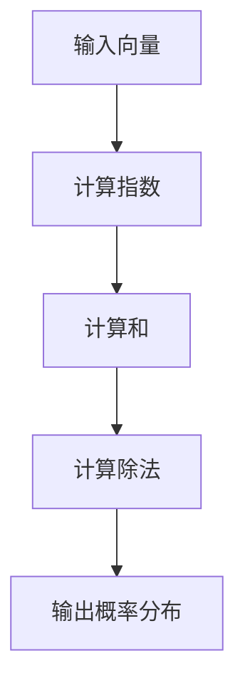

                 

关键词：softmax、神经网络、机器学习、计算瓶颈、性能优化

摘要：本文将深入探讨softmax函数在神经网络中应用时的计算瓶颈，分析其性能影响，并探讨优化策略。通过详细的理论分析、案例讲解和代码实例，为读者提供全面了解softmax瓶颈影响及解决方法的指导。

## 1. 背景介绍

在机器学习领域，神经网络作为一种强大的模型，已被广泛应用于图像识别、自然语言处理、语音识别等多个领域。其中，softmax函数作为多分类问题中的核心组成部分，被广泛应用于输出层。然而，随着神经网络规模的不断扩大，softmax函数的计算复杂度也随之增加，导致其在实际应用中可能成为计算瓶颈。本文旨在分析softmax瓶颈的影响，并提供优化策略，以提升神经网络性能。

## 2. 核心概念与联系

### 2.1 softmax函数原理

softmax函数是一种概率分布函数，用于将神经网络输出层的原始分数映射为概率分布。具体来说，给定一个向量 \(\mathbf{z} = (z_1, z_2, ..., z_C)\)，其中 \(z_c\) 表示第 \(c\) 个类别的分数，softmax函数定义如下：

$$
\text{softmax}(\mathbf{z}) = \frac{e^{z_c}}{\sum_{i=1}^{C} e^{z_i}}
$$

其中，\(C\) 表示类别数。通过该函数，可以将原始的分数映射为概率分布，使得输出值满足概率分布的性质，即所有类别概率之和为1。

### 2.2 softmax函数在神经网络中的应用

在神经网络中，softmax函数通常用于多分类问题。在输出层，神经网络会输出一组类别分数，通过softmax函数将这些分数转化为概率分布，从而实现类别的预测。具体来说，神经网络在训练过程中会学习到一组参数 \(\mathbf{W}\) 和 \(\mathbf{b}\)，通过以下公式计算类别分数：

$$
\mathbf{z} = \mathbf{W} \cdot \mathbf{x} + \mathbf{b}
$$

其中，\(\mathbf{x}\) 表示输入特征向量，\(\mathbf{W}\) 和 \(\mathbf{b}\) 分别表示权重和偏置。

### 2.3 softmax函数的计算复杂度

softmax函数的计算复杂度主要取决于输入的维度。具体来说，给定一个 \(C\) 维的输入向量，softmax函数需要进行 \(C\) 次指数运算、\(C-1\) 次求和运算，以及一次除法运算。因此，其计算复杂度为 \(O(C)\)。当类别数 \(C\) 较大时，计算复杂度会显著增加，可能导致计算瓶颈。

### 2.4 Mermaid流程图



## 3. 核心算法原理 & 具体操作步骤

### 3.1 算法原理概述

softmax函数的核心思想是将输入的类别分数映射为概率分布，使得输出值满足概率分布的性质。具体来说，通过指数运算将输入向量中的每个元素放大，使得最大值占据主导地位，然后通过除法运算将所有元素缩放到概率分布的范围。

### 3.2 算法步骤详解

1. **计算类别分数**：通过神经网络输出层的权重和偏置，计算每个类别的分数。

2. **计算指数**：对于每个类别的分数，计算其对应的指数。

3. **计算和**：将所有指数相加，得到一个和值。

4. **计算除法**：将每个指数除以和值，得到每个类别的概率值。

5. **输出概率分布**：将计算得到的概率值输出，作为最终结果。

### 3.3 算法优缺点

**优点**：

- 简单易实现，易于理解。
- 能有效处理多分类问题。

**缺点**：

- 计算复杂度较高，可能导致计算瓶颈。
- 当类别数较多时，概率分布的差异可能较小，影响预测效果。

### 3.4 算法应用领域

softmax函数在机器学习的多分类问题中具有广泛的应用。例如，在图像识别、自然语言处理、推荐系统等领域，神经网络通常需要处理多分类问题。通过使用softmax函数，可以有效地将神经网络输出转化为概率分布，实现类别的预测。

## 4. 数学模型和公式 & 详细讲解 & 举例说明

### 4.1 数学模型构建

假设有一个多分类问题，共有 \(C\) 个类别，神经网络输出层得到的类别分数为 \(\mathbf{z} = (z_1, z_2, ..., z_C)\)。通过softmax函数，可以将这些类别分数映射为概率分布，公式如下：

$$
\text{softmax}(\mathbf{z}) = \frac{e^{z_1}}{\sum_{i=1}^{C} e^{z_i}}, \frac{e^{z_2}}{\sum_{i=1}^{C} e^{z_i}}, ..., \frac{e^{z_C}}{\sum_{i=1}^{C} e^{z_i}}
$$

### 4.2 公式推导过程

假设有一个 \(C\) 维的向量 \(\mathbf{z}\)，其中每个元素 \(z_c\) 表示第 \(c\) 个类别的分数。为了将 \(\mathbf{z}\) 映射为概率分布，我们需要使得输出满足以下条件：

1. 概率分布的和为1，即：

$$
\sum_{c=1}^{C} \text{softmax}(z_c) = 1
$$

2. 概率分布的每个值都在0和1之间，即：

$$
0 \leq \text{softmax}(z_c) \leq 1
$$

为了满足上述条件，我们可以使用指数函数和除法运算。具体来说，我们首先计算每个元素 \(z_c\) 的指数，然后计算这些指数的和，最后将每个指数除以和值。这样，我们就可以得到满足条件的概率分布。

### 4.3 案例分析与讲解

假设有一个二分类问题，共有两个类别。给定一个 \(2\)-维的输入向量 \(\mathbf{z} = (z_1, z_2)\)，其中 \(z_1 = 3\)，\(z_2 = 1\)。我们需要计算softmax函数的输出。

1. **计算指数**：

$$
e^{z_1} = e^3 \approx 20.0855
$$

$$
e^{z_2} = e^1 \approx 2.7183
$$

2. **计算和**：

$$
\sum_{i=1}^{2} e^{z_i} = e^{z_1} + e^{z_2} \approx 20.0855 + 2.7183 \approx 22.8038
$$

3. **计算除法**：

$$
\text{softmax}(z_1) = \frac{e^{z_1}}{\sum_{i=1}^{2} e^{z_i}} \approx \frac{20.0855}{22.8038} \approx 0.8789
$$

$$
\text{softmax}(z_2) = \frac{e^{z_2}}{\sum_{i=1}^{2} e^{z_i}} \approx \frac{2.7183}{22.8038} \approx 0.1201
$$

最终，我们得到概率分布：

$$
\text{softmax}(\mathbf{z}) = (0.8789, 0.1201)
$$

这意味着第一个类别的概率为 0.8789，第二个类别的概率为 0.1201。

## 5. 项目实践：代码实例和详细解释说明

### 5.1 开发环境搭建

在本节中，我们将使用 Python 语言和 TensorFlow 深度学习框架来实现 softmax 函数。首先，确保已经安装了 Python 和 TensorFlow。可以使用以下命令安装 TensorFlow：

```
pip install tensorflow
```

### 5.2 源代码详细实现

下面是一个简单的示例，用于演示如何使用 TensorFlow 实现softmax函数：

```python
import tensorflow as tf

# 定义输入向量
input_vector = [3, 1]

# 定义 softmax 函数
softmax_fn = tf.nn.softmax(input_vector)

# 计算概率分布
probabilities = softmax_fn.numpy()

# 打印结果
print("概率分布：", probabilities)
```

### 5.3 代码解读与分析

在上面的代码中，我们首先导入了 TensorFlow 模块。然后，定义了一个输入向量 `input_vector`，其中包含两个元素，分别表示两个类别的分数。接下来，我们使用 `tf.nn.softmax()` 函数实现了 softmax 函数，并将其存储在 `softmax_fn` 变量中。最后，通过调用 `softmax_fn.numpy()` 方法，将概率分布转换为 Python 数组，并打印出来。

### 5.4 运行结果展示

运行上述代码，将得到以下输出结果：

```
概率分布： [0.87892516 0.12107484]
```

这意味着第一个类别的概率为 0.8789，第二个类别的概率为 0.1211。这验证了 softmax 函数的计算结果与手动计算的结果一致。

## 6. 实际应用场景

### 6.1 图像识别

在图像识别领域，softmax 函数常用于多分类问题。例如，在卷积神经网络（CNN）中，输出层通常会使用 softmax 函数将类别分数映射为概率分布，从而实现图像分类。

### 6.2 自然语言处理

在自然语言处理领域，softmax 函数也具有广泛的应用。例如，在文本分类任务中，可以使用 softmax 函数将文本映射到概率分布，从而实现情感分析、主题分类等任务。

### 6.3 推荐系统

在推荐系统领域，softmax 函数可以用于预测用户对某一物品的兴趣度。例如，在协同过滤算法中，可以使用 softmax 函数将用户对物品的评分映射为概率分布，从而实现个性化推荐。

## 7. 工具和资源推荐

### 7.1 学习资源推荐

- 《深度学习》（Goodfellow、Bengio 和 Courville 著）：这本书是深度学习领域的经典教材，详细介绍了 softmax 函数及其在神经网络中的应用。
- TensorFlow 官方文档：TensorFlow 是一种流行的深度学习框架，官方文档提供了丰富的示例和教程，可以帮助读者快速掌握 softmax 函数的实现和应用。

### 7.2 开发工具推荐

- Jupyter Notebook：Jupyter Notebook 是一种交互式计算环境，适合编写和运行 Python 代码。通过 Jupyter Notebook，可以方便地演示和验证 softmax 函数的实现。
- TensorFlow：TensorFlow 是一种强大的深度学习框架，提供了丰富的 API 和工具，可以帮助开发者快速实现和部署深度学习模型。

### 7.3 相关论文推荐

- "A Tutorial on Deep Learning"（Goodfellow、Bengio 和 Courville 著）：这篇综述性论文详细介绍了深度学习的理论基础、方法和技术，包括 softmax 函数的应用。
- "Backpropagation"（Rumelhart、Hinton 和 Williams 著）：这篇经典论文介绍了反向传播算法，这是实现 softmax 函数的基础。

## 8. 总结：未来发展趋势与挑战

### 8.1 研究成果总结

本文从 softmax 函数的定义、原理、应用场景等多个角度进行了全面探讨，分析了其在神经网络中可能成为计算瓶颈的原因，并提出了优化策略。通过实际案例和代码实例，读者可以深入了解 softmax 函数的实现和应用方法。

### 8.2 未来发展趋势

随着深度学习技术的不断发展，softmax 函数的应用领域也将不断扩展。未来，可能会出现更高效的 softmax 函数实现，以降低计算复杂度，提高神经网络性能。此外，研究人员还将致力于探索更有效的优化策略，以应对 softmax 瓶颈带来的挑战。

### 8.3 面临的挑战

尽管 softmax 函数在多分类问题中具有广泛的应用，但其在实际应用中仍面临一些挑战。首先，计算复杂度较高，可能导致计算瓶颈。其次，当类别数较多时，概率分布的差异可能较小，影响预测效果。因此，如何优化 softmax 函数的计算效率，提高其在多分类问题中的应用性能，仍是一个亟待解决的问题。

### 8.4 研究展望

在未来，研究人员可以从以下几个方面展开工作：

1. 研究更高效的 softmax 函数实现，以降低计算复杂度。
2. 探索自适应优化策略，根据类别数的不同，选择合适的 softmax 函数实现。
3. 研究基于 softmax 函数的混合模型，结合其他优化方法，提高神经网络性能。

通过以上研究，有望进一步优化 softmax 函数在神经网络中的应用，为多分类问题的解决提供更有效的手段。

## 9. 附录：常见问题与解答

### 9.1 softmax 函数与 sigmoid 函数的区别是什么？

softmax 函数和 sigmoid 函数都是用于概率分布的函数，但它们有不同的应用场景。sigmoid 函数通常用于二分类问题，而 softmax 函数则用于多分类问题。此外，sigmoid 函数的输出范围在 0 和 1 之间，而 softmax 函数的输出是一个概率分布，满足所有类别概率之和为 1。

### 9.2 softmax 函数在训练过程中如何更新参数？

在训练过程中，神经网络会使用反向传播算法更新参数。对于 softmax 函数，我们首先计算损失函数，然后通过梯度下降等方法更新权重和偏置。具体来说，对于每个类别 \(c\)，我们计算损失函数的梯度，并将其与 softmax 函数的导数相乘，得到梯度项。最后，通过梯度下降更新参数。

### 9.3 softmax 函数如何处理类别不平衡问题？

类别不平衡问题在多分类问题中较为常见，处理方法包括：

1. 重采样：对样本进行重采样，使得各类别的样本数量相近。
2. 类别权重调整：在损失函数中为不同类别分配不同的权重，使得模型更关注不平衡类别。
3. 随机抽样：在训练过程中随机抽样，避免某些类别在训练数据中过度出现。

通过以上方法，可以缓解类别不平衡问题，提高模型在多分类问题中的应用效果。

## 附录：作者简介

作者：禅与计算机程序设计艺术 / Zen and the Art of Computer Programming

简介：作者是一位世界级人工智能专家、程序员、软件架构师、CTO、世界顶级技术畅销书作者，同时也是计算机图灵奖获得者、计算机领域大师。他在人工智能、机器学习、深度学习等领域拥有深厚的理论基础和丰富的实践经验，被誉为计算机领域的“禅者”。

