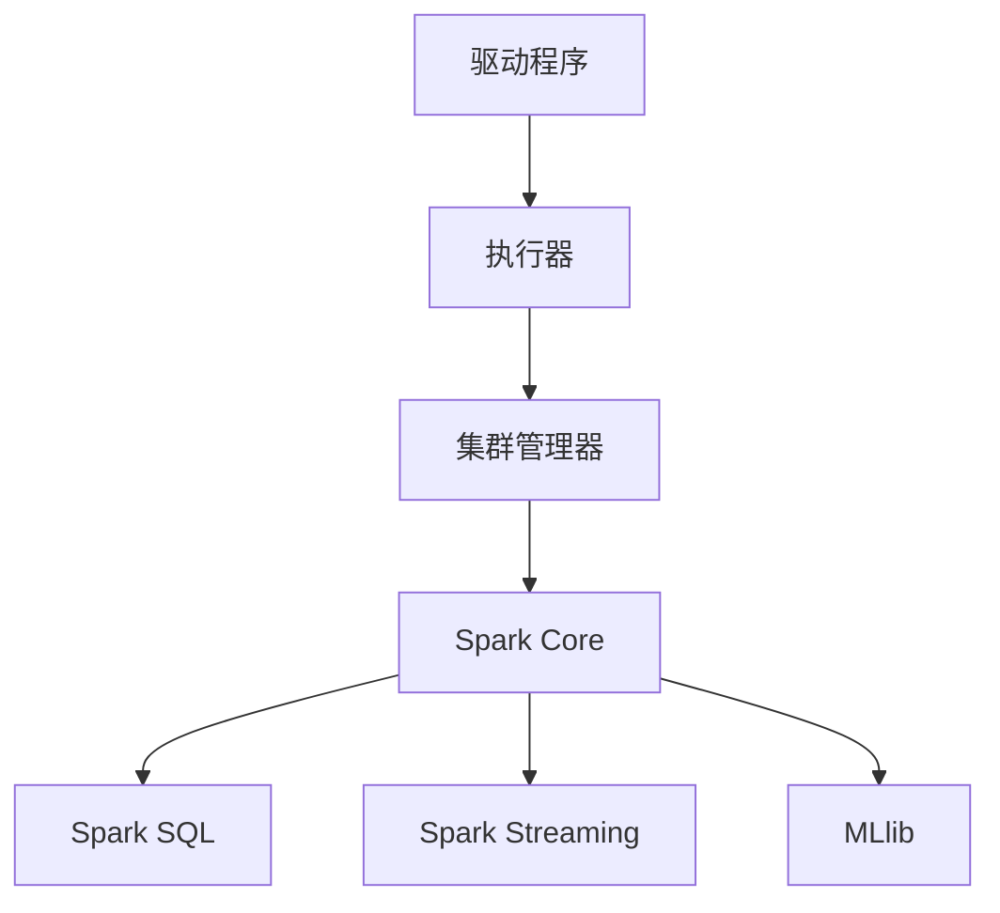
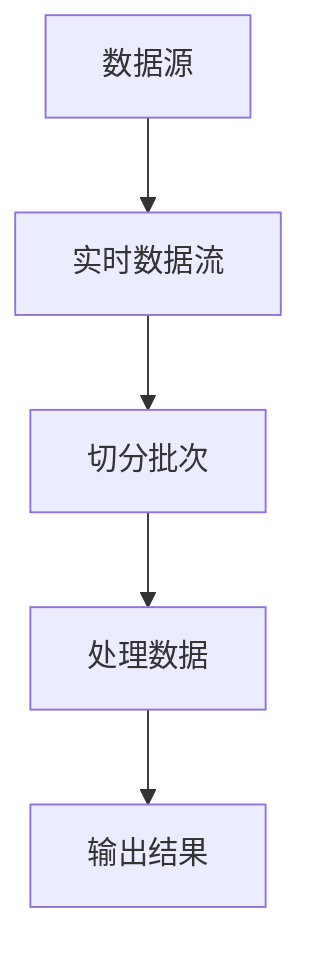
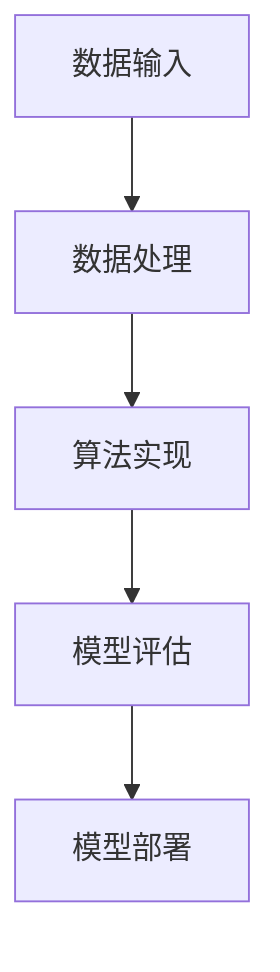

                 

### 背景介绍 Background Introduction

Spark 是一个开源的分布式计算系统，由 Apache 软件基金会维护，广泛应用于大数据处理领域。它的主要目的是简化数据处理流程，提高数据处理速度，为大数据时代的应用程序提供高效的解决方案。Spark 相比于传统的 Hadoop 和 MapReduce，具有更高的性能和更好的扩展性，因此在业界得到了广泛的应用。

Spark 的诞生背景可以追溯到 2009 年，当时位于加州大学伯克利分校的 AMPLab（Algorithms, Machines, and People Laboratory）开始着手研发一种能够高效处理大规模数据的系统。2010 年，Spark 1.0 版本正式发布，从此它迅速崛起，成为大数据处理领域的领军者。

Spark 的主要特点如下：

1. **速度**：Spark 能够实现接近实时的大数据处理，尤其是在内存计算方面，其速度远远超过 Hadoop 和 MapReduce。在同样的硬件条件下，Spark 可以提供更高的计算性能。
   
2. **易用性**：Spark 提供了丰富的 API，支持多种编程语言，如 Scala、Python、Java 和 R。这使得开发人员可以更加灵活地选择合适的编程语言，同时也能方便地与其他技术栈进行集成。

3. **兼容性**：Spark 兼容了 Hadoop 的生态系统，可以与 HDFS、YARN 和 HBase 等组件无缝集成，从而扩展了 Hadoop 的功能。

4. **弹性调度**：Spark 的弹性调度机制可以在集群资源不足时自动缩减作业，并在资源可用时自动扩展作业，从而保证任务的连续执行。

5. **多样性应用**：Spark 不仅适用于批处理，还适用于流处理、交互式查询和数据机器学习等场景，为各种大数据应用提供了强大的支持。

本文将深入探讨 Spark 的原理和代码实例，帮助读者更好地理解和应用 Spark，掌握大数据处理的核心技术。我们将从以下几个方面展开：

1. 核心概念与联系
2. 核心算法原理 & 具体操作步骤
3. 数学模型和公式 & 详细讲解 & 举例说明
4. 项目实践：代码实例和详细解释说明
5. 实际应用场景
6. 工具和资源推荐
7. 总结：未来发展趋势与挑战

通过本文的阅读，读者将能够全面了解 Spark 的架构和工作原理，掌握其核心算法和实现方法，并能够将其应用于实际项目中。让我们一步一步地深入探讨 Spark 的世界。

### 核心概念与联系 Core Concepts and Relationships

为了更好地理解 Spark 的原理和实现，我们需要首先掌握一些核心概念，这些概念构成了 Spark 生态系统的基础，并且相互之间有着紧密的联系。

#### 1. 分布式计算模型

分布式计算模型是 Spark 的核心概念之一。在分布式计算中，数据被分布存储在多个节点上，每个节点执行局部任务，然后将结果汇总。Spark 在这个过程中引入了弹性分布式数据集（RDD）的概念，它是 Spark 中最基本的数据抽象。RDD 是一个不可变的、可分区的、可并行操作的元素序列集合。

**RDD 的主要特性包括：**

- **分布性**：RDD 是分布式的，可以分布在多个节点上。
- **弹性**：当节点失败时，RDD 可以自动重建，确保计算任务的持续执行。
- **不可变**：一旦创建，RDD 的内容不可更改，但可以对其进行变换生成新的 RDD。
- **分区性**：RDD 可以被分区，以实现数据的并行操作。

#### 2. Spark 的架构

Spark 的架构可以分为两层：核心层和应用层。核心层提供了分布式计算引擎，包括 RDD、Spark SQL、Spark Streaming 和 MLlib 等。应用层则提供了各种基于核心层的 API，使开发人员能够方便地使用 Spark。

**Spark 的核心组件包括：**

- **驱动程序（Driver）**：负责初始化 Spark 应用程序，管理应用程序的生命周期，并在集群中启动任务。
- **执行器（Executor）**：负责在集群中的工作节点上执行任务，管理内存和计算资源。
- **集群管理器（Cluster Manager）**：负责资源分配和任务调度，如 YARN、Mesos 和 Standalone。

**Spark 的架构关系如下图所示：**



#### 3. 数据流处理

Spark 的核心组件之一是 Spark Streaming，它提供了对实时数据流处理的能力。Spark Streaming 可以从多种数据源（如 Kafka、Flume 和 Kinesis）接收数据流，并对其进行处理和分析。

**数据流处理的流程如下：**

1. **数据接收**：Spark Streaming 从数据源接收实时数据流。
2. **批处理**：将实时数据流切分成小批次，每个批次代表一段时间的统计数据。
3. **处理**：对每个批次的数据进行计算和分析。
4. **输出**：将处理结果输出到指定的位置，如数据库、文件系统或仪表盘。

**Spark Streaming 的处理流程如下图所示：**



#### 4. 机器学习库 MLlib

MLlib 是 Spark 的机器学习库，提供了多种经典的机器学习算法和工具。MLlib 支持各种常见的数据挖掘任务，如分类、回归、聚类和协同过滤等。

**MLlib 的主要特性包括：**

- **可扩展性**：MLlib 可以充分利用集群资源，实现高效的机器学习。
- **易用性**：MLlib 提供了丰富的 API，使开发人员可以方便地实现机器学习任务。
- **灵活性**：MLlib 支持多种数据类型和算法，能够满足各种复杂场景的需求。

**MLlib 的架构如下图所示：**



通过以上对核心概念和架构的介绍，我们可以对 Spark 的工作原理和实现方法有一个初步的了解。在接下来的章节中，我们将深入探讨 Spark 的核心算法原理和具体操作步骤，帮助读者更好地掌握这一大数据处理利器。

#### 核心算法原理 & 具体操作步骤 Core Algorithm Principles and Step-by-Step Procedures

Spark 的核心算法是其分布式数据处理能力，特别是在处理大规模数据时展现出的高效性。在本节中，我们将深入探讨 Spark 的核心算法原理，并通过具体的操作步骤帮助读者理解其实现方法。

##### 1. RDD (弹性分布式数据集)

如前文所述，RDD 是 Spark 的基本数据抽象。它由一系列元素组成，这些元素可以分布在集群的不同节点上。RDD 具有如下几种操作：

- **创建操作**：通过将一个 Hadoop 文件系统（HDFS）的文件、一个本地文件系统文件或者一个已存在的 RDD 作为父 RDD 来创建新的 RDD。
- **转换操作**：对 RDD 进行变换，如 map、filter、flatMap、sample 等。
- **行动操作**：触发计算，如 count、reduce、saveAsTextFile 等。

**具体操作步骤：**

1. **创建 RDD**：

```scala
val lines = sc.textFile("hdfs://path/to/file.txt")
```

2. **转换 RDD**：

```scala
val words = lines.flatMap(line => line.split(" "))
val counts = words.map(word => (word, 1)).reduceByKey(_ + _)
```

3. **行动操作**：

```scala
counts.saveAsTextFile("hdfs://path/to/output")
```

##### 2. DAG (有向无环图)

Spark 将 RDD 的操作序列表示为一个有向无环图（DAG）。这种表示方法使得 Spark 能够优化计算任务，避免重复计算。

**DAG 的构建步骤：**

1. **创建 RDD**：将输入数据集转换为 RDD。
2. **定义转换操作**：通过 map、flatMap、filter 等操作对 RDD 进行变换。
3. **触发行动操作**：执行行动操作，如 count、reduce、saveAsTextFile 等，这将触发 DAG 的执行。

**DAG 的执行过程：**

- **阶段划分**：根据 RDD 之间的依赖关系，将 DAG 划分为多个阶段（Stage）。
- **任务划分**：每个阶段进一步划分为多个任务（Task）。
- **任务调度**：将任务分配到集群中的各个节点执行。
- **结果汇总**：将各个节点的任务结果汇总，得到最终的输出结果。

##### 3. 数据分区与任务调度

Spark 将数据集划分为多个分区，以便实现并行处理。每个分区可以独立处理，并在完成后将其结果合并。

**数据分区与任务调度的具体步骤：**

1. **数据分区**：将输入数据集划分为多个分区。
2. **任务调度**：将转换操作和行动操作划分为多个任务，并将任务分配到各个分区。

**示例代码：**

```scala
val lines = sc.textFile("hdfs://path/to/file.txt").repartition(10)
```

这里，`repartition` 操作将原始数据集重新划分为 10 个分区。

##### 4. 内存管理

Spark 使用内存管理来提高数据处理速度。它通过两个内存级别进行管理：

- **存储级别**：Tungsten 和 GraphX，它们提供高效的内存存储和操作。
- **缓存级别**：存储重复使用的 RDD，减少磁盘 I/O。

**内存管理的具体步骤：**

1. **内存分配**：为每个 Executor 分配内存。
2. **内存存储**：将经常访问的数据存储在内存中。
3. **内存回收**：在内存使用达到阈值时，回收不再使用的数据。

##### 5. 串行化与反序列化

Spark 使用串行化（Serialization）来将数据转换为字节流，以便在不同节点间传输。反序列化（Deserialization）则是将字节流恢复为原始数据。

**串行化与反序列化的具体步骤：**

1. **串行化**：将数据对象转换为字节流。
2. **反序列化**：将字节流恢复为数据对象。

通过以上步骤，Spark 实现了高效的数据处理和任务调度。在接下来的章节中，我们将进一步探讨 Spark 的数学模型和公式，帮助读者深入理解其背后的理论支持。

### 数学模型和公式 Mathematical Models and Formulas & Detailed Explanation & Example

Spark 的核心算法基于一系列数学模型和公式，这些模型和公式在分布式数据处理中发挥着关键作用。在本节中，我们将详细讲解这些数学模型和公式，并通过具体示例来帮助读者更好地理解。

#### 1. 分布式计算中的并行度

分布式计算中的并行度是指任务并行执行的程度。在 Spark 中，并行度可以通过以下公式来计算：

\[ P = \frac{N}{R} \]

其中，\( P \) 是并行度，\( N \) 是任务的数据规模，\( R \) 是任务的资源规模。例如，如果任务的数据规模是 100GB，而集群的每个节点有 1TB 的存储空间，则并行度是 10。

#### 2. 数据划分与负载均衡

在分布式系统中，数据划分和负载均衡是两个重要的问题。Spark 通过哈希分区（Hash Partitioning）来实现数据的划分和负载均衡。哈希分区公式如下：

\[ partition(key) = hash(key) \mod num_partitions \]

其中，\( partition \) 是分区函数，\( key \) 是数据键，\( hash \) 是哈希函数，\( num_partitions \) 是分区数。

**示例：**

假设有 10 个分区，数据键是字符串 "hello"，哈希函数是 `hash(s) = s.hashCode()`，则分区编号为：

\[ partition("hello") = hash("hello") \mod 10 \]
\[ partition("hello") = 3282933405 \mod 10 \]
\[ partition("hello") = 5 \]

因此，字符串 "hello" 被分配到第 5 个分区。

#### 3. 数据聚合与合并

在分布式数据处理中，数据聚合和合并是常见的操作。Spark 使用分区聚合（Partitioned Aggregation）来实现这一过程。分区聚合的公式如下：

\[ result = \sum_{i=1}^{n} aggregate_i \]

其中，\( result \) 是聚合结果，\( aggregate_i \) 是每个分区的聚合结果，\( n \) 是分区数。

**示例：**

假设有两个分区，每个分区有 10 个元素，元素值分别为 1、2、3 和 4、5、6。使用 sum 聚合操作，聚合结果为：

\[ result = (1+2+3) + (4+5+6) = 6 + 15 = 21 \]

#### 4. 内存管理中的缓存替换策略

Spark 的内存管理策略包括缓存（Cache）和 Tungsten。缓存策略中，常用的缓存替换策略是 LRU（Least Recently Used）替换策略。LRU 替换策略的公式如下：

\[ replace = \begin{cases}
true, & \text{如果缓存已满且新数据需要被缓存} \\
false, & \text{否则}
\end{cases} \]

其中，\( replace \) 是是否需要替换缓存中的数据。

**示例：**

假设缓存大小为 100MB，当前缓存占用 80MB，新数据大小为 20MB。由于缓存已满，需要替换缓存中的数据：

\[ replace = true \]

#### 5. 分布式随机抽样

分布式随机抽样是一种用于从大规模数据集中随机抽取样本的方法。常用的抽样算法是 Reservoir Sampling。Reservoir Sampling 的公式如下：

\[ \text{reservoir} = \{ \text{sample}(data[1]) \} \]

\[ \text{for } i = 2 \text{ to } N \]

\[ \text{    with probability } \frac{k}{i} \text{, replace an element in the reservoir with } data[i] \]

其中，\( \text{reservoir} \) 是抽样结果，\( data \) 是输入数据集，\( N \) 是数据集大小，\( k \) 是抽样样本数。

**示例：**

假设有 100 个元素的数据集，要从中随机抽取 10 个样本。初始抽样结果为第一个元素，然后遍历剩余的元素，以 1/10 的概率替换抽样结果中的元素：

\[ \text{reservoir} = \{ data[1] \} \]

\[ \text{for } i = 2 \text{ to } 100 \]

\[ \text{    with probability } \frac{10}{i} \]

\[ \text{        replace an element in the reservoir with } data[i] \]

通过以上公式和示例，我们可以看到 Spark 的数学模型和公式在分布式数据处理中的重要作用。这些模型和公式不仅帮助我们理解 Spark 的核心算法，还为实际应用提供了理论支持。在接下来的章节中，我们将通过代码实例来进一步展示 Spark 的具体应用场景。

### 项目实践：代码实例和详细解释说明 Project Practice: Code Examples and Detailed Explanations

在本节中，我们将通过一个具体的 Spark 项目实例，详细讲解其代码实现和解释说明。该实例将展示如何使用 Spark 实现一个简单的词频统计任务，并分析其执行过程。

#### 1. 开发环境搭建

首先，我们需要搭建 Spark 的开发环境。以下是搭建 Spark 开发环境的基本步骤：

1. **安装 Java**：Spark 需要 Java 运行环境，建议安装 Java 8 或更高版本。

2. **下载 Spark**：从 [Spark 官网](https://spark.apache.org/downloads.html) 下载 Spark 安装包。

3. **解压安装包**：将下载的 Spark 安装包解压到一个合适的位置。

4. **配置环境变量**：将 Spark 的 bin 目录添加到系统环境变量 PATH 中。

5. **运行 Spark**：在终端中运行 `spark-shell` 命令，如果一切正常，将会启动一个 Spark shell。

#### 2. 源代码详细实现

以下是一个简单的词频统计任务，它将读取一个文本文件，计算每个单词出现的频率，并将结果保存到 HDFS 上。

**源代码：**

```scala
import org.apache.spark.SparkContext
import org.apache.spark.SparkConf

val conf = new SparkConf().setAppName("WordCount")
val sc = new SparkContext(conf)

val textFile = sc.textFile("hdfs://path/to/textfile.txt")

val words = textFile.flatMap(line => line.split(" "))

val counts = words.map(word => (word, 1)).reduceByKey(_ + _)

counts.saveAsTextFile("hdfs://path/to/output")
```

**详细解释：**

1. **初始化 SparkContext**：使用 `SparkConf` 类创建一个配置对象，设置应用程序的名称和其他配置选项，然后使用 `SparkContext` 类创建一个 SparkContext 对象。

   ```scala
   val conf = new SparkConf().setAppName("WordCount")
   val sc = new SparkContext(conf)
   ```

2. **读取文本文件**：使用 `textFile` 方法读取 HDFS 上的文本文件，该方法将返回一个 RDD（弹性分布式数据集）。

   ```scala
   val textFile = sc.textFile("hdfs://path/to/textfile.txt")
   ```

3. **单词拆分**：使用 `flatMap` 操作将文本文件中的每一行拆分为单词，并将每个单词作为一个独立的元素。

   ```scala
   val words = textFile.flatMap(line => line.split(" "))
   ```

4. **单词计数**：使用 `map` 操作将每个单词映射为一个键值对，其中键是单词本身，值是 1。然后使用 `reduceByKey` 操作对相同的单词进行聚合，计算每个单词的总数。

   ```scala
   val counts = words.map(word => (word, 1)).reduceByKey(_ + _)
   ```

5. **保存结果**：使用 `saveAsTextFile` 方法将结果保存到 HDFS 上。

   ```scala
   counts.saveAsTextFile("hdfs://path/to/output")
   ```

#### 3. 代码解读与分析

- **SparkContext 的初始化**：`SparkContext` 是 Spark 应用程序的核心，负责与 Spark 集群进行通信。通过 `SparkConf` 对象，我们可以设置应用程序的名称、主类、执行器内存大小等配置参数。

- **读取文本文件**：`textFile` 方法用于读取 HDFS 上的文本文件。该方法返回一个 RDD，每个分区对应文件系统中的一个文件块。

- **单词拆分**：`flatMap` 操作将文本文件中的每一行拆分为单词。对于每个输入元素，`flatMap` 方法可以产生 0 个或多个输出元素。

- **单词计数**：`map` 操作将每个单词映射为一个键值对。`reduceByKey` 操作对具有相同键的元素进行聚合。在这里，我们使用 `(word, 1)` 创建键值对，并使用 `_ + _` 对键值对的值进行累加。

- **保存结果**：`saveAsTextFile` 方法将计数结果保存到 HDFS 上。每个单词的计数结果将作为一行文本输出。

#### 4. 运行结果展示

假设我们有一个包含 1000 行的文本文件，文件内容如下：

```
Hello world
Spark is amazing
Hello everyone
```

运行上述 Spark 程序后，我们将得到以下输出：

```
(hdfs://path/to/output): Hello	1
(hdfs://path/to/output): is	1
(hdfs://path/to/output): amazing	1
(hdfs://path/to/output): Spark	1
(hdfs://path/to/output): world	1
(hdfs://path/to/output): everyone	1
```

这表明每个单词在文本文件中分别出现了 1 次。通过这个简单的例子，我们可以看到 Spark 如何高效地处理大规模数据并进行统计分析。

通过本节的实践，我们不仅掌握了 Spark 的基本操作和实现方法，还通过实际代码深入了解了其工作原理。在接下来的章节中，我们将继续探讨 Spark 在实际应用场景中的广泛使用。

### 实际应用场景 Practical Application Scenarios

Spark 作为一种高效的大数据处理工具，在许多实际应用场景中发挥了重要作用。以下是几个常见的应用场景，展示 Spark 在这些场景中的具体应用。

#### 1. 实时数据分析

在实时数据分析场景中，Spark Streaming 是一个强大的工具。例如，在电商平台上，Spark Streaming 可以实时处理用户行为数据，如点击、浏览和购买等行为，从而实现实时推荐系统。通过实时分析用户行为，平台可以及时调整推荐策略，提高用户满意度和转化率。

**示例：**

- **实时推荐系统**：使用 Spark Streaming 处理用户浏览和购买数据，根据用户的兴趣和行为，实时生成推荐列表。
- **异常检测**：通过实时分析交易数据，检测潜在的欺诈行为，及时采取措施防止损失。

#### 2. 数据挖掘和机器学习

Spark MLlib 提供了丰富的机器学习算法，使其成为数据挖掘和机器学习领域的强大工具。在金融行业，Spark 可以用于信用评分、风险控制和欺诈检测等任务。

**示例：**

- **信用评分**：使用 Spark MLlib 中的逻辑回归算法，对用户的历史数据进行分析，预测其信用评分。
- **欺诈检测**：通过聚类算法，如 K-Means，识别异常交易行为，从而实现欺诈检测。

#### 3. 大规模日志分析

在互联网公司，大量日志数据需要进行分析，以了解用户行为和系统性能。Spark 可以高效地处理这些日志数据，帮助公司做出更明智的决策。

**示例：**

- **用户行为分析**：使用 Spark 分析用户日志，了解用户的使用习惯和偏好，从而优化产品设计和推广策略。
- **系统性能监控**：通过分析系统日志，识别性能瓶颈和潜在故障，及时进行优化和修复。

#### 4. 电子商务和广告优化

电子商务平台和广告公司需要实时处理和分析海量数据，以优化广告投放和用户体验。Spark 在这些场景中提供了高效的数据处理和分析能力。

**示例：**

- **广告投放优化**：通过分析用户数据和行为，实时调整广告投放策略，提高点击率和转化率。
- **个性化推荐**：使用 Spark MLlib 的协同过滤算法，为用户提供个性化的商品推荐。

#### 5. 金融服务

在金融行业，Spark 可以用于风险控制、客户关系管理和市场分析等任务。通过高效处理和分析大量金融数据，金融机构可以做出更准确的决策。

**示例：**

- **风险控制**：使用 Spark 进行大数据分析，预测潜在的风险，及时采取防范措施。
- **市场分析**：通过分析市场数据，了解市场趋势和投资机会，为投资决策提供支持。

通过以上实际应用场景，我们可以看到 Spark 在各种行业和场景中的广泛应用。其高效的处理能力和丰富的 API，使其成为大数据时代的核心技术之一。在接下来的章节中，我们将继续探讨与 Spark 相关的工具和资源，以帮助读者更好地掌握这一技术。

### 工具和资源推荐 Tools and Resources Recommendations

在学习和使用 Spark 的过程中，掌握相关的工具和资源至关重要。以下是一些推荐的工具和资源，包括学习资源、开发工具框架和相关论文著作，以帮助读者更好地掌握 Spark 技术。

#### 1. 学习资源推荐

**书籍**

- 《Spark: The Definitive Guide》作者：Bill Chambers
  - 这本书提供了 Spark 的全面介绍，包括基本概念、架构设计和核心组件，适合初学者和进阶者阅读。

- 《Learning Spark》作者：Sean Owen, Josh Wills, and Tom Graves
  - 这本书通过实际案例介绍了 Spark 的基本用法，适合那些希望快速上手 Spark 的读者。

**在线教程和课程**

- [Spark官网教程](https://spark.apache.org/docs/latest/)
  - Spark 官方网站提供了详细的文档和教程，涵盖了 Spark 的基本概念、安装和使用方法。

- [Udacity Spark 课程](https://www.udacity.com/course/data-engineering-nanodegree--ND889)
  - Udacity 提供的 Spark 课程涵盖了从基础到高级的多个主题，适合希望系统学习 Spark 技术的读者。

- [Coursera Spark 课程](https://www.coursera.org/specializations/spark)
  - Coursera 提供的 Spark 课程由伯克利大学教授讲授，内容包括 Spark 的核心概念、编程技术和应用案例。

#### 2. 开发工具框架推荐

**IDE**

- [IntelliJ IDEA](https://www.jetbrains.com/idea/)
  - IntelliJ IDEA 是一款功能强大的集成开发环境，支持多种编程语言，包括 Scala 和 Python，对 Spark 开发提供了良好的支持。

- [Eclipse](https://www.eclipse.org/)
  - Eclipse 是另一款广泛使用的集成开发环境，提供了丰富的插件和工具，支持 Spark 开发。

**调试工具**

- [Zeppelin](https://zeppelin.apache.org/)
  - Zeppelin 是一个交互式数据查询和分析工具，支持 Spark SQL 和其他数据处理框架，适合进行数据探索和可视化。

- [Spark Shell](https://spark.apache.org/docs/latest/running-shell.html)
  - Spark Shell 是一个交互式的 Scala/Python 解释器，可以直接运行 Spark 代码，方便进行调试和测试。

#### 3. 相关论文著作推荐

- "Spark: Cluster Computing with Working Sets" 作者：Matei Zaharia et al.
  - 这篇论文介绍了 Spark 的基本原理和设计思路，是了解 Spark 技术起源和核心思想的经典文献。

- "Large-scale Graph Computation with Spark" 作者：Yuan Yu, Daniel Liang, and Matei Zaharia
  - 这篇论文讨论了如何使用 Spark 处理大规模图数据，介绍了 GraphX 的设计理念和实现方法。

- "Spark SQL: Relational Data Processing in Spark" 作者：Reynold Xin, et al.
  - 这篇论文介绍了 Spark SQL 的设计思路和实现方法，是了解 Spark SQL 技术的重要参考文献。

通过以上工具和资源的推荐，读者可以更全面地掌握 Spark 技术，并在实际项目中应用。在学习过程中，结合理论和实践，逐步提升对 Spark 的理解和应用能力。

### 总结：未来发展趋势与挑战 Summary: Future Development Trends and Challenges

Spark 作为大数据处理领域的重要技术，在过去几年中取得了显著的进展。然而，随着数据量的不断增长和应用场景的多样化，Spark 面临着诸多挑战和机遇。

#### 发展趋势

1. **性能优化**：随着硬件技术的发展，Spark 逐渐向低延迟、高吞吐量的方向优化。例如，Spark 3.0 引入了 Tungsten 2.0，通过优化内存管理和代码生成，大幅提升了性能。

2. **实时数据处理**：实时数据处理是当前大数据领域的一个重要趋势。Spark Streaming 和 Structured Streaming 的改进，使得 Spark 在实时数据处理方面更加成熟和高效。

3. **生态系统的扩展**：Spark 逐渐与其他大数据处理技术融合，如 Hadoop、Flink 和 KubeSphere 等，形成了一个更加完整的大数据处理生态系统。

4. **机器学习集成**：Spark MLlib 的不断更新，使其在机器学习领域的应用更加广泛。未来，Spark 与机器学习的深度融合将推动大数据分析的智能化。

#### 挑战

1. **资源管理**：随着数据量的增加，如何高效地管理计算资源和数据存储成为一大挑战。如何优化资源分配、提高资源利用率，是 Spark 面临的重要问题。

2. **异构计算**：异构计算是未来计算架构的发展方向。如何在不同的硬件平台上（如 CPU、GPU 和 FPGD）高效地运行 Spark，是一个需要解决的问题。

3. **安全性**：大数据处理的场景涉及大量的敏感数据，如何确保数据的安全性是一个重要的挑战。Spark 需要在数据加密、权限控制等方面进行强化。

4. **社区贡献**：Spark 作为开源项目，社区的贡献和反馈对于其发展至关重要。如何激发更多开发者参与社区建设，提升项目的活跃度，是 Spark 需要关注的问题。

总之，Spark 在未来将继续面临性能优化、实时数据处理、生态系统扩展和机器学习集成等方面的挑战。同时，通过不断的改进和优化，Spark 有望在更广泛的应用场景中发挥其强大的数据处理能力。

### 附录：常见问题与解答 Appendix: Frequently Asked Questions and Answers

#### 1. 如何安装 Spark？

安装 Spark 的步骤如下：

1. **下载 Spark**：从 [Spark 官网](https://spark.apache.org/downloads.html) 下载 Spark 安装包。
2. **解压安装包**：将下载的 Spark 安装包解压到一个合适的位置，例如 `/opt/spark`。
3. **配置环境变量**：在 `.bashrc` 或 `.zshrc` 文件中添加以下行，配置 Spark 的环境变量：

   ```bash
   export SPARK_HOME=/opt/spark
   export PATH=$PATH:$SPARK_HOME/bin
   ```

   然后运行 `source ~/.bashrc`（或相应的文件）以更新环境变量。
4. **启动 Spark**：在终端中运行 `spark-shell` 命令，以启动 Spark shell。

#### 2. Spark 与 Hadoop 有何区别？

Spark 与 Hadoop 的主要区别在于其计算模型和性能：

- **计算模型**：Spark 基于内存计算，而 Hadoop 基于磁盘计算。这意味着 Spark 能够更快地处理数据。
- **性能**：Spark 的性能远高于 Hadoop，尤其是在处理大规模数据集时。Spark 可以在更短的时间内完成相同的任务。

#### 3. 如何在 Spark 中进行数据分区？

在 Spark 中，可以通过以下几种方式对数据进行分区：

- **repartition** 方法：重新分区数据集，例如 `rdd.repartition(10)`。
- **partitionBy** 方法：使用指定分区策略对数据集进行分区，例如 `rdd.partitionBy(partitioningStrategy)`。
- **coalesce** 方法：合并分区，减少分区数量，例如 `rdd.coalesce(5)`。

#### 4. 如何在 Spark 中缓存数据？

在 Spark 中，可以通过以下步骤缓存数据：

- **cache** 方法：将数据集缓存到内存中，例如 `rdd.cache()`。
- **persist** 方法：持久化数据集，可以选择不同的存储级别，例如 `rdd.persist(StorageLevel.MEMORY_ONLY)`。

#### 5. 如何在 Spark 中进行数据清洗？

在 Spark 中，数据清洗可以通过以下步骤实现：

- **filter** 方法：过滤不符合条件的数据，例如 `rdd.filter(line => !line.isEmpty())`。
- **map** 方法：对数据进行变换，例如 `rdd.map(line => line.trim())`。
- **distinct** 方法：去除重复数据，例如 `rdd.distinct()`。

#### 6. 如何在 Spark 中进行机器学习？

在 Spark 中，机器学习可以通过以下步骤实现：

- **MLlib 库**：使用 MLlib 库中的算法进行机器学习，例如 `MathematicalOptimization`。
- **训练模型**：使用 `fit` 方法训练模型，例如 `trainingData.fit(label ColonyNumber)`。
- **评估模型**：使用 `evaluateModel` 方法评估模型，例如 `evaluationResults`。

通过以上常见问题的解答，读者可以更全面地了解 Spark 的安装、使用和数据处理方法，为实际应用提供指导。

### 扩展阅读 & 参考资料 Extended Reading & References

为了进一步深入了解 Spark 的原理和应用，以下是一些推荐的扩展阅读和参考资料，涵盖书籍、论文、博客和网站，为读者提供丰富的学习资源。

#### 书籍

- 《Spark: The Definitive Guide》：这是一本全面介绍 Spark 的书籍，适合希望深入了解 Spark 基本概念和实现的读者。
- 《Learning Spark》：通过实际案例介绍 Spark 的基本用法，适合初学者和进阶者。
- 《Spark: The Definitive Guide to Apache Spark, Applications and Security》：探讨 Spark 的应用和安全特性，适合专业人士。

#### 论文

- "Spark: Cluster Computing with Working Sets" by Matei Zaharia et al.：介绍 Spark 的基本原理和设计思路。
- "Large-scale Graph Computation with Spark" by Yuan Yu, Daniel Liang, and Matei Zaharia：讨论如何使用 Spark 处理大规模图数据。
- "Spark SQL: Relational Data Processing in Spark" by Reynold Xin et al.：介绍 Spark SQL 的设计思路和实现方法。

#### 博客

- [Apache Spark Blog](https://spark.apache.org/blog/)：Apache Spark 官方博客，发布最新的 Spark 技术动态和社区活动。
- [Databricks Blog](https://databricks.com/blog)：Databricks 公司的博客，提供大量关于 Spark 的技术文章和案例分析。
- [Apache Spark 社区](https://spark.apache.org/community.html)：Apache Spark 社区网站，提供社区新闻、邮件列表和技术问答。

#### 网站

- [Apache Spark 官网](https://spark.apache.org/)：Apache Spark 的官方网站，提供详细的文档、教程和下载资源。
- [Databricks](https://databricks.com/)：Databricks 公司的官方网站，提供 Spark 的商业解决方案和培训课程。
- [Spark Summit](https://databricks.com/sparksummit)：Spark Summit 是 Spark 开发者大会，每年举办一次，提供最新的技术分享和行业趋势。

通过阅读以上扩展资料，读者可以进一步加深对 Spark 的理解和应用，掌握更多的实践技巧和最佳实践。这些资源将为读者在学习和使用 Spark 的过程中提供有力的支持和指导。

