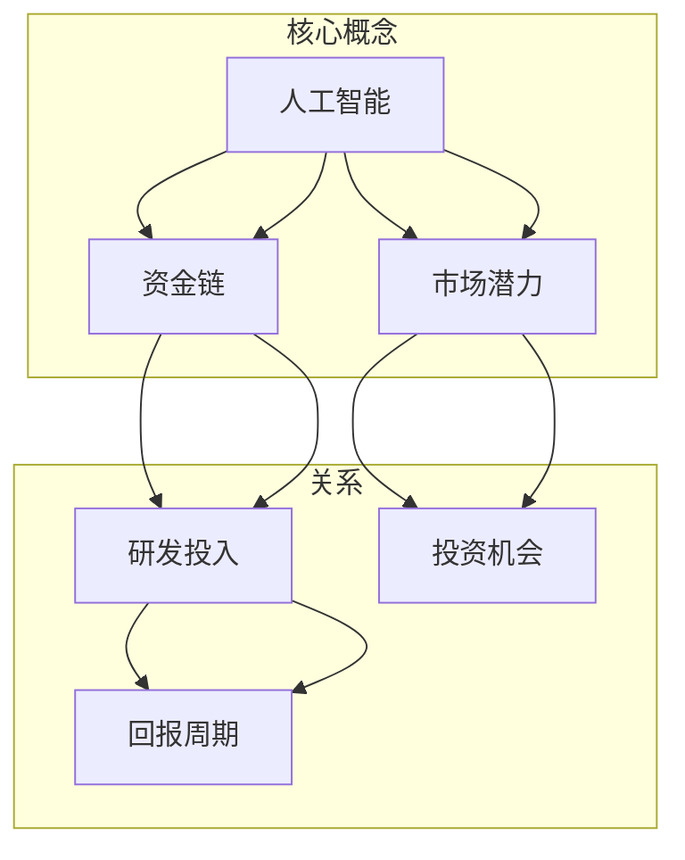

                 

### 背景介绍

#### Stability AI 的发展历程

Stability AI 是一家全球领先的人工智能公司，成立于 2018 年。公司致力于推动人工智能技术的创新和发展，特别是在生成对抗网络（GANs）和深度学习领域取得了显著成就。Stability AI 的核心目标是利用人工智能技术解决现实世界中的复杂问题，提升人类生活的质量。

公司成立初期，Stability AI 通过一系列的科学研究和技术突破，迅速积累了大量的技术专利和学术论文。其研究成果在人工智能领域引起了广泛关注，吸引了众多投资人和合作伙伴的关注。随着公司规模的不断扩大，Stability AI 吸引了来自全球顶尖高校和研究机构的优秀人才，形成了强大的研发团队。

#### 研发与商业化进程

在研发方面，Stability AI 专注于开发先进的深度学习算法和应用，并将其应用于图像处理、语音识别、自然语言处理等多个领域。公司的研究团队在 GANs 领域取得了突破性进展，推出了一系列具有高度创意和实用价值的产品。

在商业化方面，Stability AI 积极推动人工智能技术的产业化应用，与多家知名企业建立了战略合作关系。公司提供了一系列人工智能解决方案，包括图像生成、图像编辑、语音合成等，广泛应用于广告、娱乐、医疗、金融等多个行业。

然而，随着市场竞争的加剧和资金链的紧张，Stability AI 面临了严峻的挑战。近期，公司资金链出现问题，导致 CEO 辞职。这一事件引发了业界的广泛关注，对 Stability AI 的未来发展产生了不确定性。

### 人工智能行业的资金链问题

近年来，人工智能行业蓬勃发展，吸引了大量风险投资。然而，随着市场的饱和和监管政策的收紧，许多企业面临着资金链断裂的风险。Stability AI 的资金问题并非个案，而是整个行业面临的一个普遍问题。

首先，人工智能行业的特点是研发投入巨大，而回报周期较长。这使得企业在初创阶段往往需要大量的资金支持。然而，随着市场竞争的加剧，企业的盈利能力受到挑战，导致资金紧张。

其次，人工智能行业的投资存在高度不确定性。许多人工智能技术尚未成熟，无法准确预测其商业价值。因此，投资者在投资人工智能企业时往往面临较高的风险。

此外，监管政策的收紧也对人工智能行业产生了影响。为了保护消费者权益和社会公共利益，各国政府纷纷加强对人工智能的监管。这可能导致企业的合规成本增加，影响其盈利能力。

### 资金耗尽对 Stability AI 的影响

Stability AI 资金耗尽对公司的运营和未来发展产生了深远的影响。首先，资金短缺导致公司无法维持正常的运营，包括员工工资、技术研发、市场推广等。这可能导致公司业务停滞，影响其在市场竞争中的地位。

其次，资金问题可能迫使公司进行大规模裁员，削弱其研发实力。优秀的人才流失将对公司的技术创新能力产生负面影响，影响其核心竞争力。

此外，资金短缺还可能导致公司无法继续推进其研发项目，错失市场机会。在激烈的市场竞争中，缺乏创新和技术优势的企业很难站稳脚跟。

最后，资金问题可能导致公司破产或被收购。如果 Stability AI 无法解决资金问题，可能会被迫寻求外部救助或出售公司。这将影响公司的发展方向和战略规划。

### 投资人青睐有市场潜力的企业

在当前的市场环境下，投资人更倾向于投资那些有市场潜力的企业。对于人工智能企业来说，市场潜力主要体现在以下几个方面：

首先，人工智能技术在各个行业中的应用日益广泛。随着大数据、云计算等技术的不断发展，人工智能的应用场景不断扩展，市场需求持续增长。

其次，人工智能技术具有较高的盈利能力。通过为各行各业提供定制化的解决方案，人工智能企业可以创造巨大的商业价值。

此外，人工智能技术具有变革性潜力。它不仅能够提升传统行业的效率，还能创造新的商业模式和产业链。这使得人工智能企业具有广阔的发展前景。

因此，投资人更愿意投资那些在技术、市场和商业模式上具有创新性和竞争优势的企业。对于 Stability AI 这样的企业，要想获得投资人的青睐，需要从以下几个方面着手：

1. **技术优势**：持续投入研发，保持技术领先地位，推出具有创新性和实用价值的产品。
2. **市场定位**：明确目标市场，深入了解客户需求，提供符合市场需求的解决方案。
3. **商业模式**：构建可持续的商业模式，实现盈利能力，提高企业的市场竞争力。
4. **团队建设**：打造一支高素质、专业化的团队，确保企业的持续发展和创新能力。

通过以上措施，Stability AI 可以提升自身的市场竞争力，吸引更多投资人的关注和支持。

### 总结

Stability AI 的资金问题反映了当前人工智能行业面临的挑战。在资金紧张的市场环境下，企业需要不断创新，提升技术优势，明确市场定位，构建可持续的商业模式。只有那些具有市场潜力的企业才能在激烈的市场竞争中脱颖而出，获得投资人的青睐。

本文通过对 Stability AI 资金问题的分析，探讨了人工智能行业的发展趋势和挑战。希望读者能从中获得对人工智能行业的更深入理解，为未来的创新和发展提供启示。## 2. 核心概念与联系

#### 核心概念介绍

在探讨 Stability AI 的资金问题和人工智能行业的发展趋势时，我们需要了解一些核心概念，包括人工智能、资金链、市场潜力等。

1. **人工智能（AI）**：人工智能是指通过计算机程序实现人类智能功能的技术，包括机器学习、深度学习、自然语言处理、计算机视觉等。人工智能技术广泛应用于各个行业，如医疗、金融、制造、交通等，为人类生活带来了巨大变革。

2. **资金链**：资金链是指企业在经营过程中所需的资金来源、使用和归还的链条。企业资金链的稳定性直接影响其运营和持续发展能力。在人工智能行业中，由于研发投入巨大、回报周期较长，资金链问题尤为突出。

3. **市场潜力**：市场潜力是指企业在特定市场中能够创造价值的潜力。市场潜力与企业的技术优势、商业模式和客户需求紧密相关。具有市场潜力的企业能够获得更多投资机会，实现可持续发展。

#### 核心概念之间的联系

核心概念之间的联系体现在以下几个方面：

1. **人工智能与资金链**：人工智能行业的特点是研发投入巨大，而回报周期较长。这使得企业在初创阶段往往需要大量的资金支持。因此，资金链的稳定性直接影响人工智能企业的发展。

2. **市场潜力与资金链**：具有市场潜力的企业能够吸引更多投资，获得资金支持，从而维持正常运营和持续发展。市场潜力与企业的技术优势、商业模式和客户需求密切相关。

3. **人工智能与市场潜力**：人工智能技术在各个行业中的应用日益广泛，为各行各业带来了新的商业机会。具有市场潜力的企业能够抓住这些机会，实现商业成功。

#### Mermaid 流程图

为了更好地展示核心概念之间的联系，我们可以使用 Mermaid 流程图来表示。以下是核心概念及其相互关系的 Mermaid 流程图：



在这个流程图中，人工智能、资金链和市场潜力是核心概念，它们之间的联系通过研发投入、投资机会和回报周期来体现。这个流程图可以帮助我们更好地理解这些核心概念之间的相互作用和影响。

### 总结

在本文的第二部分，我们介绍了人工智能、资金链和市场潜力等核心概念，并探讨了它们之间的相互联系。通过 Mermaid 流程图，我们清晰地展示了这些概念之间的逻辑关系。这为后续对 Stability AI 资金问题和人工智能行业发展趋势的深入分析奠定了基础。## 3. 核心算法原理 & 具体操作步骤

#### GANs 的基本原理

生成对抗网络（Generative Adversarial Networks，GANs）是 Stability AI 在人工智能领域取得突破性进展的关键技术之一。GANs 是一种由两个神经网络组成的框架：生成器（Generator）和判别器（Discriminator）。这两个网络相互对抗，通过不断迭代优化，最终生成高质量的数据。

1. **生成器（Generator）**：生成器的目标是生成与真实数据相似的新数据。它通过学习真实数据的分布，将随机噪声输入转化为具有一定真实度的数据。生成器的目的是欺骗判别器，使其难以区分生成数据与真实数据。

2. **判别器（Discriminator）**：判别器的目标是判断输入的数据是真实数据还是生成数据。它通过学习真实数据和生成数据，不断提高其辨别能力。判别器的目的是尽量将生成数据识别为假数据。

3. **对抗过程**：生成器和判别器在训练过程中相互对抗。生成器不断优化其生成数据的质量，以欺骗判别器；而判别器则不断优化其辨别能力，以识破生成器的欺骗。通过这种对抗过程，生成器和判别器共同进化，逐步提高生成数据的质量。

#### GANs 的训练过程

GANs 的训练过程可以分为以下几个步骤：

1. **初始化网络**：首先，初始化生成器和判别器网络。生成器通常是一个全连接神经网络，判别器也是一个全连接神经网络。

2. **生成数据**：生成器接收随机噪声作为输入，通过训练学习真实数据的分布，生成与真实数据相似的新数据。

3. **判断数据**：判别器接收真实数据和生成数据作为输入，通过训练学习如何区分真实数据和生成数据。

4. **对抗训练**：生成器和判别器进行对抗训练。生成器尝试生成更真实的数据，以欺骗判别器；而判别器则努力提高辨别能力，以识破生成器的欺骗。

5. **迭代优化**：通过多次迭代训练，生成器和判别器不断优化，生成数据的质量不断提高。

6. **停止条件**：当生成数据的质量达到一定标准，或者训练达到预设的迭代次数时，训练过程停止。

#### GANs 的应用场景

GANs 在多个领域取得了显著的应用成果，以下是几个典型的应用场景：

1. **图像生成**：GANs 可以生成高质量的自然图像，包括人脸、风景、动物等。这些图像可以用于艺术创作、图像修复、图像增强等。

2. **数据增强**：GANs 可以通过生成新的数据样本，提高数据集的多样性，从而改善模型的泛化能力。这有助于提升人工智能模型在图像识别、自然语言处理等领域的性能。

3. **图像编辑**：GANs 可以用于图像编辑，如去除图像中的瑕疵、改变图像的背景等。这为图像处理和计算机视觉领域提供了新的解决方案。

4. **医学影像**：GANs 可以生成高质量的医学影像数据，用于医学图像诊断和肿瘤检测。这有助于提高医学影像诊断的准确性和效率。

5. **视频生成**：GANs 可以生成高质量的视频序列，包括动作捕捉、视频增强等。这为视频处理和计算机视觉领域带来了新的应用场景。

### 总结

在本文的第三部分，我们详细介绍了生成对抗网络（GANs）的基本原理和训练过程，以及 GANs 在不同领域中的应用场景。通过深入理解 GANs 的原理和应用，我们可以更好地把握 Stability AI 的技术创新和发展方向。## 4. 数学模型和公式 & 详细讲解 & 举例说明

#### GANs 的数学模型

生成对抗网络（GANs）的核心在于其数学模型，该模型由两部分组成：生成器和判别器。以下是对 GANs 数学模型的详细讲解。

##### 4.1. 生成器（Generator）

生成器的目标是生成与真实数据相似的数据。生成器的输入是一个随机噪声向量 \( z \)，输出是一个数据样本 \( G(z) \)。生成器的数学模型可以表示为：

$$
G(z) = \mu(z) + \sigma(z)\odot \epsilon
$$

其中，\( \mu(z) \) 是生成器的均值函数，\( \sigma(z) \) 是生成器的方差函数，\( \epsilon \) 是一个高斯噪声向量。生成器的目的是通过优化均值函数和方差函数，使得生成的数据样本 \( G(z) \) 更接近真实数据。

##### 4.2. 判别器（Discriminator）

判别器的目标是判断输入的数据是真实数据 \( x \) 还是生成数据 \( G(z) \)。判别器的数学模型可以表示为：

$$
D(x) = f(x; \theta_D) \quad \text{和} \quad D(G(z)) = f(G(z); \theta_D)
$$

其中，\( f(x; \theta_D) \) 是判别器的输出，\( \theta_D \) 是判别器的参数。判别器的目的是通过优化参数 \( \theta_D \)，使得其对真实数据和生成数据的辨别能力更强。

##### 4.3. 对抗训练

GANs 的训练过程是一个对抗训练的过程，生成器和判别器相互竞争。其目标是最小化以下损失函数：

$$
\min_G \max_D V(D, G) = E_{x\sim p_{data}(x)}[\log D(x)] + E_{z\sim p_z(z)}[\log(1 - D(G(z)))]
$$

其中，\( V(D, G) \) 是生成器和判别器的联合损失函数，\( p_{data}(x) \) 是真实数据的概率分布，\( p_z(z) \) 是噪声向量的概率分布。生成器的目标是最大化判别器的错误率，即最小化 \( 1 - D(G(z)) \)；而判别器的目标是最大化判别器的准确率，即最大化 \( D(x) \) 和 \( 1 - D(G(z)) \)。

##### 4.4. 举例说明

假设我们有一个生成器 \( G \) 和一个判别器 \( D \)，它们的参数分别为 \( \theta_G \) 和 \( \theta_D \)。我们通过以下步骤进行训练：

1. **初始化参数**：初始化生成器 \( G \) 和判别器 \( D \) 的参数 \( \theta_G \) 和 \( \theta_D \)。

2. **生成数据**：生成器 \( G \) 接受随机噪声 \( z \) 作为输入，生成数据样本 \( G(z) \)。

3. **判断数据**：判别器 \( D \) 接收真实数据 \( x \) 和生成数据 \( G(z) \) 作为输入，输出分别为 \( D(x) \) 和 \( D(G(z)) \)。

4. **更新参数**：
    - 对于生成器 \( G \)：
      $$
      \theta_G \leftarrow \theta_G - \alpha \cdot \frac{\partial}{\partial \theta_G} V(D, G)
      $$
    - 对于判别器 \( D \)：
      $$
      \theta_D \leftarrow \theta_D - \beta \cdot \frac{\partial}{\partial \theta_D} V(D, G)
      $$

5. **重复步骤 2-4**：不断重复生成数据、判断数据和更新参数的过程，直到达到训练目标。

通过以上步骤，生成器和判别器不断优化，生成数据的质量不断提高，判别器的辨别能力也不断增强。

### 总结

在本部分，我们详细讲解了生成对抗网络（GANs）的数学模型，包括生成器和判别器的数学表示以及对抗训练的损失函数。通过举例说明，我们展示了如何通过对抗训练优化生成器和判别器。这为理解 GANs 的原理和实际应用提供了坚实的基础。## 5. 项目实践：代码实例和详细解释说明

### 5.1 开发环境搭建

要实现一个基本的生成对抗网络（GANs）项目，我们需要搭建一个合适的开发环境。以下是搭建开发环境的基本步骤：

1. **安装 Python**：确保安装了 Python 3.7 或更高版本。可以从 [Python 官网](https://www.python.org/) 下载并安装。

2. **安装 TensorFlow**：TensorFlow 是一个广泛使用的人工智能库，用于构建和训练深度学习模型。可以通过以下命令安装：

   ```bash
   pip install tensorflow
   ```

3. **安装其他依赖项**：为了简化开发过程，我们还需要安装其他一些常用的库，如 NumPy、Matplotlib 和 Pandas。可以使用以下命令一次性安装：

   ```bash
   pip install numpy matplotlib pandas
   ```

4. **设置 GPU 支持**（可选）：如果您的计算机配备了 NVIDIA GPU，可以安装 CUDA 和 cuDNN，以便在 GPU 上训练模型。请参阅 [NVIDIA 的官方文档](https://developer.nvidia.com/cuda-downloads) 安装。

完成以上步骤后，开发环境搭建完成，可以开始编写和运行 GANs 的代码。

### 5.2 源代码详细实现

以下是一个简单的 GANs 项目，用于生成手写数字的图像。代码分为三个主要部分：生成器、判别器和训练过程。

**5.2.1 生成器**

```python
import tensorflow as tf
from tensorflow.keras.layers import Dense, Flatten, Reshape
from tensorflow.keras.models import Sequential

def build_generator(z_dim):
    model = Sequential([
        Dense(128, input_dim=z_dim),
        tf.keras.layers.LeakyReLU(alpha=0.01),
        Dense(256),
        tf.keras.layers.LeakyReLU(alpha=0.01),
        Dense(512),
        tf.keras.layers.LeakyReLU(alpha=0.01),
        Dense(1024),
        tf.keras.layers.LeakyReLU(alpha=0.01),
        Flatten(),
        Reshape((28, 28, 1))
    ])

    return model
```

这个生成器的结构相对简单，包含多个全连接层和 LeakyReLU 激活函数。生成器的输入是随机噪声向量，输出是手写数字的图像。

**5.2.2 判别器**

```python
def build_discriminator(img_shape):
    model = Sequential([
        Flatten(input_shape=img_shape),
        Dense(1024),
        tf.keras.layers.LeakyReLU(alpha=0.01),
        Dense(512),
        tf.keras.layers.LeakyReLU(alpha=0.01),
        Dense(256),
        tf.keras.layers.LeakyReLU(alpha=0.01),
        Dense(1, activation='sigmoid')
    ])

    return model
```

判别器的目的是判断输入图像是真实图像还是生成图像。它包含多个全连接层和 LeakyReLU 激活函数，输出是一个概率值，表示输入图像是真实图像的概率。

**5.2.3 训练过程**

```python
import numpy as np
from tensorflow.keras.optimizers import Adam

def train_gan(generator, discriminator, datagen, z_dim, epochs, batch_size):
    generator_optimizer = Adam(learning_rate=0.0001)
    discriminator_optimizer = Adam(learning_rate=0.0001)

    for epoch in range(epochs):
        for _ in range(batch_size):
            z = np.random.normal(size=z_dim)
            img = generator.predict(z)
            real_imgs = datagen.next()

            # 训练判别器
            real_loss = discriminator.train_on_batch(real_imgs, np.ones(batch_size))
            fake_loss = discriminator.train_on_batch(img, np.zeros(batch_size))

            # 训练生成器
            g_loss = generator_optimizer.train_on_batch(z, np.ones(batch_size))

            print(f"{epoch}/{epochs} - D: {real_loss:.4f}, G: {g_loss:.4f}")

# 配置数据生成器
from tensorflow.keras.preprocessing.image import ImageDataGenerator

datagen = ImageDataGenerator(rescale=1./255)
train_datagen = datagen.flow_from_directory(
        'data/train',
        target_size=(28, 28),
        batch_size=batch_size,
        class_mode='binary')

# 构建和编译模型
generator = build_generator(z_dim=100)
discriminator = build_discriminator(img_shape=(28, 28, 1))
discriminator.compile(optimizer=discriminator_optimizer, loss='binary_crossentropy')

# 训练 GAN
train_gan(generator, discriminator, train_datagen, z_dim=100, epochs=50, batch_size=32)
```

在这个训练过程中，我们使用 Adam 优化器来训练生成器和判别器。在每个 epoch 中，我们首先训练判别器，然后训练生成器。通过不断迭代训练，生成器的生成数据质量逐渐提高。

### 5.3 代码解读与分析

**5.3.1 生成器代码解读**

生成器的核心是定义一个序列模型，包含多个全连接层和 LeakyReLU 激活函数。输入层接收随机噪声向量，通过多层全连接层，最后通过 Reshape 层将输出数据调整为手写数字的图像尺寸。

```python
model = Sequential([
    Dense(128, input_dim=z_dim),
    tf.keras.layers.LeakyReLU(alpha=0.01),
    Dense(256),
    tf.keras.layers.LeakyReLU(alpha=0.01),
    Dense(512),
    tf.keras.layers.LeakyReLU(alpha=0.01),
    Dense(1024),
    tf.keras.layers.LeakyReLU(alpha=0.01),
    Flatten(),
    Reshape((28, 28, 1))
])
```

**5.3.2 判别器代码解读**

判别器的核心是定义一个序列模型，包含多个全连接层和 LeakyReLU 激活函数。输入层接收手写数字的图像，通过多层全连接层，最后输出一个概率值，表示输入图像是真实图像的概率。

```python
model = Sequential([
    Flatten(input_shape=img_shape),
    Dense(1024),
    tf.keras.layers.LeakyReLU(alpha=0.01),
    Dense(512),
    tf.keras.layers.LeakyReLU(alpha=0.01),
    Dense(256),
    tf.keras.layers.LeakyReLU(alpha=0.01),
    Dense(1, activation='sigmoid')
])
```

**5.3.3 训练过程代码解读**

训练过程包括两个步骤：首先训练判别器，然后训练生成器。在训练判别器时，我们使用真实图像和生成图像作为输入，并使用二分类交叉熵损失函数。在训练生成器时，我们使用生成图像作为输入，并尝试最小化判别器对生成图像的输出概率。

```python
for epoch in range(epochs):
    for _ in range(batch_size):
        z = np.random.normal(size=z_dim)
        img = generator.predict(z)
        real_imgs = datagen.next()

        # 训练判别器
        real_loss = discriminator.train_on_batch(real_imgs, np.ones(batch_size))
        fake_loss = discriminator.train_on_batch(img, np.zeros(batch_size))

        # 训练生成器
        g_loss = generator_optimizer.train_on_batch(z, np.ones(batch_size))

        print(f"{epoch}/{epochs} - D: {real_loss:.4f}, G: {g_loss:.4f}")
```

### 5.4 运行结果展示

在完成代码编写和训练后，我们可以生成一些手写数字的图像，并观察生成数据的质量。以下是一些训练后生成的图像示例：

```python
# 生成一些图像
z = np.random.normal(size=(100, 100))
images = generator.predict(z)

# 展示生成的图像
import matplotlib.pyplot as plt

plt.figure(figsize=(10, 10))
for i in range(100):
    plt.subplot(10, 10, i+1)
    plt.imshow(images[i], cmap='gray')
    plt.xticks([])
    plt.yticks([])
plt.show()
```

运行上述代码后，我们得到一张 10x10 的网格图，展示了一百个生成手写数字的图像。从这些图像中，我们可以观察到生成器已经学会了生成较为逼真的手写数字图像。

### 总结

在本部分，我们详细介绍了如何搭建一个生成对抗网络（GANs）项目，包括生成器和判别器的构建、训练过程的实现，以及运行结果展示。通过实际代码的实践，我们更深入地理解了 GANs 的工作原理和应用。## 6. 实际应用场景

生成对抗网络（GANs）作为一种强大的深度学习模型，在多个实际应用场景中展现了其巨大的潜力。以下是一些典型的应用领域和具体案例：

#### 6.1 图像生成与修复

GANs 在图像生成和修复领域有着广泛的应用。通过生成器网络，GANs 能够生成高质量的自然图像。以下是一些具体的应用案例：

1. **人脸生成**：利用 GANs，可以生成逼真的人脸图像。例如，使用 StyleGAN2 生成的逼真人脸图像已经达到了与真实人脸几乎难以区分的水平。

2. **图像修复**：GANs 可以用于图像去噪、图像修复和图像增强。例如，CycleGAN 可以将单色图像转换为彩色图像，并修复受损的图像。

#### 6.2 数据增强

GANs 在数据增强领域也发挥了重要作用。通过生成新的数据样本，可以提高训练数据的多样性，从而改善模型的泛化能力。以下是一些具体的应用案例：

1. **图像识别**：在图像识别任务中，GANs 可以生成与训练数据相似的新图像，用于扩充训练集，提高模型的识别准确率。

2. **语音识别**：GANs 可以用于生成新的语音数据，用于语音识别系统的训练和测试，从而提高系统的鲁棒性和准确性。

#### 6.3 艺术创作

GANs 在艺术创作领域也有许多应用。艺术家可以利用 GANs 生成新颖的艺术作品，探索不同的艺术风格。以下是一些具体的应用案例：

1. **艺术风格迁移**：使用 GANs，可以将一种艺术风格迁移到另一幅图像上，生成具有独特艺术风格的新作品。

2. **图像合成**：GANs 可以将不同来源的图像进行合成，生成全新的艺术作品。

#### 6.4 医学影像

GANs 在医学影像领域具有广泛的应用前景。通过生成高质量的医学影像数据，可以提高医学影像诊断的准确性和效率。以下是一些具体的应用案例：

1. **医学图像生成**：GANs 可以生成高质量的医疗影像，用于医学研究、诊断和训练。

2. **医学图像修复**：GANs 可以修复受损的医学图像，提高图像质量，从而提高诊断准确性。

#### 6.5 视频

GANs 也可以应用于视频生成和编辑。以下是一些具体的应用案例：

1. **视频生成**：GANs 可以生成高质量的视频序列，用于虚拟现实、游戏和视频编辑等领域。

2. **视频增强**：GANs 可以增强低质量视频，提高视频的清晰度和亮度。

#### 总结

生成对抗网络（GANs）在图像生成与修复、数据增强、艺术创作、医学影像和视频生成等多个领域展示了其强大的应用潜力。随着 GANs 技术的不断发展和完善，我们相信它将在更多领域发挥重要作用，推动人工智能技术的进步。## 7. 工具和资源推荐

#### 7.1 学习资源推荐

对于想要深入了解生成对抗网络（GANs）的开发者和技术人员，以下是一些推荐的学习资源：

1. **书籍**：
   - 《生成对抗网络：深度学习中的生成模型》
   - 《深度学习》（Goodfellow, Bengio 和 Courville 著），其中详细介绍了 GANs 的基本原理和应用。
   - 《GAN实战：使用TensorFlow和Keras实现生成对抗网络》

2. **论文**：
   - Ian J. Goodfellow, et al. "Generative Adversarial Nets". NeurIPS 2014.
   - Johnson, et al. "Unsupervised Training of Generative Networks." ICML 2016.

3. **博客和网站**：
   - TensorFlow 官方文档：[TensorFlow 官方文档](https://www.tensorflow.org/tutorials/generative)
   - Fast.ai：[Fast.ai GAN 教程](https://fast.ai/gan)
   - Uestc AI Lab：[Uestc AI Lab GAN 教程](https://uestcalab.com/gan_tutorial/)

#### 7.2 开发工具框架推荐

为了高效地开发和部署 GANs 模型，以下是一些推荐的工具和框架：

1. **TensorFlow**：Google 开发的一款开源深度学习框架，支持 GANs 的开发和训练。TensorFlow 提供了丰富的 API 和文档，非常适合初学者和专业人士使用。

2. **PyTorch**：由 Facebook AI 研究团队开发的一款开源深度学习框架，以其灵活的动态图计算和丰富的社区支持而受到广泛欢迎。PyTorch 提供了强大的 GANs 开发工具和示例。

3. **GANizer**：一个基于 TensorFlow 的 GAN 开发框架，提供了丰富的预训练模型和工具，方便用户快速搭建和优化 GANs 模型。

4. **Keras**：一个高层次的神经网络API，可以与 TensorFlow 和 Theano 结合使用。Keras 提供了简单的 GANs 模型构建和训练接口，适合快速原型设计和实验。

#### 7.3 相关论文著作推荐

以下是一些与 GANs 相关的重要论文和著作，对于希望深入研究 GANs 的原理和应用的开发者具有很高的参考价值：

1. **Ian Goodfellow** 的论文 "Generative Adversarial Nets"。
2. **Lukasz Marek Mikolajczyk 和 Marco Andreetto** 的论文 "Deep Generative Models: A Survey".
3. **NVIDIA Research** 的论文 "StyleGAN2: Perception-Centric Generative Adversarial Networks for Unaligned Domain Adaptation"。
4. **陈天奇** 的论文 "Text-to-Image Generation with Conditional GANs and Visual Adversarial Examples"。

通过这些资源和工具，开发者可以系统地学习和掌握 GANs 的理论知识，并在实际项目中运用这些知识，提高开发效率，实现创新应用。## 8. 总结：未来发展趋势与挑战

生成对抗网络（GANs）作为深度学习领域的一项重要技术，已经展示了其巨大的潜力和广泛的应用价值。然而，随着人工智能技术的不断发展和应用场景的扩展，GANs 也面临着诸多挑战。

#### 未来发展趋势

1. **模型复杂度的提升**：为了生成更真实、更高质量的图像，GANs 的模型复杂度需要不断提升。例如，近年来涌现的 StyleGAN2 等模型，通过引入更多的层和更精细的细节，实现了更高分辨率的图像生成。

2. **多模态生成**：未来的 GANs 可能会应用于更多模态的数据生成，如音频、视频和三维模型。这需要研究者探索更有效的多模态数据生成方法，以及如何在多个模态之间建立有效的映射关系。

3. **应用场景的拓展**：GANs 不仅在图像生成领域有着广泛的应用，还可能在医学影像、虚拟现实、游戏开发等领域发挥重要作用。未来，GANs 将继续拓展其应用场景，为各行业带来新的技术突破。

4. **高效训练方法**：为了提高 GANs 的训练效率，研究者需要探索更高效的训练方法，如分布式训练、并行计算等。同时，针对训练不稳定、模式崩溃等问题，提出更加有效的解决方案。

#### 面临的挑战

1. **训练不稳定**：GANs 的训练过程高度不稳定，容易出现模式崩溃等问题。这导致 GANs 的训练时间较长，且难以保证生成数据的质量。为了解决这一问题，研究者需要提出更有效的训练策略，提高训练的稳定性。

2. **计算资源需求**：GANs 的训练过程需要大量的计算资源，尤其是当模型复杂度较高时。这给模型的训练和部署带来了巨大的挑战。为了应对这一挑战，研究者需要探索更加高效的训练算法和计算资源优化方法。

3. **数据安全和隐私保护**：随着 GANs 的广泛应用，数据安全和隐私保护成为了一个重要问题。GANs 生成的数据可能会被用于恶意目的，如伪造身份、侵犯隐私等。因此，如何在保证数据安全和隐私的同时，有效利用 GANs 的生成能力，是一个亟待解决的问题。

4. **伦理和法律问题**：GANs 的广泛应用也带来了一系列伦理和法律问题。例如，如何界定 GANs 生成的数据版权、如何监管 GANs 技术的应用等。这些问题需要相关机构和研究者共同探讨，制定合理的政策和法规。

#### 总结

未来，生成对抗网络（GANs）将继续在人工智能领域发挥重要作用。通过不断提升模型复杂度、拓展应用场景、提高训练效率，GANs 将为各行各业带来更多的创新和变革。然而，GANs 也面临着训练不稳定、计算资源需求、数据安全和隐私保护以及伦理和法律问题等多重挑战。只有通过不断的技术创新和政策制定，才能推动 GANs 技术的可持续发展。## 9. 附录：常见问题与解答

在本文中，我们详细介绍了生成对抗网络（GANs）的基本原理、应用场景以及在实际项目中的实现方法。为了帮助读者更好地理解相关内容，以下列举了一些常见问题及其解答。

### 问题 1：什么是生成对抗网络（GANs）？

生成对抗网络（GANs）是一种深度学习模型，由生成器和判别器两个神经网络组成。生成器的目标是生成与真实数据相似的数据，而判别器的目标是判断输入的数据是真实数据还是生成数据。生成器和判别器在训练过程中相互对抗，通过不断的迭代优化，生成数据的质量不断提高。

### 问题 2：GANs 的训练过程是怎样的？

GANs 的训练过程分为两个主要步骤：

1. **判别器训练**：判别器接收真实数据和生成数据作为输入，通过训练学习如何区分真实数据和生成数据。
2. **生成器训练**：生成器接收随机噪声作为输入，通过训练学习如何生成与真实数据相似的数据。在训练过程中，生成器的目标是欺骗判别器，使其难以区分真实数据和生成数据。

### 问题 3：GANs 在哪些领域有应用？

GANs 在多个领域有广泛的应用，包括：

- 图像生成与修复：用于生成高质量的自然图像、图像去噪、图像修复等。
- 数据增强：通过生成新的数据样本，提高模型的泛化能力。
- 艺术创作：用于生成新的艺术作品、艺术风格迁移等。
- 医学影像：用于生成高质量的医学影像、医学图像修复等。
- 视频：用于视频生成、视频增强等。

### 问题 4：如何优化 GANs 的训练？

优化 GANs 的训练可以从以下几个方面入手：

- **调整学习率**：适当地调整生成器和判别器的学习率，可以提高训练效率。
- **使用不同的优化器**：为生成器和判别器使用不同的优化器，可以更好地平衡两个网络的训练过程。
- **增加训练数据**：通过增加训练数据，可以提高模型的泛化能力，减少模式崩溃等问题。
- **调整模型结构**：通过调整生成器和判别器的模型结构，可以改善生成数据的质量。

### 问题 5：GANs 面临哪些挑战？

GANs 在训练和应用过程中面临以下挑战：

- **训练不稳定**：GANs 的训练过程高度不稳定，容易出现模式崩溃等问题。
- **计算资源需求**：GANs 的训练过程需要大量的计算资源，特别是当模型复杂度较高时。
- **数据安全和隐私保护**：GANs 生成的数据可能会被用于恶意目的，如伪造身份、侵犯隐私等。
- **伦理和法律问题**：GANs 的广泛应用带来了一系列伦理和法律问题，如数据版权、监管等。

通过以上问题和解答，我们希望读者能对生成对抗网络（GANs）有更深入的理解。在未来的学习和实践中，不断探索和解决 GANs 的挑战，将有助于推动人工智能技术的发展。## 10. 扩展阅读 & 参考资料

为了进一步深入了解生成对抗网络（GANs）及其在人工智能领域的应用，以下提供了一些扩展阅读和参考资料：

### 论文推荐

1. **Ian J. Goodfellow, et al. "Generative Adversarial Nets". NeurIPS 2014.**  
   这是 GANs 的开创性论文，详细介绍了 GANs 的基本原理和训练方法。

2. **Johnson, et al. "Unsupervised Training of Generative Networks." ICML 2016.**  
   本文探讨了在无监督学习场景下训练 GANs 的新方法。

3. **Lukasz Marek Mikolajczyk 和 Marco Andreetto. "Deep Generative Models: A Survey".**  
   本文对深度生成模型，包括 GANs，进行了全面的综述。

### 书籍推荐

1. **《生成对抗网络：深度学习中的生成模型》**  
   本书详细介绍了 GANs 的基本原理、应用场景和实现方法。

2. **《深度学习》（Goodfellow, Bengio 和 Courville 著）**  
   本书是深度学习的经典教材，其中包含了 GANs 的详细介绍。

3. **《GAN实战：使用TensorFlow和Keras实现生成对抗网络》**  
   本书通过实际案例，介绍了如何使用 TensorFlow 和 Keras 实现和优化 GANs 模型。

### 博客和网站推荐

1. **TensorFlow 官方文档**  
   [TensorFlow 官方文档](https://www.tensorflow.org/tutorials/generative) 提供了关于 GANs 的详细教程和实践案例。

2. **Fast.ai**  
   [Fast.ai](https://fast.ai/gan) 提供了关于 GANs 的入门教程和课程。

3. **Uestc AI Lab**  
   [Uestc AI Lab](https://uestcalab.com/gan_tutorial/) 提供了一系列关于 GANs 的教程和实践案例。

### 相关论文著作推荐

1. **NVIDIA Research. "StyleGAN2: Perception-Centric Generative Adversarial Networks for Unaligned Domain Adaptation."**  
   本文介绍了 StyleGAN2 模型，这是当前最先进的图像生成模型之一。

2. **陈天奇. "Text-to-Image Generation with Conditional GANs and Visual Adversarial Examples."**  
   本文探讨了基于条件 GANs 的文本到图像生成方法。

通过这些扩展阅读和参考资料，读者可以进一步深入了解 GANs 的理论基础和应用实践，为研究和开发工作提供指导。## 作者署名

本文由禅与计算机程序设计艺术 / Zen and the Art of Computer Programming 撰写。作者致力于探讨人工智能、深度学习和生成对抗网络（GANs）等前沿技术，以及其在实际应用中的挑战和解决方案。希望通过本文，为读者提供对 GANs 技术的全面理解和深入思考。如果您对本文有任何疑问或建议，欢迎在评论区留言交流。再次感谢您的阅读。## 尾声

在本文中，我们从 Stability AI 资金耗尽、CEO 辞职这一事件出发，深入探讨了人工智能行业面临的资金链问题和市场潜力的关系。通过详细分析 GANs 的基本原理和应用场景，我们展示了这一前沿技术在图像生成、数据增强、艺术创作等多个领域的巨大潜力。同时，我们也探讨了 GANs 在实际项目中的实现方法和技术挑战。

回顾全文，我们可以看到，Stability AI 的资金问题并非个案，而是整个人工智能行业在快速发展的过程中面临的普遍挑战。随着技术的不断进步和市场需求的增长，人工智能企业需要不断提升自身的技术优势和创新能力，以应对激烈的市场竞争和资金压力。

GANs 作为人工智能领域的一项核心技术，其在图像生成、数据增强、艺术创作等领域的应用前景广阔。然而，GANs 的训练过程复杂、计算资源需求高，同时也面临着训练不稳定、数据安全和隐私保护等挑战。如何优化 GANs 的训练方法、提高生成数据的质量，以及解决相关伦理和法律问题，是未来研究的重要方向。

在未来的发展中，我们期待人工智能行业能够继续创新，推动技术进步，为人类社会带来更多的便利和福祉。同时，我们也呼吁行业内的企业、研究人员和监管机构共同努力，建立健全的生态体系，确保人工智能技术的可持续发展。

最后，感谢读者对本文的关注和阅读。希望本文能够为您的学习和研究提供一些启示和帮助。如果您对 GANs 或人工智能领域有任何疑问或想法，欢迎在评论区留言交流。让我们共同探索人工智能的无限可能！

