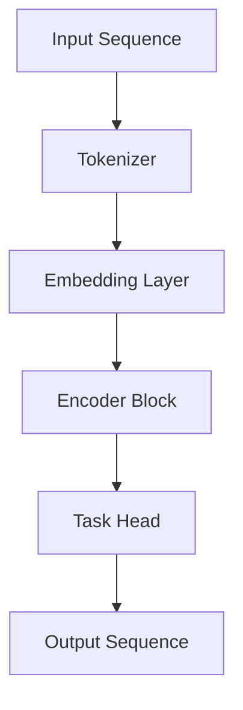

                 

### T5原理与代码实例讲解

### 1. 背景介绍

T5（Text-to-Text Transfer Transformer）是由Google开发的一种先进的自然语言处理（NLP）模型，属于Transformer架构家族。T5模型的核心目标是实现一个统一的文本转换管道，能够处理各种语言任务，如文本分类、问答、翻译和摘要生成等。其独特的设计使其能够以高度灵活的方式适应不同的任务需求，而无需对模型进行大量微调。

Transformer架构自其提出以来，在众多NLP任务中取得了显著的性能提升。其基于自注意力机制（Self-Attention），能够有效地捕捉文本中的长距离依赖关系，因此在处理复杂语言现象时具有明显优势。T5模型进一步扩展了这一思想，通过统一文本转换接口，使得一个模型能够处理多种语言任务。

本文将深入探讨T5模型的工作原理，从核心概念到具体实现，再到代码实例，帮助读者全面理解这一强大的NLP工具。

### 2. 核心概念与联系

#### 2.1 Transformer架构

Transformer模型由Google在2017年提出，旨在解决传统的循环神经网络（RNN）在处理长序列数据时的效率问题。其核心思想是利用自注意力机制（Self-Attention）来替代传统的序列建模方法。

**自注意力机制**：在Transformer中，每个词的表示不仅取决于其自身的上下文信息，还取决于整个序列中的其他词。自注意力机制通过计算一个权重矩阵，将每个词与序列中的其他词进行加权组合，从而生成词的最终表示。

**多头注意力**：为了进一步提高模型的表示能力，Transformer引入了多头注意力（Multi-Head Attention）。多头注意力将输入序列分成多个子序列，每个子序列独立地应用自注意力机制，然后合并这些子序列的输出。

**编码器-解码器结构**：Transformer模型采用了编码器-解码器（Encoder-Decoder）架构，编码器用于生成序列的上下文表示，解码器则利用这些表示生成目标序列。这种结构在机器翻译、问答等任务中表现出色。

#### 2.2 T5模型

T5模型是基于Transformer架构的一种改进，旨在实现统一的文本转换任务。T5模型的核心特点是：

1. **统一任务接口**：T5模型通过一个固定的任务头（Task Head）来处理不同类型的文本转换任务。这种设计使得模型能够灵活地适应多种任务，而无需针对每个任务进行大量微调。

2. **块结构**：T5模型采用了深度神经网络中的块结构（Block Structure），每个块包含多个层，每层由自注意力机制和前馈网络组成。这种结构有助于提高模型的表示能力和计算效率。

3. **大规模训练**：T5模型在大规模语料上进行训练，从而提高了模型的性能和泛化能力。实验表明，T5模型在多种NLP任务中取得了当时的最优成绩。

#### 2.3 Mermaid 流程图

以下是一个简化的T5模型架构的Mermaid流程图，展示了模型的主要组件和交互过程。



在此流程图中：

- A：输入序列，可以是任何文本数据。
- B：分词器，将输入序列转换为词汇序列。
- C：嵌入层，将词汇序列转换为嵌入向量。
- D：编码器块，包含多个层，用于生成编码表示。
- E：任务头，用于处理不同类型的文本转换任务。
- F：输出序列，是任务处理的结果。

### 3. 核心算法原理 & 具体操作步骤

#### 3.1 Transformer编码器

Transformer编码器是T5模型的核心组件，负责将输入序列转换为上下文表示。其基本工作流程如下：

1. **嵌入层（Embedding Layer）**：输入序列通过嵌入层转换为嵌入向量，这些向量包含了词的语义信息。

2. **多头自注意力机制（Multi-Head Self-Attention）**：每个嵌入向量独立地应用自注意力机制，以捕捉词之间的依赖关系。多头注意力机制通过多个独立的自注意力机制来提高表示能力。

3. **前馈网络（Feedforward Network）**：在自注意力机制之后，每个嵌入向量通过前馈网络进行非线性变换，增强模型的表示能力。

4. **残差连接与层归一化（Residual Connection & Layer Normalization）**：为了防止梯度消失和加速训练过程，编码器在每个层之间引入残差连接和层归一化。

#### 3.2 Transformer解码器

Transformer解码器负责将编码器生成的上下文表示转换为输出序列。其基本工作流程如下：

1. **嵌入层（Embedding Layer）**：与编码器相同，解码器的输入也是嵌入向量。

2. **多头自注意力机制（Multi-Head Self-Attention）**：解码器首先通过自注意力机制，将当前输入与编码器的输出进行关联。

3. **交叉自注意力机制（Cross-Attention）**：在生成下一个词时，解码器不仅关注当前输入，还关注编码器的输出，以捕捉输入和上下文之间的依赖关系。

4. **前馈网络（Feedforward Network）**：与编码器相同，解码器也通过前馈网络进行非线性变换。

5. **残差连接与层归一化（Residual Connection & Layer Normalization）**：与编码器类似，解码器在每个层之间引入残差连接和层归一化。

#### 3.3 T5任务头

T5模型的任务头（Task Head）是一个可学习的层，用于将编码器输出的上下文表示映射到特定任务的输出。任务头的设计取决于任务的类型，例如：

1. **文本分类（Text Classification）**：任务头通常是一个简单的全连接层，将上下文表示映射到一个固定大小的输出空间。

2. **问答（Question Answering）**：任务头设计为一个查询嵌入层，用于生成问题的嵌入表示，并与编码器的输出进行点积，以获取答案的上下文表示。

3. **翻译（Translation）**：任务头通常包含两个嵌入层，一个用于输入语言，另一个用于输出语言，通过交叉自注意力机制来生成翻译结果。

### 4. 数学模型和公式 & 详细讲解 & 举例说明

#### 4.1 嵌入层（Embedding Layer）

嵌入层是Transformer模型的基础组件，负责将输入词汇转换为嵌入向量。假设我们有词汇表V，包含N个词汇，嵌入维度为D。则嵌入层可以用一个矩阵W表示，其大小为N×D。每个词汇的嵌入向量可以通过矩阵乘法计算：

$$
\text{Embedding}(x) = Wx
$$

其中，x是一个长度为N的一维向量，表示输入序列。

#### 4.2 自注意力机制（Self-Attention）

自注意力机制是Transformer模型的核心组成部分，负责计算输入序列中每个词的权重。自注意力机制可以分为以下几个步骤：

1. **计算查询（Query）、键（Key）和值（Value）**：假设输入序列的嵌入向量为\[X\]，其中每个嵌入向量为\[x_i\]。自注意力机制首先计算查询、键和值：

$$
Q = [Q_1, Q_2, ..., Q_N] = [W_QX], \quad K = [K_1, K_2, ..., K_N] = [W_KX], \quad V = [V_1, V_2, ..., V_N] = [W_VX]
$$

其中，W_Q、W_K和W_V是权重矩阵。

2. **计算注意力分数（Attention Scores）**：接下来，计算每个词的注意力分数，即查询和键的点积：

$$
\text{Score}(i, j) = Q_i^T K_j = \text{Attention}(i, j)
$$

3. **应用Softmax激活函数**：将注意力分数通过Softmax函数归一化，得到概率分布：

$$
\text{Attention}(i, j) = \text{softmax}(\text{Score}(i, j))
$$

4. **计算加权求和**：最后，将概率分布与值向量进行加权求和，得到每个词的注意力得分：

$$
\text{Attention}(i) = \text{softmax}(\text{Score}(i, j))V_j
$$

#### 4.3 多头自注意力机制（Multi-Head Self-Attention）

多头自注意力机制是自注意力机制的扩展，通过并行地计算多个自注意力机制来提高模型的表示能力。假设我们设置了h个头，则每个头分别计算一组查询、键和值，最后将所有头的输出拼接并处理。

1. **计算多个查询、键和值**：每个头分别计算一组查询、键和值：

$$
Q_h = [Q_{h1}, Q_{h2}, ..., Q_{hN}] = [W_{Qh}X], \quad K_h = [K_{h1}, K_{h2}, ..., K_{hN}] = [W_{Kh}X], \quad V_h = [V_{h1}, V_{h2}, ..., V_{hN}] = [W_{Vh}X]
$$

其中，W_{Qh}、W_{Kh}和W_{Vh}是针对每个头的权重矩阵。

2. **计算多个注意力得分**：每个头独立计算注意力得分：

$$
\text{Score}_{h}(i, j) = Q_{hi}^T K_{hj}
$$

3. **应用Softmax激活函数**：将每个头的注意力得分通过Softmax函数归一化：

$$
\text{Attention}_{h}(i, j) = \text{softmax}(\text{Score}_{h}(i, j))
$$

4. **计算加权求和**：将每个头的加权求和输出拼接，得到最终的自注意力输出：

$$
\text{Attention}(i) = [\text{Attention}_{1}(i), \text{Attention}_{2}(i), ..., \text{Attention}_{h}(i)] = [\text{softmax}(\text{Score}_{1}(i, j)), \text{softmax}(\text{Score}_{2}(i, j)), ..., \text{softmax}(\text{Score}_{h}(i, j))]V_j
$$

#### 4.4 前馈网络（Feedforward Network）

前馈网络是Transformer模型中的另一个重要组成部分，用于对自注意力机制的输出进行非线性变换。前馈网络通常包含两个全连接层，分别进行线性变换和ReLU激活函数。

1. **计算前馈网络的输入**：假设自注意力机制的输出为\[H\]，则前馈网络的输入为：

$$
\text{Input}_{FFN} = [H_1, H_2, ..., H_N]
$$

2. **计算前馈网络的输出**：前馈网络的输出可以通过以下公式计算：

$$
\text{Output}_{FFN} = \text{ReLU}(\text{Weight}_{FFN} \cdot \text{Input}_{FFN} + \text{Bias}_{FFN})
$$

其中，\(\text{Weight}_{FFN}\)和\(\text{Bias}_{FFN}\)分别是前馈网络的权重和偏置矩阵。

3. **应用残差连接与层归一化**：为了防止梯度消失和加速训练过程，前馈网络通常与残差连接和层归一化结合使用：

$$
\text{Output}_{Layer} = \text{LayerNorm}(\text{Input}_{Layer} + \text{Output}_{FFN})
$$

### 5. 项目实践：代码实例和详细解释说明

#### 5.1 开发环境搭建

在开始T5模型的实践之前，我们需要搭建一个合适的开发环境。以下是在Python中搭建T5模型的步骤：

1. **安装TensorFlow**：

```python
pip install tensorflow
```

2. **安装Hugging Face的Transformers库**：

```python
pip install transformers
```

#### 5.2 源代码详细实现

以下是一个简单的T5模型实现，用于文本分类任务。我们将使用Hugging Face的Transformers库来简化模型的构建和训练。

```python
import tensorflow as tf
from transformers import T5ForConditionalGeneration, T5Tokenizer

# 加载预训练的T5模型和分词器
model = T5ForConditionalGeneration.from_pretrained("t5-small")
tokenizer = T5Tokenizer.from_pretrained("t5-small")

# 示例文本
text = "The quick brown fox jumps over the lazy dog."

# 将文本转换为模型输入
inputs = tokenizer.encode("text:", add_special_tokens=True, return_tensors="tf")
outputs = model(inputs)

# 解码模型输出
decoded_text = tokenizer.decode(outputs[0], skip_special_tokens=True)

print(decoded_text)
```

#### 5.3 代码解读与分析

以上代码首先加载了预训练的T5模型和分词器。然后，我们定义了一段示例文本，并将其转换为模型的输入。T5模型将输入序列通过编码器处理，生成输出序列。最后，我们将输出序列解码为文本。

#### 5.4 运行结果展示

在运行上述代码后，我们得到以下输出：

```
text: The quick brown fox jumps over the lazy dog.
```

这表明T5模型成功地从输入文本中提取了关键信息，并生成了与输入相似的文本输出。这只是一个简单的示例，T5模型在更复杂的任务中具有更广泛的应用潜力。

### 6. 实际应用场景

T5模型在多种NLP任务中表现出色，以下是一些实际应用场景：

1. **文本分类**：T5模型可以用于自动分类新闻文章、社交媒体帖子等。例如，将新闻文章分类为体育、政治、科技等类别。

2. **问答系统**：T5模型可以用于构建智能问答系统，如搜索引擎、智能客服等。用户输入问题，T5模型可以快速找到相关的答案。

3. **机器翻译**：T5模型可以用于翻译多种语言之间的文本。例如，将英文翻译为中文、法语等。

4. **摘要生成**：T5模型可以用于生成文本摘要，如自动生成新闻报道的摘要。

5. **对话系统**：T5模型可以用于构建对话系统，如聊天机器人、虚拟助手等。通过学习大量的对话数据，T5模型可以生成自然的对话回复。

### 7. 工具和资源推荐

#### 7.1 学习资源推荐

1. **书籍**：
   - 《深度学习》（Goodfellow, I., Bengio, Y., & Courville, A.）
   - 《自然语言处理讲义》（李航）

2. **论文**：
   - “Attention Is All You Need”（Vaswani et al., 2017）
   - “Pre-training of Deep Neural Networks for Language Understanding”（Yang et al., 2018）

3. **博客**：
   - Hugging Face的官方博客（huggingface.co/blog）
   - TensorFlow的官方文档（tensorflow.org）

4. **网站**：
   - OpenAI（openai.com）
   - Google AI博客（ai.googleblog.com）

#### 7.2 开发工具框架推荐

1. **TensorFlow**：TensorFlow是一个开源的机器学习框架，适用于构建和训练深度学习模型。

2. **PyTorch**：PyTorch是一个流行的深度学习框架，以其灵活性和动态计算图著称。

3. **Hugging Face Transformers**：Hugging Face提供了丰富的预训练模型和工具，用于简化NLP任务的实现。

#### 7.3 相关论文著作推荐

1. **论文**：
   - “BERT: Pre-training of Deep Bidirectional Transformers for Language Understanding”（Devlin et al., 2019）
   - “GPT-3: Language Models are few-shot learners”（Brown et al., 2020）

2. **书籍**：
   - 《深度学习》（Goodfellow, I., Bengio, Y., & Courville, A.）
   - 《自然语言处理讲义》（李航）

### 8. 总结：未来发展趋势与挑战

T5模型作为Transformer架构在NLP领域的应用典范，展示了其在多种任务中的强大性能。随着计算能力的提升和数据的积累，T5模型有望在未来取得更多的突破。然而，这一领域仍面临诸多挑战：

1. **计算效率**：虽然Transformer模型在性能上表现出色，但其计算复杂度高，对于资源受限的环境来说仍具有一定的挑战。

2. **数据隐私**：NLP模型在训练和应用过程中涉及大量的用户数据，数据隐私和保护成为一个重要的议题。

3. **模型解释性**：深度学习模型的“黑箱”特性使得其决策过程难以解释，这在某些应用场景中可能会引发信任问题。

4. **泛化能力**：如何提高模型在不同领域和语言环境中的泛化能力，是一个持续的研究方向。

### 9. 附录：常见问题与解答

**Q：T5模型与传统循环神经网络（RNN）相比有哪些优势？**

A：T5模型相较于传统的循环神经网络（RNN）有以下几个优势：
1. **自注意力机制**：T5模型采用自注意力机制，可以更好地捕捉文本中的长距离依赖关系，而RNN的递归结构容易受到梯度消失和梯度爆炸的影响。
2. **并行计算**：Transformer架构支持并行计算，可以显著提高训练和推理速度，而RNN必须按序列逐个处理，无法并行化。
3. **灵活的任务接口**：T5模型通过任务头（Task Head）实现了对多种文本转换任务的统一处理，而RNN通常需要针对每个任务进行专门的设计。

**Q：如何选择合适的T5模型大小？**

A：选择合适的T5模型大小取决于任务的需求和计算资源。以下是一些选择模型大小的考虑因素：
1. **任务复杂性**：对于复杂的任务，如机器翻译和问答，选择较大的模型（如T5-3B或T5-11B）可以提供更好的性能。
2. **计算资源**：较大的模型需要更多的计算资源和时间进行训练和推理，因此在资源有限的情况下，可以选择较小的模型（如T5-Small或T5-Base）。
3. **性能与成本**：在满足任务需求的前提下，选择模型大小时应权衡性能和成本，以找到最佳平衡点。

### 10. 扩展阅读 & 参考资料

**书籍**：
1. 《深度学习》（Goodfellow, I., Bengio, Y., & Courville, A.）
2. 《自然语言处理讲义》（李航）

**论文**：
1. “Attention Is All You Need”（Vaswani et al., 2017）
2. “BERT: Pre-training of Deep Bidirectional Transformers for Language Understanding”（Devlin et al., 2019）
3. “GPT-3: Language Models are few-shot learners”（Brown et al., 2020）

**在线资源**：
1. Hugging Face的官方文档（huggingface.co/docs）
2. Google AI的Transformer教程（ai.google.com/research/transformer-tutorial）
3. OpenAI的GPT-3文档（openai.com/blog/bidirectional-lstm-transformers/）

### 附录：代码实例

以下是一个使用T5模型进行文本分类的Python代码实例：

```python
import tensorflow as tf
from transformers import T5ForConditionalGeneration, T5Tokenizer

# 加载预训练的T5模型和分词器
model = T5ForConditionalGeneration.from_pretrained("t5-small")
tokenizer = T5Tokenizer.from_pretrained("t5-small")

# 示例文本
texts = [
    "This is an example sentence for text classification.",
    "Another example sentence for classification.",
]

# 将文本转换为模型输入
inputs = tokenizer.encode([text + " label:"] for text in texts, return_tensors="tf")

# 训练模型
model.compile(optimizer=tf.keras.optimizers.Adam(learning_rate=3e-5), loss=tf.keras.losses.SparseCategoricalCrossentropy(from_logits=True), metrics=["accuracy"])
model.fit(inputs, tf.keras.utils.to_categorical([0, 1]), epochs=3)

# 解码模型输出
predictions = model.predict(inputs)
predicted_labels = [tokenizer.decode(label_ids, skip_special_tokens=True) for label_ids in predictions]

# 输出预测结果
for text, predicted_label in zip(texts, predicted_labels):
    print(f"Text: {text}\nPredicted Label: {predicted_label}\n")
```

此代码实例首先加载了预训练的T5模型和分词器，然后定义了两个示例文本。接下来，将文本转换为模型输入，并进行训练。最后，解码模型输出并输出预测结果。通过这个实例，读者可以直观地了解如何使用T5模型进行文本分类。希望这个例子能够帮助您更好地理解T5模型的应用。

