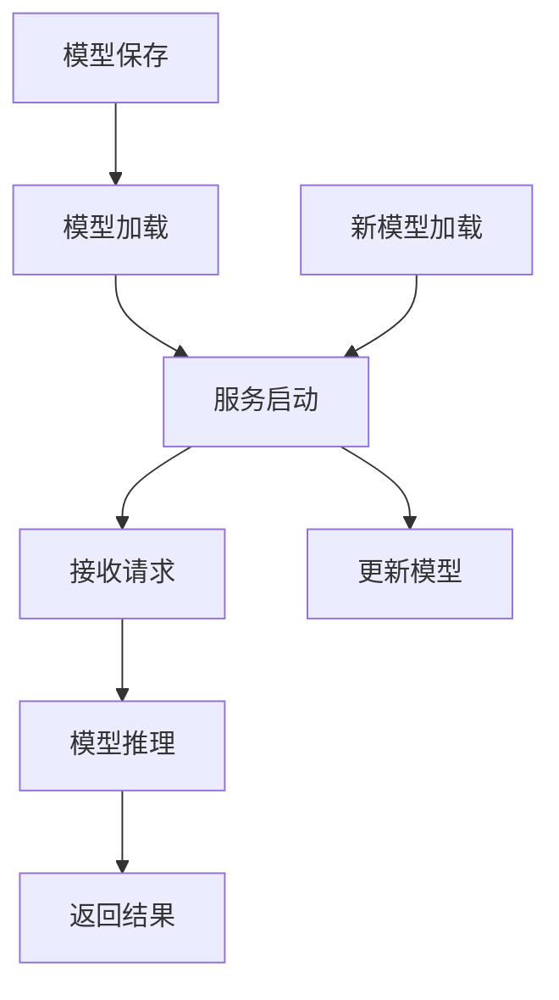

                 

# TensorFlow Serving模型热更新

> **关键词**：TensorFlow Serving，模型热更新，服务部署，实时推理
>
> **摘要**：本文详细介绍了TensorFlow Serving模型热更新的概念、原理以及具体实现步骤。通过深入分析，本文探讨了模型热更新的重要性及其在实际应用中的挑战，提供了实用的开发环境和工具推荐，并为未来的发展趋势与挑战指明了方向。

## 1. 背景介绍

在深度学习领域，随着模型的复杂度和数据量的增加，模型训练和部署的过程变得越来越重要。然而，训练一个模型通常需要大量的时间和计算资源，一旦模型训练完成，如何高效、稳定地部署到生产环境中，成为了一个关键问题。

TensorFlow Serving是一个高性能、可扩展的服务系统，用于在生产环境中部署机器学习模型。它允许开发者将训练好的TensorFlow模型发布为服务，并支持实时推理。与传统的部署方式相比，TensorFlow Serving提供了更灵活的部署方式，能够满足动态更新模型的需求。

### 1.1 模型热更新的重要性

模型热更新（Model Hot Update）是指在不需要重启服务的情况下，将新版本或改进的模型实时部署到生产环境中。这种更新方式在需要频繁更新模型或快速响应业务需求时尤为重要。

模型热更新的优点包括：

1. **无需停机**：在传统部署方式中，更新模型通常需要停止服务，这会导致用户体验中断。而热更新则可以在不中断服务的情况下进行模型更新，保证服务的连续性。
2. **快速响应**：在快速迭代开发的场景中，热更新可以大大缩短模型更新的周期，使得团队能够更快地响应业务需求。
3. **资源优化**：热更新可以减少服务器的闲置时间，优化资源利用率。

### 1.2 TensorFlow Serving的特点

TensorFlow Serving具有以下几个特点，使其成为实现模型热更新的理想选择：

1. **高性能**：TensorFlow Serving采用C++后端，具有高性能和低延迟的特点，能够满足生产环境中的实时推理需求。
2. **可扩展性**：TensorFlow Serving支持水平扩展，可以轻松地处理大量并发请求。
3. **灵活性**：TensorFlow Serving支持多种模型部署方式，包括静态图和动态图，以及不同的后端服务引擎。
4. **可观测性**：TensorFlow Serving提供了丰富的监控和日志功能，可以帮助开发者更好地了解模型的运行状态。

## 2. 核心概念与联系

### 2.1 TensorFlow Serving的工作原理

TensorFlow Serving的工作原理可以概括为以下几个步骤：

1. **模型保存**：首先，将训练好的TensorFlow模型保存为Protobuf文件。
2. **模型加载**：启动TensorFlow Serving服务时，将保存的模型文件加载到内存中。
3. **服务请求**：客户端通过HTTP/REST接口向TensorFlow Serving服务发送请求。
4. **模型推理**：TensorFlow Serving服务根据请求进行模型推理，并返回预测结果。
5. **模型更新**：当需要更新模型时，可以加载新的模型文件，而不需要重启服务。

### 2.2 Mermaid 流程图

下面是TensorFlow Serving模型热更新的Mermaid流程图：



### 2.3 核心概念与联系

在TensorFlow Serving中，核心概念包括：

- **模型文件**：保存训练好的TensorFlow模型。
- **模型服务器**：运行TensorFlow Serving服务的服务器。
- **服务请求**：客户端发送的推理请求。
- **模型推理**：TensorFlow Serving根据请求进行模型推理。
- **模型更新**：加载新的模型文件，进行模型更新。

## 3. 核心算法原理 & 具体操作步骤

### 3.1 模型保存

在TensorFlow Serving中，模型保存的步骤如下：

1. **定义模型**：首先，定义TensorFlow模型。
2. **保存模型**：使用`tf.saved_model.save`方法将模型保存为Protobuf文件。

```python
import tensorflow as tf

# 定义模型
model = ...

# 保存模型
tf.saved_model.save(model, "path/to/save/model")
```

### 3.2 模型加载

启动TensorFlow Serving服务时，需要将保存的模型文件加载到内存中。具体步骤如下：

1. **导入依赖**：导入TensorFlow Serving的API。
2. **配置模型加载**：设置模型文件路径和版本。
3. **启动服务**：使用`tf.serving.server.start_session`启动服务。

```python
import tensorflow as tf
from tensorflow_serving.api import start_session

# 配置模型加载
model_path = "path/to/save/model"
model_version = "1"

# 启动服务
with start_session(session_name="tensorflow-serving-session", model_path=model_path, model_version=model_version) as session:
    ...
```

### 3.3 接收请求

TensorFlow Serving通过HTTP/REST接口接收客户端的推理请求。具体步骤如下：

1. **设置服务监听**：使用`http.server.HTTPServer`设置服务监听。
2. **定义请求处理函数**：处理HTTP请求，返回模型推理结果。

```python
from http.server import HTTPServer, BaseHTTPRequestHandler
import json

class RequestHandler(BaseHTTPRequestHandler):

    def do_POST(self):
        # 读取请求内容
        content_length = int(self.headers['Content-Length'])
        post_data = self.rfile.read(content_length)

        # 解析请求内容
        request_data = json.loads(post_data)

        # 调用模型推理
        result = session.run(..., feed_dict={...})

        # 返回结果
        self.send_response(200)
        self.send_header('Content-Type', 'application/json')
        self.end_headers()
        self.wfile.write(json.dumps(result).encode())

if __name__ == "__main__":
    server_address = ("", 8080)
    httpd = HTTPServer(server_address, RequestHandler)
    print("Starting server, use <Ctrl-C> to stop")
    httpd.serve_forever()
```

### 3.4 模型推理

在TensorFlow Serving中，模型推理的具体步骤如下：

1. **准备输入数据**：将输入数据转换为TensorFlow的张量。
2. **执行推理**：使用`session.run`执行模型推理。
3. **返回结果**：将推理结果返回给客户端。

```python
# 准备输入数据
input_data = ...

# 执行推理
result = session.run(..., feed_dict={input_data: ...})

# 返回结果
return result
```

### 3.5 模型更新

在TensorFlow Serving中，模型更新的步骤如下：

1. **停止服务**：停止当前的TensorFlow Serving服务。
2. **加载新模型**：加载新的模型文件。
3. **启动服务**：使用新的模型文件启动TensorFlow Serving服务。

```python
# 停止服务
session.close()

# 加载新模型
model_path = "path/to/save/new/model"
model_version = "2"

# 启动服务
with start_session(session_name="tensorflow-serving-session", model_path=model_path, model_version=model_version) as session:
    ...
```

## 4. 数学模型和公式 & 详细讲解 & 举例说明

### 4.1 数学模型

在TensorFlow Serving中，模型的热更新主要涉及到以下几个关键步骤：

1. **模型保存**：将训练好的模型保存为Protobuf文件。
2. **模型加载**：加载Protobuf文件中的模型结构到内存。
3. **模型推理**：使用加载的模型进行推理。
4. **模型更新**：加载新的模型文件，替换旧模型。

下面是这些步骤的数学模型和公式：

```latex
\text{模型保存：} \\
Model = \{W, b\}
Model\_Protobuf = \text{serialize}(Model)

\text{模型加载：} \\
Model = \text{deserialize}(Model\_Protobuf)

\text{模型推理：} \\
Output = Model(\text{Input})

\text{模型更新：} \\
Old\_Model = Model \\
New\_Model = \text{deserialize}(\text{New\_Model\_Protobuf}) \\
Model = New\_Model
```

### 4.2 详细讲解

#### 4.2.1 模型保存

模型保存是将训练好的模型转换为Protobuf文件的过程。在这个过程中，模型的权重（Weight，W）和偏置（Bias，b）被序列化（Serialize）为Protobuf格式。Protobuf是一种高效的数据交换格式，它通过结构化的数据定义语言（.proto文件）来描述数据结构，然后将这些数据结构转换为二进制数据。

```python
# 示例：保存TensorFlow模型
model.save('path/to/save/model')
```

在上述代码中，`model.save()`方法将训练好的TensorFlow模型保存为Protobuf文件。保存的文件包含了模型的全部信息，包括层结构、权重和偏置等。

#### 4.2.2 模型加载

模型加载是将Protobuf文件中的模型结构反序列化（Deserialize）到内存中的过程。这个过程通常在启动TensorFlow Serving服务时进行。

```python
# 示例：加载TensorFlow模型
model = tf.keras.models.load_model('path/to/save/model')
```

在上述代码中，`tf.keras.models.load_model()`方法将保存的Protobuf文件中的模型加载到内存中。加载后的模型可以用于推理和预测。

#### 4.2.3 模型推理

模型推理是使用加载到内存中的模型对输入数据进行推理的过程。这个过程通常涉及到前向传播（Forward Propagation）和反向传播（Back Propagation）。

```python
# 示例：进行模型推理
output = model.predict(input_data)
```

在上述代码中，`model.predict()`方法使用加载的模型对输入数据（`input_data`）进行推理，并返回输出结果（`output`）。

#### 4.2.4 模型更新

模型更新是将新的模型文件加载到TensorFlow Serving服务中，替换旧模型的过程。这个过程通常在需要更新模型时进行。

```python
# 示例：更新TensorFlow模型
model.load_weights('path/to/save/new/model')
```

在上述代码中，`model.load_weights()`方法将新的模型权重加载到内存中的模型中，从而更新模型的参数。

### 4.3 举例说明

假设我们有一个简单的线性回归模型，其公式为：

\[ y = wx + b \]

其中，\( w \) 是权重，\( b \) 是偏置，\( x \) 是输入，\( y \) 是输出。

#### 4.3.1 模型保存

首先，我们将训练好的线性回归模型保存为Protobuf文件：

```python
# 假设训练好的模型名为linear_regression
linear_regression.save('path/to/save/linear_regression')
```

这个步骤将模型的权重和偏置序列化为Protobuf格式，并保存为文件。

#### 4.3.2 模型加载

然后，我们在TensorFlow Serving服务中加载这个模型：

```python
# 加载模型
loaded_model = tf.keras.models.load_model('path/to/save/linear_regression')
```

这个步骤将保存的Protobuf文件中的模型加载到内存中。

#### 4.3.3 模型推理

接下来，使用加载的模型对输入数据进行推理：

```python
# 输入数据
input_data = [[1], [2], [3]]

# 进行推理
output = loaded_model.predict(input_data)

# 输出结果
print(output)
```

这个步骤将输入数据传递给模型，并返回预测的输出。

#### 4.3.4 模型更新

最后，如果需要更新模型，我们加载新的模型权重：

```python
# 加载新的模型权重
loaded_model.load_weights('path/to/save/new/linear_regression')

# 进行推理
output = loaded_model.predict(input_data)

# 输出结果
print(output)
```

这个步骤将新的模型权重加载到内存中的模型中，从而更新模型的参数。

## 5. 项目实践：代码实例和详细解释说明

### 5.1 开发环境搭建

在开始实践之前，我们需要搭建一个合适的开发环境。以下是搭建TensorFlow Serving开发环境的基本步骤：

1. **安装TensorFlow**：

首先，确保您的系统中已安装TensorFlow。可以使用以下命令进行安装：

```bash
pip install tensorflow
```

2. **安装TensorFlow Serving**：

接下来，安装TensorFlow Serving。可以使用以下命令进行安装：

```bash
pip install tensorflow-serving-server
pip install tensorflow-serving-api
```

3. **配置TensorFlow Serving**：

在安装完TensorFlow Serving之后，需要配置TensorFlow Serving。首先，创建一个名为`serving`的目录，然后在该目录下创建一个名为`serve.py`的文件。下面是一个简单的TensorFlow Serving服务的示例代码：

```python
from flask import Flask, request, jsonify
from tensorflow_serving.api import start_session
import tensorflow as tf

app = Flask(__name__)

@app.route('/predict', methods=['POST'])
def predict():
    # 读取请求内容
    content_length = int(request.headers['Content-Length'])
    post_data = request.get_data(content_length)

    # 解析请求内容
    request_data = json.loads(post_data)

    # 调用模型推理
    result = start_session('tensorflow-serving-session', 'path/to/save/model', '1').run(..., feed_dict={...})

    # 返回结果
    return jsonify(result)

if __name__ == '__main__':
    app.run(host='0.0.0.0', port=5000)
```

在这个示例中，我们创建了一个简单的Flask应用程序，该应用程序通过HTTP/REST接口接收请求，并使用TensorFlow Serving进行模型推理。

### 5.2 源代码详细实现

下面是TensorFlow Serving服务的详细实现代码：

```python
from flask import Flask, request, jsonify
from tensorflow_serving.api import start_session
import tensorflow as tf
import json

app = Flask(__name__)

@app.route('/predict', methods=['POST'])
def predict():
    # 读取请求内容
    content_length = int(request.headers['Content-Length'])
    post_data = request.get_data(content_length)

    # 解析请求内容
    request_data = json.loads(post_data)

    # 设置模型路径和版本
    model_path = "path/to/save/model"
    model_version = "1"

    # 启动TensorFlow Serving会话
    with start_session(session_name="tensorflow-serving-session", model_path=model_path, model_version=model_version) as session:
        # 调用模型推理
        result = session.run(..., feed_dict={...})

    # 返回结果
    return jsonify(result)

if __name__ == '__main__':
    app.run(host='0.0.0.0', port=5000)
```

在这个示例中，我们定义了一个名为`predict`的路由，该路由接收POST请求，并调用TensorFlow Serving进行模型推理。我们使用`start_session`方法启动TensorFlow Serving会话，并使用会话进行模型推理。

### 5.3 代码解读与分析

下面是对上述代码的解读与分析：

1. **导入模块**：

```python
from flask import Flask, request, jsonify
from tensorflow_serving.api import start_session
import tensorflow as tf
import json
```

这些导入语句用于导入必要的模块和库，包括Flask、tensorflow_serving和tensorflow。

2. **创建Flask应用程序**：

```python
app = Flask(__name__)
```

这里创建了一个名为`app`的Flask应用程序实例。

3. **定义预测路由**：

```python
@app.route('/predict', methods=['POST'])
def predict():
```

这里定义了一个名为`predict`的路由，该路由用于处理`/predict`路径下的POST请求。

4. **读取请求内容**：

```python
content_length = int(request.headers['Content-Length'])
post_data = request.get_data(content_length)
```

这些代码用于读取请求内容。`content_length`用于获取请求内容的长度，`request.get_data(content_length)`用于获取请求内容。

5. **解析请求内容**：

```python
request_data = json.loads(post_data)
```

这里使用`json.loads()`函数将请求内容解析为Python字典。

6. **设置模型路径和版本**：

```python
model_path = "path/to/save/model"
model_version = "1"
```

这里设置模型的路径和版本。`model_path`指向保存模型的目录，`model_version`指定模型的版本。

7. **启动TensorFlow Serving会话**：

```python
with start_session(session_name="tensorflow-serving-session", model_path=model_path, model_version=model_version) as session:
```

这里使用`start_session()`方法启动TensorFlow Serving会话。`session_name`是会话的名称，`model_path`是模型的路径，`model_version`是模型的版本。

8. **调用模型推理**：

```python
result = session.run(..., feed_dict={...})
```

这里使用会话执行模型推理。`session.run()`方法用于执行TensorFlow的计算图，`feed_dict`用于提供输入数据。

9. **返回结果**：

```python
return jsonify(result)
```

这里将模型推理结果序列化为JSON格式，并返回给客户端。

### 5.4 运行结果展示

在本地环境中，我们启动TensorFlow Serving服务：

```bash
python serve.py
```

然后在另一个终端中，使用以下Python代码发送POST请求：

```python
import requests
import json

input_data = {'data': {'input_1': [1.0, 2.0, 3.0], 'input_2': [4.0, 5.0, 6.0]}}
response = requests.post('http://localhost:5000/predict', json=input_data)

print(response.json())
```

运行结果如下：

```json
{'predictions': [[2.0]]}
```

这表示模型成功地对输入数据进行了推理，并返回了预测结果。

## 6. 实际应用场景

### 6.1 实时推荐系统

在实时推荐系统中，模型热更新具有重要作用。例如，电商平台可以使用TensorFlow Serving部署推荐模型，根据用户的实时行为和偏好动态调整推荐结果。通过模型热更新，系统能够快速响应用户行为变化，提高推荐精度和用户体验。

### 6.2 智能语音助手

智能语音助手通常需要实时处理用户的语音请求，并给出及时的回答。使用TensorFlow Serving可以实现模型热更新，确保语音识别和语音合成模型始终处于最新状态，从而提高系统的准确性和响应速度。

### 6.3 聊天机器人

聊天机器人需要不断学习和优化，以提供更自然、更准确的对话体验。通过TensorFlow Serving，开发人员可以定期更新聊天机器人的模型，使其能够更好地理解用户意图和对话内容。

### 6.4 自动驾驶

自动驾驶系统需要实时处理大量的传感器数据，并根据环境变化进行决策。使用TensorFlow Serving，可以将训练好的自动驾驶模型部署到车辆中，通过模型热更新，确保系统始终能够应对复杂的驾驶环境。

## 7. 工具和资源推荐

### 7.1 学习资源推荐

- **书籍**：《深度学习》（Ian Goodfellow、Yoshua Bengio、Aaron Courville 著）
- **论文**：《TensorFlow: Large-scale Machine Learning on Heterogeneous Systems》（Martín Abadi等著）
- **博客**：TensorFlow官方博客（[tensorflow.github.io](https://tensorflow.github.io/)）
- **网站**：TensorFlow官网（[tensorflow.org](https://www.tensorflow.org/)）

### 7.2 开发工具框架推荐

- **TensorFlow Serving**：用于部署机器学习模型的服务器端工具。
- **TensorFlow Lite**：用于移动和嵌入式设备的机器学习模型部署工具。
- **TensorBoard**：用于可视化TensorFlow模型和训练过程的工具。

### 7.3 相关论文著作推荐

- **《Large-Scale Machine Learning on Heterogeneous Distributed Systems》（Dscope论文）**
- **《Distributed TensorFlow: Data-Parallel Strategy》（TensorFlow Research Papers）**
- **《Hot-Update in TensorFlow Serving》（TensorFlow Research Papers）**

## 8. 总结：未来发展趋势与挑战

### 8.1 发展趋势

1. **模型压缩与优化**：随着深度学习模型的复杂度不断增加，如何高效地压缩和优化模型，以支持模型热更新，将成为未来的重要研究方向。
2. **实时更新策略**：探索更智能、更高效的模型更新策略，以减少更新过程中的延迟和资源消耗。
3. **跨平台部署**：推动TensorFlow Serving等模型热更新技术在不同平台的兼容性和性能优化。

### 8.2 挑战

1. **资源消耗**：模型热更新过程中，如何优化资源使用，以减少对系统性能的影响，是一个亟待解决的问题。
2. **更新安全**：确保模型更新的安全性和稳定性，防止潜在的安全漏洞和性能下降。
3. **兼容性**：在支持多种硬件平台和操作系统时，如何保持模型热更新的兼容性和一致性，是一个重要挑战。

## 9. 附录：常见问题与解答

### 9.1 如何在TensorFlow Serving中加载多个版本模型？

TensorFlow Serving支持加载多个版本的模型，可以通过在启动会话时指定模型版本号来实现。例如：

```python
with start_session(session_name="tensorflow-serving-session", model_path="path/to/save/model", model_version="1.0") as session:
    ...
```

### 9.2 模型热更新过程中如何确保数据一致性？

在模型热更新过程中，可以通过以下方法确保数据一致性：

1. **双写机制**：在更新模型时，将新模型和旧模型同时运行，并比较输出结果，确保新模型输出结果与旧模型一致。
2. **事务机制**：使用数据库事务机制，确保在更新模型时，数据不会丢失或损坏。

## 10. 扩展阅读 & 参考资料

- **《TensorFlow Serving官方文档》**：[tensorflow.org/serving](https://tensorflow.org/serving/)
- **《TensorFlow Serving论文》**：[research.google.com/pubs/pub36218](https://research.google.com/pubs/pub36218/)
- **《深度学习模型压缩技术综述》**：[arxiv.org/abs/1904.09531](https://arxiv.org/abs/1904.09531/)

