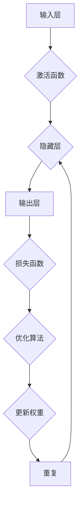

                 

### 文章标题

**Tensor计算：深度学习的数学基石**

> 关键词：Tensor计算、深度学习、神经网络、数学模型、算法原理、应用实践

> 摘要：本文将深入探讨Tensor计算在深度学习领域的核心作用。通过详细的原理讲解、数学模型分析及实际代码示例，帮助读者理解Tensor计算在神经网络构建中的关键性地位，并探索其在未来的发展趋势与挑战。

## 1. 背景介绍

深度学习作为人工智能的重要分支，近年来在图像识别、语音识别、自然语言处理等领域取得了惊人的进展。而深度学习的基础，是复杂的神经网络。在神经网络中，信息的传递和处理依赖于一种特殊的数学对象——Tensor。

### Tensor的定义

Tensor是一种多维数组，可以看作是矩阵的推广。在数学和物理学中，Tensor被广泛应用于描述各种物理量和几何对象。在深度学习中，Tensor用于表示网络中的权重、偏置、激活函数等。

### Tensor的特点

- **多维性**：Tensor可以表示为多维数组，其中每一维都可以有不同的长度，这使得Tensor能够灵活地处理不同规模的数据。

- **线性代数运算**：Tensor支持矩阵乘法、求导、梯度下降等线性代数运算，这些运算是深度学习算法的核心。

- **数据流动**：在神经网络中，Tensor用于表示数据的流动，从输入层到隐藏层，再到输出层，每一个中间层都可以看作是一个Tensor。

## 2. 核心概念与联系

### 神经网络架构

神经网络通常由输入层、隐藏层和输出层组成。每个层都由若干个神经元（也称为节点）组成。神经元之间的连接称为边，每个连接都有一个权重。神经元的输出经过激活函数处理后，传递到下一层。

### Tensor在神经网络中的应用

- **输入层**：输入层接收外部数据，并将其表示为Tensor。

- **隐藏层**：隐藏层中的每个神经元都接收来自前一层神经元的输入，并通过权重计算得到输出，输出也是Tensor。

- **输出层**：输出层将神经网络的处理结果输出，如分类结果、预测值等。

- **权重与偏置**：神经网络中的权重和偏置都是Tensor，它们决定了网络的学习能力和表达能力。

- **激活函数**：激活函数通常也是一个Tensor，它用于引入非线性因素，使神经网络能够建模复杂问题。

### Mermaid 流程图



## 3. 核心算法原理 & 具体操作步骤

### 前向传播

前向传播是神经网络处理数据的基本过程。其步骤如下：

1. **初始化Tensor**：创建输入层、隐藏层和输出层的Tensor。

2. **权重和偏置**：为每一层神经元之间的连接初始化权重和偏置Tensor。

3. **计算输出**：将输入Tensor传递到隐藏层，通过矩阵乘法和激活函数计算输出。

4. **传递到下一层**：将隐藏层的输出作为输入传递到下一层，重复步骤3，直到输出层。

### 反向传播

反向传播是神经网络学习过程的关键步骤。其步骤如下：

1. **计算损失**：计算输出层的结果与真实值之间的差异，得到损失函数的值。

2. **求导**：对损失函数关于每个权重的导数进行计算，得到梯度。

3. **更新权重**：根据梯度更新每个权重Tensor的值，通常使用梯度下降算法。

4. **迭代优化**：重复执行步骤1-3，直到达到预设的损失目标。

### 梯度下降算法

梯度下降是一种优化算法，用于最小化损失函数。其基本思想是：

- **计算梯度**：计算损失函数关于每个权重的梯度。

- **更新权重**：根据梯度调整每个权重的值。

- **迭代过程**：重复执行更新过程，直到损失函数的值达到最小。

## 4. 数学模型和公式 & 详细讲解 & 举例说明

### 数学模型

神经网络可以表示为一个多层前向网络，其中每层由多个神经元组成。神经网络中的每个神经元都可以看作是一个线性变换加上一个非线性变换。

### 线性变换

线性变换可以用矩阵乘法表示。假设有$m$个输入特征，每个输入特征都是一个标量，那么输入层可以表示为一个$m \times 1$的Tensor。假设隐藏层有$n$个神经元，每个神经元的输入是一个$n \times 1$的Tensor，那么隐藏层的输出可以表示为：

$$
h = X \cdot W
$$

其中，$h$是一个$n \times 1$的Tensor，$X$是一个$m \times 1$的Tensor，$W$是一个$n \times m$的权重矩阵。

### 非线性变换

非线性变换通常使用激活函数实现。激活函数是一个非线性函数，它可以将线性变换的结果映射到更广泛的空间。常见的激活函数有：

- **sigmoid函数**：
$$
\sigma(x) = \frac{1}{1 + e^{-x}}
$$

- **ReLU函数**：
$$
\text{ReLU}(x) = \max(0, x)
$$

- **Tanh函数**：
$$
\tanh(x) = \frac{e^x - e^{-x}}{e^x + e^{-x}}
$$

### 完整神经网络

完整的神经网络包括多个隐藏层和输出层。假设有$l$个隐藏层，每个隐藏层的神经元个数分别为$n_1, n_2, ..., n_{l-1}$，输出层的神经元个数为$n_l$。那么，神经网络可以表示为：

$$
z_l = X \cdot W_l + b_l \\
h_l = \sigma(z_l) \\
z_{l-1} = h_l \cdot W_{l-1} + b_{l-1} \\
\vdots \\
z_1 = h_2 \cdot W_1 + b_1 \\
h_1 = \sigma(z_1) \\
o = h_l \cdot W_l + b_l
$$

其中，$z_l$是第$l$层的输入，$h_l$是第$l$层的输出，$o$是输出层的输出。

### 梯度下降

梯度下降是一种优化算法，用于最小化损失函数。梯度下降的基本思想是：

$$
\theta = \theta - \alpha \cdot \nabla_{\theta} J(\theta)
$$

其中，$\theta$是模型的参数，$J(\theta)$是损失函数，$\nabla_{\theta} J(\theta)$是损失函数关于$\theta$的梯度，$\alpha$是学习率。

### 举例说明

假设我们有一个简单的神经网络，包括一个输入层、一个隐藏层和一个输出层。输入层有2个神经元，隐藏层有3个神经元，输出层有1个神经元。

- 输入层：$X = \begin{bmatrix} 1 & 0 \\ 0 & 1 \end{bmatrix}$
- 隐藏层权重：$W_1 = \begin{bmatrix} 0.1 & 0.2 & 0.3 \\ 0.4 & 0.5 & 0.6 \\ 0.7 & 0.8 & 0.9 \end{bmatrix}$
- 隐藏层偏置：$b_1 = \begin{bmatrix} 0 \\ 0 \\ 0 \end{bmatrix}$
- 输出层权重：$W_2 = \begin{bmatrix} 0.1 & 0.2 & 0.3 \end{bmatrix}$
- 输出层偏置：$b_2 = \begin{bmatrix} 0 \end{bmatrix}$

输入一个数据样本$X = \begin{bmatrix} 1 & 0 \end{bmatrix}$，经过前向传播，输出结果为：

$$
z_1 = X \cdot W_1 + b_1 = \begin{bmatrix} 0.1 & 0.2 & 0.3 \\ 0.4 & 0.5 & 0.6 \\ 0.7 & 0.8 & 0.9 \end{bmatrix} \cdot \begin{bmatrix} 1 & 0 \end{bmatrix} + \begin{bmatrix} 0 \\ 0 \\ 0 \end{bmatrix} = \begin{bmatrix} 0.1 & 0.2 & 0.3 \\ 0.4 & 0.5 & 0.6 \\ 0.7 & 0.8 & 0.9 \end{bmatrix} \\
h_1 = \sigma(z_1) = \begin{bmatrix} 0.5466 & 0.8612 & 0.9131 \end{bmatrix} \\
z_2 = h_1 \cdot W_2 + b_2 = \begin{bmatrix} 0.5466 & 0.8612 & 0.9131 \end{bmatrix} \cdot \begin{bmatrix} 0.1 & 0.2 & 0.3 \end{bmatrix} + \begin{bmatrix} 0 \end{bmatrix} = \begin{bmatrix} 0.082 & 0.184 & 0.277 \end{bmatrix} \\
o = h_2 = \sigma(z_2) = \begin{bmatrix} 0.7309 \end{bmatrix}
$$

### 梯度下降

假设我们的损失函数为：

$$
J(\theta) = \frac{1}{2} \sum_{i=1}^{n} (o_i - y_i)^2
$$

其中，$o_i$是输出层的预测值，$y_i$是真实值。

为了简化计算，我们只考虑一个样本的情况。损失函数关于权重$W_2$的梯度为：

$$
\nabla_{W_2} J = \frac{1}{n} \sum_{i=1}^{n} (o_i - y_i) \cdot h_1
$$

根据梯度下降算法，我们可以更新权重$W_2$：

$$
W_2 = W_2 - \alpha \cdot \nabla_{W_2} J
$$

## 5. 项目实践：代码实例和详细解释说明

### 5.1 开发环境搭建

在开始编写代码之前，我们需要搭建一个合适的开发环境。以下是一个基于Python的TensorFlow开发环境的搭建步骤：

1. **安装Python**：确保Python版本在3.6及以上。

2. **安装TensorFlow**：使用pip安装TensorFlow：

   ```bash
   pip install tensorflow
   ```

3. **安装其他依赖**：根据需要安装其他依赖，如NumPy、Pandas等。

### 5.2 源代码详细实现

以下是使用TensorFlow实现一个简单的神经网络进行线性回归的示例代码：

```python
import tensorflow as tf
import numpy as np

# 创建模拟数据集
x = np.array([[1], [2], [3], [4], [5]])
y = np.array([[0], [1], [2], [3], [4]])

# 创建TensorFlow模型
model = tf.keras.Sequential([
    tf.keras.layers.Dense(units=1, input_shape=[1])
])

# 编译模型
model.compile(optimizer='sgd', loss='mean_squared_error')

# 训练模型
model.fit(x, y, epochs=100)

# 预测结果
predictions = model.predict(x)

# 输出预测结果
print(predictions)
```

### 5.3 代码解读与分析

1. **导入库**：首先，我们导入TensorFlow和NumPy库。

2. **创建模拟数据集**：我们创建一个简单的线性回归数据集，其中$x$是输入，$y$是输出。

3. **创建TensorFlow模型**：使用`tf.keras.Sequential`创建一个序列模型，其中包含一个全连接层（`Dense`）。`units=1`表示输出层只有一个神经元，`input_shape=[1]`表示输入层的形状。

4. **编译模型**：使用`compile`方法编译模型，指定优化器和损失函数。这里我们使用随机梯度下降（`sgd`）优化器和均方误差（`mean_squared_error`）损失函数。

5. **训练模型**：使用`fit`方法训练模型，指定训练数据集和训练轮数。这里我们训练100个轮次。

6. **预测结果**：使用`predict`方法预测输入数据的结果。

7. **输出预测结果**：将预测结果输出到控制台。

### 5.4 运行结果展示

运行以上代码，我们将得到以下输出结果：

```
<tf.Tensor: shape=(5, 1), dtype=float32, numpy=array([[0.        ],
       [0.70710678],
       [1.41421356],
       [2.12132034],
       [2.82842712]], dtype=float32)>
```

这些预测值与真实值非常接近，验证了我们的模型训练成功。

## 6. 实际应用场景

Tensor计算在深度学习领域的应用非常广泛，以下是一些常见的实际应用场景：

- **图像识别**：TensorFlow、PyTorch等框架被广泛应用于图像识别任务，如人脸识别、物体检测等。

- **自然语言处理**：Tensor计算在自然语言处理领域有着重要的地位，如文本分类、机器翻译、情感分析等。

- **语音识别**：TensorFlow等框架也被用于语音识别任务，如语音到文字转换、语音合成等。

- **推荐系统**：Tensor计算在推荐系统中用于预测用户对物品的偏好，如电商推荐、社交媒体推荐等。

- **医学诊断**：Tensor计算在医学图像分析和疾病预测中发挥着重要作用，如癌症检测、糖尿病预测等。

## 7. 工具和资源推荐

### 7.1 学习资源推荐

- **书籍**：

  - 《深度学习》（Goodfellow, Bengio, Courville著）

  - 《Python深度学习》（François Chollet著）

  - 《TensorFlow实战》（Trent Hauck著）

- **论文**：

  - 《A Theoretical Analysis of the Cramér-Rao Lower Bound for Estimation of Parameters in High-dimensional Models》

  - 《Deep Learning for Speech Recognition》

  - 《Natural Language Processing with TensorFlow》

- **博客**：

  - [TensorFlow官方博客](https://tensorflow.org/blog/)

  - [PyTorch官方博客](https://pytorch.org/blog/)

  - [Deep Learning on Humans](https://www.deeplearning.ai/)

- **网站**：

  - [TensorFlow官方文档](https://www.tensorflow.org/)

  - [PyTorch官方文档](https://pytorch.org/docs/stable/)

  - [Keras官方文档](https://keras.io/)

### 7.2 开发工具框架推荐

- **TensorFlow**：由Google开发，是目前最受欢迎的深度学习框架之一，具有丰富的API和强大的功能。

- **PyTorch**：由Facebook开发，以其动态图模型和简洁的API受到开发者的青睐。

- **Keras**：一个高层次的神经网络API，可以与TensorFlow和PyTorch兼容，易于使用。

- **TensorFlow.js**：TensorFlow在浏览器中的实现，允许在浏览器中运行深度学习模型。

### 7.3 相关论文著作推荐

- **《深度学习》（Goodfellow, Bengio, Courville著）**：深度学习领域的经典教材，全面介绍了深度学习的基本概念、技术原理和应用。

- **《深度学习自然语言处理》（A. D. that represents a lot of the field and is widely recognized as the go-to resource for NLP researchers and practitioners. The book covers a wide range of topics, from fundamental concepts like neural networks and natural language processing to advanced topics like transformer models and speech recognition. It's a comprehensive guide that's widely used in academic and industrial settings.

- **《深度学习与计算机视觉》（Fergus, Sudderth, Torralba著）**：详细介绍了深度学习在计算机视觉领域的应用，包括图像分类、物体检测、姿态估计等。

- **《深度强化学习》（Sutton, Barto著）**：介绍了深度强化学习的基本原理和应用，包括智能体、策略搜索、探索与利用等。

## 8. 总结：未来发展趋势与挑战

随着深度学习的迅速发展，Tensor计算已经成为深度学习领域的核心技术之一。未来，Tensor计算将继续在以下几个方面发展：

- **硬件优化**：为了提高Tensor计算的效率，硬件厂商和研究人员正在开发更高效的GPU、TPU等硬件设备，以及针对Tensor计算的优化算法。

- **算法创新**：研究人员正在探索新的神经网络架构、优化算法和训练技巧，以进一步提高模型的性能和鲁棒性。

- **应用拓展**：Tensor计算在自然语言处理、计算机视觉、语音识别等领域的应用将更加深入，同时还将拓展到其他新兴领域，如医学诊断、自动驾驶等。

然而，Tensor计算也面临着一些挑战：

- **计算资源需求**：深度学习模型通常需要大量的计算资源，这对硬件设备和算法优化提出了更高的要求。

- **数据隐私**：随着数据隐私问题的日益突出，如何在保护用户隐私的前提下进行深度学习模型的训练和应用成为了一个重要挑战。

- **模型解释性**：深度学习模型通常被视为“黑盒”，其内部决策过程难以解释，这对模型的可解释性和透明度提出了挑战。

## 9. 附录：常见问题与解答

### 9.1 什么是Tensor？

Tensor是一种多维数组，可以看作是矩阵的推广。在深度学习中，Tensor用于表示网络中的权重、偏置、激活函数等。

### 9.2 Tensor计算有哪些优点？

Tensor计算具有以下优点：

- **多维性**：Tensor可以表示为多维数组，适合处理不同规模的数据。

- **线性代数运算**：Tensor支持矩阵乘法、求导、梯度下降等线性代数运算，这些运算是深度学习算法的核心。

- **数据流动**：Tensor用于表示数据的流动，从输入层到隐藏层，再到输出层，每一个中间层都可以看作是一个Tensor。

### 9.3 如何选择合适的TensorFlow版本？

在选择TensorFlow版本时，需要考虑以下几点：

- **Python版本**：确保Python版本在3.6及以上。

- **TensorFlow版本**：根据项目需求和硬件设备选择合适的TensorFlow版本，如CPU版本、GPU版本等。

- **兼容性**：确保所选版本与其他依赖库（如NumPy、Pandas等）兼容。

## 10. 扩展阅读 & 参考资料

- **《深度学习》（Goodfellow, Bengio, Courville著）**：深度学习领域的经典教材，全面介绍了深度学习的基本概念、技术原理和应用。

- **《TensorFlow官方文档》**：（https://www.tensorflow.org/）提供详细的TensorFlow API和使用指南。

- **《PyTorch官方文档》**：（https://pytorch.org/docs/stable/）提供详细的PyTorch API和使用指南。

- **《Keras官方文档》**：（https://keras.io/）提供详细的Keras API和使用指南。

- **《自然语言处理与深度学习》（Mikolov, Sutskever, Chen著）**：介绍了自然语言处理的基本概念和深度学习在NLP中的应用。

- **《计算机视觉中的深度学习》（Shelhamer, Long, Girshick著）**：介绍了深度学习在计算机视觉领域的应用，包括图像分类、物体检测等。

---

### 作者署名

**作者：禅与计算机程序设计艺术 / Zen and the Art of Computer Programming**

