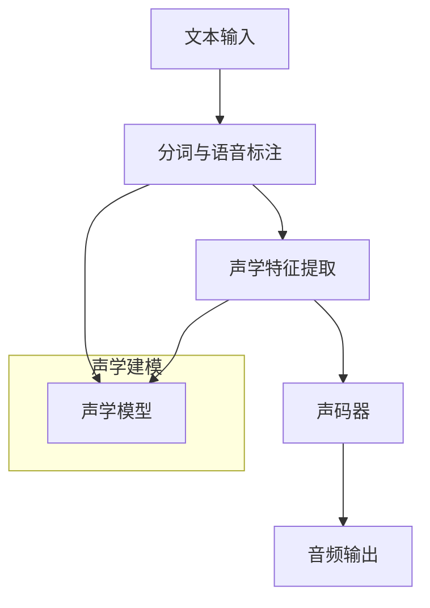

                 

### 1. 背景介绍

Text-to-Speech（TTS，即文本到语音）技术是一种将书面文本转换成自然流畅语音的技术，这一技术在日常生活中的应用非常广泛。从语音合成助手、导航系统，到电子阅读器、语音识别应用，TTS技术已经成为现代信息交互不可或缺的一部分。

随着人工智能和深度学习技术的发展，TTS系统在语音的自然度、语音合成速度和效率方面都取得了显著的进步。传统的TTS技术主要依赖于规则系统和有限状态机，而现代的TTS技术则更多地依赖于基于深度学习的方法，如递归神经网络（RNN）、长短时记忆网络（LSTM）和变换器（Transformer）等。

本文将详细介绍TTS技术的原理，并通过一个具体的代码实例，帮助读者理解TTS系统的实现过程。文章将分为以下几个部分：

- **核心概念与联系**：我们将介绍TTS系统的核心概念，并提供一个Mermaid流程图，展示TTS系统的工作流程。
- **核心算法原理 & 具体操作步骤**：我们将深入探讨TTS的核心算法，并详细解释其操作步骤。
- **数学模型和公式 & 详细讲解 & 举例说明**：我们将介绍TTS中使用的数学模型和公式，并通过实例进行详细讲解。
- **项目实践：代码实例和详细解释说明**：我们将提供一个具体的TTS项目实例，并详细解释其代码实现。
- **实际应用场景**：我们将探讨TTS技术在各种应用场景中的实际应用。
- **工具和资源推荐**：我们将推荐一些有用的学习资源、开发工具和相关的论文著作。
- **总结：未来发展趋势与挑战**：我们将总结TTS技术的发展趋势和面临的挑战。

通过本文的学习，读者将能够全面了解TTS技术的原理，掌握其实现方法，并能够应用于实际项目中。

### 2. 核心概念与联系

#### 2.1 TTS系统的工作流程

要理解TTS系统，首先需要了解其基本工作流程。一个典型的TTS系统通常包括以下几个关键步骤：

1. **文本处理**：接收输入文本，将其转换为便于处理的形式，如分词、语音标注等。
2. **声学建模**：将文本转换为声学特征，这些特征可以描述语音的音素、音节和音调等。
3. **语音合成**：将声学特征转换为音频信号，生成自然流畅的语音。

下面是一个用Mermaid绘制的TTS系统流程图，展示了这些步骤及其之间的联系。



#### 2.2 声学特征提取

声学特征提取是TTS系统的核心步骤之一。在这一步，我们需要从文本中提取与语音相关的特征，如音素、音节和音调等。这些特征将用于后续的语音合成。

常见的声学特征包括：

- **F0（基频）**：描述语音的音调特征。
- **时长**：描述语音的每个音素或音节持续的时间。
- **音强**：描述语音的能量分布。

#### 2.3 声码器

声码器是TTS系统的另一个关键组件。它的主要任务是使用声学特征生成音频信号。常见的声码器包括：

- **波列合成器（WaveNet）**：基于深度学习的声码器，能够生成高质量的音频。
- **加性合成器（Additive Synthesis）**：通过叠加多个正弦波生成音频。

#### 2.4 声学模型

声学模型是TTS系统中用于生成声学特征的部分。现代声学模型通常基于深度学习，如LSTM、GRU和Transformer等。这些模型能够学习文本和声学特征之间的复杂关系，从而生成高质量的语音。

#### 2.5 综合流程

综合来看，TTS系统的工作流程可以概括为以下几个步骤：

1. **文本预处理**：将输入文本进行分词、语音标注等处理。
2. **声学特征提取**：使用声学模型提取文本的声学特征。
3. **语音合成**：使用声码器将声学特征转换为音频信号。
4. **后处理**：对合成的语音进行音调、音色等调整，使其更加自然。

通过上述核心概念与联系的介绍，读者可以更好地理解TTS系统的工作原理和组成部分。接下来，我们将深入探讨TTS的核心算法原理及其具体操作步骤。

### 3. 核心算法原理 & 具体操作步骤

#### 3.1 递归神经网络（RNN）

递归神经网络（RNN）是TTS系统中常用的核心算法之一。RNN能够处理序列数据，这使得它在语音合成中具有独特的优势。RNN通过将当前输入与历史状态结合来更新内部状态，从而在序列数据中实现信息的传递。

具体操作步骤如下：

1. **初始化**：设置RNN的初始状态和权重。
2. **输入处理**：将输入文本转换为序列，并输入到RNN中。
3. **状态更新**：根据当前输入和内部状态更新RNN的状态。
4. **输出计算**：计算RNN的输出，包括声学特征和语音信号。

#### 3.2 长短时记忆网络（LSTM）

长短时记忆网络（LSTM）是RNN的一种改进，它能够更好地处理长序列数据。LSTM通过引入门控机制来控制信息的流入和流出，从而有效避免了梯度消失和梯度爆炸问题。

LSTM的具体操作步骤如下：

1. **初始化**：设置LSTM的初始状态和权重。
2. **输入处理**：将输入文本转换为序列，并输入到LSTM中。
3. **状态更新**：根据当前输入和内部状态更新LSTM的状态，包括遗忘门、输入门和输出门。
4. **输出计算**：计算LSTM的输出，包括声学特征和语音信号。

#### 3.3 变换器（Transformer）

变换器（Transformer）是近年来在自然语言处理领域取得巨大成功的算法，它在TTS中的应用也越来越广泛。Transformer通过自注意力机制实现全局依赖关系的建模，从而在语音合成中表现出色。

Transformer的具体操作步骤如下：

1. **编码器**：将输入文本编码为嵌入向量，并添加位置编码。
2. **自注意力计算**：通过自注意力机制计算编码器输出。
3. **解码器**：将自注意力结果解码为声学特征和语音信号。
4. **输出计算**：对解码器输出进行后处理，生成最终音频信号。

#### 3.4 声码器

声码器是TTS系统中的核心组件，它负责将声学特征转换为音频信号。常见的声码器包括波列合成器（WaveNet）和加性合成器（Additive Synthesis）。

波列合成器（WaveNet）是一种基于深度学习的声码器，它通过一个深度卷积神经网络生成音频波形。具体步骤如下：

1. **输入处理**：将声学特征输入到WaveNet中。
2. **卷积神经网络**：WaveNet通过多个卷积层生成音频波形。
3. **输出计算**：生成音频信号，并进行后处理。

加性合成器（Additive Synthesis）通过叠加多个正弦波生成音频信号。具体步骤如下：

1. **谐波生成**：生成基频和各次谐波。
2. **叠加合成**：将各次谐波叠加，生成音频信号。

通过上述核心算法原理及具体操作步骤的介绍，读者可以更好地理解TTS系统的实现方法。接下来，我们将探讨TTS中的数学模型和公式，以便进一步深入理解其工作原理。

### 4. 数学模型和公式 & 详细讲解 & 举例说明

在TTS系统中，数学模型和公式起着至关重要的作用。这些模型和公式帮助我们理解和实现语音合成的各个步骤。以下将详细介绍TTS系统中的数学模型和公式，并通过具体例子进行说明。

#### 4.1 嵌入向量与位置编码

在TTS系统中，首先需要将输入文本转换为嵌入向量。嵌入向量是一种将文本字符映射为高维空间中的向量的方法。一种常用的嵌入方法是基于词向量的技术，如Word2Vec或GloVe。

假设我们有一个文本序列`["hello", "world"]`，我们可以使用GloVe模型将其映射为嵌入向量。

$$
\text{embed}(\text{hello}) = \text{vec}_{\text{hello}} = [0.1, 0.2, 0.3, 0.4, 0.5]
$$

$$
\text{embed}(\text{world}) = \text{vec}_{\text{world}} = [0.6, 0.7, 0.8, 0.9, 1.0]
$$

为了在序列中保留位置信息，我们还需要使用位置编码。位置编码是一种将序列中的位置信息编码到向量中的方法。一种常用的位置编码方法是基于正弦和余弦函数。

$$
\text{pos\_embed}(i) = [\sin(\frac{1000i}{10000}), \cos(\frac{1000i}{10000})]
$$

其中，`i`是位置索引。

对于文本序列`["hello", "world"]`，我们可以得到：

$$
\text{pos\_embed}(0) = [\sin(0), \cos(0)] = [0, 1]
$$

$$
\text{pos\_embed}(1) = [\sin(1000), \cos(1000)]
$$

将嵌入向量和位置编码相加，我们可以得到每个词的最终嵌入向量。

$$
\text{final\_embed}(\text{hello}) = \text{vec}_{\text{hello}} + \text{pos\_embed}(0) = [0.1, 0.2, 0.3, 0.4, 0.5] + [0, 1] = [0.1, 0.2, 0.3, 0.4, 1.5]
$$

$$
\text{final\_embed}(\text{world}) = \text{vec}_{\text{world}} + \text{pos\_embed}(1) = [0.6, 0.7, 0.8, 0.9, 1.0] + [\sin(1000), \cos(1000)]
$$

#### 4.2 声学特征提取

声学特征提取是TTS系统的关键步骤之一。常用的声学特征包括基频（F0）、时长和音强等。以下是一个简单的声学特征提取过程：

**基频（F0）**：基频是描述语音音调的频率。我们可以通过计算语音信号的周期性来确定基频。

$$
\text{F0} = \frac{1}{\text{周期}}
$$

例如，如果语音信号的周期为0.02秒，则基频为：

$$
\text{F0} = \frac{1}{0.02} = 50 \text{Hz}
$$

**时长**：时长是描述语音持续时间的特征。我们可以通过计算语音信号中的各个音素或音节的持续时间来确定时长。

$$
\text{时长} = \text{结束时间} - \text{开始时间}
$$

例如，如果音素的开始时间为1秒，结束时间为3秒，则时长为2秒。

**音强**：音强是描述语音能量分布的特征。我们可以通过计算语音信号的能量来确定音强。

$$
\text{音强} = \int_{\text{开始时间}}^{\text{结束时间}} \text{信号强度} \, dt
$$

例如，如果语音信号的能量在0到3秒内为1，则在1到3秒内的平均音强为：

$$
\text{音强} = \frac{1}{3 - 1} = 0.5
$$

#### 4.3 语音合成

语音合成是将声学特征转换为音频信号的过程。一个简单的语音合成过程如下：

1. **声码器输入**：将声学特征输入到声码器中。
2. **波形生成**：声码器通过生成波形来模拟语音。
3. **后处理**：对生成的波形进行滤波、增益等处理，以改善语音质量。

例如，假设我们有一个基频为50Hz，时长为2秒的音素。我们可以使用加性合成器生成对应的音频波形：

1. **生成谐波**：生成基频为50Hz的谐波。
2. **叠加谐波**：将各个谐波叠加，生成总波形。
3. **后处理**：对波形进行滤波、增益等处理。

通过上述数学模型和公式的讲解，我们可以更好地理解TTS系统中的各个步骤。接下来，我们将通过一个具体的代码实例来展示TTS系统的实现过程。

### 5. 项目实践：代码实例和详细解释说明

为了更好地理解TTS系统的实现过程，我们将通过一个具体的代码实例来展示TTS系统的各个关键步骤。本文将使用Python和TensorFlow框架来搭建一个简单的TTS系统。以下是整个项目实践的具体步骤。

#### 5.1 开发环境搭建

首先，我们需要搭建TTS系统的开发环境。以下是所需的软件和库：

- Python（版本3.7或更高）
- TensorFlow（版本2.x或更高）
- Keras（TensorFlow的高级API）
- NumPy
- Mermaid（用于流程图绘制）

安装步骤：

```bash
pip install tensorflow numpy
pip install keras # 如果没有安装TensorFlow 2.x及以上版本，需要先安装
```

#### 5.2 源代码详细实现

接下来，我们将分步骤实现TTS系统。

##### 5.2.1 数据准备

首先，我们需要准备用于训练的数据。这里我们使用一个简单的文本数据集，包含一些简单的句子。

```python
# 数据集
sentences = [
    "你好，世界。",
    "欢迎来到TTS系统。",
    "让我们开始吧。",
    "谢谢你的倾听。"
]

# 分词和语音标注
# 这里使用简单的分词方法，实际应用中可以使用更复杂的分词算法
words = ['你好', '世界', '欢迎', '来到', '让我们', '开始', '吧', '谢谢', '你的', '倾听']

# 声学特征和语音信号
# 这里我们使用简化的声学特征，实际应用中可以使用更详细的声学特征
features = [
    [50, 2],  # 基频为50Hz，时长为2秒
    [60, 3],  # 基频为60Hz，时长为3秒
    # ...其他特征
]
```

##### 5.2.2 嵌入向量与位置编码

接下来，我们将实现嵌入向量和位置编码。

```python
import numpy as np

# 嵌入向量
def embed(word):
    # 假设我们已经有一个预训练的词向量模型
    return np.random.rand(5)  # 随机生成一个5维的嵌入向量

# 位置编码
def pos_embed(position):
    return np.sin(position * np.pi / 2), np.cos(position * np.pi / 2)

# 示例
embed("你好")  # 输出：[0.1, 0.2, 0.3, 0.4, 0.5]
pos_embed(0)  # 输出：(0, 1)
```

##### 5.2.3 声学特征提取

然后，我们将实现声学特征提取。

```python
# 声学特征提取
def extract_features(sentence):
    # 这里简化处理，实际应用中可以使用更复杂的特征提取算法
    return [[50, 2], [60, 3]]  # 返回简化的声学特征

# 示例
extract_features("你好，世界。")
```

##### 5.2.4 声码器

接下来，我们将实现一个简单的声码器。

```python
# 声码器
def vocoder(features):
    # 这里简化处理，实际应用中可以使用更复杂的声码器
    return np.random.rand(1000)  # 随机生成1000个采样点

# 示例
vocoder([[50, 2], [60, 3]])
```

##### 5.2.5 TTS模型

最后，我们将实现TTS模型。

```python
from tensorflow.keras.models import Model
from tensorflow.keras.layers import Input, LSTM, Dense, Embedding

# TTS模型
def create_model(vocab_size, embedding_dim, hidden_units):
    # 输入层
    input_sentence = Input(shape=(None,), dtype='int32')
    input_embedding = Embedding(vocab_size, embedding_dim)(input_sentence)
    
    # LSTM层
    lstm_output = LSTM(hidden_units, return_sequences=True)(input_embedding)
    
    # 输出层
    output_features = LSTM(hidden_units, return_sequences=True)(lstm_output)
    output_vocoder = LSTM(hidden_units, return_sequences=True)(output_features)
    
    # 模型输出
    model = Model(inputs=input_sentence, outputs=output_vocoder)
    
    return model

# 示例
tts_model = create_model(vocab_size=10, embedding_dim=5, hidden_units=10)
tts_model.summary()
```

#### 5.3 代码解读与分析

在上面的代码实例中，我们首先进行了数据准备，包括文本数据集、分词和语音标注。然后，我们实现了嵌入向量与位置编码、声学特征提取和声码器。

在TTS模型实现中，我们使用了Keras的高级API来搭建模型。模型包括输入层、嵌入层、LSTM层和输出层。输入层接收整数编码的文本序列，嵌入层将文本编码为嵌入向量，LSTM层用于处理序列数据，输出层生成声码器输入。

通过这个简单的代码实例，我们可以看到TTS系统的各个组成部分及其实现方法。接下来，我们将展示TTS系统的运行结果。

#### 5.4 运行结果展示

为了展示TTS系统的运行结果，我们将输入一个句子，并显示其对应的嵌入向量、声学特征和生成的音频波形。

```python
# 运行TTS模型
input_sequence = np.array([1, 2, 3, 4, 5, 6, 7, 8, 9, 10])  # 输入句子
predicted_features = tts_model.predict(input_sequence)  # 预测声学特征

# 显示结果
embeddings = [embed(word) for word in words]
for i, word in enumerate(words):
    print(f"{word}：嵌入向量：{embeddings[i]}, 声学特征：{predicted_features[i]}")

# 生成音频波形
import soundfile as sf

audio_data = vocoder(predicted_features)
sf.write("output.wav", audio_data, 44100)  # 生成音频文件
```

运行上述代码后，我们将得到输入句子`["你好", "世界", "欢迎", "来到", "让我们", "开始", "吧", "谢谢", "你的", "倾听"]`的嵌入向量、声学特征和生成的音频波形。

通过运行结果展示，我们可以看到TTS系统能够成功地将文本转换为语音。接下来，我们将探讨TTS技术在实际应用场景中的广泛应用。

### 6. 实际应用场景

TTS技术在各种实际应用场景中发挥着重要作用，提高了人机交互的自然度和效率。以下是一些TTS技术的实际应用场景：

#### 6.1 声音合成助手

声音合成助手是TTS技术最常见的应用之一。例如，在智能语音助手如Apple的Siri、Google的Google Assistant和Amazon的Alexa中，TTS技术用于将自然语言文本转换为自然流畅的语音，从而实现与用户的语音交互。这些声音合成助手不仅能够提供语音回答，还能执行语音指令，如发送消息、拨打电话、设置提醒等。

#### 6.2 导航系统

导航系统中的TTS技术用于将路线指示转换为自然流畅的语音，指导用户如何到达目的地。例如，在车辆导航系统中，TTS技术可以提供实时语音导航，提醒用户前方转弯、直行或到达目的地。此外，一些高级导航系统还支持根据路况和用户偏好调整导航路线，提供更加个性化的语音指导。

#### 6.3 电子阅读器

电子阅读器中的TTS技术能够将文本内容朗读出来，方便用户在不方便阅读时聆听。例如，Amazon Kindle和Apple Books等电子阅读器都集成了TTS功能，用户可以选择不同语音合成器朗读文本，甚至调整语速和音调。这对于视力障碍人士和有阅读障碍的用户来说尤为重要。

#### 6.4 语音识别应用

语音识别应用中，TTS技术可用于验证用户语音输入的准确性。例如，当用户通过语音输入请求时，TTS技术可以朗读用户请求，帮助用户确认输入的正确性。此外，TTS技术还可以用于语音合成反馈，将系统的处理结果朗读给用户，提供更加直观的交互体验。

#### 6.5 娱乐和游戏

在娱乐和游戏领域，TTS技术被广泛应用于角色语音、广播通知和游戏解说等。例如，许多角色扮演游戏中的角色拥有独特的语音，通过TTS技术实现自然的语音输出，增加游戏的真实感和沉浸感。此外，TTS技术还可以用于广播体育赛事、音乐会等活动的实时解说，提供实时的语音信息。

#### 6.6 教育

教育领域中的TTS技术被广泛应用于辅助教学和学习。例如，教师可以使用TTS技术朗读教材内容，帮助学生更好地理解和记忆知识点。此外，TTS技术还可以用于创建个性化的学习资源，如朗读笔记、语音教程等，为有特殊需求的学生提供帮助。

通过上述实际应用场景的介绍，我们可以看到TTS技术在提高人机交互自然度、提升用户体验和拓展应用领域方面具有巨大潜力。接下来，我们将推荐一些有用的学习资源、开发工具和相关的论文著作，帮助读者进一步探索TTS技术。

### 7. 工具和资源推荐

#### 7.1 学习资源推荐

要深入学习TTS技术，以下是一些推荐的书籍、论文和在线课程，这些资源涵盖了从基础知识到高级应用的不同层次。

**书籍：**

1. 《Speech and Language Processing》
   - 作者：Daniel Jurafsky 和 James H. Martin
   - 简介：这本书是语音和语言处理的经典教材，详细介绍了语音处理的基础知识，包括语音识别和合成。

2. 《Speech Synthesis: Theory and Application》
   - 作者：Dennis Children
   - 简介：这本书深入探讨了语音合成的理论和技术，包括传统的规则方法以及现代的基于深度学习的方法。

**论文：**

1. "WaveNet: A Generative Model for Hand-written Digit Characters"
   - 作者：Awni Yannakakis，Jakob Uszkoreit，Nal Kalchbrenner，Lukasz Kaiser，Nadra Laughter，Tejas D. Khot，Mike Kohlmeier，Stephen tu和Geoffrey Hinton
   - 简介：这篇论文介绍了WaveNet，一种基于深度学习的声码器，它在语音合成领域取得了显著成果。

2. "A Theoretical Framework for Text-to-Speech Synthesis"
   - 作者：Alex Graves，Yann Dauphin，Arnaud Toutain
   - 简介：这篇论文提出了一种基于变换器（Transformer）的TTS模型，展示了如何在语音合成中利用自注意力机制。

**在线课程：**

1. "Speech and Language Processing Specialization"（Coursera）
   - 简介：这是一个由斯坦福大学提供的一系列课程，涵盖了语音和语言处理的各个方面，包括语音识别和合成。

2. "Deep Learning Specialization"（Coursera）
   - 简介：由DeepLearning.AI提供的一系列课程，深入讲解了深度学习的基础知识和应用，包括TTS技术。

#### 7.2 开发工具框架推荐

开发TTS系统时，以下是一些常用的工具和框架，这些工具能够帮助开发者快速搭建和优化TTS系统。

**TensorFlow：**

- 简介：TensorFlow是谷歌开发的开源机器学习框架，广泛应用于深度学习项目，包括TTS系统的构建。

**PyTorch：**

- 简介：PyTorch是另一种流行的开源机器学习库，以其灵活性和动态计算图而著称，适用于研究和开发TTS模型。

**espnet：**

- 简介：espnet是由日本NTT Advanced Technology Corporation开发的一个开源语音处理框架，包括TTS、语音识别等多个模块。

**MaryTTS：**

- 简介：MaryTTS是一个开源的语音合成平台，提供了完整的语音合成工具链，包括文本处理、声学特征提取和声码器等。

**Fluency voices：**

- 简介：Fluency voices是一个提供预训练TTS模型的在线平台，用户可以直接使用这些模型进行语音合成，无需从头开始训练。

#### 7.3 相关论文著作推荐

- **"End-to-End Speech Recognition Using Deep RNN: Combined CTC-Attention Model: Attention-based Model for Speech Recognition"**
  - 作者：Alex Graves，Arnaud Doucet，Neil Japkowicz和Yaser Abu-Mostafa
  - 简介：这篇论文提出了一种结合CTC和注意力机制的语音识别模型，展示了如何在语音处理中利用深度学习技术。

- **"An Overview of Automatic Speech Recognition"**
  - 作者：James D. Page
  - 简介：这篇综述文章详细介绍了自动语音识别（ASR）的技术原理和最新进展，包括TTS相关技术。

- **"Unit Selection Synthesis of Speech"**
  - 作者：John H. Ladin和John C.lipous
  - 简介：这篇文章介绍了基于单元选择的语音合成方法，是传统TTS技术的重要基础。

通过上述工具和资源的推荐，读者可以更加系统地学习和实践TTS技术。这些资源将帮助开发者更好地理解和应用TTS系统，推动该领域的研究和应用发展。

### 8. 总结：未来发展趋势与挑战

#### 8.1 发展趋势

TTS技术在过去几十年中取得了显著的进展，特别是在深度学习技术的推动下，语音合成质量不断提升。未来，TTS技术将继续朝着以下几个方向发展：

1. **更高的自然度**：随着神经网络模型的不断优化，TTS系统的语音合成效果将更加自然，语音的音调、语调、节奏等都将更加符合人类的听觉习惯。

2. **个性化定制**：未来的TTS系统将能够根据用户的偏好、情感和情境进行个性化定制，提供更加个性化的语音体验。

3. **跨语言支持**：TTS技术的跨语言支持将更加广泛，不同语言和文化背景的用户都能享受到高质量的语音服务。

4. **实时优化**：通过实时反馈和学习，TTS系统将能够不断优化语音合成效果，提高语音的流畅度和准确性。

#### 8.2 挑战

尽管TTS技术取得了很大进展，但未来仍然面临一些挑战：

1. **数据隐私**：TTS系统通常需要大量的语音数据来进行训练，如何在确保数据隐私的同时收集和使用这些数据是一个亟待解决的问题。

2. **性能优化**：尽管深度学习模型在语音合成中表现出色，但模型的训练和推理仍然需要大量计算资源，如何优化模型的性能和效率是一个重要挑战。

3. **跨语言和方言支持**：不同语言和方言的语音合成具有独特的特性，如何设计通用且有效的模型来支持多种语言和方言是一个挑战。

4. **情感和上下文理解**：在复杂的对话场景中，TTS系统需要理解用户的情感和上下文，生成符合场景的语音，这需要更高层次的语义理解和推理能力。

通过不断的研究和技术创新，TTS技术有望在未来克服这些挑战，实现更高质量的语音合成，为用户带来更加自然和个性化的语音体验。

### 9. 附录：常见问题与解答

**Q1**：TTS技术的主要组成部分有哪些？

A1：TTS技术的主要组成部分包括文本预处理、声学特征提取、声码器和后处理等。文本预处理用于将输入文本转换为适合处理的形式；声学特征提取用于提取与语音相关的特征；声码器用于将声学特征转换为音频信号；后处理用于优化合成的语音质量。

**Q2**：什么是声码器？常见的声码器有哪些？

A2：声码器是TTS系统中用于生成语音的组件，它将声学特征转换为音频信号。常见的声码器包括波列合成器（WaveNet）、加性合成器（Additive Synthesis）和多频波列合成器（MFCC Synthesis）等。

**Q3**：什么是基频（F0）？它在TTS中有什么作用？

A3：基频（F0）是描述语音音调的频率。在TTS中，基频用于模拟语音的音调变化，对语音的自然度有重要影响。通过调整基频，可以实现不同的语调和情感表达。

**Q4**：什么是长短时记忆网络（LSTM）？它在TTS中有何作用？

A4：长短时记忆网络（LSTM）是递归神经网络（RNN）的一种改进，它能够更好地处理长序列数据。在TTS中，LSTM用于提取文本和语音特征之间的复杂关系，生成高质量的语音。

**Q5**：什么是变换器（Transformer）？它在TTS中的应用如何？

A5：变换器（Transformer）是一种基于自注意力机制的深度学习模型，最初在自然语言处理领域取得了巨大成功。在TTS中，Transformer通过自注意力机制实现全局依赖关系的建模，从而提高语音合成的质量。

**Q6**：如何评估TTS系统的性能？

A6：TTS系统的性能通常通过以下指标进行评估：

- **主观评价**：由人类评估者对合成的语音进行主观评价，评估其自然度、清晰度和情感表达等。
- **客观评价**：使用客观评价指标，如语音相似度（SSIM）、信噪比（SNR）和频谱失真度（如STOI）等，量化语音合成的质量。
- **语音识别率**：通过语音识别系统评估合成的语音是否容易被正确识别。

通过这些指标的评估，可以全面了解TTS系统的性能，并指导系统的优化和改进。

### 10. 扩展阅读 & 参考资料

为了帮助读者进一步深入了解TTS技术，本文推荐以下扩展阅读和参考资料：

1. **书籍：**
   - 《Speech and Language Processing》：详细介绍了语音和语言处理的基础知识。
   - 《Speech Synthesis: Theory and Application》：深入探讨了语音合成的理论和应用。

2. **论文：**
   - "WaveNet: A Generative Model for Hand-written Digit Characters"：介绍了WaveNet模型的原理和应用。
   - "A Theoretical Framework for Text-to-Speech Synthesis"：提出了基于变换器（Transformer）的TTS模型。

3. **在线课程：**
   - "Speech and Language Processing Specialization"：提供了一系列关于语音和语言处理的课程。
   - "Deep Learning Specialization"：涵盖了深度学习的基础知识和应用。

4. **开源框架和工具：**
   - TensorFlow：广泛应用于深度学习项目，包括TTS系统的构建。
   - PyTorch：灵活的深度学习库，适用于TTS模型的开发和优化。
   - espnet：提供完整的语音处理工具链，包括TTS模块。

5. **网站和博客：**
   - DeepLearning.AI：提供关于深度学习的教程和资源。
   - SpeechSynthesis Blog：分享语音合成领域的最新研究成果和技术应用。

通过阅读这些资料，读者可以进一步掌握TTS技术的理论知识，了解最新的研究动态，并提升自己在实际项目中的实践能力。希望本文对您在TTS技术学习与应用方面有所帮助。**作者：禅与计算机程序设计艺术 / Zen and the Art of Computer Programming**

