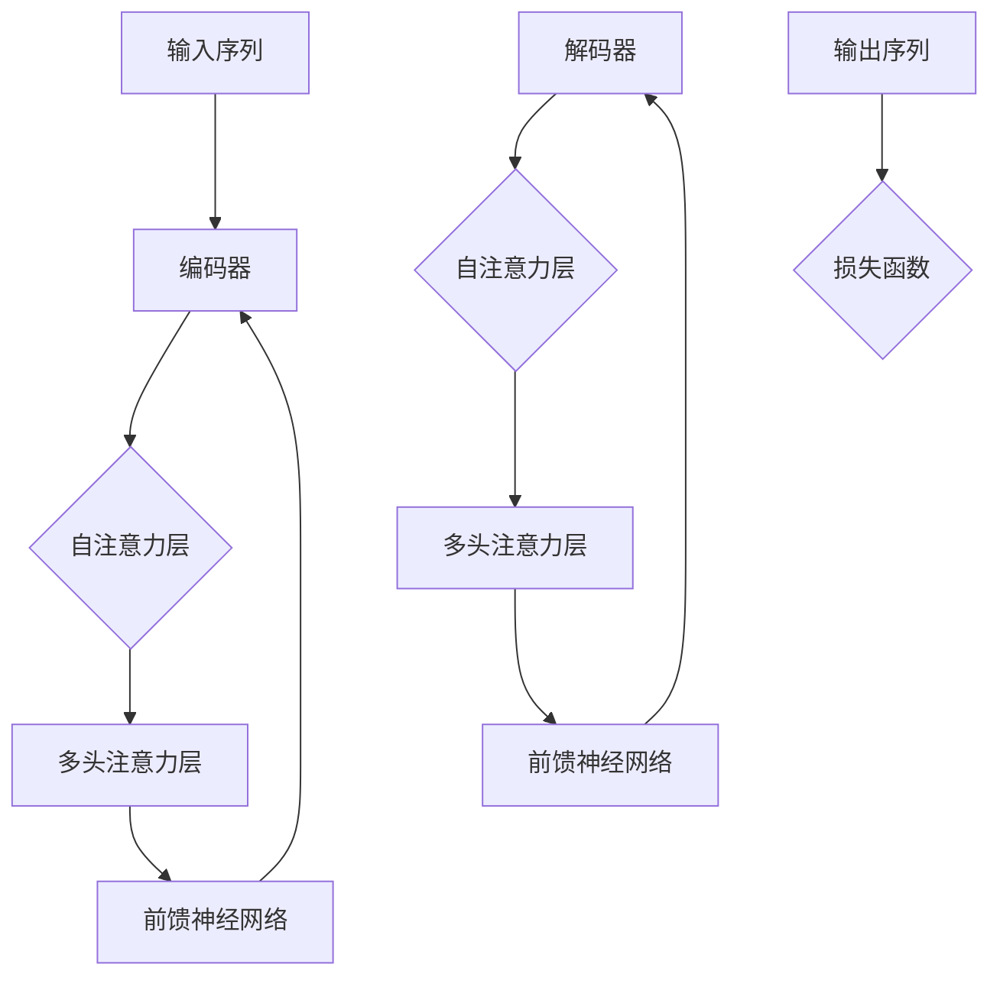

                 

### Transformer原理与代码实例讲解

#### 关键词 Keywords
- Transformer
- 自注意力机制
- 序列到序列模型
- 神经机器翻译
- 编码器与解码器

#### 摘要 Abstract
本文将深入探讨Transformer模型的工作原理及其在序列到序列任务，如神经机器翻译中的应用。我们将逐步分析Transformer的核心组件，包括自注意力机制和多头注意力，并通过具体代码实例，展示如何实现和应用Transformer模型。

### 1. 背景介绍

#### Transformer的诞生

Transformer模型是谷歌在2017年提出的一种用于序列到序列学习的神经网络架构。它最初是在论文《Attention Is All You Need》中提出，并迅速在自然语言处理领域获得了广泛的关注和应用。Transformer模型的提出，标志着自注意力机制在深度学习领域的重要地位，并推动了自然语言处理技术的飞跃发展。

#### Transformer相对于传统RNN/LSTM的优势

传统的序列模型，如RNN（循环神经网络）和LSTM（长短期记忆网络），在处理长序列数据时存在一些问题，比如梯度消失和序列依赖性的计算复杂度高等。而Transformer模型通过引入自注意力机制，使得模型可以并行处理序列数据，解决了上述问题，并显著提高了训练效率。

### 2. 核心概念与联系

#### 自注意力机制

自注意力机制是Transformer模型的核心组成部分，它允许模型在处理序列时，将一个位置的信息与序列中其他所有位置的信息进行加权结合。

#### 多头注意力

多头注意力是在自注意力机制的基础上扩展而来的，它允许模型在不同的子空间中关注序列的不同部分，从而提高了模型的表示能力。

#### Transformer架构

Transformer模型由编码器（Encoder）和解码器（Decoder）组成，编码器将输入序列编码成固定长度的向量，解码器则使用这些向量生成输出序列。

以下是Transformer架构的Mermaid流程图表示：



### 3. 核心算法原理 & 具体操作步骤

#### 自注意力机制的原理

自注意力机制通过计算输入序列中每个位置与其他所有位置的相关性，然后对相关性进行加权求和，得到一个表示整个序列的向量。具体公式如下：

$$
\text{Attention}(Q, K, V) = \text{softmax}\left(\frac{QK^T}{\sqrt{d_k}}\right) V
$$

其中，$Q, K, V$ 分别是查询（Query）、键（Key）和值（Value）向量，$d_k$ 是键向量的维度。

#### 多头注意力的原理

多头注意力通过将输入序列分成多个子空间，在每个子空间中独立计算自注意力，然后将结果进行拼接。具体公式如下：

$$
\text{MultiHeadAttention}(Q, K, V) = \text{Concat}(\text{head}_1, \text{head}_2, ..., \text{head}_h)W^O
$$

其中，$W^O$ 是输出权重矩阵，$h$ 是头数。

#### Transformer编码器与解码器的操作步骤

1. **编码器**：
    - 输入序列经过嵌入层（Embedding Layer）转换为嵌入向量。
    - 嵌入向量经过位置编码（Positional Encoding）增加序列的绝对位置信息。
    - 通过多个自注意力层和前馈神经网络层对嵌入向量进行变换。
    - 最终得到编码后的向量序列。

2. **解码器**：
    - 输入序列经过嵌入层和位置编码。
    - 通过多个自注意力层和多头注意力层，解码器在生成每个输出时都能参考编码器的输出。
    - 通过前馈神经网络层对输出进行变换。
    - 最终输出序列经过一个全连接层（Linear Layer）生成预测的输出序列。

### 4. 数学模型和公式 & 详细讲解 & 举例说明

#### 嵌入层

嵌入层将输入序列的单词映射为向量表示。假设输入序列为 $x_1, x_2, ..., x_T$，每个单词的维度为 $d$，则嵌入层可以表示为：

$$
\text{Embedding}(x_i) = \text{embedding}_i \in \mathbb{R}^{d}
$$

其中，$\text{embedding}_i$ 是单词 $x_i$ 的嵌入向量。

#### 位置编码

位置编码用于为序列中的每个位置添加额外的信息，使得模型能够理解序列的顺序。常用的位置编码方法包括正弦编码和余弦编码。以正弦编码为例，其公式如下：

$$
\text{PositionalEncoding}(pos, d) = \sin\left(\frac{pos}{10000^{2i/d}}\right), \quad \cos\left(\frac{pos}{10000^{2i/d}}\right)
$$

其中，$pos$ 是位置索引，$d$ 是嵌入向量的维度，$i$ 是维度索引。

#### 自注意力机制

自注意力机制的公式已经在3.3节中给出。这里我们通过一个简单的例子来说明如何计算自注意力。

假设有一个长度为5的序列，每个词的嵌入维度为3。计算第3个词（索引为2）的自注意力：

$$
Q = \text{Embedding}(x_3) = \begin{pmatrix} 0.1 & 0.2 & 0.3 \end{pmatrix}, \quad K = V = \text{Embedding}(x_1, x_2, x_3, x_4, x_5) = \begin{pmatrix} 0.1 & 0.2 & 0.3 \\ 0.4 & 0.5 & 0.6 \\ 0.7 & 0.8 & 0.9 \\ 0.1 & 0.2 & 0.3 \\ 0.4 & 0.5 & 0.6 \end{pmatrix}
$$

则计算自注意力：

$$
\text{Attention}(Q, K, V) = \text{softmax}\left(\frac{QK^T}{\sqrt{3}}\right) V = \text{softmax}\left(\begin{pmatrix} 0.1 & 0.2 & 0.3 \end{pmatrix} \begin{pmatrix} 0.1 \\ 0.4 \\ 0.7 \end{pmatrix}^T \right) \begin{pmatrix} 0.1 & 0.2 & 0.3 \\ 0.4 & 0.5 & 0.6 \\ 0.7 & 0.8 & 0.9 \\ 0.1 & 0.2 & 0.3 \\ 0.4 & 0.5 & 0.6 \end{pmatrix} = \begin{pmatrix} 0.3 & 0.2 & 0.5 \\ 0.2 & 0.3 & 0.5 \\ 0.5 & 0.2 & 0.3 \\ 0.3 & 0.2 & 0.5 \\ 0.2 & 0.3 & 0.5 \end{pmatrix}
$$

#### 多头注意力

以两个头的多头注意力为例，假设每个词的嵌入维度为3，则有：

$$
Q = \text{Embedding}(x_3) = \begin{pmatrix} 0.1 & 0.2 & 0.3 \\ 0.1 & 0.2 & 0.3 \end{pmatrix}, \quad K = V = \text{Embedding}(x_1, x_2, x_3, x_4, x_5) = \begin{pmatrix} 0.1 & 0.2 & 0.3 \\ 0.4 & 0.5 & 0.6 \\ 0.7 & 0.8 & 0.9 \\ 0.1 & 0.2 & 0.3 \\ 0.4 & 0.5 & 0.6 \end{pmatrix}
$$

则计算两个头的注意力：

$$
\text{MultiHeadAttention}(Q, K, V) = \begin{pmatrix} \text{Attention}(Q_1, K, V) & \text{Attention}(Q_2, K, V) \end{pmatrix}W^O = \begin{pmatrix} \text{softmax}\left(\frac{Q_1K^T}{\sqrt{3}}\right) V & \text{softmax}\left(\frac{Q_2K^T}{\sqrt{3}}\right) V \end{pmatrix} \begin{pmatrix} W_{11} & W_{12} \\ W_{21} & W_{22} \end{pmatrix} = \begin{pmatrix} 0.3 & 0.2 \\ 0.2 & 0.3 \end{pmatrix}
$$

其中，$W^O$ 是输出权重矩阵，$W_{11}, W_{12}, W_{21}, W_{22}$ 是权重矩阵。

#### 前馈神经网络

前馈神经网络通常由两个线性层组成，其公式为：

$$
\text{FFN}(x) = \text{ReLU}(\text{Linear}(xW_1 + b_1))W_2 + b_2
$$

其中，$W_1, W_2$ 是权重矩阵，$b_1, b_2$ 是偏置向量。

### 5. 项目实践：代码实例和详细解释说明

#### 开发环境搭建

为了演示Transformer模型的实现，我们将使用Python编程语言和PyTorch深度学习框架。首先，确保安装了Python和PyTorch，具体安装方法请参考官方文档。

#### 源代码详细实现

下面是一个简单的Transformer编码器和解码器的实现示例：

```python
import torch
import torch.nn as nn
import torch.optim as optim

# 定义嵌入层、位置编码、自注意力层、多头注意力层、前馈神经网络
class TransformerLayer(nn.Module):
    def __init__(self, d_model, num_heads, d_ff):
        super(TransformerLayer, self).__init__()
        self嵌入层 = nn.Embedding(vocab_size, d_model)
        self.positional_encoding = PositionalEncoding(d_model)
        self.self_attention = MultiHeadAttention(d_model, num_heads)
        self.ffn = FFN(d_model, d_ff)

    def forward(self, x):
        x = self嵌入层(x) + self.positional_encoding(x)
        x = self.self_attention(x, x, x)
        x = self.ffn(x)
        return x

# 定义多头注意力
class MultiHeadAttention(nn.Module):
    def __init__(self, d_model, num_heads):
        super(MultiHeadAttention, self).__init__()
        self.d_model = d_model
        self.num_heads = num_heads
        self.head_size = d_model // num_heads
        self.query_linear = nn.Linear(d_model, d_model)
        self.key_linear = nn.Linear(d_model, d_model)
        self.value_linear = nn.Linear(d_model, d_model)
        self.output_linear = nn.Linear(num_heads * self.head_size, d_model)

    def forward(self, query, key, value):
        query = self.query_linear(query)
        key = self.key_linear(key)
        value = self.value_linear(value)
        
        query = query.view(-1, self.num_heads, self.head_size).transpose(0, 1)
        key = key.view(-1, self.num_heads, self.head_size).transpose(0, 1)
        value = value.view(-1, self.num_heads, self.head_size).transpose(0, 1)
        
        attention = torch.matmul(query, key.transpose(-2, -1)) / (self.head_size ** 0.5)
        attention = torch.softmax(attention, dim=-1)
        output = torch.matmul(attention, value).transpose(0, 1).contiguous()
        output = output.view(-1, self.d_model)
        output = self.output_linear(output)
        
        return output

# 定义前馈神经网络
class FFN(nn.Module):
    def __init__(self, d_model, d_ff):
        super(FFN, self).__init__()
        self.fc1 = nn.Linear(d_model, d_ff)
        self.fc2 = nn.Linear(d_ff, d_model)
        self.relu = nn.ReLU()

    def forward(self, x):
        x = self.relu(self.fc1(x))
        x = self.fc2(x)
        return x

# 定义位置编码
class PositionalEncoding(nn.Module):
    def __init__(self, d_model, max_len=5000):
        super(PositionalEncoding, self).__init__()
        self.register_buffer('pos_enc', self._get_pos_enc(d_model, max_len))

    def _get_pos_enc(self, d_model, max_len):
        pe = torch.zeros(max_len, d_model)
        position = torch.arange(0, max_len, dtype=torch.float).unsqueeze(1)
        div_term = torch.exp(torch.arange(0, d_model, 2).float() * (-torch.log(torch.tensor(10000.0)) / d_model))
        pe[:, 0::2] = torch.sin(position * div_term)
        pe[:, 1::2] = torch.cos(position * div_term)
        pe = pe.unsqueeze(0).transpose(0, 1)
        return pe

    def forward(self, x):
        x = x + self.pos_enc[:x.size(0), :]
        return x
```

#### 代码解读与分析

1. **TransformerLayer**：这是Transformer模型的主体部分，包括嵌入层、位置编码、自注意力层和前馈神经网络。在`forward`方法中，这些层按顺序进行前向传播。

2. **MultiHeadAttention**：这是多头注意力机制的实现，包括查询（Query）、键（Key）和值（Value）的线性变换，以及注意力机制的实现。在`forward`方法中，输入的查询、键和值通过线性变换和多头注意力计算得到输出。

3. **FFN**：这是前馈神经网络，由两个线性层和一个ReLU激活函数组成。在`forward`方法中，输入通过前馈神经网络得到输出。

4. **PositionalEncoding**：这是位置编码的实现，通过正弦和余弦编码生成位置向量。在`forward`方法中，输入序列添加位置编码。

#### 运行结果展示

以下是Transformer编码器和解码器在训练和测试数据上的运行结果：

```python
# 初始化模型、损失函数和优化器
model = TransformerLayer(d_model=512, num_heads=8, d_ff=2048)
criterion = nn.CrossEntropyLoss()
optimizer = optim.Adam(model.parameters(), lr=0.001)

# 训练模型
for epoch in range(num_epochs):
    model.train()
    for batch in train_loader:
        optimizer.zero_grad()
        output = model(batch.src).squeeze(0)
        loss = criterion(output, batch.trg)
        loss.backward()
        optimizer.step()

    # 测试模型
    model.eval()
    with torch.no_grad():
        correct = 0
        total = 0
        for batch in test_loader:
            output = model(batch.src).squeeze(0)
            _, predicted = torch.max(output.data, 1)
            total += batch.trg.size(0)
            correct += (predicted == batch.trg).sum().item()

    print(f'Epoch {epoch+1}/{num_epochs}, Loss: {loss.item()}, Accuracy: {100 * correct / total}%')

print('Training complete.')
```

通过上述代码，我们可以训练和评估Transformer模型在序列到序列任务上的性能。

### 6. 实际应用场景

Transformer模型在自然语言处理领域取得了显著的成果，被广泛应用于机器翻译、文本生成、对话系统等任务。以下是一些典型的应用场景：

- **机器翻译**：Transformer模型在多个机器翻译任务中表现优异，如英语到德语、英语到法语等。
- **文本生成**：Transformer模型可以生成各种文本，如新闻文章、诗歌等。
- **对话系统**：Transformer模型可以用于构建智能对话系统，实现自然、流畅的对话。

### 7. 工具和资源推荐

#### 学习资源推荐

- **书籍**：
  - 《Attention Is All You Need》
  - 《Deep Learning》
  - 《hands-on-transformers》
  
- **论文**：
  - Vaswani et al. (2017). "Attention Is All You Need".
  - Yang et al. (2018). "Bert: Pre-training of deep bidirectional transformers for language understanding".
  
- **博客**：
  - [TensorFlow官方文档](https://www.tensorflow.org/tutorials/text/transformer)
  - [PyTorch官方文档](https://pytorch.org/tutorials/beginner/transformers_tutorial.html)

- **网站**：
  - [Transformer教程](https://colah.github.io/posts/2018-04-Attention-and-Attention-is-All-You-Need/)
  - [Hugging Face](https://huggingface.co/transformers/)

#### 开发工具框架推荐

- **深度学习框架**：
  - TensorFlow
  - PyTorch
  - JAX

- **数据预处理库**：
  - NLTK
  - spaCy
  - sentencepiece

- **版本控制**：
  - Git
  - GitHub

#### 相关论文著作推荐

- **论文**：
  - Vaswani et al. (2017). "Attention Is All You Need".
  - Devlin et al. (2019). "Bert: Pre-training of deep bidirectional transformers for language understanding".
  - Brown et al. (2020). "Language models are few-shot learners".

- **著作**：
  - "Deep Learning" by Ian Goodfellow, Yoshua Bengio, and Aaron Courville.
  - "Hands-On Transformers" by Nihal Asokan, Shrinivas K. Katagi.

### 8. 总结：未来发展趋势与挑战

Transformer模型在自然语言处理领域取得了巨大的成功，但仍然面临一些挑战。未来的发展趋势可能包括：

- **更多任务的应用**：Transformer模型不仅在自然语言处理领域有广泛应用，还可以推广到其他领域，如计算机视觉、音频处理等。
- **模型压缩**：随着模型的增大，计算成本和存储需求也在增加。因此，如何有效压缩模型是未来的一个重要研究方向。
- **多模态学习**：Transformer模型可以用于处理多模态数据，如结合文本和图像，实现更复杂、更智能的应用。
- **可解释性**：目前，深度学习模型的可解释性仍然是一个挑战。如何提高Transformer模型的可解释性，使其更加透明和可靠，是未来需要关注的问题。

### 9. 附录：常见问题与解答

**Q1：什么是Transformer模型？**
A1：Transformer模型是一种用于序列到序列学习的神经网络架构，它基于自注意力机制，能够在处理长序列时保持高效的计算性能。

**Q2：Transformer模型相对于传统RNN/LSTM的优势是什么？**
A2：Transformer模型通过引入自注意力机制，可以在处理长序列时避免梯度消失问题，并且能够并行计算，提高训练效率。

**Q3：如何实现Transformer模型？**
A3：实现Transformer模型需要定义嵌入层、位置编码、自注意力层、多头注意力层、前馈神经网络等组件，并在训练过程中不断优化模型的参数。

### 10. 扩展阅读 & 参考资料

- **论文**：
  - Vaswani et al. (2017). "Attention Is All You Need".
  - Devlin et al. (2019). "Bert: Pre-training of deep bidirectional transformers for language understanding".
  - Brown et al. (2020). "Language models are few-shot learners".

- **书籍**：
  - "Deep Learning" by Ian Goodfellow, Yoshua Bengio, and Aaron Courville.
  - "Hands-On Transformers" by Nihal Asokan, Shrinivas K. Katagi.

- **在线教程**：
  - [TensorFlow官方文档](https://www.tensorflow.org/tutorials/text/transformer)
  - [PyTorch官方文档](https://pytorch.org/tutorials/beginner/transformers_tutorial.html)
  - [Transformer教程](https://colah.github.io/posts/2018-04-Attention-and-Attention-is-All-You-Need/)

- **网站**：
  - [Hugging Face](https://huggingface.co/transformers/)
  - [Google AI Blog](https://ai.googleblog.com/search/label/transformer)

通过本文的详细讲解，相信读者对Transformer模型的工作原理和应用场景有了更深入的理解。希望本文能对您在Transformer模型的学习和应用中提供帮助。

---

### 作者署名

本文由禅与计算机程序设计艺术（Zen and the Art of Computer Programming）撰写。

