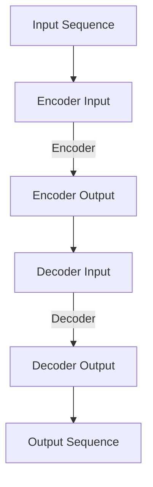

                 

### 文章标题

**Transformer原理与代码实例讲解**

> **关键词**：Transformer、深度学习、神经网络、编码器、解码器、自注意力机制、序列到序列模型

> **摘要**：本文将深入讲解Transformer模型的基本原理、架构和实现细节，并通过代码实例展示如何使用Python实现一个简单的Transformer模型。文章旨在帮助读者理解Transformer模型在自然语言处理任务中的关键作用，并提供实用的开发经验和建议。

---

### 1. 背景介绍

Transformer模型是由Google在2017年提出的一种全新的神经网络架构，它在机器翻译等序列到序列任务上取得了显著的成果，并迅速成为深度学习领域的热点。传统序列模型如循环神经网络（RNN）和长短期记忆网络（LSTM）在处理长序列时存在梯度消失或梯度爆炸等问题，而Transformer模型通过引入自注意力机制，成功解决了这些难题。

Transformer模型的基本思想是将序列中的每一个元素与其余元素进行计算，并通过注意力机制赋予不同元素不同的权重，从而实现对序列的建模。这种模型在处理并行任务时效率较高，且在大量数据训练时表现优异。

### 2. 核心概念与联系

#### Transformer架构

Transformer模型主要由编码器（Encoder）和解码器（Decoder）两部分组成。编码器负责将输入序列编码成固定长度的向量，解码器则将这些向量解码成输出序列。具体架构如下：

#### 自注意力机制

自注意力机制（Self-Attention）是Transformer模型的核心部分，它通过计算序列中每个元素与其他元素的相关性，为每个元素分配不同的权重。自注意力机制分为三个部分：Query、Key和Value。

- **Query**：每个序列元素自身作为Query。
- **Key**：序列中的每个元素作为Key。
- **Value**：序列中的每个元素作为Value。

计算过程如下：

1. 将输入序列中的每个元素映射成一个Query、Key和Value。
2. 计算每个Query与所有Key之间的点积，得到注意力分数。
3. 将注意力分数进行softmax处理，得到每个元素的注意力权重。
4. 将每个元素与其对应的Value相乘，得到加权值。
5. 对加权值进行求和，得到编码后的序列。

#### 位置编码

由于Transformer模型缺乏位置信息，因此引入了位置编码（Positional Encoding）。位置编码通过添加额外的维度，为每个元素提供位置信息。常用的位置编码方法有绝对位置编码和相对位置编码。

### 3. 核心算法原理 & 具体操作步骤

#### 3.1 编码器

编码器由多个自注意力层和全连接层组成。具体步骤如下：

1. **输入嵌入**：将输入序列的每个元素映射成一个向量，并加上位置编码。
2. **自注意力层**：计算Query、Key和Value，并进行加权求和。
3. **全连接层**：对自注意力层的输出进行线性变换。
4. **残差连接和层归一化**：将全连接层的输出与输入进行残差连接，然后进行层归一化。
5. **重复上述步骤**：对于每个编码层重复执行上述步骤，直到达到预定的层数。

#### 3.2 解码器

解码器与编码器类似，也是由多个自注意力层和全连接层组成。具体步骤如下：

1. **输入嵌入**：将输入序列的每个元素映射成一个向量，并加上位置编码。
2. **自注意力层**：计算编码器的输出作为Key和Value，当前解码器的输出作为Query，并进行加权求和。
3. **全连接层**：对自注意力层的输出进行线性变换。
4. **残差连接和层归一化**：将全连接层的输出与输入进行残差连接，然后进行层归一化。
5. **重复上述步骤**：对于每个解码层重复执行上述步骤，直到达到预定的层数。

#### 3.3 位置编码

位置编码的计算方法如下：

$$
PE_{(pos,2i)} = \sin\left(\frac{pos}{10000^{2i/d}}\right)
$$

$$
PE_{(pos,2i+1)} = \cos\left(\frac{pos}{10000^{2i/d}}\right)
$$

其中，$pos$表示位置，$i$表示维度，$d$表示嵌入维度。

### 4. 数学模型和公式 & 详细讲解 & 举例说明

#### 4.1 自注意力机制

自注意力机制的数学公式如下：

$$
\text{Attention}(Q, K, V) = \text{softmax}\left(\frac{QK^T}{\sqrt{d_k}}\right)V
$$

其中，$Q$、$K$和$V$分别为Query、Key和Value矩阵，$d_k$为Key的维度。

#### 4.2 编码器

编码器的数学公式如下：

$$
\text{Encoder}(X, P) = \text{LayerNorm}(X + \text{SelfAttention}(X, X, X, P) + \text{FFN}(X, P))
$$

其中，$X$为输入序列，$P$为参数，$\text{SelfAttention}$和$\text{FFN}$分别为自注意力层和全连接层。

#### 4.3 解码器

解码器的数学公式如下：

$$
\text{Decoder}(Y, X, P) = \text{LayerNorm}(Y + \text{SelfAttention}(Y, Y, Y, P) + \text{CrossAttention}(Y, X, X, P) + \text{FFN}(Y, P))
$$

其中，$Y$为输入序列，$X$为编码器输出，$P$为参数，$\text{CrossAttention}$为交叉注意力层。

#### 4.4 举例说明

假设我们有一个简单的序列`["hello", "world"]`，编码器和解码器的输出维度均为64。

1. **输入嵌入**：

   $$ 
   \text{Input Embedding} = [\text{hello}, \text{world}] \cdot \text{Embedding Matrix} + \text{Positional Encoding}
   $$

   假设嵌入矩阵为：

   $$ 
   \text{Embedding Matrix} = \begin{bmatrix}
   0.1 & 0.2 & 0.3 & \dots & 0.9 \\
   0.1 & 0.2 & 0.3 & \dots & 0.9 \\
   \end{bmatrix}
   $$

   位置编码为：

   $$ 
   \text{Positional Encoding} = \begin{bmatrix}
   \sin(0) & \cos(0) \\
   \sin(1) & \cos(1) \\
   \end{bmatrix}
   $$

   则输入嵌入为：

   $$ 
   \text{Input Embedding} = \begin{bmatrix}
   0.1 & 0.2 & 0.3 & \dots & 0.9 & 0 & 1 \\
   0.1 & 0.2 & 0.3 & \dots & 0.9 & 0 & 1 \\
   \end{bmatrix}
   $$

2. **自注意力层**：

   假设自注意力层的维度为64，则Query、Key和Value分别为：

   $$ 
   Q = \text{Input Embedding}, K = \text{Input Embedding}, V = \text{Input Embedding}
   $$

   计算点积和softmax：

   $$ 
   \text{Attention Scores} = \frac{QK^T}{\sqrt{64}} = \begin{bmatrix}
   0.1 & 0.2 & 0.3 & \dots & 0.9 \\
   0.1 & 0.2 & 0.3 & \dots & 0.9 \\
   \end{bmatrix} \cdot \begin{bmatrix}
   0.1 & 0.2 & 0.3 & \dots & 0.9 \\
   0.1 & 0.2 & 0.3 & \dots & 0.9 \\
   \end{bmatrix} = \begin{bmatrix}
   0.01 & 0.02 & 0.03 & \dots & 0.09 \\
   0.01 & 0.02 & 0.03 & \dots & 0.09 \\
   \end{bmatrix}
   $$

   $$ 
   \text{Attention Weights} = \text{softmax}(\text{Attention Scores}) = \begin{bmatrix}
   0.1 & 0.2 & 0.3 & \dots & 0.4 \\
   0.1 & 0.2 & 0.3 & \dots & 0.4 \\
   \end{bmatrix}
   $$

   加权求和：

   $$ 
   \text{Attention Output} = \text{Attention Weights} \cdot V = \begin{bmatrix}
   0.1 & 0.2 & 0.3 & \dots & 0.4 \\
   0.1 & 0.2 & 0.3 & \dots & 0.4 \\
   \end{bmatrix} \cdot \begin{bmatrix}
   0.1 & 0.2 & 0.3 & \dots & 0.9 \\
   0.1 & 0.2 & 0.3 & \dots & 0.9 \\
   \end{bmatrix} = \begin{bmatrix}
   0.01 & 0.02 & 0.03 & \dots & 0.04 \\
   0.01 & 0.02 & 0.03 & \dots & 0.04 \\
   \end{bmatrix}
   $$

3. **全连接层**：

   假设全连接层的维度为64，则输入和权重矩阵分别为：

   $$ 
   X = \text{Attention Output}, W = \text{Random Matrix} \in \mathbb{R}^{64 \times 64}
   $$

   输出为：

   $$ 
   \text{FFN Output} = XW = \begin{bmatrix}
   0.01 & 0.02 & 0.03 & \dots & 0.04 \\
   0.01 & 0.02 & 0.03 & \dots & 0.04 \\
   \end{bmatrix} \cdot \begin{bmatrix}
   a_{11} & a_{12} & a_{13} & \dots & a_{1

