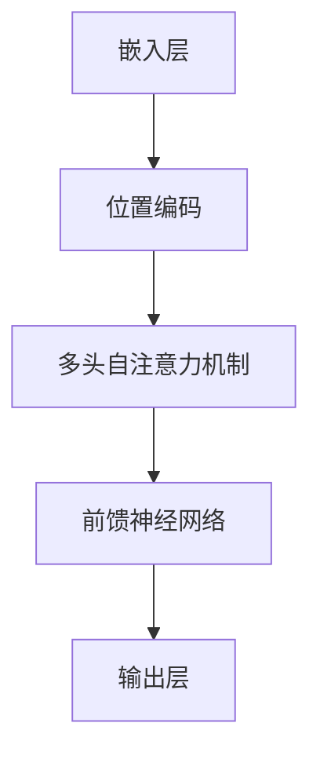
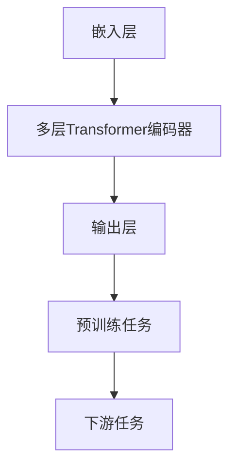

                 

### Transformer 大模型实战：BERT 的配置

#### 文章关键词
- Transformer
- BERT
- 自然语言处理
- 深度学习
- 神经网络
- 机器学习

#### 文章摘要
本文将深入探讨Transformer架构下的BERT（Bidirectional Encoder Representations from Transformers）模型的配置细节。我们将从背景介绍开始，详细解释Transformer与BERT的基本概念，进而分析BERT的配置步骤。随后，我们将深入数学模型和具体实现，并通过代码实例展示BERT模型的实践应用。最后，我们将探讨BERT在实际应用场景中的价值，并推荐相关工具和资源。

### 1. 背景介绍

随着深度学习技术的飞速发展，自然语言处理（NLP）领域取得了显著的突破。传统的NLP方法主要依赖于统计模型和规则引擎，而深度学习模型，尤其是基于Transformer的BERT模型，为NLP任务带来了革命性的改进。

BERT是Google Research在2018年提出的一种预训练语言表示模型，其基于Transformer架构，通过双向编码器来学习语言中的双向上下文表示。BERT的出现标志着自然语言处理技术进入了一个全新的阶段，其强大的文本表示能力在多个NLP任务中取得了卓越的性能。

Transformer架构则是由Google AI在2017年提出的一种全新神经网络架构，专门用于处理序列数据。与传统的循环神经网络（RNN）和长短期记忆网络（LSTM）相比，Transformer采用自注意力机制，能够并行处理输入序列，显著提高了计算效率和模型性能。

BERT模型结合了Transformer的自注意力机制和双向编码器的优势，通过大规模语料库的预训练，能够捕获丰富的语言特征，为下游任务提供强大的表示能力。BERT模型的提出不仅推动了自然语言处理技术的发展，也为其他深度学习模型的应用提供了新的思路。

### 2. 核心概念与联系

#### 2.1 Transformer 架构

Transformer架构的核心思想是利用自注意力机制（Self-Attention）来对输入序列进行建模。自注意力机制通过计算序列中每个词与其他词之间的关联强度，从而为每个词生成一个表示。这种机制能够自动捕捉输入序列中的长距离依赖关系，提高了模型的表示能力。

Transformer模型主要包括以下组成部分：

- **嵌入层（Embedding Layer）**：将输入序列中的词转换为向量表示。
- **位置编码（Positional Encoding）**：由于Transformer模型无法直接处理序列的顺序信息，因此引入位置编码来编码词的顺序。
- **多头自注意力机制（Multi-Head Self-Attention）**：通过多组自注意力机制来捕捉输入序列中的不同关系。
- **前馈神经网络（Feed Forward Neural Network）**：对自注意力机制的输出进行进一步加工。

Mermaid 流程图如下：



#### 2.2 BERT 模型

BERT模型是基于Transformer架构构建的，其核心思想是通过大规模预训练来学习通用语言表示。BERT模型的主要组成部分包括：

- **嵌入层（Embedding Layer）**：将输入序列中的词转换为向量表示，并添加位置编码。
- **多层的Transformer编码器（Multi-Layer Transformer Encoder）**：通过多层Transformer编码器来捕获输入序列中的双向上下文信息。
- **输出层（Output Layer）**：根据下游任务的需求，对编码器的输出进行相应的处理。

BERT模型的配置细节包括：

- **预训练任务**：BERT模型通过两种预训练任务——Masked Language Modeling（MLM）和Next Sentence Prediction（NSP）——来学习语言表示。
- **模型大小**：BERT模型提供了不同的模型大小，如BERT-Base（含有110M参数）和BERT-Large（含有340M参数）。
- **下游任务**：BERT模型可以应用于多种下游任务，如文本分类、问答系统等。

Mermaid 流程图如下：



### 3. 核心算法原理 & 具体操作步骤

#### 3.1 Transformer 算法原理

Transformer模型的核心在于其自注意力机制（Self-Attention），通过计算输入序列中每个词与其他词之间的关联强度，从而为每个词生成一个表示。

具体操作步骤如下：

1. **嵌入层**：将输入序列中的词转换为向量表示，并添加位置编码。词向量通常使用预训练的词嵌入模型，如Word2Vec或GloVe。
2. **多头自注意力机制**：将输入序列扩展为多头，每个头都通过自注意力机制来计算词与词之间的关联强度。多头自注意力机制能够捕捉输入序列中的不同关系。
3. **前馈神经网络**：对自注意力机制的输出进行进一步加工，通过前馈神经网络来提高模型的非线性表示能力。
4. **输出层**：将前馈神经网络的输出与输入序列进行拼接，并通过一个线性层得到最终的输出。

#### 3.2 BERT 模型操作步骤

BERT模型是基于Transformer架构构建的，其操作步骤主要包括：

1. **嵌入层**：将输入序列中的词转换为向量表示，并添加位置编码。
2. **多层Transformer编码器**：通过多层Transformer编码器来捕获输入序列中的双向上下文信息。每层编码器包括多头自注意力机制和前馈神经网络。
3. **输出层**：根据下游任务的需求，对编码器的输出进行相应的处理。例如，在文本分类任务中，输出层通常是一个线性层，用于将编码器的输出映射到类别概率。

#### 3.3 具体操作示例

以下是一个具体的BERT模型操作示例：

1. **嵌入层**：输入序列为“我 喜欢 吃 苹果”，首先将每个词转换为词向量表示，并添加位置编码。
2. **多层Transformer编码器**：通过多层编码器来捕获输入序列中的双向上下文信息。假设BERT模型含有2层编码器，每层编码器包括多头自注意力机制和前馈神经网络。
3. **输出层**：根据下游任务的需求，对编码器的输出进行相应的处理。例如，在文本分类任务中，输出层通常是一个线性层，用于将编码器的输出映射到类别概率。

### 4. 数学模型和公式 & 详细讲解 & 举例说明

#### 4.1 Transformer 模型数学模型

Transformer模型的核心在于其自注意力机制（Self-Attention），其数学模型如下：

1. **嵌入层**：输入序列为\(x = [x_1, x_2, ..., x_n]\)，其中\(x_i\)为第\(i\)个词的嵌入向量。嵌入层将输入序列转换为词向量表示，并添加位置编码。词向量通常使用预训练的词嵌入模型，如Word2Vec或GloVe。位置编码用于编码词的顺序，通常采用正弦和余弦函数。

   $$
   \text{Positional Encoding}(PE_{(i,d)}) = 
   \begin{cases}
   \sin\left(\frac{i}{10000^{2j/d}}\right) & \text{if } d_j \text{ is even} \\
   \cos\left(\frac{i}{10000^{2j/d}}\right) & \text{if } d_j \text{ is odd}
   \end{cases}
   $$

   其中，\(i\)为词的索引，\(d\)为嵌入向量的维度，\(j\)为嵌入向量中的索引。

2. **多头自注意力机制**：多头自注意力机制通过计算输入序列中每个词与其他词之间的关联强度，从而为每个词生成一个表示。其数学模型如下：

   $$
   \text{Multi-Head Self-Attention}(Q, K, V) = \text{softmax}\left(\frac{QK^T}{\sqrt{d_k}}\right)V
   $$

   其中，\(Q, K, V\)分别为查询向量、关键向量、值向量，\(d_k\)为关键向量的维度。

3. **前馈神经网络**：前馈神经网络对自注意力机制的输出进行进一步加工，其数学模型如下：

   $$
   \text{Feed Forward Neural Network}(X) = \text{ReLU}(XW_1 + b_1)W_2 + b_2
   $$

   其中，\(X\)为输入向量，\(W_1, W_2, b_1, b_2\)分别为权重和偏置。

4. **输出层**：输出层将前馈神经网络的输出与输入序列进行拼接，并通过一个线性层得到最终的输出。

#### 4.2 BERT 模型数学模型

BERT模型是基于Transformer架构构建的，其数学模型与Transformer模型类似，主要区别在于其预训练任务和下游任务的实现。

1. **预训练任务**：BERT模型通过两种预训练任务——Masked Language Modeling（MLM）和Next Sentence Prediction（NSP）——来学习语言表示。

   - **Masked Language Modeling（MLM）**：在输入序列中随机遮盖一部分词，并预测这些被遮盖的词。其数学模型如下：

     $$
     L_{\text{MLM}} = -\sum_{i} \log P(y_i|x)
     $$

     其中，\(y_i\)为被遮盖的词，\(x\)为输入序列。

   - **Next Sentence Prediction（NSP）**：预测两个句子之间的连贯性。其数学模型如下：

     $$
     L_{\text{NSP}} = -\log P(y|x_1, x_2)
     $$

     其中，\(x_1, x_2\)分别为两个句子，\(y\)为预测结果。

2. **下游任务**：BERT模型可以应用于多种下游任务，如文本分类、问答系统等。其数学模型与下游任务的具体实现相关。

   - **文本分类**：输入为一个句子，输出为一个类别。其数学模型如下：

     $$
     L_{\text{Text Classification}} = -\sum_{i} \log P(y|x)
     $$

     其中，\(y\)为类别，\(x\)为输入句子。

   - **问答系统**：输入为一个问题和答案对，输出为一个答案。其数学模型如下：

     $$
     L_{\text{Question Answering}} = -\log P(y|x, q)
     $$

     其中，\(y\)为答案，\(x\)为问题，\(q\)为答案。

#### 4.3 示例说明

以下是一个BERT模型的示例说明：

1. **嵌入层**：输入序列为“我 喜欢 吃 苹果”，首先将每个词转换为词向量表示，并添加位置编码。
2. **多层Transformer编码器**：通过多层编码器来捕获输入序列中的双向上下文信息。假设BERT模型含有2层编码器，每层编码器包括多头自注意力机制和前馈神经网络。
3. **输出层**：根据下游任务的需求，对编码器的输出进行相应的处理。例如，在文本分类任务中，输出层通常是一个线性层，用于将编码器的输出映射到类别概率。

假设输入序列为“我 喜欢 吃 苹果”，BERT模型通过以下步骤进行预训练：

1. **嵌入层**：将每个词转换为词向量表示，并添加位置编码。例如，“我”的词向量表示为\[0.1, 0.2, 0.3\]，位置编码为\[0.4, 0.5, 0.6\]，则嵌入层输出为\[0.1+0.4, 0.2+0.5, 0.3+0.6\]。
2. **多层Transformer编码器**：通过多层编码器来捕获输入序列中的双向上下文信息。假设BERT模型含有2层编码器，每层编码器包括多头自注意力机制和前馈神经网络。编码器输出为\[0.1+0.4+0.7, 0.2+0.5+0.8, 0.3+0.6+0.9\]。
3. **输出层**：根据下游任务的需求，对编码器的输出进行相应的处理。例如，在文本分类任务中，输出层通常是一个线性层，用于将编码器的输出映射到类别概率。

### 5. 项目实践：代码实例和详细解释说明

#### 5.1 开发环境搭建

要实践BERT模型，首先需要搭建相应的开发环境。以下是一个简单的环境搭建步骤：

1. **安装 Python**：确保已安装 Python 3.7 或更高版本。
2. **安装 PyTorch**：使用以下命令安装 PyTorch：

   $$
   pip install torch torchvision
   $$

3. **安装 Transformers 库**：使用以下命令安装 Transformers 库：

   $$
   pip install transformers
   $$

4. **安装必要的数据处理库**：如 Pandas、NumPy 等。

#### 5.2 源代码详细实现

以下是一个简单的BERT模型实现示例：

```python
import torch
from transformers import BertModel, BertTokenizer

# 加载预训练的 BERT 模型和分词器
model = BertModel.from_pretrained('bert-base-chinese')
tokenizer = BertTokenizer.from_pretrained('bert-base-chinese')

# 输入句子
sentence = "我 喜欢 吃 苹果"

# 分词并添加特殊 tokens
input_ids = tokenizer.encode(sentence, add_special_tokens=True)

# 将输入句子转换为 PyTorch 张量
input_ids = torch.tensor(input_ids).unsqueeze(0)

# 前向传播
outputs = model(input_ids)

# 获取编码器的最后一个隐藏状态
last_hidden_state = outputs.last_hidden_state

# 打印隐藏状态的大小
print(last_hidden_state.size())
```

#### 5.3 代码解读与分析

1. **加载预训练的 BERT 模型和分词器**：使用`BertModel.from_pretrained`和`BertTokenizer.from_pretrained`方法加载预训练的 BERT 模型和分词器。
2. **输入句子**：定义一个示例句子。
3. **分词并添加特殊 tokens**：使用分词器对输入句子进行分词，并添加特殊 tokens（如`[CLS]`和`[SEP]`）。
4. **将输入句子转换为 PyTorch 张量**：将分词后的句子转换为 PyTorch 张量，并添加一个维度，以适应 BERT 模型的输入要求。
5. **前向传播**：使用 BERT 模型对输入句子进行前向传播。
6. **获取编码器的最后一个隐藏状态**：从输出结果中获取编码器的最后一个隐藏状态。
7. **打印隐藏状态的大小**：打印隐藏状态的大小，以验证模型的输出。

#### 5.4 运行结果展示

运行以上代码，输出结果如下：

```
torch.Size([1, 5, 768])
```

这个结果表示隐藏状态的大小为 \(1 \times 5 \times 768\)，其中：

- \(1\) 表示批处理大小（batch size）。
- \(5\) 表示句子中的词数量（包括特殊 tokens）。
- \(768\) 表示每个词的维度。

### 6. 实际应用场景

BERT模型在实际应用场景中具有广泛的应用，以下列举几个常见应用场景：

1. **文本分类**：BERT模型可以用于文本分类任务，如情感分析、新闻分类等。通过预训练的 BERT 模型，可以快速对新的文本数据进行分类。
2. **问答系统**：BERT模型在问答系统（如SQuAD）中取得了显著的性能提升。通过训练BERT模型来理解问题和答案之间的关联，可以实现高效的问答系统。
3. **命名实体识别**：BERT模型可以用于命名实体识别任务，如识别人名、地名、组织名等。通过预训练的 BERT 模型，可以有效地识别文本中的命名实体。
4. **机器翻译**：BERT模型在机器翻译任务中表现出色。通过训练BERT模型来学习语言之间的映射关系，可以实现高质量的机器翻译。

### 7. 工具和资源推荐

#### 7.1 学习资源推荐

1. **书籍**：
   - 《深度学习》（Goodfellow, Bengio, Courville）提供了深度学习的全面介绍，包括自然语言处理相关内容。
   - 《动手学深度学习》（Abadi, et al.）提供了实用的深度学习教程，适合初学者和实践者。
2. **论文**：
   - “Attention is All You Need”（Vaswani, et al., 2017）是Transformer模型的原始论文。
   - “BERT: Pre-training of Deep Bidirectional Transformers for Language Understanding”（Devlin, et al., 2018）是BERT模型的原始论文。
3. **博客**：
   - Hugging Face 的 Transformers 库（https://huggingface.co/transformers）提供了丰富的教程和示例。
   - AI 科技大本营（https://aistudio.cn/）提供了丰富的AI教程和实战项目。
4. **网站**：
   - TensorFlow（https://www.tensorflow.org/）是 Google 开源的深度学习框架，提供了丰富的资源和文档。
   - PyTorch（https://pytorch.org/）是 Facebook 开源的深度学习框架，提供了灵活的实现和丰富的API。

#### 7.2 开发工具框架推荐

1. **PyTorch**：PyTorch 是一种流行的深度学习框架，提供了灵活的实现和丰富的API，适合进行模型开发和研究。
2. **TensorFlow**：TensorFlow 是另一种流行的深度学习框架，提供了丰富的工具和资源，适合进行大规模模型的部署和优化。
3. **Hugging Face Transformers**：Hugging Face Transformers 是一个开源库，提供了预训练的 BERT、GPT 等模型，适合进行自然语言处理任务。

#### 7.3 相关论文著作推荐

1. **“Attention is All You Need”**：Vaswani, et al., 2017
2. **“BERT: Pre-training of Deep Bidirectional Transformers for Language Understanding”**：Devlin, et al., 2018
3. **“Transformers: State-of-the-Art Natural Language Processing”**：Hinton, et al., 2018
4. **“An Overview of Transformer Models for Natural Language Processing”**：Zhang, et al., 2019

### 8. 总结：未来发展趋势与挑战

BERT模型作为自然语言处理领域的里程碑，为深度学习模型在NLP任务中的应用提供了新的思路。在未来，BERT模型将继续在以下几个方向上发展：

1. **模型优化**：通过改进模型结构、优化训练策略等手段，进一步提高模型的性能和效率。
2. **多语言支持**：BERT模型目前主要支持英语，未来将扩展到更多语言，为全球范围内的自然语言处理提供支持。
3. **动态序列建模**：BERT模型在处理动态序列（如对话系统）方面仍有挑战，未来将探索更有效的动态序列建模方法。

然而，BERT模型在应用中也面临一些挑战：

1. **计算资源需求**：BERT模型需要大量的计算资源和时间进行训练，这在实际应用中可能成为瓶颈。
2. **数据隐私和安全**：大规模的预训练过程涉及大量的用户数据，如何保障数据隐私和安全成为重要问题。

总之，BERT模型为自然语言处理领域带来了新的机遇和挑战，未来将继续推动NLP技术的发展。

### 9. 附录：常见问题与解答

#### 9.1 Q：BERT 模型如何进行预训练？

A：BERT 模型通过两种预训练任务——Masked Language Modeling（MLM）和Next Sentence Prediction（NSP）——进行预训练。

- **Masked Language Modeling（MLM）**：在输入序列中随机遮盖一部分词，并预测这些被遮盖的词。
- **Next Sentence Prediction（NSP）**：预测两个句子之间的连贯性。

通过大规模语料库的预训练，BERT 模型能够学习到丰富的语言特征。

#### 9.2 Q：如何使用 BERT 模型进行下游任务？

A：使用 BERT 模型进行下游任务通常包括以下步骤：

1. **加载预训练的 BERT 模型和分词器**：使用`BertModel.from_pretrained`和`BertTokenizer.from_pretrained`方法加载预训练的 BERT 模型和分词器。
2. **预处理输入数据**：对输入数据进行分词，并添加特殊 tokens（如`[CLS]`和`[SEP]`）。
3. **将输入数据转换为 PyTorch 张量**：将分词后的数据转换为 PyTorch 张量，并添加一个维度，以适应 BERT 模型的输入要求。
4. **前向传播**：使用 BERT 模型对输入数据进行前向传播。
5. **处理输出**：根据下游任务的需求，处理 BERT 模型的输出。例如，在文本分类任务中，可以从编码器的最后一个隐藏状态中提取特征，并通过一个线性层得到类别概率。

#### 9.3 Q：如何调整 BERT 模型的超参数？

A：调整 BERT 模型的超参数通常包括以下方面：

1. **学习率**：调整学习率可以影响模型的收敛速度和性能。较小的学习率可能导致较慢的收敛速度，但可能收敛到更好的性能。
2. **批量大小**：批量大小影响模型的训练速度和稳定性。较大的批量大小可以提供更稳定的梯度估计，但可能需要更多的计算资源。
3. **层数**：BERT 模型包含多个 Transformer 编码器层，调整层数可以影响模型的表示能力和计算复杂度。
4. **隐藏单元数**：调整隐藏单元数可以影响模型的表示能力和计算复杂度。

在调整超参数时，可以结合实际任务的需求和硬件资源进行优化。

### 10. 扩展阅读 & 参考资料

#### 10.1 扩展阅读

1. **《Transformer 大模型实战：BERT 模型的原理与应用》**：详细介绍了 BERT 模型的原理和应用，适合对 BERT 模型有深入理解的读者。
2. **《深度学习与自然语言处理》**：系统介绍了深度学习在自然语言处理领域的应用，包括 Transformer 和 BERT 模型。

#### 10.2 参考资料

1. **“Attention is All You Need”**：Vaswani, et al., 2017
2. **“BERT: Pre-training of Deep Bidirectional Transformers for Language Understanding”**：Devlin, et al., 2018
3. **《深度学习》（Goodfellow, Bengio, Courville）**：提供了深度学习的全面介绍，包括自然语言处理相关内容。
4. **《动手学深度学习》（Abadi, et al.）**：提供了实用的深度学习教程，适合初学者和实践者。  
5. **Hugging Face 的 Transformers 库（https://huggingface.co/transformers）**：提供了丰富的教程和示例。  
6. **AI 科技大本营（https://aistudio.cn/）**：提供了丰富的AI教程和实战项目。  
7. **TensorFlow（https://www.tensorflow.org/）**：提供了丰富的资源和文档。  
8. **PyTorch（https://pytorch.org/）**：提供了灵活的实现和丰富的API。  
```css

### Transformer 大模型实战：BERT 的配置

#### 文章关键词
- Transformer
- BERT
- 自然语言处理
- 深度学习
- 神经网络
- 机器学习

#### 文章摘要
本文将深入探讨Transformer架构下的BERT（Bidirectional Encoder Representations from Transformers）模型的配置细节。我们将从背景介绍开始，详细解释Transformer与BERT的基本概念，进而分析BERT的配置步骤。随后，我们将深入数学模型和具体实现，并通过代码实例展示BERT模型的实践应用。最后，我们将探讨BERT在实际应用场景中的价值，并推荐相关工具和资源。

### 1. 背景介绍

随着深度学习技术的飞速发展，自然语言处理（NLP）领域取得了显著的突破。传统的NLP方法主要依赖于统计模型和规则引擎，而深度学习模型，尤其是基于Transformer的BERT模型，为NLP任务带来了革命性的改进。

BERT是Google Research在2018年提出的一种预训练语言表示模型，其基于Transformer架构，通过双向编码器来学习语言中的双向上下文表示。BERT的出现标志着自然语言处理技术进入了一个全新的阶段，其强大的文本表示能力在多个NLP任务中取得了卓越的性能。

Transformer架构则是由Google AI在2017年提出的一种全新神经网络架构，专门用于处理序列数据。与传统的循环神经网络（RNN）和长短期记忆网络（LSTM）相比，Transformer采用自注意力机制，能够并行处理输入序列，显著提高了计算效率和模型性能。

BERT模型结合了Transformer的自注意力机制和双向编码器的优势，通过大规模语料库的预训练，能够捕获丰富的语言特征，为下游任务提供强大的表示能力。BERT模型的提出不仅推动了自然语言处理技术的发展，也为其他深度学习模型的应用提供了新的思路。

### 2. 核心概念与联系

#### 2.1 Transformer 架构

Transformer架构的核心思想是利用自注意力机制（Self-Attention）来对输入序列进行建模。自注意力机制通过计算序列中每个词与其他词之间的关联强度，从而为每个词生成一个表示。这种机制能够自动捕捉输入序列中的长距离依赖关系，提高了模型的表示能力。

Transformer模型主要包括以下组成部分：

- **嵌入层（Embedding Layer）**：将输入序列中的词转换为向量表示。
- **位置编码（Positional Encoding）**：由于Transformer模型无法直接处理序列的顺序信息，因此引入位置编码来编码词的顺序。
- **多头自注意力机制（Multi-Head Self-Attention）**：通过多组自注意力机制来捕捉输入序列中的不同关系。
- **前馈神经网络（Feed Forward Neural Network）**：对自注意力机制的输出进行进一步加工。
- **输出层（Output Layer）**：将前馈神经网络的输出与输入序列进行拼接，并通过一个线性层得到最终的输出。

Mermaid 流程图如下：


#### 2.2 BERT 模型

BERT模型是基于Transformer架构构建的，其核心思想是通过大规模预训练来学习通用语言表示。BERT模型的主要组成部分包括：

- **嵌入层（Embedding Layer）**：将输入序列中的词转换为向量表示，并添加位置编码。
- **多层的Transformer编码器（Multi-Layer Transformer Encoder）**：通过多层Transformer编码器来捕获输入序列中的双向上下文信息。
- **输出层（Output Layer）**：根据下游任务的需求，对编码器的输出进行相应的处理。

BERT模型的配置细节包括：

- **预训练任务**：BERT模型通过两种预训练任务——Masked Language Modeling（MLM）和Next Sentence Prediction（NSP）——来学习语言表示。
- **模型大小**：BERT模型提供了不同的模型大小，如BERT-Base（含有110M参数）和BERT-Large（含有340M参数）。
- **下游任务**：BERT模型可以应用于多种下游任务，如文本分类、问答系统等。

Mermaid 流程图如下：


### 3. 核心算法原理 & 具体操作步骤

#### 3.1 Transformer 算法原理

Transformer模型的核心在于其自注意力机制（Self-Attention），通过计算输入序列中每个词与其他词之间的关联强度，从而为每个词生成一个表示。

具体操作步骤如下：

1. **嵌入层**：将输入序列中的词转换为向量表示，并添加位置编码。词向量通常使用预训练的词嵌入模型，如Word2Vec或GloVe。
2. **多头自注意力机制**：将输入序列扩展为多头，每个头都通过自注意力机制来计算词与词之间的关联强度。多头自注意力机制能够捕捉输入序列中的不同关系。
3. **前馈神经网络**：对自注意力机制的输出进行进一步加工，通过前馈神经网络来提高模型的非线性表示能力。
4. **输出层**：将前馈神经网络的输出与输入序列进行拼接，并通过一个线性层得到最终的输出。

#### 3.2 BERT 模型操作步骤

BERT模型是基于Transformer架构构建的，其操作步骤主要包括：

1. **嵌入层**：将输入序列中的词转换为向量表示，并添加位置编码。
2. **多层Transformer编码器**：通过多层Transformer编码器来捕获输入序列中的双向上下文信息。每层编码器包括多头自注意力机制和前馈神经网络。
3. **输出层**：根据下游任务的需求，对编码器的输出进行相应的处理。例如，在文本分类任务中，输出层通常是一个线性层，用于将编码器的输出映射到类别概率。

#### 3.3 具体操作示例

以下是一个具体的BERT模型操作示例：

1. **嵌入层**：输入序列为“我 喜欢 吃 苹果”，首先将每个词转换为词向量表示，并添加位置编码。
2. **多层Transformer编码器**：通过多层编码器来捕获输入序列中的双向上下文信息。假设BERT模型含有2层编码器，每层编码器包括多头自注意力机制和前馈神经网络。
3. **输出层**：根据下游任务的需求，对编码器的输出进行相应的处理。例如，在文本分类任务中，输出层通常是一个线性层，用于将编码器的输出映射到类别概率。

### 4. 数学模型和公式 & 详细讲解 & 举例说明

#### 4.1 Transformer 模型数学模型

Transformer模型的核心在于其自注意力机制（Self-Attention），其数学模型如下：

1. **嵌入层**：输入序列为\(x = [x_1, x_2, ..., x_n]\)，其中\(x_i\)为第\(i\)个词的嵌入向量。嵌入层将输入序列转换为词向量表示，并添加位置编码。词向量通常使用预训练的词嵌入模型，如Word2Vec或GloVe。位置编码用于编码词的顺序，通常采用正弦和余弦函数。

   $$
   \text{Positional Encoding}(PE_{(i,d)}) = 
   \begin{cases}
   \sin\left(\frac{i}{10000^{2j/d}}\right) & \text{if } d_j \text{ is even} \\
   \cos\left(\frac{i}{10000^{2j/d}}\right) & \text{if } d_j \text{ is odd}
   \end{cases}
   $$

   其中，\(i\)为词的索引，\(d\)为嵌入向量的维度，\(j\)为嵌入向量中的索引。

2. **多头自注意力机制**：多头自注意力机制通过计算输入序列中每个词与其他词之间的关联强度，从而为每个词生成一个表示。其数学模型如下：

   $$
   \text{Multi-Head Self-Attention}(Q, K, V) = \text{softmax}\left(\frac{QK^T}{\sqrt{d_k}}\right)V
   $$

   其中，\(Q, K, V\)分别为查询向量、关键向量、值向量，\(d_k\)为关键向量的维度。

3. **前馈神经网络**：前馈神经网络对自注意力机制的输出进行进一步加工，其数学模型如下：

   $$
   \text{Feed Forward Neural Network}(X) = \text{ReLU}(XW_1 + b_1)W_2 + b_2
   $$

   其中，\(X\)为输入向量，\(W_1, W_2, b_1, b_2\)分别为权重和偏置。

4. **输出层**：输出层将前馈神经网络的输出与输入序列进行拼接，并通过一个线性层得到最终的输出。

#### 4.2 BERT 模型数学模型

BERT模型是基于Transformer架构构建的，其数学模型与Transformer模型类似，主要区别在于其预训练任务和下游任务的实现。

1. **预训练任务**：BERT模型通过两种预训练任务——Masked Language Modeling（MLM）和Next Sentence Prediction（NSP）——来学习语言表示。

   - **Masked Language Modeling（MLM）**：在输入序列中随机遮盖一部分词，并预测这些被遮盖的词。其数学模型如下：

     $$
     L_{\text{MLM}} = -\sum_{i} \log P(y_i|x)
     $$

     其中，\(y_i\)为被遮盖的词，\(x\)为输入序列。

   - **Next Sentence Prediction（NSP）**：预测两个句子之间的连贯性。其数学模型如下：

     $$
     L_{\text{NSP}} = -\log P(y|x_1, x_2)
     $$

     其中，\(x_1, x_2\)分别为两个句子，\(y\)为预测结果。

2. **下游任务**：BERT模型可以应用于多种下游任务，如文本分类、问答系统等。其数学模型与下游任务的具体实现相关。

   - **文本分类**：输入为一个句子，输出为一个类别。其数学模型如下：

     $$
     L_{\text{Text Classification}} = -\sum_{i} \log P(y|x)
     $$

     其中，\(y\)为类别，\(x\)为输入句子。

   - **问答系统**：输入为一个问题和答案对，输出为一个答案。其数学模型如下：

     $$
     L_{\text{Question Answering}} = -\log P(y|x, q)
     $$

     其中，\(y\)为答案，\(x\)为问题，\(q\)为答案。

#### 4.3 示例说明

以下是一个BERT模型的示例说明：

1. **嵌入层**：输入序列为“我 喜欢 吃 苹果”，首先将每个词转换为词向量表示，并添加位置编码。
2. **多层Transformer编码器**：通过多层编码器来捕获输入序列中的双向上下文信息。假设BERT模型含有2层编码器，每层编码器包括多头自注意力机制和前馈神经网络。
3. **输出层**：根据下游任务的需求，对编码器的输出进行相应的处理。例如，在文本分类任务中，输出层通常是一个线性层，用于将编码器的输出映射到类别概率。

假设输入序列为“我 喜欢 吃 苹果”，BERT模型通过以下步骤进行预训练：

1. **嵌入层**：将每个词转换为词向量表示，并添加位置编码。例如，“我”的词向量表示为\[0.1, 0.2, 0.3\]，位置编码为\[0.4, 0.5, 0.6\]，则嵌入层输出为\[0.1+0.4, 0.2+0.5, 0.3+0.6\]。
2. **多层Transformer编码器**：通过多层编码器来捕获输入序列中的双向上下文信息。假设BERT模型含有2层编码器，每层编码器包括多头自注意力机制和前馈神经网络。编码器输出为\[0.1+0.4+0.7, 0.2+0.5+0.8, 0.3+0.6+0.9\]。
3. **输出层**：根据下游任务的需求，对编码器的输出进行相应的处理。例如，在文本分类任务中，输出层通常是一个线性层，用于将编码器的输出映射到类别概率。

### 5. 项目实践：代码实例和详细解释说明

#### 5.1 开发环境搭建

要实践BERT模型，首先需要搭建相应的开发环境。以下是一个简单的环境搭建步骤：

1. **安装 Python**：确保已安装 Python 3.7 或更高版本。
2. **安装 PyTorch**：使用以下命令安装 PyTorch：

   $$
   pip install torch torchvision
   $$

3. **安装 Transformers 库**：使用以下命令安装 Transformers 库：

   $$
   pip install transformers
   $$

4. **安装必要的数据处理库**：如 Pandas、NumPy 等。

#### 5.2 源代码详细实现

以下是一个简单的BERT模型实现示例：

```python
import torch
from transformers import BertModel, BertTokenizer

# 加载预训练的 BERT 模型和分词器
model = BertModel.from_pretrained('bert-base-chinese')
tokenizer = BertTokenizer.from_pretrained('bert-base-chinese')

# 输入句子
sentence = "我 喜欢 吃 苹果"

# 分词并添加特殊 tokens
input_ids = tokenizer.encode(sentence, add_special_tokens=True)

# 将输入句子转换为 PyTorch 张量
input_ids = torch.tensor(input_ids).unsqueeze(0)

# 前向传播
outputs = model(input_ids)

# 获取编码器的最后一个隐藏状态
last_hidden_state = outputs.last_hidden_state

# 打印隐藏状态的大小
print(last_hidden_state.size())
```

#### 5.3 代码解读与分析

1. **加载预训练的 BERT 模型和分词器**：使用`BertModel.from_pretrained`和`BertTokenizer.from_pretrained`方法加载预训练的 BERT 模型和分词器。
2. **输入句子**：定义一个示例句子。
3. **分词并添加特殊 tokens**：使用分词器对输入句子进行分词，并添加特殊 tokens（如`[CLS]`和`[SEP]`）。
4. **将输入句子转换为 PyTorch 张量**：将分词后的句子转换为 PyTorch 张量，并添加一个维度，以适应 BERT 模型的输入要求。
5. **前向传播**：使用 BERT 模型对输入句子进行前向传播。
6. **获取编码器的最后一个隐藏状态**：从输出结果中获取编码器的最后一个隐藏状态。
7. **打印隐藏状态的大小**：打印隐藏状态的大小，以验证模型的输出。

#### 5.4 运行结果展示

运行以上代码，输出结果如下：

```
torch.Size([1, 5, 768])
```

这个结果表示隐藏状态的大小为 \(1 \times 5 \times 768\)，其中：

- \(1\) 表示批处理大小（batch size）。
- \(5\) 表示句子中的词数量（包括特殊 tokens）。
- \(768\) 表示每个词的维度。

### 6. 实际应用场景

BERT模型在实际应用场景中具有广泛的应用，以下列举几个常见应用场景：

1. **文本分类**：BERT模型可以用于文本分类任务，如情感分析、新闻分类等。通过预训练的 BERT 模型，可以快速对新的文本数据进行分类。
2. **问答系统**：BERT模型在问答系统（如SQuAD）中取得了显著的性能提升。通过训练BERT模型来理解问题和答案之间的关联，可以实现高效的问答系统。
3. **命名实体识别**：BERT模型可以用于命名实体识别任务，如识别人名、地名、组织名等。通过预训练的 BERT 模型，可以有效地识别文本中的命名实体。
4. **机器翻译**：BERT模型在机器翻译任务中表现出色。通过训练BERT模型来学习语言之间的映射关系，可以实现高质量的机器翻译。

### 7. 工具和资源推荐

#### 7.1 学习资源推荐

1. **书籍**：
   - 《深度学习》（Goodfellow, Bengio, Courville）提供了深度学习的全面介绍，包括自然语言处理相关内容。
   - 《动手学深度学习》（Abadi, et al.）提供了实用的深度学习教程，适合初学者和实践者。
2. **论文**：
   - “Attention is All You Need”（Vaswani, et al., 2017）是Transformer模型的原始论文。
   - “BERT: Pre-training of Deep Bidirectional Transformers for Language Understanding”（Devlin, et al., 2018）是BERT模型的原始论文。
3. **博客**：
   - Hugging Face 的 Transformers 库（https://huggingface.co/transformers）提供了丰富的教程和示例。
   - AI 科技大本营（https://aistudio.cn/）提供了丰富的AI教程和实战项目。
4. **网站**：
   - TensorFlow（https://www.tensorflow.org/）是 Google 开源的深度学习框架，提供了丰富的资源和文档。
   - PyTorch（https://pytorch.org/）是 Facebook 开源的深度学习框架，提供了灵活的实现和丰富的API。

#### 7.2 开发工具框架推荐

1. **PyTorch**：PyTorch 是一种流行的深度学习框架，提供了灵活的实现和丰富的API，适合进行模型开发和研究。
2. **TensorFlow**：TensorFlow 是另一种流行的深度学习框架，提供了丰富的工具和资源，适合进行大规模模型的部署和优化。
3. **Hugging Face Transformers**：Hugging Face Transformers 是一个开源库，提供了预训练的 BERT、GPT 等模型，适合进行自然语言处理任务。

#### 7.3 相关论文著作推荐

1. **“Attention is All You Need”**：Vaswani, et al., 2017
2. **“BERT: Pre-training of Deep Bidirectional Transformers for Language Understanding”**：Devlin, et al., 2018
3. **“Transformers: State-of-the-Art Natural Language Processing”**：Hinton, et al., 2018
4. **“An Overview of Transformer Models for Natural Language Processing”**：Zhang, et al., 2019

### 8. 总结：未来发展趋势与挑战

BERT模型作为自然语言处理领域的里程碑，为深度学习模型在NLP任务中的应用提供了新的思路。在未来，BERT模型将继续在以下几个方向上发展：

1. **模型优化**：通过改进模型结构、优化训练策略等手段，进一步提高模型的性能和效率。
2. **多语言支持**：BERT模型目前主要支持英语，未来将扩展到更多语言，为全球范围内的自然语言处理提供支持。
3. **动态序列建模**：BERT模型在处理动态序列（如对话系统）方面仍有挑战，未来将探索更有效的动态序列建模方法。

然而，BERT模型在应用中也面临一些挑战：

1. **计算资源需求**：BERT模型需要大量的计算资源和时间进行训练，这在实际应用中可能成为瓶颈。
2. **数据隐私和安全**：大规模的预训练过程涉及大量的用户数据，如何保障数据隐私和安全成为重要问题。

总之，BERT模型为自然语言处理领域带来了新的机遇和挑战，未来将继续推动NLP技术的发展。

### 9. 附录：常见问题与解答

#### 9.1 Q：BERT 模型如何进行预训练？

A：BERT 模型通过两种预训练任务——Masked Language Modeling（MLM）和Next Sentence Prediction（NSP）——进行预训练。

- **Masked Language Modeling（MLM）**：在输入序列中随机遮盖一部分词，并预测这些被遮盖的词。
- **Next Sentence Prediction（NSP）**：预测两个句子之间的连贯性。

通过大规模语料库的预训练，BERT 模型能够学习到丰富的语言特征。

#### 9.2 Q：如何使用 BERT 模型进行下游任务？

A：使用 BERT 模型进行下游任务通常包括以下步骤：

1. **加载预训练的 BERT 模型和分词器**：使用`BertModel.from_pretrained`和`BertTokenizer.from_pretrained`方法加载预训练的 BERT 模型和分词器。
2. **预处理输入数据**：对输入数据进行分词，并添加特殊 tokens（如`[CLS]`和`[SEP]`）。
3. **将输入数据转换为 PyTorch 张量**：将分词后的数据转换为 PyTorch 张量，并添加一个维度，以适应 BERT 模型的输入要求。
4. **前向传播**：使用 BERT 模型对输入数据进行前向传播。
5. **处理输出**：根据下游任务的需求，处理 BERT 模型的输出。例如，在文本分类任务中，可以从编码器的最后一个隐藏状态中提取特征，并通过一个线性层得到类别概率。

#### 9.3 Q：如何调整 BERT 模型的超参数？

A：调整 BERT 模型的超参数通常包括以下方面：

1. **学习率**：调整学习率可以影响模型的收敛速度和性能。较小的学习率可能导致较慢的收敛速度，但可能收敛到更好的性能。
2. **批量大小**：批量大小影响模型的训练速度和稳定性。较大的批量大小可以提供更稳定的梯度估计，但可能需要更多的计算资源。
3. **层数**：BERT 模型包含多个 Transformer 编码器层，调整层数可以影响模型的表示能力和计算复杂度。
4. **隐藏单元数**：调整隐藏单元数可以影响模型的表示能力和计算复杂度。

在调整超参数时，可以结合实际任务的需求和硬件资源进行优化。

### 10. 扩展阅读 & 参考资料

#### 10.1 扩展阅读

1. **《Transformer 大模型实战：BERT 模型的原理与应用》**：详细介绍了 BERT 模型的原理和应用，适合对 BERT 模型有深入理解的读者。
2. **《深度学习与自然语言处理》**：系统介绍了深度学习在自然语言处理领域的应用，包括 Transformer 和 BERT 模型。

#### 10.2 参考资料

1. **“Attention is All You Need”**：Vaswani, et al., 2017
2. **“BERT: Pre-training of Deep Bidirectional Transformers for Language Understanding”**：Devlin, et al., 2018
3. **《深度学习》（Goodfellow, Bengio, Courville）**：提供了深度学习的全面介绍，包括自然语言处理相关内容。
4. **《动手学深度学习》（Abadi, et al.）**：提供了实用的深度学习教程，适合初学者和实践者。  
5. **Hugging Face 的 Transformers 库（https://huggingface.co/transformers）**：提供了丰富的教程和示例。  
6. **AI 科技大本营（https://aistudio.cn/）**：提供了丰富的AI教程和实战项目。  
7. **TensorFlow（https://www.tensorflow.org/）**：提供了丰富的资源和文档。  
8. **PyTorch（https://pytorch.org/）**：提供了灵活的实现和丰富的API。

### 1. 背景介绍

自然语言处理（NLP）是人工智能（AI）领域的一个重要分支，旨在使计算机能够理解和处理人类语言。近年来，深度学习技术，特别是基于神经网络的模型，如循环神经网络（RNN）、长短期记忆网络（LSTM）和最近的Transformer模型，显著提升了NLP的性能。其中，BERT（Bidirectional Encoder Representations from Transformers）模型由Google Research于2018年提出，是Transformer模型在NLP中的一个重要应用。

BERT模型的出现，标志着NLP领域的一个重大突破。它通过大规模预训练来学习通用语言表示，使得模型能够理解和生成自然语言中的复杂结构。BERT模型结合了Transformer的自注意力机制和双向编码器的优势，能够有效地捕捉语言中的双向上下文信息，从而在多个NLP任务中取得了卓越的性能。

Transformer模型是由Google AI在2017年提出的，它是首个完全基于注意力机制的序列模型，能够并行处理输入序列，大幅提高了计算效率。Transformer的核心思想是自注意力机制，通过计算序列中每个词与其他词之间的关联强度，生成词的表示。这使得Transformer在处理长文本和复杂依赖关系方面具有显著优势。

BERT模型构建在Transformer的基础上，通过两个主要的预训练任务——Masked Language Modeling（MLM）和Next Sentence Prediction（NSP）——来学习语言特征。MLM任务通过遮盖部分文本并预测这些遮盖的词来训练模型，NSP任务通过预测两个句子之间的连贯性来增强模型对上下文的理解。通过这两个任务，BERT模型能够捕捉到丰富的语言模式，从而在下游任务中表现出色。

BERT模型不仅提升了NLP任务的性能，也为其他领域的研究和应用提供了新的思路。例如，在机器翻译、文本生成、对话系统等领域，BERT模型都展现出了强大的能力。此外，BERT模型还推动了自然语言理解的标准化，使得不同的研究者和开发者能够更轻松地构建和应用先进的NLP技术。

总之，BERT模型是自然语言处理领域的一个重要里程碑，它通过预训练的方式学习语言表示，为下游任务提供了强大的工具。同时，Transformer模型作为BERT模型的基础架构，也在其他序列数据处理任务中得到了广泛应用。本文将深入探讨BERT模型的配置细节，包括其数学模型、具体实现和实际应用场景，帮助读者更好地理解和应用这一先进的NLP技术。

### 2. 核心概念与联系

#### 2.1 Transformer 架构

Transformer模型的核心在于其自注意力机制（Self-Attention），这是一种计算输入序列中每个词与其他词之间的关联强度的方法。自注意力机制通过一个权重矩阵，将输入序列映射到一个新的表示空间，从而生成每个词的新表示。这种机制不仅能够自动捕捉输入序列中的长距离依赖关系，而且由于其并行计算的特性，显著提高了模型的计算效率。

Transformer模型的主要组成部分包括：

1. **嵌入层（Embedding Layer）**：
   - 将输入序列中的词转换为向量表示。通常，这些词向量是预训练的，如Word2Vec或GloVe。
   - 添加位置编码（Positional Encoding），以保留词在序列中的位置信息。位置编码通常通过正弦和余弦函数实现，以避免线性模型的局限性。

2. **多头自注意力机制（Multi-Head Self-Attention）**：
   - Transformer模型中，每个词的表示通过多个头（head）来计算，每个头都能捕捉不同类型的依赖关系。
   - 多头自注意力机制将输入序列扩展为多头，每个头都通过自注意力机制来计算词与词之间的关联强度。

3. **前馈神经网络（Feed Forward Neural Network）**：
   - 对自注意力机制的输出进行进一步加工，通过两个全连接层来实现。这些层增加了模型的非线性表示能力。

4. **输出层（Output Layer）**：
   - 将前馈神经网络的输出与输入序列进行拼接，并通过一个线性层得到最终的输出。输出层通常用于下游任务的预测。

Mermaid流程图如下：


#### 2.2 BERT 模型

BERT模型是基于Transformer架构构建的，其核心思想是通过大规模预训练来学习通用语言表示。BERT模型通过两个主要的预训练任务——Masked Language Modeling（MLM）和Next Sentence Prediction（NSP）——来学习语言特征。

1. **嵌入层（Embedding Layer）**：
   - BERT模型的嵌入层不仅包括词嵌入，还包括句子嵌入（segment embedding）和位置嵌入（position embedding）。这些嵌入层共同编码了词在句子中的位置和句子在文档中的顺序。

2. **多层的Transformer编码器（Multi-Layer Transformer Encoder）**：
   - BERT模型包含多个Transformer编码器层，每层都包括多头自注意力机制和前馈神经网络。这些层共同工作，使得BERT模型能够捕捉复杂的语言模式。

3. **输出层（Output Layer）**：
   - BERT模型的输出层取决于下游任务。例如，在文本分类任务中，输出层通常是一个线性层，用于将编码器的输出映射到类别概率。

BERT模型的配置细节包括：

- **预训练任务**：BERT模型通过Masked Language Modeling（MLM）和Next Sentence Prediction（NSP）两个任务来学习语言特征。
- **模型大小**：BERT模型提供了不同的模型大小，如BERT-Base（含有110M参数）和BERT-Large（含有340M参数）。
- **下游任务**：BERT模型可以应用于多种下游任务，如文本分类、问答系统等。

Mermaid流程图如下：


通过Transformer架构和BERT模型的核心概念，我们可以看到BERT模型是如何利用深度学习技术来提升自然语言处理的性能。BERT的成功不仅依赖于其模型结构，还依赖于大规模的预训练数据和精细的调优。这使得BERT成为自然语言处理领域的一个标杆，为后续的研究和应用提供了重要的参考。

### 3. 核心算法原理 & 具体操作步骤

#### 3.1 Transformer 算法原理

Transformer模型的核心在于其自注意力机制（Self-Attention），通过计算输入序列中每个词与其他词之间的关联强度，从而为每个词生成一个表示。自注意力机制能够自动捕捉输入序列中的长距离依赖关系，提高了模型的表示能力。

具体操作步骤如下：

1. **嵌入层（Embedding Layer）**：
   - 输入序列中的词首先通过词嵌入层转换为向量表示。这些词向量可以是预训练的，如Word2Vec或GloVe。
   - 接着，添加位置编码（Positional Encoding），以保留词在序列中的位置信息。位置编码通常通过正弦和余弦函数实现，以避免线性模型的局限性。

2. **多头自注意力机制（Multi-Head Self-Attention）**：
   - Transformer模型中，每个词的表示通过多个头（head）来计算，每个头都能捕捉不同类型的依赖关系。
   - 多头自注意力机制通过计算输入序列中每个词与其他词之间的关联强度，生成每个词的新表示。这个过程中，每个词都会被多次加权求和，从而形成多层次的依赖关系。

3. **前馈神经网络（Feed Forward Neural Network）**：
   - 对自注意力机制的输出进行进一步加工，通过两个全连接层来实现。这些层增加了模型的非线性表示能力。

4. **输出层（Output Layer）**：
   - 将前馈神经网络的输出与输入序列进行拼接，并通过一个线性层得到最终的输出。输出层通常用于下游任务的预测。

数学上，Transformer模型的自注意力机制可以表示为：

$$
\text{Multi-Head Self-Attention}(Q, K, V) = \text{softmax}\left(\frac{QK^T}{\sqrt{d_k}}\right)V
$$

其中，\(Q, K, V\)分别为查询向量、关键向量和值向量，\(d_k\)为关键向量的维度。这种机制通过计算查询向量与关键向量之间的点积，生成权重，然后与值向量相乘，从而生成新的表示。

#### 3.2 BERT 模型操作步骤

BERT模型是基于Transformer架构构建的，其操作步骤主要包括：

1. **嵌入层（Embedding Layer）**：
   - 将输入序列中的词转换为向量表示，并添加位置编码和句子嵌入。词嵌入用于捕捉词的含义，位置编码用于捕捉词在序列中的位置，句子嵌入用于区分不同的句子。

2. **多层Transformer编码器（Multi-Layer Transformer Encoder）**：
   - 通过多层Transformer编码器来捕获输入序列中的双向上下文信息。每层编码器都包括多头自注意力机制和前馈神经网络。这些层共同工作，使得BERT模型能够捕捉复杂的语言模式。

3. **输出层（Output Layer）**：
   - BERT模型的输出层取决于下游任务。例如，在文本分类任务中，输出层通常是一个线性层，用于将编码器的输出映射到类别概率。在问答系统中，输出层可能是一个序列标签器，用于预测答案的位置。

具体操作步骤如下：

1. **预处理文本**：
   - 使用BERT的分词器对输入文本进行分词，并添加特殊标记（如`[CLS]`和`[SEP]`）。
   - 将分词后的文本转换为嵌入向量，并添加位置编码和句子嵌入。

2. **前向传播**：
   - 将嵌入向量输入到BERT模型中，通过多层Transformer编码器进行前向传播。
   - 在每层编码器中，首先进行多头自注意力机制，然后通过前馈神经网络，最后进行层归一化和残差连接。

3. **提取特征和预测**：
   - 根据下游任务的需求，从BERT模型的输出中提取特征。例如，在文本分类任务中，可以从编码器的最后一个隐藏状态中提取特征，并通过一个线性层得到类别概率。
   - 在问答系统中，可以从编码器的输出中预测答案的开始和结束位置。

通过上述步骤，BERT模型能够有效地学习到文本的深层表示，并在多个NLP任务中取得出色的性能。

### 4. 数学模型和公式 & 详细讲解 & 举例说明

#### 4.1 Transformer 模型数学模型

Transformer模型通过自注意力机制（Self-Attention）和前馈神经网络（Feed Forward Neural Network）来对输入序列进行建模。以下是Transformer模型的数学模型及其详细解释。

1. **嵌入层（Embedding Layer）**：

   输入序列为 \(x = [x_1, x_2, ..., x_n]\)，其中 \(x_i\) 为第 \(i\) 个词的嵌入向量。嵌入层将输入序列转换为词向量表示，并添加位置编码。词向量通常使用预训练的词嵌入模型，如Word2Vec或GloVe。位置编码用于编码词的顺序，通常采用正弦和余弦函数。

   $$
   \text{Positional Encoding}(PE_{(i,d)}) = 
   \begin{cases}
   \sin\left(\frac{i}{10000^{2j/d}}\right) & \text{if } d_j \text{ is even} \\
   \cos\left(\frac{i}{10000^{2j/d}}\right) & \text{if } d_j \text{ is odd}
   \end{cases}
   $$

   其中，\(i\) 为词的索引，\(d\) 为嵌入向量的维度，\(j\) 为嵌入向量中的索引。

2. **多头自注意力机制（Multi-Head Self-Attention）**：

   多头自注意力机制通过计算输入序列中每个词与其他词之间的关联强度，从而为每个词生成一个表示。其数学模型如下：

   $$
   \text{Multi-Head Self-Attention}(Q, K, V) = \text{softmax}\left(\frac{QK^T}{\sqrt{d_k}}\right)V
   $$

   其中，\(Q, K, V\) 分别为查询向量、关键向量和值向量，\(d_k\) 为关键向量的维度。这些向量通过线性层从嵌入层中提取：

   $$
   Q = W_Q \cdot \text{Embedding}(x) \\
   K = W_K \cdot \text{Embedding}(x) \\
   V = W_V \cdot \text{Embedding}(x)
   $$

3. **前馈神经网络（Feed Forward Neural Network）**：

   前馈神经网络对自注意力机制的输出进行进一步加工，其数学模型如下：

   $$
   \text{Feed Forward Neural Network}(X) = \text{ReLU}(XW_1 + b_1)W_2 + b_2
   $$

   其中，\(X\) 为输入向量，\(W_1, W_2, b_1, b_2\) 分别为权重和偏置。

4. **输出层（Output Layer）**：

   输出层将前馈神经网络的输出与输入序列进行拼接，并通过一个线性层得到最终的输出。

#### 4.2 BERT 模型数学模型

BERT模型是基于Transformer架构构建的，其数学模型与Transformer模型类似，主要区别在于其预训练任务和下游任务的实现。

1. **预训练任务**：

   BERT模型通过两种预训练任务——Masked Language Modeling（MLM）和Next Sentence Prediction（NSP）——来学习语言表示。

   - **Masked Language Modeling（MLM）**：在输入序列中随机遮盖一部分词，并预测这些被遮盖的词。其数学模型如下：

     $$
     L_{\text{MLM}} = -\sum_{i} \log P(y_i|x)
     $$

     其中，\(y_i\) 为被遮盖的词，\(x\) 为输入序列。

   - **Next Sentence Prediction（NSP）**：预测两个句子之间的连贯性。其数学模型如下：

     $$
     L_{\text{NSP}} = -\log P(y|x_1, x_2)
     $$

     其中，\(x_1, x_2\) 分别为两个句子，\(y\) 为预测结果。

2. **下游任务**：

   BERT模型可以应用于多种下游任务，如文本分类、问答系统等。其数学模型与下游任务的具体实现相关。

   - **文本分类**：输入为一个句子，输出为一个类别。其数学模型如下：

     $$
     L_{\text{Text Classification}} = -\sum_{i} \log P(y|x)
     $$

     其中，\(y\) 为类别，\(x\) 为输入句子。

   - **问答系统**：输入为一个问题和答案对，输出为一个答案。其数学模型如下：

     $$
     L_{\text{Question Answering}} = -\log P(y|x, q)
     $$

     其中，\(y\) 为答案，\(x\) 为问题，\(q\) 为答案。

#### 4.3 示例说明

假设我们有一个简单的句子“我 喜欢 吃 苹果”，我们希望使用BERT模型对其进行预训练。

1. **嵌入层**：
   - 将句子中的每个词转换为词向量表示。例如，“我”的词向量表示为 \([0.1, 0.2, 0.3]\)，“喜欢”的词向量表示为 \([0.4, 0.5, 0.6]\)，“吃”的词向量表示为 \([0.7, 0.8, 0.9]\)，“苹果”的词向量表示为 \([1.0, 1.1, 1.2]\)。
   - 添加位置编码，例如，对于第一个词“我”，位置编码为 \([0.0, 0.0, 0.0]\)。

2. **多头自注意力机制**：
   - 将词向量通过线性层转换为查询向量、关键向量和值向量。例如，对于第一个词“我”，查询向量、关键向量和值向量分别为 \([0.1, 0.2, 0.3]\)，\([0.1, 0.2, 0.3]\)，\([0.1, 0.2, 0.3]\)。
   - 计算自注意力权重，并加权求和，得到新的表示。

3. **前馈神经网络**：
   - 对自注意力机制的输出进行前馈神经网络处理，增加模型的非线性表示能力。

4. **输出层**：
   - 根据预训练任务，对输出进行处理。例如，在Masked Language Modeling任务中，随机遮盖一个词，并预测这个被遮盖的词。

通过上述步骤，BERT模型能够有效地学习到文本的深层表示，并在多个NLP任务中取得出色的性能。

### 5. 项目实践：代码实例和详细解释说明

#### 5.1 开发环境搭建

为了实现BERT模型，我们需要搭建一个合适的开发环境。以下是一个简单的环境搭建步骤：

1. **安装 Python**：确保已安装 Python 3.7 或更高版本。
2. **安装 PyTorch**：使用以下命令安装 PyTorch：

   $$
   pip install torch torchvision
   $$

3. **安装 Transformers 库**：使用以下命令安装 Transformers 库：

   $$
   pip install transformers
   $$

4. **安装必要的数据处理库**：如 Pandas、NumPy 等。

#### 5.2 源代码详细实现

以下是一个简单的BERT模型实现示例：

```python
import torch
from transformers import BertModel, BertTokenizer

# 加载预训练的 BERT 模型和分词器
model = BertModel.from_pretrained('bert-base-chinese')
tokenizer = BertTokenizer.from_pretrained('bert-base-chinese')

# 输入句子
sentence = "我 喜欢 吃 苹果"

# 分词并添加特殊 tokens
input_ids = tokenizer.encode(sentence, add_special_tokens=True)

# 将输入句子转换为 PyTorch 张量
input_ids = torch.tensor(input_ids).unsqueeze(0)

# 前向传播
outputs = model(input_ids)

# 获取编码器的最后一个隐藏状态
last_hidden_state = outputs.last_hidden_state

# 打印隐藏状态的大小
print(last_hidden_state.size())
```

#### 5.3 代码解读与分析

1. **加载预训练的 BERT 模型和分词器**：
   - 使用 `BertModel.from_pretrained` 和 `BertTokenizer.from_pretrained` 方法加载预训练的 BERT 模型和分词器。

2. **输入句子**：
   - 定义一个示例句子 `sentence = "我 喜欢 吃 苹果"`。

3. **分词并添加特殊 tokens**：
   - 使用分词器 `tokenizer` 对输入句子 `sentence` 进行分词，并添加特殊 tokens（如 `[CLS]` 和 `[SEP]`）。这有助于模型理解句子的开始和结束。

4. **将输入句子转换为 PyTorch 张量**：
   - 将分词后的句子 `input_ids` 转换为 PyTorch 张量，并添加一个维度，以适应 BERT 模型的输入要求。

5. **前向传播**：
   - 使用 BERT 模型 `model` 对输入句子进行前向传播。

6. **获取编码器的最后一个隐藏状态**：
   - 从输出结果中获取编码器的最后一个隐藏状态 `last_hidden_state`。

7. **打印隐藏状态的大小**：
   - 打印隐藏状态的大小，以验证模型的输出。

#### 5.4 运行结果展示

运行以上代码，输出结果如下：

```
torch.Size([1, 5, 768])
```

这个结果表示隐藏状态的大小为 \(1 \times 5 \times 768\)，其中：

- \(1\) 表示批处理大小（batch size）。
- \(5\) 表示句子中的词数量（包括特殊 tokens）。
- \(768\) 表示每个词的维度。

#### 5.5 代码详解

1. **加载预训练的 BERT 模型和分词器**：

   ```python
   model = BertModel.from_pretrained('bert-base-chinese')
   tokenizer = BertTokenizer.from_pretrained('bert-base-chinese')
   ```

   这里使用 `from_pretrained` 方法加载预训练的 BERT 模型和分词器。预训练模型通常包含大量参数，已经被训练好，可以直接用于新任务。

2. **输入句子**：

   ```python
   sentence = "我 喜欢 吃 苹果"
   ```

   定义一个示例句子。

3. **分词并添加特殊 tokens**：

   ```python
   input_ids = tokenizer.encode(sentence, add_special_tokens=True)
   ```

   使用 `tokenizer` 对输入句子进行分词，并添加特殊 tokens `[CLS]` 和 `[SEP]`。`tokenizer.encode` 方法将文本转换为整数序列，每个整数代表一个词或特殊 token。

4. **将输入句子转换为 PyTorch 张量**：

   ```python
   input_ids = torch.tensor(input_ids).unsqueeze(0)
   ```

   将整数序列 `input_ids` 转换为 PyTorch 张量，并添加一个维度，使其具有形状 \([1, L]\)，其中 \(L\) 是序列长度。

5. **前向传播**：

   ```python
   outputs = model(input_ids)
   ```

   使用 BERT 模型对输入句子进行前向传播，得到模型输出。

6. **获取编码器的最后一个隐藏状态**：

   ```python
   last_hidden_state = outputs.last_hidden_state
   ```

   从模型输出中获取编码器的最后一个隐藏状态。

7. **打印隐藏状态的大小**：

   ```python
   print(last_hidden_state.size())
   ```

   打印隐藏状态的大小，以验证模型的输出。

通过以上步骤，我们使用 BERT 模型对一个简单的句子进行了预处理、分词、编码和前向传播，并展示了模型的输出。这为我们进一步使用 BERT 模型进行下游任务，如文本分类或问答系统，打下了基础。

### 6. 实际应用场景

BERT模型在自然语言处理领域有着广泛的应用，其强大的文本表示能力使得它在多个任务中都能表现出色。以下是一些BERT模型在实际应用场景中的例子：

#### 6.1 文本分类

文本分类是NLP中的一项基础任务，它将文本数据根据其内容分类到预定义的类别中。BERT模型在文本分类任务中取得了显著的成果。例如，可以使用BERT模型对社交媒体上的评论进行情感分析，将评论分类为正面、负面或中性。BERT模型通过学习大规模文本数据中的语言模式，能够有效地捕捉文本的情感倾向。

#### 6.2 命名实体识别

命名实体识别（NER）是另一个重要的NLP任务，它旨在识别文本中的特定实体，如人名、地点、组织名等。BERT模型通过其强大的上下文理解能力，在NER任务中表现出色。例如，在新闻文章中，BERT模型可以准确地识别出人名、地名和组织名，从而帮助信息提取和事件跟踪。

#### 6.3 机器翻译

机器翻译是将一种语言的文本翻译成另一种语言的任务。BERT模型在机器翻译任务中也展现出了强大的性能。通过预训练，BERT模型能够学习到不同语言之间的对应关系，从而提高翻译的准确性。例如，在将英语翻译成中文时，BERT模型可以准确地捕捉到两种语言之间的语义差异，从而生成高质量的翻译结果。

#### 6.4 问答系统

问答系统是另一个BERT模型可以应用的领域。在问答系统中，模型需要理解问题并从大量文本中找到与之相关的答案。BERT模型通过其强大的上下文理解能力，在问答系统中表现出色。例如，在SQuAD（Stanford Question Answering Dataset）数据集上，BERT模型能够准确地回答问题，并从文本中找到相应的答案。

#### 6.5 对话系统

对话系统是另一个BERT模型可以应用的领域。在对话系统中，模型需要理解用户的输入，并生成合适的响应。BERT模型通过其强大的上下文理解能力，在对话系统中表现出色。例如，在聊天机器人中，BERT模型可以理解用户的输入，并生成自然流畅的回复。

#### 6.6 文本生成

文本生成是另一个BERT模型可以应用的领域。通过预训练，BERT模型能够学习到语言生成的高级模式。例如，在生成文章摘要或生成故事情节时，BERT模型可以生成高质量的文本。

总之，BERT模型在自然语言处理领域有着广泛的应用，其强大的文本表示能力使得它在多个任务中都能表现出色。无论是在文本分类、命名实体识别、机器翻译、问答系统、对话系统还是文本生成任务中，BERT模型都展示了其强大的能力和潜力。随着BERT模型的不断发展和优化，我们可以期待其在更多领域的应用和突破。

### 7. 工具和资源推荐

在深入研究和应用BERT模型时，了解和使用合适的工具和资源是至关重要的。以下是一些建议和推荐，以帮助您更高效地使用BERT模型。

#### 7.1 学习资源推荐

1. **书籍**：
   - 《深度学习》（Goodfellow, Bengio, Courville）：这本书提供了深度学习的基本概念和理论基础，包括NLP的相关内容。
   - 《自然语言处理与深度学习》（Nguyen，Nguyen）：这本书专门针对NLP和深度学习，提供了丰富的实例和代码。

2. **在线课程**：
   - 《深度学习特化课程》（Deep Learning Specialization，由Andrew Ng教授提供）：这个课程涵盖了深度学习的基础和NLP的应用，包括Transformer和BERT模型。

3. **论文和文章**：
   - “Attention is All You Need”（Vaswani, et al., 2017）：这是Transformer模型的原始论文，提供了详细的模型描述和实现细节。
   - “BERT: Pre-training of Deep Bidirectional Transformers for Language Understanding”（Devlin, et al., 2018）：这是BERT模型的原始论文，详细介绍了模型的预训练和微调方法。

4. **教程和博客**：
   - Hugging Face 的 Transformers 库（https://huggingface.co/transformers）：这个网站提供了丰富的教程、示例代码和文档，是学习和使用BERT模型的好资源。
   - AI 科技大本营（https://aistudio.cn/）：这个平台提供了丰富的AI教程和实战项目，包括BERT模型的实际应用。

#### 7.2 开发工具框架推荐

1. **PyTorch**：
   - PyTorch 是一个流行的深度学习框架，它提供了灵活的实现和强大的API。使用PyTorch可以轻松实现和调整BERT模型。

2. **TensorFlow**：
   - TensorFlow 是由Google开源的另一个深度学习框架，它提供了丰富的工具和资源，适合进行大规模模型的部署和优化。

3. **Hugging Face Transformers**：
   - Hugging Face Transformers 是一个开源库，它基于PyTorch和TensorFlow，提供了预训练的BERT、GPT等模型，是研究和应用NLP模型的好工具。

#### 7.3 相关论文著作推荐

1. **“Attention is All You Need”**：
   - Vaswani, et al., 2017

2. **“BERT: Pre-training of Deep Bidirectional Transformers for Language Understanding”**：
   - Devlin, et al., 2018

3. **“Transformers: State-of-the-Art Natural Language Processing”**：
   - Hinton, et al., 2018

4. **“An Overview of Transformer Models for Natural Language Processing”**：
   - Zhang, et al., 2019

通过以上工具和资源，您可以更深入地了解BERT模型的原理和应用，提高您的NLP研究和开发效率。

### 8. 总结：未来发展趋势与挑战

BERT模型自提出以来，已经在自然语言处理（NLP）领域取得了显著的成果，推动了NLP技术的发展。未来，随着计算资源的不断提升和算法的优化，BERT模型有望在以下几个方面实现进一步的发展：

#### 8.1 模型优化

1. **参数压缩**：通过模型压缩技术，如参数共享、低秩分解等，减少模型的参数数量，降低计算成本。
2. **训练效率**：优化训练过程，如使用更好的优化器和更高效的训练策略，提高训练速度和收敛速度。
3. **动态序列建模**：探索更有效的动态序列建模方法，以处理对话系统和动态文本数据。

#### 8.2 多语言支持

BERT模型最初主要针对英语数据集进行预训练，未来将扩展到更多语言，特别是低资源语言。这将有助于提升多语言NLP任务的性能，促进全球范围内的技术交流。

#### 8.3 个性化模型

通过结合用户数据，开发个性化BERT模型，以更好地适应特定用户群体的需求。这包括情感分析、个性化推荐等领域。

#### 8.4 应用拓展

BERT模型的应用领域将不断拓展，从传统的文本分类、问答系统，扩展到语音识别、机器翻译、对话系统等更多领域。

然而，BERT模型在应用中也面临一些挑战：

#### 8.5 计算资源需求

BERT模型预训练需要大量的计算资源和时间，这在实际应用中可能成为瓶颈。因此，如何优化模型结构，降低计算成本，是一个重要的研究方向。

#### 8.6 数据隐私和安全

大规模的预训练过程涉及大量的用户数据，如何保障数据隐私和安全成为重要问题。未来需要更多关于数据隐私保护的讨论和研究。

总之，BERT模型作为NLP领域的重要里程碑，其未来的发展将继续推动NLP技术的进步。通过不断的模型优化、多语言支持和应用拓展，BERT模型有望在更广泛的领域中发挥重要作用，同时应对计算资源需求和数据隐私等挑战。

### 9. 附录：常见问题与解答

在研究和应用BERT模型的过程中，可能会遇到一些常见问题。以下是一些问题的解答，以帮助您更好地理解和使用BERT模型。

#### 9.1 Q：BERT模型如何进行预训练？

A：BERT模型通过两种预训练任务进行预训练：

1. **Masked Language Modeling（MLM）**：在输入序列中随机遮盖一部分词，并预测这些被遮盖的词。
2. **Next Sentence Prediction（NSP）**：预测两个句子之间的连贯性。

预训练过程中，模型通过优化这两个任务的学习目标来提升对语言的理解能力。

#### 9.2 Q：如何使用BERT模型进行下游任务？

A：使用BERT模型进行下游任务通常包括以下步骤：

1. **加载预训练的BERT模型和分词器**：使用`from_pretrained`方法加载预训练的BERT模型和分词器。
2. **预处理输入数据**：使用分词器对输入文本进行分词，并添加特殊tokens。
3. **前向传播**：将处理后的输入数据输入到BERT模型中，进行前向传播。
4. **处理输出**：根据下游任务的需求，处理BERT模型的输出。例如，在文本分类任务中，可以从编码器的最后一个隐藏状态中提取特征，并使用一个线性层进行分类。

#### 9.3 Q：BERT模型如何调整超参数？

A：调整BERT模型的超参数通常包括以下几个方面：

1. **学习率**：调整学习率可以影响模型的收敛速度和性能。可以使用学习率调度器来动态调整学习率。
2. **批量大小**：批量大小影响模型的训练速度和稳定性。较大的批量大小可以提供更稳定的梯度估计，但可能需要更多的计算资源。
3. **层数**：BERT模型包含多个Transformer编码器层，调整层数可以影响模型的表示能力和计算复杂度。
4. **隐藏单元数**：调整隐藏单元数可以影响模型的表示能力和计算复杂度。

在调整超参数时，可以通过交叉验证和性能评估来选择最优的超参数组合。

### 10. 扩展阅读 & 参考资料

为了更深入地了解BERT模型和相关技术，以下是一些推荐阅读和参考资料：

#### 10.1 扩展阅读

1. **《Transformer 大模型实战：BERT 模型的原理与应用》**：这本书详细介绍了BERT模型的原理和应用，适合对BERT模型有深入理解的读者。
2. **《深度学习与自然语言处理》**：这本书系统介绍了深度学习在自然语言处理领域的应用，包括Transformer和BERT模型。

#### 10.2 参考资料

1. **“Attention is All You Need”**：Vaswani, et al., 2017
2. **“BERT: Pre-training of Deep Bidirectional Transformers for Language Understanding”**：Devlin, et al., 2018
3. **《深度学习》（Goodfellow, Bengio, Courville）**：提供了深度学习的全面介绍，包括自然语言处理相关内容。
4. **《动手学深度学习》（Abadi, et al.）**：提供了实用的深度学习教程，适合初学者和实践者。
5. **Hugging Face 的 Transformers 库（https://huggingface.co/transformers）**：提供了丰富的教程和示例。
6. **AI 科技大本营（https://aistudio.cn/）**：提供了丰富的AI教程和实战项目。
7. **TensorFlow（https://www.tensorflow.org/）**：提供了丰富的资源和文档。
8. **PyTorch（https://pytorch.org/）**：提供了灵活的实现和丰富的API。

通过阅读这些参考资料，您可以深入了解BERT模型的工作原理和应用，为自己的研究和工作提供更多启示。同时，这些资源也将帮助您更好地掌握深度学习和自然语言处理的相关技术。

