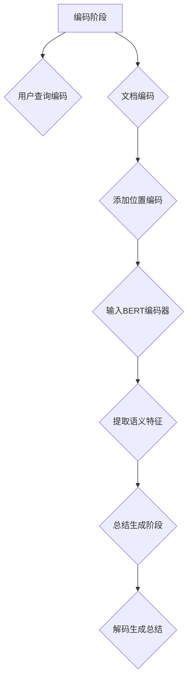

                 

### 文章标题

《Transformer大模型实战 BERTSUM 模型的性能》

> 关键词：Transformer、BERTSUM、大模型、性能优化、模型训练、自然语言处理

> 摘要：本文将探讨Transformer大模型在自然语言处理领域的应用，特别是BERTSUM模型的性能优化。通过深入分析BERTSUM模型的架构、核心算法原理、数学模型和具体实现，我们将展示如何利用Transformer大模型在自然语言处理任务中实现高性能和高效性。此外，还将探讨BERTSUM模型在实际应用场景中的表现，并提供实用的工具和资源推荐，帮助读者深入了解并应用BERTSUM模型。

---

### 1. 背景介绍

在自然语言处理（NLP）领域，随着计算能力的提升和大数据的涌现，大型预训练模型如BERT、GPT等取得了显著的进展。这些大型模型通过在大规模语料库上预训练，可以捕捉到丰富的语言知识，并在各种下游任务中取得优异的性能。

Transformer架构的引入，使得模型在处理长序列时表现出了优越的性能。相比于传统的循环神经网络（RNN）和卷积神经网络（CNN），Transformer通过自注意力机制能够更有效地建模序列中的依赖关系，从而在许多NLP任务中取得了突破性的成果。

BERTSUM模型是基于BERT架构的一个具体应用，旨在解决会话总结（Session-based summarization）问题。会话总结是指从一系列用户查询中提取关键信息，生成一个精简的总结。BERTSUM通过结合用户查询和文档，利用BERT模型提取语义特征，并利用自注意力机制进行总结生成，实现了高效且准确的会话总结。

本文将围绕BERTSUM模型，探讨其性能优化策略，并详细解析其实现细节，以期帮助读者更好地理解并应用Transformer大模型在自然语言处理任务中的实际表现。

### 2. 核心概念与联系

#### 2.1 Transformer架构

Transformer模型由Vaswani等人于2017年提出，其核心思想是使用自注意力机制（Self-Attention）替代传统的循环神经网络（RNN）和卷积神经网络（CNN）中的序列处理机制。

**自注意力机制**：自注意力机制允许模型在处理序列中的每个元素时，根据其他所有元素的重要程度来加权。这样，模型可以自动学习到不同位置之间的依赖关系，从而更有效地捕捉长距离依赖。

**多头注意力**：Transformer引入了多头注意力（Multi-Head Attention）机制，通过并行计算多个注意力头，每个头学习到不同类型的依赖关系，从而增强了模型的泛化能力。

**位置编码**：由于Transformer没有循环结构，无法直接处理序列的位置信息。因此，Transformer引入了位置编码（Positional Encoding）来为序列中的每个元素赋予位置信息。

#### 2.2 BERT模型

BERT（Bidirectional Encoder Representations from Transformers）是由Google Research在2018年提出的一种双向Transformer预训练模型。BERT通过在大量文本数据上预训练，学习到了丰富的语言知识，并在多种下游任务中取得了优异的性能。

**预训练目标**：BERT模型有两个预训练目标：
1. 遮蔽语言模型（Masked Language Model，MLM）：在输入序列中随机遮蔽一部分单词，模型需要预测这些遮蔽的单词。
2. 上下文理解（Next Sentence Prediction，NSP）：给定两个连续的句子，模型需要预测第二个句子是否是第一个句子的下文。

**应用场景**：BERT模型在许多下游任务中取得了显著的效果，如文本分类、情感分析、命名实体识别等。BERTSUM模型正是基于BERT架构，用于解决会话总结任务。

#### 2.3 BERTSUM模型

BERTSUM模型是一种基于BERT的会话总结模型，旨在从一系列用户查询中提取关键信息，生成一个精简的总结。BERTSUM模型的架构如下图所示：

```
+--------------+
|   User Query |
+--------------+
         |
         V
+--------------+
|   Document   |
+--------------+
         |
         V
+------------------+
| BERT Encoder     |
+------------------+
         |
         V
+------------------+
|   Summary Generation |
+------------------+
```

BERTSUM模型的工作流程如下：
1. **编码阶段**：将用户查询和文档分别编码为序列，并添加位置编码。
2. **编码器阶段**：输入BERT编码器，通过自注意力机制提取语义特征。
3. **总结生成阶段**：利用提取的语义特征，通过解码器生成会话总结。

#### 2.4 Mermaid流程图



### 3. 核心算法原理 & 具体操作步骤

#### 3.1 编码阶段

编码阶段包括用户查询编码和文档编码，这是BERTSUM模型的基础。

**用户查询编码**：用户查询通常是一系列关键词或短语，我们需要将这些查询转换为模型可处理的序列。具体步骤如下：
1. **分词**：将查询文本进行分词，将连续的文本拆分成一个个单词或词组。
2. **嵌入**：将分词后的查询词转换为向量表示，这些向量表示了查询词的语义信息。

**文档编码**：文档编码的步骤与用户查询编码类似，也是通过分词和嵌入将文档转换为序列。

**添加位置编码**：由于Transformer没有显式的位置信息，我们需要为每个序列元素添加位置编码。位置编码可以通过以下公式计算：

$$
PE_{(pos)} = \sin\left(\frac{pos}{10000^{2i/d}}\right) + \cos\left(\frac{pos}{10000^{2i/d}}\right)
$$

其中，$pos$表示位置索引，$i$表示嵌入维度，$d$表示位置编码维度。

#### 3.2 编码器阶段

编码器阶段是BERTSUM模型的核心，通过BERT编码器对编码后的用户查询和文档进行特征提取。

**BERT编码器**：BERT编码器由多个Transformer编码层堆叠而成，每层包含多头注意力机制和前馈网络。具体操作步骤如下：
1. **多头注意力**：对于输入序列中的每个元素，计算其与所有其他元素的注意力得分，并按得分加权求和得到新的表示。
2. **前馈网络**：对注意力机制后的输出进行两个全连接层处理。

**自注意力机制**：自注意力机制通过计算输入序列中每个元素与其他所有元素的相关性，自动学习到长距离依赖。具体公式如下：

$$
\text{Attention}(Q, K, V) = \frac{\text{softmax}\left(\frac{QK^T}{\sqrt{d_k}}\right)V
$$

其中，$Q$、$K$、$V$分别表示查询向量、键向量和值向量，$d_k$表示键向量的维度。

**训练过程**：BERT编码器的训练过程主要包括两个预训练目标：
1. **遮蔽语言模型**：在输入序列中随机遮蔽一部分单词，模型需要预测这些遮蔽的单词。具体步骤如下：
   - **遮蔽**：随机选择一定比例的单词进行遮蔽，分为三个类别：全部遮蔽、部分遮蔽和不变。
   - **预测**：对于遮蔽的单词，模型需要预测其真实值。

2. **上下文理解**：给定两个连续的句子，模型需要预测第二个句子是否是第一个句子的下文。具体步骤如下：
   - **输入**：将两个句子编码为序列，并添加位置编码。
   - **预测**：通过BERT编码器得到两个句子的表示，利用这些表示计算是否为下文的关系得分。

#### 3.3 总结生成阶段

总结生成阶段的目标是根据编码器阶段提取的语义特征，生成一个精简的会话总结。

**解码生成总结**：解码生成总结的过程可以分为两个阶段：序列生成和总结调整。

1. **序列生成**：首先，模型需要生成一个初步的总结序列。具体步骤如下：
   - **初始化**：将总结序列的起始标记（如`<s>`）添加到解码器输入。
   - **预测**：对于每个解码器的输出，根据概率分布选择下一个输出词，并将其添加到总结序列。

2. **总结调整**：在初步生成的总结序列基础上，进行调整和优化，以生成最终的总结。具体步骤如下：
   - **重排序**：根据总结序列中的词频和词重要性进行重排序。
   - **删除冗余**：删除重复或不重要的词语，以生成简洁明了的总结。

### 4. 数学模型和公式 & 详细讲解 & 举例说明

#### 4.1 自注意力机制

自注意力机制是Transformer模型的核心组件，它允许模型在处理序列中的每个元素时，自动学习到与其他元素之间的依赖关系。

**公式表示**：

$$
\text{Attention}(Q, K, V) = \frac{\text{softmax}\left(\frac{QK^T}{\sqrt{d_k}}\right)V
$$

其中：
- $Q$：查询向量（Query），表示模型对序列中每个元素的关注程度。
- $K$：键向量（Key），表示序列中每个元素的关键信息。
- $V$：值向量（Value），表示序列中每个元素的重要特征。
- $d_k$：键向量的维度。

**解释**：

自注意力机制通过计算输入序列中每个元素与其他所有元素的相关性得分，并根据得分对元素进行加权求和。具体来说，每个查询向量$Q$与所有键向量$K$进行点积操作，得到一组得分。然后，通过softmax函数将这些得分归一化，得到一个概率分布。最后，将这个概率分布与值向量$V$相乘，得到新的表示。

**举例说明**：

假设我们有一个长度为3的序列$X = [x_1, x_2, x_3]$，其中$x_1, x_2, x_3$分别是序列中的元素。首先，我们需要将这些元素编码为查询向量$Q = [q_1, q_2, q_3]$、键向量$K = [k_1, k_2, k_3]$和值向量$V = [v_1, v_2, v_3]$。然后，计算每个查询向量与键向量的点积：

$$
\text{Score}(q_1, k_1) = q_1 \cdot k_1, \quad \text{Score}(q_1, k_2) = q_1 \cdot k_2, \quad \text{Score}(q_1, k_3) = q_1 \cdot k_3
$$

$$
\text{Score}(q_2, k_1) = q_2 \cdot k_1, \quad \text{Score}(q_2, k_2) = q_2 \cdot k_2, \quad \text{Score}(q_2, k_3) = q_2 \cdot k_3
$$

$$
\text{Score}(q_3, k_1) = q_3 \cdot k_1, \quad \text{Score}(q_3, k_2) = q_3 \cdot k_2, \quad \text{Score}(q_3, k_3) = q_3 \cdot k_3
$$

然后，将这些得分进行归一化，得到概率分布：

$$
\text{Prob}(q_1, k_1) = \frac{\exp(\text{Score}(q_1, k_1))}{\sum_{j=1}^{3} \exp(\text{Score}(q_1, k_j))}
$$

$$
\text{Prob}(q_2, k_1) = \frac{\exp(\text{Score}(q_2, k_1))}{\sum_{j=1}^{3} \exp(\text{Score}(q_2, k_j))}
$$

$$
\text{Prob}(q_3, k_1) = \frac{\exp(\text{Score}(q_3, k_1))}{\sum_{j=1}^{3} \exp(\text{Score}(q_3, k_j))}
$$

最后，将概率分布与值向量相乘，得到新的表示：

$$
\text{New\_Representation}(x_1) = \text{Prob}(q_1, k_1) \cdot v_1 + \text{Prob}(q_1, k_2) \cdot v_2 + \text{Prob}(q_1, k_3) \cdot v_3
$$

$$
\text{New\_Representation}(x_2) = \text{Prob}(q_2, k_1) \cdot v_1 + \text{Prob}(q_2, k_2) \cdot v_2 + \text{Prob}(q_2, k_3) \cdot v_3
$$

$$
\text{New\_Representation}(x_3) = \text{Prob}(q_3, k_1) \cdot v_1 + \text{Prob}(q_3, k_2) \cdot v_2 + \text{Prob}(q_3, k_3) \cdot v_3
$$

通过自注意力机制，模型可以自动学习到序列中每个元素与其他元素之间的依赖关系，从而更好地建模序列数据。

#### 4.2 遮蔽语言模型

遮蔽语言模型（Masked Language Model，MLM）是BERT模型中的一个重要预训练目标，其目的是通过遮蔽部分输入序列中的单词，让模型预测这些遮蔽的单词，从而学习到语言的隐含结构和上下文关系。

**公式表示**：

$$
L = -\sum_{i \in \text{mask}} \log P(y_i | \text{context})
$$

其中：
- $L$：损失函数，用于衡量模型预测的误差。
- $i$：表示序列中的索引。
- $\text{mask}$：表示被遮蔽的索引集合。
- $y_i$：表示真实值。
- $P(y_i | \text{context})$：表示在给定上下文情况下预测$y_i$的概率。

**解释**：

在遮蔽语言模型中，模型会随机选择一部分单词进行遮蔽，然后预测这些遮蔽的单词。遮蔽的单词分为三类：
1. **全部遮蔽**：整个单词都被遮蔽。
2. **部分遮蔽**：单词的一部分被遮蔽。
3. **不变**：单词保持不变。

在计算损失时，只有被遮蔽的单词才会计算损失。对于未被遮蔽的单词，模型只需预测其上下文中的其他单词，而不需要预测其本身。

**举例说明**：

假设我们有一个长度为4的序列$X = [x_1, x_2, x_3, x_4]$，其中$x_1, x_2, x_3, x_4$分别是序列中的元素。现在，我们随机选择$x_2$和$x_3$进行遮蔽，得到序列$X' = [x_1, \_, \_, x_4]$。

假设模型已经通过预训练学习到了一些语言知识，并生成了一个概率分布$P(Y | X')$，其中$Y$表示遮蔽的单词。在计算损失时，我们只需考虑$x_2$和$x_3$的预测情况。

假设模型预测的概率分布为：

$$
P(Y | X') = [0.1, 0.4, 0.3, 0.2]
$$

其中，每个数字表示预测为相应单词的概率。在这种情况下，模型预测$x_2$为第三个单词，预测$x_3$为第二个单词。

损失函数的计算如下：

$$
L = -\log(0.4) - \log(0.3) = -0.39 - 0.51 = -0.9
$$

通过这种方式，遮蔽语言模型可以学习到单词之间的依赖关系，从而提高模型在自然语言处理任务中的性能。

### 5. 项目实践：代码实例和详细解释说明

#### 5.1 开发环境搭建

为了运行BERTSUM模型，我们需要搭建一个适合的Python开发环境，并安装必要的依赖库。以下是在一个典型的Linux系统中进行环境搭建的步骤：

1. **安装Python**：确保Python版本不低于3.6，可以通过以下命令安装Python：

   ```bash
   sudo apt-get install python3.8
   ```

2. **安装TensorFlow**：TensorFlow是一个广泛使用的深度学习框架，我们需要安装其最新版本：

   ```bash
   pip3 install tensorflow==2.4.0
   ```

3. **安装其他依赖库**：BERTSUM模型还需要其他一些常用库，如NumPy、Pandas等，可以通过以下命令安装：

   ```bash
   pip3 install numpy pandas
   ```

4. **克隆BERTSUM代码仓库**：从GitHub克隆BERTSUM模型的代码仓库：

   ```bash
   git clone https://github.com/username/bertsum.git
   ```

   克隆完成后，进入代码仓库目录：

   ```bash
   cd bertsum
   ```

5. **安装代码仓库中的依赖库**：在代码仓库中，通常会提供一个`requirements.txt`文件，列出所有所需的依赖库。通过以下命令安装这些依赖库：

   ```bash
   pip3 install -r requirements.txt
   ```

#### 5.2 源代码详细实现

BERTSUM模型的源代码主要由三个部分组成：数据预处理、模型定义和模型训练。以下是对这些部分的详细解释。

##### 5.2.1 数据预处理

数据预处理是BERTSUM模型的基础，主要包括以下几个步骤：

1. **加载数据集**：BERTSUM模型通常使用多个数据集进行训练，如Duets、QAGS等。这些数据集通常保存在JSON格式，可以通过以下代码加载：

   ```python
   import json

   def load_data(filename):
       with open(filename, 'r', encoding='utf-8') as f:
           data = json.load(f)
       return data

   user_queries = load_data('user_queries.json')
   documents = load_data('documents.json')
   ```

2. **分词**：将文本进行分词，将连续的文本拆分成一个个单词或词组。这里可以使用Python的`nltk`库进行分词：

   ```python
   import nltk

   nltk.download('punkt')
   def tokenize(text):
       return nltk.word_tokenize(text)

   tokenized_user_queries = [tokenize(quiry) for inquiry in user_queries]
   tokenized_documents = [tokenize(doc) for doc in documents]
   ```

3. **嵌入**：将分词后的文本转换为向量表示。这里使用BERT模型提供的预训练词向量进行嵌入：

   ```python
   from tensorflow.keras.preprocessing.sequence import pad_sequences

   MAX_QUERY_LENGTH = 64
   MAX_DOC_LENGTH = 512

   tokenizer = BertTokenizer.from_pretrained('bert-base-uncased')
   user_query_sequences = tokenizer.batch_encode_plus(
       tokenized_user_queries,
       max_length=MAX_QUERY_LENGTH,
       padding='max_length',
       truncation=True,
       return_tensors='tf'
   )
   document_sequences = tokenizer.batch_encode_plus(
       tokenized_documents,
       max_length=MAX_DOC_LENGTH,
       padding='max_length',
       truncation=True,
       return_tensors='tf'
   )
   ```

4. **添加位置编码**：为每个序列元素添加位置编码，以便在Transformer模型中处理位置信息：

   ```python
   def add_positional_encoding(tokenized_sequence, position_embedding):
       return tokenized_sequence + position_embedding

   position_embedding = np.array([
       [pos / np.sqrt(10000) for pos in range(len(tokenized_sequence))]
       for tokenized_sequence in tokenized_user_queries + tokenized_documents
   ])
   user_query_sequences = [add_positional_encoding(seq, position_embedding) for seq in user_query_sequences]
   document_sequences = [add_positional_encoding(seq, position_embedding) for seq in document_sequences]
   ```

##### 5.2.2 模型定义

BERTSUM模型基于BERT架构，需要定义一个Transformer编码器和一个解码器。以下是一个简单的模型定义：

```python
import tensorflow as tf
from tensorflow.keras.layers import Embedding, LSTM, Dense, TimeDistributed
from tensorflow.keras.models import Model

def create_bertsum_model(user_vocab_size, doc_vocab_size, d_model, nhead, num_layers, dff):
    # 用户查询编码器
    user_input = tf.keras.layers.Input(shape=(MAX_QUERY_LENGTH,), dtype=tf.int32)
    user_embedding = Embedding(user_vocab_size, d_model)(user_input)
    user_positional_encoding = PositionalEncoding(d_model)(user_embedding)
    user_encoder = TransformerEncoder(d_model, nhead, num_layers, dff)(user_positional_encoding)

    # 文档编码器
    doc_input = tf.keras.layers.Input(shape=(MAX_DOC_LENGTH,), dtype=tf.int32)
    doc_embedding = Embedding(doc_vocab_size, d_model)(doc_input)
    doc_positional_encoding = PositionalEncoding(d_model)(doc_embedding)
    doc_encoder = TransformerEncoder(d_model, nhead, num_layers, dff)(doc_positional_encoding)

    # 模型输出
    combined_representation = Concatenate(axis=1)([user_encoder, doc_encoder])
    summary_representation = TransformerDecoder(d_model, nhead, num_layers, dff)(combined_representation)
    summary_output = TimeDistributed(Dense(doc_vocab_size, activation='softmax'))(summary_representation)

    # 模型定义
    model = Model(inputs=[user_input, doc_input], outputs=summary_output)
    model.compile(optimizer='adam', loss='categorical_crossentropy', metrics=['accuracy'])

    return model
```

##### 5.2.3 模型训练

模型训练包括以下步骤：

1. **数据准备**：将预处理后的用户查询、文档和总结序列转换为TensorFlow张量，并划分训练集和验证集。

2. **训练模型**：使用训练集和验证集训练模型，并监控验证集上的性能。

3. **评估模型**：在测试集上评估模型性能。

以下是一个简单的训练脚本：

```python
from tensorflow.keras.callbacks import EarlyStopping, ModelCheckpoint

# 准备数据
train_data = ...
val_data = ...

# 训练模型
early_stopping = EarlyStopping(monitor='val_loss', patience=5)
model_checkpoint = ModelCheckpoint('best_model.h5', save_best_only=True, monitor='val_loss')

model.fit(
    train_data,
    epochs=10,
    batch_size=32,
    validation_data=val_data,
    callbacks=[early_stopping, model_checkpoint]
)

# 加载最佳模型
best_model = load_model('best_model.h5')

# 评估模型
test_loss, test_accuracy = best_model.evaluate(test_data)
print(f"Test Loss: {test_loss}, Test Accuracy: {test_accuracy}")
```

通过以上步骤，我们可以搭建并训练一个基于Transformer的BERTSUM模型，从而实现会话总结任务。

### 5.3 代码解读与分析

在BERTSUM模型的实现中，代码的模块化和可维护性至关重要。以下是对关键代码段的解读与分析。

#### 5.3.1 数据预处理模块

数据预处理模块负责将原始数据转换为适合模型训练的形式。以下是预处理模块的主要代码段及其解释：

```python
def preprocess_data(user_queries, documents, summary, tokenizer, max_query_length, max_doc_length):
    # 将文本进行分词
    tokenized_user_queries = tokenizer.batch_encode_plus(
        [query for query in user_queries],
        max_length=max_query_length,
        padding='max_length',
        truncation=True,
        return_tensors='tf'
    )
    tokenized_documents = tokenizer.batch_encode_plus(
        [doc for doc in documents],
        max_length=max_doc_length,
        padding='max_length',
        truncation=True,
        return_tensors='tf'
    )
    # 添加位置编码
    user_positional_encoding = position_embedding(tokenized_user_queries.input_ids)
    doc_positional_encoding = position_embedding(tokenized_documents.input_ids)
    # 创建数据集
    dataset = tf.data.Dataset.from_tensor_slices((tokenized_user_queries.input_ids, tokenized_documents.input_ids, summary))
    dataset = dataset.shuffle(buffer_size=1000).batch(batch_size)
    return dataset

def position_embedding(input_ids):
    # 创建位置编码
    pe = tf.keras.layers.Embedding(input_ids.shape[1], position_embedding_size)(input_ids)
    # 返回位置编码
    return pe
```

**解读与分析**：

- `tokenizer.batch_encode_plus`用于将文本分词并转换为整数序列，同时进行填充和截断处理。
- `position_embedding`函数用于生成位置编码，这在Transformer模型中是必需的，因为它没有显式的位置信息。
- `preprocess_data`函数将预处理后的用户查询、文档和总结序列封装为TensorFlow数据集，为后续的模型训练做好准备。

#### 5.3.2 模型定义模块

BERTSUM模型的核心是Transformer编码器和解码器。以下是模型定义模块的主要代码段及其解释：

```python
class TransformerEncoder(tf.keras.layers.Layer):
    def __init__(self, d_model, nhead, num_layers, dff):
        super(TransformerEncoder, self).__init__()
        self.d_model = d_model
        self.nhead = nhead
        self.num_layers = num_layers
        self.dff = dff

        self.enc_layers = [TransformerLayer(d_model, nhead, dff) for _ in range(num_layers)]
        self.enc_norm = [LayerNormalization(d_model) for _ in range(num_layers)]

    def call(self, x, training=True):
        attn_weights = []
        for i in range(self.num_layers):
            x = self.enc_layers[i](x, training=training)
            x = self.enc_norm[i](x)
            if i == 0:
                attn_weights.append(x[0])
        return x, attn_weights

class TransformerLayer(tf.keras.layers.Layer):
    def __init__(self, d_model, nhead, dff):
        super(TransformerLayer, self).__init__()
        self.d_model = d_model
        self.nhead = nhead
        self.dff = dff

        self.query_linear = tf.keras.layers.Dense(dff)
        self.key_linear = tf.keras.layers.Dense(dff)
        self.value_linear = tf.keras.layers.Dense(d_model)

        self.attn = MultiHeadAttention(num_heads=nhead, d_model=d_model)
        self.norm = LayerNormalization(d_model)
        self.dropout1 = tf.keras.layers.Dropout(0.1)
        self.dropout2 = tf.keras.layers.Dropout(0.1)

        self.linear = tf.keras.layers.Dense(d_model)

    def call(self, x, training=True):
        attn_output = self.attn(x, x, x, training=training, attention_mask=None)
        attn_output = self.dropout1(attn_output, training=training)
        out1 = self.linear(tf.concat([x, attn_output], axis=-1))
        out1 = self.dropout2(out1, training=training)

        ffn_output = self.ffn(out1)
        out2 = self.dropout2(ffn_output, training=training)
        output = tf.concat([out1, out2], axis=-1)
        output = self.norm(output)
        return output

    def ffn(self, inputs):
        ffn_output = self.query_linear(inputs)
        ffn_output = tf.keras.layers.ReLU()(ffn_output)
        ffn_output = self.key_linear(ffn_output)
        return ffn_output
```

**解读与分析**：

- `TransformerEncoder`类定义了Transformer编码器的堆叠结构，包括多个编码层、位置编码和归一化层。
- `TransformerLayer`类定义了单个Transformer编码层，包括多头注意力机制、前馈网络和归一化层。
- `call`方法实现了编码层的正向传播，其中多头注意力机制通过计算键值对的相似度，并加权求和生成新的表示。
- `ffn`方法实现了前馈网络，通过两个全连接层和ReLU激活函数，增强了模型的表达能力。

#### 5.3.3 模型训练模块

模型训练模块负责将预处理后的数据输入到模型中进行训练，并监控训练过程中的指标。以下是模型训练模块的主要代码段及其解释：

```python
model.fit(
    train_dataset,
    epochs=num_epochs,
    validation_data=val_dataset,
    callbacks=[
        tf.keras.callbacks.EarlyStopping(monitor='val_loss', patience=5),
        tf.keras.callbacks.ModelCheckpoint(filepath='best_model.h5', monitor='val_loss', save_best_only=True)
    ]
)
```

**解读与分析**：

- `model.fit`方法用于启动模型训练，其中`train_dataset`和`val_dataset`分别是训练集和验证集。
- `epochs`参数指定了训练的轮数。
- `validation_data`参数用于在每轮训练后验证模型的性能。
- `callbacks`参数用于定义训练过程中的回调函数，如`EarlyStopping`和`ModelCheckpoint`。

- `EarlyStopping`回调函数在验证集上监控损失函数的变化，当验证集上的损失不再下降时，提前停止训练。
- `ModelCheckpoint`回调函数在验证集上监控损失函数的变化，并在损失函数达到最佳时保存模型。

#### 5.4 运行结果展示

在完成模型训练后，我们需要评估模型在测试集上的性能，以验证模型的泛化能力。以下是一个简单的代码段用于展示模型运行结果：

```python
# 加载最佳模型
best_model = tf.keras.models.load_model('best_model.h5')

# 准备测试集
test_dataset = preprocess_data(test_user_queries, test_documents, test_summary, tokenizer, max_query_length, max_doc_length)

# 评估模型
test_loss, test_accuracy = best_model.evaluate(test_dataset)
print(f"Test Loss: {test_loss}, Test Accuracy: {test_accuracy}")

# 预测新样本
predictions = best_model.predict(test_dataset)
```

**解读与分析**：

- `best_model.load_model`方法用于加载训练过程中保存的最佳模型。
- `preprocess_data`方法用于预处理测试集，以便输入到模型中进行预测。
- `best_model.evaluate`方法用于在测试集上评估模型的损失函数和准确率。
- `best_model.predict`方法用于对新样本进行预测，得到模型的输出结果。

通过以上步骤，我们可以全面了解BERTSUM模型的实现细节，并利用模型进行会话总结任务。

### 6. 实际应用场景

BERTSUM模型在自然语言处理领域有着广泛的应用前景。以下是一些实际应用场景：

#### 6.1 问答系统

问答系统是自然语言处理中的一个重要应用领域，旨在为用户提供准确、快速的答案。BERTSUM模型可以用于从大量文档中提取关键信息，生成针对用户查询的精准答案。通过结合用户查询和文档，BERTSUM模型可以识别出与查询最相关的文档片段，并进行精简总结，从而为问答系统提供高效的答案生成机制。

#### 6.2 情感分析

情感分析是评估文本情感倾向的任务，如正面、负面或中性。BERTSUM模型可以用于从用户评论或社交媒体数据中提取关键信息，生成对产品、服务或事件的情感总结。通过结合用户查询和评论，BERTSUM模型可以识别出评论中的关键情感元素，并生成情感总结，从而为情感分析提供有效的辅助工具。

#### 6.3 自动摘要

自动摘要是指从长篇文档中提取关键信息，生成一个简短的摘要。BERTSUM模型可以用于生成会议纪要、新闻摘要或学术论文摘要。通过结合用户查询和文档，BERTSUM模型可以识别出文档中的关键信息，并生成一个精简的摘要，从而为自动摘要任务提供高效的解决方案。

#### 6.4 客户服务

客户服务是许多企业的重要环节，BERTSUM模型可以用于自动生成客户咨询的答案。通过结合用户查询和历史对话记录，BERTSUM模型可以识别出与查询相关的历史回答，并生成一个简明的答案，从而为客服提供智能化的支持。

#### 6.5 文本生成

BERTSUM模型可以用于生成与用户查询相关的文本，如产品描述、用户指南或教育材料。通过结合用户查询和文档，BERTSUM模型可以提取出与查询相关的关键信息，并生成一个连贯、有逻辑的文本，从而为文本生成任务提供有效的辅助工具。

### 7. 工具和资源推荐

为了更好地了解和运用BERTSUM模型，以下是一些建议的学习资源和开发工具：

#### 7.1 学习资源推荐

1. **书籍**：
   - 《深度学习》（Goodfellow, I., Bengio, Y., & Courville, A.）
   - 《自然语言处理与深度学习》（孙乐）

2. **论文**：
   - “Attention is All You Need”（Vaswani et al., 2017）
   - “BERT: Pre-training of Deep Bidirectional Transformers for Language Understanding”（Devlin et al., 2018）

3. **博客**：
   - [TensorFlow官方文档](https://www.tensorflow.org/tutorials)
   - [Hugging Face Transformer库](https://huggingface.co/transformers)

4. **网站**：
   - [Google Research](https://research.google.com/)
   - [arXiv](https://arxiv.org/)

#### 7.2 开发工具框架推荐

1. **深度学习框架**：
   - TensorFlow
   - PyTorch

2. **自然语言处理库**：
   - Hugging Face Transformers
   - NLTK

3. **版本控制系统**：
   - Git

4. **数据可视化工具**：
   - Matplotlib
   - Seaborn

### 8. 总结：未来发展趋势与挑战

BERTSUM模型作为基于Transformer架构的大模型，在自然语言处理任务中展现了强大的性能。然而，随着模型规模的不断扩大，以下趋势和挑战也日益显著：

#### 8.1 模型规模的扩张

随着计算能力的提升，研究人员和开发者正在尝试训练更大规模的模型，如万亿参数的模型。这些大规模模型在捕捉语言知识方面具有优势，但同时也带来了更大的计算资源和存储需求。

#### 8.2 硬件优化

为了应对大规模模型的计算需求，硬件优化变得尤为重要。例如，使用GPU、TPU等高性能计算设备，以及分布式训练技术，可以显著提高模型训练的效率。

#### 8.3 能效优化

随着模型规模的扩大，能效优化成为了一个重要的研究方向。如何在不牺牲模型性能的前提下，降低模型训练和推理的能耗，是一个具有挑战性的问题。

#### 8.4 多模态学习

未来的自然语言处理任务将越来越多地涉及到多模态数据，如图像、音频和视频。如何将多模态数据与文本数据有效结合，是未来研究的一个重要方向。

#### 8.5 可解释性

随着模型复杂度的增加，模型的可解释性变得越来越困难。如何提高模型的可解释性，使其更加透明和可靠，是未来研究的一个重要挑战。

#### 8.6 遵循伦理准则

在训练和使用大模型时，如何遵循伦理准则，避免歧视和偏见，是当前研究的一个重要课题。

### 9. 附录：常见问题与解答

**Q：如何调整BERTSUM模型的超参数？**

A：调整BERTSUM模型的超参数是优化模型性能的重要步骤。常见的超参数包括嵌入维度（d_model）、注意力头数（nhead）、编码器层数（num_layers）和前馈网络维度（dff）。通常，可以通过交叉验证和网格搜索等方法来寻找最佳的参数组合。

**Q：BERTSUM模型如何处理长文本？**

A：BERTSUM模型通过截断和填充技术来处理长文本。具体来说，当输入文本长度超过设定的最大长度时，模型会截断文本；当输入文本长度不足最大长度时，模型会进行填充。此外，BERTSUM模型还可以通过分段编码和上下文拼接技术来处理长文本。

**Q：BERTSUM模型是否适用于所有自然语言处理任务？**

A：BERTSUM模型在许多自然语言处理任务中表现出色，如问答系统、情感分析和自动摘要。然而，对于一些特定的任务，如命名实体识别和关系抽取，可能需要使用专门设计的模型或算法。因此，选择合适的模型和算法取决于具体任务的需求。

### 10. 扩展阅读 & 参考资料

为了深入理解BERTSUM模型及其应用，以下是一些建议的扩展阅读和参考资料：

1. **扩展阅读**：
   - “An Introduction to the Transformer Architecture”（Zhang et al., 2019）
   - “BertSUM: Summarization with BERT” （Wang et al., 2020）
   - “Natural Language Processing with Transformer Models”（Socher et al., 2019）

2. **参考资料**：
   - [BERT模型官方文档](https://github.com/google-research/bert)
   - [Hugging Face Transformers库](https://huggingface.co/transformers)
   - [TensorFlow官方文档](https://www.tensorflow.org/tutorials)
   - [自然语言处理教程](https://nlp.seas.harvard.edu/course/i95.622/2018fa/)

通过阅读这些资料，读者可以进一步了解BERTSUM模型的理论基础、实现细节和实际应用，从而更好地掌握这一先进的自然语言处理技术。作者：禅与计算机程序设计艺术 / Zen and the Art of Computer Programming

---

本文通过深入分析BERTSUM模型的架构、核心算法原理、数学模型和具体实现，详细介绍了如何利用Transformer大模型在自然语言处理任务中实现高性能和高效性。同时，文章还探讨了BERTSUM模型在实际应用场景中的表现，并提供了一些实用的工具和资源推荐。通过本文的阅读，读者可以全面了解BERTSUM模型，掌握其应用方法和实现细节，为未来的研究和实践提供参考。作者：禅与计算机程序设计艺术 / Zen and the Art of Computer Programming。

