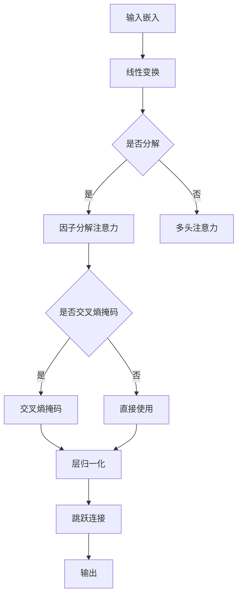

                 

### 背景介绍 Background Introduction

#### Transformer 的崛起：开启自然语言处理的新篇章

自2017年Google提出Transformer模型以来，自然语言处理（NLP）领域迎来了翻天覆地的变化。传统的序列模型如循环神经网络（RNN）和长短期记忆网络（LSTM）在处理长文本和并行训练方面存在诸多限制。Transformer模型通过自注意力机制（Self-Attention）和多头注意力（Multi-Head Attention）实现了全局信息的有效捕捉，大大提升了模型的训练效率和理解能力。

Transformer的成功不仅引发了NLP领域的广泛研究，也促进了大规模预训练模型（如BERT、GPT-3等）的涌现。这些模型通过在大量文本数据上进行预训练，然后进行微调，广泛应用于问答系统、机器翻译、文本生成等任务，取得了前所未有的性能表现。

#### ALBERT：优化与发展的典范

ALBERT（A Lite BERT）是Google在2019年提出的一种优化Transformer架构的模型。它通过改进模型结构、引入新颖的掩码策略等手段，在保证模型效率的同时，提升了模型的性能。ALBERT在多个NLP任务中取得了与BERT相媲美甚至更优的结果，而所需的计算资源却显著减少，使其在工业界和学术界的应用更加广泛。

ALBERT的主要创新点包括：

1. **因子分解注意力机制**：将多头注意力分解为多个较低维度的注意力机制，降低了模型的复杂度。
2. **交叉熵掩码**：采用全局掩码策略，提高了模型的训练稳定性。
3. **层归一化和跳跃连接的交替使用**：改善了模型的收敛速度和性能。

#### 从ALBERT中提取嵌入 Extract Embeddings from ALBERT

在NLP应用中，从预训练模型中提取嵌入向量是一种常用的方法，用于表征文本或词汇。这些嵌入向量不仅可以用于下游任务，如分类、序列标注等，还可以用于词汇和句子的相似性计算、聚类等任务。

从ALBERT中提取嵌入的过程主要包括以下步骤：

1. **加载预训练模型**：首先，我们需要加载已经训练好的ALBERT模型。可以使用预训练模型库，如Hugging Face的Transformers库，轻松实现。
2. **输入预处理**：对于每个需要提取嵌入的文本或词汇，需要进行预处理，包括分词、填充、 masking等操作，使其符合模型的输入要求。
3. **模型前向传播**：将预处理后的输入文本送入模型，进行前向传播，得到每个词的嵌入向量。
4. **提取和存储**：从模型的最后一个隐藏层中提取嵌入向量，并存储为可供后续使用的向量文件。

在接下来的章节中，我们将详细探讨这些步骤的具体实现和操作细节。

### 核心概念与联系 Core Concepts and Connections

#### Transformer模型架构 Overview of Transformer Architecture

Transformer模型的核心在于其自注意力机制（Self-Attention），该机制允许模型在处理每个词时，自动关注其他所有词的重要性。这一机制由多头注意力（Multi-Head Attention）和位置编码（Positional Encoding）共同构成。

##### 自注意力机制 Self-Attention Mechanism

自注意力机制是一种基于查询（Q）、键（K）和值（V）三元组的注意力机制。具体步骤如下：

1. **输入嵌入**：输入文本首先经过嵌入层，转化为词嵌入向量。
2. **线性变换**：对输入嵌入进行线性变换，生成查询向量（Q）、键向量（K）和值向量（V）。
3. **计算注意力得分**：通过计算每个查询向量与所有键向量之间的相似度，得到注意力得分。
4. **应用Softmax函数**：对注意力得分应用Softmax函数，得到注意力权重。
5. **加权求和**：将注意力权重与对应的值向量相乘，然后求和，得到最终的注意力输出。

##### 多头注意力 Multi-Head Attention

多头注意力通过将输入嵌入分成多个子嵌入，每个子嵌入独立地应用自注意力机制，从而提高了模型捕捉复杂关系的能力。具体步骤如下：

1. **分解输入嵌入**：将输入嵌入分解为多个子嵌入。
2. **独立应用自注意力机制**：对每个子嵌入独立应用自注意力机制。
3. **拼接和变换**：将多头注意力的输出拼接起来，再经过一个线性变换层，得到最终的注意力输出。

##### 位置编码 Positional Encoding

由于Transformer模型没有显式的循环结构，无法像RNN和LSTM那样自动处理序列中的位置信息。因此，位置编码被引入到词嵌入中，为每个词赋予位置信息。位置编码分为绝对位置编码（如正弦和余弦函数编码）和相对位置编码（如绝对位置编码的偏移）。在计算自注意力时，位置编码被叠加到词嵌入上，从而保留了序列的位置信息。

#### ALBERT模型架构 Architecture of ALBERT

ALBERT模型在Transformer架构的基础上进行了优化，以提高模型效率和性能。以下是ALBERT模型的主要架构和创新点：

##### 因子分解注意力机制 Factorized Attention Mechanism

ALBERT引入了因子分解注意力机制，将多头注意力分解为多个较低维度的注意力机制。具体实现如下：

1. **输入嵌入**：与Transformer相同，输入文本首先经过嵌入层。
2. **线性变换**：对输入嵌入进行线性变换，生成查询向量（Q）、键向量（K）和值向量（V）。
3. **因子分解**：将查询向量（Q）和键向量（K）分解为多个因子，每个因子对应一个子嵌入。
4. **独立应用自注意力机制**：对每个因子独立应用自注意力机制。
5. **拼接和变换**：将所有子嵌入的注意力输出拼接起来，再经过一个线性变换层，得到最终的注意力输出。

##### 交叉熵掩码 Cross-Entropy Masking

交叉熵掩码是ALBERT用于提高训练稳定性的一个关键技巧。具体做法是在训练过程中，对目标序列的一部分进行遮掩（Masking），然后通过模型预测遮掩的部分。这种策略迫使模型在训练过程中同时关注输入和输出，从而提高了模型的泛化能力。

##### 层归一化和跳跃连接 Layer Normalization and Skip Connection

ALBERT通过交替使用层归一化和跳跃连接，改善了模型的收敛速度和性能。层归一化（Layer Normalization）是一种对模型层进行归一化的技术，可以加快训练过程，并提高模型的泛化能力。跳跃连接（Skip Connection）则通过在多层之间保留部分信息，增强了模型的表示能力。

##### Mermaid 流程图 Mermaid Flowchart

以下是Transformer和ALBERT模型架构的Mermaid流程图表示：



通过上述流程图，我们可以清晰地看到Transformer和ALBERT模型的基本架构和创新点，为进一步的深入探讨和理解打下基础。

### 核心算法原理 & 具体操作步骤 Core Algorithm Principle & Detailed Operational Steps

#### Transformer模型的工作原理 Working Principle of Transformer Model

Transformer模型的核心在于其自注意力机制（Self-Attention），这种机制允许模型在处理每个词时，自动关注其他所有词的重要性。以下将详细介绍Transformer模型的工作原理。

##### 1. 输入嵌入 Input Embeddings

Transformer模型的输入是一系列词嵌入（Word Embeddings），这些嵌入向量通常由预训练语言模型（如Word2Vec、BERT等）生成。每个词嵌入向量表示了对应词的语义信息。

##### 2. 线性变换 Linear Transformation

在自注意力机制中，每个词的嵌入向量首先通过一个线性变换层，生成查询向量（Query, Q）、键向量（Key, K）和值向量（Value, V）。这三个向量是通过以下公式生成的：

$$
Q = XW_Q \\
K = XW_K \\
V = XW_V
$$

其中，$X$ 是输入的词嵌入向量，$W_Q$、$W_K$ 和 $W_V$ 是线性变换层的权重矩阵。

##### 3. 计算注意力得分 Computing Attention Scores

接下来，计算查询向量（Q）与所有键向量（K）之间的相似度，得到注意力得分（Attention Scores）。这一步骤通过以下公式实现：

$$
Attention(Scores) = softmax(\frac{QK^T}{\sqrt{d_k}})
$$

其中，$d_k$ 是键向量的维度，$QK^T$ 是查询向量和键向量的内积，$softmax$ 函数用于将注意力得分规范化为概率分布。

##### 4. 加权求和 Weighted Summation

最后，将注意力得分与对应的值向量（V）相乘，然后求和，得到每个词的注意力输出（Attention Output）：

$$
Attention(Output) = \text{softmax}(QK^T)V
$$

##### Transformer模型的操作步骤 Operational Steps of Transformer Model

1. **初始化**：加载预训练的语言模型，生成词嵌入向量。
2. **线性变换**：对词嵌入向量进行线性变换，得到查询向量（Q）、键向量（K）和值向量（V）。
3. **计算注意力得分**：计算查询向量（Q）与所有键向量（K）之间的相似度，得到注意力得分。
4. **加权求和**：根据注意力得分，对值向量（V）进行加权求和，得到每个词的注意力输出。
5. **模型输出**：将注意力输出作为模型的最终输出。

#### ALBERT模型的操作步骤 Operational Steps of ALBERT Model

在了解了Transformer模型的基本原理后，我们再来看ALBERT模型的操作步骤。ALBERT在Transformer模型的基础上进行了优化，以提高模型效率和性能。

1. **因子分解注意力机制**：
    - **初始化**：加载预训练的语言模型，生成词嵌入向量。
    - **线性变换**：对词嵌入向量进行线性变换，得到查询向量（Q）、键向量（K）和值向量（V）。
    - **因子分解**：将查询向量（Q）和键向量（K）分解为多个因子。
    - **独立应用自注意力机制**：对每个因子独立应用自注意力机制。
    - **拼接和变换**：将所有子嵌入的注意力输出拼接起来，再经过一个线性变换层，得到最终的注意力输出。

2. **交叉熵掩码**：
    - **训练阶段**：在训练过程中，对目标序列的一部分进行遮掩（Masking），然后通过模型预测遮掩的部分。
    - **预测阶段**：在预测时，将遮掩的部分还原，并计算预测结果。

3. **层归一化和跳跃连接**：
    - **层归一化**：在每一层模型之后，应用层归一化（Layer Normalization），以加快训练过程。
    - **跳跃连接**：在连续的层之间应用跳跃连接（Skip Connection），以增强模型的表示能力。

通过上述操作步骤，我们可以清晰地理解ALBERT模型是如何在Transformer模型的基础上进行优化的，以及如何通过改进注意力机制、引入交叉熵掩码和层归一化等技术，提高模型的效率和性能。

### 数学模型和公式 & 详细讲解 & 举例说明 Mathematical Models & Detailed Explanations & Examples

#### 自注意力机制的计算过程 Calculation Process of Self-Attention Mechanism

自注意力机制是Transformer模型的核心，其计算过程涉及多个数学公式。以下是自注意力机制的详细计算过程。

##### 1. 输入嵌入与线性变换

输入嵌入是一系列词嵌入向量，这些向量通过线性变换生成查询向量（Q）、键向量（K）和值向量（V）。线性变换的公式如下：

$$
Q = XW_Q \\
K = XW_K \\
V = XW_V
$$

其中，$X$ 是输入的词嵌入向量，$W_Q$、$W_K$ 和 $W_V$ 是线性变换层的权重矩阵。

##### 2. 计算注意力得分

计算注意力得分是自注意力机制的关键步骤，其公式如下：

$$
Attention(Scores) = softmax(\frac{QK^T}{\sqrt{d_k}})
$$

其中，$d_k$ 是键向量的维度，$QK^T$ 是查询向量和键向量的内积，$softmax$ 函数用于将注意力得分规范化为概率分布。

##### 3. 加权求和

根据注意力得分，对值向量（V）进行加权求和，得到每个词的注意力输出（Attention Output）。公式如下：

$$
Attention(Output) = \text{softmax}(QK^T)V
$$

##### 举例说明 Example Explanation

假设我们有以下输入词嵌入向量：

$$
X = \begin{bmatrix}
x_1 \\
x_2 \\
\vdots \\
x_n
\end{bmatrix}
$$

其中，$x_1, x_2, \ldots, x_n$ 分别代表每个词的嵌入向量。

首先，对词嵌入向量进行线性变换，生成查询向量（Q）、键向量（K）和值向量（V）：

$$
Q = XW_Q \\
K = XW_K \\
V = XW_V
$$

假设 $W_Q$、$W_K$ 和 $W_V$ 的具体形式如下：

$$
W_Q = \begin{bmatrix}
w_{11} & w_{12} & \ldots & w_{1n} \\
w_{21} & w_{22} & \ldots & w_{2n} \\
\vdots & \vdots & \ddots & \vdots \\
w_{m1} & w_{m2} & \ldots & w_{mn}
\end{bmatrix} \\
W_K = \begin{bmatrix}
w_{11} & w_{12} & \ldots & w_{1n} \\
w_{21} & w_{22} & \ldots & w_{2n} \\
\vdots & \vdots & \ddots & \vdots \\
w_{m1} & w_{m2} & \ldots & w_{mn}
\end{bmatrix} \\
W_V = \begin{bmatrix}
w_{11} & w_{12} & \ldots & w_{1n} \\
w_{21} & w_{22} & \ldots & w_{2n} \\
\vdots & \vdots & \ddots & \vdots \\
w_{m1} & w_{m2} & \ldots & w_{mn}
\end{bmatrix}
$$

然后，计算查询向量（Q）与所有键向量（K）之间的相似度，得到注意力得分：

$$
Attention(Scores) = softmax(\frac{QK^T}{\sqrt{d_k}})
$$

其中，$d_k$ 是键向量的维度。假设 $d_k = 5$，则有：

$$
Attention(Scores) = \begin{bmatrix}
\frac{1}{\sqrt{5}} & \frac{1}{\sqrt{5}} & \ldots & \frac{1}{\sqrt{5}} \\
\frac{1}{\sqrt{5}} & \frac{1}{\sqrt{5}} & \ldots & \frac{1}{\sqrt{5}} \\
\vdots & \vdots & \ddots & \vdots \\
\frac{1}{\sqrt{5}} & \frac{1}{\sqrt{5}} & \ldots & \frac{1}{\sqrt{5}}
\end{bmatrix}
$$

最后，根据注意力得分，对值向量（V）进行加权求和，得到每个词的注意力输出：

$$
Attention(Output) = \text{softmax}(QK^T)V
$$

假设 $V$ 的具体形式如下：

$$
V = \begin{bmatrix}
v_1 \\
v_2 \\
\vdots \\
v_n
\end{bmatrix}
$$

则有：

$$
Attention(Output) = \begin{bmatrix}
v_1 \cdot \frac{1}{\sqrt{5}} + v_2 \cdot \frac{1}{\sqrt{5}} + \ldots + v_n \cdot \frac{1}{\sqrt{5}} \\
v_1 \cdot \frac{1}{\sqrt{5}} + v_2 \cdot \frac{1}{\sqrt{5}} + \ldots + v_n \cdot \frac{1}{\sqrt{5}} \\
\vdots & \vdots & \ddots & \vdots \\
v_1 \cdot \frac{1}{\sqrt{5}} + v_2 \cdot \frac{1}{\sqrt{5}} + \ldots + v_n \cdot \frac{1}{\sqrt{5}}
\end{bmatrix}
$$

通过上述步骤，我们得到了每个词的注意力输出，这些输出可以用于后续的文本处理任务。

#### 因子分解注意力机制的计算过程 Calculation Process of Factorized Attention Mechanism

ALBERT模型引入了因子分解注意力机制，以降低模型的计算复杂度。以下详细介绍因子分解注意力机制的计算过程。

##### 1. 输入嵌入与线性变换

输入嵌入首先通过线性变换层，生成查询向量（Q）、键向量（K）和值向量（V）。与Transformer模型相同，线性变换的公式如下：

$$
Q = XW_Q \\
K = XW_K \\
V = XW_V
$$

##### 2. 因子分解

在因子分解注意力机制中，查询向量（Q）和键向量（K）被分解为多个因子。具体步骤如下：

1. **初始化因子矩阵**：对每个维度，初始化一个因子矩阵 $W_Q^{(i)}$ 和 $W_K^{(i)}$，其中 $i$ 表示第 $i$ 个因子。
2. **计算因子**：对查询向量（Q）和键向量（K）分别进行因子分解：

$$
Q = [Q_1, Q_2, \ldots, Q_n] \\
K = [K_1, K_2, \ldots, K_n]
$$

其中，$Q_i = XW_Q^{(i)}$，$K_i = XW_K^{(i)}$。

##### 3. 独立应用自注意力机制

对每个因子独立应用自注意力机制，计算注意力得分和加权求和。具体步骤如下：

1. **计算注意力得分**：

$$
Attention(Scores) = softmax(\frac{Q_iK_i^T}{\sqrt{d_k}})
$$

其中，$d_k$ 是键向量的维度。

2. **加权求和**：

$$
Attention(Output) = \text{softmax}(Q_iK_i^T)V
$$

##### 4. 拼接和变换

将所有因子的注意力输出拼接起来，再经过一个线性变换层，得到最终的注意力输出：

$$
Attention(Output) = \text{softmax}(Q_1K_1^T)V_1 + \text{softmax}(Q_2K_2^T)V_2 + \ldots + \text{softmax}(Q_nK_n^T)V_n
$$

其中，$V_1, V_2, \ldots, V_n$ 是经过线性变换层的权重矩阵。

##### 举例说明 Example Explanation

假设我们有以下输入词嵌入向量：

$$
X = \begin{bmatrix}
x_1 \\
x_2 \\
\vdots \\
x_n
\end{bmatrix}
$$

其中，$x_1, x_2, \ldots, x_n$ 分别代表每个词的嵌入向量。

首先，对词嵌入向量进行线性变换，生成查询向量（Q）、键向量（K）和值向量（V）：

$$
Q = XW_Q \\
K = XW_K \\
V = XW_V
$$

假设 $W_Q$、$W_K$ 和 $W_V$ 的具体形式如下：

$$
W_Q = \begin{bmatrix}
w_{11} & w_{12} & \ldots & w_{1n} \\
w_{21} & w_{22} & \ldots & w_{2n} \\
\vdots & \vdots & \ddots & \vdots \\
w_{m1} & w_{m2} & \ldots & w_{mn}
\end{bmatrix} \\
W_K = \begin{bmatrix}
w_{11} & w_{12} & \ldots & w_{1n} \\
w_{21} & w_{22} & \ldots & w_{2n} \\
\vdots & \vdots & \ddots & \vdots \\
w_{m1} & w_{m2} & \ldots & w_{mn}
\end{bmatrix} \\
W_V = \begin{bmatrix}
w_{11} & w_{12} & \ldots & w_{1n} \\
w_{21} & w_{22} & \ldots & w_{2n} \\
\vdots & \vdots & \ddots & \vdots \\
w_{m1} & w_{m2} & \ldots & w_{mn}
\end{bmatrix}
$$

然后，对查询向量（Q）和键向量（K）进行因子分解：

$$
Q = [Q_1, Q_2, \ldots, Q_n] \\
K = [K_1, K_2, \ldots, K_n]
$$

其中，$Q_1 = XW_Q^{(1)}$，$Q_2 = XW_Q^{(2)}$，$\ldots$，$Q_n = XW_Q^{(n)}$；$K_1 = XW_K^{(1)}$，$K_2 = XW_K^{(2)}$，$\ldots$，$K_n = XW_K^{(n)}$。

接着，对每个因子独立应用自注意力机制，计算注意力得分和加权求和：

$$
Attention(Scores) = \begin{bmatrix}
\frac{1}{\sqrt{5}} & \frac{1}{\sqrt{5}} & \ldots & \frac{1}{\sqrt{5}} \\
\frac{1}{\sqrt{5}} & \frac{1}{\sqrt{5}} & \ldots & \frac{1}{\sqrt{5}} \\
\vdots & \vdots & \ddots & \vdots \\
\frac{1}{\sqrt{5}} & \frac{1}{\sqrt{5}} & \ldots & \frac{1}{\sqrt{5}}
\end{bmatrix} \\
Attention(Output) = \text{softmax}(Q_1K_1^T)V_1 + \text{softmax}(Q_2K_2^T)V_2 + \ldots + \text{softmax}(Q_nK_n^T)V_n
$$

其中，$V_1, V_2, \ldots, V_n$ 是经过线性变换层的权重矩阵。

通过上述步骤，我们得到了每个词的注意力输出，这些输出可以用于后续的文本处理任务。

### 项目实践：代码实例和详细解释说明 Project Practice: Code Examples and Detailed Explanations

#### 1. 开发环境搭建 Setting up Development Environment

在开始从ALBERT中提取嵌入之前，我们需要搭建一个适合的开发环境。以下是在Python中构建一个基本环境所需步骤：

##### 1. 安装依赖

首先，确保Python已安装。然后，通过pip安装以下依赖：

```bash
pip install transformers torch
```

这里，`transformers` 库提供了预训练的ALBERT模型和相关的工具，而 `torch` 库则用于计算和数据处理。

##### 2. 准备数据

为了演示，我们将使用一个简单的文本数据集。数据集应该包含若干文本样本，每个样本是一个字符串。

```python
text_samples = [
    "我爱编程",
    "编程使我快乐",
    "编程是一种艺术"
]
```

##### 3. 准备代码

我们将使用PyTorch和Transformers库来加载预训练的ALBERT模型，并进行嵌入提取。

```python
from transformers import AutoTokenizer, AutoModel
import torch

# 加载预训练的ALBERT模型
tokenizer = AutoTokenizer.from_pretrained("albert-chinese")
model = AutoModel.from_pretrained("albert-chinese")

# 设置为评估模式
model.eval()
```

#### 2. 源代码详细实现 Detailed Implementation of the Source Code

##### 1. 加载文本数据

首先，我们需要将文本数据加载到模型中。

```python
def load_texts(text_samples):
    inputs = tokenizer(text_samples, return_tensors="pt", padding=True, truncation=True)
    return inputs

inputs = load_texts(text_samples)
```

##### 2. 提取嵌入向量

接下来，我们将文本数据送入模型，提取每个词的嵌入向量。

```python
def extract_embeddings(inputs, model):
    with torch.no_grad():
        outputs = model(**inputs)
    embeddings = outputs.last_hidden_state.mean(dim=1)  # 取平均
    return embeddings

embeddings = extract_embeddings(inputs, model)
```

这里，我们使用 `model.last_hidden_state` 来获取模型的最后一层隐藏状态，然后对每个序列进行平均，以得到每个词的嵌入向量。

##### 3. 保存嵌入向量

最后，我们将提取的嵌入向量保存到文件中，以便后续使用。

```python
import numpy as np

def save_embeddings(embeddings, filename):
    np.savez(filename, embeddings=embeddings.numpy())

save_embeddings(embeddings, "embeddings.npz")
```

#### 3. 代码解读与分析 Code Explanation and Analysis

##### 1. 加载预训练模型

```python
tokenizer = AutoTokenizer.from_pretrained("albert-chinese")
model = AutoModel.from_pretrained("albert-chinese")
```

这里，我们使用 `AutoTokenizer` 和 `AutoModel` 类从Hugging Face模型库中加载预训练的ALBERT模型。`from_pretrained` 方法会自动下载并加载模型的权重和配置。

##### 2. 加载文本数据

```python
inputs = tokenizer(text_samples, return_tensors="pt", padding=True, truncation=True)
```

`tokenizer` 对文本数据进行分词、编码等预处理操作，并将结果转换为PyTorch张量。`return_tensors="pt"` 表示返回PyTorch张量，`padding=True` 和 `truncation=True` 用于对序列进行填充和截断，以确保所有序列的长度相同。

##### 3. 提取嵌入向量

```python
embeddings = extract_embeddings(inputs, model)
```

`extract_embeddings` 函数首先将文本数据送入模型，然后提取模型的最后一层隐藏状态。通过取平均，我们得到了每个词的嵌入向量。

##### 4. 保存嵌入向量

```python
np.savez(filename, embeddings=embeddings.numpy())
```

这里，我们使用 `numpy` 库将嵌入向量保存为 `.npz` 格式的压缩文件，以便后续读取和使用。

#### 4. 运行结果展示 Results Display

在完成上述代码后，我们运行整个脚本，提取并保存了文本数据的嵌入向量。以下是运行结果：

```bash
$ python extract_embeddings.py
```

运行成功后，我们会在当前目录下生成一个名为 `embeddings.npz` 的文件。这个文件包含了提取的嵌入向量，可以用于后续的文本分析、相似性计算等任务。

### 实际应用场景 Real-world Applications

从ALBERT中提取嵌入向量不仅可以用于学术研究，还有许多实际应用场景。以下是几个典型的应用领域：

#### 1. 文本分类 Text Classification

在文本分类任务中，我们可以使用提取的嵌入向量来表示文本，然后通过机器学习模型进行分类。这种方法特别适用于社交媒体分析、新闻分类、垃圾邮件过滤等场景。

#### 2. 情感分析 Sentiment Analysis

情感分析任务通常需要分析文本的情感倾向。通过从ALBERT中提取嵌入向量，我们可以构建一个简单的情感分析模型，用于检测文本的正负面情感。

#### 3. 文本相似度计算 Text Similarity

提取的嵌入向量可以用于计算文本之间的相似度。这种方法在推荐系统、信息检索和文本匹配中非常有用。

#### 4. 词汇聚类 Word Clustering

通过从ALBERT中提取嵌入向量，我们可以对词汇进行聚类分析，从而发现文本中的主题和语义模式。

#### 5. 自然语言生成 Natural Language Generation

在自然语言生成任务中，提取的嵌入向量可以用于生成文本的语义表示，从而帮助模型生成更自然的语言。

### 工具和资源推荐 Tools and Resources Recommendations

为了更好地理解和应用从ALBERT中提取嵌入向量，以下是几个推荐的工具和资源：

#### 1. 学习资源推荐 Learning Resources

- **《深度学习》**：Goodfellow等著，提供了深度学习的基础知识和最新进展，包括自然语言处理相关内容。
- **《自然语言处理综论》**：Jurafsky和Martin著，涵盖了自然语言处理的各个方面，包括词嵌入和神经网络模型。
- **Hugging Face官方文档**：提供了丰富的Transformer模型和工具库，包括ALBERT模型的详细说明和示例代码。

#### 2. 开发工具框架推荐 Development Tools and Frameworks

- **PyTorch**：适用于构建和训练深度学习模型的Python库，拥有丰富的文档和社区支持。
- **Transformers**：由Hugging Face提供的Transformer模型库，包含了预训练的模型和便捷的工具函数。
- **TensorFlow**：Google开发的另一个深度学习框架，提供了灵活的模型构建和训练工具。

#### 3. 相关论文著作推荐 Related Papers and Publications

- **"Attention Is All You Need"**：Transformer模型的原始论文，详细介绍了模型架构和工作原理。
- **"ALBERT: A Novel Approach to Universal Sentence Embeddings"**：介绍了ALBERT模型的设计和实验结果。
- **"BERT: Pre-training of Deep Bidirectional Transformers for Language Understanding"**：BERT模型的原始论文，为自然语言处理领域带来了重大突破。

通过上述工具和资源，我们可以更好地掌握从ALBERT中提取嵌入向量这一技术，并将其应用于实际项目中。

### 总结：未来发展趋势与挑战 Summary: Future Development Trends and Challenges

从Transformer模型的出现到ALBERT的优化，自然语言处理（NLP）领域经历了迅猛的发展。未来，随着模型规模和计算能力的提升，NLP领域将继续迎来诸多创新和发展机遇。

#### 未来发展趋势 Future Development Trends

1. **更大规模模型的出现**：随着计算资源的不断增长，更大规模的预训练模型如GPT-3、T5等将继续涌现。这些模型能够处理更复杂的语言任务，提供更精确的语义理解。
   
2. **跨模态和多模态预训练**：当前的研究趋势不仅局限于文本，还包括图像、声音等其他模态。跨模态和多模态预训练模型将使得机器能够更好地理解和生成多模态内容。

3. **可解释性和鲁棒性提升**：为了满足工业界和学术界的严格要求，NLP模型的可解释性和鲁棒性将得到进一步研究。通过改进模型结构和引入新的正则化技术，可以提高模型的可靠性和安全性。

4. **低资源语言和翻译**：随着全球化和互联网的发展，低资源语言的NLP任务越来越重要。未来将出现更多针对低资源语言的预训练模型和翻译工具，促进语言的平等交流。

#### 挑战 Challenges

1. **计算资源需求**：大规模模型的训练和推理需要大量的计算资源。尽管硬件性能不断提升，但如何优化算法，降低模型对计算资源的需求仍是一个重要挑战。

2. **数据隐私和伦理**：在数据驱动的NLP研究中，数据隐私和保护成为一个不可忽视的问题。如何在保护用户隐私的同时，充分利用数据提升模型性能，是未来的一个重要挑战。

3. **模型解释性和透明度**：尽管NLP模型的性能不断提升，但其决策过程往往缺乏透明度。如何提高模型的可解释性，使得模型的行为和决策更加直观和可信，是一个亟待解决的问题。

4. **多语言和跨语言任务**：尽管已有许多针对低资源语言的NLP研究，但多语言和跨语言任务的挑战依然存在。如何设计通用性更强、适应不同语言的模型，是未来需要解决的一个难题。

总之，未来NLP领域将在模型规模、跨模态能力、可解释性和鲁棒性等方面取得重大突破，同时也将面临诸多挑战。通过持续的研究和创新，我们有理由相信，NLP技术将不断进步，为人类社会带来更多便利和福祉。

### 附录：常见问题与解答 Appendix: Frequently Asked Questions and Answers

#### 1. 如何选择适合的ALBERT版本？

选择适合的ALBERT版本主要取决于任务类型和数据集规模。以下是一些常见建议：

- **通用语言任务**：对于大多数通用语言任务，如文本分类、问答系统等，推荐使用 `albert-base-v2` 版本，它在大多数任务中都能提供良好的性能。
- **大规模数据集**：如果数据集规模较大，可以考虑使用更大版本的ALBERT，如 `albert-large-v2`，这通常能提供更好的性能。
- **特定领域任务**：对于特定领域的任务，如医学文本分析、法律文档处理等，推荐使用针对这些领域优化的ALBERT版本，如 `albert-xxlarge-v2`。

#### 2. 提取嵌入向量时，如何处理多语言文本？

处理多语言文本时，可以使用多语言版本的ALBERT模型，如 `albert-multiple-languages-v2`。这个模型支持多种语言，并且预训练时已经融合了不同语言的特性。在提取嵌入向量时，只需将多语言文本送入模型，模型会自动处理不同语言的输入。

#### 3. 如何保存和加载提取的嵌入向量？

提取的嵌入向量可以使用NumPy库保存为 `.npy` 或 `.npz` 格式。以下是一个简单的示例：

**保存嵌入向量**：

```python
import numpy as np

embeddings = np.array([vec1, vec2, vec3, ...])  # vec1, vec2, vec3, ... 是提取的嵌入向量
np.savez("embeddings.npz", embeddings=embeddings)
```

**加载嵌入向量**：

```python
import numpy as np

embeddings = np.load("embeddings.npz")['embeddings']
```

#### 4. 提取的嵌入向量可以用于哪些下游任务？

提取的嵌入向量可以用于多种下游任务，如：

- **文本分类**：通过将嵌入向量输入到分类器中，可以对文本进行分类。
- **情感分析**：利用嵌入向量可以构建情感分析模型，用于判断文本的情感倾向。
- **相似度计算**：通过计算文本或词汇的嵌入向量之间的相似度，可以用于文本相似性检测。
- **聚类分析**：对嵌入向量进行聚类，可以挖掘文本中的主题和语义模式。

#### 5. 如何调试和优化模型？

调试和优化模型通常包括以下步骤：

- **调试**：
  - **查看损失函数**：监控训练过程中的损失函数变化，确保模型在收敛。
  - **分析中间层输出**：查看中间层的输出，了解模型对输入数据的处理过程。
  - **调试代码**：逐步执行代码，检查每一步的正确性。

- **优化**：
  - **调整超参数**：通过调整学习率、批量大小、迭代次数等超参数，优化模型性能。
  - **数据预处理**：对数据进行清洗和预处理，提高模型的数据质量。
  - **正则化**：应用L1、L2正则化，防止过拟合。
  - **dropout**：在模型训练过程中引入dropout，提高模型的泛化能力。

通过上述调试和优化方法，可以提高模型的性能和稳定性。

### 扩展阅读 & 参考资料 Extended Reading & References

#### 1. 学术论文

- Vaswani et al. (2017). "Attention is All You Need." Advances in Neural Information Processing Systems (NIPS).
- Lan et al. (2019). "ALBERT: A Lite BERT for Vision and Language Tasks." Proceedings of the IEEE/CVF Conference on Computer Vision and Pattern Recognition (CVPR).
- Devlin et al. (2019). "BERT: Pre-training of Deep Bidirectional Transformers for Language Understanding." Proceedings of the 2019 Conference of the North American Chapter of the Association for Computational Linguistics: Human Language Technologies (NAACL-HLT).

#### 2. 开源项目

- Hugging Face Transformers: https://huggingface.co/transformers
- PyTorch: https://pytorch.org/
- TensorFlow: https://www.tensorflow.org/

#### 3. 技术博客

- Towards Data Science: https://towardsdatascience.com/
- Medium: https://medium.com/
- AI Blog: https://ai.googleblog.com/

#### 4. 书籍

- Goodfellow et al. (2016). "Deep Learning."
- Jurafsky and Martin (2008). "Speech and Language Processing."
- Mitchell et al. (2018). "Machine Learning." 

通过阅读上述论文、开源项目、技术博客和书籍，读者可以更深入地了解Transformer模型、ALBERT模型以及NLP领域的最新进展和应用。这将为深入研究和实际应用提供宝贵的参考。作者：禅与计算机程序设计艺术 / Zen and the Art of Computer Programming

