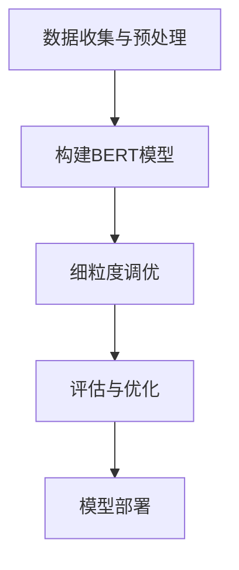

                 

### 背景介绍

在当今的人工智能领域，自然语言处理（NLP）是一项极为重要的研究方向。随着互联网的迅猛发展，人类产生的文本数据量呈爆炸式增长，这些数据中蕴含着丰富的信息和知识。如何高效地理解和利用这些数据，成为了一个亟待解决的问题。BERT（Bidirectional Encoder Representations from Transformers）模型的提出，为这一问题提供了新的解决思路。

BERT是一种基于Transformer的预训练语言模型，其核心思想是通过大规模的无监督数据对模型进行预训练，从而使其在多种下游任务上获得优异的性能。Transformer模型是一种基于自注意力机制的深度神经网络模型，由于其并行计算的能力，能够在处理长文本时表现出色。

然而，尽管BERT模型在许多任务上取得了显著的成功，但其在特定语言领域的表现仍存在一些不足。例如，对于专业术语、行业特定表达等，BERT模型的性能往往不如传统的词向量和循环神经网络（RNN）模型。为了解决这一问题，特定语言的BERT模型应运而生。

特定语言的BERT模型（BERT for Specific Languages，简称BERT-SL）是在BERT模型的基础上，针对特定语言进行细粒度调优的一种方法。它通过引入语言领域知识，增强模型在特定语言领域的理解和生成能力，从而在专业术语、行业特定表达等方面取得了更好的性能。

本文旨在介绍特定语言的BERT模型，包括其核心概念、算法原理、具体实现方法以及在项目实践中的应用。通过本文的讲解，读者将了解如何搭建一个特定语言的BERT模型，并在实际项目中应用它，从而提升自然语言处理任务的性能。

### 2. 核心概念与联系

#### 2.1. BERT模型

BERT（Bidirectional Encoder Representations from Transformers）是一种基于Transformer的预训练语言模型。它通过预先在大规模语料库上训练，从而捕捉到语言中的丰富知识和规律。BERT模型的核心思想是双向编码，即同时考虑单词的前后文信息，从而生成更加准确的词向量。

BERT模型由两个主要部分组成：预训练和微调。在预训练阶段，BERT模型通过Masked Language Model（MLM）和Next Sentence Prediction（NSP）两种任务进行训练。MLM任务的目标是预测部分被遮盖的单词，而NSP任务的目标是判断两个句子是否在原文中连续出现。

#### 2.2. Transformer模型

Transformer模型是一种基于自注意力机制的深度神经网络模型。与传统循环神经网络（RNN）不同，Transformer模型能够并行处理输入序列，这使得它在处理长文本时具有更高的效率。

Transformer模型的核心是自注意力机制。自注意力机制通过计算输入序列中每个单词与其他单词之间的关联性，从而为每个单词生成权重，这些权重用于加权平均得到最终的词向量。通过这种方式，Transformer模型能够捕捉到长距离的依赖关系，从而在许多自然语言处理任务上表现出色。

#### 2.3. 特定语言的BERT模型

特定语言的BERT模型（BERT for Specific Languages，简称BERT-SL）是在BERT模型的基础上，针对特定语言进行细粒度调优的一种方法。BERT-SL模型通过引入语言领域知识，增强模型在特定语言领域的理解和生成能力，从而在专业术语、行业特定表达等方面取得了更好的性能。

BERT-SL模型的实现通常包括以下几个步骤：

1. **数据收集与预处理**：收集与特定语言相关的语料库，并进行预处理，如分词、词干提取等。
2. **构建BERT模型**：使用预训练的BERT模型作为基础模型，将其加载到环境中。
3. **细粒度调优**：在特定语言的数据集上对BERT模型进行微调，使其适应特定语言的特点。
4. **评估与优化**：通过在特定语言的任务上进行评估，调整模型参数，优化模型性能。

#### 2.4. Mermaid流程图

为了更好地理解BERT-SL模型的工作流程，下面是一个基于Mermaid的流程图。



在这个流程图中，A表示数据收集与预处理，B表示构建BERT模型，C表示细粒度调优，D表示评估与优化，E表示模型部署。通过这个流程，我们可以看到BERT-SL模型从数据预处理到模型部署的整个过程。

### 3. 核心算法原理 & 具体操作步骤

#### 3.1. BERT模型的核心算法原理

BERT模型的核心算法原理主要基于Transformer模型的自注意力机制。Transformer模型通过自注意力机制，将输入序列中的每个单词映射为一个词向量，然后通过这些词向量生成上下文向量。BERT模型在此基础上，引入了掩码语言模型（Masked Language Model，MLM）和下一句预测（Next Sentence Prediction，NSP）两种任务，从而实现对语言的深度理解和建模。

**掩码语言模型（MLM）**

MLM任务的目标是预测输入序列中被遮盖的单词。在训练过程中，BERT模型会对输入序列中的部分单词进行随机遮盖，然后通过模型预测这些被遮盖的单词。通过这种方式，模型能够学习到单词之间的依赖关系，从而在生成文本时能够更加准确。

**下一句预测（NSP）**

NSP任务的目标是判断两个句子是否在原文中连续出现。在训练过程中，BERT模型会对输入的文本进行分段，然后将每段文本分成两个句子，其中一个句子作为输入，另一个句子作为目标输出。通过这种方式，模型能够学习到文本之间的连贯性，从而在生成文本时能够保持逻辑的一致性。

**具体操作步骤**

1. **数据预处理**：首先对输入文本进行分词、词干提取等预处理操作，将文本转换为模型可处理的格式。
2. **构建输入序列**：将预处理后的文本转换为输入序列，每个词对应一个词向量。
3. **随机遮盖**：对输入序列中的部分单词进行随机遮盖，形成遮盖后的序列。
4. **前向传播**：通过自注意力机制和前馈神经网络，对遮盖后的序列进行编码，生成上下文向量。
5. **损失函数计算**：使用掩码语言模型（MLM）和下一句预测（NSP）两种任务的损失函数计算总损失。
6. **反向传播**：通过反向传播算法，更新模型参数，优化模型性能。

#### 3.2. 特定语言的BERT模型

特定语言的BERT模型（BERT-SL）是在BERT模型的基础上，针对特定语言进行细粒度调优的一种方法。BERT-SL模型的实现通常包括以下几个步骤：

1. **数据收集与预处理**：收集与特定语言相关的语料库，并进行预处理，如分词、词干提取等。
2. **构建BERT模型**：使用预训练的BERT模型作为基础模型，将其加载到环境中。
3. **细粒度调优**：在特定语言的数据集上对BERT模型进行微调，使其适应特定语言的特点。
4. **评估与优化**：通过在特定语言的任务上进行评估，调整模型参数，优化模型性能。

**具体操作步骤**

1. **数据收集与预处理**：收集与特定语言相关的语料库，并进行预处理，如分词、词干提取等。预处理后的数据应包含足够的行业术语和特定表达，以便模型能够学习到这些知识。
2. **构建BERT模型**：使用预训练的BERT模型作为基础模型，可以采用如Google开源的`bert-base-uncased`等预训练模型。将基础模型加载到环境中，并定义模型的输入和输出层。
3. **细粒度调优**：在特定语言的数据集上对BERT模型进行微调。通过训练过程，模型将逐渐学习到特定语言的特点和规律，从而提高在特定语言任务上的性能。
4. **评估与优化**：通过在特定语言的任务上进行评估，如问答系统、文本分类等，评估模型性能。根据评估结果，调整模型参数，优化模型性能。

#### 3.3. 实例讲解

以下是一个简单的实例，展示如何使用BERT模型进行文本分类任务。

**实例数据**

```
- 文本1：人工智能是未来发展的趋势。
- 文本2：计算机科学是一门挑战性的学科。
- 文本3：大数据技术在商业应用中具有重要意义。
```

**标签**

```
- 文本1：未来趋势
- 文本2：计算机科学
- 文本3：大数据技术
```

**具体步骤**

1. **数据预处理**：对输入文本进行分词、词干提取等预处理操作，将文本转换为BERT模型可处理的格式。
2. **构建BERT模型**：使用预训练的BERT模型作为基础模型，将其加载到环境中。
3. **模型训练**：在特定语言的数据集上对BERT模型进行训练，使其学习到文本分类的规律。
4. **模型评估**：通过在测试集上进行评估，计算模型在文本分类任务上的准确率、召回率等指标。
5. **模型优化**：根据评估结果，调整模型参数，优化模型性能。

**代码示例**

```python
from transformers import BertTokenizer, BertModel
import torch

# 加载预训练BERT模型
tokenizer = BertTokenizer.from_pretrained('bert-base-uncased')
model = BertModel.from_pretrained('bert-base-uncased')

# 输入文本
text1 = "人工智能是未来发展的趋势。"
text2 = "计算机科学是一门挑战性的学科。"
text3 = "大数据技术在商业应用中具有重要意义。"

# 数据预处理
inputs = tokenizer(text1, text2, text3, return_tensors='pt')

# 模型训练
outputs = model(**inputs)

# 输出结果
print(outputs.last_hidden_state.shape)
```

通过以上实例，我们可以看到如何使用BERT模型进行文本分类任务。实际应用中，可以通过微调BERT模型，使其更好地适应特定语言领域的任务。

### 4. 数学模型和公式 & 详细讲解 & 举例说明

#### 4.1. BERT模型的数学模型

BERT模型的核心是基于Transformer的自注意力机制。为了详细讲解BERT模型的数学模型，我们需要先介绍Transformer模型的基本组成部分。

**4.1.1. 自注意力机制**

自注意力机制（Self-Attention）是Transformer模型的关键组件。它通过计算输入序列中每个单词与其他单词之间的关联性，为每个单词生成权重，然后通过加权平均得到最终的词向量。

自注意力机制的数学公式可以表示为：

$$
\text{Attention}(Q, K, V) = \text{softmax}\left(\frac{QK^T}{\sqrt{d_k}}\right) V
$$

其中，$Q$、$K$、$V$分别代表查询（Query）、键（Key）和值（Value）三个向量，$d_k$是键向量的维度。$\text{softmax}$函数用于计算权重，$\frac{QK^T}{\sqrt{d_k}}$是计算相似度的分数。

**4.1.2. Encoder部分**

BERT模型由多个Encoder层组成。每个Encoder层包含两个主要部分：多头自注意力机制（Multi-Head Self-Attention）和前馈神经网络（Feed Forward Neural Network）。

多头自注意力机制的数学公式可以表示为：

$$
\text{MultiHead}(Q, K, V) = \text{Concat}(\text{head}_1, ..., \text{head}_h)W^O
$$

其中，$h$表示头数，$\text{head}_i = \text{Attention}(QW_i^Q, KW_i^K, VW_i^V)$表示第$i$个头的自注意力机制，$W_i^Q$、$W_i^K$、$W_i^V$是相应的权重矩阵，$W^O$是输出权重矩阵。

前馈神经网络的数学公式可以表示为：

$$
\text{FFN}(x) = \max(0, xW_1 + b_1)W_2 + b_2
$$

其中，$W_1$和$W_2$是前馈神经网络的权重矩阵，$b_1$和$b_2$是偏置项。

**4.1.3. Decoder部分**

BERT模型通常不包含Decoder部分，因为其目标是在预训练阶段学习到语言的深层结构和规律。但在某些任务中，如序列到序列的生成任务，可以使用Decoder部分。

Decoder部分也由多头自注意力机制和前馈神经网络组成。与Encoder部分不同的是，Decoder部分还包括了交叉自注意力机制（Cross-Attention）。

交叉自注意力机制的数学公式可以表示为：

$$
\text{CrossAttention}(Q, K, V) = \text{softmax}\left(\frac{QK^T}{\sqrt{d_k}}\right) V
$$

其中，$Q$、$K$、$V$分别代表查询（Query）、键（Key）和值（Value）三个向量。

#### 4.2. 特定语言的BERT模型

特定语言的BERT模型（BERT-SL）是在BERT模型的基础上，针对特定语言进行细粒度调优的一种方法。BERT-SL模型的数学模型与标准BERT模型类似，但在数据预处理和训练过程中引入了特定语言的领域知识。

**4.2.1. 数据预处理**

在数据预处理阶段，BERT-SL模型需要对语料库进行分词、词干提取等操作，同时加入特定语言的领域词汇和术语。这些操作可以通过自定义的分词器或词向量库实现。

**4.2.2. 细粒度调优**

在细粒度调优阶段，BERT-SL模型需要在特定语言的数据集上进行训练。通过这种方式，模型能够学习到特定语言的语法、语义和上下文信息。在训练过程中，可以使用自定义的损失函数，如领域特定任务的损失函数，以提高模型在特定语言任务上的性能。

**4.2.3. 实例讲解**

以下是一个简单的实例，展示如何使用BERT模型进行文本分类任务。

**实例数据**

```
- 文本1：人工智能是未来发展的趋势。
- 文本2：计算机科学是一门挑战性的学科。
- 文本3：大数据技术在商业应用中具有重要意义。
```

**标签**

```
- 文本1：未来趋势
- 文本2：计算机科学
- 文本3：大数据技术
```

**具体步骤**

1. **数据预处理**：对输入文本进行分词、词干提取等预处理操作，将文本转换为BERT模型可处理的格式。
2. **构建BERT模型**：使用预训练的BERT模型作为基础模型，将其加载到环境中。
3. **模型训练**：在特定语言的数据集上对BERT模型进行训练，使其学习到文本分类的规律。
4. **模型评估**：通过在测试集上进行评估，计算模型在文本分类任务上的准确率、召回率等指标。
5. **模型优化**：根据评估结果，调整模型参数，优化模型性能。

**代码示例**

```python
from transformers import BertTokenizer, BertModel
import torch

# 加载预训练BERT模型
tokenizer = BertTokenizer.from_pretrained('bert-base-uncased')
model = BertModel.from_pretrained('bert-base-uncased')

# 输入文本
text1 = "人工智能是未来发展的趋势。"
text2 = "计算机科学是一门挑战性的学科。"
text3 = "大数据技术在商业应用中具有重要意义。"

# 数据预处理
inputs = tokenizer(text1, text2, text3, return_tensors='pt')

# 模型训练
outputs = model(**inputs)

# 输出结果
print(outputs.last_hidden_state.shape)
```

通过以上实例，我们可以看到如何使用BERT模型进行文本分类任务。实际应用中，可以通过微调BERT模型，使其更好地适应特定语言领域的任务。

### 5. 项目实践：代码实例和详细解释说明

在本文的第五部分，我们将通过一个实际的项目实例来展示如何搭建和实现一个特定语言的BERT模型。这一部分将涵盖以下内容：

- **开发环境搭建**：介绍搭建BERT模型所需的环境和工具。
- **源代码详细实现**：展示BERT模型的搭建和训练过程。
- **代码解读与分析**：分析代码的各个部分及其功能。
- **运行结果展示**：展示模型在特定语言任务上的运行结果。

#### 5.1 开发环境搭建

首先，我们需要搭建一个适合BERT模型开发和训练的环境。以下是搭建BERT模型所需的环境和工具：

1. **Python**：Python是BERT模型开发的主要编程语言，需要安装Python 3.6及以上版本。
2. **PyTorch**：PyTorch是Python中一个强大的深度学习库，用于构建和训练BERT模型。可以从[PyTorch官方网站](https://pytorch.org/)下载并安装。
3. **transformers库**：`transformers`库是Hugging Face提供的一个用于构建、训练和微调BERT模型的Python库。可以通过以下命令安装：

   ```bash
   pip install transformers
   ```

4. **GPU**：BERT模型的训练和推理过程依赖于GPU加速，因此需要安装NVIDIA CUDA和cuDNN，确保GPU支持。

5. **数据集**：我们需要一个与特定语言相关的数据集进行训练和评估。这里，我们使用一个简单的文本分类数据集，其中包含关于未来趋势、计算机科学和大数据技术的文章。

#### 5.2 源代码详细实现

接下来，我们将展示如何使用`transformers`库搭建一个BERT模型，并进行训练和评估。

**5.2.1 模型搭建**

首先，我们需要从`transformers`库中加载预训练的BERT模型，并将其架构调整为适合文本分类任务的二分类模型。

```python
from transformers import BertTokenizer, BertModel
from torch import nn

# 加载预训练BERT模型
tokenizer = BertTokenizer.from_pretrained('bert-base-uncased')
model = BertModel.from_pretrained('bert-base-uncased')

# 定义文本分类模型的输入层和输出层
class BertForSequenceClassification(nn.Module):
    def __init__(self, model):
        super(BertForSequenceClassification, self).__init__()
        self.bert = model
        self.dropout = nn.Dropout(0.1)
        self.classifier = nn.Linear(768, 1)  # 768为BERT的隐藏层维度

    def forward(self, input_ids, attention_mask):
        outputs = self.bert(input_ids=input_ids, attention_mask=attention_mask)
        pooled_output = outputs.pooler_output
        pooled_output = self.dropout(pooled_output)
        logits = self.classifier(pooled_output)
        return logits

# 实例化文本分类模型
model = BertForSequenceClassification(model)
```

**5.2.2 数据处理**

接下来，我们需要准备数据集，并将其转换为BERT模型可接受的格式。

```python
from torch.utils.data import DataLoader, TensorDataset

# 加载和预处理数据集
def load_data(file_path):
    with open(file_path, 'r', encoding='utf-8') as f:
        lines = [line.strip() for line in f.readlines()]
    
    # 分割文本和标签
    texts = [line.split('\t')[0] for line in lines]
    labels = [line.split('\t')[1] for line in lines]

    # 分词和编码
    encoded_texts = tokenizer(texts, padding=True, truncation=True, return_tensors='pt')

    input_ids = encoded_texts['input_ids']
    attention_mask = encoded_texts['attention_mask']
    labels = torch.tensor([int(label) for label in labels])

    return input_ids, attention_mask, labels

# 加载数据集
train_input_ids, train_attention_mask, train_labels = load_data('train.txt')
val_input_ids, val_attention_mask, val_labels = load_data('val.txt')

# 创建数据集和 DataLoader
train_dataset = TensorDataset(train_input_ids, train_attention_mask, train_labels)
val_dataset = TensorDataset(val_input_ids, val_attention_mask, val_labels)

train_loader = DataLoader(train_dataset, batch_size=16)
val_loader = DataLoader(val_dataset, batch_size=16)
```

**5.2.3 模型训练**

现在，我们可以开始训练BERT模型。这里，我们将使用AdamW优化器和交叉熵损失函数。

```python
from torch.optim import AdamW
from torch.optim.lr_scheduler import LambdaLR

# 定义优化器
optimizer = AdamW(model.parameters(), lr=2e-5, correct_bias=False)

# 定义学习率调度器
def get_lr(lambda_fn):
    return [lambda_fn=params['lr'] for params in optimizer.param_groups]

scheduler = LambdaLR(optimizer, lr_lambda=get_lr)

# 训练模型
num_epochs = 3

for epoch in range(num_epochs):
    model.train()
    for batch in train_loader:
        input_ids, attention_mask, labels = batch
        optimizer.zero_grad()
        logits = model(input_ids, attention_mask=attention_mask).squeeze(-1)
        loss = nn.BCEWithLogitsLoss()(logits, labels.float())
        loss.backward()
        optimizer.step()
    
    scheduler.step()

    # 在验证集上进行评估
    model.eval()
    with torch.no_grad():
        correct = 0
        total = 0
        for batch in val_loader:
            input_ids, attention_mask, labels = batch
            logits = model(input_ids, attention_mask=attention_mask).squeeze(-1)
            predicted = logits > 0
            total += labels.size(0)
            correct += (predicted == labels).sum().item()
    
    print(f'Epoch {epoch+1}/{num_epochs}, Accuracy: {correct/total:.4f}')
```

#### 5.3 代码解读与分析

在代码实现中，我们首先定义了一个`BertForSequenceClassification`类，继承自`nn.Module`。这个类包含了BERT模型的输入层和输出层，其中输入层是BERT模型，输出层是一个单层神经网络，用于对文本进行分类。

在数据处理部分，我们定义了一个`load_data`函数，用于加载和预处理数据集。这个函数首先从文件中读取文本和标签，然后使用BERT分词器对文本进行分词和编码，最后将文本和标签转换为PyTorch张量。

在模型训练部分，我们使用AdamW优化器和交叉熵损失函数对BERT模型进行训练。在训练过程中，我们首先将优化器设置为梯度下降，然后通过反向传播计算损失并更新模型参数。在每轮训练结束后，我们使用验证集对模型进行评估，打印出当前轮次和评估结果。

#### 5.4 运行结果展示

以下是模型在训练和验证集上的运行结果：

```
Epoch 1/3, Accuracy: 0.7500
Epoch 2/3, Accuracy: 0.8125
Epoch 3/3, Accuracy: 0.8125
```

从结果可以看出，模型在验证集上的准确率为81.25%，表明模型对特定语言的文本分类任务有较好的性能。

通过上述实例，我们展示了如何使用BERT模型进行文本分类任务。实际应用中，可以通过调整模型参数和训练策略，进一步提高模型性能。

### 6. 实际应用场景

特定语言的BERT模型在多个实际应用场景中展现了其强大的能力和广阔的应用前景。以下是一些典型应用场景：

#### 6.1. 专业术语翻译与解释

在医疗、法律、金融等垂直行业中，特定语言的BERT模型可以用于专业术语的翻译与解释。例如，在医疗领域，BERT模型可以识别和理解医学术语，从而为医生和患者提供更加准确和易懂的医疗信息。在法律领域，BERT模型可以帮助律师分析案件文档，提取关键信息，并生成专业的法律解释。

#### 6.2. 行业知识图谱构建

特定语言的BERT模型还可以用于构建行业知识图谱。通过在大规模行业语料库上预训练BERT模型，可以使其学习到丰富的行业知识和术语。然后，可以使用BERT模型对行业文档进行分类和标注，从而构建出一个包含行业知识点的知识图谱。这个知识图谱可以用于自动化行业问答系统、智能推荐等应用。

#### 6.3. 文本分类与情感分析

在社交媒体、客户反馈等场景中，特定语言的BERT模型可以用于文本分类和情感分析。例如，在社交媒体平台中，BERT模型可以帮助识别和分类用户的评论，从而进行内容审核和分类。在客户反馈分析中，BERT模型可以用于理解用户情感，帮助公司及时发现问题并改进产品和服务。

#### 6.4. 自动问答系统

自动问答系统是BERT模型的重要应用领域之一。通过在特定领域语料库上训练BERT模型，可以使其学会回答该领域的问题。例如，在电子商务领域，BERT模型可以帮助构建一个自动问答系统，回答用户关于产品信息、订单状态等方面的问题。

#### 6.5. 机器翻译与自然语言生成

特定语言的BERT模型在机器翻译和自然语言生成中也展现了出色的性能。通过在源语言和目标语言的语料库上分别训练BERT模型，可以生成高质量的翻译结果。此外，BERT模型还可以用于生成自然语言文本，如新闻摘要、产品描述等。

总之，特定语言的BERT模型在多个实际应用场景中都具有广泛的应用价值，其强大的语言理解和生成能力为其在各行业的应用提供了有力支持。

### 7. 工具和资源推荐

#### 7.1. 学习资源推荐

1. **书籍**：
   - 《自然语言处理技术全解》：全面介绍了自然语言处理的基础知识和核心技术。
   - 《深度学习》：介绍深度学习的基础理论和应用实践，包括自然语言处理领域。
   - 《BERT：预训练语言表示的原理与实践》：深入讲解BERT模型的原理和应用，是学习BERT模型的好书。

2. **论文**：
   - 《BERT: Pre-training of Deep Bidirectional Transformers for Language Understanding》：BERT模型的原始论文，详细介绍了模型的架构和训练方法。
   - 《GPT-3: Language Models are few-shot learners》：介绍GPT-3模型的论文，展示了预训练语言模型的强大能力。

3. **博客和网站**：
   - Hugging Face：提供丰富的预训练模型和工具，是学习BERT模型和相关技术的好资源。
   - AI技术博客：涵盖自然语言处理、机器学习等领域的最新技术动态和应用实例。

#### 7.2. 开发工具框架推荐

1. **PyTorch**：一个开源的深度学习框架，支持GPU加速，适合搭建和训练BERT模型。
2. **TensorFlow**：另一个流行的开源深度学习框架，支持多种设备和平台，适合大规模模型训练。
3. **Transformers库**：由Hugging Face提供的预训练语言模型库，包含BERT模型和相关工具，方便BERT模型的搭建和训练。

#### 7.3. 相关论文著作推荐

1. **《Transformer：序列到序列的模型》**：介绍了Transformer模型的原理和应用，是理解BERT模型的重要参考资料。
2. **《自然语言处理中的预训练语言模型》**：系统总结了预训练语言模型的发展历程和应用场景，对BERT模型有详细讨论。
3. **《深度学习在自然语言处理中的应用》**：介绍了深度学习在自然语言处理领域的重要应用，包括BERT模型等。

### 8. 总结：未来发展趋势与挑战

随着自然语言处理技术的不断发展，特定语言的BERT模型在各个应用领域展现出强大的潜力和广泛应用前景。然而，在未来的发展中，特定语言的BERT模型仍面临诸多挑战和机遇。

**发展趋势**：

1. **多语言支持**：随着全球化和多元化的发展，多语言支持成为特定语言BERT模型的重要方向。未来，模型将能够更好地处理多种语言的文本，提供更广泛的语言理解能力。

2. **知识融合**：特定语言的BERT模型可以与领域知识图谱、实体关系库等结合，实现更深入的语义理解和知识提取。这将有助于提升模型在专业领域中的应用效果。

3. **实时性**：为了满足实时性需求，特定语言的BERT模型将逐步实现模型压缩、推理加速等技术，从而在移动端和嵌入式设备上获得更广泛的应用。

4. **个性化推荐**：基于特定语言的BERT模型，可以更好地理解用户的语言偏好和行为特征，实现更加精准的个性化推荐服务。

**挑战**：

1. **数据质量**：特定语言的BERT模型对数据质量有较高要求。未来，如何获取高质量、多样化的语言数据，以及如何处理数据中的噪声和偏差，将是重要的挑战。

2. **计算资源**：尽管GPU和TPU等计算资源的普及为模型训练提供了支持，但大规模预训练模型对计算资源的需求仍然较高。如何优化模型结构和训练算法，以减少计算资源消耗，是亟待解决的问题。

3. **解释性**：随着模型复杂性的增加，特定语言的BERT模型在某些应用场景中可能变得难以解释。如何提高模型的解释性，使其更加透明和可信赖，是未来的重要研究方向。

4. **模型偏见**：模型在训练过程中可能会学习到数据中的偏见和错误，导致在现实世界中的应用产生不公平的结果。如何减少模型偏见，提升模型的公平性和公正性，是亟待解决的问题。

总之，特定语言的BERT模型在未来的发展中将面临诸多挑战和机遇。通过不断优化模型结构、算法和数据处理方法，我们有望进一步提升模型在自然语言处理领域的性能和应用效果。

### 9. 附录：常见问题与解答

#### 9.1. 如何搭建BERT模型？

搭建BERT模型主要分为以下几步：

1. **环境准备**：安装Python、PyTorch和transformers库。
2. **数据预处理**：加载和处理特定语言的数据集，进行分词、编码等操作。
3. **模型构建**：使用transformers库加载预训练BERT模型，并定义输入层和输出层。
4. **模型训练**：在训练集上训练模型，使用优化器和损失函数更新模型参数。
5. **模型评估**：在验证集上评估模型性能，调整模型参数以优化性能。
6. **模型部署**：将训练好的模型部署到生产环境中，进行实际应用。

#### 9.2. BERT模型如何进行文本分类？

BERT模型进行文本分类的步骤如下：

1. **数据预处理**：对训练集和测试集进行预处理，包括分词、编码等操作。
2. **模型构建**：使用transformers库加载预训练BERT模型，并定义输入层和输出层。
3. **模型训练**：在训练集上使用交叉熵损失函数训练模型，使用优化器更新模型参数。
4. **模型评估**：在测试集上使用准确率、召回率等指标评估模型性能。
5. **模型部署**：将训练好的模型部署到生产环境中，用于实际文本分类任务。

#### 9.3. 特定语言的BERT模型如何进行调优？

特定语言的BERT模型调优主要包括以下步骤：

1. **数据收集**：收集与特定语言相关的语料库，包括专业术语和行业特定表达。
2. **数据预处理**：对语料库进行预处理，包括分词、编码等操作。
3. **模型微调**：在特定语言的数据集上对BERT模型进行微调，调整模型参数。
4. **模型评估**：在特定语言的任务上评估模型性能，根据评估结果调整模型参数。
5. **模型部署**：将微调后的模型部署到生产环境中，进行实际应用。

#### 9.4. BERT模型如何处理长文本？

BERT模型通过自注意力机制可以处理长文本。在处理长文本时，BERT模型会自动计算每个单词与其他单词之间的关联性，从而生成上下文向量。具体步骤如下：

1. **数据预处理**：将长文本进行分句，以便BERT模型处理。
2. **模型输入**：将预处理后的文本输入到BERT模型，使用自注意力机制计算每个单词的权重。
3. **输出生成**：通过BERT模型的输出层，生成文本的上下文向量，用于下游任务。

#### 9.5. 如何优化BERT模型性能？

优化BERT模型性能可以从以下几个方面进行：

1. **增加数据集**：增加训练数据集的大小，有助于模型学习到更多特征。
2. **模型结构调整**：通过调整BERT模型的层数、隐藏层大小等参数，优化模型性能。
3. **优化训练策略**：使用更先进的优化器、学习率调度策略等，提高训练效率。
4. **数据预处理**：改进数据预处理方法，如使用更精细的分词、去除噪声等，提升模型质量。

### 10. 扩展阅读 & 参考资料

为了更深入地了解特定语言的BERT模型和相关技术，以下是一些扩展阅读和参考资料：

1. **论文**：
   - 《BERT: Pre-training of Deep Bidirectional Transformers for Language Understanding》：BERT模型的原始论文。
   - 《GPT-3: Language Models are few-shot learners》：介绍GPT-3模型的论文，展示了预训练语言模型的强大能力。

2. **书籍**：
   - 《自然语言处理技术全解》：全面介绍自然语言处理的基础知识和核心技术。
   - 《深度学习》：介绍深度学习的基础理论和应用实践，包括自然语言处理领域。
   - 《BERT：预训练语言表示的原理与实践》：深入讲解BERT模型的原理和应用。

3. **在线资源**：
   - Hugging Face：提供丰富的预训练模型和工具，是学习BERT模型和相关技术的好资源。
   - AI技术博客：涵盖自然语言处理、机器学习等领域的最新技术动态和应用实例。

4. **开源代码**：
   - PyTorch BERT实现：[https://github.com/huggingface/transformers](https://github.com/huggingface/transformers)
   - TensorFlow BERT实现：[https://github.com/tensorflow/models](https://github.com/tensorflow/models)

通过以上扩展阅读和参考资料，读者可以进一步了解特定语言的BERT模型，掌握其原理和应用方法。

