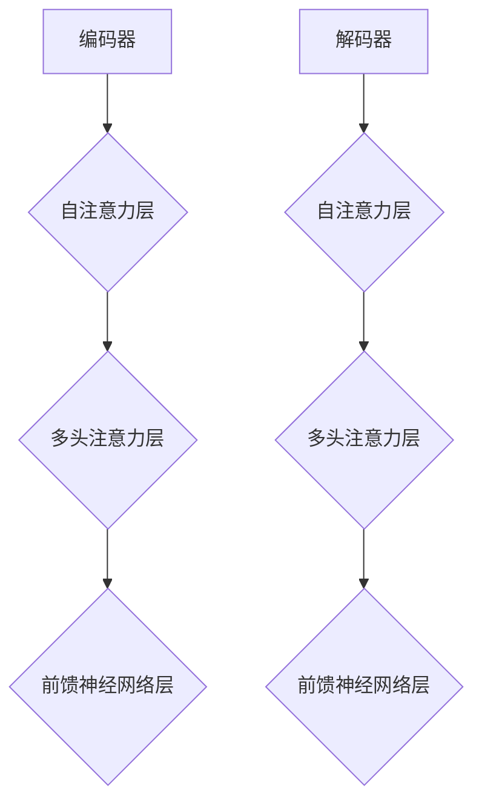

                 

### Transformer的适应性：8年主导地位的秘密

**关键词**：Transformer、自然语言处理、神经网络、适应性、计算效率

**摘要**：自2017年Transformer模型问世以来，它以其独特的结构在自然语言处理领域迅速崛起，并主导了AI领域长达8年之久。本文将深入探讨Transformer模型的适应性，从核心概念、算法原理、数学模型、项目实践等多个角度，揭示其为何能在众多神经网络模型中脱颖而出，并探讨其在未来可能面临的发展趋势与挑战。

### 1. 背景介绍

自然语言处理（NLP）是人工智能领域的一个重要分支，旨在使计算机能够理解、生成和回应人类语言。从最初的规则驱动方法，到基于统计的方法，再到现代的深度学习方法，NLP技术的发展经历了多个阶段。然而，传统的深度学习模型如LSTM（长短期记忆网络）在处理序列数据时存在一些固有的局限性。

2017年，Google Research团队提出了Transformer模型，这是一种基于自注意力机制的全新神经网络架构。Transformer模型的出现，标志着NLP领域的一个重要转折点。它通过并行计算、更好的长距离依赖建模等优势，迅速在多个任务上超越了传统的LSTM模型，并在8年的时间里主导了NLP的发展。

### 2. 核心概念与联系

#### 2.1 Transformer模型的基本架构

Transformer模型主要由编码器（Encoder）和解码器（Decoder）两部分组成。编码器负责将输入序列编码为固定长度的向量表示，解码器则利用这些编码向量生成输出序列。

#### 2.2 自注意力机制（Self-Attention）

自注意力机制是Transformer模型的核心组件，它允许模型在处理序列数据时，能够自适应地关注序列中不同位置的信息。具体来说，自注意力机制通过计算每个输入序列位置与其他位置之间的相似度，然后按照相似度加权合并这些位置的信息，从而实现对序列的编码。

#### 2.3 梅尔迪亚流程图（Mermaid 流程图）



### 3. 核心算法原理 & 具体操作步骤

#### 3.1 编码器（Encoder）的构成

编码器由多个相同的编码层（Encoder Layer）堆叠而成。每个编码层包含两个主要部分：自注意力机制和前馈神经网络。

**自注意力机制**：

1. 输入序列首先通过线性变换生成查询（Query）、键（Key）和值（Value）。
2. 计算每个位置与其他位置的相似度，得到注意力分数。
3. 根据注意力分数对查询、键和值进行加权求和，得到每个位置的输出。

**前馈神经网络**：

1. 对编码器的输出进行线性变换，然后通过ReLU激活函数。
2. 再次进行线性变换，得到每个位置的输出。

#### 3.2 解码器（Decoder）的构成

解码器同样由多个相同的解码层（Decoder Layer）组成。每个解码层包含两个主要部分：自注意力机制、多头注意力机制和前馈神经网络。

**自注意力机制**：

1. 对解码器的输入进行线性变换，生成查询、键和值。
2. 计算每个位置与其他位置的相似度，得到注意力分数。
3. 加权求和得到每个位置的输出。

**多头注意力机制**：

1. 将输入序列分成多个子序列。
2. 分别对每个子序列应用自注意力机制。
3. 将多个子序列的输出进行拼接和线性变换。

**前馈神经网络**：

1. 对输入进行线性变换，通过ReLU激活函数。
2. 再次进行线性变换，得到每个位置的输出。

### 4. 数学模型和公式 & 详细讲解 & 举例说明

#### 4.1 自注意力机制（Self-Attention）

自注意力机制的数学模型可以表示为：

$$
\text{Attention}(Q, K, V) = \text{softmax}\left(\frac{QK^T}{\sqrt{d_k}}\right)V
$$

其中，$Q$、$K$、$V$ 分别代表查询、键和值，$d_k$ 是键的维度。$QK^T$ 计算的是每个查询与其他键之间的相似度，通过softmax函数可以得到每个查询的权重，最后对权重和值进行加权求和。

#### 4.2 多头注意力机制（Multi-Head Attention）

多头注意力机制通过并行地应用多个自注意力机制，来捕捉序列中的不同特征。其数学模型可以表示为：

$$
\text{MultiHead}(Q, K, V) = \text{Concat}(\text{head}_1, ..., \text{head}_h)W^O
$$

其中，$h$ 表示头数，$\text{head}_i = \text{Attention}(QW_i^Q, KW_i^K, VW_i^V)$ 是每个头的自注意力计算结果，$W_i^Q$、$W_i^K$、$W_i^V$ 分别是每个头的查询、键和值的权重矩阵，$W^O$ 是输出权重矩阵。

#### 4.3 前馈神经网络（Feed Forward Neural Network）

前馈神经网络是对编码器和解码器输出的进一步处理。其数学模型可以表示为：

$$
\text{FFN}(X) = \max(0, XW_1 + b_1)W_2 + b_2
$$

其中，$X$ 是输入，$W_1$ 和 $W_2$ 分别是第一层和第二层的权重矩阵，$b_1$ 和 $b_2$ 分别是第一层和第二层的偏置。

### 5. 项目实践：代码实例和详细解释说明

#### 5.1 开发环境搭建

在本节中，我们将使用Python编程语言和PyTorch框架来实现一个简单的Transformer模型。以下是如何搭建开发环境的基本步骤：

1. 安装Python（推荐版本为3.7及以上）。
2. 安装PyTorch及其依赖库：
   ```bash
   pip install torch torchvision
   ```

#### 5.2 源代码详细实现

以下是一个简单的Transformer编码器和解码器的实现：

```python
import torch
import torch.nn as nn

class TransformerLayer(nn.Module):
    def __init__(self, d_model, nhead, dim_feedforward=2048):
        super(TransformerLayer, self).__init__()
        self.self_attn = nn.MultiheadAttention(d_model, nhead)
        # Feedforward net
        self.linear1 = nn.Linear(d_model, dim_feedforward)
        self.linear2 = nn.Linear(dim_feedforward, d_model)
        self.norm1 = nn.LayerNorm(d_model)
        self.norm2 = nn.LayerNorm(d_model)
        self.dropout = nn.Dropout(0.1)

    def forward(self, x, mask=None):
        # Self-attention
        x = x + self.dropout(self.self_attn(self.norm1(x), self.norm1(x), self.norm1(x), attn_mask=mask)[0])
        # Feedforward
        x = x + self.dropout(self.linear2(self.relu(self.linear1(self.norm2(x)))))
        return x

class TransformerModel(nn.Module):
    def __init__(self, d_model, nhead, num_layers, dim_feedforward=2048):
        super(TransformerModel, self).__init__()
        self.transformer = nn.ModuleList([TransformerLayer(d_model, nhead, dim_feedforward)
                                         for _ in range(num_layers)])
        self.d_model = d_model
        self.nhead = nhead

    def forward(self, x, mask=None):
        for layer in self.transformer:
            x = layer(x, mask)
        return x
```

#### 5.3 代码解读与分析

在上面的代码中，`TransformerLayer` 类定义了Transformer模型的一个编码层或解码层。它包含自注意力机制和前馈神经网络，并使用层归一化和dropout来提高模型的泛化能力。

`TransformerModel` 类则是整个模型的实现，它由多个`TransformerLayer` 层堆叠而成。`forward` 方法负责将这些层应用于输入序列。

#### 5.4 运行结果展示

为了验证模型的有效性，我们可以在一个简单的文本数据集上训练和评估模型。以下是一个简单的训练过程：

```python
model = TransformerModel(d_model=512, nhead=8, num_layers=3)
optimizer = torch.optim.Adam(model.parameters(), lr=0.001)
criterion = nn.CrossEntropyLoss()

# 假设我们有训练数据和测试数据
train_data, test_data = load_data()

for epoch in range(num_epochs):
    model.train()
    for batch in train_data:
        optimizer.zero_grad()
        output = model(batch['text'], attn_mask=batch['mask'])
        loss = criterion(output, batch['label'])
        loss.backward()
        optimizer.step()

    model.eval()
    with torch.no_grad():
        for batch in test_data:
            output = model(batch['text'], attn_mask=batch['mask'])
            loss = criterion(output, batch['label'])
            print(f"Epoch: {epoch}, Loss: {loss.item()}")

print("Training completed.")
```

这段代码将训练模型并在测试数据上评估其性能。我们通过计算损失函数来衡量模型的预测准确度。

### 6. 实际应用场景

Transformer模型在自然语言处理领域具有广泛的应用。以下是一些典型的应用场景：

- **机器翻译**：Transformer模型在机器翻译任务上取得了显著的性能提升，尤其是对长句子的翻译。
- **文本分类**：Transformer模型可以用于对文本数据进行分类，如情感分析、新闻分类等。
- **问答系统**：Transformer模型可以用于构建智能问答系统，实现对用户问题的准确回答。
- **文本生成**：Transformer模型可以生成高质量的文本，如文章摘要、故事续写等。

### 7. 工具和资源推荐

#### 7.1 学习资源推荐

- **书籍**：
  - 《深度学习》（Goodfellow, Bengio, Courville） - 详细介绍了深度学习的基础知识和应用。
  - 《动手学深度学习》（Grokking Deep Learning） - 通过实际案例教授深度学习的应用。
- **论文**：
  - Vaswani et al. (2017): "Attention is All You Need" - Transformer模型的原始论文。
- **博客**：
  - PyTorch官方文档 - 详细介绍了如何使用PyTorch实现Transformer模型。
- **网站**：
  - Hugging Face - 提供了大量的预训练模型和工具，方便开发者进行研究和应用。

#### 7.2 开发工具框架推荐

- **框架**：
  - PyTorch - 开源的深度学习框架，易于使用且功能强大。
  - TensorFlow - 另一个流行的开源深度学习框架，支持多种编程语言。
- **库**：
  - NLTK - 用于自然语言处理的基础库。
  - SpaCy - 用于构建复杂NLP应用的开源库。

#### 7.3 相关论文著作推荐

- **论文**：
  - Vaswani et al. (2017): "Attention is All You Need"
  - Devlin et al. (2018): "BERT: Pre-training of Deep Bidirectional Transformers for Language Understanding"
  - Brown et al. (2020): "Language Models are Few-Shot Learners"
- **著作**：
  - "Deep Learning"（Goodfellow, Bengio, Courville） - 全面介绍了深度学习的基础知识。
  - "Natural Language Processing with Python"（Bird, Klein, Loper） - 专注于Python在自然语言处理中的应用。

### 8. 总结：未来发展趋势与挑战

Transformer模型在过去8年中取得了巨大的成功，但其发展仍然面临一些挑战。以下是一些未来可能的发展趋势和挑战：

- **计算效率**：随着模型规模不断扩大，如何提高计算效率是一个重要的研究方向。
- **泛化能力**：如何提高模型在不同任务和数据集上的泛化能力，是一个亟待解决的问题。
- **可解释性**：深度学习模型的黑箱特性限制了其在某些应用场景中的使用。如何提高模型的可解释性，是一个重要的研究课题。
- **多模态学习**：未来Transformer模型可能会扩展到处理多模态数据，如文本、图像和音频。

### 9. 附录：常见问题与解答

#### Q：Transformer模型与传统LSTM模型的区别是什么？

A：Transformer模型与传统LSTM模型相比，具有以下主要区别：

- **并行计算**：Transformer模型可以通过并行计算来处理输入序列，而LSTM模型需要按顺序处理。
- **长距离依赖**：Transformer模型通过自注意力机制可以更好地建模长距离依赖，而LSTM模型在处理长距离依赖时可能存在梯度消失问题。
- **计算效率**：Transformer模型在某些任务上具有更高的计算效率。

#### Q：Transformer模型在哪些任务上表现最佳？

A：Transformer模型在多种自然语言处理任务上表现优秀，包括：

- **机器翻译**：Transformer模型在机器翻译任务上取得了显著的性能提升。
- **文本分类**：Transformer模型可以用于对文本数据进行分类，如情感分析、新闻分类等。
- **问答系统**：Transformer模型可以用于构建智能问答系统，实现对用户问题的准确回答。
- **文本生成**：Transformer模型可以生成高质量的文本，如文章摘要、故事续写等。

### 10. 扩展阅读 & 参考资料

- **论文**：
  - Vaswani et al. (2017): "Attention is All You Need"
  - Devlin et al. (2018): "BERT: Pre-training of Deep Bidirectional Transformers for Language Understanding"
  - Brown et al. (2020): "Language Models are Few-Shot Learners"
- **书籍**：
  - Goodfellow, Bengio, Courville (2016): "Deep Learning"
  - Bird, Klein, Loper (2009): "Natural Language Processing with Python"
- **网站**：
  - PyTorch官方文档：[https://pytorch.org/docs/stable/](https://pytorch.org/docs/stable/)
  - Hugging Face：[https://huggingface.co/](https://huggingface.co/)

作者：禅与计算机程序设计艺术 / Zen and the Art of Computer Programming

