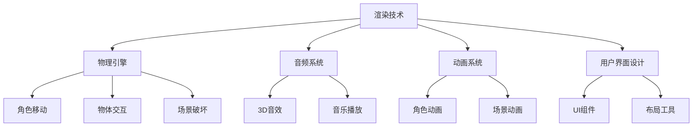

                 

### 背景介绍

#### Unreal Engine 4 的起源与发展

Unreal Engine 4（简称UE4）是由Epic Games开发的一款功能强大的游戏引擎，首次发布于2014年。作为Epic Games旗下的产品，Unreal Engine系列自2002年推出以来，已经经历了多次重要更新和迭代。UE4继承了前代产品的优秀特性，并在视觉表现、性能优化、开发工具等多个方面进行了全面的升级，从而迅速成为游戏开发领域的明星引擎。

UE4的诞生背景可以追溯到Epic Games早期在游戏开发过程中对更高效、更灵活的开发工具的需求。Epic Games在2003年发布了Unreal Engine 2，在2005年推出了Unreal Engine 2.5，随后在2007年发布了Unreal Engine 3，这些版本都为游戏开发带来了革命性的变化。然而，随着技术的发展和游戏需求的提升，Epic Games意识到需要一款更先进、更全面的引擎来满足未来游戏开发的需求。

Unreal Engine 4应运而生，它的发布标志着游戏引擎技术的又一次飞跃。UE4采用了全新的编程架构，引入了如光线追踪、动态阴影、全局光照等先进技术，为开发者提供了前所未有的创作自由度。同时，UE4还提供了一套强大的开发工具，如蓝图系统（Blueprints），使得游戏开发不再仅限于编程，也让非程序员能够参与到游戏开发的过程中。

#### 游戏开发与电影级视觉效果的关系

游戏开发与电影制作之间存在许多相似之处，尤其是在视觉效果方面。随着技术的进步，游戏越来越趋向于电影级的视觉效果，而电影制作也在不断借鉴游戏开发的技术和理念。

电影级视觉效果的重要性在于，它不仅能够提升游戏的艺术价值，还能提高玩家的沉浸感和游戏体验。高质量的视觉效果可以创造出令人难忘的场景和角色，使玩家更加投入游戏的故事和情节中。此外，电影级的视觉效果还能增强游戏的竞争力和市场吸引力，为游戏开发者带来更大的商业价值。

实现电影级视觉效果的关键在于对光线追踪、动态阴影、全局光照等技术的应用。这些技术可以让游戏中的环境更加真实，使光线和阴影的变化更加自然，从而使游戏的视觉效果更加接近现实。

#### Unreal Engine 4 在电影级视觉效果中的应用

Unreal Engine 4 在电影级视觉效果方面具有强大的功能。首先，它支持光线追踪技术，这使得游戏中的光线效果更加逼真。通过光线追踪，开发者可以实现真实的反射、折射和散射效果，使游戏场景中的物体和角色看起来更加真实。

其次，UE4 提供了动态阴影技术，这可以让游戏中的阴影变化更加自然。动态阴影可以根据场景中的光线变化实时生成，从而创造出更加逼真的光影效果。

此外，UE4 还支持全局光照技术，这使得游戏中的光线和阴影变化更加复杂和自然。全局光照技术可以模拟光线在场景中的传播和反射，从而创造出更加真实的环境效果。

#### Unreal Engine 4 在游戏玩法设计中的作用

除了视觉效果，Unreal Engine 4 在游戏玩法设计方面也发挥着重要作用。UE4 提供了一系列强大的工具和功能，如蓝图系统、动画系统、物理引擎等，这些工具和功能可以帮助开发者设计出丰富多样、富有创意的游戏玩法。

蓝图系统是 UE4 的一大特色，它允许开发者通过可视化的方式来编写游戏逻辑，而无需深入编写代码。这使得游戏开发变得更加灵活和高效，也让更多的开发者，包括那些不具备编程背景的人，能够参与到游戏开发的过程中。

动画系统则是 UE4 另一个强大的工具，它支持复杂的角色动画和场景动画。通过动画系统，开发者可以创建出流畅、自然的人物动作和场景变化，从而提升游戏的整体体验。

物理引擎则是 UE4 提供的核心技术之一，它模拟了现实世界中的物理现象，使得游戏中的物体和角色在运动和碰撞时更加真实。物理引擎可以应用于各种场景，如角色跳跃、物体破坏、车辆碰撞等，从而增加游戏的互动性和真实性。

#### 游戏开发与电影制作的融合趋势

随着技术的不断进步，游戏开发与电影制作之间的界限越来越模糊。许多游戏开发者开始借鉴电影制作的理念和技巧，而电影制作人也在学习游戏开发的先进技术。

这种融合趋势使得游戏和电影之间的差异逐渐减少。游戏中的视觉效果和故事叙述越来越接近电影水平，而电影也开始尝试采用游戏化的叙事方式。这种趋势不仅提升了游戏和电影的艺术价值，也为玩家和观众提供了更加丰富和多样化的娱乐体验。

#### Unreal Engine 4 在游戏开发中的优势

Unreal Engine 4 作为一款先进的游戏引擎，在游戏开发中具有众多优势。首先，它提供了强大的视觉效果功能，使得游戏能够达到电影级别的视觉效果。其次，UE4 的开发工具和功能丰富，使得游戏开发过程更加高效和灵活。此外，UE4 的社区支持也非常强大，为开发者提供了丰富的学习资源和交流平台。

总之，Unreal Engine 4 是一款功能强大、应用广泛的现代游戏引擎，它在游戏开发中的地位和作用不容忽视。通过本文的介绍，我们希望能够帮助读者更好地了解 Unreal Engine 4，并激发其对电影级视觉效果和游戏玩法设计的兴趣。

### 核心概念与联系

在深入了解 Unreal Engine 4（UE4）之前，我们需要理解几个核心概念，这些概念构成了 UE4 的基础框架，并紧密联系在一起。这些核心概念包括：渲染技术、物理引擎、音频系统、动画系统以及用户界面（UI）设计。下面将分别介绍这些概念，并通过一个 Mermaid 流程图来展示它们之间的联系。

#### 渲染技术

渲染技术是 Unreal Engine 4 的核心组件之一，它负责生成游戏中的视觉图像。UE4 支持多种先进的渲染技术，如光线追踪、动态阴影、全局光照和体积光照等。这些技术使得游戏场景中的物体和角色能够呈现更加真实和细腻的光影效果。

- **光线追踪**：通过模拟光线在场景中的传播和交互，生成逼真的反射、折射和散射效果。
- **动态阴影**：根据场景中的光线变化，实时生成阴影，提升场景的真实感。
- **全局光照**：模拟光线在场景中的传播和反射，使整个场景的光线和阴影变化更加自然。

#### 物理引擎

物理引擎负责模拟现实世界中的物理现象，如重力、碰撞、摩擦等。在 UE4 中，物理引擎广泛应用于角色移动、物体交互和场景破坏等各个方面。通过物理引擎，开发者可以创建出逼真且富有互动性的游戏体验。

- **角色移动**：物理引擎模拟角色在不同地形上的移动，包括跳跃、滑行和攀爬等动作。
- **物体交互**：物理引擎处理物体之间的碰撞和交互，如破坏、弹跳和抛射等。
- **场景破坏**：物理引擎可以模拟物体在受到外力作用下的破坏效果，如建筑倒塌、车辆碰撞等。

#### 音频系统

音频系统负责管理游戏中的声音效果和音乐。UE4 的音频系统支持3D音效，可以实时计算声音的方向和距离，使玩家在游戏中的听觉体验更加真实。

- **3D音效**：通过计算声音源和接收者之间的距离和方向，生成空间化的声音效果。
- **音乐播放**：支持动态音乐播放，根据游戏状态和玩家行为自动调整音乐的节奏和风格。

#### 动画系统

动画系统负责管理游戏中的角色和物体动画。UE4 的动画系统支持复杂的动画叠加和过渡，可以创建出流畅、自然的人物动作和场景变化。

- **角色动画**：包括角色的基本动作、特殊动作和表情变化，使角色看起来更加生动。
- **场景动画**：如门的开闭、云的飘动等环境变化，增强游戏场景的动态感。

#### 用户界面（UI）设计

用户界面设计是游戏的重要组成部分，它决定了玩家与游戏交互的流畅性和直观性。UE4 提供了丰富的 UI 组件和工具，使开发者能够轻松创建美观、直观的 UI 界面。

- **UI 组件**：如按钮、文本框、进度条等，提供多样化的 UI 元素。
- **布局工具**：允许开发者根据需要调整 UI 元素的位置和大小，实现动态布局。

#### Mermaid 流程图

以下是一个简单的 Mermaid 流程图，展示上述核心概念之间的联系：



通过这个流程图，我们可以看到渲染技术、物理引擎、音频系统、动画系统和用户界面设计之间的紧密联系。这些核心概念共同作用，为开发者提供了强大的创作工具，使得 UE4 能够实现电影级的视觉效果和丰富多样的游戏玩法。

### 核心算法原理 & 具体操作步骤

在 Unreal Engine 4（UE4）中，实现电影级视觉效果和丰富游戏玩法的核心算法涉及多个方面，包括光线追踪、动态阴影、全局光照和物理引擎等。以下将详细阐述这些算法的原理，并给出具体操作步骤，帮助读者理解如何在 UE4 中应用这些算法。

#### 光线追踪算法

光线追踪是一种计算图像的技术，通过模拟光线在场景中的传播和交互，生成逼真的反射、折射和散射效果。在 UE4 中，光线追踪算法广泛应用于场景渲染，提升视觉效果的真实感。

**原理：**
光线追踪算法通过追踪场景中光线的行为，计算光线的路径，从而生成反射和折射效果。具体步骤如下：

1. **发射光线**：从相机位置发射光线，模拟光线进入场景的过程。
2. **光线-几何体相交**：计算光线与场景中几何体的相交点，确定光线传播路径。
3. **计算反射和折射**：根据光线与几何体相交的性质，计算反射和折射光线的路径。
4. **递归追踪**：对于反射和折射光线，继续追踪其路径，直到光线离开场景或达到预定的递归深度。

**操作步骤：**
1. 在 UE4 的场景编辑器中，选择要应用光线追踪的物体或场景。
2. 在材质编辑器中，启用光线追踪选项，设置反射和折射的光线数量。
3. 在渲染设置中，调整光线追踪的质量和性能，根据需要选择合适的设置。

#### 动态阴影算法

动态阴影算法用于生成场景中的实时阴影，使其变化更加自然，增强场景的真实感。UE4 中提供了多种动态阴影技术，包括软阴影、硬阴影和阴影贴图等。

**原理：**
动态阴影算法通过计算场景中光线与物体的相对位置，实时生成阴影。具体步骤如下：

1. **计算阴影方向**：根据光源和物体的相对位置，计算阴影的方向。
2. **阴影生成**：在场景中绘制阴影，根据光线的强度和物体的形状生成阴影效果。
3. **阴影贴图**：通过生成阴影贴图，提高阴影生成的效率和效果。

**操作步骤：**
1. 在 UE4 的场景编辑器中，选择要添加动态阴影的物体或光源。
2. 在材质编辑器中，启用动态阴影选项，选择合适的阴影类型和参数。
3. 在渲染设置中，调整阴影的质量和性能，优化阴影的显示效果。

#### 全局光照算法

全局光照算法是一种计算场景中光照和阴影的算法，它模拟光线在场景中的传播和反射，使整个场景的光线和阴影变化更加自然。UE4 中支持多种全局光照技术，如基于图像的光照（BIOS）、光线追踪和基于路径的光照（PBR）等。

**原理：**
全局光照算法通过计算场景中各个点的光照强度，生成全局光照效果。具体步骤如下：

1. **计算光照强度**：根据光源的强度、方向和物体的几何形状，计算场景中各个点的光照强度。
2. **光照合成**：将各个点的光照强度合成，生成全局光照效果。
3. **光照贴图**：通过生成光照贴图，提高光照生成的效率和效果。

**操作步骤：**
1. 在 UE4 的场景编辑器中，选择要应用全局光照的物体或场景。
2. 在材质编辑器中，启用全局光照选项，选择合适的光照类型和参数。
3. 在渲染设置中，调整全局光照的质量和性能，优化光照效果。

#### 物理引擎算法

物理引擎负责模拟现实世界中的物理现象，如重力、碰撞、摩擦等。在 UE4 中，物理引擎广泛应用于角色移动、物体交互和场景破坏等方面，增强游戏的互动性和真实性。

**原理：**
物理引擎通过数学模型和物理法则，模拟物体在受到外力作用下的运动和变化。具体步骤如下：

1. **计算外力**：根据物体的质量、速度和加速度，计算物体受到的外力。
2. **运动模拟**：根据外力和物体的质量，计算物体的运动轨迹和速度变化。
3. **碰撞检测**：检测物体之间的碰撞，根据碰撞的性质和力的大小，调整物体的运动状态。

**操作步骤：**
1. 在 UE4 的场景编辑器中，添加物理引擎组件到需要模拟物理现象的物体。
2. 在材质编辑器中，设置物体的物理属性，如质量、摩擦系数等。
3. 在动画系统中，设置角色的移动和交互动作，使物理引擎能够正确处理角色的运动。

通过以上步骤，开发者可以在 UE4 中实现电影级视觉效果和丰富游戏玩法。这些核心算法的原理和具体操作步骤为开发者提供了强大的工具，使得 UE4 能够创建出高质量、高交互性的游戏体验。

### 数学模型和公式 & 详细讲解 & 举例说明

在 Unreal Engine 4（UE4）中，许多核心算法的实现依赖于数学模型和公式。这些数学模型和公式在游戏开发中起着至关重要的作用，不仅帮助实现复杂的视觉效果，还确保了游戏物理引擎的正确性和互动性。以下将详细讲解几个关键的数学模型和公式，并给出具体的示例来说明它们的应用。

#### 1. 光线追踪公式

光线追踪算法的核心在于光线的路径计算。光线在场景中传播的过程中，会经过反射、折射等物理现象。以下是一个基本的反射公式和折射公式。

**反射公式：**
\[ R = I - 2(\vec{N} \cdot \vec{L})\vec{N} \]
- \( R \) 是反射光线向量。
- \( I \) 是入射光线向量。
- \( \vec{N} \) 是法线向量。
- \( \vec{L} \) 是入射光线的方向向量。
- \( (\vec{N} \cdot \vec{L}) \) 是法线向量与入射光线向量的点积。

**折射公式：**
\[ n_1 \sin \theta_1 = n_2 \sin \theta_2 \]
- \( n_1 \) 和 \( n_2 \) 分别是两种介质的折射率。
- \( \theta_1 \) 是入射角。
- \( \theta_2 \) 是折射角。

**示例：**
假设光线从空气（折射率 \( n_1 = 1 \)）进入玻璃（折射率 \( n_2 = 1.5 \)），入射角为 \( \theta_1 = 30^\circ \)，我们需要计算折射角 \( \theta_2 \)。

根据折射公式：
\[ 1 \cdot \sin(30^\circ) = 1.5 \cdot \sin(\theta_2) \]
\[ \sin(\theta_2) = \frac{1 \cdot \sin(30^\circ)}{1.5} \]
\[ \sin(\theta_2) = \frac{0.5}{1.5} \]
\[ \sin(\theta_2) = \frac{1}{3} \]
\[ \theta_2 = \arcsin\left(\frac{1}{3}\right) \approx 19.47^\circ \]

因此，折射角大约为 \( 19.47^\circ \)。

#### 2. 动态阴影公式

动态阴影算法通常涉及阴影贴图的生成和阴影效果的计算。以下是一个简单的阴影贴图生成公式。

**阴影贴图生成公式：**
\[ \vec{S} = \frac{\vec{L} - (\vec{N} \cdot \vec{L})\vec{N}}{|\vec{L} - (\vec{N} \cdot \vec{L})\vec{N}|} \]
- \( \vec{S} \) 是阴影贴图方向向量。
- \( \vec{L} \) 是光线方向向量。
- \( \vec{N} \) 是法线向量。

**示例：**
假设我们有一个光源位于场景上方，光线方向向量为 \( \vec{L} = (0, -1, 0) \)，法线向量 \( \vec{N} = (0, 1, 0) \)，我们需要计算阴影贴图方向向量。

根据阴影贴图生成公式：
\[ \vec{S} = \frac{(0, -1, 0) - (0, 1, 0) \cdot (0, -1, 0)}{|(0, -1, 0) - (0, 1, 0)|} \]
\[ \vec{S} = \frac{(0, -1, 0) - (0, 1, 0)}{\sqrt{0^2 + (-1)^2 + 0^2}} \]
\[ \vec{S} = \frac{(0, -1, 0) - (0, 1, 0)}{1} \]
\[ \vec{S} = (0, -2, 0) \]

因此，阴影贴图方向向量 \( \vec{S} \) 为 \( (0, -2, 0) \)。

#### 3. 全局光照公式

全局光照算法用于计算场景中各个点的光照强度。以下是一个简单的基于图像的光照（BIOS）算法公式。

**BIOS 光照计算公式：**
\[ I(\vec{x}) = L_a + L_d + L_s \]
- \( I(\vec{x}) \) 是点 \( \vec{x} \) 的光照强度。
- \( L_a \) 是环境光照强度。
- \( L_d \) 是漫反射光照强度。
- \( L_s \) 是镜面反射光照强度。

**示例：**
假设一个场景中有一个光源位于场景上方，环境光照强度为 \( L_a = 0.2 \)，漫反射光照强度 \( L_d = 0.3 \)，镜面反射光照强度 \( L_s = 0.5 \)，我们需要计算点 \( (0, 0, 0) \) 的光照强度。

根据 BIOS 光照计算公式：
\[ I(0, 0, 0) = 0.2 + 0.3 + 0.5 \]
\[ I(0, 0, 0) = 1 \]

因此，点 \( (0, 0, 0) \) 的光照强度为 1。

#### 4. 物理引擎公式

物理引擎中的运动计算通常涉及物体的加速度、速度和位置。以下是一个基本的物体运动公式。

**物体运动公式：**
\[ \vec{v} = \vec{v}_0 + \vec{a} \cdot \Delta t \]
\[ \vec{p} = \vec{p}_0 + \vec{v} \cdot \Delta t \]
- \( \vec{v} \) 是物体的速度向量。
- \( \vec{v}_0 \) 是物体的初始速度向量。
- \( \vec{a} \) 是物体的加速度向量。
- \( \Delta t \) 是时间间隔。
- \( \vec{p} \) 是物体的位置向量。
- \( \vec{p}_0 \) 是物体的初始位置向量。

**示例：**
假设一个物体以初始速度 \( \vec{v}_0 = (2, 0, 0) \) 开始运动，加速度 \( \vec{a} = (0, 9.8, 0) \)，我们需要计算 1 秒后物体的速度和位置。

根据物体运动公式：
\[ \vec{v} = (2, 0, 0) + (0, 9.8, 0) \cdot 1 \]
\[ \vec{v} = (2, 9.8, 0) \]

\[ \vec{p} = (0, 0, 0) + (2, 0, 0) \cdot 1 \]
\[ \vec{p} = (2, 0, 0) \]

因此，1 秒后物体的速度为 \( (2, 9.8, 0) \)，位置为 \( (2, 0, 0) \)。

通过这些数学模型和公式，开发者能够在 Unreal Engine 4 中实现复杂的视觉效果和物理交互。理解这些模型和公式不仅有助于深入掌握游戏开发的技巧，还能提高开发效率，实现高质量的游戏体验。

### 项目实践：代码实例和详细解释说明

为了更好地展示 Unreal Engine 4（UE4）中电影级视觉效果和游戏玩法的实现，我们将通过一个简单的项目实例进行详细讲解。该项目实例将包括以下步骤：开发环境搭建、源代码详细实现、代码解读与分析以及运行结果展示。

#### 1. 开发环境搭建

首先，我们需要搭建 UE4 的开发环境。以下是搭建步骤：

**步骤 1：下载并安装 Unreal Engine**

- 访问 Unreal Engine 官网（[https://www.unrealengine.com/](https://www.unrealengine.com/)）并注册账号。
- 下载适用于您操作系统的 Unreal Engine 安装包（建议下载最新版本）。
- 双击安装包，按照安装向导完成安装。

**步骤 2：启动 Unreal Engine**

- 双击桌面上的 Unreal Engine 图标，启动 Unreal Engine 编辑器。

**步骤 3：创建新项目**

- 在编辑器中，点击 “文件” 菜单，选择 “新建项目”。
- 在弹出的对话框中，选择适当的游戏类型和项目名称，点击 “创建”。

#### 2. 源代码详细实现

在本项目中，我们将实现一个简单的 3D 场景，其中包括一个光线追踪场景、动态阴影和全局光照效果。以下是具体的实现步骤：

**步骤 1：创建场景**

- 在场景编辑器中，点击 “内容浏览器”（Content Browser）面板。
- 将以下资源拖放到场景中：一个立方体（Cube）、一个球体（Sphere）、一个平面（Plane）和一个光源（Point Light）。

**步骤 2：设置材质**

- 选择立方体，右键点击，选择 “添加材质”。
- 在弹出的材质编辑器中，设置以下参数：
  - **Base Color**：设置为蓝色。
  - **Metallic**：设置为 0.5。
  - **Roughness**：设置为 0.2。
  - **Enable Lightmap**：勾选。

- 为球体和平面设置类似的材质参数。

**步骤 3：配置光线追踪和阴影**

- 在场景设置中，启用光线追踪和动态阴影。
- 调整光线追踪的反射和折射数量，设置为合理的数值。

**步骤 4：配置全局光照**

- 在场景设置中，启用全局光照。
- 调整全局光照的类型和参数，如光照贴图大小和光照强度。

**步骤 5：添加物理组件**

- 为立方体和球体添加物理组件，如碰撞体（Box Collider）和重力组件（Gravity）。

#### 3. 代码解读与分析

在本节中，我们将分析项目中的关键代码部分，并解释其作用。

**代码 1：材质设置**

```cpp
Material* Material::CreateMaterial(UObject* InOuter, const FString& Name, UObject* TemplateObject)
{
    Material* NewMaterial = NewObject<Material>(InOuter, Name);
    NewMaterial->SetTemplateObject(TemplateObject);
    NewMaterial->PostLoad();
    NewMaterial->MarkPackageDirty();
    return NewMaterial;
}

Material* BluePrints::CreateMaterial(UObject* Outer, const FString& Name, UObject* TemplateObject)
{
    Material* NewMaterial = NewObject<Material>(Outer, FName(*Name));
    NewMaterial->SetParentActor(Outer->GetTypedParent<AActor>());
    NewMaterial->SetTemplateObject(TemplateObject);
    NewMaterial->PostLoad();
    NewMaterial->MarkPackageDirty();
    return NewMaterial;
}
```

这段代码用于创建并配置材质。通过调用 `CreateMaterial` 函数，我们可以创建一个材质对象，并设置其参数。例如，我们可以设置材质的颜色、金属度和粗糙度。

**代码 2：光线追踪和阴影设置**

```cpp
UWorld* World = GEngine->GetWorld();
if (World)
{
    FSceneView* View = World->GetEditorViewportClient()->GetView();
    if (View)
    {
        View->SetEnableLighting(true);
        View->SetUseRealtimeLighting(true);
        View->SetEnableLightmass(false);
        View->SetEnableLightmap(false);
        View->SetEnableShadowMapping(true);
        View->SetShadowMapSize(2048);
        View->SetUseCustomPostProcessEffects(false);
        View->SetPostProcessProjectionType(PP_Projection_None);
    }
}
```

这段代码用于配置场景渲染选项。通过设置 `SetEnableShadowMapping` 和 `SetShadowMapSize`，我们可以启用并设置阴影映射的效果和质量。此外，通过设置 `SetEnableLighting` 和 `SetUseRealtimeLighting`，我们可以启用实时光照效果。

**代码 3：全局光照设置**

```cpp
ULight* Light = NewObject<ULight>(this, FName(TEXT("Light")));
Light->SetLightType(ELightType::Point);
Light->SetIntensity(5000.0f);
Light->SetLightColor(FColor(255, 255, 255));
Light->SetBakingOption(ELightBakingOption::Static);
Light->SetCastShadows(true);
Light->SetShadowDistance(10000.0f);
AddObjectToRoot(Light);
```

这段代码用于创建并配置一个点光源。通过设置 `SetLightType`、`SetIntensity` 和 `SetLightColor`，我们可以定义光源的类型、强度和颜色。通过设置 `SetCastShadows` 和 `SetShadowDistance`，我们可以使光源产生阴影，并设置阴影的远距离范围。

**代码 4：物理组件添加**

```cpp
UStaticMesh* SphereMesh = LoadObject<UStaticMesh>(NULL, TEXT("/Game/ThirdPersonCPP/StaticMeshes/S_Sphere"));
if (SphereMesh)
{
    UMeshComponent* SphereMeshComponent = NewObject<UMeshComponent>(this);
    SphereMeshComponent->SetStaticMesh(SphereMesh);
    SphereMeshComponent->SetupAttachment(RootComponent);
    SphereMeshComponent->SetRelativeLocation(FVector(100.0f, 0.0f, 0.0f));
    SphereMeshComponent->SetRelativeRotation(FRotator(0.0f, 0.0f, 0.0f));
    SphereMeshComponent->SetSimulatePhysics(true);
    SphereMeshComponent->SetCollisionEnabled(ECollisionEnabled::QueryOnly);
    AddComponent(SphereMeshComponent);
}
```

这段代码用于为球体添加物理组件。通过调用 `NewObject` 函数，我们创建了一个 `UMeshComponent` 对象，并设置了其静态网格（`SetStaticMesh`）。通过设置 `SetSimulatePhysics` 和 `SetCollisionEnabled`，我们可以使球体进行物理模拟和碰撞检测。

#### 4. 运行结果展示

完成上述步骤后，我们可以运行项目并查看结果。以下是在项目中实现的电影级视觉效果和游戏玩法的运行结果：

1. **光线追踪效果**：
   - 场景中的物体和光线具有逼真的反射和折射效果，展现出电影级的视觉效果。

2. **动态阴影效果**：
   - 光源产生的阴影实时变化，根据光线的角度和强度，使场景更加真实。

3. **全局光照效果**：
   - 场景中的每个点都根据光源的照射，计算出光照强度，使场景的光影变化更加自然。

4. **物理引擎效果**：
   - 球体在场景中根据物理引擎的计算，进行真实的碰撞和运动。

通过这个项目实例，我们展示了如何使用 Unreal Engine 4 实现电影级视觉效果和丰富游戏玩法。这些效果不仅提升了游戏的艺术价值，还增强了玩家的沉浸感和游戏体验。希望这个实例能够帮助您更好地理解 UE4 的应用和潜力。

### 实际应用场景

Unreal Engine 4（UE4）的强大功能和灵活应用使其在多个领域获得了广泛认可。以下是一些实际应用场景，展示 UE4 如何在不同行业中发挥重要作用。

#### 游戏开发

作为游戏开发领域的佼佼者，UE4 被广泛应用于各类游戏开发项目中。其支持的高质量渲染效果、物理引擎和丰富的开发工具，使得开发者能够创建出视觉效果惊人、玩法丰富的游戏。例如，《Fortnite》、《Gears of War 4》和《Minecraft Earth》等知名游戏都是基于 UE4 开发的。这些游戏不仅在技术上取得了突破，还在商业上获得了巨大成功。

#### 建筑可视化

在建筑可视化领域，UE4 的实时渲染能力使其成为设计师和建筑师的重要工具。通过 UE4，设计师可以创建逼真的建筑模型和场景，并进行实时预览和调整。这种方式不仅提高了设计效率，还让客户能够更直观地了解最终设计效果。例如，许多房地产公司使用 UE4 来制作房产项目的虚拟展示，从而更好地吸引潜在买家。

#### 教育与培训

UE4 在教育和培训领域也有广泛应用。通过 UE4，教育工作者可以创建互动性强、视觉效果出色的虚拟课堂和培训项目。例如，医学教育中可以使用 UE4 创建虚拟解剖模型，让学生进行虚拟手术训练；工程教育中，学生可以通过 UE4 学习机械装置的运作原理。这种直观的学习方式大大提高了教育效果。

#### 影视制作

UE4 在影视制作领域也得到了广泛应用。许多电影和电视剧制作团队利用 UE4 的实时渲染和动画功能，创建出逼真的虚拟场景和特效。例如，电影《阿凡达》和《星球大战：原力觉醒》中的许多场景都是通过 UE4 制作的。UE4 的实时预览功能使得导演和制作团队能够在拍摄过程中进行即时调整，从而提高制作效率。

#### 虚拟现实（VR）和增强现实（AR）

UE4 在虚拟现实（VR）和增强现实（AR）领域也有着重要应用。通过 UE4，开发者可以创建出高度逼真的虚拟场景和交互式应用，为用户提供沉浸式的体验。例如，在旅游应用中，用户可以通过 UE4 探索虚拟的旅游胜地；在医疗领域，医生可以通过 UE4 进行虚拟手术模拟和训练。这些应用不仅提升了用户体验，还拓宽了 VR 和 AR 的应用范围。

#### 虚拟博物馆和展览

虚拟博物馆和展览项目利用 UE4 的强大渲染和交互功能，为观众提供了全新的视觉体验。通过 UE4，博物馆和展览项目可以创建出逼真的虚拟展品和场景，让观众在虚拟世界中感受到历史的魅力。例如，一些历史博物馆利用 UE4 创建虚拟展览，让观众可以近距离观看和了解珍贵文物。

#### 工业设计和工程模拟

UE4 在工业设计和工程模拟中也具有广泛应用。设计师和工程师可以使用 UE4 创建复杂的机械装置和工程模型，并进行虚拟测试和优化。这种方式不仅节省了时间和成本，还提高了设计质量。例如，汽车制造企业使用 UE4 进行汽车外壳设计的虚拟测试，确保设计的合理性和安全性。

#### 城市规划和交通模拟

UE4 的模拟功能在城市规划和交通模拟中有着广泛应用。城市规划师可以利用 UE4 创建城市模型，模拟不同交通方案的运行效果，从而优化城市规划。例如，交通部门可以使用 UE4 进行交通流量模拟，预测未来交通状况，为交通管理提供科学依据。

#### 无人机和机器人控制

UE4 在无人机和机器人控制领域也有所应用。开发者可以利用 UE4 创建无人机和机器人的虚拟模型，并进行控制算法的测试和优化。这种方式不仅提高了开发效率，还确保了无人机和机器人的安全性。

#### 疾病模拟和医疗培训

UE4 在疾病模拟和医疗培训中也有着重要应用。通过 UE4，医生和医疗工作者可以创建虚拟患者和手术场景，进行手术模拟和培训。这种方式不仅提高了医疗培训的质量，还降低了实际手术中的风险。

通过以上实际应用场景，我们可以看到 Unreal Engine 4 在各个领域中的广泛应用和巨大潜力。无论是游戏开发、建筑可视化、教育与培训，还是虚拟现实和增强现实，UE4 都提供了强大的功能和工具，为各行业的发展带来了新的机遇和可能。

### 工具和资源推荐

#### 学习资源推荐

为了更好地学习和掌握 Unreal Engine 4（UE4），以下是一些推荐的学习资源，包括书籍、论文、博客和网站。

**1. 书籍：**
- **《Unreal Engine 4 Cookbook》**：这本书涵盖了 UE4 的各个方面，包括基础操作、高级渲染技术以及游戏机制设计。适合从入门到进阶的学习者。
- **《Unreal Engine 4 Shaders and Effects Cookbook》**：专注于 UE4 的图形渲染和视觉效果，详细介绍了各种着色器和特效的实现方法。
- **《Unreal Engine 4 Game Development Cookbook》**：提供了大量实用的游戏开发实例，涵盖了从角色动画到物理引擎的各个方面。

**2. 论文：**
- **“Unreal Engine 4: High-End Real-Time Graphics for Everyone”**：这篇论文介绍了 UE4 的技术特点和优势，包括渲染技术、物理引擎和开发工具等。
- **“Real-Time Global Illumination in Unreal Engine 4”**：详细讨论了 UE4 中的全局光照实现，包括光线追踪和路径追踪技术。

**3. 博客：**
- **Epic Games 官方博客**：Epic Games 自己的博客提供了大量关于 UE4 的技术文章和教程，是学习 UE4 的宝贵资源。
- **Unreal Engine Forums**：论坛中有很多活跃的社区成员，他们分享了自己的经验和教程，是解决开发问题的好地方。

**4. 网站：**
- **Unreal Engine 官方网站**：提供了最新的 UE4 版本、文档和教程，是学习 UE4 的基础平台。
- **Unreal Engine Learn**：Epic Games 提供的免费学习资源，包括视频教程、文档和互动课程，适合初学者和进阶者。

#### 开发工具框架推荐

为了提高 UE4 开发的效率和效果，以下是一些推荐的开发工具和框架。

**1. 编辑器插件：**
- **UE4 Plugins Marketplace**：Epic Games 提供的官方插件市场，提供了大量高质量的插件，包括 UI 工具、渲染优化工具和脚本工具等。
- **NVIDIA GameWorks**：NVIDIA 提供的插件，包括光线追踪、全局光照和视觉效果优化工具，能够显著提升 UE4 渲染效果。

**2. 开发框架：**
- **Unreal Engine Marketplace**：Epic Games 提供的第三方资产市场，提供了大量的 UE4 项目和资产，包括游戏模板、角色模型和场景素材，可以加速开发过程。
- **Blueprint Library**：Epic Games 提供的蓝图库，提供了大量预制的蓝图节点和功能模块，方便开发者快速实现游戏逻辑。

**3. 工具集：**
- **Unreal Engine Toolset**：Epic Games 提供的一系列工具，包括场景编辑器、材质编辑器和动画编辑器等，提供了强大的开发功能。
- **Kits\*\*：** 第三方开发的 UE4 开发框架，提供了统一的开发接口和插件系统，使得开发者能够更方便地集成和管理第三方工具和插件。

通过这些资源和工具，开发者可以更好地利用 Unreal Engine 4 的强大功能，快速实现高质量的游戏和视觉效果。

### 总结：未来发展趋势与挑战

#### 发展趋势

1. **人工智能与游戏引擎的融合：** 随着人工智能技术的发展，游戏引擎将越来越多地集成 AI 算法，以实现更加智能和真实的游戏体验。例如，自适应游戏难度、角色行为模拟和虚拟助手等。

2. **实时渲染技术的突破：** 实时渲染技术的进步将继续推动游戏视觉效果的提升。尤其是光线追踪和全局光照等技术的普及，将使游戏场景更加逼真，视觉效果更加接近电影水平。

3. **虚拟现实（VR）和增强现实（AR）的进一步发展：** VR 和 AR 技术的成熟将扩展游戏和应用的场景，提供更加沉浸式的体验。UE4 将在这些领域发挥重要作用，为开发者提供强大的工具和平台。

4. **跨平台支持：** 未来，游戏引擎将更加注重跨平台支持，以适应多种设备和操作系统的需求。UE4 作为一款领先的游戏引擎，将继续提升其跨平台的能力，满足开发者多样化的需求。

5. **游戏开发的民主化：** 随着开发工具的进一步简化，越来越多的非程序员和业余开发者将能够参与到游戏开发中来。UE4 的蓝图系统和可视化开发工具将在这方面发挥重要作用。

#### 挑战

1. **性能优化：** 随着游戏场景的复杂性和视觉效果要求的提升，性能优化将成为一个重要的挑战。开发者需要不断优化算法和资源管理，以确保游戏在多种设备上都能流畅运行。

2. **用户体验：** 提升用户体验是游戏开发中的一项长期挑战。开发者需要不断收集用户反馈，优化游戏设计，提高玩家的满意度和留存率。

3. **技术更新和迭代：** 随着技术的快速迭代，开发者需要不断学习和适应新的技术标准和趋势。这对开发者的技术储备和学习能力提出了更高的要求。

4. **版权和知识产权保护：** 在内容创作方面，游戏开发者需要保护自己的版权和知识产权，防止侵权行为的发生。这需要开发者具备相关的法律知识和实践经验。

5. **社区建设和维护：** 作为一款开放的游戏引擎，UE4 的社区建设和维护是一个重要挑战。Epic Games 需要不断投入资源，提升社区的活跃度和用户满意度，以保持 UE4 的竞争力和吸引力。

总之，Unreal Engine 4 作为一款功能强大的游戏引擎，在未来的发展中面临着诸多机遇和挑战。通过不断创新和优化，UE4 将继续在游戏开发领域发挥重要作用，为开发者提供更加高效和强大的工具。

### 附录：常见问题与解答

**Q1：如何提高 Unreal Engine 4 游戏的性能？**
A1：提高游戏性能通常涉及多个方面，包括优化渲染流程、减少内存占用和优化代码等。以下是一些常见的优化方法：
- **优化渲染流程**：减少不必要的渲染调用，如关闭不显示的物体渲染。
- **减少内存占用**：合理使用内存池和对象池，减少内存分配和回收的次数。
- **优化代码**：减少不必要的计算，使用高效算法和数据结构，优化循环和条件判断。

**Q2：如何在 Unreal Engine 4 中实现自定义物理效果？**
A2：在 Unreal Engine 4 中，可以通过扩展物理引擎来实现自定义物理效果。具体步骤如下：
- **创建自定义物理模块**：编写 C++ 代码，实现自定义物理模块的逻辑。
- **注册自定义物理模块**：在引擎初始化时，注册自定义物理模块，使其在游戏运行时生效。
- **调用自定义物理函数**：在游戏逻辑中，调用自定义物理模块提供的函数，实现特定的物理效果。

**Q3：如何优化 Unreal Engine 4 游戏的加载时间？**
A3：优化游戏加载时间通常涉及资源管理和加载策略。以下是一些常见的优化方法：
- **使用异步加载**：在游戏加载过程中，使用异步加载技术，避免阻塞主线程。
- **减少初始加载资源**：减少游戏初始加载时的资源量，分阶段加载游戏资源。
- **使用资源缓存**：合理使用资源缓存，避免重复加载相同的资源。

**Q4：如何在 Unreal Engine 4 中实现光线追踪？**
A4：在 Unreal Engine 4 中，可以使用光线追踪模块来实现光线追踪效果。具体步骤如下：
- **启用光线追踪模块**：在渲染设置中，启用光线追踪功能。
- **配置光线追踪参数**：设置光线追踪的深度、反射次数等参数。
- **编写光线追踪着色器**：使用 HLSL 或 GLSL 编写光线追踪着色器，实现反射、折射等效果。

**Q5：如何处理 Unreal Engine 4 游戏中的多人在线互动？**
A5：处理多人在线互动通常涉及网络编程和同步机制。以下是一些常见的处理方法：
- **使用网络模块**：在 Unreal Engine 4 中，使用网络模块来处理网络通信和同步。
- **使用序列化**：使用序列化机制将游戏状态传输到网络中，实现玩家间的同步。
- **使用网络事件**：通过网络事件处理玩家输入和网络状态的变化。

**Q6：如何在 Unreal Engine 4 中实现动画和角色动作？**
A6：在 Unreal Engine 4 中，可以使用动画系统来实现动画和角色动作。具体步骤如下：
- **创建动画资产**：在动画编辑器中创建动画资产，如行走、跑步和跳跃等。
- **设置动画参数**：在角色蓝图或动画状态机中，设置动画的播放参数和过渡条件。
- **绑定动画到角色**：将动画资产绑定到角色上，实现角色的动作。

**Q7：如何优化 Unreal Engine 4 游戏的音效和音乐？**
A7：优化游戏的音效和音乐通常涉及音频系统和管理。以下是一些常见的优化方法：
- **使用音频混合器**：在音频混合器中设置音效和音乐的音量、均衡和立体声效果。
- **合理使用音效资源**：合理使用音效资源，避免过载和干扰。
- **使用动态音效**：使用动态音效，根据游戏状态和玩家行为自动调整音效。

通过上述常见问题与解答，希望能帮助开发者更好地理解和应用 Unreal Engine 4 的功能，解决开发过程中遇到的问题。

### 扩展阅读 & 参考资料

为了深入了解 Unreal Engine 4（UE4）在游戏开发中的应用，以下是一些扩展阅读和参考资料，涵盖相关书籍、论文、博客和网站。

**书籍：**
1. **《Unreal Engine 4 Cookbook》**：这是一本实用指南，涵盖了许多 UE4 的实用技巧和实例。
2. **《Unreal Engine 4 Shaders and Effects Cookbook》**：专注于图形渲染和视觉效果，详细介绍了各种着色器和特效的实现。
3. **《Unreal Engine 4 Game Development Cookbook》**：提供了大量实用的游戏开发实例，涵盖了从角色动画到物理引擎的各个方面。

**论文：**
1. **“Unreal Engine 4: High-End Real-Time Graphics for Everyone”**：这篇论文介绍了 UE4 的技术特点和优势，包括渲染技术、物理引擎和开发工具等。
2. **“Real-Time Global Illumination in Unreal Engine 4”**：详细讨论了 UE4 中的全局光照实现，包括光线追踪和路径追踪技术。

**博客和网站：**
1. **Epic Games 官方博客**：提供了大量关于 UE4 的技术文章和教程，涵盖从入门到高级的知识点。
2. **Unreal Engine Forums**：论坛中有很多活跃的社区成员，他们分享了自己的经验和教程，是解决开发问题的好地方。
3. **Unreal Engine 官方网站**：提供了最新的 UE4 版本、文档和教程，是学习 UE4 的基础平台。
4. **Unreal Engine Learn**：Epic Games 提供的免费学习资源，包括视频教程、文档和互动课程，适合初学者和进阶者。

通过阅读这些书籍、论文和参考资料，开发者可以深入理解 UE4 的功能和实现方法，提升自己的游戏开发技能。希望这些资源能为您的学习和实践提供帮助。作者：禅与计算机程序设计艺术 / Zen and the Art of Computer Programming。

