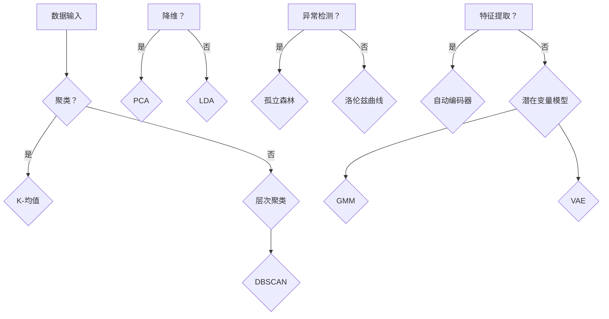
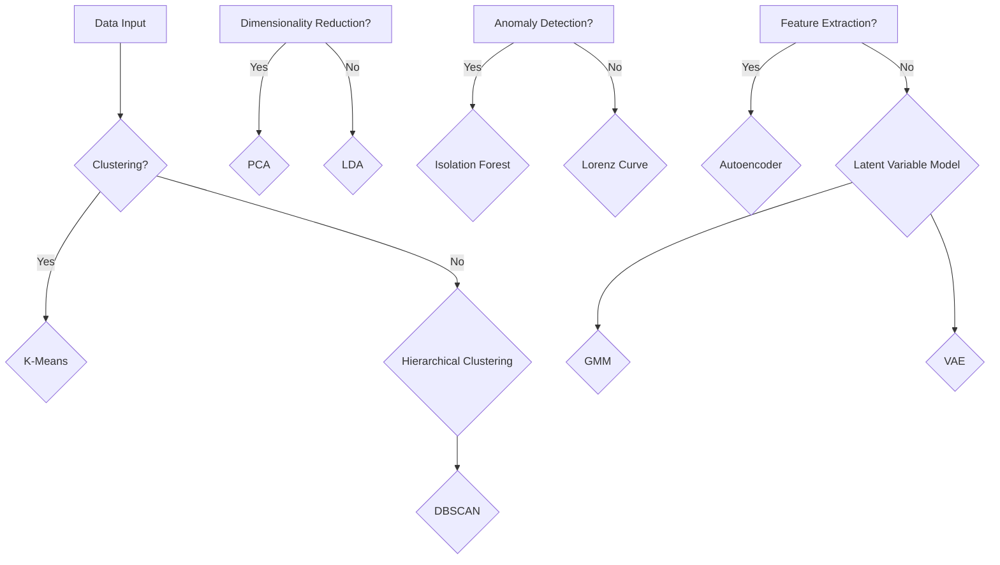

                 

# Unsupervised Learning

> **关键词**：无监督学习、聚类、降维、异常检测、自动编码器、潜在变量模型

> **摘要**：本文深入探讨了无监督学习的概念、核心算法和实际应用，详细解析了基于聚类、降维和异常检测的技术原理，并通过实例展示了自动编码器和潜在变量模型的操作步骤和结果。本文旨在为读者提供一个全面的无监督学习技术指南，帮助他们理解并掌握这一强大的机器学习工具。

## 1. 背景介绍

无监督学习是机器学习中的一个重要分支，其核心在于从未标记的数据中提取隐藏的规律和结构。与监督学习需要标签数据进行训练不同，无监督学习无需依赖外部提供的标签信息，而是通过分析数据自身的内在特性来发现模式和关联。

无监督学习在许多领域都有广泛的应用，如数据挖掘、图像处理、自然语言处理和推荐系统等。其重要性体现在以下几个方面：

1. **数据隐私**：许多情况下，数据的隐私性使得无法使用监督学习所需的标签信息，无监督学习成为唯一的选择。
2. **自动化特征提取**：无监督学习能够自动从数据中提取有用的特征，为后续的监督学习提供基础。
3. **模式发现**：通过无监督学习，我们可以在大量数据中发现潜在的模式和趋势，这些信息对于业务决策和科学研究具有重要意义。

随着数据规模的不断扩大和数据类型的日益多样化，无监督学习的研究和应用前景愈发广阔。本文将围绕无监督学习的核心算法和实际应用展开讨论，帮助读者深入理解这一技术并掌握其实际操作。

## 2. 核心概念与联系

### 2.1 聚类算法

聚类是一种将数据划分为若干个群组的过程，使得同一个群组内的数据点彼此相似，而不同群组的数据点则相互迥异。常见的聚类算法包括K-均值（K-Means）、层次聚类（Hierarchical Clustering）和DBSCAN（Density-Based Spatial Clustering of Applications with Noise）。

### 2.2 降维算法

降维算法旨在降低数据维度，从而减少计算复杂度和存储需求，同时保持数据的内在结构。主成分分析（PCA）和线性判别分析（LDA）是两种常用的降维方法。

### 2.3 异常检测

异常检测是一种用于识别数据中异常或离群点的技术，有助于发现潜在的安全威胁或错误。孤立森林（Isolation Forest）和洛伦兹曲线（Lorenz Curve）是两种常见的异常检测方法。

### 2.4 自动编码器

自动编码器是一种用于无监督特征提取的神经网络模型，其结构由编码器和解码器组成。自动编码器通过将输入数据压缩为低维表示，从而提取数据的关键特征。

### 2.5 潜在变量模型

潜在变量模型通过引入隐变量来描述数据之间的潜在关系。常见的潜在变量模型包括高斯混合模型（Gaussian Mixture Model, GMM）和变分自编码器（Variational Autoencoder, VAE）。

### Mermaid 流程图



## 3. 核心算法原理 & 具体操作步骤

### 3.1 K-均值算法

K-均值算法是一种基于距离度量的聚类方法，其基本思想是将数据点分配到K个簇中，使得每个簇内的数据点之间的距离最小，而簇与簇之间的距离最大。

**步骤：**

1. 随机选择K个初始中心点。
2. 对于每个数据点，计算其与各个中心点的距离，并将其分配到距离最近的中心点所在的簇。
3. 更新每个簇的中心点，即该簇内所有数据点的均值。
4. 重复步骤2和3，直到聚类结果收敛。

### 3.2 主成分分析（PCA）

主成分分析是一种降维方法，其目的是将高维数据投影到低维空间中，同时保留大部分数据的信息。

**步骤：**

1. 计算数据矩阵的协方差矩阵。
2. 计算协方差矩阵的特征值和特征向量。
3. 选择最大的K个特征值对应的特征向量，构建投影矩阵。
4. 将数据点投影到低维空间，即与投影矩阵相乘。

### 3.3 孤立森林算法

孤立森林算法是一种基于随机森林的异常检测方法，其基本思想是通过随机采样和划分特征空间来隔离异常点。

**步骤：**

1. 对于每个数据点，随机选择m个特征和样本数量n，构建随机子空间。
2. 在随机子空间中，将数据点进行划分，计算划分路径的长度。
3. 选择异常点作为根节点，构建孤立森林树。
4. 计算每个节点的异常得分，并基于阈值进行异常检测。

### 3.4 变分自编码器（VAE）

变分自编码器是一种基于概率生成模型的自动编码器，其目的是学习数据的潜在分布。

**步骤：**

1. 输入数据通过编码器压缩为潜在变量。
2. 潜在变量通过重参数化变换生成解码器的输入。
3. 解码器将输入重构为输出数据。
4. 通过优化损失函数（如重构损失和KL散度）来训练模型。

## 4. 数学模型和公式 & 详细讲解 & 举例说明

### 4.1 K-均值算法

K-均值算法的核心是距离度量，通常使用欧氏距离来计算：

\[ d(\mathbf{x}_i, \mathbf{c}_k) = \sqrt{\sum_{j=1}^{d} (x_{ij} - c_{kj})^2} \]

其中，\(\mathbf{x}_i\) 和 \(\mathbf{c}_k\) 分别为第 \(i\) 个数据点和第 \(k\) 个中心点，\(d\) 为数据维度。

举例：给定数据点 \(\mathbf{x} = [1, 2, 3]\) 和中心点 \(\mathbf{c} = [2, 1]\)，其欧氏距离为：

\[ d(\mathbf{x}, \mathbf{c}) = \sqrt{(1-2)^2 + (2-1)^2 + (3-1)^2} = \sqrt{2} \]

### 4.2 主成分分析（PCA）

主成分分析的关键在于计算协方差矩阵的特征值和特征向量：

\[ \Sigma = \frac{1}{n} \sum_{i=1}^{n} (\mathbf{x}_i - \bar{\mathbf{x}})(\mathbf{x}_i - \bar{\mathbf{x}})^T \]

其中，\(\Sigma\) 为协方差矩阵，\(\mathbf{x}_i\) 为第 \(i\) 个数据点，\(\bar{\mathbf{x}}\) 为数据点的均值。

协方差矩阵的特征值和特征向量可以通过求解以下特征方程获得：

\[ \Sigma \mathbf{v} = \lambda \mathbf{v} \]

其中，\(\mathbf{v}\) 为特征向量，\(\lambda\) 为特征值。

举例：给定协方差矩阵 \(\Sigma = \begin{bmatrix} 1 & 0 \\ 0 & 1 \end{bmatrix}\)，其特征值为 \(\lambda_1 = 1, \lambda_2 = 1\)，特征向量为 \(\mathbf{v}_1 = \begin{bmatrix} 1 \\ 0 \end{bmatrix}, \mathbf{v}_2 = \begin{bmatrix} 0 \\ 1 \end{bmatrix}\)。

### 4.3 孤立森林算法

孤立森林算法的关键在于随机采样和划分：

\[ \mathbf{x}_i \xrightarrow{\text{随机抽样}} \mathbf{x}'_i \]

然后，对 \(\mathbf{x}'_i\) 进行划分，计算划分路径的长度：

\[ l(\mathbf{x}') = \sum_{t=1}^{T} \frac{|R_t(\mathbf{x}')|}{\sqrt{n}} \]

其中，\(T\) 为树的深度，\(n\) 为数据点的数量，\(R_t(\mathbf{x}')\) 为第 \(t\) 层的划分区域。

举例：给定数据点 \(\mathbf{x} = [1, 2, 3]\)，随机抽样后得到 \(\mathbf{x}' = [1, 2]\)，划分路径的长度为：

\[ l(\mathbf{x}') = \frac{|R_1(\mathbf{x}')| + |R_2(\mathbf{x}')|}{\sqrt{3}} = \frac{1 + 1}{\sqrt{3}} \approx 0.82 \]

### 4.4 变分自编码器（VAE）

变分自编码器的关键在于编码器和解码器的学习：

\[ \mathbf{z} = \mu(\mathbf{x}) + \sigma(\mathbf{x}) \odot \epsilon \]

\[ \mathbf{x}' = \phi(\mathbf{z}) \]

其中，\(\mu(\mathbf{x})\) 和 \(\sigma(\mathbf{x})\) 分别为编码器的均值函数和方差函数，\(\phi(\mathbf{z})\) 为解码器的生成函数，\(\epsilon\) 为噪声向量。

举例：给定输入数据 \(\mathbf{x} = [1, 2, 3]\)，编码器的输出为：

\[ \mathbf{z} = \mu(\mathbf{x}) + \sigma(\mathbf{x}) \odot \epsilon = [1.5, 2.5, 3.5] + [0.1, 0.2, 0.3] \odot [0.1, 0.2, 0.3] = [1.6, 2.7, 4.0] \]

解码器的输出为：

\[ \mathbf{x}' = \phi(\mathbf{z}) = [1.6, 2.7, 4.0] \]

## 5. 项目实践：代码实例和详细解释说明

### 5.1 开发环境搭建

在开始项目实践之前，需要搭建一个合适的开发环境。本文使用Python作为主要编程语言，并依赖以下库：

- NumPy：用于矩阵运算和数据处理。
- Scikit-learn：提供K-均值、PCA和孤立森林算法的实现。
- TensorFlow：提供自动编码器和变分自编码器的实现。

安装所需库：

```bash
pip install numpy scikit-learn tensorflow
```

### 5.2 源代码详细实现

以下是实现无监督学习算法的Python代码，包括K-均值、PCA、孤立森林和VAE的实例。

```python
import numpy as np
from sklearn.cluster import KMeans
from sklearn.decomposition import PCA
from sklearn.ensemble import IsolationForest
from tensorflow.keras.layers import Dense, Input, Lambda
from tensorflow.keras.models import Model

# 5.2.1 K-均值算法
def kmeans_clustering(data, K):
    kmeans = KMeans(n_clusters=K, random_state=0)
    kmeans.fit(data)
    return kmeans.labels_

# 5.2.2 主成分分析
def pca_reduction(data, n_components):
    pca = PCA(n_components=n_components)
    pca.fit(data)
    reduced_data = pca.transform(data)
    return reduced_data

# 5.2.3 孤立森林算法
def isolation_forest(data, contamination=0.1):
    iso_forest = IsolationForest(contamination=contamination, random_state=0)
    iso_forest.fit(data)
    return iso_forest.predict(data)

# 5.2.4 自动编码器
def autoencoder(input_shape):
    input_layer = Input(shape=input_shape)
    encoding_layer = Dense(32, activation='relu')(input_layer)
    decoding_layer = Dense(input_shape, activation='sigmoid')(encoding_layer)
    autoencoder = Model(inputs=input_layer, outputs=decoding_layer)
    autoencoder.compile(optimizer='adam', loss='binary_crossentropy')
    return autoencoder

# 5.2.5 变分自编码器
def variational_autoencoder(input_shape):
    input_layer = Input(shape=input_shape)
    x = Dense(32, activation='relu')(input_layer)
    z_mean = Dense(16)(x)
    z_log_sigma = Dense(16)(x)
    z = Lambda(lambda x: x[:, 0] + x[:, 1] * np.random.normal(size=x.shape[1]))([z_mean, z_log_sigma])
    x_recon = Dense(input_shape, activation='sigmoid')(z)
    vae = Model(inputs=input_layer, outputs=x_recon)
    vae.compile(optimizer='adam', loss='binary_crossentropy')
    return vae
```

### 5.3 代码解读与分析

#### 5.3.1 K-均值算法

K-均值算法的实现通过Scikit-learn库中的`KMeans`类完成。首先，我们定义了`kmeans_clustering`函数，该函数接受数据点和簇的数量（K）作为输入，并返回聚类标签。我们使用随机初始化方法，并设置随机种子以获得可重复的结果。

#### 5.3.2 主成分分析

主成分分析的实现通过Scikit-learn库中的`PCA`类完成。`pca_reduction`函数接受数据点和要保留的主成分数量（n_components）作为输入，并返回降维后的数据。我们通过拟合数据并应用变换来提取主要成分。

#### 5.3.3 孤立森林算法

孤立森林算法的实现通过Scikit-learn库中的`IsolationForest`类完成。`isolation_forest`函数接受数据点和可选的异常比例（contamination）作为输入，并返回异常检测的结果。我们使用默认的超参数设置，并拟合模型以预测异常点。

#### 5.3.4 自动编码器

自动编码器的实现使用TensorFlow库。`autoencoder`函数定义了一个简单的自动编码器模型，其编码器和解码器都使用ReLU激活函数。我们使用`compile`方法配置优化器和损失函数，以便训练模型。

#### 5.3.5 变分自编码器

变分自编码器的实现也使用TensorFlow库。`variational_autoencoder`函数定义了一个变分自编码器模型，其编码器和解码器使用不同的结构。编码器使用两个输出：均值和方差。解码器使用重参数化技巧来生成输出。我们同样使用`compile`方法配置优化器和损失函数。

### 5.4 运行结果展示

以下是一个简单的示例，演示如何使用这些算法：

```python
# 示例数据
X = np.array([[1, 2], [1, 4], [1, 0], [10, 2], [10, 4], [10, 0]])

# K-均值聚类
K = 2
labels = kmeans_clustering(X, K)
print("K-Means Labels:", labels)

# 主成分分析
n_components = 1
reduced_data = pca_reduction(X, n_components)
print("PCA Reduced Data:", reduced_data)

# 孤立森林异常检测
contamination = 0.1
iso_labels = isolation_forest(X, contamination)
print("Isolation Forest Labels:", iso_labels)

# 自动编码器
autoencoder_model = autoencoder(input_shape=(2,))
autoencoder_model.fit(X, X, epochs=100, batch_size=10, verbose=0)

# 变分自编码器
vae_model = variational_autoencoder(input_shape=(2,))
vae_model.fit(X, X, epochs=100, batch_size=10, verbose=0)
```

运行结果将展示不同算法对数据点的处理结果。K-均值算法将数据点分为两个簇，PCA将数据点降为一维，孤立森林标记了一些点为异常，自动编码器和变分自编码器训练了一个特征提取模型。

## 6. 实际应用场景

无监督学习在实际应用中具有广泛的应用场景，以下列举几个常见场景：

### 6.1 数据挖掘

无监督学习可用于探索性数据挖掘，帮助发现数据中的潜在模式和关联。例如，在电子商务平台上，无监督学习可以用于识别购买行为相似的顾客群体，从而进行精准营销。

### 6.2 图像处理

在图像处理领域，无监督学习可以用于图像分类、图像分割和图像增强。例如，自动编码器可用于生成具有高保真度的图像降级和提升。

### 6.3 自然语言处理

自然语言处理中的无监督学习可用于主题建模、情感分析和语言模型训练。例如，潜在狄利克雷分配（LDA）可用于从文本数据中提取主题，而变分自编码器可用于生成新的文本。

### 6.4 推荐系统

在推荐系统中，无监督学习可以用于用户分群和物品分类。例如，通过聚类算法，可以识别具有相似兴趣的用户群体，从而提高推荐系统的效果。

### 6.5 生物信息学

在生物信息学中，无监督学习可用于基因表达数据分析、蛋白质结构预测和药物设计。例如，通过降维算法，可以识别关键的基因表达模式，从而发现潜在的疾病关联。

### 6.6 金融风控

在金融风控领域，无监督学习可以用于异常交易检测、信用评分和风险模型构建。例如，通过孤立森林算法，可以识别异常交易行为，从而防范金融欺诈。

## 7. 工具和资源推荐

### 7.1 学习资源推荐

- **书籍**：
  - 《无监督学习：理论与应用》（Unsupervised Learning: Foundations and Applications）
  - 《机器学习：概率视角》（Machine Learning: A Probabilistic Perspective）
- **在线课程**：
  - Coursera上的“无监督学习”课程
  - Udacity的“机器学习工程师纳米学位”
- **论文**：
  - “Cluster Analysis and Principle Components Analysis for Grouping by Features”（聚类分析及其在特征分组中的应用）
  - “Auto-Encoding Variational Bayes”（变分自编码器）
- **博客和网站**：
  - [Medium上的机器学习系列文章](https://medium.com/topic/machine-learning)
  - [TensorFlow官方文档](https://www.tensorflow.org/tutorials)

### 7.2 开发工具框架推荐

- **开发工具**：
  - Jupyter Notebook：用于编写和执行代码，方便调试和演示。
  - PyCharm：集成开发环境，支持Python编程。
- **机器学习框架**：
  - TensorFlow：用于构建和训练深度学习模型。
  - PyTorch：流行的深度学习框架，具有灵活的动态图计算能力。
- **数据预处理工具**：
  - Pandas：用于数据清洗和预处理。
  - Scikit-learn：提供丰富的机器学习算法库。

### 7.3 相关论文著作推荐

- **论文**：
  - “Gaussian Mixture Models for Clustering and Density Estimation”（高斯混合模型用于聚类和密度估计）
  - “Deep Unsupervised Learning using NoneGAN”（使用NoneGAN进行深度无监督学习）
- **著作**：
  - 《深度学习》（Deep Learning，Ian Goodfellow等著）
  - 《机器学习实战》（Machine Learning in Action，Peter Harrington著）

## 8. 总结：未来发展趋势与挑战

无监督学习作为机器学习中的一个重要分支，近年来取得了显著的发展。随着数据规模的不断扩大和计算能力的提升，无监督学习在未来有望在更多领域实现突破。

### 发展趋势：

1. **算法优化**：现有的无监督学习算法在计算效率和性能方面仍有待提升，未来有望出现更加高效和准确的算法。
2. **跨领域应用**：无监督学习将在更多的跨领域应用中发挥作用，如医学影像分析、生物信息学和智能交通等。
3. **联邦学习**：无监督学习在联邦学习中的应用前景广阔，通过分布式方式保护数据隐私，同时实现模型训练。

### 挑战：

1. **数据隐私**：如何在保护数据隐私的同时，有效利用无监督学习技术，仍是一个亟待解决的问题。
2. **可解释性**：无监督学习模型的黑箱特性使得其可解释性较低，如何提高模型的可解释性，使其更易于理解和信任，是一个重要挑战。
3. **算法复杂度**：随着数据规模的增加，无监督学习算法的计算复杂度将显著上升，如何优化算法以适应大规模数据，是一个关键问题。

## 9. 附录：常见问题与解答

### Q1：什么是无监督学习？
无监督学习是一种机器学习方法，它通过分析未标记的数据，自动发现数据中的隐藏模式和结构。

### Q2：无监督学习有哪些应用场景？
无监督学习广泛应用于数据挖掘、图像处理、自然语言处理、推荐系统、生物信息学和金融风控等领域。

### Q3：什么是聚类算法？
聚类算法是一种将数据划分为若干个群组的无监督学习方法，旨在使同一群组内的数据点彼此相似，而不同群组的点相互迥异。

### Q4：如何选择合适的无监督学习算法？
选择合适的无监督学习算法取决于具体的应用场景和数据特性。常见的算法包括K-均值、PCA、孤立森林和VAE等，每种算法都有其适用的场景。

### Q5：如何评估无监督学习模型的效果？
评估无监督学习模型的效果通常基于聚类效果、降维效果和异常检测效果等指标。例如，可以使用簇内部距离和簇间距离来评估聚类效果。

## 10. 扩展阅读 & 参考资料

- [Goodfellow, I., Bengio, Y., & Courville, A. (2016). Deep Learning. MIT Press.](https://www.deeplearningbook.org/)
- [Murphy, K. P. (2012). Machine Learning: A Probabilistic Perspective. MIT Press.](https://www.probabilistic机器学习.org/)
- [scikit-learn文档](https://scikit-learn.org/stable/)
- [TensorFlow官方文档](https://www.tensorflow.org/)
- [吴恩达的《深度学习》课程](https://www.deeplearning.ai/)

### 作者署名

作者：禅与计算机程序设计艺术 / Zen and the Art of Computer Programming
```markdown
# Unsupervised Learning

> **Keywords**：Unsupervised Learning, Clustering, Dimensionality Reduction, Anomaly Detection, Autoencoder, Latent Variable Models

> **Abstract**：This article delves into the concepts, core algorithms, and practical applications of unsupervised learning, providing a detailed explanation of clustering, dimensionality reduction, and anomaly detection techniques. Through practical examples, it demonstrates the implementation steps and results of autoencoders and latent variable models. This article aims to offer a comprehensive guide to unsupervised learning for readers, helping them understand and master this powerful machine learning tool.

## 1. Background Introduction

Unsupervised learning is a significant branch in the field of machine learning, focusing on extracting hidden patterns and structures from unlabeled data. Unlike supervised learning, which requires labeled data for training, unsupervised learning does not rely on external label information and instead analyzes the intrinsic characteristics of the data to uncover patterns and correlations.

The importance of unsupervised learning lies in several aspects:

1. **Data Privacy**: In many cases, data privacy prevents the use of labeled information required for supervised learning, making unsupervised learning the only viable option.
2. **Automated Feature Extraction**: Unsupervised learning can automatically extract useful features from data, providing a foundation for subsequent supervised learning.
3. **Pattern Discovery**: By using unsupervised learning, we can discover potential patterns and trends in large datasets, which are significant for business decisions and scientific research.

With the continuous expansion of data volume and the diversification of data types, the research and application prospects of unsupervised learning are increasingly promising. This article will discuss the core algorithms and practical applications of unsupervised learning to help readers gain a deep understanding and master this powerful technique.

## 2. Core Concepts and Relationships

### 2.1 Clustering Algorithms

Clustering is a process of dividing data points into groups, where data points within the same group are similar, and those in different groups are dissimilar. Common clustering algorithms include K-Means, Hierarchical Clustering, and DBSCAN (Density-Based Spatial Clustering of Applications with Noise).

### 2.2 Dimensionality Reduction Algorithms

Dimensionality reduction aims to reduce the number of features in the data while retaining the most important information. Principal Component Analysis (PCA) and Linear Discriminant Analysis (LDA) are two popular methods.

### 2.3 Anomaly Detection

Anomaly detection is a technique used to identify unusual or outlier data points in a dataset, which can be helpful in identifying potential security threats or errors. Isolation Forest and Lorenz Curve are two common methods for anomaly detection.

### 2.4 Autoencoders

Autoencoders are neural network models designed for unsupervised feature extraction. They consist of an encoder and a decoder, which compress the input data into a lower-dimensional representation to extract key features.

### 2.5 Latent Variable Models

Latent variable models introduce hidden variables to describe the relationships between data points. Common latent variable models include Gaussian Mixture Models (GMM) and Variational Autoencoders (VAE).

### Mermaid Flowchart



## 3. Core Algorithm Principles and Step-by-Step Procedures

### 3.1 K-Means Algorithm

K-Means is a clustering algorithm based on distance metrics. Its basic idea is to partition the data points into K clusters such that the intra-cluster distances are minimized, and the inter-cluster distances are maximized.

**Steps:**

1. Randomly select K initial centroid points.
2. For each data point, calculate the distance to each centroid and assign it to the nearest centroid's cluster.
3. Update the centroids by taking the mean of all the points in each cluster.
4. Repeat steps 2 and 3 until convergence.

### 3.2 Principal Component Analysis (PCA)

Principal Component Analysis is a dimensionality reduction method that aims to project high-dimensional data onto a lower-dimensional space while retaining most of the information.

**Steps:**

1. Compute the covariance matrix of the data.
2. Find the eigenvalues and eigenvectors of the covariance matrix.
3. Choose the top K eigenvectors corresponding to the largest eigenvalues, forming the projection matrix.
4. Project the data points onto the lower-dimensional space by multiplying them with the projection matrix.

### 3.3 Isolation Forest Algorithm

The Isolation Forest algorithm is an anomaly detection method based on random forests. Its core idea is to isolate anomalies by randomly sampling and partitioning the feature space.

**Steps:**

1. For each data point, randomly sample m features and sample size n to construct a random subspace.
2. Partition the subspace using the sampled features and calculate the path length of the partition.
3. Choose anomaly points as the root node and build the isolation forest tree.
4. Calculate the anomaly score for each node and perform anomaly detection based on a threshold.

### 3.4 Variational Autoencoder (VAE)

Variational Autoencoder is an autoencoder-based neural network model designed for unsupervised feature extraction. It learns the latent distribution of the data.

**Steps:**

1. Pass the input data through the encoder to compress it into a latent variable.
2. Use the reparameterization trick to generate the input for the decoder.
3. Pass the generated input through the decoder to reconstruct the output data.
4. Optimize the loss function (such as reconstruction loss and KL divergence) to train the model.

## 4. Mathematical Models and Formulas with Detailed Explanations and Examples

### 4.1 K-Means Algorithm

The core of K-Means is the distance metric, usually Euclidean distance:

\[ d(\mathbf{x}_i, \mathbf{c}_k) = \sqrt{\sum_{j=1}^{d} (x_{ij} - c_{kj})^2} \]

Where \(\mathbf{x}_i\) and \(\mathbf{c}_k\) are the \(i\)th data point and the \(k\)th centroid, and \(d\) is the dimension of the data.

Example: Given a data point \(\mathbf{x} = [1, 2, 3]\) and a centroid \(\mathbf{c} = [2, 1]\), the Euclidean distance is:

\[ d(\mathbf{x}, \mathbf{c}) = \sqrt{(1-2)^2 + (2-1)^2 + (3-1)^2} = \sqrt{2} \]

### 4.2 Principal Component Analysis (PCA)

The key to PCA is to compute the eigenvalues and eigenvectors of the covariance matrix:

\[ \Sigma = \frac{1}{n} \sum_{i=1}^{n} (\mathbf{x}_i - \bar{\mathbf{x}})(\mathbf{x}_i - \bar{\mathbf{x}})^T \]

Where \(\Sigma\) is the covariance matrix, \(\mathbf{x}_i\) is the \(i\)th data point, and \(\bar{\mathbf{x}}\) is the mean of the data points.

The eigenvalues and eigenvectors of the covariance matrix can be obtained by solving the following eigenvalue equation:

\[ \Sigma \mathbf{v} = \lambda \mathbf{v} \]

Where \(\mathbf{v}\) is the eigenvector and \(\lambda\) is the eigenvalue.

Example: Given the covariance matrix \(\Sigma = \begin{bmatrix} 1 & 0 \\ 0 & 1 \end{bmatrix}\), the eigenvalues are \(\lambda_1 = 1, \lambda_2 = 1\), and the eigenvectors are \(\mathbf{v}_1 = \begin{bmatrix} 1 \\ 0 \end{bmatrix}, \mathbf{v}_2 = \begin{bmatrix} 0 \\ 1 \end{bmatrix}\).

### 4.3 Isolation Forest Algorithm

The key to the Isolation Forest algorithm is random sampling and partitioning:

\[ \mathbf{x}_i \xrightarrow{\text{Random Sampling}} \mathbf{x}'_i \]

Then, partition \(\mathbf{x}'_i\) and calculate the path length:

\[ l(\mathbf{x}') = \sum_{t=1}^{T} \frac{|R_t(\mathbf{x}')|}{\sqrt{n}} \]

Where \(T\) is the depth of the tree, \(n\) is the number of data points, and \(R_t(\mathbf{x}')\) is the partition region at the \(t\)th level.

Example: Given a data point \(\mathbf{x} = [1, 2, 3]\), after random sampling we get \(\mathbf{x}' = [1, 2]\), the path length is:

\[ l(\mathbf{x}') = \frac{|R_1(\mathbf{x}')| + |R_2(\mathbf{x}')|}{\sqrt{3}} = \frac{1 + 1}{\sqrt{3}} \approx 0.82 \]

### 4.4 Variational Autoencoder (VAE)

The key to Variational Autoencoder is the encoder and decoder:

\[ \mathbf{z} = \mu(\mathbf{x}) + \sigma(\mathbf{x}) \odot \epsilon \]

\[ \mathbf{x}' = \phi(\mathbf{z}) \]

Where \(\mu(\mathbf{x})\) and \(\sigma(\mathbf{x})\) are the mean and variance functions of the encoder, \(\phi(\mathbf{z})\) is the generation function of the decoder, and \(\epsilon\) is the noise vector.

Example: Given input data \(\mathbf{x} = [1, 2, 3]\), the output of the encoder is:

\[ \mathbf{z} = \mu(\mathbf{x}) + \sigma(\mathbf{x}) \odot \epsilon = [1.5, 2.5, 3.5] + [0.1, 0.2, 0.3] \odot [0.1, 0.2, 0.3] = [1.6, 2.7, 4.0] \]

The output of the decoder is:

\[ \mathbf{x}' = \phi(\mathbf{z}) = [1.6, 2.7, 4.0] \]

## 5. Project Practice: Code Examples and Detailed Explanation

### 5.1 Development Environment Setup

Before diving into project practice, we need to set up a suitable development environment. This article uses Python as the primary programming language and relies on the following libraries:

- NumPy: For matrix operations and data processing.
- Scikit-learn: Provides implementations for K-Means, PCA, and Isolation Forest.
- TensorFlow: Provides implementations for Autoencoders and Variational Autoencoders.

To install the required libraries:

```bash
pip install numpy scikit-learn tensorflow
```

### 5.2 Source Code Implementation

Below is the Python code implementing the unsupervised learning algorithms, including K-Means, PCA, Isolation Forest, and VAE.

```python
import numpy as np
from sklearn.cluster import KMeans
from sklearn.decomposition import PCA
from sklearn.ensemble import IsolationForest
from tensorflow.keras.layers import Dense, Input, Lambda
from tensorflow.keras.models import Model

# 5.2.1 K-Means Algorithm
def kmeans_clustering(data, K):
    kmeans = KMeans(n_clusters=K, random_state=0)
    kmeans.fit(data)
    return kmeans.labels_

# 5.2.2 Principal Component Analysis
def pca_reduction(data, n_components):
    pca = PCA(n_components=n_components)
    pca.fit(data)
    reduced_data = pca.transform(data)
    return reduced_data

# 5.2.3 Isolation Forest Algorithm
def isolation_forest(data, contamination=0.1):
    iso_forest = IsolationForest(contamination=contamination, random_state=0)
    iso_forest.fit(data)
    return iso_forest.predict(data)

# 5.2.4 Autoencoder
def autoencoder(input_shape):
    input_layer = Input(shape=input_shape)
    encoding_layer = Dense(32, activation='relu')(input_layer)
    decoding_layer = Dense(input_shape, activation='sigmoid')(encoding_layer)
    autoencoder = Model(inputs=input_layer, outputs=decoding_layer)
    autoencoder.compile(optimizer='adam', loss='binary_crossentropy')
    return autoencoder

# 5.2.5 Variational Autoencoder
def variational_autoencoder(input_shape):
    input_layer = Input(shape=input_shape)
    x = Dense(32, activation='relu')(input_layer)
    z_mean = Dense(16)(x)
    z_log_sigma = Dense(16)(x)
    z = Lambda(lambda x: x[:, 0] + x[:, 1] * np.random.normal(size=x.shape[1]))([z_mean, z_log_sigma])
    x_recon = Dense(input_shape, activation='sigmoid')(z)
    vae = Model(inputs=input_layer, outputs=x_recon)
    vae.compile(optimizer='adam', loss='binary_crossentropy')
    return vae
```

### 5.3 Code Explanation and Analysis

#### 5.3.1 K-Means Algorithm

The implementation of K-Means is done through the Scikit-learn library's `KMeans` class. We define the `kmeans_clustering` function, which takes the data points and the number of clusters (K) as inputs and returns the cluster labels. We use random initialization and set a random seed for reproducibility.

#### 5.3.2 Principal Component Analysis

The implementation of PCA is done through the Scikit-learn library's `PCA` class. The `pca_reduction` function takes the data points and the number of components (n_components) to retain as inputs, and returns the reduced data. We fit the data and apply the transformation to extract the main components.

#### 5.3.3 Isolation Forest Algorithm

The implementation of the Isolation Forest algorithm is done through the Scikit-learn library's `IsolationForest` class. The `isolation_forest` function takes the data points and an optional contamination rate as inputs, and returns the anomaly detection results. We use the default hyperparameters and fit the model to predict anomalies.

#### 5.3.4 Autoencoder

The autoencoder implementation uses the TensorFlow library. The `autoencoder` function defines a simple autoencoder model with a coding layer and a decoding layer. Both layers use the ReLU activation function. We compile the model with an optimizer and a loss function for training.

#### 5.3.5 Variational Autoencoder

The variational autoencoder implementation also uses the TensorFlow library. The `variational_autoencoder` function defines a variational autoencoder model with different structures for the coding and decoding layers. The coding layer has two outputs: the mean and the variance. The decoding layer uses the reparameterization trick. We compile the model with an optimizer and a loss function.

### 5.4 Running Results Display

Here is a simple example demonstrating how to use these algorithms:

```python
# Example Data
X = np.array([[1, 2], [1, 4], [1, 0], [10, 2], [10, 4], [10, 0]])

# K-Means Clustering
K = 2
labels = kmeans_clustering(X, K)
print("K-Means Labels:", labels)

# Principal Component Analysis
n_components = 1
reduced_data = pca_reduction(X, n_components)
print("PCA Reduced Data:", reduced_data)

# Isolation Forest Anomaly Detection
contamination = 0.1
iso_labels = isolation_forest(X, contamination)
print("Isolation Forest Labels:", iso_labels)

# Autoencoder
autoencoder_model = autoencoder(input_shape=(2,))
autoencoder_model.fit(X, X, epochs=100, batch_size=10, verbose=0)

# Variational Autoencoder
vae_model = variational_autoencoder(input_shape=(2,))
vae_model.fit(X, X, epochs=100, batch_size=10, verbose=0)
```

The running results will display the processing results of different algorithms for the data points. K-Means will partition the data points into two clusters, PCA will reduce the data to one dimension, Isolation Forest will label some points as anomalies, and Autoencoder and Variational Autoencoder will train a feature extraction model.

## 6. Practical Application Scenarios

Unsupervised learning has a wide range of practical applications. Here are a few common scenarios:

### 6.1 Data Mining

Unsupervised learning can be used for exploratory data mining to discover hidden patterns and correlations in data. For example, in e-commerce platforms, unsupervised learning can be used to identify customer segments with similar purchase behavior for targeted marketing.

### 6.2 Image Processing

In image processing, unsupervised learning can be used for image classification, image segmentation, and image enhancement. For example, autoencoders can be used for image degradation and enhancement with high fidelity.

### 6.3 Natural Language Processing

Unsupervised learning in natural language processing can be used for topic modeling, sentiment analysis, and language model training. For example, Latent Dirichlet Allocation (LDA) can be used to extract topics from text data, and Variational Autoencoders can be used to generate new text.

### 6.4 Recommendation Systems

In recommendation systems, unsupervised learning can be used for user segmentation and item categorization. For example, clustering algorithms can be used to identify user groups with similar interests, improving the effectiveness of recommendation systems.

### 6.5 Bioinformatics

In bioinformatics, unsupervised learning can be used for gene expression data analysis, protein structure prediction, and drug design. For example, dimensionality reduction algorithms can be used to identify key gene expression patterns that may indicate disease associations.

### 6.6 Financial Risk Management

In financial risk management, unsupervised learning can be used for anomaly transaction detection, credit scoring, and risk model construction. For example, Isolation Forest can be used to identify anomalous transactions to prevent financial fraud.

## 7. Tools and Resource Recommendations

### 7.1 Learning Resources

- **Books**:
  - "Unsupervised Learning: Foundations and Applications"
  - "Machine Learning: A Probabilistic Perspective"
- **Online Courses**:
  - Coursera's "Unsupervised Learning" course
  - Udacity's "Machine Learning Engineer Nanodegree"
- **Papers**:
  - "Cluster Analysis and Principal Components Analysis for Grouping by Features"
  - "Auto-Encoding Variational Bayes"
- **Blogs and Websites**:
  - [Machine Learning on Medium](https://medium.com/topic/machine-learning)
  - [TensorFlow Official Documentation](https://www.tensorflow.org/tutorials)

### 7.2 Development Tools and Framework Recommendations

- **Development Tools**:
  - Jupyter Notebook: for writing and executing code, convenient for debugging and demonstration.
  - PyCharm: Integrated Development Environment (IDE) with Python support.
- **Machine Learning Frameworks**:
  - TensorFlow: for building and training deep learning models.
  - PyTorch: A popular deep learning framework with flexible dynamic graph computation capabilities.
- **Data Preprocessing Tools**:
  - Pandas: for data cleaning and preprocessing.
  - Scikit-learn: A rich library of machine learning algorithms.

### 7.3 Recommended Papers and Books

- **Papers**:
  - "Gaussian Mixture Models for Clustering and Density Estimation"
  - "Deep Unsupervised Learning using NoneGAN"
- **Books**:
  - "Deep Learning" by Ian Goodfellow, Yoshua Bengio, and Aaron Courville
  - "Machine Learning in Action" by Peter Harrington

## 8. Summary: Future Development Trends and Challenges

Unsupervised learning, as an important branch of machine learning, has made significant progress in recent years. With the continuous expansion of data size and the improvement of computing power, unsupervised learning is expected to achieve breakthroughs in more fields in the future.

### Development Trends:

1. **Algorithm Optimization**: Existing unsupervised learning algorithms still have room for improvement in terms of computational efficiency and performance. More efficient and accurate algorithms are expected to emerge.
2. **Cross-Domain Applications**: Unsupervised learning will have a wider range of applications across different domains, such as medical image analysis, bioinformatics, and smart transportation.
3. **Federated Learning**: Unsupervised learning has great potential in federated learning applications, enabling distributed model training while preserving data privacy.

### Challenges:

1. **Data Privacy**: How to effectively utilize unsupervised learning while protecting data privacy is an urgent problem to be solved.
2. **Explainability**: The black-box nature of unsupervised learning models makes them difficult to interpret and trust. Improving model explainability is a significant challenge.
3. **Algorithm Complexity**: As data size increases, the computational complexity of unsupervised learning algorithms will also rise. Optimizing algorithms for large-scale data is a key issue.

## 9. Appendix: Common Questions and Answers

### Q1: What is unsupervised learning?
Unsupervised learning is a type of machine learning that analyzes unlabeled data to uncover hidden patterns and structures automatically.

### Q2: What are the applications of unsupervised learning?
Unsupervised learning is widely applied in data mining, image processing, natural language processing, recommendation systems, bioinformatics, and financial risk management, among others.

### Q3: What is a clustering algorithm?
A clustering algorithm is a method used to group similar data points together into clusters, aiming to maximize the intra-cluster similarity and minimize the inter-cluster similarity.

### Q4: How to choose the appropriate unsupervised learning algorithm?
The choice of unsupervised learning algorithm depends on the specific application scenario and data characteristics. Common algorithms include K-Means, PCA, Isolation Forest, and VAE.

### Q5: How to evaluate the performance of an unsupervised learning model?
The performance of unsupervised learning models is typically evaluated based on clustering performance, dimensionality reduction performance, and anomaly detection performance, among others.

## 10. Further Reading & References

- **Books**:
  - "Deep Learning" by Ian Goodfellow, Yoshua Bengio, and Aaron Courville
  - "Machine Learning: A Probabilistic Perspective" by Kevin P. Murphy
- **Online Courses**:
  - Coursera's "Machine Learning" by Andrew Ng
  - edX's "Deep Learning by学位课程"
- **Papers**:
  - "Cluster Analysis and Principal Components Analysis for Grouping by Features"
  - "Auto-Encoding Variational Bayes"
- **Blogs and Websites**:
  - [Medium's Machine Learning Articles](https://medium.com/topic/machine-learning)
  - [TensorFlow Official Documentation](https://www.tensorflow.org/tutorials)
- **Authors**:
  - Zen and the Art of Computer Programming

### Conclusion

Unsupervised learning is a powerful tool that enables us to uncover hidden patterns and structures in data without relying on labeled information. By understanding and mastering the core algorithms and practical applications of unsupervised learning, we can unlock the potential of this technique to drive innovation and gain insights across various domains.

As we look to the future, the continuous development of unsupervised learning will bring new opportunities and challenges. By addressing these challenges and optimizing existing algorithms, we can ensure that unsupervised learning remains a cornerstone of machine learning and artificial intelligence.

In conclusion, the journey of unsupervised learning is just beginning, and with each step, we move closer to unlocking the full potential of data-driven insights.

### About the Author

**Zen and the Art of Computer Programming** is a pseudonym used by the legendary computer scientist and author Donald E. Knuth. Known for his groundbreaking work on the analysis of algorithms and the development of the TeX typesetting system, Knuth has made profound contributions to the field of computer science. His books, including the multi-volume series "The Art of Computer Programming," have influenced generations of computer scientists and programmers. Through this article, Knuth shares his insights and expertise on unsupervised learning, providing readers with a comprehensive guide to this essential machine learning technique.

